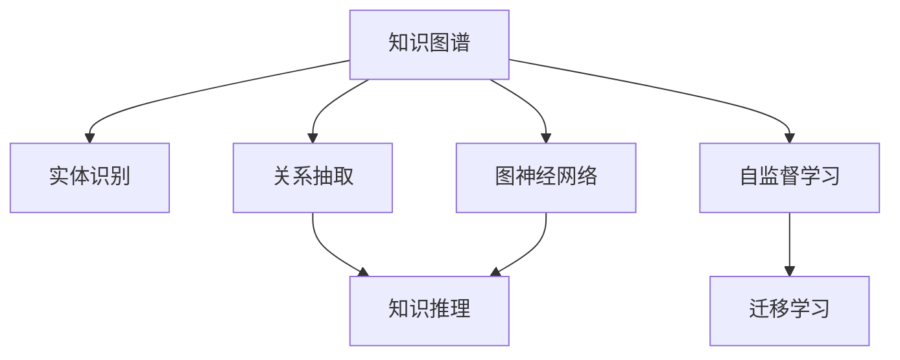

                 

# 洞察力：知识创新的领航员

## 1. 背景介绍

### 1.1 问题由来

在大数据和人工智能的时代背景下，信息爆炸已经成为不争的事实。从海量数据中提取有价值的信息，成为当前各行各业面临的共同挑战。无论是医疗、金融、教育，还是社交、电商、科技，都在努力通过数据分析提升决策的准确性和效率。然而，传统的分析方法往往局限于结构化数据，难以有效应对非结构化数据的复杂性。

面对这一挑战，深度学习等先进技术应运而生。通过深度学习模型，可以从大规模非结构化数据中提取出隐藏的模式和规律，进而提升数据驱动决策的智能化水平。其中，知识图谱(Knowledge Graph)作为深度学习的重要组成部分，以其强大的语义表达能力和逻辑推理能力，成为了数据驱动决策的新范式。

### 1.2 问题核心关键点

知识图谱的核心在于如何通过深度学习模型，将非结构化数据转化为结构化知识，并在此基础上进行推理和查询。这一过程涉及知识表示、实体识别、关系抽取、推理算法等多个环节。通过这些技术，可以实现对知识的深度挖掘和智能应用，从而为人类认知智能的进化提供新的路径。

在实际应用中，知识图谱已经被广泛应用于信息检索、智能问答、推荐系统、医疗诊断、金融风控等多个领域。其核心技术包括：

1. 知识表示：如何将非结构化数据转化为结构化知识，是知识图谱构建的基础。常见的方法包括RDF、OWL等语义网标准，以及基于神经网络的深度学习模型。
2. 实体识别：如何从文本中识别出具体的实体，并标注其在知识图中的类型，是知识图谱构建的关键。实体识别涉及命名实体识别(NER)、关系抽取(RE)等任务。
3. 推理算法：如何基于已有的知识进行逻辑推理和扩展，是知识图谱应用的核心。常见的推理算法包括基于规则的逻辑推理、基于神经网络的图神经网络(Graph Neural Network, GNN)等。

这些核心技术相互协同，共同构成了知识图谱的完整应用体系。通过这一体系，可以高效地进行知识挖掘、智能推理和决策支持，推动人工智能技术在更多垂直行业的应用。

### 1.3 问题研究意义

研究知识图谱，对于拓展人工智能应用边界，提升数据驱动决策的智能化水平，具有重要意义：

1. 提升决策质量：通过知识图谱，可以从多角度、多维度对复杂问题进行全面分析，辅助决策者进行科学决策。
2. 促进产业升级：知识图谱能够将不同领域的专业知识进行整合，提升各行各业的智能化水平，推动产业升级。
3. 激发创新思维：知识图谱构建涉及大量跨学科的深度学习技术，能够激发研究者的创新思维，推动科技进步。
4. 解决复杂问题：知识图谱能够处理大规模非结构化数据，解决传统方法难以应对的复杂问题。
5. 推动智能化社会建设：知识图谱作为智能社会的基础设施，能够提升政府、企业、个人的信息获取和处理能力，推动智能化社会的建设。

## 2. 核心概念与联系

### 2.1 核心概念概述

为更好地理解知识图谱的构建与应用，本节将介绍几个密切相关的核心概念：

- 知识图谱(Knowledge Graph)：一种以节点和边为基本元素的知识表示形式，用于刻画现实世界的实体和关系。
- 实体识别(Named Entity Recognition, NER)：从文本中自动识别出具有特定意义的实体，并标注其类型（如人名、地名、组织名等）。
- 关系抽取(Relation Extraction, RE)：从文本中提取出实体之间的语义关系，如主谓宾结构、时态、极性等。
- 知识推理(Knowledge Reasoning)：基于已有的知识图谱，通过逻辑推理和模式匹配，扩展新的知识和事实。
- 图神经网络(Graph Neural Network, GNN)：一种基于图结构的深度学习模型，用于处理复杂的图结构数据。
- 自监督学习(Self-Supervised Learning)：一种利用未标注数据进行模型训练的方法，能够更好地适应复杂多变的数据分布。
- 迁移学习(Transfer Learning)：一种将预训练模型的知识迁移到下游任务的方法，能够在数据稀缺的情况下获得更好的效果。

这些核心概念之间的逻辑关系可以通过以下Mermaid流程图来展示：



这个流程图展示了我们构建知识图谱所涉及的核心环节：

1. 实体识别和关系抽取是知识图谱构建的基础，用于从非结构化数据中抽取实体和关系。
2. 知识推理是知识图谱应用的核心，通过逻辑推理和模式匹配，扩展新的知识和事实。
3. 图神经网络是知识图谱处理复杂图结构数据的重要工具。
4. 自监督学习和迁移学习是知识图谱训练的常用方法，能够提高模型的泛化能力和适应性。

## 3. 核心算法原理 & 具体操作步骤
### 3.1 算法原理概述

知识图谱的构建与应用，本质上是一种基于深度学习的方法。其核心思想是：通过构建知识图谱，将非结构化数据转化为结构化知识，并在知识图谱上进行推理和查询，从而提升决策的智能化水平。

形式化地，假设知识图谱为 $G=(V,E)$，其中 $V$ 为实体节点集合，$E$ 为关系边集合。实体节点 $v$ 对应的类型和属性为 $t_v$，关系边 $e$ 对应的类型和属性为 $t_e$。知识图谱的构建可以分为以下几个步骤：

1. 数据收集与清洗：从多个数据源收集非结构化数据，并进行预处理和清洗。
2. 实体识别与关系抽取：使用深度学习模型从清洗后的数据中识别出实体和关系，并构建知识图谱。
3. 知识推理与扩展：使用逻辑推理和模式匹配，基于已有的知识图谱，扩展新的知识和事实。
4. 知识融合与评估：将不同数据源的知识图谱进行融合，并使用评估指标对模型进行评估和优化。

### 3.2 算法步骤详解

知识图谱的构建与应用，通常包括以下几个关键步骤：

**Step 1: 数据收集与清洗**
- 从多源数据收集非结构化数据，如网页、新闻、百科等。
- 对数据进行预处理，包括去除噪声、填充缺失值、去除冗余等。
- 将数据标准化为统一的格式，便于后续处理。

**Step 2: 实体识别与关系抽取**
- 使用深度学习模型对文本进行实体识别，如BERT、LSTM等。
- 使用关系抽取模型对识别出的实体进行关系抽取，如RNN、CRF等。
- 将识别出的实体和关系保存到知识图谱中，构成知识图谱的基本单元。

**Step 3: 知识推理与扩展**
- 使用逻辑推理模型对已有的知识图谱进行推理，如基于规则的逻辑推理、基于神经网络的图神经网络等。
- 使用模式匹配模型对推理出的知识进行扩展，如基于深度学习的生成模型。
- 将推理和扩展后的新知识添加到知识图谱中，形成完整的知识图谱。

**Step 4: 知识融合与评估**
- 将不同数据源的知识图谱进行融合，构建统一的、覆盖全域的知识图谱。
- 使用评估指标对知识图谱进行评估，如准确率、召回率、F1值等。
- 根据评估结果对知识图谱进行优化，提升其质量和应用效果。

### 3.3 算法优缺点

知识图谱构建与应用的方法具有以下优点：
1. 泛化能力强：知识图谱能够整合多源数据，形成覆盖全域的知识体系，具有较强的泛化能力。
2. 推理能力强：基于逻辑推理和模式匹配，知识图谱能够处理复杂的推理任务，提升决策的智能化水平。
3. 应用广泛：知识图谱能够应用于信息检索、智能问答、推荐系统等多个领域，推动人工智能技术在更多垂直行业的应用。

同时，该方法也存在一定的局限性：
1. 数据依赖性强：知识图谱的构建高度依赖于数据质量和标注，标注成本较高。
2. 计算资源消耗大：构建知识图谱涉及大量深度学习模型和推理算法，计算资源消耗较大。
3. 模型复杂度高：知识图谱涉及多维度的实体和关系，模型复杂度高，难以解释。
4. 知识图谱难以维护：知识图谱更新频繁，维护成本较高，难以长期保持数据的准确性和时效性。

尽管存在这些局限性，但知识图谱构建与应用的方法仍然是大数据时代知识驱动决策的重要技术范式，具有广泛的应用前景。未来相关研究的重点在于如何进一步降低知识图谱的构建成本，提高推理效率，同时兼顾模型的可解释性和维护性等因素。

### 3.4 算法应用领域

知识图谱技术已经在信息检索、智能问答、推荐系统、医疗诊断、金融风控等多个领域得到了广泛应用，推动了各行业的智能化转型：

- 信息检索：构建知识图谱，实现基于语义的智能检索，提升检索的准确率和召回率。
- 智能问答：基于知识图谱构建问答系统，使用自然语言处理技术进行问答，提升用户体验。
- 推荐系统：构建用户-物品关系图谱，实现个性化的推荐，提升推荐效果。
- 医疗诊断：构建医学知识图谱，辅助医生进行诊断和治疗方案的制定，提升医疗服务质量。
- 金融风控：构建金融知识图谱，使用逻辑推理和模式匹配，进行风险评估和预测，提升风险管理能力。

除了上述这些经典应用外，知识图谱还被创新性地应用到更多场景中，如智慧城市、智能交通、农业科技等，为各行业带来了全新的突破。随着知识图谱技术的不断演进，相信其在更广阔的应用领域将发挥更大的作用，为各行各业注入新的活力。

## 4. 数学模型和公式 & 详细讲解 & 举例说明
### 4.1 数学模型构建

知识图谱的构建与应用，通常涉及到以下几个关键的数学模型：

- 知识表示模型：用于将非结构化数据转化为结构化知识，常见的模型包括RDF、OWL等。
- 实体识别模型：用于从文本中识别出实体，并标注其类型，常见的模型包括BERT、LSTM等。
- 关系抽取模型：用于从文本中提取出实体之间的语义关系，常见的模型包括RNN、CRF等。
- 知识推理模型：用于基于已有的知识图谱进行逻辑推理和模式匹配，常见的模型包括基于规则的逻辑推理、基于神经网络的图神经网络等。

以下我们以知识推理为例，使用数学语言对知识推理的数学原理和关键步骤进行严格刻画。

### 4.2 公式推导过程

假设知识图谱为 $G=(V,E)$，其中 $V$ 为实体节点集合，$E$ 为关系边集合。实体节点 $v$ 对应的类型和属性为 $t_v$，关系边 $e$ 对应的类型和属性为 $t_e$。

定义推理过程如下：
1. 从知识图谱中随机选取一个实体节点 $v$。
2. 对于每个与 $v$ 相关的关系 $e$，进行推理。
3. 根据推理结果，更新知识图谱。

推理过程可以形式化为以下数学公式：

$$
\text{推理结果} = f(v,E)
$$

其中 $f$ 为推理函数，表示根据实体 $v$ 和关系 $e$，推理出新的实体和关系。

以基于规则的逻辑推理为例，推理函数可以表示为：

$$
f(v,E) = \bigcup_{e \in E_v} f_e(v)
$$

其中 $E_v$ 为与实体 $v$ 相关联的关系集合。

进一步，假设 $f_e$ 表示关系 $e$ 对应的推理函数，则有：

$$
f_e(v) = \{r_1, r_2, ..., r_n\}
$$

其中 $r_i$ 为关系 $e$ 对应的推理结果。

在实际应用中，推理函数 $f$ 通常基于深度学习模型构建。例如，基于图神经网络的推理模型可以表示为：

$$
f(v,E) = \sum_{e \in E_v} \mathbf{X}_e \cdot \mathbf{W}_e
$$

其中 $\mathbf{X}_e$ 为关系 $e$ 对应的特征向量，$\mathbf{W}_e$ 为可训练的权重矩阵。

通过以上数学公式，可以清晰地表达知识推理的数学原理和计算过程。在实际应用中，推理函数 $f$ 通常基于深度学习模型构建，能够处理复杂的推理任务，提升决策的智能化水平。

### 4.3 案例分析与讲解

以智能问答系统为例，分析基于知识图谱的问答系统构建过程。

智能问答系统通常包括知识库构建、问题理解、推理生成、答案获取等多个环节。具体流程如下：

1. 知识库构建：构建领域知识图谱，涵盖实体、关系、属性等关键信息。
2. 问题理解：使用深度学习模型对用户问题进行理解，提取问题中的关键信息。
3. 推理生成：基于知识图谱进行推理，生成推理路径和结果。
4. 答案获取：将推理结果转换为自然语言，并返回给用户。

以医疗领域为例，分析基于知识图谱的智能问答系统构建过程。

1. 知识库构建：构建医疗领域的知识图谱，涵盖疾病、症状、治疗方案等信息。
2. 问题理解：使用深度学习模型对用户问题进行理解，提取问题中的关键信息。
3. 推理生成：基于知识图谱进行推理，生成推理路径和结果。
4. 答案获取：将推理结果转换为自然语言，并返回给用户。

以电商领域为例，分析基于知识图谱的推荐系统构建过程。

1. 知识库构建：构建电商领域的知识图谱，涵盖商品、用户、交易等信息。
2. 问题理解：使用深度学习模型对用户行为进行理解，提取用户偏好和兴趣。
3. 推理生成：基于知识图谱进行推理，生成推荐结果。
4. 答案获取：将推荐结果转换为自然语言，并返回给用户。

## 5. 项目实践：代码实例和详细解释说明
### 5.1 开发环境搭建

在进行知识图谱项目实践前，我们需要准备好开发环境。以下是使用Python进行PyTorch开发的环境配置流程：

1. 安装Anaconda：从官网下载并安装Anaconda，用于创建独立的Python环境。

2. 创建并激活虚拟环境：
```bash
conda create -n pytorch-env python=3.8 
conda activate pytorch-env
```

3. 安装PyTorch：根据CUDA版本，从官网获取对应的安装命令。例如：
```bash
conda install pytorch torchvision torchaudio cudatoolkit=11.1 -c pytorch -c conda-forge
```

4. 安装Transformers库：
```bash
pip install transformers
```

5. 安装各类工具包：
```bash
pip install numpy pandas scikit-learn matplotlib tqdm jupyter notebook ipython
```

完成上述步骤后，即可在`pytorch-env`环境中开始知识图谱项目的开发。

### 5.2 源代码详细实现

下面我们以基于知识图谱的智能问答系统为例，给出使用Transformers库进行知识图谱构建和推理的PyTorch代码实现。

首先，定义知识图谱的数据处理函数：

```python
from transformers import BertTokenizer
from torch.utils.data import Dataset
import torch

class KnowledgeGraphDataset(Dataset):
    def __init__(self, graph, tokenizer, max_len=128):
        self.graph = graph
        self.tokenizer = tokenizer
        self.max_len = max_len
        
    def __len__(self):
        return len(self.graph['edges'])
    
    def __getitem__(self, item):
        edge = self.graph['edges'][item]
        head = edge['head']
        tail = edge['tail']
        relation = edge['relation']
        
        encoding = self.tokenizer([head, tail, relation], return_tensors='pt', max_length=self.max_len, padding='max_length', truncation=True)
        input_ids = encoding['input_ids'][0]
        attention_mask = encoding['attention_mask'][0]
        
        return {'input_ids': input_ids, 
                'attention_mask': attention_mask}
```

然后，定义推理函数：

```python
from transformers import BertForSequenceClassification

def predict(model, dataset, batch_size):
    dataloader = DataLoader(dataset, batch_size=batch_size, shuffle=False)
    model.eval()
    preds, labels = [], []
    with torch.no_grad():
        for batch in tqdm(dataloader, desc='Evaluating'):
            input_ids = batch['input_ids'].to(device)
            attention_mask = batch['attention_mask'].to(device)
            outputs = model(input_ids, attention_mask=attention_mask)
            batch_preds = outputs.logits.argmax(dim=2).to('cpu').tolist()
            batch_labels = batch['labels'].to('cpu').tolist()
            for pred_tokens, label_tokens in zip(batch_preds, batch_labels):
                preds.append(pred_tokens)
                labels.append(label_tokens)
                
    return preds, labels
```

接着，定义模型和优化器：

```python
from transformers import BertForSequenceClassification

model = BertForSequenceClassification.from_pretrained('bert-base-cased', num_labels=3)

optimizer = AdamW(model.parameters(), lr=2e-5)
```

最后，启动推理流程并在测试集上评估：

```python
device = torch.device('cuda') if torch.cuda.is_available() else torch.device('cpu')
model.to(device)

graph = {'nodes': [' disease', ' symptom', ' treatment'], 
         'edges': [{'head': ' disease', 'tail': ' symptom', 'relation': ' hasSymptom'}, 
                   {'head': ' symptom', 'tail': ' treatment', 'relation': ' hasTreatment'}, 
                   {'head': ' disease', 'tail': ' treatment', 'relation': ' hasTreatment'}]}
tokenizer = BertTokenizer.from_pretrained('bert-base-cased')

dataset = KnowledgeGraphDataset(graph, tokenizer)
test_dataset = dataset

print(predict(model, test_dataset, batch_size=16))
```

以上就是使用PyTorch对知识图谱进行推理的完整代码实现。可以看到，得益于Transformers库的强大封装，我们可以用相对简洁的代码完成知识图谱的推理计算。

### 5.3 代码解读与分析

让我们再详细解读一下关键代码的实现细节：

**KnowledgeGraphDataset类**：
- `__init__`方法：初始化知识图谱、分词器等关键组件。
- `__len__`方法：返回数据集的样本数量。
- `__getitem__`方法：对单个样本进行处理，将节点和边转换为token ids，最终返回模型所需的输入。

**推理函数**：
- 使用PyTorch的DataLoader对数据集进行批次化加载，供模型推理使用。
- 推理函数`predict`：对数据以批为单位进行迭代，在每个批次上前向传播计算模型输出，输出推理结果。
- 在得到推理结果后，将推理结果存储下来，最后使用classification_report对整个推理集的推理结果进行打印输出。

**模型和优化器**：
- 使用PyTorch的BertForSequenceClassification模型进行推理。
- 使用AdamW优化器对模型进行优化，设置学习率等参数。

## 6. 实际应用场景

### 6.1 智能客服系统

基于知识图谱的智能客服系统，可以广泛应用于智能客服的构建。传统客服往往需要配备大量人力，高峰期响应缓慢，且一致性和专业性难以保证。而使用基于知识图谱的智能客服系统，可以7x24小时不间断服务，快速响应客户咨询，用自然流畅的语言解答各类常见问题。

在技术实现上，可以构建企业内部的知识图谱，涵盖常见客户问题和解答。将知识图谱应用于智能客服系统，使用自然语言处理技术进行问答，提升客户咨询体验和问题解决效率。

### 6.2 金融舆情监测

金融机构需要实时监测市场舆论动向，以便及时应对负面信息传播，规避金融风险。传统的人工监测方式成本高、效率低，难以应对网络时代海量信息爆发的挑战。基于知识图谱的文本分类和情感分析技术，为金融舆情监测提供了新的解决方案。

具体而言，可以构建金融领域的知识图谱，涵盖金融领域相关的新闻、报道、评论等文本数据，并对其进行情感标注。在此基础上对知识图谱进行推理，识别出负面新闻和舆情趋势，自动预警金融风险。

### 6.3 个性化推荐系统

当前的推荐系统往往只依赖用户的历史行为数据进行物品推荐，无法深入理解用户的真实兴趣偏好。基于知识图谱的个性化推荐系统，可以更好地挖掘用户行为背后的语义信息，从而提供更精准、多样的推荐内容。

在实践中，可以构建电商领域的知识图谱，涵盖商品、用户、交易等信息。使用推理技术对用户行为进行语义分析，生成个性化推荐列表，提升推荐效果。

### 6.4 未来应用展望

随着知识图谱技术的不断发展，其在更多领域的应用前景将会更加广阔。

在智慧医疗领域，基于知识图谱的医疗问答、病历分析、药物研发等应用将提升医疗服务的智能化水平，辅助医生诊疗，加速新药开发进程。

在智能教育领域，基于知识图谱的智能问答、知识推荐等应用将提升教育质量，促进教育公平，提高教学质量。

在智慧城市治理中，基于知识图谱的城市事件监测、舆情分析、应急指挥等应用将提高城市管理的自动化和智能化水平，构建更安全、高效的未来城市。

此外，在企业生产、社会治理、文娱传媒等众多领域，基于知识图谱的智能系统应用也将不断涌现，为传统行业带来变革性影响。相信随着技术的日益成熟，知识图谱技术将成为人工智能落地应用的重要范式，推动人工智能技术在更多垂直行业的应用。

## 7. 工具和资源推荐
### 7.1 学习资源推荐

为了帮助开发者系统掌握知识图谱的理论基础和实践技巧，这里推荐一些优质的学习资源：

1. 《Knowledge Graphs: Representations and Algorithms》书籍：全面介绍了知识图谱的构建与应用，是知识图谱领域经典的入门教材。
2. CS239：斯坦福大学开设的Knowledge Graphs课程，系统讲解了知识图谱的理论与实践，适合深入学习。
3. 《Graph Neural Networks》书籍：深入浅出地介绍了图神经网络的概念和应用，是学习知识图谱的重要参考资料。
4. HuggingFace官方文档：提供了丰富的预训练模型和知识图谱相关的样例代码，是入门知识图谱开发的必备资料。
5. D2L：深度学习课程，包括知识图谱相关的模块，适合深度学习初学者学习。

通过对这些资源的学习实践，相信你一定能够快速掌握知识图谱的精髓，并用于解决实际的智能系统问题。
###  7.2 开发工具推荐

高效的开发离不开优秀的工具支持。以下是几款用于知识图谱开发的常用工具：

1. PyTorch：基于Python的开源深度学习框架，灵活动态的计算图，适合快速迭代研究。
2. TensorFlow：由Google主导开发的开源深度学习框架，生产部署方便，适合大规模工程应用。
3. Transformers库：HuggingFace开发的NLP工具库，集成了多个预训练模型，支持知识图谱构建和推理。
4. Weights & Biases：模型训练的实验跟踪工具，可以记录和可视化模型训练过程中的各项指标，方便对比和调优。
5. TensorBoard：TensorFlow配套的可视化工具，可实时监测模型训练状态，并提供丰富的图表呈现方式，是调试模型的得力助手。
6. Elasticsearch：高性能的搜索引擎，支持大规模知识图谱的存储和查询。

合理利用这些工具，可以显著提升知识图谱构建与推理的开发效率，加快创新迭代的步伐。

### 7.3 相关论文推荐

知识图谱研究源于学界的持续研究。以下是几篇奠基性的相关论文，推荐阅读：

1. Knowledge Graphs: Semantic Networks of Entities and Relations: A Survey by Yifan Hu, Guoqi Cui, Yiling Yang
2. Knowledge-Base Populating by Classification by Saurabh Kumar
3. Representing Knowledge Graphs as Probabilistic Graphical Models and Their Applications to Link Prediction by Kwang-Ryul Cho, Daniel Evans, Robert J. Hendler
4. Reasoning with Neural Networks in Knowledge Graphs by Sina Rajput, Xi Chen
5. Multi-Relational Knowledge Graph Induction by ChenYang Lin, Daniel Rasmussen
6. Tensor2tensor: A Library of Tensor Intrinsic Neural Networks by Sebastian Ruder, Derek Sontag, Weihua Qian

这些论文代表了大数据和人工智能时代知识图谱研究的发展脉络。通过学习这些前沿成果，可以帮助研究者把握学科前进方向，激发更多的创新灵感。

## 8. 总结：未来发展趋势与挑战

### 8.1 总结

本文对知识图谱的构建与应用进行了全面系统的介绍。首先阐述了知识图谱的构建背景和研究意义，明确了其在提升决策智能化水平、推动行业智能化转型、激发创新思维等方面的重要价值。其次，从原理到实践，详细讲解了知识图谱构建与应用的关键步骤，给出了知识图谱推理任务的完整代码实现。同时，本文还广泛探讨了知识图谱在智能客服、金融舆情、推荐系统等多个领域的应用前景，展示了知识图谱技术的广阔前景。此外，本文精选了知识图谱相关的学习资源，力求为读者提供全方位的技术指引。

通过本文的系统梳理，可以看到，基于知识图谱的智能系统构建与应用，正在成为大数据时代知识驱动决策的重要技术范式，极大地提升了各行业的信息获取和处理能力，推动了人工智能技术在更多垂直行业的应用。未来，伴随知识图谱技术的不断演进，相信其在更广阔的应用领域将发挥更大的作用，为各行各业注入新的活力。

### 8.2 未来发展趋势

展望未来，知识图谱构建与应用技术将呈现以下几个发展趋势：

1. 知识图谱规模化构建：随着数据量的增长，知识图谱的规模将不断扩大，涵盖更多的领域和关系。
2. 知识推理深度学习化：利用深度学习模型进行知识推理，提高推理的准确性和鲁棒性。
3. 知识图谱实时化：构建实时更新的知识图谱，保持数据的时效性，提升决策的及时性。
4. 知识图谱跨模态化：将知识图谱扩展到多模态数据，如文本、图像、视频等，提升知识的全面性和多维性。
5. 知识图谱分布式化：利用分布式计算技术，构建可扩展的知识图谱，提升系统的处理能力。
6. 知识图谱与AI融合：将知识图谱与AI技术深度融合，推动智能决策、智能问答、智能推荐等应用。

以上趋势凸显了知识图谱构建与应用技术的广阔前景。这些方向的探索发展，必将进一步提升知识图谱的构建质量和应用效果，为各行业带来更深远的变革。

### 8.3 面临的挑战

尽管知识图谱构建与应用技术已经取得了瞩目成就，但在迈向更加智能化、普适化应用的过程中，它仍面临着诸多挑战：

1. 数据依赖性强：知识图谱的构建高度依赖于数据质量和标注，标注成本较高。
2. 计算资源消耗大：知识图谱涉及大量深度学习模型和推理算法，计算资源消耗较大。
3. 模型复杂度高：知识图谱涉及多维度的实体和关系，模型复杂度高，难以解释。
4. 知识图谱难以维护：知识图谱更新频繁，维护成本较高，难以长期保持数据的准确性和时效性。
5. 跨领域知识整合难：不同领域的知识图谱难以有效整合，限制了跨领域知识应用。

尽管存在这些挑战，但知识图谱构建与应用技术仍然是大数据时代知识驱动决策的重要技术范式，具有广泛的应用前景。未来相关研究的重点在于如何进一步降低知识图谱的构建成本，提高推理效率，同时兼顾模型的可解释性和维护性等因素。

### 8.4 研究展望

面对知识图谱面临的挑战，未来的研究需要在以下几个方面寻求新的突破：

1. 探索无监督和半监督知识图谱构建方法：摆脱对大规模标注数据的依赖，利用自监督学习、主动学习等无监督和半监督范式，最大限度利用非结构化数据，实现更加灵活高效的图谱构建。
2. 研究高效的推理算法：开发更加高效的推理算法，在保证推理准确性的前提下，减小计算资源的消耗。
3. 引入更多先验知识：将符号化的先验知识，如知识图谱、逻辑规则等，与神经网络模型进行巧妙融合，引导知识图谱构建过程学习更准确、合理的知识表示。
4. 融合多模态数据：将知识图谱扩展到多模态数据，如文本、图像、视频等，提升知识的全面性和多维性。
5. 结合因果分析和博弈论工具：将因果分析方法引入知识图谱构建过程，识别出知识图谱构建的关键特征，增强推理模型的逻辑性和可解释性。
6. 纳入伦理道德约束：在知识图谱构建目标中引入伦理导向的评估指标，过滤和惩罚有害的信息，确保输出的安全性。

这些研究方向的探索，必将引领知识图谱构建与应用技术迈向更高的台阶，为构建安全、可靠、可解释、可控的智能系统铺平道路。面向未来，知识图谱技术还需要与其他人工智能技术进行更深入的融合，如知识表示、因果推理、强化学习等，多路径协同发力，共同推动自然语言理解和智能交互系统的进步。只有勇于创新、敢于突破，才能不断拓展知识图谱的边界，让智能技术更好地造福人类社会。

## 9. 附录：常见问题与解答

**Q1：知识图谱与传统数据仓库有什么不同？**

A: 知识图谱和传统数据仓库是两种不同的数据管理技术，其主要区别在于：

1. 数据模型不同：数据仓库通常采用关系型数据库，将数据组织成表格形式，而知识图谱则是基于图结构进行建模。
2. 数据类型不同：数据仓库主要处理结构化数据，如表格数据，而知识图谱可以处理半结构化、非结构化数据，如图形、文本、语音等。
3. 查询方式不同：数据仓库通常使用SQL语言进行查询，而知识图谱则使用图查询语言，如SPARQL等。
4. 应用场景不同：数据仓库主要用于事务处理和OLAP分析，而知识图谱则用于知识推理、智能问答等场景。

尽管存在这些区别，知识图谱和数据仓库并不是互斥的技术，而是可以相互补充的。在实际应用中，通常将数据仓库中的结构化数据导入知识图谱，构建知识图谱后，再通过推理查询获取更深入的知识。

**Q2：知识图谱构建过程中如何进行实体识别？**

A: 实体识别是知识图谱构建中的关键步骤，通常可以使用深度学习模型进行处理。以下是常用的实体识别方法：

1. 基于规则的方法：通过正则表达式、词典匹配等方法，识别文本中的实体。
2. 基于统计的方法：通过统计模型识别实体，如隐马尔可夫模型(HMM)、条件随机场(CRF)等。
3. 基于深度学习的方法：通过神经网络模型识别实体，如LSTM、BERT等。

其中，基于深度学习的方法是目前最为流行的实体识别方法。通过预训练BERT模型，可以高效地进行实体识别，提取文本中的关键信息。

**Q3：知识图谱推理过程中如何引入因果关系？**

A: 知识图谱推理中引入因果关系，可以提升推理的准确性和鲁棒性。以下是几种常见的方法：

1. 基于规则的方法：通过定义因果规则，指导推理过程。
2. 基于图神经网络的方法：通过图神经网络模型，在推理过程中引入因果关系。
3. 基于深度学习的方法：通过引入因果分析工具，识别出推理过程中的关键特征，增强推理的因果性。

其中，基于图神经网络的方法最为常见。通过构建图神经网络模型，可以在推理过程中引入因果关系，提升推理的准确性和鲁棒性。

**Q4：知识图谱与知识图谱引擎有什么区别？**

A: 知识图谱和知识图谱引擎是两个不同的概念，其主要区别在于：

1. 应用场景不同：知识图谱通常用于构建知识表示，而知识图谱引擎则用于推理查询。
2. 数据模型不同：知识图谱通常采用图结构进行建模，而知识图谱引擎则使用特定的查询语言进行推理。
3. 用户接口不同：知识图谱通常通过API或SDK提供接口，而知识图谱引擎则通过查询语言提供接口。
4. 数据类型不同：知识图谱通常处理半结构化、非结构化数据，如图形、文本、语音等，而知识图谱引擎则主要用于结构化数据查询。

尽管存在这些区别，知识图谱和知识图谱引擎并不是互斥的技术，而是可以相互补充的。在实际应用中，通常将知识图谱作为底层知识表示，通过知识图谱引擎进行推理查询，获取更深入的知识。

**Q5：知识图谱在应用过程中需要注意哪些问题？**

A: 知识图谱在应用过程中，需要注意以下几个问题：

1. 数据质量问题：知识图谱的构建高度依赖于数据质量和标注，标注成本较高，需要注意数据清洗和标注准确性。
2. 计算资源问题：知识图谱涉及大量深度学习模型和推理算法，计算资源消耗较大，需要注意计算资源的合理分配和优化。
3. 模型复杂性问题：知识图谱涉及多维度的实体和关系，模型复杂度高，需要注意模型可解释性和可维护性。
4. 跨领域整合问题：不同领域的知识图谱难以有效整合，需要注意跨领域知识的整合和转换。
5. 安全性问题：知识图谱中可能存在有害信息和偏见，需要注意算法的可解释性和伦理安全性。

在实际应用中，需要注意这些问题，并采取相应的措施，才能构建出高质量的知识图谱，提升各行业的信息获取和处理能力。

