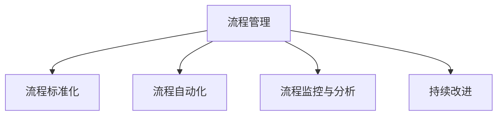

                 

# 流程管理：优化业务运营的方法论

> 关键词：流程管理, 业务运营, 方法论, 流程自动化, 持续改进, 流程优化, 组织协调

## 1. 背景介绍

### 1.1 问题由来
在现代企业运营中，流程管理（Process Management）是提高效率、降低成本、提升质量的关键环节。然而，随着企业规模的不断扩大和业务复杂度的增加，传统的手工流程管理方式已经无法满足需求。如何通过自动化和数据驱动，实现高效、精准的流程管理，是所有企业都面临的重大挑战。

### 1.2 问题核心关键点
流程管理的核心在于建立一套科学、系统的方法论，通过数据驱动、技术赋能，实现业务流程的优化和自动化。这要求流程管理能够解决以下问题：

1. **流程标准化**：建立统一的流程标准，确保流程的一致性和可复用性。
2. **流程自动化**：通过技术手段，实现流程的自动执行，减少人为操作，提升效率。
3. **流程监控与分析**：实时监控流程运行状态，分析流程瓶颈和问题，提供优化建议。
4. **持续改进**：基于业务反馈和数据分析，持续优化流程，提升流程质量和效率。

### 1.3 问题研究意义
流程管理对于提升企业的运营效率、降低运营成本、提升客户满意度具有重要意义。通过对流程的优化和自动化，企业可以：

1. **提升效率**：自动化执行流程，减少人工操作，提高效率。
2. **降低成本**：减少因人为错误导致的损失，降低运营成本。
3. **提升质量**：通过标准化的流程，确保流程的一致性和可靠性，提高产品和服务质量。
4. **增强灵活性**：实时监控和优化流程，快速响应市场变化，增强企业的竞争力和灵活性。

## 2. 核心概念与联系

### 2.1 核心概念概述

为了更好地理解流程管理的方法论，本节将介绍几个关键概念：

- **流程（Process）**：指一组有序的活动或任务，从开始到结束，旨在实现某个特定目标。
- **流程管理（Process Management）**：指通过设计、实施和监控流程，确保流程的有效执行和管理。
- **流程自动化（Process Automation）**：指利用技术手段，实现流程的自动执行和控制。
- **流程优化（Process Optimization）**：指通过持续改进，提升流程的效率、质量和可靠性。
- **持续改进（Continuous Improvement）**：指基于数据分析和反馈，持续优化流程，追求卓越。

这些概念之间的逻辑关系可以通过以下Mermaid流程图来展示：



这个流程图展示了流程管理的核心环节及其相互关系：

1. **流程标准化**：建立统一的流程标准，确保流程的一致性和可复用性。
2. **流程自动化**：通过技术手段，实现流程的自动执行，减少人为操作，提升效率。
3. **流程监控与分析**：实时监控流程运行状态，分析流程瓶颈和问题，提供优化建议。
4. **持续改进**：基于业务反馈和数据分析，持续优化流程，提升流程质量和效率。

## 3. 核心算法原理 & 具体操作步骤
### 3.1 算法原理概述

流程管理的方法论基于系统化的数据分析和优化技术，通过持续改进，提升流程的效率和质量。其核心思想是：

1. **流程建模与设计**：通过流程建模，建立流程的可视化表示，设计最优化的流程方案。
2. **流程自动化与执行**：利用技术手段，实现流程的自动执行，减少人为操作，提升效率。
3. **流程监控与分析**：实时监控流程运行状态，分析流程瓶颈和问题，提供优化建议。
4. **持续改进**：基于业务反馈和数据分析，持续优化流程，提升流程质量和效率。

### 3.2 算法步骤详解

基于流程管理的方法论，流程优化和自动化通常包括以下几个关键步骤：

**Step 1: 流程识别与建模**
- **流程识别**：通过业务分析，识别出关键业务流程，包括业务环节、输入输出、参与者等。
- **流程建模**：利用BPMN（业务流程建模标准）等工具，建立流程的可视化表示，设计流程的逻辑结构。

**Step 2: 流程优化与设计**
- **流程优化**：基于流程建模结果，进行流程的优化和设计，提升流程的效率和质量。
- **流程自动化**：利用技术手段，实现流程的自动执行，减少人为操作，提升效率。

**Step 3: 流程实施与监控**
- **流程实施**：将优化后的流程进行实施，实现流程的自动化执行。
- **流程监控**：通过实时监控工具，监测流程运行状态，及时发现和解决问题。

**Step 4: 流程改进与反馈**
- **流程改进**：基于流程监控和分析结果，进行流程的持续改进，优化流程质量。
- **反馈机制**：建立业务反馈机制，收集业务反馈，持续改进流程。

### 3.3 算法优缺点

流程管理的方法论具有以下优点：

1. **系统化**：通过科学的方法论，确保流程管理的系统化和规范化。
2. **自动化**：利用技术手段，实现流程的自动执行，减少人为操作，提升效率。
3. **数据驱动**：基于数据分析和反馈，持续优化流程，提升流程质量和效率。
4. **灵活性**：通过持续改进，快速响应市场变化，增强企业的竞争力和灵活性。

同时，该方法也存在一定的局限性：

1. **复杂度高**：流程建模和优化需要高度的专业知识和技能，实施成本较高。
2. **灵活性不足**：流程自动化可能难以应对复杂多变的业务场景，需要灵活调整。
3. **数据质量依赖**：流程监控和分析的效果依赖于数据质量，数据收集和处理难度较大。
4. **持续改进困难**：流程持续改进需要持续投入资源和精力，难以实现短期内见效。

尽管存在这些局限性，但就目前而言，流程管理的方法论仍是在业务流程优化中最主流的方式。未来相关研究的重点在于如何进一步降低流程优化的成本，提高流程的灵活性和适应性，同时兼顾持续改进的效果。

### 3.4 算法应用领域

流程管理的方法论在各个行业领域都有广泛的应用，包括但不限于：

- **制造业**：通过流程优化和自动化，提高生产效率，降低成本。
- **金融业**：通过流程监控和分析，提升金融产品的风险控制和客户服务质量。
- **医疗业**：通过流程标准化和自动化，提升医疗服务的效率和质量。
- **服务业**：通过流程优化和自动化，提高服务效率，提升客户满意度。
- **政府机构**：通过流程标准化和自动化，提升政府服务的效率和透明度。

## 4. 数学模型和公式 & 详细讲解 & 举例说明

### 4.1 数学模型构建

流程管理的数学模型通常基于流程分析、优化和监控的各个环节，包括流程建模、流程优化、流程监控和持续改进等。

1. **流程建模**
   - **输入输出分析**：分析流程的输入和输出，确定流程的关键节点和数据流。
   - **活动链建模**：利用活动链图（Activity Chain Diagram）表示流程的活动链，建立流程的可视化表示。

2. **流程优化**
   - **流程改进模型**：基于流程评估结果，进行流程的改进和优化。
   - **流程优化算法**：利用遗传算法、模拟退火等优化算法，寻找最优的流程方案。

3. **流程监控**
   - **流程监控模型**：利用指标监控模型，实时监控流程运行状态，检测流程异常。
   - **异常检测算法**：利用统计分析、机器学习等方法，进行流程异常的检测和分析。

4. **持续改进**
   - **流程改进模型**：基于业务反馈和数据分析，进行流程的持续改进。
   - **改进算法**：利用KPI（关键绩效指标）评估模型，进行流程改进效果的评估和优化。

### 4.2 公式推导过程

以流程监控中的异常检测为例，假设流程中的每个活动有固定的时间范围，设活动 $i$ 的正常执行时间为 $t_i$，实际执行时间为 $t_i'$。定义异常度为 $e_i = \frac{|t_i - t_i'|}{t_i}$，表示活动 $i$ 的执行偏差。则异常度 $e$ 的计算公式为：

$$
e = \max_{i=1,...,n} e_i
$$

其中 $n$ 为流程中活动的数量。通过实时监控异常度 $e$，可以及时发现流程中的异常活动，进行相应的处理和优化。

### 4.3 案例分析与讲解

以制造业的供应链流程为例，分析流程管理的方法论的应用。

1. **流程识别与建模**
   - **流程识别**：通过业务分析，识别出关键业务流程，包括采购、生产、销售等环节。
   - **流程建模**：利用BPMN工具，建立流程的可视化表示，设计流程的逻辑结构。

2. **流程优化与设计**
   - **流程优化**：分析供应链流程的瓶颈，进行流程的优化和设计，提升流程的效率和质量。
   - **流程自动化**：利用ERP（企业资源计划）等系统，实现供应链流程的自动化执行，减少人为操作，提升效率。

3. **流程实施与监控**
   - **流程实施**：将优化后的流程进行实施，实现供应链流程的自动化执行。
   - **流程监控**：通过ERP系统，实时监控供应链流程的运行状态，及时发现和解决问题。

4. **流程改进与反馈**
   - **流程改进**：基于供应链监控和分析结果，进行流程的持续改进，优化供应链质量。
   - **反馈机制**：建立业务反馈机制，收集业务反馈，持续改进供应链流程。

## 5. 项目实践：代码实例和详细解释说明

### 5.1 开发环境搭建

在进行流程管理项目开发前，我们需要准备好开发环境。以下是使用Python进行BPMN流程建模的开发环境配置流程：

1. **安装Anaconda**：从官网下载并安装Anaconda，用于创建独立的Python环境。
2. **创建并激活虚拟环境**：
```bash
conda create -n process-management python=3.8 
conda activate process-management
```
3. **安装BPMN工具**：
```bash
pip install bpmn-python
```
4. **安装其它工具包**：
```bash
pip install pandas numpy matplotlib jupyter notebook ipython
```

完成上述步骤后，即可在`process-management`环境中开始流程管理项目的开发。

### 5.2 源代码详细实现

这里我们以制造业的供应链流程为例，使用BPMN工具进行流程建模，实现流程自动化和监控。

首先，定义流程模型：

```python
from bpmn_python import BPMN

bpmn = BPMN()
# 定义流程
bpmn.create_start_event("Order Received")
bpmn.create_task("Check Inventory", "Inventory", "Low", "High")
bpmn.create_task("Place Order", "Supplier", "Product")
bpmn.create_task("Pack and Ship", "Warehouse", "Delivery", "Shipped")
bpmn.create_end_event("Product Delivered")

# 定义流程连接
bpmn.create_sequence_flow("Order Received", "Check Inventory", name="Check Inventory Condition")
bpmn.create_sequence_flow("Check Inventory", "Place Order", name="Place Order")
bpmn.create_sequence_flow("Place Order", "Pack and Ship", name="Pack and Ship")
bpmn.create_sequence_flow("Pack and Ship", "Shipped", name="Shipped")
bpmn.create_sequence_flow("Shipped", "Product Delivered", name="Product Delivered")
```

然后，定义流程自动化和监控代码：

```python
from bpmn_python import BPMN

bpmn = BPMN()

# 定义流程
bpmn.create_start_event("Order Received")
bpmn.create_task("Check Inventory", "Inventory", "Low", "High")
bpmn.create_task("Place Order", "Supplier", "Product")
bpmn.create_task("Pack and Ship", "Warehouse", "Delivery", "Shipped")
bpmn.create_end_event("Product Delivered")

# 定义流程连接
bpmn.create_sequence_flow("Order Received", "Check Inventory", name="Check Inventory Condition")
bpmn.create_sequence_flow("Check Inventory", "Place Order", name="Place Order")
bpmn.create_sequence_flow("Place Order", "Pack and Ship", name="Pack and Ship")
bpmn.create_sequence_flow("Pack and Ship", "Shipped", name="Shipped")
bpmn.create_sequence_flow("Shipped", "Product Delivered", name="Product Delivered")

# 定义流程监控
class InventoryMonitor:
    def __init__(self, inventory):
        self.inventory = inventory

    def check_inventory(self, threshold):
        if self.inventory < threshold:
            return True
        return False

bpmn.add_monitor("Check Inventory", InventoryMonitor(inventory=50))

# 定义流程优化
class OrderOptimizer:
    def __init__(self, supplier):
        self.supplier = supplier

    def place_order(self):
        # 自动优化订单
        pass

bpmn.add_optimizer("Place Order", OrderOptimizer(supplier="Supplier A"))

# 定义流程自动化
class OrderProcessor:
    def __init__(self, warehouse):
        self.warehouse = warehouse

    def process_order(self):
        # 自动化执行订单处理
        pass

bpmn.add_automation("Place Order", OrderProcessor(warehouse="Warehouse A"))
```

最后，启动流程执行和监控：

```python
bpmn.execute_flow("Order Received", {"Order": "Order A"})

while True:
    for event in bpmn.events:
        print(f"Event: {event.name}")
```

以上就是使用BPMN工具进行流程管理项目开发的完整代码实现。可以看到，通过BPMN工具，我们可以很方便地进行流程建模和自动化执行，同时利用监控工具实时监控流程运行状态。

### 5.3 代码解读与分析

让我们再详细解读一下关键代码的实现细节：

**流程建模**
- **BPMN类初始化**：创建BPMN类实例，用于定义和操作流程。
- **创建流程元素**：使用`create_start_event`、`create_task`、`create_end_event`等方法，创建流程的开始事件、任务、结束事件等元素。
- **创建流程连接**：使用`create_sequence_flow`方法，定义流程元素之间的连接关系。

**流程监控**
- **定义监控类**：根据监控需求，定义相应的监控类，如`InventoryMonitor`，用于监控库存状态。
- **添加监控**：使用`add_monitor`方法，将监控类添加到流程中，实现实时监控。

**流程优化**
- **定义优化类**：根据优化需求，定义相应的优化类，如`OrderOptimizer`，用于优化订单处理。
- **添加优化**：使用`add_optimizer`方法，将优化类添加到流程中，实现流程优化。

**流程自动化**
- **定义自动化类**：根据自动化需求，定义相应的自动化类，如`OrderProcessor`，用于自动化执行订单处理。
- **添加自动化**：使用`add_automation`方法，将自动化类添加到流程中，实现流程自动化。

## 6. 实际应用场景

### 6.1 智能客服系统

智能客服系统通过流程管理方法论，可以显著提升客户服务的效率和质量。通过流程标准化和自动化，智能客服系统可以：

1. **提高响应速度**：通过流程自动化，快速响应客户咨询，减少等待时间。
2. **提升服务质量**：通过流程监控和优化，确保服务的一致性和可靠性，提升客户满意度。
3. **降低人力成本**：通过自动化执行，减少人工操作，降低客服成本。

### 6.2 金融风险管理

金融风险管理通过流程管理方法论，可以提升风险控制和业务运营的效率。通过流程监控和优化，金融风险管理可以：

1. **实时监控风险**：通过流程监控，实时监测市场动态和交易行为，及时发现和评估风险。
2. **优化风险控制**：通过流程优化，提升风险控制和业务运营的效率，降低风险损失。
3. **增强合规性**：通过流程标准化和自动化，确保业务运营符合监管要求，避免法律风险。

### 6.3 制造业供应链管理

制造业供应链管理通过流程管理方法论，可以提升供应链的效率和稳定性。通过流程优化和监控，制造业供应链管理可以：

1. **优化供应链流程**：通过流程优化，提升供应链的效率和质量，降低运营成本。
2. **实时监控供应链**：通过流程监控，实时监测供应链运行状态，及时发现和解决问题。
3. **增强供应链弹性**：通过流程自动化，提高供应链的灵活性和应对能力，应对市场变化。

### 6.4 未来应用展望

随着流程管理方法论的不断成熟，其在各个行业领域的应用前景将更加广阔。未来，流程管理方法论将：

1. **智能化升级**：通过人工智能和机器学习技术，提升流程监控和优化的智能化水平。
2. **跨领域融合**：通过流程管理与其他技术（如物联网、区块链等）的融合，拓展应用场景和提升业务效率。
3. **数据驱动**：通过大数据分析和云计算技术，实现流程管理的精细化和实时化。
4. **全球化拓展**：通过标准化和跨文化流程管理，拓展流程管理的全球化应用，提升企业的国际竞争力。

## 7. 工具和资源推荐

### 7.1 学习资源推荐

为了帮助开发者系统掌握流程管理的方法论和实践技巧，这里推荐一些优质的学习资源：

1. **《业务流程管理》课程**：由知名大学开设的业务流程管理课程，涵盖流程管理的基本概念、模型、工具和实践。
2. **《BPMN入门》书籍**：BPMN标准的入门书籍，详细介绍了BPMN流程建模的工具和方法。
3. **《流程管理实践》书籍**：流程管理实践的书籍，涵盖流程管理的案例分析、实施方法和最佳实践。
4. **《流程优化与改进》课程**：流程优化与改进的在线课程，涵盖流程优化和持续改进的原理和技巧。
5. **《业务流程管理工具》教程**：流程管理工具（如BPMN、ERP等）的在线教程，涵盖流程建模和自动化实施。

通过对这些资源的学习实践，相信你一定能够快速掌握流程管理的方法论，并用于解决实际的业务问题。

### 7.2 开发工具推荐

高效的开发离不开优秀的工具支持。以下是几款用于流程管理开发常用的工具：

1. **BPMN工具**：如Bizagi、Promises、Celonis等，提供流程建模和自动化执行的功能。
2. **ERP系统**：如SAP、Oracle、Microsoft Dynamics等，提供流程自动化和监控的功能。
3. **流程监控工具**：如Tally Prime、QuickBooks等，提供实时监控和数据分析的功能。
4. **持续改进工具**：如LeanKit、Jira等，提供持续改进和优化的功能。
5. **自动化工具**：如UiPath、Blue Prism等，提供自动化执行和优化功能。

合理利用这些工具，可以显著提升流程管理的开发效率，加快创新迭代的步伐。

### 7.3 相关论文推荐

流程管理作为管理学的热门领域，相关研究论文众多。以下是几篇具有代表性的论文，推荐阅读：

1. **《业务流程管理：理论与实践》**：系统介绍了业务流程管理的理论基础和实践方法。
2. **《流程优化算法》**：详细探讨了流程优化和改进的算法和技术。
3. **《基于大数据的流程监控》**：讨论了如何利用大数据技术实现流程监控和优化。
4. **《智能流程管理》**：研究了如何通过人工智能和机器学习技术提升流程管理的智能化水平。
5. **《流程管理与组织变革》**：探讨了流程管理对组织变革和管理创新的作用。

这些论文代表了大规模流程管理理论和方法的发展脉络。通过学习这些前沿成果，可以帮助研究者把握学科前进方向，激发更多的创新灵感。

## 8. 总结：未来发展趋势与挑战

### 8.1 总结

本文对流程管理的方法论进行了全面系统的介绍。首先阐述了流程管理在提升业务运营效率和质量方面的重要性，明确了流程管理的核心目标和实现路径。其次，从原理到实践，详细讲解了流程管理的方法论和关键步骤，给出了流程管理项目开发的完整代码实例。同时，本文还广泛探讨了流程管理在智能客服、金融风险管理、制造业供应链管理等多个行业领域的应用前景，展示了流程管理方法论的巨大潜力。此外，本文精选了流程管理的各类学习资源，力求为读者提供全方位的技术指引。

通过本文的系统梳理，可以看到，流程管理作为提升企业运营效率和质量的重要手段，其方法论在各行各业都有广泛的应用。得益于流程建模、自动化执行、实时监控和持续改进等关键技术的结合，流程管理可以显著提升企业的运营效率、降低运营成本、提升客户满意度，具有重要的实践价值。

### 8.2 未来发展趋势

展望未来，流程管理方法论将呈现以下几个发展趋势：

1. **智能化升级**：通过人工智能和机器学习技术，提升流程监控和优化的智能化水平。
2. **跨领域融合**：通过流程管理与其他技术（如物联网、区块链等）的融合，拓展应用场景和提升业务效率。
3. **数据驱动**：通过大数据分析和云计算技术，实现流程管理的精细化和实时化。
4. **全球化拓展**：通过标准化和跨文化流程管理，拓展流程管理的全球化应用，提升企业的国际竞争力。
5. **自动化与优化结合**：利用自动化技术实现流程的自动执行，利用优化技术提升流程的效率和质量。
6. **持续改进与反馈机制结合**：建立持续改进与反馈机制，实现流程管理的持续优化和提升。

以上趋势凸显了流程管理方法论的广阔前景。这些方向的探索发展，必将进一步提升企业的运营效率和质量，推动企业的数字化转型和智能化升级。

### 8.3 面临的挑战

尽管流程管理方法论已经取得了显著的成果，但在迈向更加智能化、普适化应用的过程中，仍面临诸多挑战：

1. **技术复杂度高**：流程管理涉及大量技术细节，包括流程建模、自动化、监控和优化等环节，实施成本较高。
2. **数据质量依赖**：流程监控和分析的效果依赖于数据质量，数据收集和处理难度较大。
3. **持续改进困难**：流程持续改进需要持续投入资源和精力，难以实现短期内见效。
4. **跨部门协作难度**：流程管理涉及多个部门和系统，跨部门协作难度较大。
5. **系统集成复杂**：流程管理需要与多个系统和工具集成，系统集成复杂度较高。

尽管存在这些挑战，但通过不断优化技术、完善管理机制和加强跨部门协作，流程管理方法论在企业中的应用将更加广泛，为企业的运营效率和质量提升提供有力支撑。

### 8.4 研究展望

面向未来，流程管理的研究可以从以下几个方向寻求新的突破：

1. **智能化流程管理**：利用人工智能和机器学习技术，实现流程监控和优化的智能化。
2. **跨领域流程管理**：研究跨领域流程管理的理论和实践，提升流程管理的普适性和灵活性。
3. **数据驱动流程管理**：利用大数据分析和云计算技术，实现流程管理的精细化和实时化。
4. **持续改进流程管理**：建立持续改进和反馈机制，实现流程管理的持续优化和提升。
5. **全球化流程管理**：研究全球化流程管理的理论和实践，提升流程管理的全球化应用。

这些研究方向的探索，必将引领流程管理方法论迈向更高的台阶，为企业的运营效率和质量提升提供更多创新思路。总之，流程管理需要不断优化技术、完善管理机制和加强跨部门协作，才能真正实现智能化、普适化的应用。

## 9. 附录：常见问题与解答

**Q1：流程管理与敏捷开发有何区别？**

A: 流程管理与敏捷开发虽然都是为了提升项目效率，但侧重点不同。流程管理侧重于流程的标准化、自动化和持续改进，以提高企业的运营效率和质量。而敏捷开发侧重于团队协作和快速响应市场变化，以提高产品的开发速度和质量。两者可以相互补充，共同提升企业的竞争力。

**Q2：流程管理如何应对变化？**

A: 流程管理通过持续改进机制，及时应对市场变化和业务需求。具体而言，流程管理可以：

1. **灵活调整流程**：通过流程优化和自动化，灵活调整流程方案，应对市场变化。
2. **实时监控与调整**：通过实时监控流程运行状态，及时发现和解决问题，确保流程的稳定运行。
3. **建立反馈机制**：建立业务反馈机制，持续收集用户和业务反馈，进行流程的优化和改进。

**Q3：流程管理中的瓶颈如何突破？**

A: 流程管理中的瓶颈主要集中在技术复杂度和跨部门协作难度上。突破瓶颈可以：

1. **引入先进技术**：引入先进的技术工具和方法，简化流程管理和优化流程效率。
2. **建立跨部门协作机制**：建立跨部门协作机制，确保各部门之间的信息共享和协同工作。
3. **强化流程文化**：培养流程文化，提高员工对流程管理的认识和参与度。

**Q4：流程管理在实际应用中如何实现？**

A: 流程管理在实际应用中，需要从以下几个方面实现：

1. **流程建模与设计**：利用流程建模工具，建立流程的可视化表示，设计最优化的流程方案。
2. **流程自动化与执行**：利用自动化工具，实现流程的自动执行，减少人为操作，提升效率。
3. **流程监控与分析**：利用监控工具，实时监测流程运行状态，及时发现和解决问题。
4. **持续改进与反馈**：基于业务反馈和数据分析，进行流程的持续改进，优化流程质量。

通过这些步骤，可以实现流程管理的全面实施和优化，提升企业的运营效率和质量。

**Q5：流程管理如何与人工智能结合？**

A: 流程管理与人工智能结合，可以实现流程管理的智能化升级。具体而言，可以：

1. **流程自动化**：利用自动化工具，实现流程的自动执行，减少人为操作，提升效率。
2. **流程监控与分析**：利用大数据和机器学习技术，实现流程监控和优化的智能化。
3. **流程改进**：利用人工智能算法，进行流程改进和优化，提升流程的质量和效率。

总之，流程管理与人工智能结合，可以实现流程管理的智能化、高效化和持续改进，为企业的运营效率和质量提升提供有力支撑。

---
作者：禅与计算机程序设计艺术 / Zen and the Art of Computer Programming

