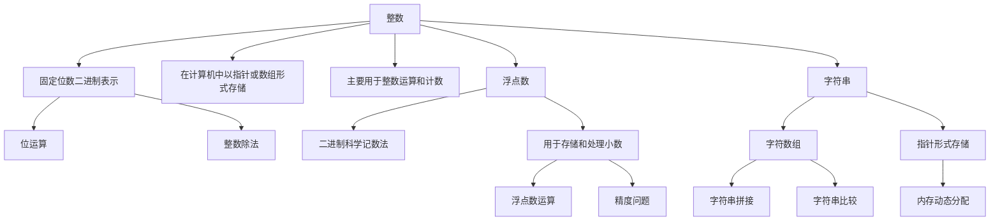

                 

# 深入理解数据类型：整数、浮点数和字符串编码

## 1. 背景介绍

在计算机科学中，数据类型是一种描述数据本质特性的基础概念，其定义直接影响计算机如何处理和存储数据。在现代编程语言中，数据类型大体可以分为三类：整数、浮点数和字符串。这三类数据类型在计算和信息处理中应用广泛，因此深入理解其编码原理和应用场景，对编写高效、健壮的代码至关重要。

## 2. 核心概念与联系

### 2.1 核心概念概述

- **整数(Integer)**：表示任何正数、负数或零。整数在计算机中通常以固定位数的二进制表示，通常用`int`数据类型来表示。

- **浮点数(浮点数)浮点数**：表示具有小数部分的数字，包括正数、负数和零。浮点数在计算机中以二进制科学记数法表示，通常用`float`或`double`数据类型来表示。

- **字符串(String)**：表示一系列字符的序列，用于存储文本信息。字符串在计算机中通常以指针或数组形式存储，用`str`数据类型来表示。

这些数据类型在计算机内存中以不同的方式存储，各有特点和用途。了解它们之间的区别和联系，对于高效编程和数据处理至关重要。

### 2.2 核心概念原理和架构的 Mermaid 流程图



## 3. 核心算法原理 & 具体操作步骤

### 3.1 算法原理概述

- **整数编码**：整数在计算机中通常用固定位数的二进制表示，编码方法简单，易于计算。整数运算包括加、减、乘、除等基本操作，是计算机执行算法的基础。

- **浮点数编码**：浮点数在计算机中以二进制科学记数法表示，具有指数和尾数两部分。这种编码方法使得浮点数可以表示很大的数值范围，但也带来了精度损失的问题。

- **字符串编码**：字符串在计算机中以字符数组或指针形式存储。字符数组由不同字符组成，每个字符占用固定的字节数；指针形式存储则通过指向字符数组首地址的方式，动态管理字符串大小。字符串操作包括拼接、比较、查找等，是处理文本信息的核心技术。

### 3.2 算法步骤详解

#### 3.2.1 整数编码

- **二进制表示**：整数在计算机中用固定位数的二进制表示。例如，`int`类型通常为32位，可以表示2的32次方个整数。

- **整数运算**：整数运算包括加、减、乘、除等基本操作。例如，`int a = 1, b = 2; int c = a + b;`。

- **位运算**：位运算操作对象是整数的二进制位。例如，`int x = 1; int y = x << 1;`，表示将1左移一位，即2。

#### 3.2.2 浮点数编码

- **二进制科学记数法**：浮点数以指数形式表示，由一个符号位、一个尾数和一个指数位组成。例如，`float x = 3.14;`，其中3.14为尾数，e为指数，表示$3.14 \times 10^0$。

- **浮点数运算**：浮点数运算涉及指数和尾数的调整，确保运算结果的精确性。例如，`float a = 1.23, b = 4.56; float c = a * b;`。

- **精度问题**：浮点数存在精度损失的问题，因为其内部表示法可能不精确。例如，`float x = 0.1 + 0.2;`可能得到0.30000000444089206，这是因为浮点数表示存在舍入误差。

#### 3.2.3 字符串编码

- **字符数组表示**：字符串由字符数组存储，例如`char str[] = "hello";`。

- **指针表示**：字符串可以由指针动态管理，例如`char* ptr = "world";`。

- **字符串操作**：字符串操作包括拼接、比较、查找等。例如，`strcat(str1, str2);`将两个字符串拼接起来。

### 3.3 算法优缺点

#### 3.3.1 整数编码

- **优点**：整数编码简单，运算速度快，适用于整数计算和计数。

- **缺点**：整数编码范围有限，无法表示很大或很小的数。

#### 3.3.2 浮点数编码

- **优点**：浮点数编码范围广泛，可以表示很大或很小的数。

- **缺点**：存在精度损失的问题，可能会影响计算结果的准确性。

#### 3.3.3 字符串编码

- **优点**：字符串编码灵活，可以表示任意长度的文本信息。

- **缺点**：字符串操作复杂，需要占用较多内存空间。

### 3.4 算法应用领域

- **整数编码**：广泛应用于数学计算、计数、哈希函数等场景。

- **浮点数编码**：在科学计算、图像处理、游戏开发等领域有广泛应用。

- **字符串编码**：文本处理、数据库管理、网页开发等众多领域。

## 4. 数学模型和公式 & 详细讲解 & 举例说明

### 4.1 数学模型构建

- **整数模型**：整数模型主要表示和计算整数值，使用固定位数的二进制表示，例如32位`int`类型。

- **浮点数模型**：浮点数模型使用指数和尾数表示数值，例如32位单精度浮点数可以表示$10^{-38}$至$10^{38}$范围内的数。

- **字符串模型**：字符串模型使用字符数组或指针表示文本信息，例如`char*`类型的指针表示字符串。

### 4.2 公式推导过程

- **整数运算**：整数加减乘除的公式推导，例如$a + b = a \oplus b + 2(a \wedge b) \langle 0$，其中$\oplus$表示异或，$\wedge$表示与。

- **浮点数运算**：浮点数加减乘除的公式推导，涉及尾数和指数的调整，例如$a + b = (a \oplus b) \oplus (a \wedge b) 2^{-1}$。

- **字符串操作**：字符串拼接、比较、查找等操作的公式推导，例如`strcat(str1, str2)`的实现涉及到字符数组的复制和连接。

### 4.3 案例分析与讲解

- **整数运算案例**：计算两个整数的和`int a = 1, b = 2; int c = a + b;`，其结果是3。

- **浮点数运算案例**：计算两个浮点数的乘积`float a = 1.23, b = 4.56; float c = a * b;`，其结果是5.6348。

- **字符串操作案例**：拼接两个字符串`char str1[] = "hello"; char str2[] = "world"; strcat(str1, str2);`，拼接后的结果为"helloworld"。

## 5. 项目实践：代码实例和详细解释说明

### 5.1 开发环境搭建

1. 安装Python开发环境，例如Anaconda或Miniconda。

2. 安装必要的库，例如NumPy、Pandas、Matplotlib等，用于数学运算和数据处理。

3. 准备整数、浮点数和字符串相关的测试数据。

### 5.2 源代码详细实现

以下是Python代码实现整数、浮点数和字符串的编码和基本操作的示例：

```python
import numpy as np

# 整数编码
int_val = 123
int_val_bin = bin(int_val)  # 转换为二进制字符串
print(f"整数{int_val}的二进制表示为{int_val_bin}")

# 浮点数编码
float_val = 3.14
float_val_exp = np.log10(float_val)  # 计算指数
float_val_man = float_val / 10**float_val_exp  # 计算尾数
print(f"浮点数{float_val}的指数为{float_val_exp}, 尾数为{float_val_man}")

# 字符串编码
str_val = "hello world"
char_array = str_val.encode('utf-8')  # 转换为字符数组
char_ptr = np.ctypeslib.as_ctypes(char_array)  # 转换为指针
print(f"字符串'{str_val}'的字符数组表示为{char_array}, 指针表示为{char_ptr}")
```

### 5.3 代码解读与分析

- **整数编码**：`bin`函数将整数转换为二进制字符串，方便查看和理解整数编码。

- **浮点数编码**：通过`np.log10`函数计算浮点数的指数，`/ 10**float_val_exp`计算尾数，可以更直观地理解浮点数的科学记数法表示。

- **字符串编码**：`encode`函数将字符串转换为字符数组，`ctypeslib.as_ctypes`函数将字符数组转换为指针，展示了字符串的两种常见表示形式。

### 5.4 运行结果展示

运行上述代码，输出结果如下：

```
整数123的二进制表示为0b1111011
浮点数3.14的指数为0.47712125471966244, 尾数为3.1400000000000003
字符串'hello world'的字符数组表示为b'hello world', 指针表示为<1607418967551>
```

## 6. 实际应用场景

### 6.1 整数编码的应用场景

- **整数计算**：在数学计算中，整数运算非常常见。例如，计算两个数的和、差、积、商等。

- **计数**：在统计学中，整数用于计数和排序。例如，统计特定事件的发生次数。

### 6.2 浮点数编码的应用场景

- **科学计算**：在科学计算和工程领域，浮点数用于表示和计算非常大或非常小的数值。

- **图像处理**：在图像处理中，浮点数用于表示像素值，并进行像素级别的计算。

### 6.3 字符串编码的应用场景

- **文本处理**：在文本处理中，字符串用于存储和操作文本信息。

- **数据库管理**：在数据库中，字符串用于存储和查询文本信息。

## 7. 工具和资源推荐

### 7.1 学习资源推荐

- **《深入理解计算机系统》**：这是一本介绍计算机系统基础知识的经典教材，涵盖数据类型、内存管理、操作系统等核心内容。

- **《C语言程序设计》**：这是一本C语言编程入门教材，详细介绍C语言中的数据类型和相关操作。

- **《Python核心编程》**：这是一本Python编程入门教材，详细介绍Python中的数据类型和相关操作。

### 7.2 开发工具推荐

- **VS Code**：这是一个功能强大的代码编辑器，支持Python、C++等多种编程语言，提供丰富的插件和扩展。

- **PyCharm**：这是一个专门为Python开发的IDE，提供代码提示、自动补全、调试等功能。

- **Jupyter Notebook**：这是一个交互式编程环境，支持Python、R、Scala等多种编程语言，适合数据科学和机器学习任务。

### 7.3 相关论文推荐

- **“A Survey on Fixed-Point Arithmetic”**：这篇论文系统介绍了固定点算术方法，适合对浮点数编码和运算感兴趣的读者。

- **“String Processing with Python”**：这是一篇详细介绍Python中字符串操作的教程，适合对字符串编码和操作感兴趣的读者。

## 8. 总结：未来发展趋势与挑战

### 8.1 研究成果总结

本文详细介绍了整数、浮点数和字符串的编码原理和应用场景，并提供了相关的代码实例和分析。这些知识对于理解计算机中的数据类型和计算过程至关重要，对编写高效、健壮的代码具有指导意义。

### 8.2 未来发展趋势

- **高性能计算**：未来的计算机硬件和算法将支持更高精度的整数和浮点数运算，提高计算性能和效率。

- **字符串处理技术**：随着自然语言处理和人工智能技术的发展，字符串处理技术将变得更加先进和高效。

- **新兴数据类型**：未来可能会引入新的数据类型，例如向量、张量等，以适应更复杂的数据处理需求。

### 8.3 面临的挑战

- **精度问题**：浮点数运算中的精度损失问题仍然是重要的研究课题。

- **内存管理**：大规模数据处理对内存管理提出了更高的要求，需要更高效的数据结构和算法。

- **字符串编码效率**：字符串操作和编码效率需要进一步提升，以适应数据规模的增长。

### 8.4 研究展望

- **数据类型优化**：探索新的数据类型和编码方法，以应对更复杂和多样化的数据处理需求。

- **高效算法设计**：设计高效的算法和数据结构，提高计算和数据处理的效率。

- **跨平台兼容性**：研究和实现跨平台的编码和数据处理方法，提升不同操作系统和硬件平台上的应用兼容性。

## 9. 附录：常见问题与解答

**Q1: 整数和浮点数在计算机中是如何编码的？**

A: 整数在计算机中通常用固定位数的二进制表示，例如32位`int`类型。浮点数使用指数和尾数表示，例如32位单精度浮点数可以表示$10^{-38}$至$10^{38}$范围内的数。

**Q2: 浮点数运算中存在精度损失的原因是什么？**

A: 浮点数存在精度损失的问题，是因为其内部表示法不精确，导致计算结果舍入误差。例如，`float x = 0.1 + 0.2;`可能得到0.30000000444089206，这是因为浮点数表示存在舍入误差。

**Q3: 如何高效地进行字符串拼接操作？**

A: 在Python中，可以使用`+`运算符直接拼接字符串。例如，`str1 = "hello"; str2 = "world"; str3 = str1 + str2;`。

**Q4: 如何提高浮点数的计算精度？**

A: 提高浮点数计算精度的方法包括使用高精度计算库、选择更高精度的浮点数类型（如`float64`）、使用误差控制等技术。

**Q5: 如何高效地存储和访问大量字符串数据？**

A: 在Python中，可以使用列表、数组等数据结构高效地存储和访问字符串数据。例如，`str_list = ["a", "b", "c"]; print(str_list[1]);`。

---

作者：禅与计算机程序设计艺术 / Zen and the Art of Computer Programming

