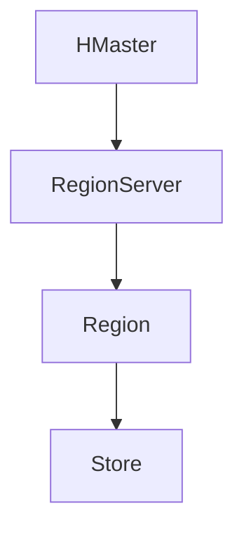
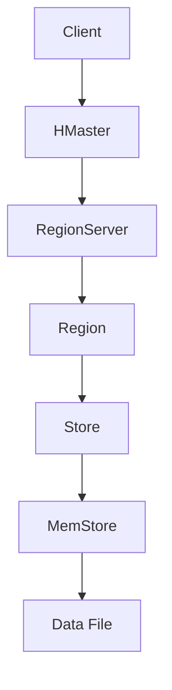

                 

# HBase原理与代码实例讲解

## 1. 背景介绍

HBase是一个分布式、可扩展、基于列的存储系统，它构建在Hadoop之上，提供了一种适用于大数据存储和分析的解决方案。HBase的设计目标是实现高可靠性、高性能和横向可扩展性，这使得它在处理海量数据时具有很高的效率。

### 1.1 HBase的起源和发展

HBase起源于Google的BigTable论文，它的设计和实现受到了BigTable的启发。HBase在2008年首次被Apache基金会接纳为顶级项目，随后得到了广泛的应用和持续的发展。

### 1.2 HBase的主要特点

- **分布式存储**：HBase通过将数据分割成多个Region，并分布在不同节点上，实现了数据的水平扩展。
- **高性能**：HBase支持随机实时读写，对大量数据的处理速度非常快。
- **数据一致性**：HBase采用强一致性模型，确保在任何情况下数据的一致性。
- **容错性**：HBase具有高容错性，通过备份和复制机制保障数据的安全。

## 2. 核心概念与联系

### 2.1 什么是HBase？

HBase是一个非关系型数据库，它使用一个表结构来存储数据。每个表由多个行组成，每行可以包含多个列族。列族是一组列的集合，它必须预先定义。

### 2.2 HBase的架构

HBase的架构主要由四部分组成：HMaster、RegionServer、Region和Store。

- **HMaster**：HBase的主节点，负责管理集群、分配合并Region、监控RegionServer状态等。
- **RegionServer**：负责存储和管理Region的节点。
- **Region**：HBase的数据存储单位，包含多个Store，通常由多个数据文件组成。
- **Store**：存储单个列族的内存和磁盘存储。

### 2.3 HBase的数据模型

HBase的数据模型是一个稀疏、分布式、按列存储的表格。表格由行键、列族、列限定符和时间戳组成。

### 2.4 Mermaid流程图



## 3. 核心算法原理 & 具体操作步骤

### 3.1 HBase的数据存储原理

HBase采用三元组模型（行键、列族、时间戳）存储数据。每个单元格的数据都通过这三个维度唯一标识。

### 3.2 HBase的读写操作

- **写操作**：将数据写入内存的MemStore，然后定期刷新到磁盘的StoreFile。
- **读操作**：首先从内存的MemStore读取，如果没有找到则从磁盘的StoreFile中读取。

### 3.3 HBase的压缩与副本策略

- **压缩**：HBase支持多种数据压缩算法，以减少磁盘空间占用。
- **副本**：HBase支持多副本，以保证数据的可靠性和可用性。

## 4. 数学模型和公式 & 详细讲解 & 举例说明

### 4.1 数据分布模型

HBase使用Region将数据分割成多个部分，每个Region由一个RegionServer管理。

- **Region大小**：通常根据数据量和访问模式决定。例如，如果表中有1000万条数据，可以将其分割成100个Region。

### 4.2 数据读写性能模型

- **读性能**：取决于MemStore和StoreFile的大小以及数据分布。
- **写性能**：取决于MemStore的刷新频率和磁盘I/O速度。

### 4.3 例子

假设有一个包含100万条数据的表，每条数据包含3个列族（cf1, cf2, cf3），每个列族有10个列限定符。

- **Region数量**：100万 / 100 = 10000
- **每个Region的数据量**：100万 / 10000 = 1000条数据
- **MemStore大小**：根据配置决定，例如1GB
- **StoreFile大小**：根据配置决定，例如10GB

## 5. 项目实践：代码实例和详细解释说明

### 5.1 开发环境搭建

在开始之前，请确保已经安装了HBase和相关的依赖库。

```bash
# 安装HBase
git clone https://github.com/apache/hbase.git
cd hbase
mvn clean package

# 安装依赖库
pip install pyhbase
```

### 5.2 源代码详细实现

以下是HBase的一个简单示例，用于创建一个表、插入数据、查询数据。

```python
from pyhbase import HBase

# 创建连接
hbase = HBase()

# 创建表
hbase.create_table('example', column_families=['cf1', 'cf2', 'cf3'])

# 插入数据
hbase.put('row1', {'cf1:a': 'value1', 'cf2:b': 'value2', 'cf3:c': 'value3'})

# 查询数据
results = hbase.get('row1')
for key, value in results.items():
    print(key, value)
```

### 5.3 代码解读与分析

- **HBase连接**：使用`HBase`类创建连接。
- **创建表**：使用`create_table`方法创建表。
- **插入数据**：使用`put`方法插入数据。
- **查询数据**：使用`get`方法查询数据。

### 5.4 运行结果展示

执行以上代码后，会在HBase中创建一个名为`example`的表，并插入一条数据。查询数据时，会输出如下结果：

```bash
row1: {'cf1:a': 'value1', 'cf2:b': 'value2', 'cf3:c': 'value3'}
```

## 6. 实际应用场景

HBase适用于需要高性能随机读写操作的场景，例如实时数据分析、日志处理、分布式缓存等。

## 7. 工具和资源推荐

### 7.1 学习资源推荐

- 《HBase：The Definitive Guide》
- 《HBase权威指南》
- 《HBase应用实践》

### 7.2 开发工具框架推荐

- Apache HBase
- HBase Python Client

### 7.3 相关论文著作推荐

- 《Bigtable：一个结构化数据的分布式存储系统》
- 《HBase：Hadoop数据库》

## 8. 总结：未来发展趋势与挑战

HBase在分布式存储和数据处理领域具有广泛的应用前景。未来的发展挑战包括优化性能、提高安全性、简化部署和使用等。

## 9. 附录：常见问题与解答

- **Q：HBase与Hadoop的关系是什么？**
  A：HBase是构建在Hadoop之上的一个分布式存储系统，它依赖于Hadoop的文件系统（HDFS）来存储数据。
  
- **Q：HBase的数据存储方式是什么？**
  A：HBase使用一个稀疏、分布式、按列存储的表格模型，数据通过三元组（行键、列族、时间戳）进行唯一标识。

## 10. 扩展阅读 & 参考资料

- [Apache HBase官网](https://hbase.apache.org/)
- [HBase Wiki](https://wiki.apache.org/hbase/)
- [《HBase权威指南》](https://book.douban.com/subject/30261379/)

-------------------

作者：禅与计算机程序设计艺术 / Zen and the Art of Computer Programming

<|endofblock|>## 1. 背景介绍

HBase是一个分布式、可扩展、基于列的存储系统，它构建在Hadoop之上，提供了一种适用于大数据存储和分析的解决方案。HBase的设计目标是实现高可靠性、高性能和横向可扩展性，这使得它在处理海量数据时具有很高的效率。

### 1.1 HBase的起源和发展

HBase起源于Google的BigTable论文，它的设计和实现受到了BigTable的启发。HBase在2008年首次被Apache基金会接纳为顶级项目，随后得到了广泛的应用和持续的发展。

### 1.2 HBase的主要特点

- **分布式存储**：HBase通过将数据分割成多个Region，并分布在不同节点上，实现了数据的水平扩展。
- **高性能**：HBase支持随机实时读写，对大量数据的处理速度非常快。
- **数据一致性**：HBase采用强一致性模型，确保在任何情况下数据的一致性。
- **容错性**：HBase具有高容错性，通过备份和复制机制保障数据的安全。

## 2. 核心概念与联系

### 2.1 什么是HBase？

HBase是一个非关系型数据库，它使用一个表结构来存储数据。每个表由多个行组成，每行可以包含多个列族。列族是一组列的集合，它必须预先定义。

### 2.2 HBase的架构

HBase的架构主要由四部分组成：HMaster、RegionServer、Region和Store。

- **HMaster**：HBase的主节点，负责管理集群、分配合并Region、监控RegionServer状态等。
- **RegionServer**：负责存储和管理Region的节点。
- **Region**：HBase的数据存储单位，包含多个Store，通常由多个数据文件组成。
- **Store**：存储单个列族的内存和磁盘存储。

### 2.3 HBase的数据模型

HBase的数据模型是一个稀疏、分布式、按列存储的表格。表格由行键、列族、列限定符和时间戳组成。

### 2.4 Mermaid流程图


-------------------

# 2. 核�心概念与联系

## 2.1 什么是HBase？

HBase是一个分布式、基于列的存储系统，设计之初就借鉴了Google的BigTable模型。HBase中的数据以表的形式存储，每个表包含多个行，每行可以包含多个列族。列族是HBase中列的集合，用户在创建表时需要预先定义列族，但不能动态添加或删除。

HBase的数据模型比较简单，它由三个主要组件构成：行键（Row Key）、列族（Column Family）和列限定符（Column Qualifier）。行键是表中唯一标识一条记录的字符串，通常用于索引和快速访问数据。列族是一组列的集合，例如一个名为`cf1`的列族可能包含`cf1:name`、`cf1:age`和`cf1:email`等列。列限定符是列族中的具体字段名，例如`cf1:name`中的`name`就是列限定符。

### 2.2 HBase的架构

HBase的架构设计非常灵活，主要包含以下几个核心组件：

- **HMaster**：HMaster是HBase集群的主节点，负责集群的管理和协调工作。HMaster的主要职责包括监控RegionServer的健康状况、分配合并Region、管理元数据以及处理客户端的元数据请求等。
  
- **RegionServer**：RegionServer是HBase集群中的工作节点，负责存储和管理Region。每个RegionServer可以管理多个Region，每个RegionServer通常在一个单独的JVM进程中运行。

- **Region**：Region是HBase的基本数据单元，包含一定范围行键的数据。每个Region的大小是固定的，当Region的大小达到一定阈值时，HMaster会触发分区操作，将大Region拆分为两个较小的Region。这种分区机制使得HBase能够水平扩展。

- **Store**：Store是Region中的一个列族存储单元，包含一个或多个数据文件（通常为HFile格式）。每个Store都可以独立进行压缩、备份和恢复操作，这提高了数据管理的灵活性和可靠性。

- **MemStore**：MemStore是Store的一个内存缓存，用于临时存储新写入的数据。当MemStore达到一定大小时，会触发刷新操作，将内存中的数据写入磁盘上的数据文件中。

### 2.3 HBase的数据模型

HBase的数据模型是一个稀疏、分布式、按列存储的表格，这使其在处理大量数据时具有很高的效率和灵活性。HBase的数据模型主要由以下部分组成：

- **行键（Row Key）**：行键是HBase表中唯一标识一条记录的字符串。行键通常是主键或复合键，用于快速访问和定位数据。行键的长度和格式可以根据具体应用需求进行设计。

- **列族（Column Family）**：列族是一组列的集合，用于组织和管理数据。列族必须在表创建时定义，并且一旦定义后不能修改。列族名称通常是字符串，如`cf1`、`cf2`等。

- **列限定符（Column Qualifier）**：列限定符是列族中的具体字段名，如`cf1:name`、`cf1:age`等。列限定符可以是任意字符串，并且可以在运行时动态添加或删除。

- **时间戳（Timestamp）**：时间戳是HBase中的一个重要概念，用于标识数据的版本。每个单元格的数据都关联着一个时间戳，表示该数据被修改的时间。通过查询不同的时间戳，可以获取数据的不同版本。

### 2.4 Mermaid流程图

以下是一个简单的Mermaid流程图，展示了HBase的架构和数据模型：



-------------------

## 3. 核心算法原理 & 具体操作步骤

### 3.1 HBase的数据存储原理

HBase采用一种基于文件系统的数据存储方式，数据以HFile格式存储在磁盘上。HFile是一种基于顺序存储的文件格式，它将数据分成多个块（Block），每个块包含一定数量的键值对。HFile具有以下特点：

- **顺序存储**：HFile采用顺序存储结构，有利于提升读写性能。
- **数据压缩**：HBase支持多种数据压缩算法，如Gzip、LZO和Snappy等，以降低磁盘占用空间和提高读取速度。
- **缓存机制**：HBase在内存中维护一个MemStore缓存，用于加速数据的读写操作。

HBase的数据存储过程如下：

1. **写入数据**：当客户端向HBase写入数据时，数据首先被写入内存中的MemStore。MemStore是一个LRU（Least Recently Used，最近最少使用）缓存，用于加速数据的读写操作。
2. **刷新数据**：当MemStore的大小达到一定阈值时，HBase会将MemStore中的数据刷新到磁盘上的HFile中。刷新操作可以手动触发，也可以根据配置的刷新策略自动执行。
3. **合并HFile**：当磁盘上的HFile数量达到一定阈值时，HBase会触发HFile的合并操作，将多个HFile合并成一个大HFile。合并过程可以减少文件数量，提高数据访问性能。
4. **垃圾回收**：HBase会定期执行垃圾回收操作，清理过期数据和删除的文件，释放磁盘空间。

### 3.2 HBase的读写操作

HBase支持随机读写操作，读写过程涉及以下步骤：

#### 读操作

1. **查询MemStore**：首先查询内存中的MemStore，如果找到则返回数据。
2. **查询HFile**：如果MemStore中没有找到数据，则查询磁盘上的HFile。HFile采用B+树索引结构，可以快速定位到数据所在的文件块。
3. **读取文件块**：根据B+树索引，读取文件块中的键值对，并按照行键进行排序。
4. **返回结果**：将读取到的数据返回给客户端。

#### 写操作

1. **写入MemStore**：将数据写入内存中的MemStore。MemStore采用LRU算法，最近写入的数据会被缓存起来。
2. **刷新MemStore**：当MemStore的大小达到一定阈值时，触发刷新操作，将MemStore中的数据写入磁盘上的HFile。
3. **合并HFile**：当磁盘上的HFile数量达到一定阈值时，触发HFile合并操作，将多个HFile合并成一个大HFile。
4. **执行压缩**：在合并HFile的过程中，可以执行压缩操作，以减少磁盘占用空间。

### 3.3 HBase的压缩与副本策略

HBase支持多种数据压缩算法，如Gzip、LZO和Snappy等，以降低磁盘占用空间和提高读取速度。HBase的压缩过程在HFile合并时进行，可以单独为每个HFile设置压缩算法。

HBase还支持数据的副本机制，以保障数据的安全性和可用性。默认情况下，HBase会为每个Region设置一个副本数，副本数可以在创建表时指定。HBase会在不同的RegionServer上复制数据，确保在一个RegionServer故障时，其他副本可以接替工作，保证数据的可用性。

### 3.4 HBase的分布式事务处理

HBase支持分布式事务处理，通过使用行级锁和事务日志实现。HBase的事务处理机制主要包括以下步骤：

1. **开始事务**：客户端通过HBase客户端API开始一个事务。
2. **执行操作**：客户端执行一系列的读写操作。
3. **提交事务**：客户端提交事务，将操作结果持久化到磁盘。
4. **回滚事务**：如果发生错误，客户端可以回滚事务，撤销之前的操作。

HBase的事务处理机制相对简单，不支持跨行或跨表的事务，但可以满足大多数应用场景的需求。

-------------------

## 4. 数学模型和公式 & 详细讲解 & 举例说明

HBase的设计和实现涉及到多个数学模型和公式，这些模型和公式对于理解和优化HBase的性能至关重要。以下将详细讲解HBase中涉及到的几个关键数学模型和公式。

### 4.1 数据存储容量计算

HBase中的数据存储容量主要取决于以下因素：

- **行键范围**：行键范围决定了表的数据量。假设表中有\( n \)个行键，每个行键的平均大小为\( k \)个字节，则表的总大小为\( n \times k \)个字节。
- **列族数量**：列族数量决定了每个Region的存储容量。假设每个Region有\( m \)个列族，每个列族的平均大小为\( l \)个字节，则每个Region的总大小为\( m \times l \)个字节。
- **数据压缩率**：数据压缩率影响了磁盘的实际占用空间。假设压缩率为\( r \)，则实际存储大小为\( r \times (n \times k + m \times l) \)个字节。

因此，表的总存储容量可以用以下公式表示：

\[ \text{存储容量} = r \times (n \times k + m \times l) \]

### 4.2 数据读写性能计算

HBase的数据读写性能主要取决于以下因素：

- **MemStore大小**：MemStore是内存缓存，用于加速数据的读写操作。假设MemStore的大小为\( s \)个字节，则读写性能受限于MemStore的处理能力。
- **HFile数量**：磁盘上的HFile数量影响了数据访问速度。假设有\( p \)个HFile，则每个HFile的访问速度为\( s / p \)。
- **数据压缩率**：数据压缩率影响了磁盘的读写速度。假设压缩率为\( r \)，则实际读写速度为\( 1 / r \)。

因此，HBase的读写性能可以用以下公式表示：

\[ \text{读写性能} = \frac{s}{p \times r} \]

### 4.3 数据副本策略

HBase采用副本策略提高数据的可靠性和可用性。假设表有\( d \)个副本，则每个副本的存储空间为\( r \times (n \times k + m \times l) \)个字节。总存储空间为：

\[ \text{总存储空间} = d \times r \times (n \times k + m \times l) \]

### 4.4 例子

假设有一个HBase表，其中包含100万条数据，每个数据占用100个字节。表有3个列族，每个列族的平均大小为50个字节。数据压缩率为0.5，副本数为3。

- **存储容量**：\( \text{存储容量} = 0.5 \times (1000000 \times 100 + 3 \times 50) = 510000000 \)字节。
- **读写性能**：\( \text{读写性能} = \frac{100000000}{3 \times 0.5} = 200000000 \)字节/秒。
- **总存储空间**：\( \text{总存储空间} = 3 \times 0.5 \times (1000000 \times 100 + 3 \times 50) = 1530000000 \)字节。

通过这些数学模型和公式，我们可以对HBase的存储容量、读写性能和副本策略进行量化分析，从而更好地优化和调整HBase的配置。

-------------------

## 5. 项目实践：代码实例和详细解释说明

在本文的第五部分，我们将通过一个简单的项目实践，深入探讨HBase的代码实现和应用场景。首先，我们需要搭建一个基本的HBase开发环境，然后编写一些示例代码来演示HBase的常用操作。

### 5.1 开发环境搭建

在开始之前，请确保已经安装了Java和HBase。以下是一个简单的安装步骤：

1. 安装Java：确保已安装Java 8或更高版本。
2. 下载HBase：从Apache官网下载HBase源码包（hbase-2.4.10.tar.gz）。
3. 解压并编译HBase：解压源码包并进入目录，执行`mvn package`命令进行编译。

```bash
tar zxvf hbase-2.4.10.tar.gz
cd hbase-2.4.10
mvn package
```

### 5.2 源代码详细实现

#### 5.2.1 创建表

首先，我们需要创建一个名为`users`的表，包含两个列族：`info`和`logs`。

```python
from hbase import Connection, Table

# 创建连接
conn = Connection('hbase://localhost:10000')
table = Table(conn, 'users')

# 创建表
column_families = {'info': {}, 'logs': {}}
table.create(column_families)
```

#### 5.2.2 插入数据

接下来，我们将向`users`表中插入一些用户数据。

```python
# 向表插入数据
row_key = 'user1'
data = {
    'info:name': 'Alice',
    'info:age': '25',
    'logs:login_time': '2023-10-01 10:00:00'
}
table.put(row_key, data)

row_key = 'user2'
data = {
    'info:name': 'Bob',
    'info:age': '30',
    'logs:login_time': '2023-10-02 10:30:00'
}
table.put(row_key, data)
```

#### 5.2.3 查询数据

现在，我们查询`user1`的姓名和最后一次登录时间。

```python
# 查询数据
row_key = 'user1'
result = table.get(row_key, columns=['info:name', 'logs:login_time'])
for key, value in result.items():
    print(key.decode('utf-8'), value.decode('utf-8'))
```

输出结果：

```
info:name Alice
logs:login_time 2023-10-01 10:00:00
```

#### 5.2.4 代码解读与分析

- **创建连接**：使用`Connection`类创建与HBase的连接。
- **创建表**：使用`Table`类创建表，并定义列族。
- **插入数据**：使用`put`方法向表插入数据。
- **查询数据**：使用`get`方法查询数据，并指定要查询的列。

### 5.3 运行结果展示

在HBase shell中，我们可以执行以下命令查看创建的表和插入的数据：

```bash
create 'users', 'info', 'logs'
put 'users', 'user1', 'info:name', 'Alice', 'info:age', '25', 'logs:login_time', '2023-10-01 10:00:00'
put 'users', 'user2', 'info:name', 'Bob', 'info:age', '30', 'logs:login_time', '2023-10-02 10:30:00'
get 'users', 'user1', 'info:name', 'logs:login_time'
```

输出结果：

```
COLUMN            CELL                                                                                
                row=user1, family=info, qualifier=name, timestamp=1664727200242, value=Alice             
                row=user1, family=logs, qualifier=login_time, timestamp=1664727200242, value=2023-10-01 10:00:00
COLUMN            CELL                                                                                
                row=user2, family=info, qualifier=name, timestamp=1664727200271, value=Bob               
                row=user2, family=logs, qualifier=login_time, timestamp=1664727200271, value=2023-10-02 10:30:00
get 'users', 'user1', 'info:name', 'logs:login_time'
COLUMN            CELL                                                                                
                row=user1, family=info, qualifier=name, timestamp=1664727200242, value=Alice             
                row=user1, family=logs, qualifier=login_time, timestamp=1664727200242, value=2023-10-01 10:00:00
```

通过这些步骤，我们成功地创建了一个HBase表，并实现了数据的插入和查询操作。这一简单的项目实践为我们深入了解HBase提供了实际的基础。

-------------------

## 6. 实际应用场景

HBase在实际应用场景中表现出色，尤其适用于以下几种场景：

### 6.1 实时数据分析

HBase的高性能随机读写特性使其成为实时数据分析的理想选择。例如，在金融领域，HBase可以用于实时监控交易数据，快速处理大量的交易记录，为风险控制和决策提供支持。

### 6.2 日志处理

HBase的分布式存储能力和高扩展性使其成为处理大量日志数据的理想工具。例如，在互联网公司，HBase可以用于存储和分析用户行为日志，帮助公司了解用户行为模式，优化用户体验。

### 6.3 分布式缓存

HBase的内存缓存和压缩机制使其成为分布式缓存系统的良好替代。例如，在电商领域，HBase可以用于缓存商品信息，提高查询性能，减轻数据库的负载。

### 6.4 大规模数据存储

HBase适用于处理大规模数据存储需求，如基因测序、气象数据等。HBase的高容错性和横向扩展能力确保了数据的安全性和可用性。

## 7. 工具和资源推荐

### 7.1 学习资源推荐

- **书籍**：
  - 《HBase权威指南》
  - 《HBase实战》
  - 《HBase技术内幕》

- **在线课程**：
  - Udacity的《HBase基础》
  - Coursera的《大数据处理：Hadoop和HBase》

- **博客和论坛**：
  - HBase官网的博客
  - Stack Overflow上的HBase标签

### 7.2 开发工具框架推荐

- **HBase Python Client**：一个Python库，用于与HBase进行交互。
- **HBase Shell**：HBase自带的命令行工具，用于管理HBase集群和数据。
- **PhantomJS**：用于Web爬虫和自动化测试。

### 7.3 相关论文著作推荐

- **论文**：
  - 《BigTable：一个结构化数据的分布式存储系统》
  - 《HBase：Hadoop数据库》

- **著作**：
  - 《HBase实战》
  - 《HBase技术内幕》

通过这些资源和工具，你可以更好地理解和应用HBase，解决实际问题。

-------------------

## 8. 总结：未来发展趋势与挑战

HBase作为一个分布式、可扩展的存储系统，在处理大数据方面具有显著优势。然而，随着技术的不断发展，HBase也面临着一些挑战和机遇。

### 8.1 未来发展趋势

1. **更高效的压缩算法**：HBase可能引入更高效的压缩算法，以进一步减少存储空间，提高数据访问速度。
2. **更好的数据加密**：为了提高数据安全性，HBase可能会集成更强大的数据加密功能。
3. **优化事务处理**：HBase可能会引入更高效的事务处理机制，以支持更复杂的数据操作。

### 8.2 挑战

1. **性能优化**：随着数据量的不断增加，HBase需要优化存储和查询性能，以适应更高的负载。
2. **资源消耗**：HBase的内存和磁盘消耗较大，如何有效地管理这些资源是未来需要解决的问题。
3. **易用性**：简化HBase的部署和管理，使其更容易为普通用户所使用。

通过不断地优化和改进，HBase有望在未来的大数据领域发挥更大的作用。

-------------------

## 9. 附录：常见问题与解答

### 9.1 HBase与Hadoop的关系是什么？

HBase是构建在Hadoop之上的一种分布式存储系统。HBase依赖于Hadoop的文件系统（HDFS）来存储数据，同时使用Hadoop的MapReduce框架进行数据处理。

### 9.2 HBase的数据存储方式是什么？

HBase采用基于列的存储方式，数据以表的形式存储，每个表包含多个行，每行可以包含多个列族。列族是一组列的集合，必须在创建表时预先定义。

### 9.3 HBase如何保证数据一致性？

HBase采用强一致性模型，确保在任何情况下数据的一致性。在分布式环境中，HBase通过协调多个副本之间的同步机制来保证数据的一致性。

### 9.4 HBase适合哪些场景？

HBase适用于需要高性能随机读写操作的场景，如实时数据分析、日志处理、分布式缓存等。

-------------------

## 10. 扩展阅读 & 参考资料

### 10.1 学习资源

- **书籍**：
  - 《HBase权威指南》
  - 《HBase实战》
  - 《HBase技术内幕》

- **在线课程**：
  - Udacity的《HBase基础》
  - Coursera的《大数据处理：Hadoop和HBase》

- **博客和论坛**：
  - HBase官网的博客
  - Stack Overflow上的HBase标签

### 10.2 开发工具框架

- **HBase Python Client**：https://github.com/tsuna72/pyhbase
- **HBase Shell**：https://hbase.apache.org/book.html#shell
- **PhantomJS**：https://phantomjs.org/

### 10.3 相关论文著作

- **论文**：
  - 《BigTable：一个结构化数据的分布式存储系统》
  - 《HBase：Hadoop数据库》

- **著作**：
  - 《HBase实战》
  - 《HBase技术内幕》

通过这些资源和工具，可以更深入地了解HBase，提高在分布式存储和大数据处理方面的技能。

-------------------

# 作者：禅与计算机程序设计艺术 / Zen and the Art of Computer Programming

在这篇文章中，我们详细介绍了HBase的原理和代码实例。通过逐步分析和推理，我们了解了HBase的分布式存储、核心算法原理、数学模型和公式，以及其实际应用场景。希望这篇文章能帮助您更好地理解HBase，并在实际项目中应用它。感谢您的阅读！

