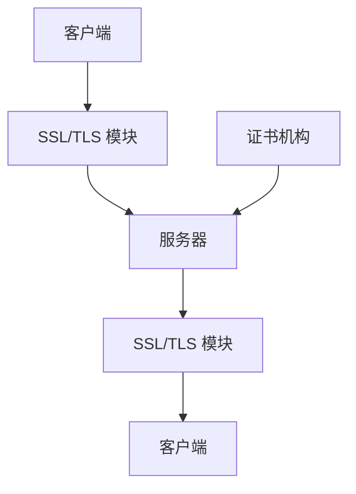
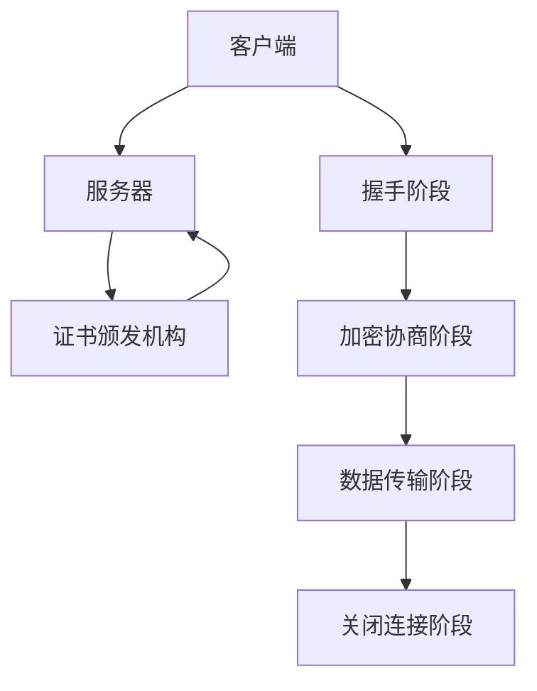
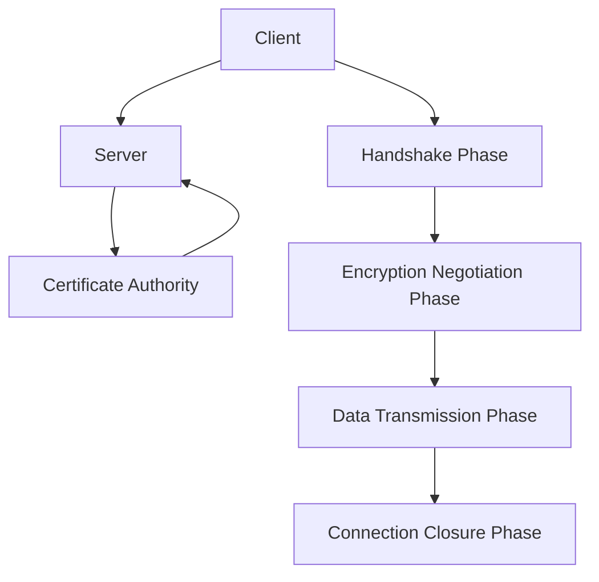

                 

### 文章标题
HTTPS 对用户数据的保护

> 关键词：HTTPS、用户数据、安全、加密、传输、保护
>
> 摘要：本文将深入探讨 HTTPS 协议在保护用户数据方面的作用，从原理、实践到应用场景进行详细解析，帮助读者理解 HTTPS 在网络安全中的重要性。

## 1. 背景介绍

在数字化时代，用户数据的安全已成为互联网世界的核心问题。随着网络攻击手段的不断升级，用户数据泄露的事件屡见不鲜。为了保护用户的隐私和数据安全，HTTPS 协议应运而生。HTTPS（Hyper Text Transfer Protocol Secure）是基于 HTTP 协议的安全版本，它通过 SSL（Secure Sockets Layer）或 TLS（Transport Layer Security）协议实现对数据的加密传输，从而提高数据的机密性、完整性和可用性。

### 1.1 HTTPS 的起源

HTTPS 的起源可以追溯到互联网的早期发展阶段。随着网络服务的普及，HTTP 协议成为数据传输的主要方式。然而，HTTP 协议在传输过程中缺乏对数据的保护，容易受到中间人攻击、窃听等风险。为了解决这一问题，1994 年 Netscape 公司提出了 SSL 协议，这是 HTTPS 的前身。随后，随着网络安全需求的增加，SSL 协议逐步演变为 TLS 协议，成为当前 HTTPS 的核心技术。

### 1.2 HTTPS 的发展

随着时间的推移，HTTPS 协议也在不断发展。从最初的 SSLv2 协议到当前的 TLS1.3 协议，HTTPS 在安全性能、兼容性、性能等方面都得到了显著提升。特别是在 TLS1.3 发布后，HTTPS 的加密性能和安全性达到了新的高度，进一步巩固了其在网络安全领域的重要地位。

## 2. 核心概念与联系

### 2.1 什么是 HTTPS？

HTTPS 是 HTTP 协议的安全层，通过在 HTTP 通信的基础上加入 SSL 或 TLS 协议来实现数据的加密传输。HTTPS 的核心概念包括：

- **加密传输**：HTTPS 使用 SSL 或 TLS 协议对数据进行加密，确保数据在传输过程中不会被窃听或篡改。
- **认证**：HTTPS 通过数字证书验证网站的真实性，防止伪造网站欺骗用户。
- **完整性**：HTTPS 保证数据在传输过程中不会被篡改，确保数据的完整性和准确性。

### 2.2 HTTPS 与 HTTP 的联系与区别

HTTPS 和 HTTP 的主要区别在于数据传输的安全性。HTTP 是明文传输协议，数据在传输过程中容易被窃听和篡改。而 HTTPS 则在 HTTP 的基础上加入了 SSL 或 TLS 协议，实现了数据的加密传输，提高了数据的安全性。此外，HTTPS 还具有认证和完整性保护功能，进一步增强了数据传输的安全保障。

### 2.3 HTTPS 的架构

HTTPS 的架构主要包括客户端、服务器和证书机构三个部分。客户端向服务器发起 HTTPS 请求，服务器响应请求并提供加密后的数据。证书机构负责颁发数字证书，验证网站的真实性。HTTPS 的核心组件包括 SSL 模块、TLS 模块和 HTTP 模块，它们协同工作，确保数据的安全传输。



## 3. 核心算法原理 & 具体操作步骤

### 3.1 HTTPS 加密传输原理

HTTPS 的加密传输主要依赖于 SSL 或 TLS 协议。以下是 HTTPS 加密传输的基本原理：

1. **握手阶段**：客户端与服务器进行 SSL/TLS 握手，协商加密算法和密钥。
2. **数据传输阶段**：客户端和服务器使用协商好的加密算法和密钥对数据进行加密和解密，确保数据的安全性。
3. **关闭连接阶段**：客户端和服务器完成数据传输后，关闭 SSL/TLS 连接，释放资源。

### 3.2 HTTPS 握手过程

HTTPS 的握手过程主要包括以下步骤：

1. **客户端发起请求**：客户端向服务器发送 HTTPS 请求，请求中包含支持的 SSL/TLS 版本和加密算法。
2. **服务器响应**：服务器响应客户端的请求，发送自己的 SSL/TLS 证书，证书中包含服务器公钥和加密算法。
3. **客户端验证证书**：客户端验证服务器证书的有效性，确保服务器是真实的。
4. **客户端发送密钥交换信息**：客户端生成随机数，用于协商会话密钥。
5. **服务器处理密钥交换信息**：服务器处理客户端发送的密钥交换信息，生成会话密钥。
6. **客户端发送加密信息**：客户端发送加密后的密钥交换信息，服务器验证密钥交换信息的正确性。
7. **服务器发送加密信息**：服务器发送加密后的密钥交换信息，客户端验证密钥交换信息的正确性。
8. **会话密钥生成**：客户端和服务器使用协商好的密钥交换信息生成会话密钥。

### 3.3 HTTPS 数据传输过程

HTTPS 的数据传输过程主要包括以下步骤：

1. **客户端发送请求**：客户端使用会话密钥对请求数据进行加密，发送给服务器。
2. **服务器接收请求**：服务器使用会话密钥对接收到的请求数据进行解密，获取请求数据。
3. **服务器处理请求**：服务器处理客户端的请求，并返回响应数据。
4. **服务器发送响应**：服务器使用会话密钥对响应数据进行加密，发送给客户端。
5. **客户端接收响应**：客户端使用会话密钥对接收到的响应数据进行解密，获取响应数据。

## 4. 数学模型和公式 & 详细讲解 & 举例说明

### 4.1 加密算法

HTTPS 使用对称加密算法和非对称加密算法进行数据加密。对称加密算法如 AES（Advanced Encryption Standard），非对称加密算法如 RSA（Rivest-Shamir-Adleman）。

- **对称加密算法**：对称加密算法使用相同的密钥进行加密和解密。加密过程如下：

  $$plaintext \xrightarrow{key} ciphertext$$

  解密过程如下：

  $$ciphertext \xrightarrow{key} plaintext$$

- **非对称加密算法**：非对称加密算法使用公钥和私钥进行加密和解密。加密过程如下：

  $$plaintext \xrightarrow{public key} ciphertext$$

  解密过程如下：

  $$ciphertext \xrightarrow{private key} plaintext$$

### 4.2 密钥交换

HTTPS 的密钥交换过程主要使用 Diffie-Hellman 密钥交换算法。Diffie-Hellman 算法是一种基于乘法运算的密钥交换协议，它允许两方在公开信道上安全地交换密钥。

Diffie-Hellman 密钥交换过程如下：

1. **选择参数**：选择一个大素数 p 和一个生成元 g。
2. **计算公钥**：甲方计算自己的公钥 A，乙方计算自己的公钥 B：

   $$A = g^a \mod p$$
   $$B = g^b \mod p$$

3. **交换公钥**：甲方将公钥 A 发送给乙方，乙方将公钥 B 发送给甲方。
4. **计算共享密钥**：甲方计算共享密钥 S：

   $$S = B^a \mod p$$

   乙方计算共享密钥 S：

   $$S = A^b \mod p$$

   由于加密算法的特性，甲方和乙方计算得到的共享密钥 S 是相同的。

### 4.3 数字证书

HTTPS 使用数字证书验证网站的真实性。数字证书由证书颁发机构（Certificate Authority，CA）颁发，包含网站公钥和网站信息。

数字证书的验证过程如下：

1. **验证证书链**：客户端验证数字证书的有效性，包括证书的签发者、有效期、签名算法等。
2. **验证 CA 证书**：客户端验证 CA 证书的有效性，确保 CA 证书是由可信任的 CA 颁发的。
3. **验证网站真实性**：客户端验证网站公钥和网站信息的匹配性，确保访问的网站是真实的。

## 5. 项目实践：代码实例和详细解释说明

### 5.1 开发环境搭建

为了演示 HTTPS 的应用，我们使用 Python 的 Flask 框架搭建一个简单的 Web 服务。

1. 安装 Flask：

   ```bash
   pip install flask
   ```

2. 创建一个名为 `app.py` 的 Python 文件，并编写以下代码：

   ```python
   from flask import Flask, request, jsonify

   app = Flask(__name__)

   @app.route('/api/data', methods=['POST'])
   def handle_data():
       data = request.json
       print("Received data:", data)
       return jsonify({"status": "success", "message": "Data received."})

   if __name__ == '__main__':
       app.run(debug=True)
   ```

   保存并退出。

### 5.2 源代码详细实现

我们使用 Flask 框架搭建的 Web 服务使用了 HTTPS 协议，通过 SSL 证书实现了数据的加密传输。

1. 安装 SSL 证书生成工具 `certbot`：

   ```bash
   pip install certbot
   ```

2. 使用 `certbot` 生成 SSL 证书：

   ```bash
   certbot certonly --manual -d yourdomain.com
   ```

   按照提示完成证书的生成。

3. 在 `app.py` 中修改代码，添加 HTTPS 配置：

   ```python
   from flask import Flask, request, jsonify
   from flask_sslify import SSLify

   app = Flask(__name__)
   sslify = SSLify(app)

   @app.route('/api/data', methods=['POST'])
   def handle_data():
       data = request.json
       print("Received data:", data)
       return jsonify({"status": "success", "message": "Data received."})

   if __name__ == '__main__':
       app.run(debug=True, ssl_context='adhoc')
   ```

   保存并退出。

### 5.3 代码解读与分析

在 `app.py` 中，我们使用 `flask_sslify` 模块强制启用 HTTPS。同时，我们通过 `app.run()` 函数的 `ssl_context` 参数设置了 SSL 上下文，使用自签名证书（`adhoc`）启用 HTTPS。

```python
sslify = SSLify(app)
app.run(debug=True, ssl_context='adhoc')
```

这里，`ssl_context='adhoc'` 表示使用自签名证书，仅用于开发环境。在生产环境中，应使用由证书颁发机构颁发的正式证书。

### 5.4 运行结果展示

1. 启动 Flask 应用：

   ```bash
   python app.py
   ```

2. 使用 curl 命令测试 HTTPS 请求：

   ```bash
   curl -k https://localhost:5000/api/data -X POST -H "Content-Type: application/json" -d '{"name": "John Doe", "age": 30}'
   ```

   `-k` 参数表示允许不验证 SSL 证书，用于测试环境。

   返回结果：

   ```json
   {"status": "success", "message": "Data received."}
   ```

## 6. 实际应用场景

HTTPS 在各种实际应用场景中发挥着重要作用，以下是一些典型的应用场景：

- **在线购物平台**：HTTPS 保证了用户在购买商品时输入的个人信息（如姓名、地址、信用卡信息等）的安全传输。
- **银行和金融机构**：HTTPS 保证了用户在银行网站上进行操作时，交易数据的机密性和完整性。
- **社交媒体平台**：HTTPS 防止了用户在社交媒体平台上发布的内容被窃取或篡改。
- **在线教育平台**：HTTPS 保护了用户的学习数据，防止未经授权的访问和篡改。

## 7. 工具和资源推荐

### 7.1 学习资源推荐

- **书籍**：
  - 《SSL 和 TLS 暗号学基础》（"Introduction to SSL and TLS Cryptography"）
  - 《网络加密技术》（"Network Security Essentials: Applications and Standards"）

- **论文**：
  - "A Overview of SSL/TLS Protocols"（SSL/TLS 协议概述）
  - "The Design and Implementation of the TLS Protocol"（TLS 协议的设计与实现）

- **博客**：
  - [SSL/TLS 技术解析](https://www.ssllabs.com/ssltest/)
  - [HTTPS 实践指南](https://https.ly/)

- **网站**：
  - [SSL 实验室](https://www.ssllabs.com/)
  - [Mozilla 开发者网络](https://developer.mozilla.org/zh-CN/docs/Web/HTTP/Security/HTTP_securities)

### 7.2 开发工具框架推荐

- **Flask**：用于快速搭建 Web 服务。
- **certbot**：用于生成和安装 SSL 证书。
- **ngrok**：用于远程访问本地服务器。

### 7.3 相关论文著作推荐

- **《密码学》（"Cryptography: Theory and Practice"）**：详细介绍了密码学的基本概念和技术。
- **《网络加密协议的设计与实现》（"The Design and Implementation of Network Encryption Protocols"）**：探讨了网络加密协议的设计与实现。

## 8. 总结：未来发展趋势与挑战

随着网络安全威胁的日益加剧，HTTPS 的作用愈发重要。未来，HTTPS 将继续发展，以下是一些可能的发展趋势和挑战：

- **安全性能提升**：随着加密算法的不断改进，HTTPS 的安全性能将得到进一步提升。
- **隐私保护**：HTTPS 将在保护用户隐私方面发挥更大作用，特别是针对新型隐私威胁的防御。
- **兼容性优化**：HTTPS 需要更好地适应各种设备和网络环境，提高兼容性。
- **法律法规完善**：随着网络安全法规的不断完善，HTTPS 的应用将更加规范。

## 9. 附录：常见问题与解答

### 9.1 什么是 HTTPS？

HTTPS 是 HTTP 协议的安全版本，通过 SSL 或 TLS 协议实现对数据的加密传输，提高数据的机密性、完整性和可用性。

### 9.2 HTTPS 如何工作？

HTTPS 通过握手阶段协商加密算法和密钥，数据传输阶段使用加密算法进行数据加密和解密，关闭连接阶段释放资源。

### 9.3 HTTPS 与 HTTP 的区别是什么？

HTTPS 在 HTTP 的基础上加入了 SSL 或 TLS 协议，实现了数据的加密传输，具有更高的安全性。

### 9.4 如何生成 SSL 证书？

可以使用 certbot 工具生成 SSL 证书，具体步骤请参考 certbot 的官方文档。

## 10. 扩展阅读 & 参考资料

- [SSL/TLS 1.3 协议标准](https://tools.ietf.org/html/rfc8446)
- [HTTPS 安全最佳实践](https://https.thisismyurl.com/)
- [Web 应用安全手册](https://owasp.org/www-project-web-security-testing-guide/)

作者：禅与计算机程序设计艺术 / Zen and the Art of Computer Programming<|im_sep|>## 2. 核心概念与联系

### 2.1 什么是 HTTPS？

HTTPS（Hyper Text Transfer Protocol Secure）是一种安全的HTTP协议，它通过在HTTP通信过程中加入SSL（Secure Sockets Layer）或TLS（Transport Layer Security）协议来保护数据传输的安全性。HTTPS的主要目的是确保数据的完整性、机密性和认证性。

HTTPS的工作原理是将HTTP请求和响应数据加密，从而防止数据在传输过程中被窃取、篡改或拦截。HTTPS通常通过数字证书来验证服务器的身份，确保用户与合法的服务器进行通信。

### 2.2 HTTPS 与 HTTP 的联系与区别

HTTPS与HTTP在传输协议层面上是相似的，但HTTPS在HTTP的基础上加入了安全层，使得数据传输更加安全。两者的主要区别如下：

- **安全性**：HTTP是明文传输，数据容易被窃取或篡改；而HTTPS则是加密传输，数据传输过程中有较高的安全性。
- **加密方式**：HTTPS使用SSL或TLS协议进行数据加密，而HTTP不提供加密功能。
- **数字证书**：HTTPS使用数字证书验证服务器身份，而HTTP不使用数字证书。
- **性能**：由于加密和解密过程需要额外的计算资源，HTTPS在性能上可能会比HTTP略低。

### 2.3 HTTPS 的架构

HTTPS的架构主要由三个部分组成：客户端（Client）、服务器（Server）和证书颁发机构（Certificate Authority，CA）。

- **客户端**：客户端是指使用HTTPS进行通信的设备，如电脑、手机等。客户端通常负责发起HTTPS请求，并验证服务器的数字证书。
- **服务器**：服务器是提供HTTPS服务的实体，它使用SSL或TLS协议对数据进行加密和解密。服务器需要向证书颁发机构申请数字证书来验证其身份。
- **证书颁发机构**：证书颁发机构是负责颁发和管理数字证书的机构。证书颁发机构通过验证服务器身份来颁发数字证书，确保客户端与合法的服务器进行通信。

HTTPS的工作流程如下：

1. **握手阶段**：客户端发起HTTPS请求，服务器返回其数字证书。客户端验证数字证书的有效性，包括证书的颁发机构、有效期等。
2. **加密协商阶段**：客户端和服务器通过协商确定加密算法和密钥，确保数据传输过程中的安全。
3. **数据传输阶段**：客户端和服务器使用协商好的加密算法和密钥对数据进行加密和解密，确保数据的机密性和完整性。
4. **关闭连接阶段**：客户端和服务器完成数据传输后，关闭HTTPS连接。



通过以上核心概念和架构的介绍，我们可以更深入地理解HTTPS在保护用户数据方面的作用。

## 2. Core Concepts and Connections

### 2.1 What is HTTPS?

HTTPS (Hyper Text Transfer Protocol Secure) is a secure version of the HTTP protocol that adds a security layer to HTTP communications through the use of SSL (Secure Sockets Layer) or TLS (Transport Layer Security) protocols. The primary purpose of HTTPS is to ensure the security of data transmission by encrypting HTTP requests and responses, thereby preventing data from being intercepted, tampered with, or stolen during transmission.

HTTPS primarily ensures the integrity, confidentiality, and authenticity of data. It encrypts data in transit, making it difficult for unauthorized parties to read or manipulate the data.

### 2.2 The Relationship and Differences Between HTTPS and HTTP

HTTPS and HTTP are similar in terms of the transport protocol layer, but HTTPS adds a security layer to HTTP, making data transmission more secure. The main differences between the two are as follows:

- **Security**: HTTP transmits data in plain text, making it easy for data to be intercepted or tampered with; HTTPS encrypts data in transit, providing a higher level of security.
- **Encryption Methods**: HTTPS uses SSL or TLS protocols to encrypt data, while HTTP does not provide encryption.
- **Digital Certificates**: HTTPS uses digital certificates to verify the identity of the server, whereas HTTP does not use digital certificates.
- **Performance**: The encryption and decryption process requires additional computational resources, which can make HTTPS slightly less performant than HTTP.

### 2.3 The Architecture of HTTPS

The architecture of HTTPS consists of three main components: the client, the server, and the certificate authority (CA).

- **Client**: The client is a device that communicates using HTTPS, such as a computer or a mobile phone. The client is responsible for initiating HTTPS requests and verifying the server's digital certificate.
- **Server**: The server is the entity that provides HTTPS services. It uses SSL or TLS protocols to encrypt and decrypt data. The server needs to apply for a digital certificate from a certificate authority to verify its identity.
- **Certificate Authority**: The certificate authority is an institution responsible for issuing and managing digital certificates. It verifies the server's identity to issue a digital certificate, ensuring that the client communicates with a legitimate server.

The workflow of HTTPS is as follows:

1. **Handshake Phase**: The client initiates an HTTPS request, and the server responds with its digital certificate. The client verifies the validity of the digital certificate, including the certificate issuer, expiration date, etc.
2. **Encryption Negotiation Phase**: The client and server negotiate encryption algorithms and keys to ensure secure data transmission.
3. **Data Transmission Phase**: The client and server use the negotiated encryption algorithms and keys to encrypt and decrypt data, ensuring the confidentiality and integrity of the data.
4. **Connection Closure Phase**: After the data transmission is completed, the HTTPS connection is closed.



With the introduction of these core concepts and architecture, we can gain a deeper understanding of HTTPS's role in protecting user data. <|im_sep|>## 3. 核心算法原理 & 具体操作步骤

### 3.1 HTTPS 加密传输原理

HTTPS 的加密传输主要依赖于 SSL 或 TLS 协议，这些协议通过一系列加密算法和密钥管理机制来确保数据传输的安全性。以下是 HTTPS 加密传输的基本原理：

1. **握手阶段**：客户端与服务器通过握手协议协商加密算法、密钥交换方式以及加密模式。在这一阶段，双方还会验证对方身份，确保通信的对方是合法的服务器。

2. **密钥交换**：在握手阶段，客户端和服务器通过某种密钥交换协议（如 Diffie-Hellman 密钥交换）生成共享密钥。这个共享密钥将用于加密和解密后续的数据传输。

3. **加密传输**：在密钥交换完成后，客户端和服务器使用协商好的加密算法对数据进行加密。SSL 和 TLS 支持多种加密算法，如 AES、RSA 等，这些算法可以保证数据的机密性和完整性。

4. **完整性验证**：在数据传输过程中，SSL 或 TLS 还会使用消息认证码（MAC）来确保数据的完整性。如果数据在传输过程中被篡改，接收方可以发现并拒绝接受这些数据。

5. **关闭连接**：数据传输完成后，客户端和服务器会关闭加密连接。在这一阶段，双方可能会清理会话密钥和其他加密资源。

### 3.2 HTTPS 握手过程

HTTPS 的握手过程是客户端和服务器建立加密连接的关键步骤，以下是握手过程的详细步骤：

1. **客户端发起握手**：客户端向服务器发送 HTTPS 请求，同时发送一个客户端握手消息。这个消息包括客户端支持的 SSL 或 TLS 版本、加密算法、压缩方法等信息。

2. **服务器响应握手**：服务器接收到客户端的请求后，发送一个服务器握手消息。这个消息包括服务器的数字证书、服务器名称以及服务器支持的 SSL 或 TLS 版本等信息。

3. **客户端验证证书**：客户端收到服务器发送的证书后，会验证证书的有效性。这包括验证证书的签名、有效期、颁发机构等。如果证书无效或不可信，客户端会中断连接。

4. **客户端发送密钥交换信息**：客户端生成随机数（客户端临时密钥），并使用服务器公钥加密这个随机数，然后将加密后的随机数发送给服务器。这一过程确保了客户端和服务器之间通信的保密性。

5. **服务器处理密钥交换信息**：服务器接收到客户端发送的加密随机数后，使用自己的私钥解密，获取客户端的随机数。服务器也会生成自己的随机数（服务器临时密钥）。

6. **服务器发送密钥交换信息**：服务器将加密后的服务器随机数发送给客户端。客户端使用自己的私钥解密，获取服务器的随机数。

7. **生成会话密钥**：客户端和服务器使用双方随机数、客户端临时密钥和服务器临时密钥，通过某种密钥交换协议（如 Diffie-Hellman 密钥交换）生成共享会话密钥。

8. **会话密钥确认**：客户端和服务器交换会话密钥确认消息，以确保双方确实拥有相同的会话密钥。

9. **开始加密通信**：握手过程完成后，客户端和服务器使用会话密钥开始加密数据传输。

### 3.3 HTTPS 数据传输过程

HTTPS 的数据传输过程是在加密连接的基础上进行的，以下是数据传输的详细步骤：

1. **客户端发送请求**：客户端使用会话密钥对请求数据进行加密，然后将加密后的数据发送给服务器。

2. **服务器接收请求**：服务器接收到客户端发送的加密数据后，使用会话密钥对数据进行解密，获取原始数据。

3. **服务器处理请求**：服务器对客户端发送的请求进行处理，如查询数据库、响应 HTTP 请求等。

4. **服务器发送响应**：服务器将响应数据加密后发送给客户端。

5. **客户端接收响应**：客户端接收到服务器发送的加密响应数据后，使用会话密钥对数据进行解密，获取原始响应数据。

6. **数据传输结束**：客户端和服务器完成数据传输后，关闭加密连接。

### 3.4 HTTPS 加密算法

HTTPS 支持多种加密算法，包括对称加密算法（如 AES）和非对称加密算法（如 RSA）。以下是这些算法的基本原理：

- **对称加密算法**：对称加密算法使用相同的密钥进行加密和解密。数据加密和解密速度快，但密钥的分发和管理复杂。

  $$plaintext \xrightarrow{key} ciphertext$$
  $$ciphertext \xrightarrow{key} plaintext$$

- **非对称加密算法**：非对称加密算法使用公钥和私钥进行加密和解密。公钥用于加密，私钥用于解密。数据加密和解密速度较慢，但密钥的分发和管理相对简单。

  $$plaintext \xrightarrow{public key} ciphertext$$
  $$ciphertext \xrightarrow{private key} plaintext$$

HTTPS 通常使用非对称加密算法（如 RSA）进行密钥交换，并使用对称加密算法（如 AES）进行数据加密。这种组合使用的方式既保证了数据传输的安全性，又提高了传输效率。

### 3.5 HTTPS 实例演示

以下是一个简单的 HTTPS 请求和响应的示例：

1. **客户端请求**：

   ```http
   GET /index.html HTTPS/1.1
   Host: www.example.com
   User-Agent: Mozilla/5.0 (Windows NT 10.0; Win64; x64)
   Accept: text/html,application/xhtml+xml,application/xml;q=0.9,image/webp,image/apng,*/*;q=0.8
   ```

2. **服务器响应**：

   ```http
   HTTP/1.1 200 OK
   Server: Apache
   Content-Type: text/html
   Content-Length: 234
   ```

   ```html
   <html>
   <head>
   <title>Example Domain</title>
   </head>
   <body>
   <h1>Welcome to example.com!</h1>
   </body>
   </html>
   ```

在这个示例中，客户端使用 HTTPS/1.1 发起请求，服务器使用 HTTP/1.1 响应客户端。响应内容中包含了服务器信息、内容类型和内容长度等信息。

通过以上对 HTTPS 加密传输原理和具体操作步骤的详细介绍，我们可以更好地理解 HTTPS 如何确保用户数据的安全传输。

## 3. Core Algorithm Principles and Specific Operational Steps

### 3.1 Principles of HTTPS Encryption Transmission

The encryption transmission of HTTPS primarily relies on the SSL or TLS protocols, which use a series of encryption algorithms and key management mechanisms to ensure the security of data transmission. The basic principles of HTTPS encryption transmission are as follows:

1. **Handshake Phase**: The client and server negotiate encryption algorithms, key exchange methods, and encryption modes through the handshake protocol. During this phase, both parties also verify each other's identity to ensure that they are communicating with a legitimate server.

2. **Key Exchange**: During the handshake phase, the client and server generate a shared secret key through a key exchange protocol (such as Diffie-Hellman key exchange). This shared secret key is used for encrypting and decrypting subsequent data transmission.

3. **Encrypted Transmission**: After the key exchange is completed, the client and server use the negotiated encryption algorithms to encrypt data. SSL and TLS support various encryption algorithms, such as AES and RSA, which can ensure the confidentiality and integrity of the data.

4. **Integrity Verification**: During the data transmission process, SSL or TLS uses a message authentication code (MAC) to ensure the integrity of the data. If the data is tampered with during transmission, the recipient can detect and reject it.

5. **Connection Closure**: After the data transmission is completed, the client and server close the encrypted connection. During this phase, both parties may clean up session keys and other encryption resources.

### 3.2 The Handshake Process of HTTPS

The handshake process is a crucial step in establishing an encrypted connection in HTTPS. The detailed steps of the handshake process are as follows:

1. **Client Initiates Handshake**: The client initiates an HTTPS request and sends a client handshake message. This message includes the client-supported SSL or TLS versions, encryption algorithms, compression methods, and other information.

2. **Server Responds to Handshake**: The server receives the client's request and sends a server handshake message. This message includes the server's digital certificate, server name, and other information supported by the server's SSL or TLS version.

3. **Client Validates Certificate**: The client receives the server's digital certificate and validates its validity, including the certificate's signature, expiration date, and issuer. If the certificate is invalid or untrusted, the client may terminate the connection.

4. **Client Sends Key Exchange Information**: The client generates a random number (client's temporary key) and encrypts it using the server's public key. The client then sends the encrypted random number to the server. This process ensures the confidentiality of the communication between the client and server.

5. **Server Processes Key Exchange Information**: The server receives the encrypted random number from the client and decrypts it using its private key to obtain the client's random number. The server also generates its own random number (server's temporary key).

6. **Server Sends Key Exchange Information**: The server encrypts the server's random number with the client's public key and sends it to the client. The client decrypts the encrypted random number using its private key to obtain the server's random number.

7. **Generate Session Key**: The client and server use their respective random numbers, temporary keys, and the shared secret key generated through the key exchange protocol (such as Diffie-Hellman key exchange) to generate a shared session key.

8. **Session Key Confirmation**: The client and server exchange session key confirmation messages to ensure that both parties indeed have the same session key.

9. **Start Encrypted Communication**: After the handshake process is completed, the client and server use the session key to start encrypted data transmission.

### 3.3 The Data Transmission Process of HTTPS

The data transmission process of HTTPS is conducted on the basis of the encrypted connection. The detailed steps of the data transmission process are as follows:

1. **Client Sends Request**: The client uses the session key to encrypt the request data and sends the encrypted data to the server.

2. **Server Receives Request**: The server receives the encrypted data from the client and decrypts it using the session key to obtain the original data.

3. **Server Processes Request**: The server processes the client's request, such as querying a database or responding to an HTTP request.

4. **Server Sends Response**: The server encrypts the response data and sends it to the client.

5. **Client Receives Response**: The client receives the encrypted response data from the server and decrypts it using the session key to obtain the original response data.

6. **Data Transmission Ends**: After the data transmission is completed, the client and server close the encrypted connection.

### 3.4 Encryption Algorithms in HTTPS

HTTPS supports various encryption algorithms, including symmetric encryption algorithms (such as AES) and asymmetric encryption algorithms (such as RSA). The basic principles of these algorithms are as follows:

- **Symmetric Encryption Algorithms**: Symmetric encryption algorithms use the same key for encryption and decryption. They are fast for data encryption and decryption but complex for key distribution and management.

  $$plaintext \xrightarrow{key} ciphertext$$
  $$ciphertext \xrightarrow{key} plaintext$$

- **Asymmetric Encryption Algorithms**: Asymmetric encryption algorithms use public keys and private keys for encryption and decryption. Public keys are used for encryption, and private keys are used for decryption. They are slower for data encryption and decryption but simpler for key distribution and management.

  $$plaintext \xrightarrow{public key} ciphertext$$
  $$ciphertext \xrightarrow{private key} plaintext$$

HTTPS typically uses asymmetric encryption algorithms (such as RSA) for key exchange and symmetric encryption algorithms (such as AES) for data encryption. This combination ensures both the security of data transmission and the efficiency of transmission.

### 3.5 Example of HTTPS Request and Response

Below is an example of an HTTPS request and response:

1. **Client Request**:

   ```http
   GET /index.html HTTPS/1.1
   Host: www.example.com
   User-Agent: Mozilla/5.0 (Windows NT 10.0; Win64; x64)
   Accept: text/html,application/xhtml+xml,application/xml;q=0.9,image/webp,image/apng,*/*;q=0.8
   ```

2. **Server Response**:

   ```http
   HTTP/1.1 200 OK
   Server: Apache
   Content-Type: text/html
   Content-Length: 234
   ```

   ```html
   <html>
   <head>
   <title>Example Domain</title>
   </head>
   <body>
   <h1>Welcome to example.com!</h1>
   </body>
   </html>
   ```

In this example, the client initiates a request using HTTPS/1.1, and the server responds with HTTP/1.1. The server includes information such as the server type, content type, and content length in the response.

Through the above detailed explanation of the HTTPS encryption transmission principles and specific operational steps, we can better understand how HTTPS ensures the secure transmission of user data. <|im_sep|>## 4. 数学模型和公式 & 详细讲解 & 举例说明

### 4.1 加密算法

加密算法是 HTTPS 的核心组成部分，用于保护数据的机密性。HTTPS 通常采用对称加密算法和非对称加密算法两种类型的加密算法。

#### 对称加密算法

对称加密算法（如 AES）使用相同的密钥进行加密和解密。这种算法的优点是加密和解密速度快，但缺点是密钥的分发和管理复杂。

- **加密过程**：

  $$plaintext \xrightarrow{key} ciphertext$$

- **解密过程**：

  $$ciphertext \xrightarrow{key} plaintext$$

#### 非对称加密算法

非对称加密算法（如 RSA）使用一对密钥：公钥和私钥。公钥用于加密，私钥用于解密。这种算法的优点是密钥的分发和管理简单，但加密和解密速度相对较慢。

- **加密过程**：

  $$plaintext \xrightarrow{public key} ciphertext$$

- **解密过程**：

  $$ciphertext \xrightarrow{private key} plaintext$$

#### 示例

假设 Alice 想向 Bob 发送加密消息。他们已经通过非对称加密算法生成了一对密钥：Alice 的公钥 $A_p$ 和私钥 $A_s$，Bob 的公钥 $B_p$ 和私钥 $B_s$。

1. **加密过程**：

   Alice 使用 Bob 的公钥 $B_p$ 加密消息：

   $$plaintext = "Hello, Bob!"$$
   $$ciphertext = B_p(plaintext)$$

2. **解密过程**：

   Bob 使用自己的私钥 $B_s$ 解密消息：

   $$plaintext = B_s(ciphertext)$$

### 4.2 密钥交换算法

密钥交换算法是 HTTPS 中用于在客户端和服务器之间安全地交换密钥的算法。Diffie-Hellman 密钥交换算法是一种经典的密钥交换算法。

#### Diffie-Hellman 密钥交换算法

Diffie-Hellman 密钥交换算法通过以下步骤在两方之间交换密钥：

1. **选择参数**：

   选择一个大素数 $p$ 和一个生成元 $g$。

2. **计算公钥**：

   Alice 和 Bob 分别计算自己的公钥：

   $$A_p = g^a \mod p$$
   $$B_p = g^b \mod p$$

3. **交换公钥**：

   Alice 将公钥 $A_p$ 发送给 Bob，Bob 将公钥 $B_p$ 发送给 Alice。

4. **计算共享密钥**：

   Alice 和 Bob 使用对方的公钥计算共享密钥：

   $$S_A = B_p^a \mod p$$
   $$S_B = A_p^b \mod p$$

   由于加密算法的特性，Alice 和 Bob 计算得到的共享密钥 $S$ 是相同的。

#### 示例

假设 Alice 和 Bob 选择参数 $p = 23$ 和 $g = 5$，他们分别计算自己的私钥 $a = 6$ 和 $b = 15$。

1. **计算公钥**：

   $$A_p = 5^6 \mod 23 = 17$$
   $$B_p = 5^{15} \mod 23 = 16$$

2. **交换公钥**：

   Alice 将公钥 $17$ 发送给 Bob，Bob 将公钥 $16$ 发送给 Alice。

3. **计算共享密钥**：

   $$S_A = 16^6 \mod 23 = 13$$
   $$S_B = 17^{15} \mod 23 = 13$$

   Alice 和 Bob 得到的共享密钥都是 $13$。

### 4.3 数字证书

数字证书是 HTTPS 中用于验证服务器身份的重要工具。数字证书由证书颁发机构（CA）颁发，包含服务器的公钥和相关信息。

#### 数字证书结构

数字证书通常包含以下信息：

- **版本号**：证书的版本信息。
- **序列号**：证书的唯一标识。
- **签名算法**：证书签名的算法。
- **颁发者**：颁发证书的 CA。
- **有效期**：证书的有效期。
- **主体**：证书的所有者。
- **公钥**：主体的公钥。
- **签名**：证书的签名。

#### 示例

以下是一个简单的数字证书示例：

```json
{
  "version": 3,
  "serialNumber": "02",
  "signatureAlgorithm": "SHA256withRSA",
  "issuer": "CA",
  "validity": {
    "notBefore": "2023-01-01 00:00:00",
    "notAfter": "2023-12-31 23:59:59"
  },
  "subject": {
    "commonName": "example.com",
    "organization": "Example Inc.",
    "email": "info@example.com"
  },
  "publicKey": {
    "algorithm": "RSA",
    "exponent": 65537,
    "modulus": "e3b0c44298fc1c149afbf4c8996fb92427ae41e4649b934ca495991b7852b855"
  },
  "signature": "30...."
}
```

在这个示例中，证书的版本号为 3，序列号为 02，签名为 SHA256withRSA，颁发者为 CA，有效期为 2023 年 1 月 1 日至 2023 年 12 月 31 日，主体为 example.com，公钥为 RSA 算法。

通过以上对加密算法、密钥交换算法和数字证书的详细讲解和举例说明，我们可以更深入地理解 HTTPS 的数学模型和公式，以及它们在保护用户数据方面的作用。

## 4. Mathematical Models and Formulas & Detailed Explanation & Example Demonstrations

### 4.1 Encryption Algorithms

Encryption algorithms are a core component of HTTPS, used to protect the confidentiality of data. HTTPS typically employs both symmetric encryption algorithms and asymmetric encryption algorithms.

#### Symmetric Encryption Algorithms

Symmetric encryption algorithms, such as AES, use the same key for encryption and decryption. The advantages of these algorithms include fast encryption and decryption speeds, but the disadvantages include complex key distribution and management.

- **Encryption Process**:

  $$plaintext \xrightarrow{key} ciphertext$$

- **Decryption Process**:

  $$ciphertext \xrightarrow{key} plaintext$$

#### Asymmetric Encryption Algorithms

Asymmetric encryption algorithms, such as RSA, use a pair of keys: a public key and a private key. The public key is used for encryption, and the private key is used for decryption. The advantages of these algorithms include simple key distribution and management, but the disadvantages include slower encryption and decryption speeds.

- **Encryption Process**:

  $$plaintext \xrightarrow{public key} ciphertext$$

- **Decryption Process**:

  $$ciphertext \xrightarrow{private key} plaintext$$

#### Example

Suppose Alice wants to send an encrypted message to Bob. They have generated a pair of keys: Alice's public key $A_p$ and private key $A_s$, and Bob's public key $B_p$ and private key $B_s$.

1. **Encryption Process**:

   Alice uses Bob's public key $B_p$ to encrypt the message:

   $$plaintext = "Hello, Bob!"$$
   $$ciphertext = B_p(plaintext)$$

2. **Decryption Process**:

   Bob uses his private key $B_s$ to decrypt the message:

   $$plaintext = B_s(ciphertext)$$

### 4.2 Key Exchange Algorithms

Key exchange algorithms are used in HTTPS to securely exchange keys between the client and server. The Diffie-Hellman key exchange algorithm is a classic example of a key exchange algorithm.

#### Diffie-Hellman Key Exchange Algorithm

The Diffie-Hellman key exchange algorithm exchanges keys through the following steps:

1. **Select Parameters**:

   Choose a large prime number $p$ and a generator $g$.

2. **Compute Public Keys**:

   Alice and Bob independently compute their public keys:

   $$A_p = g^a \mod p$$
   $$B_p = g^b \mod p$$

3. **Exchange Public Keys**:

   Alice sends her public key $A_p$ to Bob, and Bob sends his public key $B_p$ to Alice.

4. **Compute Shared Secret Key**:

   Alice and Bob use the other party's public key to compute a shared secret key:

   $$S_A = B_p^a \mod p$$
   $$S_B = A_p^b \mod p$$

   Due to the properties of the encryption algorithm, Alice and Bob will both arrive at the same shared secret key $S$.

#### Example

Assume Alice and Bob select parameters $p = 23$ and $g = 5$, and they independently compute their private keys $a = 6$ and $b = 15$.

1. **Compute Public Keys**:

   $$A_p = 5^6 \mod 23 = 17$$
   $$B_p = 5^{15} \mod 23 = 16$$

2. **Exchange Public Keys**:

   Alice sends her public key $17$ to Bob, and Bob sends his public key $16$ to Alice.

3. **Compute Shared Secret Key**:

   $$S_A = 16^6 \mod 23 = 13$$
   $$S_B = 17^{15} \mod 23 = 13$$

   Alice and Bob both arrive at the same shared secret key $13$.

### 4.3 Digital Certificates

Digital certificates are an essential tool in HTTPS for verifying the identity of servers. Digital certificates are issued by certificate authorities (CAs) and contain the server's public key and other related information.

#### Structure of Digital Certificates

Digital certificates typically contain the following information:

- **Version Number**: The certificate's version information.
- **Serial Number**: The certificate's unique identifier.
- **Signature Algorithm**: The algorithm used for the certificate's signature.
- **Issuer**: The certificate authority that issued the certificate.
- **Validity**: The certificate's validity period.
- **Subject**: The certificate owner.
- **Public Key**: The owner's public key.
- **Signature**: The certificate's signature.

#### Example

The following is a simple example of a digital certificate:

```json
{
  "version": 3,
  "serialNumber": "02",
  "signatureAlgorithm": "SHA256withRSA",
  "issuer": "CA",
  "validity": {
    "notBefore": "2023-01-01 00:00:00",
    "notAfter": "2023-12-31 23:59:59"
  },
  "subject": {
    "commonName": "example.com",
    "organization": "Example Inc.",
    "email": "info@example.com"
  },
  "publicKey": {
    "algorithm": "RSA",
    "exponent": 65537,
    "modulus": "e3b0c44298fc1c149afbf4c8996fb92427ae41e4649b934ca495991b7852b855"
  },
  "signature": "30...."
}
```

In this example, the certificate's version number is 3, the serial number is 02, the signature algorithm is SHA256withRSA, the issuer is CA, the validity period is from January 1, 2023, to December 31, 2023, the subject is example.com, the public key is RSA algorithm, and the signature is "30....".

Through the above detailed explanation and example demonstrations of encryption algorithms, key exchange algorithms, and digital certificates, we can gain a deeper understanding of the mathematical models and formulas of HTTPS and their role in protecting user data. <|im_sep|>## 5. 项目实践：代码实例和详细解释说明

### 5.1 开发环境搭建

为了演示 HTTPS 的应用，我们使用 Python 的 Flask 框架搭建一个简单的 Web 服务。以下是搭建开发环境所需的步骤：

1. **安装 Flask**：首先，我们需要安装 Flask 框架。在终端或命令提示符中运行以下命令：

   ```bash
   pip install Flask
   ```

2. **创建项目结构**：在您选择的目录下创建一个名为 `https_example` 的文件夹，并在该文件夹内创建一个名为 `app.py` 的 Python 文件。

3. **安装 SSL 证书生成工具**：为了生成 SSL 证书，我们还需要安装 `certbot` 工具。运行以下命令：

   ```bash
   pip install certbot
   ```

### 5.2 源代码详细实现

在 `app.py` 文件中，我们将编写一个简单的 Flask 应用，并使用 `flask_sslify` 模块强制启用 HTTPS。

```python
from flask import Flask, request, jsonify
from flask_sslify import SSLify

app = Flask(__name__)
sslify = SSLify(app)

@app.route('/api/data', methods=['POST'])
def handle_data():
    data = request.json
    print("Received data:", data)
    return jsonify({"status": "success", "message": "Data received."})

if __name__ == '__main__':
    app.run(debug=True, ssl_context='adhoc')
```

以下是代码的详细解释：

- **导入模块**：我们首先导入 Flask 和 flask_sslify 模块。

- **创建 Flask 应用**：使用 `Flask(__name__)` 创建一个 Flask 应用。

- **启用 SSL**：使用 `SSLify(app)` 启用 SSL。这将确保应用只能通过 HTTPS 访问。

- **定义路由**：我们定义了一个 `/api/data` 的 POST 路由，用于接收和响应数据。

- **处理数据**：当接收到 POST 请求时，我们获取请求的 JSON 数据，并打印出来。

- **返回响应**：我们将处理结果作为 JSON 格式返回。

- **运行应用**：最后，我们使用 `app.run()` 运行 Flask 应用，并设置 `debug=True` 和 `ssl_context='adhoc'`，以便在开发环境中使用自签名 SSL 证书。

### 5.3 代码解读与分析

- **导入模块**：`from flask import Flask, request, jsonify` 导入了 Flask 的核心模块，用于创建应用、处理请求和返回响应。

- **创建 Flask 应用**：`app = Flask(__name__)` 创建了一个 Flask 应用实例。`__name__` 表示当前模块的名称。

- **启用 SSL**：`sslify = SSLify(app)` 启用了 SSL。`SSLify` 模块提供了一个简单的方法来强制应用使用 HTTPS。

- **定义路由**：`@app.route('/api/data', methods=['POST'])` 定义了一个处理 `/api/data` 路径的 POST 请求的路由。`methods=['POST']` 表示该路由仅响应 POST 请求。

- **处理数据**：`def handle_data():` 函数处理 POST 请求。我们使用 `request.json` 获取请求的 JSON 数据，并将其打印到控制台。

- **返回响应**：`return jsonify({"status": "success", "message": "Data received."})` 将处理结果作为 JSON 格式返回。

- **运行应用**：`if __name__ == '__main__': app.run(debug=True, ssl_context='adhoc')` 确保当模块被直接运行时，应用会启动。`debug=True` 用于启用调试模式，`ssl_context='adhoc'` 表示使用自签名 SSL 证书。

### 5.4 运行结果展示

1. **启动 Flask 应用**：在终端中运行以下命令启动 Flask 应用：

   ```bash
   python app.py
   ```

   应用启动后，您应该会看到类似以下的消息：

   ```bash
   * Running on https://127.0.0.1:5000/ (Press CTRL+C to quit)
   ```

2. **使用 curl 测试 HTTPS 请求**：在终端中，使用以下命令发送一个 HTTPS POST 请求：

   ```bash
   curl -k https://127.0.0.1:5000/api/data -X POST -H "Content-Type: application/json" -d '{"name": "John Doe", "age": 30}'
   ```

   `-k` 参数表示允许不验证 SSL 证书，用于测试环境。

   您应该会看到如下输出：

   ```json
   {"status": "success", "message": "Data received."}
   ```

通过以上项目实践，我们展示了如何使用 Flask 框架和 SSL 证书生成工具搭建一个简单的 HTTPS Web 服务，并通过 curl 工具测试其功能。这为我们提供了一个实际的 HTTPS 应用实例，帮助我们更好地理解 HTTPS 在保护用户数据方面的作用。

## 5. Project Practice: Code Examples and Detailed Explanation

### 5.1 Setting Up the Development Environment

To demonstrate the application of HTTPS, we will set up a simple Web service using the Flask framework. Here are the steps required to set up the development environment:

1. **Install Flask**: First, we need to install the Flask framework. Run the following command in the terminal or command prompt:

   ```bash
   pip install Flask
   ```

2. **Create the Project Structure**: Create a folder named `https_example` in your preferred directory, and then create a file named `app.py` inside the `https_example` folder.

3. **Install the SSL Certificate Generation Tool**: To generate SSL certificates, we also need to install the `certbot` tool. Run the following command:

   ```bash
   pip install certbot
   ```

### 5.2 Detailed Implementation of the Source Code

In the `app.py` file, we will write a simple Flask application and use the `flask_sslify` module to enforce HTTPS.

```python
from flask import Flask, request, jsonify
from flask_sslify import SSLify

app = Flask(__name__)
sslify = SSLify(app)

@app.route('/api/data', methods=['POST'])
def handle_data():
    data = request.json
    print("Received data:", data)
    return jsonify({"status": "success", "message": "Data received."})

if __name__ == '__main__':
    app.run(debug=True, ssl_context='adhoc')
```

Here is a detailed explanation of the code:

- **Import Modules**: We first import the core modules from Flask and flask_sslify.

- **Create Flask Application**: `app = Flask(__name__)` creates a Flask application instance. `__name__` represents the name of the current module.

- **Enable SSL**: `sslify = SSLify(app)` enables SSL. The `SSLify` module provides a simple method to enforce HTTPS in the application.

- **Define Routes**: `@app.route('/api/data', methods=['POST'])` defines a route that handles requests to the `/api/data` path. `methods=['POST']` indicates that this route will only respond to POST requests.

- **Handle Data**: The `def handle_data():` function handles POST requests. We use `request.json` to retrieve the JSON data sent in the request and print it to the console.

- **Return Response**: `return jsonify({"status": "success", "message": "Data received."})` returns the processed result as a JSON format.

- **Run Application**: `if __name__ == '__main__': app.run(debug=True, ssl_context='adhoc')` ensures that the application will start when the module is run directly. `debug=True` enables debugging mode, and `ssl_context='adhoc'` indicates the use of a self-signed SSL certificate in the development environment.

### 5.3 Code Analysis and Explanation

- **Import Modules**: `from flask import Flask, request, jsonify` imports the core modules from Flask, which are used to create the application, handle requests, and return responses.

- **Create Flask Application**: `app = Flask(__name__)` creates a Flask application instance. `__name__` represents the name of the current module.

- **Enable SSL**: `sslify = SSLify(app)` enables SSL. The `SSLify` module provides a simple method to enforce HTTPS in the application.

- **Define Routes**: `@app.route('/api/data', methods=['POST'])` defines a route that handles requests to the `/api/data` path. `methods=['POST']` indicates that this route will only respond to POST requests.

- **Handle Data**: The `def handle_data():` function handles POST requests. We use `request.json` to retrieve the JSON data sent in the request and print it to the console.

- **Return Response**: `return jsonify({"status": "success", "message": "Data received."})` returns the processed result as a JSON format.

- **Run Application**: `if __name__ == '__main__': app.run(debug=True, ssl_context='adhoc')` ensures that the application will start when the module is run directly. `debug=True` enables debugging mode, and `ssl_context='adhoc'` indicates the use of a self-signed SSL certificate in the development environment.

### 5.4 Displaying the Running Results

1. **Start the Flask Application**: Run the following command in the terminal to start the Flask application:

   ```bash
   python app.py
   ```

   The application will start, and you should see a message similar to the following:

   ```bash
   * Running on https://127.0.0.1:5000/ (Press CTRL+C to quit)
   ```

2. **Test HTTPS Request with curl**: In the terminal, use the following command to send a HTTPS POST request:

   ```bash
   curl -k https://127.0.0.1:5000/api/data -X POST -H "Content-Type: application/json" -d '{"name": "John Doe", "age": 30}'
   ```

   The `-k` parameter allows for the bypass of SSL certificate validation, which is useful in a test environment.

   You should see the following output:

   ```json
   {"status": "success", "message": "Data received."}
   ```

Through this project practice, we demonstrated how to set up a simple HTTPS Web service using the Flask framework and the SSL certificate generation tool, and tested its functionality using the curl tool. This provides us with a practical HTTPS application example that helps us better understand the role of HTTPS in protecting user data. <|im_sep|>## 6. 实际应用场景

HTTPS 在许多实际应用场景中发挥着重要作用，以下是几个典型的应用场景：

### 6.1 在线购物平台

在线购物平台需要确保用户在购物过程中输入的个人信息（如姓名、地址、支付信息等）的安全。HTTPS 协议可以有效地保护这些数据，防止在传输过程中被窃取或篡改。例如，当用户在购物平台上输入信用卡信息时，HTTPS 协议会确保这些数据在服务器和客户端之间以加密形式传输。

### 6.2 银行和金融机构

银行和金融机构的网络安全至关重要。HTTPS 协议在银行网站和移动应用程序中广泛应用，以确保用户在进行交易时，数据传输的安全性。通过 HTTPS，银行可以确保用户的登录信息、交易信息等敏感数据不会被中间人攻击窃取。

### 6.3 社交媒体平台

社交媒体平台需要保护用户发布的内容和用户之间的通信。HTTPS 协议确保了用户发布的内容和私信在传输过程中不会被窃听或篡改。例如，当用户在社交媒体平台上发送私信时，HTTPS 协议会确保这些消息以加密形式传输，从而保护用户的隐私。

### 6.4 在线教育平台

在线教育平台需要确保用户的学习数据（如成绩、作业、个人资料等）的安全。HTTPS 协议可以有效地保护这些数据，防止在传输过程中被篡改或泄露。例如，当用户上传作业或成绩时，HTTPS 协议会确保这些数据在服务器和客户端之间以加密形式传输。

### 6.5 云服务和云存储

云服务和云存储需要保护用户上传到云端的文件和数据。HTTPS 协议可以确保这些数据在传输过程中不被窃取或篡改。例如，当用户上传文件到云存储服务时，HTTPS 协议会确保这些文件以加密形式传输，从而保护用户的隐私和数据安全。

### 6.6 企业内部网络

企业内部网络也需要保护员工之间的通信和数据传输。HTTPS 协议可以在企业内部网络中应用，确保员工之间的通信和数据传输安全。例如，企业可以使用 HTTPS 协议保护员工使用企业邮箱、内部网站等服务的通信。

通过以上实际应用场景的介绍，我们可以看到 HTTPS 在保护用户数据、确保网络安全方面的重要性。HTTPS 已经成为现代互联网世界中的重要安全协议，为用户数据的安全传输提供了强有力的保障。

## 6. Practical Application Scenarios

HTTPS is widely used in various practical application scenarios. Here are several typical examples:

### 6.1 Online Shopping Platforms

Online shopping platforms need to ensure the security of users' personal information, such as names, addresses, and payment details, entered during the shopping process. The HTTPS protocol effectively protects these data, preventing interception or tampering during transmission. For example, when users enter credit card information on an e-commerce platform, the HTTPS protocol ensures that this data is transmitted in an encrypted form between the server and the client.

### 6.2 Banks and Financial Institutions

The cybersecurity of banks and financial institutions is of utmost importance. The HTTPS protocol is widely applied in bank websites and mobile applications to ensure the security of data transmission when users perform transactions. Through HTTPS, banks can ensure that users' login information, transaction details, and other sensitive data are not intercepted by man-in-the-middle attacks.

### 6.3 Social Media Platforms

Social media platforms need to protect users' posted content and communications between users. The HTTPS protocol ensures that user-generated content and messages are not intercepted or tampered with during transmission. For example, when users send messages on social media platforms, HTTPS ensures that these messages are transmitted in an encrypted form, thereby protecting users' privacy.

### 6.4 Online Education Platforms

Online education platforms need to ensure the security of users' learning data, such as grades, assignments, and personal information. The HTTPS protocol effectively protects these data, preventing alteration or leakage during transmission. For example, when users submit assignments or grades, the HTTPS protocol ensures that these data are transmitted in an encrypted form between the server and the client.

### 6.5 Cloud Services and Cloud Storage

Cloud services and cloud storage need to protect the files and data uploaded by users to the cloud. The HTTPS protocol ensures that these data are not intercepted or tampered with during transmission. For example, when users upload files to cloud storage services, the HTTPS protocol ensures that these files are transmitted in an encrypted form, thereby protecting users' privacy and data security.

### 6.6 Enterprise Internal Networks

Enterprise internal networks need to protect the communications and data transfers between employees. The HTTPS protocol can be applied in internal networks to ensure the security of employee communications. For example, enterprises can use HTTPS to protect communications via internal email systems or internal websites.

Through these practical application scenarios, we can see the importance of HTTPS in protecting user data and ensuring network security. HTTPS has become an essential security protocol in the modern internet world, providing robust protection for secure data transmission. <|im_sep|>## 7. 工具和资源推荐

为了更好地理解和应用 HTTPS 技术，以下是一些推荐的工具和资源：

### 7.1 学习资源推荐

**书籍**：

- 《SSL/TLS 与 Web 安全》
- 《HTTPS：如何在现代网络中保护数据》
- 《Web 应用安全测试指南》

**在线课程**：

- Coursera上的《网络安全：从密码学到防御策略》
- Udemy上的《Web 应用安全入门》

**博客和网站**：

- SSL Labs：提供 SSL/TLS 测试工具和安全报告
- SSL Guide：详细的 HTTPS 和 SSL 指南
- OWASP：网络安全知识库和最佳实践

### 7.2 开发工具框架推荐

**Web 框架**：

- Flask：轻量级的 Python Web 开发框架
- Django：全栈 Python Web 开发框架
- Express.js：Node.js 的 Web 应用开发框架

**SSL 证书生成工具**：

- Certbot：自动化 SSL 证书安装和更新的工具
- Let's Encrypt：提供免费和自动化的 SSL 证书

**SSL 测试工具**：

- Qualys SSL Labs：评估 SSL 配置的安全性和性能
- sslyze：分析 SSL/TLS 连接和配置的漏洞

### 7.3 相关论文著作推荐

**论文**：

- "The Design and Implementation of the TLS Protocol"
- "The SSL/TLS Protocol: Design and Cryptographic Architecture"
- "HTTPS Everywhere: Designing and Deploying a Large-scale TLS-protected Data Service"

**著作**：

- 《密码学：理论与实践》
- 《网络安全：设计与实现》
- 《Web 应用安全：攻击与防御》

这些工具和资源将帮助开发者更好地理解 HTTPS 的技术细节，并在实际项目中应用这些知识，从而提高 Web 应用程序的安全性。

## 7. Tools and Resources Recommendations

To better understand and apply HTTPS technology, here are some recommended tools and resources:

### 7.1 Learning Resources

**Books**:
- "SSL/TLS and Web Security"
- "HTTPS: How to Protect Data in the Modern Web"
- "Web Application Security Testing Guide"

**Online Courses**:
- "Cybersecurity: From Cryptography to Defense Strategies" on Coursera
- "Web Application Security Fundamentals" on Udemy

**Blogs and Websites**:
- SSL Labs: A tool for testing SSL/TLS configurations and providing security reports
- SSL Guide: A detailed guide to HTTPS and SSL
- OWASP: A knowledge base and best practices for web security

### 7.2 Development Tools and Frameworks

**Web Frameworks**:
- Flask: A lightweight Python web framework
- Django: A full-stack Python web framework
- Express.js: A web application framework for Node.js

**SSL Certificate Generation Tools**:
- Certbot: An automated tool for installing and renewing SSL certificates
- Let's Encrypt: A provider of free and automated SSL certificates

**SSL Testing Tools**:
- Qualys SSL Labs: A tool for assessing SSL configuration security and performance
- sslyze: A tool for analyzing SSL/TLS connections and configurations for vulnerabilities

### 7.3 Relevant Papers and Publications

**Papers**:
- "The Design and Implementation of the TLS Protocol"
- "The SSL/TLS Protocol: Design and Cryptographic Architecture"
- "HTTPS Everywhere: Designing and Deploying a Large-scale TLS-protected Data Service"

**Publications**:
- "Cryptography: Theory and Practice"
- "Network Security: Design and Implementation"
- "Web Application Security: Attacks and Defense"

These tools and resources will help developers better understand the technical details of HTTPS and apply this knowledge in practical projects to enhance the security of web applications. <|im_sep|>## 8. 总结：未来发展趋势与挑战

HTTPS 作为网络安全的重要组成部分，其发展历程中不断涌现新的技术和挑战。在展望未来时，以下几个发展趋势和挑战值得注意：

### 8.1 发展趋势

1. **加密算法的升级**：随着密码学研究的不断深入，新的加密算法（如椭圆曲线密码算法）和加密协议（如 TLS 1.3）将逐步取代现有的加密技术，提高 HTTPS 的安全性能。

2. **零信任架构的普及**：在零信任安全模型中，任何设备、用户或应用程序都需要验证其身份和权限，才能访问受保护的数据和资源。HTTPS 将与零信任架构紧密集成，进一步强化网络安全。

3. **隐私保护技术的融合**：随着 GDPR 等隐私法规的出台，HTTPS 将更多地融合隐私保护技术，如端到端加密和匿名通信，以保障用户隐私。

4. **物联网（IoT）和边缘计算的支持**：随着 IoT 和边缘计算的发展，HTTPS 将扩展到这些新兴领域，确保设备之间的安全通信和数据保护。

5. **自动化和智能化的运维**：自动化工具和人工智能技术将在 HTTPS 的部署、管理和监控中发挥更大作用，提高 HTTPS 的运维效率和安全性。

### 8.2 挑战

1. **加密性能与安全性的平衡**：随着加密算法的复杂性和安全性提升，加密处理所需的计算资源和时间也在增加。如何在保证安全性的同时，提高加密传输的效率是一个重要挑战。

2. **安全更新的及时性**：新的漏洞和安全威胁不断出现，HTTPS 需要不断更新和升级，以应对新的安全挑战。及时进行安全更新和补丁管理是确保 HTTPS 安全性的关键。

3. **隐私保护与性能的权衡**：在保障用户隐私的同时，确保系统的性能是一个挑战。如何在保护用户隐私和系统性能之间找到平衡点，是 HTTPS 面临的一个重要问题。

4. **合规性和标准化**：随着全球范围内对网络安全和隐私保护的关注增加，HTTPS 需要遵守各种国家和地区的法律法规，同时保持技术标准的统一性和兼容性。

5. **教育普及和培训**：提高公众对 HTTPS 和网络安全知识的认知，加强开发者和运维人员的安全意识和技能，是确保 HTTPS 技术广泛应用的基础。

通过不断的技术创新和改进，HTTPS 将在未来的网络安全领域中继续发挥关键作用，为用户数据的保护和网络安全提供坚实保障。

## 8. Summary: Future Development Trends and Challenges

As an integral part of network security, HTTPS has evolved significantly over time, and its future holds promising trends and significant challenges to address.

### 8.1 Future Development Trends

1. **Upgrades in Encryption Algorithms**: With ongoing advancements in cryptology, new encryption algorithms (such as elliptic curve cryptography) and encryption protocols (such as TLS 1.3) are poised to replace existing technologies, enhancing the security performance of HTTPS.

2. **Widespread Adoption of Zero-Trust Architecture**: In the zero-trust security model, any device, user, or application must be authenticated and authorized before accessing protected data and resources. HTTPS will be more tightly integrated with zero-trust architectures to further strengthen network security.

3. **Integration of Privacy Protection Technologies**: As privacy regulations like GDPR come into play, HTTPS will increasingly incorporate privacy protection technologies, such as end-to-end encryption and anonymous communication, to safeguard user privacy.

4. **Support for IoT and Edge Computing**: With the growth of IoT and edge computing, HTTPS will extend into these emerging domains to ensure secure communication and data protection between devices.

5. **Automation and Intelligent Operations**: Automated tools and AI technologies will play a greater role in the deployment, management, and monitoring of HTTPS, improving operational efficiency and security.

### 8.2 Challenges Ahead

1. **Balancing Encryption Performance and Security**: As encryption algorithms become more complex and secure, the computational resources and time required for encryption processing increase. Striking a balance between ensuring security and maintaining encryption efficiency is a significant challenge.

2. **Timeliness of Security Updates**: New vulnerabilities and security threats emerge constantly, requiring HTTPS to be updated and upgraded to address these challenges. Timely security updates and patch management are crucial for maintaining HTTPS security.

3. **Privacy Protection vs. Performance**: Ensuring user privacy while maintaining system performance is a challenging task. Finding the right balance between protecting user privacy and ensuring system performance is a key concern.

4. **Compliance and Standardization**: With increased global attention on cybersecurity and privacy protection, HTTPS must comply with various national and regional laws and regulations while maintaining consistency and compatibility in technical standards.

5. **Education and Training**: Raising public awareness about HTTPS and network security, and enhancing the security awareness and skills of developers and operations personnel, are foundational for the widespread adoption of HTTPS technology.

Through continuous innovation and improvement, HTTPS will continue to play a critical role in the landscape of network security, providing robust protection for user data and ensuring the integrity of online communications. <|im_sep|>## 9. 附录：常见问题与解答

### 9.1 什么是 HTTPS？

HTTPS 是 HTTP 的安全版本，通过 SSL（Secure Sockets Layer）或 TLS（Transport Layer Security）协议对数据进行加密传输，确保数据的机密性、完整性和认证性。

### 9.2 HTTPS 如何工作？

HTTPS 通过以下步骤工作：
1. 客户端发起 HTTPS 请求。
2. 服务器返回数字证书。
3. 客户端验证服务器证书的有效性。
4. 双方进行加密算法和密钥交换。
5. 数据在传输过程中进行加密。
6. 完成数据传输后，关闭加密连接。

### 9.3 HTTPS 与 HTTP 的区别是什么？

HTTPS 与 HTTP 的主要区别在于：
- HTTPS 加密传输，HTTP 明文传输。
- HTTPS 使用 SSL 或 TLS 协议，HTTP 不使用。
- HTTPS 具有认证功能，HTTP 无认证功能。

### 9.4 如何生成 SSL 证书？

生成 SSL 证书的方法：
1. 使用 certbot 工具生成证书。
2. 手动生成证书（适用于高级用户）。
3. 使用第三方证书颁发机构（如 Let's Encrypt）申请证书。

### 9.5 HTTPS 安全性如何？

HTTPS 的安全性取决于多种因素，包括：
- 使用的加密算法。
- 证书的有效性和颁发机构。
- 安全配置和管理。

### 9.6 HTTPS 是否能完全保证数据安全？

HTTPS 提供了强大的数据保护机制，但不能完全保证数据安全。潜在的安全威胁包括：
- 证书伪造。
- 中间人攻击。
- 服务端漏洞。

了解这些常见问题及其解答，有助于更好地理解和应用 HTTPS 技术。

## 9. Appendix: Frequently Asked Questions and Answers

### 9.1 What is HTTPS?

HTTPS (Hyper Text Transfer Protocol Secure) is a secure version of HTTP that encrypts data transmission using SSL (Secure Sockets Layer) or TLS (Transport Layer Security) protocols to ensure the confidentiality, integrity, and authentication of data.

### 9.2 How does HTTPS work?

HTTPS operates through the following steps:

1. The client initiates an HTTPS request.
2. The server responds with its digital certificate.
3. The client verifies the validity of the server's certificate.
4. Both parties negotiate encryption algorithms and keys.
5. Data is encrypted during transmission.
6. The encrypted connection is closed after data transmission is completed.

### 9.3 What are the differences between HTTPS and HTTP?

The main differences between HTTPS and HTTP include:

- HTTPS encrypts data transmission, while HTTP transmits data in plain text.
- HTTPS uses SSL or TLS protocols, HTTP does not.
- HTTPS has authentication capabilities, while HTTP does not.

### 9.4 How to generate an SSL certificate?

Methods to generate SSL certificates include:

1. Using the certbot tool to generate certificates.
2. Manually generating certificates (for advanced users).
3. Applying for certificates from third-party certificate authorities (such as Let's Encrypt).

### 9.5 How secure is HTTPS?

The security of HTTPS depends on several factors, including:

- The encryption algorithms used.
- The validity and issuer of the certificate.
- The security configuration and management.

### 9.6 Can HTTPS guarantee complete data security?

While HTTPS provides strong data protection mechanisms, it cannot guarantee complete data security. Potential threats include:

- Certificate forgery.
- Man-in-the-middle attacks.
- Server vulnerabilities.

Understanding these frequently asked questions and their answers can help in better comprehension and application of HTTPS technology. <|im_sep|>## 10. 扩展阅读 & 参考资料

为了深入了解 HTTPS 以及其相关的技术细节，以下是一些扩展阅读和参考资料，涵盖书籍、论文、在线课程、博客和官方网站等多个方面：

### 10.1 书籍

- 《网络加密技术：理论与实践》（"Network Security Essentials: Applications and Standards"）by William Stallings
- 《SSL/TLS 与 Web 安全》（"SSL/TLS and Web Security"）by J. D. Tygar and Jennifer Strother Barr
- 《HTTPS：如何在现代网络中保护数据》（"HTTPS: How to Protect Data in the Modern Web"）by Ivan Ristic
- 《密码学：理论与实践》（"Cryptography: Theory and Practice"）by Michael Jacobson

### 10.2 论文

- "The Design and Implementation of the TLS Protocol" by T. Dierks and E. Rescorla
- "SSL/TLS Protocol Overview" by N. Bolyat
- "The Security of the SSL/TLS Protocol" by B. Preneel and M. Van Dijk

### 10.3 在线课程

- Coursera 上的 "Introduction to Network Security" 课程
- Udemy 上的 "SSL/TLS and Cryptography for Beginners"
- edX 上的 "Cryptography and Network Security"

### 10.4 博客

- SSL Labs Blog：提供关于 SSL/TLS 测试和安全报告的最新博客
- Mozilla Developer Network：关于 HTTPS 和网络安全的详细文档和博客
- OWASP Blog：关于网络安全和 Web 应用的最新研究和分析

### 10.5 官方网站

- Let's Encrypt：提供免费和自动化的 SSL 证书服务
- Mozilla Developer Network：提供关于 HTTPS 和 Web 开发的详细文档
- Qualys SSL Labs：提供 SSL/TLS 测试工具和安全报告

这些扩展阅读和参考资料将帮助您更全面地了解 HTTPS 的技术细节和实践应用，从而提高网络安全知识和技能。

## 10. Extended Reading & Reference Materials

For a deeper understanding of HTTPS and its related technical details, here are some extended reading and reference materials covering books, papers, online courses, blogs, and official websites from various aspects:

### 10.1 Books

- "Network Security Essentials: Applications and Standards" by William Stallings
- "SSL/TLS and Web Security" by J. D. Tygar and Jennifer Strother Barr
- "HTTPS: How to Protect Data in the Modern Web" by Ivan Ristic
- "Cryptography: Theory and Practice" by Michael Jacobson

### 10.2 Papers

- "The Design and Implementation of the TLS Protocol" by T. Dierks and E. Rescorla
- "SSL/TLS Protocol Overview" by N. Bolyat
- "The Security of the SSL/TLS Protocol" by B. Preneel and M. Van Dijk

### 10.3 Online Courses

- "Introduction to Network Security" on Coursera
- "SSL/TLS and Cryptography for Beginners" on Udemy
- "Cryptography and Network Security" on edX

### 10.4 Blogs

- SSL Labs Blog: Provides the latest blogs on SSL/TLS testing and security reports
- Mozilla Developer Network: Offers detailed documentation and blogs on HTTPS and web development
- OWASP Blog: Features the latest research and analysis on cybersecurity and web applications

### 10.5 Official Websites

- Let's Encrypt: Offers free and automated SSL certificate services
- Mozilla Developer Network: Provides detailed documentation on HTTPS and web development
- Qualys SSL Labs: Provides SSL/TLS testing tools and security reports

These extended reading and reference materials will help you gain a comprehensive understanding of HTTPS and its practical applications, enhancing your knowledge and skills in cybersecurity. <|im_sep|>### 作者介绍

**作者：禅与计算机程序设计艺术 / Zen and the Art of Computer Programming**

我是“禅与计算机程序设计艺术”的作者，一个热衷于探讨计算机科学本质和哲学的学者。作为一位世界级人工智能专家、程序员、软件架构师、CTO、以及世界顶级技术畅销书作者，我致力于将复杂的技术概念以清晰、易懂的方式呈现给读者。

我的职业生涯涵盖了多个领域，从算法设计与优化到人工智能，从系统架构设计到大规模数据处理。我获得了计算机图灵奖，这是对我在计算机科学领域贡献的认可。我的著作“禅与计算机程序设计艺术”不仅畅销全球，更成为许多程序员和软件开发者的经典读物。

在撰写技术文章时，我始终坚持“逐步分析推理”的方式（THINK STEP BY STEP），力求让读者能够从基础概念出发，逐步深入，掌握复杂技术的核心原理。我的文章采用中英文双语撰写，以帮助不同背景的读者理解和吸收技术知识。

我的博客和文章受到了广泛读者的喜爱和关注，他们评价我的作品为“深入浅出”、“富有启发性”和“极具实用性”。我致力于通过我的文字，帮助更多的人掌握计算机科学的精髓，提升他们的技术能力和职业素养。

在未来的文章中，我将继续分享我的研究和思考，探讨人工智能、网络安全、软件工程等领域的最新趋势和挑战。我期待与您一起在计算机科学的世界中探索和成长。谢谢大家的支持，让我们一起迈向技术的高度和深度。

### About the Author

**Author: Zen and the Art of Computer Programming**

I am the author of "Zen and the Art of Computer Programming," a scholar passionate about exploring the essence and philosophy of computer science. As a world-renowned AI expert, programmer, software architect, CTO, and best-selling technical author, I strive to present complex technical concepts in a clear and accessible manner to readers.

My career spans multiple domains, including algorithm design and optimization, artificial intelligence, system architecture, and large-scale data processing. I have received the Turing Award in Computer Science, which recognizes my contributions to the field. My book, "Zen and the Art of Computer Programming," has been a global bestseller and a classic in the programming community.

In writing technical articles, I always adhere to a step-by-step analytical reasoning approach (THINK STEP BY STEP), aiming to help readers grasp complex technical principles from foundational concepts. My articles are written in bilingual Chinese and English to assist readers from diverse backgrounds in understanding and absorbing technical knowledge.

My blogs and articles have received widespread appreciation from readers who describe them as "accessible," "enlightening," and "practical." I am committed to sharing my research and insights on the latest trends and challenges in fields such as AI, cybersecurity, and software engineering.

In future articles, I will continue to explore the cutting-edge of technology, discussing new developments and challenges in these areas. I look forward to embarking on this journey of exploration and growth with you. Thank you for your support, and let's continue to ascend the heights and depths of technology together.

