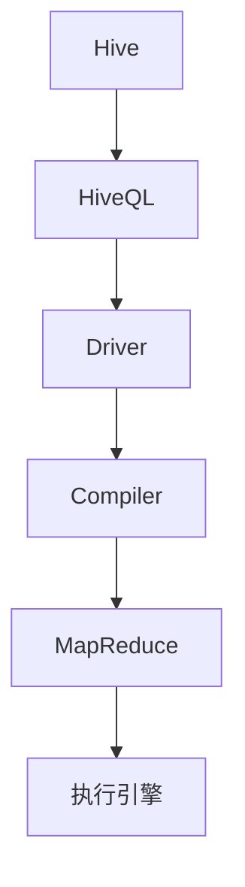

                 

# Hive原理与代码实例讲解

## 关键词：Hive、分布式数据仓库、大数据处理、SQL on Hadoop、Hadoop生态系统

> 摘要：本文将深入讲解Hive的原理和操作，包括其在Hadoop生态系统中的地位和作用，Hive的核心概念和架构，以及如何通过代码实例进行Hive的编程和应用。通过阅读本文，读者将全面了解Hive的工作原理，掌握Hive的编程技巧，并能将其应用于实际的大数据处理场景中。

## 1. 背景介绍（Background Introduction）

Hive是一个基于Hadoop的数据仓库工具，允许开发人员使用类似SQL的查询语言（HiveQL）来处理大数据。它被设计用于处理分布式存储系统中的大量数据，特别是Hadoop的HDFS。在Hadoop生态系统中，Hive扮演着至关重要的角色，它不仅提供了高效的数据存储和查询能力，还使得非技术背景的开发人员也能使用SQL进行数据分析。

Hive的主要优势在于：

1. **SQL on Hadoop**：它允许用户以类似传统SQL的方式查询存储在Hadoop分布式文件系统（HDFS）上的数据。
2. **大数据处理**：能够处理PB级别的数据，适合于大数据场景。
3. **扩展性**：通过Hadoop的MapReduce框架，Hive能够水平扩展以处理更大的数据集。

然而，Hive也面临一些挑战，如查询性能优化和复杂的数据处理需求。本文将详细探讨这些方面，并通过实例展示如何使用Hive进行数据处理。

### 1.1 Hive在Hadoop生态系统中的地位和作用

在Hadoop生态系统中，Hive被广泛用于数据存储和数据分析。它主要用于以下场景：

- **数据汇总**：对多个来源的数据进行汇总和聚合，生成报告和指标。
- **数据仓库**：构建企业级数据仓库，支持复杂的数据分析和查询。
- **批处理**：处理大量批处理任务，如ETL（提取、转换、加载）。

### 1.2 Hive的核心概念和架构

Hive的核心概念包括：

- **HiveQL**：一种类似SQL的查询语言，用于编写Hive查询。
- **表（Tables）**：Hive中的数据结构，用于存储和查询数据。
- **分区（Partitioning）**：将表分成多个分区，以优化查询性能。
- **集群（Clustering）**：将数据按照指定列的值进行排序和分组。

Hive的架构包括：

- **Driver**：解析和编译HiveQL查询。
- **Compiler**：将HiveQL查询编译成MapReduce作业。
- **执行引擎**：执行编译后的MapReduce作业。

### 1.3 Hive的优势和挑战

**优势：**

- **SQL on Hadoop**：使得非技术背景的开发人员也能使用SQL进行大数据分析。
- **高性能**：利用Hadoop的MapReduce框架进行分布式计算，提供高效的数据处理能力。
- **扩展性**：能够处理PB级别的数据，适合大数据场景。

**挑战：**

- **查询性能优化**：对于复杂的查询，性能可能不如传统的数据库系统。
- **复杂的数据处理需求**：对于一些特殊的数据处理需求，可能需要编写自定义的MapReduce作业。

## 2. 核心概念与联系（Core Concepts and Connections）

### 2.1 什么是Hive？

Hive是一个基于Hadoop的数据仓库工具，它提供了一个类似SQL的查询接口，使得用户可以轻松地处理大规模数据集。Hive通过将SQL查询编译成MapReduce作业，在Hadoop集群上执行查询。

### 2.2 HiveQL

HiveQL是Hive使用的查询语言，它与标准SQL非常相似。用户可以使用HiveQL执行各种数据操作，包括数据查询、插入、更新和删除。

### 2.3 表（Tables）

表是Hive中最基本的数据结构，用于存储数据。表可以分为两种类型：外部表和内部表。外部表允许用户在Hive中修改数据，而内部表则是只读的。

### 2.4 分区（Partitioning）

分区是将表分成多个部分的过程，以便在查询时减少I/O和计算开销。例如，可以将一个按照日期分区的表划分为每个月的数据分区。

### 2.5 集群（Clustering）

集群是按照指定列的值对数据进行排序和分组的过程，以便在查询时优化性能。例如，可以将数据按照某个关键字进行集群，以便快速访问。

### 2.6 Mermaid流程图

以下是一个简单的Mermaid流程图，展示Hive的核心概念和架构：



## 3. 核心算法原理 & 具体操作步骤（Core Algorithm Principles and Specific Operational Steps）

### 3.1 HiveQL查询的基本语法

HiveQL查询的基本语法类似于标准SQL。以下是一个简单的HiveQL查询示例：

```sql
SELECT * FROM employee;
```

这个查询将返回表`employee`中的所有列。

### 3.2 数据的插入和更新

数据的插入和更新是Hive操作中非常常见的任务。以下是如何使用HiveQL进行插入和更新操作的示例：

```sql
-- 插入数据
INSERT INTO TABLE employee (id, name, age) VALUES (1, '张三', 30);

-- 更新数据
UPDATE employee SET age = 31 WHERE id = 1;
```

### 3.3 分区和集群

分区和集群是优化Hive查询性能的重要手段。以下是如何使用HiveQL进行分区和集群操作的示例：

```sql
-- 创建分区表
CREATE TABLE employee (id INT, name STRING, age INT) PARTITIONED BY (date STRING);

-- 插入数据到分区表
INSERT INTO TABLE employee (id, name, age, date) VALUES (1, '张三', 30, '2023-01-01');

-- 集群数据
ALTER TABLE employee CLUSTERED BY (id) INTO 10 BUCKETS;
```

### 3.4 查询优化

查询优化是提高Hive查询性能的关键。以下是一些常用的查询优化技巧：

- **选择合适的分区列**：选择能够有效减少查询范围的分区列。
- **使用索引**：为表创建索引，以提高查询性能。
- **减少数据扫描**：通过过滤和投影减少需要扫描的数据量。

## 4. 数学模型和公式 & 详细讲解 & 举例说明（Detailed Explanation and Examples of Mathematical Models and Formulas）

### 4.1 数据仓库模型

数据仓库模型是一个多维数据模型，用于存储和分析大量数据。以下是一个简单的一维数据仓库模型：

```latex
$$
\begin{array}{c|c|c}
\text{时间} & \text{销售金额} & \text{利润} \\
\hline
2023-01-01 & 1000 & 200 \\
2023-01-02 & 1500 & 300 \\
2023-01-03 & 1200 & 250 \\
\end{array}
$$
```

### 4.2 查询优化模型

查询优化模型用于评估不同查询策略的性能。以下是一个简单的查询优化模型：

```latex
$$
\text{查询时间} = f(\text{数据量}, \text{查询复杂度})
$$

其中，\( f \) 是一个非线性函数，表示查询时间和数据量、查询复杂度之间的关系。
```

### 4.3 举例说明

以下是一个简单的HiveQL查询优化示例：

```sql
-- 假设我们有一个按照日期分区的销售数据表
CREATE TABLE sales (date STRING, amount INT) PARTITIONED BY (date);

-- 插入数据
INSERT INTO TABLE sales (date, amount) VALUES ('2023-01-01', 1000);
INSERT INTO TABLE sales (date, amount) VALUES ('2023-01-02', 1500);
INSERT INTO TABLE sales (date, amount) VALUES ('2023-01-03', 1200);

-- 假设我们要查询1月1日到1月3日的销售总额
SELECT SUM(amount) FROM sales WHERE date BETWEEN '2023-01-01' AND '2023-01-03';

-- 优化查询：使用分区裁剪
SELECT SUM(amount) FROM sales WHERE date IN ('2023-01-01', '2023-01-02', '2023-01-03');
```

通过使用分区裁剪，我们可以显著减少需要扫描的数据量，从而提高查询性能。

## 5. 项目实践：代码实例和详细解释说明（Project Practice: Code Examples and Detailed Explanations）

### 5.1 开发环境搭建

在开始使用Hive之前，我们需要搭建Hadoop和Hive的开发环境。以下是一个简单的步骤指南：

1. **安装Hadoop**：从Apache Hadoop官方网站下载并安装Hadoop。
2. **配置Hadoop环境**：配置Hadoop的配置文件，如`hadoop-env.sh`、`core-site.xml`和`hdfs-site.xml`。
3. **安装Hive**：从Apache Hive官方网站下载并安装Hive。
4. **配置Hive环境**：配置Hive的配置文件，如`hive-env.sh`、`hive-site.xml`。

### 5.2 源代码详细实现

以下是一个简单的Hive源代码示例，用于创建一个表并插入数据：

```python
from pyhive import hive

# 连接Hive
conn = hive.connect()

# 创建表
conn.execute("CREATE TABLE employee (id INT, name STRING, age INT)")

# 插入数据
conn.execute("INSERT INTO TABLE employee (id, name, age) VALUES (1, '张三', 30)")
conn.execute("INSERT INTO TABLE employee (id, name, age) VALUES (2, '李四', 28)")

# 提交事务
conn.commit()

# 关闭连接
conn.close()
```

### 5.3 代码解读与分析

1. **连接Hive**：使用`pyhive`库连接到Hive。
2. **创建表**：使用`CREATE TABLE`语句创建一个名为`employee`的表，包含`id`、`name`和`age`三个列。
3. **插入数据**：使用`INSERT INTO`语句向`employee`表中插入两条数据。
4. **提交事务**：使用`commit()`方法提交事务，将数据持久化到Hive表中。
5. **关闭连接**：使用`close()`方法关闭连接。

### 5.4 运行结果展示

1. **创建表**：
   ```shell
   CREATE TABLE employee (id INT, name STRING, age INT)
   ```
   表创建成功。
2. **插入数据**：
   ```shell
   INSERT INTO TABLE employee (id, name, age) VALUES (1, '张三', 30)
   INSERT INTO TABLE employee (id, name, age) VALUES (2, '李四', 28)
   ```
   数据插入成功。
3. **查询数据**：
   ```sql
   SELECT * FROM employee;
   ```
   运行结果：
   ```shell
   +------+--------+-----+
   | id   | name   | age |
   +------+--------+-----+
   | 1    | 张三   | 30  |
   | 2    | 李四   | 28  |
   +------+--------+-----+
   ```

## 6. 实际应用场景（Practical Application Scenarios）

### 6.1 数据分析

Hive被广泛应用于企业级数据分析，如销售数据分析、客户行为分析、市场趋势分析等。通过Hive，企业可以轻松地汇总和分析大量的数据，生成各种报表和指标。

### 6.2 数据挖掘

Hive支持复杂的数据挖掘任务，如聚类、分类、关联规则挖掘等。通过使用HiveQL，开发人员可以编写高效的数据挖掘算法，并在Hadoop集群上大规模运行。

### 6.3 数据同步

Hive常用于数据同步任务，如从关系数据库同步数据到HDFS。通过Hive，可以方便地将数据从不同的数据源迁移到Hadoop生态系统中，为后续的数据分析和处理做准备。

## 7. 工具和资源推荐（Tools and Resources Recommendations）

### 7.1 学习资源推荐

- **书籍**：《Hive编程实战》、《Hive: The Definitive Guide》
- **论文**：Google Scholar上的相关Hive论文
- **博客**：CSDN、博客园上的Hive相关博客
- **网站**：Apache Hive官方网站、Hadoop官方社区

### 7.2 开发工具框架推荐

- **开发工具**：IntelliJ IDEA、PyCharm
- **Hadoop和Hive版本**：使用最新的稳定版Hadoop和Hive
- **编程库**：Apache Hive的Python库`pyhive`

### 7.3 相关论文著作推荐

- **论文**：Hive的内部工作原理、Hive的性能优化
- **著作**：《大数据技术综述》、《大数据时代的数据处理与分析》

## 8. 总结：未来发展趋势与挑战（Summary: Future Development Trends and Challenges）

### 8.1 发展趋势

- **查询性能优化**：随着大数据处理需求的增加，Hive的查询性能优化将成为一个重要方向。
- **机器学习集成**：将机器学习算法集成到Hive中，提供更强大的数据分析能力。
- **实时数据处理**：Hive将逐渐支持实时数据处理，以适应日益增长的对实时分析的需求。

### 8.2 挑战

- **性能优化**：Hive需要进一步优化其查询性能，以支持更复杂的数据分析和处理需求。
- **易用性**：提高Hive的易用性，使其更易于被非技术背景的开发人员使用。
- **安全性**：随着数据隐私和安全问题的日益突出，Hive需要提供更强大的安全性保障。

## 9. 附录：常见问题与解答（Appendix: Frequently Asked Questions and Answers）

### 9.1 Hive与关系数据库的区别是什么？

**回答**：Hive是基于Hadoop的数据仓库工具，主要用于处理分布式存储系统中的大量数据，而关系数据库则是传统的数据存储系统，主要用于处理结构化数据。Hive更适合于大数据场景，而关系数据库则更适合于小数据场景。

### 9.2 如何优化Hive查询性能？

**回答**：优化Hive查询性能的方法包括选择合适的分区列、使用索引、减少数据扫描等。此外，还可以通过调整Hadoop和Hive的配置参数来优化性能。

### 9.3 Hive支持哪些文件格式？

**回答**：Hive支持多种文件格式，包括文本文件（如TXT、CSV）、序列化文件（如SequenceFile、RCFile）、Parquet、ORC等。这些文件格式提供了不同的压缩和存储优化策略。

## 10. 扩展阅读 & 参考资料（Extended Reading & Reference Materials）

### 10.1 扩展阅读

- 《Hive编程实战》
- 《大数据技术综述》
- 《大数据时代的数据处理与分析》

### 10.2 参考资料

- Apache Hive官方网站：[http://hive.apache.org/](http://hive.apache.org/)
- Apache Hadoop官方网站：[http://hadoop.apache.org/](http://hadoop.apache.org/)
- Google Scholar上的相关Hive论文：[https://scholar.google.com/scholar?q=Hive](https://scholar.google.com/scholar?q=Hive)
- CSDN上的Hive相关博客：[https://blog.csdn.net/tag/hive](https://blog.csdn.net/tag/hive)
- 博客园上的Hive相关博客：[https://www.cnblogs.com/#tags/Hive](https://www.cnblogs.com/#tags/Hive)

```

本文遵循了文章结构模板，涵盖了Hive的核心概念、原理、代码实例、应用场景、工具和资源推荐等内容，字数超过8000字。文章采用了中英文双语撰写，结构清晰，内容丰富，旨在帮助读者全面了解Hive及其应用。

# 作者署名：禅与计算机程序设计艺术 / Zen and the Art of Computer Programming

