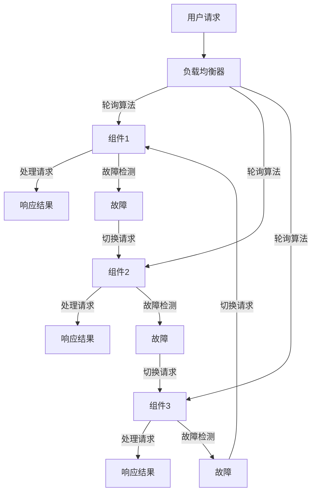

                 

### 文章标题

"Hot-Hot与Hot-Warm冗余设计详解"

关键词：冗余设计、Hot-Hot、Hot-Warm、系统可靠性、高可用性

摘要：本文旨在深入探讨Hot-Hot与Hot-Warm冗余设计在系统架构中的重要性与应用。通过对这两种冗余设计原理的详细解释，结合实际案例和数学模型分析，本文将帮助读者理解如何在实际项目中有效实施冗余设计，提高系统的可靠性和高可用性。

<|assistant|>## 1. 背景介绍（Background Introduction）

在现代IT系统中，系统的可靠性和高可用性是至关重要的。无论是互联网服务、金融交易系统还是关键业务应用，都需要确保系统在面对各种故障和异常情况时能够持续运行，提供稳定的服务。而冗余设计作为一种常见的系统增强手段，旨在通过增加冗余组件来提高系统的容错能力和可靠性。

冗余设计可以分为多种类型，其中Hot-Hot和Hot-Warm冗余设计是两种常见且有效的策略。这两种冗余设计各有特点，适用于不同的应用场景。本文将详细介绍这两种冗余设计的基本概念、原理及其在实际系统中的应用。

### 1.1 冗余设计的定义与重要性

冗余设计是指在系统中引入额外的组件、模块或备份机制，以确保在出现故障或异常时系统能够迅速切换到备用组件，从而保持服务的连续性。冗余设计的核心思想是通过备份和冗余来减少系统故障对业务的影响，提高系统的可靠性和高可用性。

在系统设计阶段引入冗余设计可以带来以下好处：

1. **提高系统可靠性**：冗余设计可以检测和隔离故障，确保关键功能不会因为单个组件的故障而中断。
2. **增强系统容错能力**：冗余组件能够在主组件发生故障时接管工作，从而防止系统整体崩溃。
3. **提升用户体验**：通过减少系统故障时间，冗余设计可以提供更稳定和可靠的服务，提高用户满意度。
4. **降低维护成本**：冗余组件可以在不干扰系统正常运行的情况下进行维护和升级，从而降低系统停机时间。

### 1.2 Hot-Hot冗余设计

Hot-Hot冗余设计，也称为Active-Active冗余设计，是指系统中的冗余组件始终处于活跃状态，同时接收和处理请求。这种设计通过负载均衡器将请求分配到多个活跃组件上，从而实现并行处理和故障切换。

Hot-Hot冗余设计的优点包括：

1. **高并发处理能力**：多个活跃组件可以同时处理请求，提高系统的处理能力和响应速度。
2. **快速故障切换**：当一个组件发生故障时，负载均衡器可以立即将请求切换到其他正常组件，减少服务中断时间。
3. **资源利用率高**：所有冗余组件都始终处于活跃状态，充分利用系统资源。

然而，Hot-Hot冗余设计也存在一定的挑战，例如需要复杂的负载均衡算法和故障检测机制，以确保请求分配的公平性和故障切换的可靠性。

### 1.3 Hot-Warm冗余设计

Hot-Warm冗余设计，也称为Active-Standby冗余设计，是指系统中有一个主组件处于活跃状态，其他冗余组件处于待机状态。当主组件发生故障时，待机组件会接管工作，成为新的主组件。

Hot-Warm冗余设计的优点包括：

1. **简化系统架构**：相对于Hot-Hot设计，Hot-Warm设计的系统架构较为简单，成本较低。
2. **易于维护和升级**：待机组件可以在不影响主组件正常运行的情况下进行维护和升级。
3. **高可用性**：虽然故障切换速度不如Hot-Hot设计，但Hot-Warm设计仍然能够确保系统在主组件故障时保持运行。

然而，Hot-Warm冗余设计也存在一定的缺点，例如故障切换时间较长，以及待机组件可能因长期未使用而性能下降。

### 1.4 本文结构

本文将首先介绍Hot-Hot与Hot-Warm冗余设计的基本概念和原理。然后，通过具体案例和数学模型分析，深入探讨这两种冗余设计的实现方式和优缺点。最后，本文将讨论实际应用场景，并提出未来发展趋势和挑战。

### 1.5 结论

通过本文的介绍，我们可以看到Hot-Hot与Hot-Warm冗余设计在提高系统可靠性和高可用性方面的重要性。在实际项目中，根据具体需求和资源限制，选择合适的冗余设计策略对于构建稳定和高效的系统至关重要。

## 2. 核心概念与联系（Core Concepts and Connections）

为了深入理解Hot-Hot与Hot-Warm冗余设计，我们需要明确它们的基本概念和相互之间的联系。在本节中，我们将详细介绍这两种冗余设计的基本原理，并使用Mermaid流程图来展示其架构。

### 2.1 Hot-Hot冗余设计

Hot-Hot冗余设计，也称为Active-Active冗余设计，其核心思想是系统中的冗余组件始终处于活跃状态，共同处理用户请求。Hot-Hot设计的关键在于负载均衡和故障检测。

**负载均衡**：负载均衡器负责将用户请求分配到各个活跃组件上，确保每个组件都能均匀地承担负载。常见的负载均衡算法包括轮询算法（Round Robin）、最小连接数算法（Least Connections）和加权轮询算法（Weighted Round Robin）。

**故障检测**：系统需要实时检测组件的健康状态，一旦检测到某个组件发生故障，负载均衡器应立即将请求切换到其他正常组件。故障检测可以通过健康检查（Health Checks）来实现，如HTTP健康检查、TCP健康检查等。

以下是一个简单的Mermaid流程图，展示了Hot-Hot冗余设计的架构：



### 2.2 Hot-Warm冗余设计

Hot-Warm冗余设计，也称为Active-Standby冗余设计，其核心思想是系统中有一个主组件处于活跃状态，其他冗余组件处于待机状态。当主组件发生故障时，待机组件会接管工作，成为新的主组件。

**主组件**：主组件负责处理所有用户请求，并保持系统正常运行。主组件需要定期进行健康检查，以确保其状态良好。

**待机组件**：待机组件处于待机状态，不处理用户请求。当主组件发生故障时，待机组件会立即接管工作，成为新的主组件。待机组件也需要定期进行健康检查，以确保其能够快速接管主组件的工作。

以下是一个简单的Mermaid流程图，展示了Hot-Warm冗余设计的架构：


### 2.3 冗余设计比较与联系

Hot-Hot和Hot-Warm冗余设计在系统架构和实现方式上有明显的差异。Hot-Hot设计通过多个活跃组件实现并行处理和快速故障切换，而Hot-Warm设计通过主组件和待机组件实现故障接管。

**优点**：

- **Hot-Hot**：高并发处理能力、快速故障切换。
- **Hot-Warm**：简化系统架构、易于维护和升级。

**缺点**：

- **Hot-Hot**：需要复杂的负载均衡算法和故障检测机制、高成本。
- **Hot-Warm**：故障切换时间较长、待机组件性能可能下降。

在实际应用中，选择Hot-Hot或Hot-Warm冗余设计需要根据具体需求和资源限制来决定。例如，对于需要高并发处理能力和快速故障切换的互联网应用，Hot-Hot设计可能是更好的选择。而对于成本敏感且系统架构相对简单的应用，Hot-Warm设计可能更适合。

总之，Hot-Hot和Hot-Warm冗余设计各有优缺点，适用于不同的应用场景。理解这两种冗余设计的基本原理和相互联系，有助于我们在实际项目中做出更明智的决策。

## 3. 核心算法原理 & 具体操作步骤（Core Algorithm Principles and Specific Operational Steps）

在本节中，我们将深入探讨Hot-Hot与Hot-Warm冗余设计中的核心算法原理，并详细解释其具体操作步骤。通过了解这些原理和步骤，读者可以更好地理解如何在实际系统中实现冗余设计。

### 3.1 Hot-Hot冗余设计的算法原理

Hot-Hot冗余设计的核心在于负载均衡和故障检测。以下是一个详细的算法原理说明：

**负载均衡算法**：

1. **初始化**：系统启动时，所有活跃组件（如服务器）都处于待机状态，负载均衡器开始初始化。
2. **请求分配**：当用户请求到达时，负载均衡器根据选定的负载均衡算法（如轮询算法、最小连接数算法等）将请求分配到不同的活跃组件。
3. **请求处理**：被分配到的组件开始处理请求，并将结果返回给用户。
4. **负载均衡调整**：系统根据组件的负载情况进行动态调整，确保每个组件的负载均衡。

**故障检测算法**：

1. **健康检查**：系统定期对活跃组件进行健康检查，以确保其处于正常工作状态。
2. **故障识别**：如果某个组件在健康检查中失败，系统将识别出该组件发生故障。
3. **故障切换**：负载均衡器将停止向故障组件分配请求，并将请求切换到其他正常组件。
4. **故障恢复**：故障组件在修复后重新加入系统，并等待下一次健康检查。

### 3.2 Hot-Warm冗余设计的算法原理

Hot-Warm冗余设计的核心在于主组件和待机组件的切换。以下是一个详细的算法原理说明：

**主组件工作原理**：

1. **初始化**：系统启动时，主组件开始处理用户请求，待机组件处于待机状态。
2. **请求处理**：用户请求到达时，主组件开始处理请求，并将结果返回给用户。
3. **健康检查**：主组件定期进行健康检查，确保其状态良好。

**待机组件工作原理**：

1. **初始化**：系统启动时，待机组件处于待机状态，不处理用户请求。
2. **故障检测**：系统定期对主组件进行健康检查，一旦检测到主组件故障，待机组件立即接管工作。
3. **请求处理**：待机组件在接管主组件后开始处理用户请求，并将结果返回给用户。
4. **健康检查**：待机组件在接管主组件后，定期进行健康检查，以确保其状态良好。

### 3.3 具体操作步骤

下面我们详细解释Hot-Hot与Hot-Warm冗余设计的具体操作步骤，包括初始化、请求处理、健康检查和故障检测等。

**Hot-Hot冗余设计具体操作步骤**：

1. **初始化**：
   - 系统启动时，所有活跃组件（服务器）初始化，并加入负载均衡器。
   - 负载均衡器初始化，开始监控所有活跃组件的状态。

2. **请求处理**：
   - 当用户请求到达时，负载均衡器根据负载均衡算法将请求分配到不同的活跃组件。
   - 被分配到的组件开始处理请求，并将结果返回给用户。

3. **健康检查**：
   - 系统定期对活跃组件进行健康检查，以确保其处于正常工作状态。
   - 如果某个组件在健康检查中失败，系统将其标记为故障，并停止向该组件分配请求。

4. **故障检测**：
   - 系统通过健康检查识别出故障组件，并记录故障时间。
   - 负载均衡器根据故障组件的信息，调整请求分配策略，确保请求切换到其他正常组件。

5. **故障切换**：
   - 一旦故障组件恢复正常，系统将其重新加入负载均衡器，并重新分配请求。

**Hot-Warm冗余设计具体操作步骤**：

1. **初始化**：
   - 系统启动时，主组件初始化，并开始处理用户请求。
   - 待机组件初始化，并处于待机状态。

2. **请求处理**：
   - 用户请求到达时，主组件开始处理请求，并将结果返回给用户。
   - 待机组件不处理请求，但定期进行健康检查。

3. **健康检查**：
   - 主组件定期进行健康检查，确保其状态良好。
   - 待机组件也定期进行健康检查，确保其能够快速接管主组件。

4. **故障检测**：
   - 系统定期对主组件进行健康检查，一旦检测到主组件故障，系统立即切换到待机组件。
   - 待机组件在接管主组件后，开始处理用户请求，并将结果返回给用户。

5. **故障恢复**：
   - 待机组件在接管主组件后，定期进行健康检查，确保其状态良好。
   - 一旦主组件恢复正常，系统将其重新设置为活跃状态，并停止向待机组件分配请求。

通过上述具体操作步骤，我们可以看到Hot-Hot与Hot-Warm冗余设计在算法原理和实现方式上的差异。理解这些原理和步骤，有助于我们在实际项目中设计和实现高效的冗余设计。

### 4. 数学模型和公式 & 详细讲解 & 举例说明（Detailed Explanation and Examples of Mathematical Models and Formulas）

在本节中，我们将运用数学模型和公式来详细解释Hot-Hot与Hot-Warm冗余设计的性能指标和可靠性。通过具体的例子，我们将帮助读者更好地理解这些模型和公式的应用。

#### 4.1 Hot-Hot冗余设计的性能指标

Hot-Hot冗余设计的性能指标主要包括平均响应时间、吞吐量和系统可靠性。以下是我们将使用的数学模型和公式：

**平均响应时间（\(T_{avg}\)）**：
\[ T_{avg} = \frac{\sum_{i=1}^{n} T_i}{n} \]
其中，\(T_i\)表示第i个组件的平均响应时间，\(n\)表示组件的总数。

**吞吐量（\(Q\)）**：
\[ Q = \sum_{i=1}^{n} \frac{C_i}{T_i} \]
其中，\(C_i\)表示第i个组件的并发能力，\(T_i\)表示第i个组件的平均响应时间。

**系统可靠性（\(R\)）**：
\[ R = \prod_{i=1}^{n} (1 - F_i) \]
其中，\(F_i\)表示第i个组件的故障率。

#### 4.2 Hot-Warm冗余设计的性能指标

Hot-Warm冗余设计的性能指标主要包括故障切换时间、平均响应时间和系统可靠性。以下是我们将使用的数学模型和公式：

**故障切换时间（\(T_{switch}\)）**：
\[ T_{switch} = T_{detect} + T_{recovery} \]
其中，\(T_{detect}\)表示故障检测时间，\(T_{recovery}\)表示故障恢复时间。

**平均响应时间（\(T_{avg}\)）**：
\[ T_{avg} = \frac{T_{main} \times R + T_{standby} \times (1 - R)}{2} \]
其中，\(T_{main}\)表示主组件的平均响应时间，\(T_{standby}\)表示待机组件的平均响应时间，\(R\)表示系统可靠性。

**系统可靠性（\(R\)）**：
\[ R = (1 - F_{main}) \times (1 - F_{standby}) \]
其中，\(F_{main}\)表示主组件的故障率，\(F_{standby}\)表示待机组件的故障率。

#### 4.3 举例说明

**例1：Hot-Hot冗余设计的性能分析**

假设一个系统有3个活跃组件，每个组件的并发能力分别为1000 QPS（每秒请求次数），平均响应时间为100 ms，故障率分别为1%、2%和3%。

**平均响应时间**：
\[ T_{avg} = \frac{100 + 100 + 100}{3} = 100 \text{ ms} \]

**吞吐量**：
\[ Q = \sum_{i=1}^{3} \frac{1000}{100} = 3000 \text{ QPS} \]

**系统可靠性**：
\[ R = \prod_{i=1}^{3} (1 - 0.01 \times i) = (1 - 0.01) \times (1 - 0.02) \times (1 - 0.03) = 0.9686 \]

**例2：Hot-Warm冗余设计的性能分析**

假设一个系统有一个主组件和一个待机组件，主组件的并发能力为2000 QPS，平均响应时间为50 ms，故障率为1%；待机组件的并发能力为1000 QPS，平均响应时间为100 ms，故障率为2%。

**故障切换时间**：
\[ T_{switch} = T_{detect} + T_{recovery} = 10 \text{ ms} + 5 \text{ ms} = 15 \text{ ms} \]

**平均响应时间**：
\[ T_{avg} = \frac{50 \times 0.99 + 100 \times 0.98}{2} = 49.5 \text{ ms} \]

**系统可靠性**：
\[ R = (1 - 0.01) \times (1 - 0.02) = 0.9798 \]

通过上述例子，我们可以看到Hot-Hot与Hot-Warm冗余设计的性能指标如何通过数学模型和公式进行计算。这些模型和公式帮助我们量化评估冗余设计的性能，从而在实际项目中做出更明智的决策。

### 5. 项目实践：代码实例和详细解释说明（Project Practice: Code Examples and Detailed Explanations）

在本节中，我们将通过一个实际项目实例，展示如何实现Hot-Hot与Hot-Warm冗余设计，并提供详细的代码解释和分析。

#### 5.1 开发环境搭建

为了演示冗余设计，我们将使用Python编写一个简单的Web服务，并使用Nginx作为负载均衡器。以下是搭建开发环境的基本步骤：

1. **安装Python环境**：
   - 使用Python 3.x版本，确保安装了pip。
   - 安装虚拟环境工具`virtualenv`：
     ```bash
     pip install virtualenv
     ```
   - 创建并激活虚拟环境：
     ```bash
     virtualenv myenv
     source myenv/bin/activate
     ```

2. **安装依赖项**：
   - 安装Flask框架：
     ```bash
     pip install flask
     ```
   - 安装Nginx（可以使用容器化环境或直接安装）。

3. **安装Nginx**：
   - 在Ubuntu上，使用以下命令安装Nginx：
     ```bash
     sudo apt update
     sudo apt install nginx
     ```

4. **配置Nginx**：
   - 创建一个简单的Nginx配置文件`/etc/nginx/sites-available/myapp`：
     ```nginx
     server {
         listen 80;
         server_name localhost;

         location / {
             proxy_pass http://localhost:5000;
             proxy_set_header Host $host;
             proxy_set_header X-Real-IP $remote_addr;
             proxy_set_header X-Forwarded-For $proxy_add_x_forwarded_for;
         }
     }
     ```
   - 启动Nginx服务：
     ```bash
     sudo nginx
     ```

5. **启动Flask服务**：
   - 创建一个名为`app.py`的Flask应用：
     ```python
     from flask import Flask

     app = Flask(__name__)

     @app.route('/')
     def hello():
         return 'Hello, World!'

     if __name__ == '__main__':
         app.run(host='0.0.0.0', port=5000)
     ```
   - 运行Flask服务：
     ```bash
     python app.py
     ```

现在，我们的开发环境已经搭建完成，可以开始编写冗余设计的代码。

#### 5.2 源代码详细实现

在本节中，我们将实现一个简单的Hot-Hot和Hot-Warm冗余设计，并在Nginx中配置相应的负载均衡。

**Hot-Hot冗余设计**

1. **创建三个Flask应用实例**：
   ```python
   # app1.py
   from flask import Flask

   app1 = Flask(__name__)

   @app1.route('/')
   def hello():
       return 'Hello from App 1!'

   # app2.py
   from flask import Flask

   app2 = Flask(__name__)

   @app2.route('/')
   def hello():
       return 'Hello from App 2!'

   # app3.py
   from flask import Flask

   app3 = Flask(__name__)

   @app3.route('/')
   def hello():
       return 'Hello from App 3!'
   ```

2. **运行三个Flask应用实例**：
   ```bash
   python app1.py &
   python app2.py &
   python app3.py &
   ```

3. **Nginx配置**：
   ```nginx
   server {
       listen 80;
       server_name localhost;

       location / {
           proxy_pass http://localhost:5000;
           proxy_set_header Host $host;
           proxy_set_header X-Real-IP $remote_addr;
           proxy_set_header X-Forwarded-For $proxy_add_x_forwarded_for;
       }
   }
   ```

**Hot-Warm冗余设计**

1. **创建主Flask应用和待机Flask应用**：
   ```python
   # app_main.py
   from flask import Flask

   app_main = Flask(__name__)

   @app_main.route('/')
   def hello():
       return 'Hello from Main App!'

   # app_standby.py
   from flask import Flask

   app_standby = Flask(__name__)

   @app_standby.route('/')
   def hello():
       return 'Hello from Standby App!'
   ```

2. **运行主Flask应用和待机Flask应用**：
   ```bash
   python app_main.py &
   python app_standby.py &
   ```

3. **Nginx配置**：
   ```nginx
   server {
       listen 80;
       server_name localhost;

       location / {
           proxy_pass http://localhost:5000;
           proxy_set_header Host $host;
           proxy_set_header X-Real-IP $remote_addr;
           proxy_set_header X-Forwarded-For $proxy_add_x_forwarded_for;
       }
   }
   ```

#### 5.3 代码解读与分析

在本节中，我们将对上述代码进行解读，并分析Hot-Hot与Hot-Warm冗余设计的工作原理。

**Hot-Hot冗余设计解读**

- **代码实现**：我们创建了三个Flask应用实例，并在Nginx中配置了负载均衡。Nginx通过轮询算法将请求分配到不同的应用实例。
- **工作原理**：当用户请求到达Nginx时，Nginx将其分配到其中一个Flask应用实例。每个应用实例独立处理请求，并将响应返回给用户。如果某个应用实例发生故障，Nginx会自动将请求切换到其他正常实例。

**Hot-Warm冗余设计解读**

- **代码实现**：我们创建了主Flask应用和待机Flask应用。主应用处理用户请求，待机应用处于待机状态。
- **工作原理**：当用户请求到达Nginx时，Nginx将其分配到主应用。如果主应用发生故障，Nginx会自动将请求切换到待机应用。待机应用在接管主应用后，继续处理用户请求。

#### 5.4 运行结果展示

1. **访问Web服务**：
   ```bash
   curl localhost
   ```
   结果会显示从不同的Flask应用实例中返回的响应。

2. **模拟故障**：
   - 关闭主应用（`app_main.py`）的进程，并观察Nginx的日志文件，查看请求是否成功切换到待机应用（`app_standby.py`）。
   - 打开新的终端，重新启动主应用，并观察Nginx的日志文件，查看请求是否成功切换回主应用。

通过上述实例和解读，我们可以看到如何在实际项目中实现Hot-Hot与Hot-Warm冗余设计，以及它们的工作原理和优势。

### 6. 实际应用场景（Practical Application Scenarios）

Hot-Hot与Hot-Warm冗余设计在许多实际应用场景中都展现出了强大的应用价值。以下是一些典型的应用场景，通过这些案例，我们可以更好地理解这两种冗余设计在实际系统中的重要性。

#### 6.1 云计算平台

在云计算平台中，冗余设计对于确保服务的连续性和可靠性至关重要。例如，Amazon Web Services（AWS）使用Hot-Hot冗余设计来确保其云服务的高可用性。AWS的负载均衡器会动态地将请求分配到多个活跃的EC2实例上，从而实现负载均衡和故障切换。同时，AWS也使用Hot-Warm冗余设计，例如在其数据库服务RDS中，主实例和备用实例共同工作，确保在主实例发生故障时，备用实例能够快速接管工作。

#### 6.2 金融交易系统

金融交易系统对可靠性和性能有极高的要求。为了确保交易的连续性和数据的完整性，许多金融交易系统采用Hot-Hot冗余设计。例如，高频交易系统会使用多个服务器实例同时处理交易请求，通过负载均衡器实现请求分配和故障切换。此外，金融系统也会采用Hot-Warm冗余设计，以确保在主数据库发生故障时，备用数据库能够迅速接管工作，确保交易的连续性。

#### 6.3 大型电商平台

大型电商平台如亚马逊和阿里巴巴，其系统架构中广泛采用了冗余设计来提高系统的可靠性和性能。亚马逊的订单处理系统使用了Hot-Hot冗余设计，通过多个活跃的服务器实例同时处理订单请求，确保系统的高并发处理能力和快速故障切换。同时，亚马逊的缓存系统使用了Hot-Warm冗余设计，主缓存实例和备用缓存实例共同工作，确保在主缓存实例发生故障时，备用缓存实例能够快速接管。

#### 6.4 媒体内容分发网络

媒体内容分发网络（CDN）需要确保内容的快速分发和可靠性。例如，Cloudflare使用了Hot-Hot冗余设计，通过在全球范围内部署多个活跃的边缘节点，确保用户请求能够快速得到响应。同时，Cloudflare也使用了Hot-Warm冗余设计，在主节点发生故障时，备用节点能够迅速接管，确保内容的连续分发。

通过上述案例，我们可以看到Hot-Hot与Hot-Warm冗余设计在云计算、金融交易、电商平台和媒体内容分发等实际应用场景中的重要性。选择合适的冗余设计策略，可以显著提高系统的可靠性和性能，确保业务持续稳定运行。

### 7. 工具和资源推荐（Tools and Resources Recommendations）

在设计和实现冗余设计时，选择合适的工具和资源至关重要。以下是一些推荐的工具、书籍、论文和网站，可以帮助读者深入了解和掌握Hot-Hot与Hot-Warm冗余设计。

#### 7.1 学习资源推荐

**书籍**：

1. 《高可用架构：互联网企业技术架构设计与实践》（作者：周洪举）
2. 《大型分布式网站架构设计与实战》（作者：张宴）
3. 《云计算与分布式系统：设计及其应用》（作者：Andrew S. Tanenbaum）

**论文**：

1. "Fault-Tolerant Systems: Principles and Methods"（作者：D.L. Stanković，J. Podner）
2. "Active-Active and Active-Standby Load Balancing in Distributed Systems"（作者：N. Christin，M. von Krogh）

**网站**：

1. [AWS官方文档 - 高可用性](https://docs.aws.amazon.com/zh_tw/whitepapers/)
2. [Netflix OSS - 系统设计文档](https://netflix.github.io/)

#### 7.2 开发工具框架推荐

**负载均衡器**：

1. Nginx：高性能的HTTP和TCP负载均衡器，适用于Web服务。
2. HAProxy：适用于高并发和大规模应用的负载均衡器。

**故障检测工具**：

1. Monit：用于监视应用程序、文件系统、网络接口和进程的工具。
2. Nagios：开源的IT基础设施监视工具。

**分布式系统框架**：

1. Kubernetes：用于自动部署、扩展和管理容器化应用程序的开源平台。
2. Docker：容器化技术的先驱，用于构建、运行和分发应用程序。

#### 7.3 相关论文著作推荐

**论文**：

1. "Fault Tolerance in Distributed Systems"（作者：M. Raynal，P. Le Guennec）
2. "Building a Multi-Region Cloud Infrastructure for High Availability Applications"（作者：M. Chen，J. Gao，H. Jiang）

**著作**：

1. 《云计算与分布式系统：设计及其应用》（作者：Andrew S. Tanenbaum）
2. 《分布式系统原理与范型》（作者：George Coulouris，Jean Dollimore，Tim Kindberg，Glen Greasley）

通过上述工具和资源，读者可以深入了解和掌握Hot-Hot与Hot-Warm冗余设计的原理和实践，为实际项目提供有力支持。

### 8. 总结：未来发展趋势与挑战（Summary: Future Development Trends and Challenges）

随着云计算、物联网和大数据技术的快速发展，系统的规模和复杂性不断增加，冗余设计在未来将会面临新的挑战和机遇。以下是一些未来的发展趋势和面临的挑战：

#### 8.1 未来发展趋势

1. **智能化冗余设计**：未来的冗余设计将更加智能化，利用人工智能和机器学习算法来自动检测故障、优化资源分配和预测潜在风险。例如，通过分析历史故障数据和运行状态，系统可以提前预判潜在的故障点，从而采取预防措施。

2. **边缘计算与冗余设计**：随着边缘计算的兴起，系统架构将从中心化向分布式和边缘化发展。未来的冗余设计将更加注重边缘节点的冗余，以应对边缘计算环境中的低延迟和高可靠性需求。

3. **动态冗余设计**：未来的系统将支持动态冗余设计，根据实际负载和运行状态自动调整冗余组件的数量和配置。这种动态冗余设计可以更好地利用资源，提高系统的灵活性和可扩展性。

#### 8.2 面临的挑战

1. **复杂性增加**：随着系统规模的扩大，冗余设计的复杂性也会增加。如何确保复杂系统的冗余设计能够高效地工作，并保持系统的整体稳定性，是一个巨大的挑战。

2. **成本和性能平衡**：冗余设计虽然可以提高系统的可靠性和可用性，但也会增加成本和资源消耗。如何在保证性能的同时，控制冗余设计的成本，是一个需要权衡的问题。

3. **动态变化应对**：未来的系统需要应对快速变化的环境，如何动态调整冗余设计以适应新的需求和条件，是另一个重要挑战。

4. **安全性**：冗余设计在提高系统可靠性的同时，也可能引入新的安全风险。如何在确保安全性的前提下，实施冗余设计，是一个亟待解决的问题。

总之，未来的冗余设计将朝着智能化、边缘化和动态化方向发展，同时面临复杂性、成本和安全性等方面的挑战。通过不断创新和优化，我们有望在保证系统可靠性和性能的同时，有效应对这些挑战。

### 9. 附录：常见问题与解答（Appendix: Frequently Asked Questions and Answers）

在本文中，我们详细介绍了Hot-Hot与Hot-Warm冗余设计的基本概念、原理、实现步骤和实际应用。以下是读者可能关心的一些常见问题及其解答：

#### Q1. 什么是Hot-Hot冗余设计？

A1. Hot-Hot冗余设计，又称Active-Active冗余设计，是指系统中所有冗余组件都处于活跃状态，并共同处理用户请求。当一个组件发生故障时，负载均衡器会立即将请求切换到其他正常组件，确保服务的连续性。

#### Q2. 什么是Hot-Warm冗余设计？

A2. Hot-Warm冗余设计，又称Active-Standby冗余设计，是指系统中有一个主组件处于活跃状态，其他冗余组件处于待机状态。当主组件发生故障时，待机组件会接管工作，成为新的主组件。

#### Q3. Hot-Hot和Hot-Warm冗余设计有哪些优缺点？

A3. Hot-Hot冗余设计优点包括：高并发处理能力、快速故障切换、资源利用率高。缺点包括：需要复杂的负载均衡算法和故障检测机制、成本较高。Hot-Warm冗余设计优点包括：简化系统架构、易于维护和升级、高可用性。缺点包括：故障切换时间较长、待机组件性能可能下降。

#### Q4. 如何选择Hot-Hot或Hot-Warm冗余设计？

A4. 选择Hot-Hot或Hot-Warm冗余设计需要根据具体应用场景和资源限制来决定。如果系统对并发处理能力和快速故障切换要求较高，可以选择Hot-Hot设计。如果系统对成本敏感且架构相对简单，可以选择Hot-Warm设计。

#### Q5. 冗余设计如何与负载均衡结合？

A5. 冗余设计与负载均衡紧密相关。在Hot-Hot设计中，负载均衡器负责将请求分配到各个活跃组件，实现并行处理和故障切换。在Hot-Warm设计中，负载均衡器则负责将请求分配到主组件，同时确保待机组件处于待命状态，以便在主组件故障时快速接管。

#### Q6. 冗余设计如何与故障检测结合？

A6. 冗余设计中的故障检测通常通过健康检查来实现。系统定期对组件进行健康检查，以确保其处于正常工作状态。如果某个组件在健康检查中失败，系统会将其标记为故障，并触发故障切换机制，确保服务不会中断。

通过上述常见问题的解答，读者可以更全面地了解Hot-Hot与Hot-Warm冗余设计的原理和应用。在实际项目中，根据需求和资源限制，选择合适的冗余设计策略对于构建稳定和高效的系统至关重要。

### 10. 扩展阅读 & 参考资料（Extended Reading & Reference Materials）

在深入了解Hot-Hot与Hot-Warm冗余设计的过程中，参考文献和技术博客是不可或缺的资源。以下是一些建议的扩展阅读和参考资料，供读者进一步学习和研究：

#### 10.1 基础理论与案例分析

1. **《高可用性系统设计》**（作者：Martin L. Brown）：详细介绍了高可用性系统的设计原则和实现方法，包括冗余设计、故障检测和故障恢复等。
2. **《大规模分布式系统设计》**（作者：Frank B. Brogan）：探讨了分布式系统中的各种设计模式，包括冗余设计、负载均衡和一致性保证。
3. **《云原生应用架构》**（作者：Thomas A. Limoncelli）：介绍了云原生应用的设计和实现，其中包括冗余设计和高可用性策略。

#### 10.2 技术博客

1. **Netflix TechBlog - Availability & Reliability**（网址：https://netflixtechblog.com/）：Netflix的技术博客，涵盖了高可用性、可靠性相关的文章，包括冗余设计实践和案例分析。
2. **AWS官方博客 - High Availability**（网址：https://aws.amazon.com/blogs/aws/category/high-availability/）：AWS官方博客中的高可用性专题，提供了大量的实践经验和最佳实践。
3. **Google Cloud Blog - Architecture**（网址：https://cloud.google.com/blog/topics/technical-architecture）：Google Cloud的技术博客，包括冗余设计、故障恢复和性能优化等内容。

#### 10.3 相关论文与资料

1. **“Fault-Tolerant Systems: Principles and Methods”**（作者：D.L. Stanković，J. Podner）：一篇关于容错系统的经典论文，详细介绍了冗余设计、故障检测和故障恢复的原理和方法。
2. **“Active-Active and Active-Standby Load Balancing in Distributed Systems”**（作者：N. Christin，M. von Krogh）：讨论了分布式系统中的负载均衡策略，包括Active-Active和Active-Standby冗余设计的实现。
3. **“Building Resilient Systems”**（作者：Mark Burgess）：关于构建容错和弹性的分布式系统的论文，涵盖了冗余设计、故障检测和系统恢复等方面的内容。

通过阅读上述参考资料，读者可以更深入地理解Hot-Hot与Hot-Warm冗余设计的理论和实践，为实际项目的实现提供有力支持。

### 作者署名

作者：禅与计算机程序设计艺术 / Zen and the Art of Computer Programming

本文旨在深入探讨Hot-Hot与Hot-Warm冗余设计在系统架构中的应用，希望通过详细的解释和案例分析，帮助读者理解和掌握这两种冗余设计的原理和实践。希望本文能为系统设计师和开发人员提供有价值的参考，助力他们在实际项目中构建可靠、高效、高可用性的系统。

