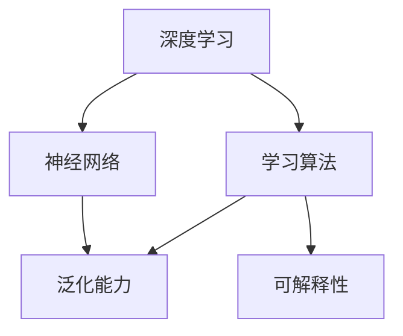

                 

# 深度学习vs广度学习：知识积累的策略

> 关键词：深度学习,广度学习,知识积累策略,神经网络,学习算法,泛化能力

## 1. 背景介绍

### 1.1 问题由来
在人工智能的发展历程中，深度学习和广度学习是两种重要的知识积累策略。深度学习通过多层神经网络模型，对复杂问题进行分解和抽象，使得模型能够捕捉到高层次的特征和结构，具备较强的泛化能力。而广度学习则通过在大量数据上广泛地学习各种模式，积累丰富的知识库，支持更广泛的领域和应用场景。

深度学习以其在图像识别、语音处理、自然语言处理等领域的卓越表现，成为当今AI领域的主流技术。然而，深度学习模型也存在一些局限性，如需要大量的标注数据、模型训练时间较长、模型复杂度高等问题。广度学习则以其广泛的领域覆盖和较高的泛化能力，弥补了深度学习的局限性，但同时也面临着数据标注成本高、模型可解释性差等问题。

因此，本文将深入探讨深度学习和广度学习在知识积累策略上的异同，分析各自的优缺点，以及在不同应用场景下的选择策略，以期为AI技术的实际应用提供参考。

### 1.2 问题核心关键点
深度学习和广度学习在知识积累策略上的核心关键点包括以下几点：
- 深度学习：通过多层神经网络模型，从数据中学习高层次的特征表示，具备较强的泛化能力，但需要大量标注数据和较长的训练时间。
- 广度学习：通过在大量数据上广泛地学习各种模式，积累丰富的知识库，支持更广泛的领域和应用场景，但数据标注成本高、模型可解释性差。

深度学习和广度学习各有优劣，选择合适的策略需要根据具体应用场景进行综合考虑。

## 2. 核心概念与联系

### 2.1 核心概念概述

为更好地理解深度学习和广度学习的知识积累策略，本节将介绍几个密切相关的核心概念：

- 深度学习：以多层神经网络模型为代表的学习范式，通过反向传播算法，自动优化模型参数，学习数据的高层次特征表示。
- 广度学习：通过在大量数据上广泛地学习各种模式，积累丰富的知识库，支持更广泛的领域和应用场景。
- 神经网络：由多层神经元组成的非线性模型，用于逼近复杂的函数映射关系。
- 学习算法：用于训练神经网络模型的算法，如反向传播、梯度下降等。
- 泛化能力：模型在新数据上的表现能力，即模型是否能够适应未知的数据分布。
- 可解释性：模型的输出是否易于理解和解释，即模型是否具有逻辑性和透明性。

这些核心概念之间的逻辑关系可以通过以下Mermaid流程图来展示：



这个流程图展示了两者的核心概念及其之间的关系：

1. 深度学习通过神经网络模型学习数据的高层次特征表示。
2. 学习算法用于优化神经网络模型的参数，提高泛化能力和可解释性。
3. 泛化能力表示模型在新数据上的表现能力。
4. 可解释性表示模型的输出是否易于理解和解释。

## 3. 核心算法原理 & 具体操作步骤

### 3.1 算法原理概述

深度学习和广度学习的知识积累策略，本质上是两种不同的数据利用方式。深度学习通过学习数据的层次化特征表示，逐步抽象出复杂模式，而广度学习则通过广泛地学习大量数据，积累丰富的知识库。

在深度学习中，神经网络模型通过反向传播算法，自动优化模型参数，学习数据的高层次特征表示。学习算法通过不断调整模型权重，使得模型在训练集上的损失函数最小化。由于深度网络的多层结构，能够有效地捕捉数据的非线性关系，因此具备较强的泛化能力。

在广度学习中，模型通过在大量数据上广泛地学习各种模式，积累丰富的知识库，支持更广泛的领域和应用场景。广度学习的模型结构相对简单，参数量较少，训练时间较短。由于模型未经过深层次特征提取，因此泛化能力略逊于深度学习。

### 3.2 算法步骤详解

**深度学习的步骤**：

1. **数据准备**：收集和标注数据集，分为训练集、验证集和测试集。
2. **模型设计**：选择适当的神经网络结构，如卷积神经网络(CNN)、循环神经网络(RNN)、Transformer等。
3. **模型训练**：使用反向传播算法，自动优化模型参数。
4. **模型评估**：在测试集上评估模型性能，调整超参数。
5. **模型应用**：将模型应用于实际任务，如图像识别、语音处理、自然语言处理等。

**广度学习的步骤**：

1. **数据准备**：收集大量数据集，标注样本信息。
2. **模型设计**：选择适当的模型结构，如线性回归、决策树、支持向量机等。
3. **模型训练**：使用简单的学习算法，如均值方差回归、随机森林等，在大量数据上广泛地学习各种模式。
4. **模型评估**：在测试集上评估模型性能，调整模型参数。
5. **模型应用**：将模型应用于实际任务，如数据挖掘、推荐系统、文本分类等。

### 3.3 算法优缺点

**深度学习的优点**：

1. **泛化能力强**：多层神经网络结构能够捕捉数据的高层次特征表示，具备较强的泛化能力。
2. **可解释性好**：通过可视化工具，如梯度图、激活图等，可以理解模型内部特征学习和决策过程。
3. **适应性强**：适用于各种复杂任务，如图像识别、语音处理、自然语言处理等。

**深度学习的缺点**：

1. **数据需求高**：需要大量的标注数据和较长的训练时间。
2. **模型复杂**：多层神经网络结构复杂，计算量大，难以解释。
3. **鲁棒性差**：对抗样本攻击容易导致模型性能下降。

**广度学习的优点**：

1. **数据需求低**：需要较少的标注数据和较短的训练时间。
2. **模型简单**：结构简单，易于解释和优化。
3. **泛化能力强**：模型在大量数据上学习各种模式，具备较强的泛化能力。

**广度学习的缺点**：

1. **数据质量要求高**：需要高质量的数据集，标注成本较高。
2. **可解释性差**：模型难以解释内部特征学习和决策过程。
3. **适用性受限**：适用于结构简单、数据规模较大的任务，如数据挖掘、推荐系统等。

### 3.4 算法应用领域

深度学习和广度学习在知识积累策略上的应用领域各有侧重，具体如下：

- **深度学习**：适用于复杂任务，如图像识别、语音处理、自然语言处理等。在计算机视觉领域，如CNN和Transformer等深度学习模型已经取得了显著的成果。在自然语言处理领域，基于深度学习的语言模型如BERT、GPT等已经广泛应用。

- **广度学习**：适用于结构简单、数据规模较大的任务，如数据挖掘、推荐系统、文本分类等。在推荐系统领域，基于广度学习的模型如基于协同过滤的推荐算法、基于矩阵分解的推荐算法等已经广泛应用。在数据挖掘领域，基于广度学习的模型如随机森林、决策树等已经取得了很好的效果。

## 4. 数学模型和公式 & 详细讲解 & 举例说明

### 4.1 数学模型构建

本节将使用数学语言对深度学习和广度学习的知识积累策略进行更加严格的刻画。

在深度学习中，神经网络模型的数学模型为：

$$
f(x; \theta) = \sum_{i=1}^m W_i a_{i-1}(x) + b_i
$$

其中 $f(x; \theta)$ 为模型输出，$x$ 为输入数据，$\theta$ 为模型参数，$W_i$ 和 $b_i$ 为神经元的权重和偏置，$a_{i-1}(x)$ 为前一层的输出。

在广度学习中，常见的模型结构为线性回归和决策树等，数学模型为：

- **线性回归**：$f(x; \theta) = \theta_0 + \theta_1 x_1 + \theta_2 x_2 + \cdots + \theta_n x_n$

- **决策树**：构建一棵树，将数据集划分为若干个小的区域，每个区域对应的输出为模型预测结果。

### 4.2 公式推导过程

以下我们以线性回归和神经网络为例，推导其数学模型和损失函数。

**线性回归的推导**：

假设模型输出为 $y$，训练样本为 $(x_i, y_i)$，其中 $i = 1, 2, \cdots, N$。模型的预测输出为：

$$
\hat{y}_i = \theta_0 + \theta_1 x_{i1} + \theta_2 x_{i2} + \cdots + \theta_n x_{in}
$$

损失函数通常使用均方误差损失函数：

$$
\mathcal{L}(\theta) = \frac{1}{2N} \sum_{i=1}^N (y_i - \hat{y}_i)^2
$$

通过梯度下降等优化算法，最小化损失函数，更新模型参数：

$$
\theta_j \leftarrow \theta_j - \eta \frac{\partial \mathcal{L}(\theta)}{\partial \theta_j}
$$

其中 $\eta$ 为学习率。

**神经网络的推导**：

假设模型输出为 $y$，训练样本为 $(x_i, y_i)$，其中 $i = 1, 2, \cdots, N$。模型的预测输出为：

$$
\hat{y}_i = \sigma(\sum_{j=1}^m W_j a_{j-1}(x_i) + b_j)
$$

其中 $\sigma$ 为激活函数，$a_{j-1}(x_i)$ 为前一层的输出。损失函数通常使用交叉熵损失函数：

$$
\mathcal{L}(\theta) = -\frac{1}{N} \sum_{i=1}^N y_i \log \hat{y}_i + (1-y_i) \log (1-\hat{y}_i)
$$

通过反向传播算法，计算损失函数对模型参数的梯度，更新模型参数：

$$
\frac{\partial \mathcal{L}(\theta)}{\partial W_j} = \frac{\partial \mathcal{L}(\theta)}{\partial a_j} \cdot \frac{\partial a_j}{\partial z_{j-1}} \cdot \frac{\partial z_{j-1}}{\partial W_j}
$$

其中 $z_{j-1} = \sum_{i=1}^m W_j a_{j-1}(x_i) + b_j$。

### 4.3 案例分析与讲解

**案例1：图像识别**

在图像识别任务中，深度学习模型如卷积神经网络(CNN)已经取得了很好的效果。CNN通过多层卷积和池化操作，逐步提取图像的特征，再通过全连接层进行分类。相比于广度学习，CNN能够处理复杂的非线性关系，具备较强的泛化能力。

**案例2：自然语言处理**

在自然语言处理任务中，深度学习模型如Transformer已经广泛应用于语言建模、机器翻译、文本分类等任务。Transformer通过自注意力机制，捕捉长距离的依赖关系，具备较强的语言理解能力。相比于广度学习，Transformer能够处理复杂的语义关系，具备较强的泛化能力。

**案例3：推荐系统**

在推荐系统任务中，广度学习模型如基于协同过滤的推荐算法已经广泛应用于电商、视频等平台。这些算法通过在用户-物品评分数据上学习用户兴趣和物品特征，实现个性化推荐。相比于深度学习，广度学习模型结构简单，训练时间短，具备较强的实时性。

## 5. 项目实践：代码实例和详细解释说明

### 5.1 开发环境搭建

在进行深度学习和广度学习实践前，我们需要准备好开发环境。以下是使用Python进行PyTorch和Scikit-learn开发的环境配置流程：

1. 安装Anaconda：从官网下载并安装Anaconda，用于创建独立的Python环境。

2. 创建并激活虚拟环境：
```bash
conda create -n pytorch-env python=3.8 
conda activate pytorch-env
```

3. 安装PyTorch：根据CUDA版本，从官网获取对应的安装命令。例如：
```bash
conda install pytorch torchvision torchaudio cudatoolkit=11.1 -c pytorch -c conda-forge
```

4. 安装Scikit-learn：
```bash
pip install scikit-learn
```

5. 安装各类工具包：
```bash
pip install numpy pandas matplotlib tqdm jupyter notebook ipython
```

完成上述步骤后，即可在`pytorch-env`环境中开始深度学习和广度学习实践。

### 5.2 源代码详细实现

这里我们以深度学习和广度学习在图像识别和推荐系统中的应用为例，给出代码实现。

**深度学习的代码实现**：

假设我们使用CNN对MNIST手写数字数据集进行分类。

```python
import torch
import torch.nn as nn
import torch.optim as optim
import torchvision.transforms as transforms
from torchvision.datasets import MNIST
from torchvision.utils import save_image

class CNN(nn.Module):
    def __init__(self):
        super(CNN, self).__init__()
        self.conv1 = nn.Conv2d(1, 32, kernel_size=3, padding=1)
        self.relu = nn.ReLU()
        self.maxpool = nn.MaxPool2d(kernel_size=2, stride=2)
        self.fc1 = nn.Linear(7 * 7 * 32, 128)
        self.fc2 = nn.Linear(128, 10)
    
    def forward(self, x):
        x = self.conv1(x)
        x = self.relu(x)
        x = self.maxpool(x)
        x = x.view(-1, 7 * 7 * 32)
        x = self.fc1(x)
        x = self.relu(x)
        x = self.fc2(x)
        return x

model = CNN()

criterion = nn.CrossEntropyLoss()
optimizer = optim.SGD(model.parameters(), lr=0.01)

train_loader = torch.utils.data.DataLoader(MNIST(root='data', train=True, transform=transforms.ToTensor(), batch_size=64), shuffle=True)
test_loader = torch.utils.data.DataLoader(MNIST(root='data', train=False, transform=transforms.ToTensor(), batch_size=64), shuffle=False)

def train_epoch(model, train_loader, optimizer, criterion):
    model.train()
    running_loss = 0.0
    for batch_idx, (inputs, targets) in enumerate(train_loader):
        inputs, targets = inputs.to(device), targets.to(device)
        optimizer.zero_grad()
        outputs = model(inputs)
        loss = criterion(outputs, targets)
        loss.backward()
        optimizer.step()
        running_loss += loss.item()
    return running_loss / len(train_loader)

def test(model, test_loader, criterion):
    model.eval()
    correct = 0
    total = 0
    with torch.no_grad():
        for batch_idx, (inputs, targets) in enumerate(test_loader):
            inputs, targets = inputs.to(device), targets.to(device)
            outputs = model(inputs)
            _, predicted = torch.max(outputs.data, 1)
            total += targets.size(0)
            correct += (predicted == targets).sum().item()
    return correct / total

device = torch.device('cuda') if torch.cuda.is_available() else torch.device('cpu')
model.to(device)

epochs = 10
batch_size = 64

for epoch in range(epochs):
    loss = train_epoch(model, train_loader, optimizer, criterion)
    acc = test(model, test_loader, criterion)
    print(f'Epoch {epoch+1}, train loss: {loss:.3f}, test acc: {acc:.3f}')

print('Final test acc:', test(model, test_loader, criterion))
```

**广度学习的代码实现**：

假设我们使用随机森林对电商平台的商品推荐进行建模。

```python
import pandas as pd
from sklearn.ensemble import RandomForestClassifier
from sklearn.model_selection import train_test_split
from sklearn.metrics import accuracy_score

# 读取数据集
data = pd.read_csv('train.csv')

# 数据预处理
X = data.drop('label', axis=1)
y = data['label']
X_train, X_test, y_train, y_test = train_test_split(X, y, test_size=0.2, random_state=42)

# 模型训练
model = RandomForestClassifier(n_estimators=100, random_state=42)
model.fit(X_train, y_train)

# 模型评估
y_pred = model.predict(X_test)
acc = accuracy_score(y_test, y_pred)
print(f'Test acc: {acc:.3f}')
```

### 5.3 代码解读与分析

让我们再详细解读一下关键代码的实现细节：

**深度学习的代码实现**：

- `CNN`类：定义卷积神经网络模型，包括卷积层、池化层、全连接层等。
- `train_epoch`函数：定义一个epoch的训练过程，包括前向传播、损失计算、反向传播和参数更新。
- `test`函数：定义在测试集上的模型评估过程，计算准确率。
- `train_loader`和`test_loader`：定义数据加载器，将数据集划分为训练集和测试集，支持数据批处理和随机打乱。

**广度学习的代码实现**：

- `RandomForestClassifier`类：定义随机森林分类器，设置参数，如树的数量、随机种子等。
- `train_test_split`函数：定义数据集划分，将数据集划分为训练集和测试集。
- `accuracy_score`函数：定义模型评估，计算准确率。

## 6. 实际应用场景

### 6.1 智能推荐系统

智能推荐系统是深度学习和广度学习的重要应用场景。推荐系统通过学习用户历史行为数据，推荐用户可能感兴趣的商品或内容，提升用户体验和满意度。

在智能推荐系统中，深度学习模型如协同过滤、矩阵分解等，通过捕捉用户和物品之间的复杂关系，实现个性化推荐。相比于广度学习，深度学习模型能够处理大规模数据集，具备较强的复杂关系建模能力。

在推荐系统的前端应用中，广度学习模型如基于内容推荐的算法，可以通过简单地计算物品特征相似度，推荐相似的物品。相比于深度学习，广度学习模型结构简单，训练时间短，具备较强的实时性。

### 6.2 自然语言处理

自然语言处理任务，如语言建模、机器翻译、文本分类等，是深度学习的典型应用。深度学习模型如Transformer、LSTM等，通过学习复杂的语义关系，具备较强的语言理解和生成能力。相比于广度学习，深度学习模型能够处理大规模数据集，具备较强的泛化能力。

在自然语言处理的实际应用中，广度学习模型如朴素贝叶斯、线性回归等，可以通过简单的统计方法，实现分类和生成任务。相比于深度学习，广度学习模型结构简单，训练时间短，具备较强的实时性。

### 6.3 计算机视觉

计算机视觉任务，如图像识别、目标检测等，是深度学习的典型应用。深度学习模型如卷积神经网络(CNN)、残差网络(RNN)等，通过学习图像的复杂特征表示，具备较强的图像识别能力。相比于广度学习，深度学习模型能够处理大规模数据集，具备较强的复杂关系建模能力。

在计算机视觉的前端应用中，广度学习模型如SIFT、HOG等，可以通过简单的特征提取方法，实现图像分类和目标检测。相比于深度学习，广度学习模型结构简单，训练时间短，具备较强的实时性。

### 6.4 未来应用展望

随着深度学习和广度学习的不断发展，未来的AI技术将呈现以下几个发展趋势：

1. 融合深度学习和广度学习的优点，开发更加高效、灵活的AI系统。
2. 引入更多先验知识，提升AI系统的智能性和通用性。
3. 采用多模态学习，增强AI系统对复杂场景的理解和处理能力。
4. 优化模型结构，提升AI系统的实时性和资源利用效率。
5. 引入伦理和隐私保护机制，确保AI系统的安全和公正。

## 7. 工具和资源推荐

### 7.1 学习资源推荐

为了帮助开发者系统掌握深度学习和广度学习的理论基础和实践技巧，这里推荐一些优质的学习资源：

1. 《深度学习》（Deep Learning）：Ian Goodfellow等所著，全面介绍了深度学习的理论基础和实践技巧。
2. 《机器学习实战》（Python Machine Learning）：Peter Harrington所著，介绍了常用的机器学习算法和Python实现。
3. 《统计学习方法》（Pattern Recognition and Machine Learning）：Christopher M. Bishop所著，介绍了统计学习的基本概念和常用算法。
4. 《Python数据科学手册》（Python Data Science Handbook）：Jake VanderPlas所著，介绍了Python数据科学和机器学习的基础知识和实践技巧。

通过这些资源的学习，相信你一定能够系统掌握深度学习和广度学习的知识积累策略，并用于解决实际的AI问题。

### 7.2 开发工具推荐

高效的开发离不开优秀的工具支持。以下是几款用于深度学习和广度学习开发的常用工具：

1. PyTorch：基于Python的深度学习框架，灵活高效，支持动态计算图。
2. TensorFlow：由Google主导的深度学习框架，生产部署方便，支持静态计算图。
3. Scikit-learn：Python机器学习库，支持多种经典算法和模型，易于使用。
4. Weights & Biases：模型训练的实验跟踪工具，可以记录和可视化模型训练过程中的各项指标。
5. TensorBoard：TensorFlow配套的可视化工具，可实时监测模型训练状态，并提供丰富的图表呈现方式。

合理利用这些工具，可以显著提升深度学习和广度学习任务的开发效率，加快创新迭代的步伐。

### 7.3 相关论文推荐

深度学习和广度学习在知识积累策略上的发展，得益于学界的持续研究。以下是几篇奠基性的相关论文，推荐阅读：

1. AlexNet：ImageNet Large Scale Visual Recognition Challenge，提出卷积神经网络在图像识别中的应用。
2. ResNet：Deep Residual Learning for Image Recognition，提出残差网络解决深度学习中的梯度消失问题。
3. VGGNet：Very Deep Convolutional Networks for Large-Scale Image Recognition，提出VGG网络提高图像识别精度。
4. Random Forest：Random Forests for Classification, Regression and Feature Selection，提出随机森林在分类和回归任务中的应用。
5. AdaBoost：Adaptive Boosting，提出AdaBoost算法提高分类器性能。

这些论文代表了大规模学习策略的发展脉络。通过学习这些前沿成果，可以帮助研究者把握学科前进方向，激发更多的创新灵感。

## 8. 总结：未来发展趋势与挑战

### 8.1 总结

本文对深度学习和广度学习的知识积累策略进行了全面系统的介绍。首先阐述了深度学习和广度学习的背景和意义，明确了深度学习和广度学习的不同特点和应用场景。其次，从原理到实践，详细讲解了深度学习和广度学习的数学模型和操作步骤，给出了深度学习和广度学习的代码实现。同时，本文还广泛探讨了深度学习和广度学习在实际应用场景中的表现，展示了深度学习和广度学习技术的广阔前景。

通过本文的系统梳理，可以看到，深度学习和广度学习在知识积累策略上各有优劣，应根据具体任务和数据特点进行综合考虑。深度学习适用于复杂任务，如图像识别、自然语言处理等，具备较强的泛化能力和可解释性；广度学习适用于结构简单、数据规模较大的任务，如推荐系统、数据挖掘等，具备较强的实时性和资源利用效率。

### 8.2 未来发展趋势

展望未来，深度学习和广度学习的知识积累策略将呈现以下几个发展趋势：

1. 融合深度学习和广度学习的优点，开发更加高效、灵活的AI系统。
2. 引入更多先验知识，提升AI系统的智能性和通用性。
3. 采用多模态学习，增强AI系统对复杂场景的理解和处理能力。
4. 优化模型结构，提升AI系统的实时性和资源利用效率。
5. 引入伦理和隐私保护机制，确保AI系统的安全和公正。

以上趋势凸显了深度学习和广度学习技术的广阔前景。这些方向的探索发展，必将进一步提升AI系统的性能和应用范围，为人类认知智能的进化带来深远影响。

### 8.3 面临的挑战

尽管深度学习和广度学习的知识积累策略已经取得了瞩目成就，但在迈向更加智能化、普适化应用的过程中，它们仍面临着诸多挑战：

1. 数据需求瓶颈。深度学习需要大量的标注数据和较长的训练时间，广度学习虽然数据需求较低，但也需要高质量的数据集，标注成本较高。如何高效利用数据，优化训练过程，是未来的一大挑战。
2. 模型复杂度高。深度学习模型结构复杂，参数量较大，训练时间较长；广度学习模型结构简单，但难以处理复杂的非线性关系。如何平衡模型复杂度和性能，是未来的一大挑战。
3. 可解释性差。深度学习模型和广度学习模型的内部结构和决策过程难以解释，难以理解其输出。如何在保证模型性能的同时，提升模型的可解释性，是未来的一大挑战。
4. 鲁棒性不足。深度学习模型和广度学习模型在对抗样本攻击下，性能容易下降。如何在保证模型鲁棒性的同时，提升模型的泛化能力，是未来的一大挑战。
5. 计算资源需求高。深度学习模型和广度学习模型需要高性能计算资源支持，如GPU/TPU等。如何在资源受限的情况下，优化模型训练和推理过程，是未来的一大挑战。

正视深度学习和广度学习面临的这些挑战，积极应对并寻求突破，将是大规模学习技术走向成熟的必由之路。相信随着学界和产业界的共同努力，这些挑战终将一一被克服，大规模学习技术必将在构建人机协同的智能时代中扮演越来越重要的角色。

### 8.4 研究展望

面对深度学习和广度学习所面临的挑战，未来的研究需要在以下几个方面寻求新的突破：

1. 探索无监督和半监督学习算法。摆脱对大规模标注数据的依赖，利用自监督学习、主动学习等无监督和半监督范式，最大限度利用非结构化数据，实现更加灵活高效的深度学习和广度学习。
2. 研究模型压缩和优化算法。开发更加高效的模型压缩和优化算法，减小模型参数量，提高计算效率，实现更加轻量级、实时性的深度学习和广度学习。
3. 融合因果学习和多模态学习。引入因果推断和多模态学习思想，增强深度学习和广度学习模型的因果关系建模能力，学习更加普适、鲁棒的知识表示。
4. 引入先验知识和专家系统。将符号化的先验知识，如知识图谱、逻辑规则等，与神经网络模型进行巧妙融合，引导深度学习和广度学习模型的学习过程，增强模型的可解释性和知识整合能力。
5. 开发智能推荐系统和个性化学习系统。在推荐系统和个性化学习任务中，将深度学习和广度学习结合起来，实现更加个性化、精准的推荐和学习。

这些研究方向的探索，必将引领深度学习和广度学习技术迈向更高的台阶，为构建安全、可靠、可解释、可控的智能系统铺平道路。面向未来，深度学习和广度学习技术还需要与其他人工智能技术进行更深入的融合，如知识表示、因果推理、强化学习等，多路径协同发力，共同推动自然语言理解和智能交互系统的进步。只有勇于创新、敢于突破，才能不断拓展知识积累策略的边界，让智能技术更好地造福人类社会。

## 9. 附录：常见问题与解答

**Q1：深度学习和广度学习有什么区别？**

A: 深度学习和广度学习在知识积累策略上具有不同的特点和应用场景。深度学习通过多层神经网络模型，从数据中学习高层次的特征表示，具备较强的泛化能力和可解释性。广度学习通过在大量数据上广泛地学习各种模式，积累丰富的知识库，支持更广泛的领域和应用场景。

**Q2：深度学习和广度学习在实际应用中有哪些优势？**

A: 深度学习在复杂任务中表现优异，如图像识别、自然语言处理等，具备较强的泛化能力和可解释性。广度学习在结构简单、数据规模较大的任务中表现优异，如图数据挖掘、推荐系统等，具备较强的实时性和资源利用效率。

**Q3：深度学习和广度学习在数据需求上有什么区别？**

A: 深度学习需要大量的标注数据和较长的训练时间，广度学习虽然数据需求较低，但也需要高质量的数据集，标注成本较高。

**Q4：深度学习和广度学习在模型结构上有哪些不同？**

A: 深度学习模型结构复杂，参数量较大，训练时间较长；广度学习模型结构简单，但难以处理复杂的非线性关系。

**Q5：深度学习和广度学习在实际应用中如何结合？**

A: 在实际应用中，深度学习和广度学习可以结合使用，以充分发挥各自的优势。例如，在推荐系统中，可以使用深度学习模型捕捉用户和物品的复杂关系，使用广度学习模型快速推荐相似物品。

---

作者：禅与计算机程序设计艺术 / Zen and the Art of Computer Programming

