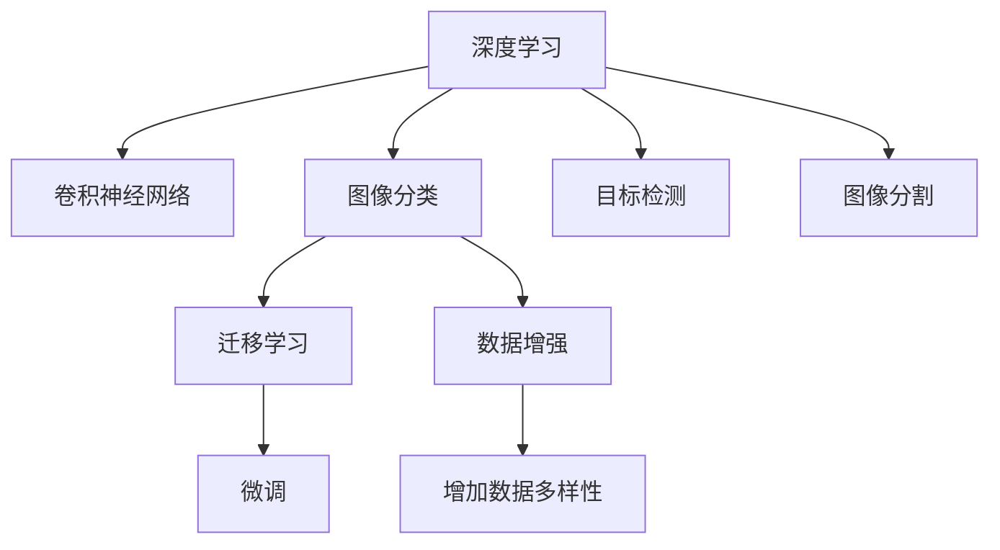

                 

# 深度学习在商品图像识别中的应用

## 1. 背景介绍

随着互联网电商的兴起，商品图像识别成为提升用户体验、优化供应链管理、提升运营效率的重要手段。商品图像识别技术主要涉及图像分类、目标检测、图像分割、图像特征提取等多个领域，是计算机视觉领域的重要研究方向。深度学习技术因其强大的特征学习和泛化能力，成为商品图像识别任务中最为有效的方法之一。本文将深入探讨深度学习在商品图像识别中的应用，包括图像分类、目标检测、图像分割等任务的算法原理、实现步骤和实际应用，并通过代码实例和详细解释说明，帮助读者系统理解深度学习在商品图像识别中的核心技术和实现方法。

## 2. 核心概念与联系

### 2.1 核心概念概述

为更好地理解深度学习在商品图像识别中的应用，本节将介绍几个关键概念：

- **深度学习**：指通过多层神经网络进行特征学习和模式识别的机器学习方法。其中，卷积神经网络（Convolutional Neural Network, CNN）在图像识别任务中表现出色。

- **卷积神经网络**：一种特殊的神经网络结构，通过卷积操作提取图像特征，显著提高了模型对空间局部结构的识别能力。

- **图像分类**：将图像分为预先定义的多个类别，如将商品图片分为鞋、衣服、电子产品等。

- **目标检测**：在图像中定位并标注出感兴趣的目标对象，如识别人脸、车辆等。

- **图像分割**：将图像中的像素分成不同的区域，每个区域具有相似的属性，如将一张商品图片分割出背景和商品区域。

- **迁移学习**：指利用在大量数据上预训练好的模型，在新的领域上进行微调，以快速适应新任务。

- **数据增强**：通过对原始数据进行旋转、缩放、翻转等操作，增加数据多样性，提高模型泛化能力。

这些概念之间的逻辑关系可以通过以下Mermaid流程图来展示：



这个流程图展示出深度学习在商品图像识别中的关键应用，包括卷积神经网络作为核心模型，迁移学习和数据增强等技术，以及图像分类、目标检测和图像分割等具体任务。这些概念相互支撑，共同构建起深度学习在商品图像识别中的应用体系。

## 3. 核心算法原理 & 具体操作步骤

### 3.1 算法原理概述

深度学习在商品图像识别中的应用，主要基于卷积神经网络（CNN）的强大特征提取能力和丰富的图像处理技术。以图像分类任务为例，CNN通过多层卷积、池化和全连接层，对输入图像进行特征提取和分类。其中，卷积层提取图像的局部特征，池化层对特征图进行降维，全连接层将特征图转换为分类结果。

在目标检测任务中，通常使用区域卷积神经网络（R-CNN）或单阶段检测器（SSD）等结构，对图像中的目标对象进行定位和分类。目标检测模型通常包括卷积层、特征金字塔网络（FPN）、ROI池化层等组件，用于提取目标物体的特征并生成边界框。

图像分割任务中，常用的方法包括全卷积神经网络（FCN）和语义分割网络（U-Net）等。这些模型通过像素级别的分类，将图像分割为不同的区域，并赋予每个区域相应的语义标签。

### 3.2 算法步骤详解

以图像分类为例，深度学习在商品图像识别中的应用步骤如下：

**Step 1: 准备数据集**
- 收集商品图像数据，并进行标注，如将每张图片归为特定的商品类别。
- 将数据集分为训练集、验证集和测试集，确保模型在未见过的数据上也能有良好的表现。

**Step 2: 构建模型**
- 使用卷积神经网络（CNN）作为核心模型，设计适合于商品图像分类的网络结构。
- 在网络中添加池化层、批标准化层等组件，用于降维和加速收敛。
- 定义损失函数，如交叉熵损失函数，用于衡量模型预测结果与真实标签之间的差异。

**Step 3: 训练模型**
- 使用训练集对模型进行前向传播和反向传播，更新模型参数。
- 在每个epoch结束后，在验证集上评估模型性能，根据评估结果调整学习率等超参数。
- 训练结束后，在测试集上评估模型性能，对比训练前后的精度提升。

**Step 4: 部署和应用**
- 将训练好的模型部署到实际的商品图像识别应用中。
- 使用模型对新的商品图像进行分类、检测和分割等操作。
- 持续收集新的数据，定期重新训练模型，以适应数据分布的变化。

### 3.3 算法优缺点

深度学习在商品图像识别中的应用，具有以下优点：
- 强大的特征提取能力：卷积神经网络能够自动学习图像中的复杂特征，不需要手动提取特征。
- 泛化能力强：通过大量标注数据进行训练，深度学习模型能够很好地泛化到新的数据上。
- 自动化程度高：深度学习模型的训练和推理过程可以自动完成，不需要手工干预。

同时，深度学习在商品图像识别中也有一些缺点：
- 数据依赖性强：模型需要大量标注数据进行训练，数据标注成本较高。
- 计算资源需求大：深度学习模型需要高性能的计算设备进行训练和推理。
- 模型复杂度高：深度学习模型的结构较为复杂，容易过拟合。

尽管存在这些局限性，但深度学习在商品图像识别中的应用，仍然以其卓越的性能和广泛的应用前景，成为图像识别任务中的主流技术。未来，随着计算资源的进一步提升和数据标注技术的进步，深度学习在商品图像识别中的应用前景将更加广阔。

### 3.4 算法应用领域

深度学习在商品图像识别中的应用，已经涵盖了多个领域，包括但不限于：

- 商品分类：对电商网站上的商品图片进行分类，以便于搜索和推荐。
- 目标检测：识别人脸、车辆等目标物体，应用于智能监控和零售场景。
- 图像分割：将商品图片分割为不同的区域，用于图像编辑和个性化推荐。
- 增强现实：通过深度学习模型对商品图片进行增强处理，提高用户体验。
- 医学影像：对医疗影像进行分类和检测，辅助医生进行疾病诊断。

这些应用领域展示了深度学习在商品图像识别中的广泛应用，为各行业带来了巨大的创新和发展机会。

## 4. 数学模型和公式 & 详细讲解 & 举例说明

### 4.1 数学模型构建

在深度学习中，图像分类任务的目标是将输入图像 $x$ 映射到特定类别 $y$。数学模型可以表示为：

$$
P(y|x;\theta) = \frac{e^{\mathcal{L}(y;f(x;\theta))}}{\sum_{y'} e^{\mathcal{L}(y';f(x;\theta))}}
$$

其中，$y$ 表示标签，$f(x;\theta)$ 表示模型在输入 $x$ 下的输出，$\mathcal{L}$ 表示损失函数，$\theta$ 表示模型参数。

目标检测任务的目标是检测图像中是否存在目标物体，并标注出目标物体的边界框位置和类别。常用的目标检测模型如R-CNN和SSD，其数学模型可以表示为：

$$
L(x,y;\theta) = L_{cls}(x,y;\theta) + L_{reg}(x,y;\theta)
$$

其中，$L_{cls}$ 表示分类损失函数，$L_{reg}$ 表示回归损失函数，$x$ 表示输入图像，$y$ 表示标注结果，$\theta$ 表示模型参数。

图像分割任务的目标是将输入图像 $x$ 分割为多个区域 $y$，每个区域具有特定的语义标签。常用的图像分割模型如FCN和U-Net，其数学模型可以表示为：

$$
L(x,y;\theta) = \sum_i L(x_i,y_i;\theta)
$$

其中，$x_i$ 表示输入图像的像素，$y_i$ 表示分割结果，$\theta$ 表示模型参数。

### 4.2 公式推导过程

以图像分类任务为例，损失函数的推导过程如下：

设输入图像 $x$ 为 $n$ 维向量，类别 $y$ 为 $m$ 维向量。假设模型 $f(x;\theta)$ 的输出为 $n$ 维向量，其中第 $i$ 个元素表示图像属于第 $i$ 个类别的概率。则模型输出可以表示为：

$$
f(x;\theta) = (s(x;\theta), s(x;\theta), ..., s(x;\theta))
$$

其中 $s(x;\theta)$ 表示输出层激活函数，如Sigmoid函数。

假设标注结果为 $y = (y_1, y_2, ..., y_m)$，则交叉熵损失函数可以表示为：

$$
\mathcal{L}(y;f(x;\theta)) = -\sum_{i=1}^m y_i\log f(x;\theta)_i + (1-y_i)\log(1-f(x;\theta)_i)
$$

其中 $f(x;\theta)_i$ 表示模型预测第 $i$ 个类别的概率。

根据最大化似然估计原则，目标函数可以表示为：

$$
\max_{\theta} \sum_{i=1}^N \log P(y_i|x_i;\theta)
$$

其中 $N$ 表示训练样本数量。

为了简化计算，通常使用随机梯度下降等优化算法，最小化损失函数：

$$
\theta \leftarrow \theta - \eta \nabla_{\theta} \mathcal{L}(y;f(x;\theta))
$$

其中 $\eta$ 表示学习率，$\nabla_{\theta} \mathcal{L}(y;f(x;\theta))$ 表示损失函数对模型参数 $\theta$ 的梯度。

### 4.3 案例分析与讲解

以商品图像分类任务为例，具体分析深度学习的应用过程。

假设我们有一批商品图像，每张图片都归为特定的商品类别。我们可以将数据集分为训练集、验证集和测试集，使用其中一部分数据对模型进行训练。

**Step 1: 数据准备**
- 收集商品图像数据，并进行标注，如将每张图片归为特定的商品类别。
- 将数据集分为训练集、验证集和测试集，确保模型在未见过的数据上也能有良好的表现。

**Step 2: 模型构建**
- 使用卷积神经网络（CNN）作为核心模型，设计适合于商品图像分类的网络结构。
- 在网络中添加池化层、批标准化层等组件，用于降维和加速收敛。
- 定义损失函数，如交叉熵损失函数，用于衡量模型预测结果与真实标签之间的差异。

**Step 3: 模型训练**
- 使用训练集对模型进行前向传播和反向传播，更新模型参数。
- 在每个epoch结束后，在验证集上评估模型性能，根据评估结果调整学习率等超参数。
- 训练结束后，在测试集上评估模型性能，对比训练前后的精度提升。

**Step 4: 模型部署**
- 将训练好的模型部署到实际的商品图像识别应用中。
- 使用模型对新的商品图像进行分类。

## 5. 项目实践：代码实例和详细解释说明

### 5.1 开发环境搭建

在进行深度学习项目实践前，我们需要准备好开发环境。以下是使用Python进行深度学习开发的常见环境配置流程：

1. 安装Anaconda：从官网下载并安装Anaconda，用于创建独立的Python环境。

2. 创建并激活虚拟环境：
```bash
conda create -n myenv python=3.7 
conda activate myenv
```

3. 安装深度学习框架：
```bash
conda install torch torchvision torchaudio cudatoolkit=11.1 -c pytorch -c conda-forge
```

4. 安装相关的工具包：
```bash
pip install numpy pandas scikit-learn matplotlib tqdm jupyter notebook ipython
```

完成上述步骤后，即可在`myenv`环境中开始深度学习项目实践。

### 5.2 源代码详细实现

下面我们以商品图像分类为例，给出使用PyTorch框架进行深度学习项目开发的完整代码实现。

```python
import torch
import torch.nn as nn
import torchvision.transforms as transforms
from torch.utils.data import DataLoader
from torchvision.datasets import CIFAR10
from torchvision.models import resnet18

# 定义数据预处理
transform_train = transforms.Compose([
    transforms.RandomCrop(32, padding=4),
    transforms.RandomHorizontalFlip(),
    transforms.ToTensor(),
    transforms.Normalize(mean=[0.485, 0.456, 0.406], std=[0.229, 0.224, 0.225])
])

transform_test = transforms.Compose([
    transforms.ToTensor(),
    transforms.Normalize(mean=[0.485, 0.456, 0.406], std=[0.229, 0.224, 0.225])
])

# 加载CIFAR-10数据集
trainset = CIFAR10(root='./data', train=True, download=True, transform=transform_train)
trainloader = DataLoader(trainset, batch_size=128, shuffle=True, num_workers=2)

testset = CIFAR10(root='./data', train=False, download=True, transform=transform_test)
testloader = DataLoader(testset, batch_size=128, shuffle=False, num_workers=2)

# 加载预训练模型
model = resnet18(pretrained=True)

# 修改输出层
num_classes = 10
model.fc = nn.Linear(512, num_classes)

# 定义损失函数和优化器
criterion = nn.CrossEntropyLoss()
optimizer = torch.optim.Adam(model.parameters(), lr=0.001)

# 训练模型
for epoch in range(10):
    train_loss = 0.0
    train_acc = 0.0
    model.train()
    for data, target in trainloader:
        data, target = data.to(device), target.to(device)
        optimizer.zero_grad()
        output = model(data)
        loss = criterion(output, target)
        loss.backward()
        optimizer.step()
        train_loss += loss.item()
        _, pred = output.max(1)
        num_correct = (pred == target).sum().item()
        train_acc += num_correct / len(target)
    train_loss /= len(trainloader)
    train_acc /= len(trainloader)
    print(f'Epoch {epoch+1}, Loss: {train_loss:.4f}, Accuracy: {train_acc:.4f}')

# 测试模型
model.eval()
correct = 0
total = 0
with torch.no_grad():
    for data, target in testloader:
        data, target = data.to(device), target.to(device)
        output = model(data)
        _, pred = output.max(1)
        total += target.size(0)
        correct += (pred == target).sum().item()
print(f'Test Accuracy: {100 * correct / total:.2f}%')
```

### 5.3 代码解读与分析

**数据预处理**
- `transforms.Compose`：定义数据预处理管道，包括随机裁剪、水平翻转、归一化等操作。

**模型加载**
- `CIFAR10`：加载CIFAR-10数据集，该数据集包含60,000个32x32的彩色图片，分为10个类别。

**模型修改**
- 修改模型的输出层，将其从原始的1000个类别变为10个类别，用于商品分类。

**训练和测试**
- 使用Adam优化器进行模型训练，通过前向传播和反向传播更新模型参数。
- 在每个epoch结束后，评估模型在验证集上的性能，调整学习率等超参数。
- 在测试集上评估模型的最终性能，输出测试准确率。

## 6. 实际应用场景

### 6.1 智能电商

在智能电商领域，商品图像分类技术广泛应用于商品推荐、商品搜索、库存管理等多个场景。通过深度学习模型对商品图像进行分类，电商平台能够更加准确地理解用户的购买意图，提供个性化的商品推荐，提升用户购物体验。

**具体实现**
- 收集电商平台上的商品图片，进行标注和预处理。
- 使用深度学习模型对商品图片进行分类，生成商品标签。
- 将商品标签与用户行为数据结合，进行个性化推荐。

**效果**
- 提升了商品推荐的准确性和多样性。
- 缩短了用户寻找商品的时间，提高了用户满意度。

### 6.2 医疗影像

在医疗影像领域，图像分割技术被广泛应用于疾病的早期筛查和诊断。深度学习模型通过对医学影像进行分割，能够精确地定位出病变区域，辅助医生进行疾病诊断和治疗。

**具体实现**
- 收集医疗影像数据，进行标注和预处理。
- 使用深度学习模型对医学影像进行分割，生成病变区域的边界框。
- 将分割结果与医生的诊断结果进行对比，提升诊断的准确性。

**效果**
- 提高了疾病筛查和诊断的效率和准确性。
- 帮助医生进行精准治疗，提升患者的康复效果。

### 6.3 智能监控

在智能监控领域，目标检测技术被广泛应用于安防、交通等领域。深度学习模型能够自动检测视频流中的目标物体，并生成边界框，用于实时监控和预警。

**具体实现**
- 收集监控视频数据，进行标注和预处理。
- 使用深度学习模型对视频流进行目标检测，生成目标物体的边界框。
- 将检测结果与视频流结合，进行实时监控和预警。

**效果**
- 提高了监控系统的自动化水平。
- 提升了公共安全的保障力度，减少了犯罪事件的发生。

### 6.4 未来应用展望

深度学习在商品图像识别中的应用，将继续拓展到更多的领域，如智能家居、自动驾驶、智能制造等。未来，随着计算资源的进一步提升和深度学习技术的不断进步，深度学习在商品图像识别中的应用将更加广泛和深入。

## 7. 工具和资源推荐

### 7.1 学习资源推荐

为了帮助开发者系统掌握深度学习在商品图像识别中的应用，这里推荐一些优质的学习资源：

1. **深度学习入门书籍**：《深度学习》（Ian Goodfellow）、《神经网络与深度学习》（Michael Nielsen）等书籍，系统介绍了深度学习的基础理论和实际应用。

2. **在线课程**：Coursera、edX、Udacity等平台提供深度学习相关的在线课程，涵盖图像识别、目标检测、图像分割等多个主题。

3. **研究论文**：ArXiv、Google Scholar等平台提供了丰富的深度学习研究论文，可以了解最新的研究方向和技术进展。

4. **开源项目**：GitHub等平台上有许多开源深度学习项目，可以学习和借鉴。

5. **技术博客**：深度学习领域的专业技术博客，如Keras、TensorFlow、PyTorch等官方网站博客，定期发布最新技术文章。

通过对这些资源的学习实践，相信你一定能够快速掌握深度学习在商品图像识别中的核心技术和实现方法。

### 7.2 开发工具推荐

深度学习的开发离不开优秀的工具支持。以下是几款用于深度学习开发的常用工具：

1. **Python**：深度学习项目开发的主要语言，具有强大的科学计算能力和丰富的第三方库支持。

2. **PyTorch**：开源深度学习框架，支持动态计算图和GPU加速，适合快速迭代研究。

3. **TensorFlow**：由Google主导开发的深度学习框架，支持分布式计算和大规模工程应用。

4. **Keras**：基于TensorFlow和Theano的高级神经网络API，易于上手，适合初学者。

5. **Jupyter Notebook**：交互式编程环境，支持代码编写和实时展示，适合数据探索和模型调试。

6. **GitHub**：版本控制平台，支持团队协作和代码管理，适合开源项目和团队开发。

合理利用这些工具，可以显著提升深度学习项目的开发效率，加快创新迭代的步伐。

### 7.3 相关论文推荐

深度学习在商品图像识别中的应用，源于学界的持续研究。以下是几篇奠基性的相关论文，推荐阅读：

1. **ImageNet Classification with Deep Convolutional Neural Networks**：AlexNet论文，提出了深度卷积神经网络，用于大规模图像分类任务。

2. **Deep Residual Learning for Image Recognition**：ResNet论文，提出了残差网络结构，解决了深度网络训练中的梯度消失问题。

3. **Real-Time Single Shot Object Detection with a Single Image Predictor**：SSD论文，提出了单阶段目标检测器，提升了目标检测的速度和精度。

4. **U-Net: Convolutional Networks for Biomedical Image Segmentation**：U-Net论文，提出了用于医学影像分割的全卷积神经网络结构。

这些论文代表了大深度学习在商品图像识别领域的研究脉络。通过学习这些前沿成果，可以帮助研究者把握学科前进方向，激发更多的创新灵感。

## 8. 总结：未来发展趋势与挑战

### 8.1 研究成果总结

深度学习在商品图像识别中的应用，已经取得了显著的进展，成为计算机视觉领域的重要技术手段。通过深度学习模型，商品图像分类、目标检测、图像分割等任务取得了优异的性能，广泛应用于多个行业领域。

### 8.2 未来发展趋势

未来，深度学习在商品图像识别中的应用，将呈现以下几个发展趋势：

1. **模型规模持续增大**：随着计算资源的进一步提升，深度学习模型的规模将不断扩大，学习到更丰富的特征和更复杂的关系。

2. **数据增强技术应用**：数据增强技术将得到更广泛的应用，通过增加数据多样性，提高模型的泛化能力和鲁棒性。

3. **迁移学习技术进步**：迁移学习技术将更加成熟，通过预训练模型在大规模数据上进行迁移学习，提升模型在小样本数据上的性能。

4. **模型压缩和优化**：模型压缩和优化技术将不断发展，提升深度学习模型的推理速度和计算效率。

5. **多模态信息融合**：多模态信息融合技术将得到应用，提升深度学习模型对多源数据的处理能力。

6. **深度学习与人工智能结合**：深度学习将与人工智能的其他技术结合，如自然语言处理、增强学习等，构建更加智能化的应用系统。

### 8.3 面临的挑战

尽管深度学习在商品图像识别中的应用已经取得了显著的进展，但在迈向更加智能化、普适化应用的过程中，仍面临诸多挑战：

1. **数据标注成本高**：深度学习模型需要大量标注数据进行训练，数据标注成本较高。

2. **模型复杂度高**：深度学习模型的结构较为复杂，容易过拟合。

3. **计算资源需求大**：深度学习模型需要高性能的计算设备进行训练和推理，计算资源需求较大。

4. **模型可解释性不足**：深度学习模型的决策过程缺乏可解释性，难以解释其内部工作机制和决策逻辑。

5. **模型安全性和伦理问题**：深度学习模型可能会学习到有害信息，存在安全隐患和伦理问题。

### 8.4 研究展望

面对深度学习在商品图像识别中所面临的挑战，未来的研究需要在以下几个方面寻求新的突破：

1. **无监督和半监督学习**：探索无监督和半监督学习技术，降低对标注数据的依赖，利用自监督学习、主动学习等方法，提升模型的泛化能力。

2. **参数高效和计算高效**：开发更加参数高效和计算高效的深度学习模型，在固定大部分预训练参数的情况下，只更新极少量的任务相关参数，提高模型效率。

3. **多模态信息融合**：将视觉、语音、文本等多种模态信息进行融合，提升深度学习模型对多源数据的处理能力。

4. **模型压缩和优化**：研究模型压缩和优化技术，提升深度学习模型的推理速度和计算效率，降低计算资源需求。

5. **模型可解释性**：研究模型可解释性技术，提升深度学习模型的决策透明度和可信度。

6. **模型安全性和伦理**：研究模型安全性和伦理问题，确保深度学习模型的输出符合人类价值观和伦理道德，避免有害信息的传播。

这些研究方向的探索，必将引领深度学习在商品图像识别领域迈向更高的台阶，为构建安全、可靠、可解释、可控的智能系统铺平道路。面向未来，深度学习在商品图像识别中的技术发展，需要与其他人工智能技术进行更深入的融合，多路径协同发力，共同推动自然语言理解和智能交互系统的进步。

## 9. 附录：常见问题与解答

**Q1: 深度学习在商品图像识别中面临的主要挑战是什么？**

A: 深度学习在商品图像识别中面临的主要挑战包括数据标注成本高、模型复杂度高、计算资源需求大、模型可解释性不足以及模型安全性和伦理问题。这些问题需要通过多种技术手段进行解决，才能实现深度学习模型在商品图像识别中的广泛应用。

**Q2: 深度学习在商品图像识别中的应用包括哪些任务？**

A: 深度学习在商品图像识别中的应用包括商品分类、目标检测、图像分割等任务。这些任务在电商、医疗、安防等领域具有广泛的应用前景，能够提升相关业务的质量和效率。

**Q3: 如何在深度学习项目中降低数据标注成本？**

A: 可以通过数据增强、迁移学习等技术，降低深度学习模型对标注数据的依赖。数据增强技术可以通过对原始数据进行旋转、缩放、翻转等操作，增加数据多样性，提高模型的泛化能力。迁移学习技术可以利用在大规模数据上预训练好的模型，在小规模数据上进行微调，提升模型性能。

**Q4: 如何提升深度学习模型的可解释性？**

A: 可以通过模型可视化、可解释模型等技术，提升深度学习模型的可解释性。模型可视化技术可以展示模型的决策过程和特征重要性，帮助用户理解模型的行为。可解释模型则直接生成可解释的输出，提供更为透明的决策结果。

**Q5: 如何保障深度学习模型的安全性？**

A: 可以通过对抗样本、模型鲁棒性等技术，保障深度学习模型的安全性。对抗样本技术可以检测和防御模型的对抗攻击，防止模型输出错误的决策。模型鲁棒性技术可以提高模型对噪声、扰动等异常情况的适应能力，提升模型的安全性和可靠性。

通过这些常见问题的解答，希望读者能够更加全面地了解深度学习在商品图像识别中的核心技术和实现方法，为未来的项目实践提供参考。

