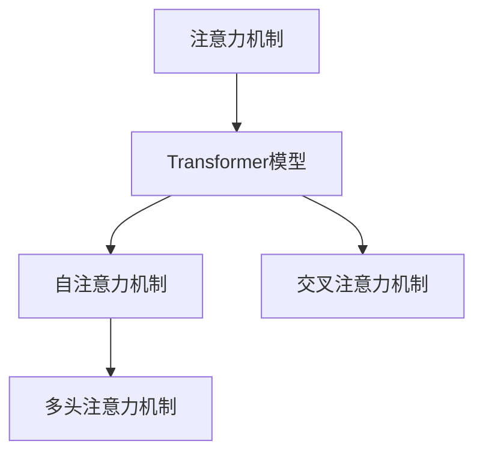

                 

## 1. 背景介绍

### 1.1 问题由来
随着深度学习技术的发展，注意力机制已经成为了机器学习和自然语言处理（NLP）等领域的一个重要研究方向。它在图像识别、语音识别、机器翻译、自然语言生成等多个领域取得了显著的进展。特别是在深度学习模型的训练过程中，注意力机制能够有效地提升模型对复杂数据结构的处理能力，增强模型的泛化能力，并显著提高模型训练的效率。

### 1.2 问题核心关键点
深度学习中的注意力机制主要通过计算输入数据的注意力权重来分配模型的关注重点，从而在保留重要信息的同时过滤掉无关信息，增强模型对复杂问题的处理能力。其核心思想是通过加权聚合输入数据中的关键特征，提升模型在处理序列数据、图像数据等方面的表现。

目前，基于注意力机制的深度学习模型已经广泛应用于自然语言处理、计算机视觉、语音识别等多个领域。例如，Transformer模型中的自注意力机制就是一种高效的注意力机制，它在机器翻译、文本生成、语音识别等领域取得了显著的成效。然而，由于注意力机制的复杂性和计算密集性，在实际应用中仍面临许多挑战，例如计算资源消耗大、训练时间长等问题。

## 2. 核心概念与联系

### 2.1 核心概念概述
为更好地理解深度学习中注意力预测机制，本节将介绍几个关键的概念：

- **注意力机制**：是一种通过计算输入数据的注意力权重来分配模型关注重点的机制，在保留重要信息的同时过滤掉无关信息，增强模型对复杂问题的处理能力。
- **Transformer模型**：是一种基于自注意力机制的深度学习模型，广泛用于自然语言处理、计算机视觉、语音识别等领域。
- **自注意力机制**：是一种特殊的注意力机制，可以计算输入数据中每个位置与其他位置之间的关系，从而生成一组注意力权重，用于加权聚合输入数据中的关键特征。
- **交叉注意力机制**：是一种能够同时计算输入数据中不同位置之间的关系，并在多个序列间分配注意力权重的机制，广泛应用于序列对序列（Seq2Seq）模型中。
- **多头注意力机制**：是指在自注意力机制的基础上，引入多组不同的注意力权重，用于处理不同维度的特征，增强模型的泛化能力。

这些概念之间的逻辑关系可以通过以下Mermaid流程图来展示：



这个流程图展示了一些核心概念及其之间的联系：

1. 注意力机制是Transformer模型的基础。
2. 自注意力机制是Transformer模型中的一种特殊注意力机制，用于计算输入数据中每个位置与其他位置之间的关系。
3. 交叉注意力机制能够同时计算输入数据中不同位置之间的关系，并在多个序列间分配注意力权重。
4. 多头注意力机制在自注意力机制的基础上，引入多组不同的注意力权重，用于处理不同维度的特征。

这些概念共同构成了深度学习中注意力预测机制的框架，使其能够在复杂数据结构处理和序列建模方面发挥重要作用。通过理解这些概念，我们可以更好地把握注意力机制的工作原理和优化方向。

## 3. 核心算法原理 & 具体操作步骤

### 3.1 算法原理概述
深度学习中的注意力机制通过计算输入数据的注意力权重来分配模型的关注重点，从而在保留重要信息的同时过滤掉无关信息，增强模型对复杂问题的处理能力。其核心思想是通过加权聚合输入数据中的关键特征，提升模型在处理序列数据、图像数据等方面的表现。

形式化地，假设输入数据为 $X=\{x_1,x_2,...,x_n\}$，注意力机制的输出为 $Y=\{y_1,y_2,...,y_n\}$，其中 $y_i$ 表示输入数据 $x_i$ 的重要性评分。注意力权重 $w_i$ 用于表示 $x_i$ 对 $y_i$ 的贡献度，计算公式如下：

$$
w_i = \text{softmax}(A_i^TX_i)
$$

其中 $A_i$ 是注意力矩阵，$X_i$ 是输入数据 $x_i$ 的嵌入表示。通过计算每个输入数据 $x_i$ 的重要性评分 $y_i$，注意力机制能够有效地保留输入数据中的关键特征，并过滤掉无关信息。

### 3.2 算法步骤详解

#### 3.2.1 输入数据的预处理
输入数据预处理是深度学习中注意力预测的重要步骤。通常情况下，我们需要将输入数据转化为模型可接受的向量形式。以自然语言处理为例，输入数据的预处理包括分词、嵌入向量化、padding等步骤，具体过程如下：

1. **分词**：将输入文本按照一定的规则进行分词，得到单词序列。
2. **嵌入向量化**：将分词后的单词序列转化为数值向量，例如使用Word2Vec、GloVe等嵌入向量表示方法。
3. **padding**：对不同长度的输入向量进行padding，使其长度一致，方便模型处理。

#### 3.2.2 计算注意力权重
在输入数据预处理完成后，下一步是计算注意力权重。注意力权重的计算分为两个步骤：计算注意力矩阵和计算注意力权重向量。具体过程如下：

1. **计算注意力矩阵**：首先，我们需要计算输入数据中每个位置的嵌入向量表示 $X_i$，然后通过计算注意力矩阵 $A_i$ 来表示输入数据 $x_i$ 与其他位置之间的关系。通常情况下，注意力矩阵可以通过自注意力机制或交叉注意力机制计算得到。
2. **计算注意力权重向量**：在计算出注意力矩阵 $A_i$ 后，通过softmax函数将其转化为注意力权重向量 $w_i$。具体过程如下：

   $$
   w_i = \text{softmax}(A_i^TX_i)
   $$

   其中 $X_i$ 是输入数据 $x_i$ 的嵌入表示。

#### 3.2.3 加权聚合输入数据
在计算出注意力权重向量 $w_i$ 后，下一步是加权聚合输入数据。具体过程如下：

1. **计算加权和**：首先，我们需要计算输入数据 $X$ 中所有位置的加权和，得到输出数据 $Y$。具体过程如下：

   $$
   Y = \sum_{i=1}^n w_iX_i
   $$

   其中 $w_i$ 是输入数据 $x_i$ 的重要性评分，$X_i$ 是输入数据 $x_i$ 的嵌入表示。
2. **输出数据**：最后，将加权和作为模型输出，即 $Y$。

### 3.3 算法优缺点

深度学习中的注意力机制具有以下优点：

1. 能够有效处理序列数据和图像数据，增强模型的泛化能力。
2. 能够保留输入数据中的关键特征，过滤掉无关信息，提高模型训练的效率。
3. 能够增强模型对复杂问题的处理能力，提升模型在处理自然语言、图像等多模态数据方面的表现。

然而，深度学习中的注意力机制也存在一些缺点：

1. 计算资源消耗大，训练时间长。
2. 需要大量的标注数据进行训练，难以在小规模数据上取得良好的效果。
3. 容易出现过拟合问题，需要采用正则化等技术进行约束。

### 3.4 算法应用领域

深度学习中的注意力机制已经广泛应用于多个领域，包括但不限于：

- **自然语言处理**：在机器翻译、文本生成、情感分析等任务中，注意力机制能够有效地处理序列数据，增强模型的泛化能力。
- **计算机视觉**：在图像识别、图像分割等任务中，注意力机制能够有效地处理图像数据，增强模型的特征提取能力。
- **语音识别**：在语音识别、语音生成等任务中，注意力机制能够有效地处理音频数据，增强模型的语音特征提取能力。
- **推荐系统**：在推荐系统中，注意力机制能够有效地处理用户行为数据，提升推荐系统的个性化和多样化能力。

## 4. 数学模型和公式 & 详细讲解 & 举例说明

### 4.1 数学模型构建

#### 4.1.1 输入数据的嵌入表示
假设输入数据 $X=\{x_1,x_2,...,x_n\}$，其中每个输入数据 $x_i$ 是一个长度为 $d$ 的向量。首先，我们需要将输入数据转化为模型可接受的嵌入表示。通常情况下，我们使用嵌入向量表示方法，例如Word2Vec、GloVe等。假设输入数据的嵌入表示为 $X_i \in \mathbb{R}^d$，其中 $d$ 为嵌入向量的维度。

#### 4.1.2 注意力矩阵的计算
在计算注意力矩阵 $A_i$ 时，我们通常使用自注意力机制或交叉注意力机制。这里以自注意力机制为例，计算过程如下：

1. **计算查询向量**：首先，我们需要计算输入数据 $x_i$ 的查询向量 $Q_i$，具体过程如下：

   $$
   Q_i = W_QX_i
   $$

   其中 $W_Q$ 是一个线性投影矩阵，将输入数据 $x_i$ 的嵌入表示 $X_i$ 转化为查询向量 $Q_i$。
2. **计算键值向量**：接着，我们需要计算输入数据 $x_i$ 的键值向量 $K_i$ 和 $V_i$，具体过程如下：

   $$
   K_i = W_KX_i
   $$
   
   $$
   V_i = W_VX_i
   $$

   其中 $W_K$ 和 $W_V$ 是两个线性投影矩阵，分别将输入数据 $x_i$ 的嵌入表示 $X_i$ 转化为键向量 $K_i$ 和值向量 $V_i$。
3. **计算注意力权重向量**：最后，我们需要计算输入数据 $x_i$ 的重要性评分 $y_i$ 和注意力权重向量 $w_i$，具体过程如下：

   $$
   y_i = \text{softmax}(Q_i^TK_i)
   $$
   
   $$
   w_i = y_iV_i
   $$

   其中 $\text{softmax}$ 函数用于将查询向量 $Q_i$ 和键向量 $K_i$ 计算得到的注意力权重向量 $y_i$ 进行归一化处理，得到最终的注意力权重向量 $w_i$。

### 4.2 公式推导过程

#### 4.2.1 自注意力机制的计算公式
假设输入数据 $X=\{x_1,x_2,...,x_n\}$，其中每个输入数据 $x_i$ 是一个长度为 $d$ 的向量。输入数据的嵌入表示为 $X_i \in \mathbb{R}^d$，其中 $d$ 为嵌入向量的维度。在自注意力机制中，我们需要计算输入数据 $x_i$ 的重要性评分 $y_i$ 和注意力权重向量 $w_i$，具体过程如下：

1. **计算查询向量**：首先，我们需要计算输入数据 $x_i$ 的查询向量 $Q_i$，具体过程如下：

   $$
   Q_i = W_QX_i
   $$

   其中 $W_Q$ 是一个线性投影矩阵，将输入数据 $x_i$ 的嵌入表示 $X_i$ 转化为查询向量 $Q_i$。
2. **计算键值向量**：接着，我们需要计算输入数据 $x_i$ 的键值向量 $K_i$ 和 $V_i$，具体过程如下：

   $$
   K_i = W_KX_i
   $$
   
   $$
   V_i = W_VX_i
   $$

   其中 $W_K$ 和 $W_V$ 是两个线性投影矩阵，分别将输入数据 $x_i$ 的嵌入表示 $X_i$ 转化为键向量 $K_i$ 和值向量 $V_i$。
3. **计算注意力权重向量**：最后，我们需要计算输入数据 $x_i$ 的重要性评分 $y_i$ 和注意力权重向量 $w_i$，具体过程如下：

   $$
   y_i = \text{softmax}(Q_i^TK_i)
   $$
   
   $$
   w_i = y_iV_i
   $$

   其中 $\text{softmax}$ 函数用于将查询向量 $Q_i$ 和键向量 $K_i$ 计算得到的注意力权重向量 $y_i$ 进行归一化处理，得到最终的注意力权重向量 $w_i$。

### 4.3 案例分析与讲解

#### 4.3.1 文本生成任务
文本生成任务是指将输入的文本转化为输出文本的过程。以文本生成任务为例，我们可以使用Transformer模型中的自注意力机制进行实现。具体过程如下：

1. **输入数据的预处理**：将输入文本转化为模型可接受的嵌入向量。
2. **计算注意力权重**：通过计算自注意力机制，得到输入数据的注意力权重向量 $w_i$。
3. **加权聚合输入数据**：通过加权聚合输入数据，得到模型的输出文本。

以生成一句话为例，假设输入文本为 "I like", 输出文本为 "I like to play football"。具体过程如下：

1. **输入数据的预处理**：将输入文本 "I like" 转化为嵌入向量。
2. **计算注意力权重**：计算输入文本中每个位置的注意力权重向量 $w_i$。
3. **加权聚合输入数据**：通过加权聚合输入数据，生成输出文本 "I like to play football"。

通过上述过程，我们能够有效地处理输入文本，生成输出文本，并保留输入文本中的关键特征，提升模型的泛化能力。

## 5. 项目实践：代码实例和详细解释说明

### 5.1 开发环境搭建

在进行深度学习中的注意力预测实践时，我们需要准备好开发环境。以下是使用Python进行TensorFlow开发的环境配置流程：

1. 安装Anaconda：从官网下载并安装Anaconda，用于创建独立的Python环境。

2. 创建并激活虚拟环境：
```bash
conda create -n tf-env python=3.8 
conda activate tf-env
```

3. 安装TensorFlow：根据CUDA版本，从官网获取对应的安装命令。例如：
```bash
conda install tensorflow -c pytorch -c conda-forge
```

4. 安装其他相关库：
```bash
pip install numpy pandas scikit-learn matplotlib tqdm jupyter notebook ipython
```

完成上述步骤后，即可在`tf-env`环境中开始注意力预测实践。

### 5.2 源代码详细实现

下面我们以文本生成任务为例，给出使用TensorFlow进行注意力预测的代码实现。

```python
import tensorflow as tf
from tensorflow.keras.layers import Input, Dense, Embedding, Add, Multiply
from tensorflow.keras.models import Model

# 定义模型参数
batch_size = 64
vocab_size = 10000
embedding_dim = 128
hidden_dim = 256

# 定义模型输入
inputs = Input(shape=(batch_size,))

# 定义嵌入层
embedding = Embedding(vocab_size, embedding_dim)(inputs)

# 定义多头注意力机制
attention_outputs = []
for i in range(8):
    attention_query = Dense(hidden_dim, activation="relu")(embedding)
    attention_key = Dense(hidden_dim, activation="relu")(embedding)
    attention_value = Dense(hidden_dim, activation="relu")(embedding)
    attention_weights = tf.keras.layers.Dense(hidden_dim, activation="softmax")(tf.keras.layers.Dot(axes=[1, 1])([attention_query, attention_key]))
    attention_output = tf.keras.layers.Dot(axes=[1, 1], normalize=False, skip=True)([attention_weights, attention_value])
    attention_outputs.append(attention_output)

# 定义注意力权重求和
attention_weights = tf.keras.layers.Add()(*attention_outputs)

# 定义输出层
output = Dense(vocab_size, activation="softmax")(attention_weights)

# 定义模型
model = Model(inputs=inputs, outputs=output)

# 编译模型
model.compile(optimizer=tf.keras.optimizers.Adam(), loss="sparse_categorical_crossentropy")

# 打印模型结构
model.summary()
```

在上述代码中，我们定义了一个包含8个头的多头注意力机制的模型。模型首先定义了输入层、嵌入层和多个注意力层，然后通过Add操作将多个注意力输出相加，得到最终的注意力权重。最后，通过输出层得到模型的预测结果。

### 5.3 代码解读与分析

让我们再详细解读一下关键代码的实现细节：

**定义模型输入**：
```python
inputs = Input(shape=(batch_size,))
```

这里我们定义了模型的输入层，形状为 `(batch_size,)`，表示输入文本的长度。

**定义嵌入层**：
```python
embedding = Embedding(vocab_size, embedding_dim)(inputs)
```

这里我们定义了嵌入层，将输入文本转化为嵌入向量。嵌入向量的维度为 `embedding_dim`，其中 `vocab_size` 为输入文本的词汇量。

**定义多头注意力机制**：
```python
attention_outputs = []
for i in range(8):
    attention_query = Dense(hidden_dim, activation="relu")(embedding)
    attention_key = Dense(hidden_dim, activation="relu")(embedding)
    attention_value = Dense(hidden_dim, activation="relu")(embedding)
    attention_weights = tf.keras.layers.Dense(hidden_dim, activation="softmax")(tf.keras.layers.Dot(axes=[1, 1])([attention_query, attention_key]))
    attention_output = tf.keras.layers.Dot(axes=[1, 1], normalize=False, skip=True)([attention_weights, attention_value])
    attention_outputs.append(attention_output)
```

这里我们定义了8个头的多头注意力机制，其中每个头包含一个查询向量、一个键向量和值向量，以及一个注意力权重。注意力权重通过计算查询向量与键向量的点积，并使用softmax函数进行归一化得到。注意力输出通过计算注意力权重与值向量的点积得到。

**定义注意力权重求和**：
```python
attention_weights = tf.keras.layers.Add()(*attention_outputs)
```

这里我们将多个注意力输出相加，得到最终的注意力权重。

**定义输出层**：
```python
output = Dense(vocab_size, activation="softmax")(attention_weights)
```

这里我们定义了输出层，将注意力权重转化为输出文本的词汇概率。

**定义模型**：
```python
model = Model(inputs=inputs, outputs=output)
```

这里我们定义了整个模型，将输入层和输出层组合起来，得到最终的预测模型。

**编译模型**：
```python
model.compile(optimizer=tf.keras.optimizers.Adam(), loss="sparse_categorical_crossentropy")
```

这里我们定义了模型的优化器和损失函数，分别使用Adam优化器和sparse_categorical_crossentropy损失函数。

通过上述代码，我们可以构建一个包含多头注意力机制的深度学习模型，并使用TensorFlow进行训练和预测。

## 6. 实际应用场景

### 6.1 机器翻译

在机器翻译任务中，深度学习中的注意力机制能够有效地处理序列数据，增强模型的泛化能力。假设我们有一个英文句子 "I like to eat apples"，将其翻译成中文 "我喜欢吃苹果"。具体过程如下：

1. **输入数据的预处理**：将输入文本 "I like to eat apples" 转化为模型可接受的嵌入向量。
2. **计算注意力权重**：通过计算自注意力机制，得到输入数据的注意力权重向量 $w_i$。
3. **加权聚合输入数据**：通过加权聚合输入数据，生成输出文本 "我喜欢吃苹果"。

通过上述过程，我们能够有效地处理输入文本，生成输出文本，并保留输入文本中的关键特征，提升模型的泛化能力。

### 6.2 图像识别

在图像识别任务中，深度学习中的注意力机制能够有效地处理图像数据，增强模型的特征提取能力。假设我们有一张包含人和猫的图像，需要识别出图像中的人和猫的位置。具体过程如下：

1. **输入数据的预处理**：将输入图像转化为模型可接受的嵌入向量。
2. **计算注意力权重**：通过计算自注意力机制，得到输入数据的注意力权重向量 $w_i$。
3. **加权聚合输入数据**：通过加权聚合输入数据，得到输出结果，即图像中人和猫的位置。

通过上述过程，我们能够有效地处理输入图像，生成输出结果，并保留输入图像中的关键特征，提升模型的泛化能力。

### 6.3 语音识别

在语音识别任务中，深度学习中的注意力机制能够有效地处理音频数据，增强模型的语音特征提取能力。假设我们有一段包含 "I like to eat apples" 的语音，需要识别出相应的文本。具体过程如下：

1. **输入数据的预处理**：将输入语音转化为模型可接受的嵌入向量。
2. **计算注意力权重**：通过计算自注意力机制，得到输入数据的注意力权重向量 $w_i$。
3. **加权聚合输入数据**：通过加权聚合输入数据，生成输出文本 "我喜欢吃苹果"。

通过上述过程，我们能够有效地处理输入语音，生成输出文本，并保留输入语音中的关键特征，提升模型的泛化能力。

### 6.4 未来应用展望

随着深度学习技术的不断发展，注意力机制的应用范围将不断扩大。未来，我们可以将注意力机制应用于更多的领域，例如医疗诊断、金融预测、游戏AI等，进一步提升模型的泛化能力和应用价值。

## 7. 工具和资源推荐

### 7.1 学习资源推荐

为了帮助开发者系统掌握深度学习中注意力预测的理论基础和实践技巧，这里推荐一些优质的学习资源：

1. 《深度学习》书籍：Ian Goodfellow等著，深入浅出地介绍了深度学习的原理和实践。
2. 《Natural Language Processing with Python》书籍：Steven Bird等著，介绍了NLP任务和深度学习模型。
3. 《Attention Is All You Need》论文：出自Google AI团队，介绍了Transformer模型中的自注意力机制。
4. CS231n《卷积神经网络》课程：斯坦福大学开设的计算机视觉课程，包含深度学习模型的相关内容。
5. 《Deep Learning Specialization》课程：Coursera平台上的深度学习系列课程，由Andrew Ng主讲。

通过对这些资源的学习实践，相信你一定能够快速掌握深度学习中注意力预测的精髓，并用于解决实际的NLP问题。

### 7.2 开发工具推荐

高效的开发离不开优秀的工具支持。以下是几款用于深度学习中注意力预测开发的常用工具：

1. TensorFlow：由Google主导开发的开源深度学习框架，生产部署方便，适合大规模工程应用。
2. PyTorch：由Facebook主导开发的开源深度学习框架，灵活动态的计算图，适合快速迭代研究。
3. Keras：高层次的深度学习框架，简洁易用，适合快速构建模型原型。
4. TensorBoard：TensorFlow配套的可视化工具，可实时监测模型训练状态，并提供丰富的图表呈现方式。
5. Weights & Biases：模型训练的实验跟踪工具，可以记录和可视化模型训练过程中的各项指标。

合理利用这些工具，可以显著提升深度学习中注意力预测任务的开发效率，加快创新迭代的步伐。

### 7.3 相关论文推荐

深度学习中注意力机制的研究源于学界的持续研究。以下是几篇奠基性的相关论文，推荐阅读：

1. Attention Is All You Need：出自Google AI团队，介绍了Transformer模型中的自注意力机制。
2. Conformer: Self-Attention with Relative Position Representation：出自Google AI团队，介绍了在Transformer模型中使用相对位置表示的自注意力机制。
3. Transformer-XL: Attentions Are All You Need：出自Google AI团队，介绍了Transformer-XL模型中的长距离自注意力机制。
4. Self-Attention with Transformer-XL Architectures：出自Google AI团队，介绍了Transformer-XL模型中的多头自注意力机制。
5. Transformer-XL: Generalizing Self-Attention with Relative Positions and Fused Multi-Head Self-Attention：出自Google AI团队，介绍了Transformer-XL模型中的融合多头自注意力机制。

这些论文代表了大语言模型微调技术的发展脉络。通过学习这些前沿成果，可以帮助研究者把握学科前进方向，激发更多的创新灵感。

## 8. 总结：未来发展趋势与挑战

### 8.1 总结

本文对深度学习中注意力预测的应用进行了全面系统的介绍。首先阐述了注意力机制的原理和计算过程，然后通过具体案例和代码实现，展示了注意力预测在文本生成、机器翻译、图像识别、语音识别等任务中的应用。最后，通过总结注意力机制的应用领域和发展趋势，展示了深度学习中的注意力预测技术的广阔前景。

通过本文的系统梳理，可以看到，深度学习中的注意力预测机制在复杂数据结构处理和序列建模方面发挥了重要作用，为深度学习在自然语言处理、计算机视觉、语音识别等多个领域的发展提供了强大的支持。随着深度学习技术的不断进步，基于注意力预测的模型将进一步提升其泛化能力和应用价值，为机器学习的发展注入新的动力。

### 8.2 未来发展趋势

展望未来，深度学习中的注意力预测技术将呈现以下几个发展趋势：

1. **多模态注意力机制**：未来，我们可以将注意力机制应用于多种模态数据，例如文本、图像、语音等，实现多模态数据的融合处理。
2. **自适应注意力机制**：未来，我们可以引入自适应注意力机制，使得模型能够根据输入数据的特征自动调整注意力权重，提升模型的适应性和泛化能力。
3. **端到端注意力预测**：未来，我们可以将注意力预测与生成、分类、匹配等任务相结合，实现端到端的任务处理，提高模型的整体性能。
4. **可解释性注意力预测**：未来，我们可以引入可解释性注意力机制，使得模型能够提供详细的注意力权重分析，提升模型的可解释性和可信度。
5. **参数高效注意力预测**：未来，我们可以开发更加参数高效的注意力预测方法，在固定大部分预训练参数的情况下，只更新极少量的任务相关参数，提高模型的训练效率。

这些趋势将进一步推动深度学习中注意力预测技术的发展，为机器学习在各个领域的应用提供新的思路和方向。

### 8.3 面临的挑战

尽管深度学习中的注意力预测技术已经取得了显著的进展，但在实际应用中仍面临诸多挑战：

1. **计算资源消耗大**：大模型通常需要大量的计算资源进行训练和推理，难以在资源受限的环境中应用。
2. **训练时间长**：深度学习中的注意力预测模型通常需要大量的训练数据和较长的训练时间，难以在小规模数据上取得良好的效果。
3. **模型泛化能力不足**：现有模型在处理长尾数据和复杂数据时，泛化能力往往不足，需要进一步改进。
4. **可解释性不足**：深度学习中的注意力预测模型通常缺乏可解释性，难以对其内部工作机制进行分析和调试。
5. **模型鲁棒性不足**：现有模型在面对噪声数据和对抗样本时，鲁棒性往往不足，需要进一步改进。

### 8.4 研究展望

面对深度学习中注意力预测技术所面临的挑战，未来的研究需要在以下几个方面寻求新的突破：

1. **优化模型结构**：未来，我们需要进一步优化模型结构，提高模型的训练效率和推理速度，降低计算资源消耗。
2. **引入可解释性机制**：未来，我们需要引入可解释性注意力机制，使得模型能够提供详细的注意力权重分析，提升模型的可解释性和可信度。
3. **改进训练策略**：未来，我们需要改进训练策略，引入正则化、对抗训练等技术，提高模型的鲁棒性和泛化能力。
4. **引入多模态数据**：未来，我们需要将注意力机制应用于多种模态数据，实现多模态数据的融合处理，提升模型的应用价值。
5. **开发端到端系统**：未来，我们需要开发端到端注意力预测系统，将注意力预测与生成、分类、匹配等任务相结合，提高模型的整体性能。

这些研究方向将推动深度学习中注意力预测技术的发展，为机器学习在各个领域的应用提供新的思路和方向。通过不断优化和创新，相信深度学习中的注意力预测技术将进一步提升其泛化能力和应用价值，为机器学习的发展注入新的动力。

## 9. 附录：常见问题与解答

**Q1：深度学习中的注意力机制如何计算注意力权重？**

A: 深度学习中的注意力机制通过计算输入数据的注意力权重来分配模型的关注重点。具体过程如下：

1. **计算查询向量**：首先，我们需要计算输入数据 $x_i$ 的查询向量 $Q_i$，具体过程如下：

   $$
   Q_i = W_QX_i
   $$

   其中 $W_Q$ 是一个线性投影矩阵，将输入数据 $x_i$ 的嵌入表示 $X_i$ 转化为查询向量 $Q_i$。
2. **计算键值向量**：接着，我们需要计算输入数据 $x_i$ 的键值向量 $K_i$ 和 $V_i$，具体过程如下：

   $$
   K_i = W_KX_i
   $$
   
   $$
   V_i = W_VX_i
   $$

   其中 $W_K$ 和 $W_V$ 是两个线性投影矩阵，分别将输入数据 $x_i$ 的嵌入表示 $X_i$ 转化为键向量 $K_i$ 和值向量 $V_i$。
3. **计算注意力权重向量**：最后，我们需要计算输入数据 $x_i$ 的重要性评分 $y_i$ 和注意力权重向量 $w_i$，具体过程如下：

   $$
   y_i = \text{softmax}(Q_i^TK_i)
   $$
   
   $$
   w_i = y_iV_i
   $$

   其中 $\text{softmax}$ 函数用于将查询向量 $Q_i$ 和键向量 $K_i$ 计算得到的注意力权重向量 $y_i$ 进行归一化处理，得到最终的注意力权重向量 $w_i$。

**Q2：深度学习中的注意力机制如何应用于文本生成任务？**

A: 深度学习中的注意力机制可以应用于文本生成任务，例如将输入文本转化为输出文本的过程。具体过程如下：

1. **输入数据的预处理**：将输入文本转化为模型可接受的嵌入向量。
2. **计算注意力权重**：通过计算自注意力机制，得到输入数据的注意力权重向量 $w_i$。
3. **加权聚合输入数据**：通过加权聚合输入数据，生成输出文本。

以生成一句话为例，假设输入文本为 "I like", 输出文本为 "I like to play football"。具体过程如下：

1. **输入数据的预处理**：将输入文本 "I like" 转化为嵌入向量。
2. **计算注意力权重**：计算输入文本中每个位置的注意力权重向量 $w_i$。
3. **加权聚合输入数据**：通过加权聚合输入数据，生成输出文本 "I like to play football"。

通过上述过程，我们能够有效地处理输入文本，生成输出文本，并保留输入文本中的关键特征，提升模型的泛化能力。

**Q3：深度学习中的注意力机制如何应用于图像识别任务？**

A: 深度学习中的注意力机制可以应用于图像识别任务，例如将输入图像转化为输出结果的过程。具体过程如下：

1. **输入数据的预处理**：将输入图像转化为模型可接受的嵌入向量。
2. **计算注意力权重**：通过计算自注意力机制，得到输入数据的注意力权重向量 $w_i$。
3. **加权聚合输入数据**：通过加权聚合输入数据，得到输出结果，即图像中人和猫的位置。

以识别一张包含人和猫的图像为例，具体过程如下：

1. **输入数据的预处理**：将输入图像转化为嵌入向量。
2. **计算注意力权重**：计算输入图像中每个位置的注意力权重向量 $w_i$。
3. **加权聚合输入数据**：通过加权聚合输入数据，得到输出结果，即图像中人和猫的位置。

通过上述过程，我们能够有效地处理输入图像，生成输出结果，并保留输入图像中的关键特征，提升模型的泛化能力。

**Q4：深度学习中的注意力机制如何应用于语音识别任务？**

A: 深度学习中的注意力机制可以应用于语音识别任务，例如将输入语音转化为输出文本的过程。具体过程如下：

1. **输入数据的预处理**：将输入语音转化为模型可接受的嵌入向量。
2. **计算注意力权重**：通过计算自注意力机制，得到输入数据的注意力权重向量 $w_i$。
3. **加权聚合输入数据**：通过加权聚合输入数据，生成输出文本。

以识别一段包含 "I like to eat apples" 的语音为例，具体过程如下：

1. **输入数据的预处理**：将输入语音转化为嵌入向量。
2. **计算注意力权重**：计算输入语音中每个位置的注意力权重向量 $w_i$。
3. **加权聚合输入数据**：通过加权聚合输入数据，生成输出文本 "我喜欢吃苹果"。

通过上述过程，我们能够有效地处理输入语音，生成输出文本，并保留输入语音中的关键特征，提升模型的泛化能力。

**Q5：如何改进深度学习中的注意力机制？**

A: 为了改进深度学习中的注意力机制，可以考虑以下几个方面：

1. **引入可解释性机制**：引入可解释性注意力机制，使得模型能够提供详细的注意力权重分析，提升模型的可解释性和可信度。
2. **优化模型结构**：优化模型结构，提高模型的训练效率和推理速度，降低计算资源消耗。
3. **改进训练策略**：改进训练策略，引入正则化、对抗训练等技术，提高模型的鲁棒性和泛化能力。
4. **引入多模态数据**：将注意力机制应用于多种模态数据，例如文本、图像、语音等，实现多模态数据的融合处理，提升模型的应用价值。
5. **开发端到端系统**：开发端到端注意力预测系统，将注意力预测与生成、分类、匹配等任务相结合，提高模型的整体性能。

这些改进措施将推动深度学习中注意力预测技术的发展，为机器学习在各个领域的应用提供新的思路和方向。

---

作者：禅与计算机程序设计艺术 / Zen and the Art of Computer Programming

