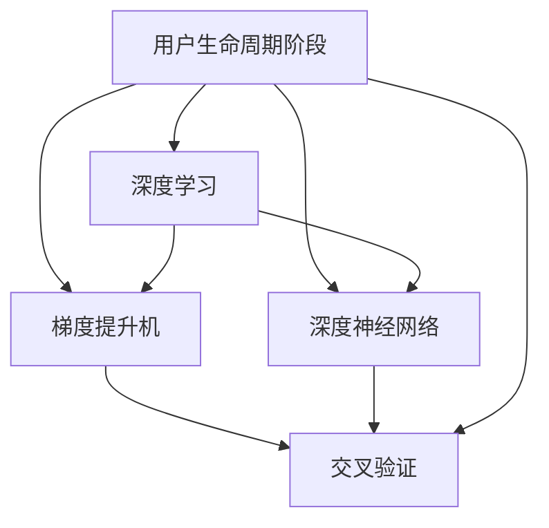

                 

# 深度学习在用户生命周期阶段预测中的新方法

> 关键词：用户生命周期阶段预测,深度学习,用户行为分析,推荐系统,梯度提升机(GBDT),深度神经网络,交叉验证(CV)

## 1. 背景介绍

### 1.1 问题由来
在互联网和电子商务领域，了解和预测用户生命周期阶段（Customer Lifecycle Stage, CLS）对于提升用户留存、转化率和整体用户体验至关重要。用户生命周期阶段通常包括获取、激活、留存、提升、转化和卸载等多个关键阶段，每个阶段的预测和分析都涉及用户行为、购买历史、社交网络等多个维度的数据。传统的统计模型和机器学习模型，如逻辑回归、决策树等，往往难以处理大规模、复杂的数据结构，而深度学习模型则能够更好地适应这类场景，提供更精准的预测。

### 1.2 问题核心关键点
深度学习在用户生命周期阶段预测中的应用，主要通过构建复杂非线性的模型，利用丰富的用户数据，预测用户行为。关键问题包括：

1. **数据预处理**：如何有效处理缺失值、异常值，进行特征工程，提升数据质量。
2. **模型选择**：深度神经网络（DNN）、梯度提升机（GBDT）等算法各有优缺点，应根据数据特点选择合适的模型。
3. **模型训练与优化**：大尺度训练集的迭代优化，以及超参数的调优。
4. **模型评估**：如何合理评估模型的预测效果，避免过拟合。
5. **部署与应用**：将模型集成到生产环境，实现实时预测。

### 1.3 问题研究意义
用户生命周期阶段预测是用户行为分析的重要手段，对于电商平台、社交网络、在线教育等多个垂直领域的应用有重要意义：

1. **提升用户体验**：精准预测用户行为，提供个性化推荐，增强用户粘性。
2. **优化业务流程**：预测用户流失，及时采取挽留策略，提高用户转化率。
3. **改进产品设计**：分析用户转化路径，指导产品改进与创新。
4. **优化广告投放**：精准识别高价值用户群体，提升广告投放效果。

## 2. 核心概念与联系

### 2.1 核心概念概述

为了更好地理解深度学习在用户生命周期阶段预测中的应用，本节将介绍几个核心概念：

- **用户生命周期阶段（CLS）**：用户在使用产品或服务过程中所经历的各个关键阶段，包括获取、激活、留存、提升、转化和卸载等。
- **深度学习**：一种基于多层神经网络的机器学习方法，通过自动学习特征表示，解决复杂的非线性问题。
- **梯度提升机（GBDT）**：一种集成学习方法，通过构建多棵决策树，逐步提升模型性能。
- **深度神经网络（DNN）**：一种具有多隐藏层的神经网络，能处理高维数据，捕捉复杂模式。
- **交叉验证（CV）**：一种评估模型性能的常用技术，通过将数据集分为训练集和验证集，交叉验证可有效避免过拟合。

这些核心概念之间的逻辑关系可以通过以下Mermaid流程图来展示：



这个流程图展示了用户生命周期阶段预测中涉及的关键概念及其相互关系：

1. 用户生命周期阶段是预测的核心目标。
2. 深度学习、梯度提升机、深度神经网络等算法用于模型构建。
3. 交叉验证用于模型评估，防止过拟合。

## 3. 核心算法原理 & 具体操作步骤
### 3.1 算法原理概述

用户生命周期阶段预测的核心是构建能够捕捉用户行为特征的模型，并通过这些特征预测用户是否进入下一生命周期阶段。常见的深度学习方法包括深度神经网络（DNN）和梯度提升机（GBDT），而交叉验证（CV）用于模型评估和超参数优化。

- **深度神经网络**：通过多层神经网络自动学习数据特征表示，适用于处理高维数据和非线性问题。
- **梯度提升机**：通过多棵决策树逐步提升模型性能，适用于处理高维稀疏数据。
- **交叉验证**：将数据集分为训练集和验证集，通过交叉验证评估模型性能，避免过拟合。

### 3.2 算法步骤详解

#### 3.2.1 数据准备

1. **数据收集**：收集用户的历史行为数据，包括点击记录、购买记录、社交网络互动等。
2. **数据清洗**：处理缺失值、异常值，进行特征工程，提升数据质量。
3. **特征选择**：选择与用户行为相关性高的特征，如用户ID、时间戳、浏览记录等。

#### 3.2.2 模型选择与构建

1. **深度神经网络模型**：选择合适的网络结构（如CNN、RNN等），设置超参数，构建DNN模型。
2. **梯度提升机模型**：选择合适树的数量和深度，构建GBDT模型。

#### 3.2.3 模型训练与优化

1. **训练**：将数据集分为训练集和验证集，使用随机梯度下降（SGD）等优化算法进行模型训练。
2. **调参**：调整超参数，如学习率、批大小等，通过交叉验证选择最优参数。
3. **评估**：在测试集上评估模型性能，如准确率、召回率、F1值等。

#### 3.2.4 模型集成与部署

1. **集成**：通过投票、平均等方法，将多个模型的预测结果进行集成，提升预测准确度。
2. **部署**：将模型集成到生产环境，实现实时预测。

### 3.3 算法优缺点

#### 3.3.1 深度神经网络

- **优点**：
  - 能处理高维数据和非线性问题，适用于大规模数据集。
  - 具有较强的泛化能力，适用于复杂预测任务。
- **缺点**：
  - 模型复杂，训练时间长。
  - 容易过拟合，需要大量数据支持。

#### 3.3.2 梯度提升机

- **优点**：
  - 适用于处理高维稀疏数据，模型性能优异。
  - 可解释性强，易于理解和调试。
- **缺点**：
  - 只能处理数值型数据，难以处理文本数据。
  - 模型构建复杂，对超参数敏感。

#### 3.3.3 交叉验证

- **优点**：
  - 避免过拟合，有效评估模型性能。
  - 适用于多种模型评估，通用性较强。
- **缺点**：
  - 数据消耗较大，需要较多的计算资源。
  - 评估结果可能受数据分割影响，不够稳定。

### 3.4 算法应用领域

基于深度学习的用户生命周期阶段预测方法，在电商、社交、在线教育等多个领域得到了广泛应用：

1. **电商平台**：通过预测用户流失，及时采取挽留策略，提升用户转化率。
2. **社交网络**：分析用户行为，预测用户活跃度，提供个性化内容推荐。
3. **在线教育**：预测学生流失，提升课程质量，改进教学方法。
4. **金融服务**：预测用户贷款违约，优化风险控制策略。

## 4. 数学模型和公式 & 详细讲解

### 4.1 数学模型构建

用户生命周期阶段预测的数学模型可表示为：

$$
P(y|x;\theta) = \prod_{i=1}^{k} P(y_i|x;\theta)
$$

其中 $y$ 表示用户生命周期阶段，$x$ 表示用户行为特征，$\theta$ 为模型参数。假设 $y_i$ 为二分类任务，则 $P(y_i|x;\theta)$ 可以使用softmax函数表示：

$$
P(y_i|x;\theta) = \frac{e^{\theta^T \phi(x)}}{\sum_{j}e^{\theta^T \phi(x_j)}}
$$

其中 $\phi(x)$ 为特征映射函数。

### 4.2 公式推导过程

以深度神经网络为例，其优化目标函数为交叉熵损失函数：

$$
\mathcal{L} = -\frac{1}{N}\sum_{i=1}^{N}\sum_{j=1}^{C} y_{i,j}\log \hat{y}_{i,j}
$$

其中 $N$ 为样本数，$C$ 为类别数，$y_{i,j}$ 表示样本 $i$ 属于类别 $j$ 的真实标签，$\hat{y}_{i,j}$ 表示模型预测概率。

前向传播时，输入样本 $x$ 经过多层次神经网络，最终得到输出概率 $\hat{y}$。反向传播时，通过链式法则计算梯度：

$$
\frac{\partial \mathcal{L}}{\partial \theta} = -\frac{1}{N}\sum_{i=1}^{N}\sum_{j=1}^{C} y_{i,j}(\delta_{i,j} - \hat{y}_{i,j})
$$

其中 $\delta_{i,j}$ 为误差项，$\nabla_{\theta}\mathcal{L}$ 表示梯度。

### 4.3 案例分析与讲解

以用户流失预测为例，假设数据集 $D = \{(x_i, y_i)\}_{i=1}^N$，其中 $x_i$ 为样本特征，$y_i \in \{0,1\}$ 表示用户是否流失。

1. **数据预处理**：对缺失值进行插补，对异常值进行修正。
2. **特征工程**：选择时间戳、浏览记录、购买记录等特征，并进行归一化处理。
3. **模型构建**：选择深度神经网络模型，设置隐藏层数为3，每层神经元数为256，激活函数为ReLU。
4. **模型训练**：使用随机梯度下降算法进行模型训练，学习率为0.001，批大小为128。
5. **模型评估**：在测试集上计算准确率、召回率和F1值。

## 5. 项目实践：代码实例和详细解释说明

### 5.1 开发环境搭建

为了进行用户生命周期阶段预测的深度学习实践，我们需要安装必要的开发工具：

1. **Python环境**：使用Anaconda创建虚拟环境。
2. **深度学习框架**：安装TensorFlow或PyTorch。
3. **数据处理库**：安装NumPy、Pandas、Scikit-learn等。
4. **模型库**：安装TensorFlow或PyTorch的深度学习模型库。

### 5.2 源代码详细实现

以TensorFlow为例，以下是用户流失预测的代码实现：

```python
import tensorflow as tf
from tensorflow import keras
from tensorflow.keras.layers import Dense, Dropout, Activation
from sklearn.model_selection import train_test_split

# 数据加载
data = load_data('user_data.csv')
X = data['features']
y = data['target']
X_train, X_test, y_train, y_test = train_test_split(X, y, test_size=0.2, random_state=42)

# 模型构建
model = keras.Sequential([
    Dense(256, input_shape=(X_train.shape[1],)),
    Activation('relu'),
    Dense(128),
    Activation('relu'),
    Dense(1),
    Activation('sigmoid')
])
model.compile(loss='binary_crossentropy', optimizer='adam', metrics=['accuracy'])

# 模型训练
model.fit(X_train, y_train, epochs=10, batch_size=128, validation_split=0.2)

# 模型评估
loss, accuracy = model.evaluate(X_test, y_test)
print('Test accuracy:', accuracy)
```

### 5.3 代码解读与分析

上述代码实现了深度神经网络用户流失预测的基本流程：

1. **数据加载**：使用Pandas加载用户行为数据，并进行特征工程。
2. **模型构建**：创建包含两个隐藏层的深度神经网络模型。
3. **模型编译**：设置损失函数、优化器和评估指标。
4. **模型训练**：使用随机梯度下降算法进行模型训练，设置学习率和批大小。
5. **模型评估**：在测试集上评估模型性能。

## 6. 实际应用场景

### 6.1 电商平台用户流失预测

在电商平台中，用户流失是一个重要的问题。通过用户生命周期阶段预测，电商平台可以提前识别可能流失的用户，采取措施提升用户留存。

具体应用时，可以从用户行为数据中提取特征，如购买频率、购物车放弃次数、客户服务反馈等，通过深度神经网络或梯度提升机模型预测用户流失概率。模型训练完成后，可以集成到实时监控系统中，实时预测用户流失风险，并通过邮件、短信等方式进行挽留。

### 6.2 在线教育用户转化预测

在线教育平台希望通过精准的用户预测，提升课程完成率和用户转化率。

用户转化预测的核心在于分析用户的学习行为，如课程观看次数、在线学习时间、提交作业情况等，预测用户是否完成课程。通过深度学习模型，平台可以准确预测用户学习进度，提供个性化学习建议，提高用户学习体验和转化率。

### 6.3 金融服务用户风险评估

金融服务领域，风险控制是至关重要的环节。通过用户生命周期阶段预测，金融机构可以更准确地评估用户的还款能力，降低贷款违约风险。

具体应用时，可以从用户历史交易数据中提取特征，如还款记录、信用评分、消费行为等，通过梯度提升机模型预测用户违约概率。模型训练完成后，可以集成到信用评分系统中，辅助金融机构进行风险评估和贷款审批。

### 6.4 未来应用展望

随着深度学习技术的发展，用户生命周期阶段预测将不断拓展应用场景，提升用户体验和业务效率。未来可能的发展趋势包括：

1. **多模态数据融合**：结合用户行为、社交网络、情感分析等多模态数据，提升预测准确度。
2. **实时预测与优化**：通过在线学习和增量学习技术，实现实时预测与模型优化。
3. **跨领域应用**：将用户生命周期预测应用于更多垂直领域，如医疗、旅游等，提升整体用户满意度。
4. **自动化工具**：开发自动化模型训练、特征工程工具，降低开发门槛，加速模型应用。

## 7. 工具和资源推荐

### 7.1 学习资源推荐

为了帮助开发者系统掌握深度学习在用户生命周期阶段预测中的应用，这里推荐一些优质的学习资源：

1. **《深度学习》**：Ian Goodfellow等著，全面介绍深度学习的基本概念和应用场景。
2. **《TensorFlow实战》**：Manning Publications著，详细介绍TensorFlow的使用和案例分析。
3. **《Keras深度学习》**：François Chollet著，详细介绍Keras的深度学习模型构建。
4. **Coursera《深度学习专项课程》**：由Andrew Ng等专家主讲，涵盖深度学习的基础理论和实际应用。
5. **Kaggle竞赛平台**：通过参与用户流失预测等竞赛，积累实战经验，提升模型预测能力。

### 7.2 开发工具推荐

深度学习模型在用户生命周期预测中的应用，依赖于强大的开发工具支持。以下是几款常用的工具：

1. **TensorFlow**：Google开发的深度学习框架，支持分布式训练，适用于大规模数据集。
2. **Keras**：基于TensorFlow和Theano的高级API，简单易用，适用于快速原型开发。
3. **PyTorch**：Facebook开发的深度学习框架，灵活高效，适用于科研和原型开发。
4. **Jupyter Notebook**：交互式开发环境，支持Python和R等多种语言，适合数据探索和模型调试。
5. **WealthofNeurIPS**：深度学习领域的专业论坛，提供丰富的学习资源和技术交流。

合理利用这些工具，可以显著提升用户生命周期阶段预测的开发效率，加快模型应用的创新迭代。

### 7.3 相关论文推荐

深度学习在用户生命周期阶段预测中的应用，得益于众多学者的持续研究。以下是几篇奠基性的相关论文，推荐阅读：

1. **Deep Customer Lifecycle Prediction**：提出深度神经网络模型，预测用户生命周期阶段。
2. **Customer Churn Prediction with Gradient Boosting Machines**：使用梯度提升机模型，预测用户流失。
3. **User Behavior Prediction with Deep Learning**：基于深度学习模型，预测用户行为。
4. **A Comparative Study of Deep Learning and Gradient Boosting for Customer Churn Prediction**：对比深度学习与梯度提升机的性能和适用性。
5. **User Behavioral Prediction in E-commerce**：应用深度学习模型，预测用户行为，提升电商平台的用户留存率。

这些论文代表了用户生命周期阶段预测领域的研究进展，通过学习这些前沿成果，可以帮助研究者把握学科前进方向，激发更多的创新灵感。

## 8. 总结：未来发展趋势与挑战

### 8.1 研究成果总结

深度学习在用户生命周期阶段预测中的应用，显著提升了预测的准确度和应用效果。核心研究成果包括：

1. **模型构建**：选择深度神经网络或梯度提升机模型，进行特征工程和模型调参。
2. **数据预处理**：处理缺失值、异常值，进行特征选择和归一化。
3. **模型训练与评估**：使用随机梯度下降算法进行模型训练，通过交叉验证评估模型性能。
4. **模型集成与部署**：将模型集成到实时系统中，实现用户生命周期预测。

### 8.2 未来发展趋势

未来深度学习在用户生命周期阶段预测的发展趋势包括：

1. **多模态数据融合**：结合用户行为、社交网络、情感分析等多模态数据，提升预测准确度。
2. **实时预测与优化**：通过在线学习和增量学习技术，实现实时预测与模型优化。
3. **跨领域应用**：将用户生命周期预测应用于更多垂直领域，如医疗、旅游等，提升整体用户满意度。
4. **自动化工具**：开发自动化模型训练、特征工程工具，降低开发门槛，加速模型应用。

### 8.3 面临的挑战

尽管深度学习在用户生命周期阶段预测中取得了显著进展，但仍面临诸多挑战：

1. **数据获取与处理**：用户数据的隐私保护和数据获取成本高，数据质量和特征工程难度大。
2. **模型复杂性**：深度学习模型复杂，训练时间长，需要大量数据支持。
3. **模型可解释性**：深度学习模型的黑盒特性，难以解释预测结果。
4. **实时性与高效性**：实时预测和高效计算需求高，模型部署和优化难度大。

### 8.4 研究展望

面向未来，深度学习在用户生命周期阶段预测的研究方向包括：

1. **数据获取与隐私保护**：探索数据匿名化和隐私保护技术，保障用户数据安全。
2. **模型简化与优化**：研究参数高效和计算高效的微调方法，提高模型训练效率。
3. **模型可解释性**：引入因果分析和博弈论工具，增强模型解释性。
4. **跨领域应用**：将用户生命周期预测应用于更多垂直领域，提升整体用户满意度。
5. **自动化工具**：开发自动化模型训练、特征工程工具，降低开发门槛，加速模型应用。

深度学习在用户生命周期阶段预测中的应用，为多个垂直领域提供了重要的技术支持。未来随着模型的不断发展，将有望进一步提升预测准确度，推动各行业的智能化转型。

## 9. 附录：常见问题与解答

### 9.1 问题1：用户生命周期预测中的特征工程如何实现？

**回答**：用户生命周期预测中的特征工程，涉及对用户行为数据进行多角度分析和处理。具体步骤包括：

1. **数据清洗**：处理缺失值、异常值，确保数据质量。
2. **特征选择**：选择与用户行为相关性高的特征，如用户ID、时间戳、浏览记录等。
3. **特征归一化**：对数值型特征进行归一化处理，确保不同特征具有相同的量级。
4. **特征衍生**：根据业务需求，衍生新的特征，如用户活跃度、消费金额等。

### 9.2 问题2：深度学习模型如何处理缺失值和异常值？

**回答**：深度学习模型对缺失值和异常值的处理，通常采用以下方法：

1. **缺失值处理**：采用均值填补、插补等方法，填补缺失值。
2. **异常值检测**：使用z-score、IQR等方法检测和处理异常值。
3. **特征工程**：将缺失值和异常值作为新特征，参与模型训练。
4. **模型优化**：在模型训练时，加入正则化项，限制模型复杂度，避免过拟合。

### 9.3 问题3：深度学习模型在用户生命周期预测中的优势和劣势？

**回答**：深度学习模型在用户生命周期预测中的优势包括：

1. **高泛化能力**：能够处理高维非线性数据，适合复杂预测任务。
2. **自动化特征学习**：通过自动学习特征表示，提升预测准确度。
3. **实时预测**：通过在线学习技术，实现实时预测和模型优化。

深度学习模型在用户生命周期预测中的劣势包括：

1. **数据需求高**：需要大量数据进行训练，数据获取成本高。
2. **模型复杂**：模型构建和训练过程复杂，需要专业知识。
3. **可解释性差**：深度学习模型具有黑盒特性，难以解释预测结果。

---

作者：禅与计算机程序设计艺术 / Zen and the Art of Computer Programming

