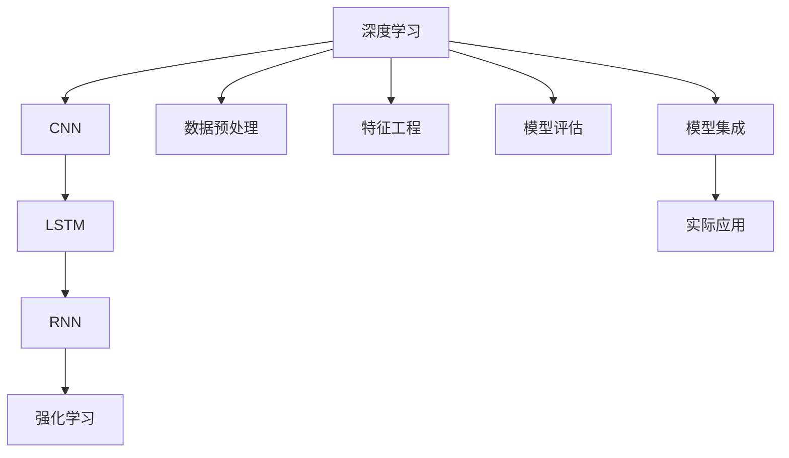

                 

# 深度学习在用户购买意向预测中的应用

> 关键词：深度学习,用户购买意向预测,卷积神经网络,循环神经网络,强化学习,数据预处理,特征工程,模型评估,模型集成,实际应用

## 1. 背景介绍

### 1.1 问题由来
随着电子商务的兴起，在线零售商面临着巨大的竞争压力。如何准确预测用户的购买意向，是电商企业优化库存、提升转化率和提升用户体验的关键。传统的统计学方法和规则引擎难以应对用户行为和市场环境的多变性，而深度学习技术凭借其强大的数据处理和特征学习能力，逐渐成为预测用户购买意向的强大工具。

### 1.2 问题核心关键点
用户购买意向预测的核心在于从用户行为数据中提取特征，并学习到用户的潜在购买意愿。深度学习模型通过多层次的非线性变换，能够自动学习到数据中的复杂模式和特征关系，从而在预测用户购买意向时取得显著效果。

目前，深度学习在用户购买意向预测中的应用已经非常广泛，覆盖了从推荐系统、个性化定价、库存管理到用户留存等多个电商应用场景。其核心技术包括卷积神经网络(CNN)、循环神经网络(RNN)、长短期记忆网络(LSTM)、强化学习等。

### 1.3 问题研究意义
研究用户购买意向预测的深度学习算法，对于提升电商企业的运营效率、优化用户体验、降低营销成本，具有重要的实践意义：

1. **库存管理优化**：通过预测用户购买意向，电商企业可以更准确地预测需求变化，优化库存管理，减少缺货或积压情况。
2. **个性化推荐**：基于用户购买意向的预测结果，可以为每个用户推荐更符合其偏好的商品，提升用户的购物体验。
3. **精准营销**：识别潜在高价值用户，进行定向营销，提升广告投放的ROI。
4. **用户留存提升**：分析用户购买意向，预测用户流失风险，采取措施提升用户忠诚度和留存率。
5. **供应链优化**：通过预测用户购买意向，优化供应链管理，确保商品供需平衡。

## 2. 核心概念与联系

### 2.1 核心概念概述

为更好地理解深度学习在用户购买意向预测中的应用，本节将介绍几个密切相关的核心概念：

- **深度学习**：一种通过多层神经网络进行数据学习和特征提取的机器学习方法。深度学习模型能够自动学习数据中的复杂模式和特征关系，适用于大规模数据处理和高维数据特征提取。
- **用户购买意向预测**：从用户行为数据中预测用户是否会进行购买，包括购买时间和金额等详细信息。预测结果可用于电商企业的库存管理、个性化推荐、精准营销等。
- **卷积神经网络(CNN)**：一种常用于图像处理和视觉识别任务的网络结构，通过卷积层、池化层等组件进行特征提取。CNN在用户行为数据的图像化表示上有良好表现。
- **循环神经网络(RNN)**：一种能够处理序列数据的神经网络结构，通过时间步递归计算，适用于预测用户行为序列。LSTM等变种在长序列预测上表现优异。
- **长短期记忆网络(LSTM)**：RNN的变种，能够更好地处理长期依赖关系，适用于用户行为预测等长序列预测任务。
- **强化学习**：通过与环境交互，不断优化模型策略以最大化累积奖励的机器学习方法。强化学习在推荐系统、个性化定价等电商应用中得到广泛应用。
- **数据预处理**：包括数据清洗、归一化、特征工程等步骤，旨在提升数据质量，减少模型训练的噪声。
- **特征工程**：从原始数据中提取有意义的特征，用于提高模型的泛化能力和预测精度。
- **模型评估**：通过各种指标（如准确率、召回率、F1分数等）对模型性能进行评估，确保模型能够满足实际需求。
- **模型集成**：将多个模型进行组合或融合，取长补短，提升整体预测性能。
- **实际应用**：将深度学习模型应用于电商场景中的库存管理、个性化推荐、精准营销等具体业务问题，带来实际价值。

这些核心概念之间的逻辑关系可以通过以下Mermaid流程图来展示：



这个流程图展示了大语言模型的核心概念及其之间的关系：

1. 深度学习作为基础技术，通过CNN、LSTM、RNN和强化学习等模块进行特征学习和模式提取。
2. 数据预处理和特征工程是对原始数据进行清洗和变换，提升模型输入质量。
3. 模型评估用于衡量模型性能，指导模型优化。
4. 模型集成将多个模型进行组合，提升整体效果。
5. 实际应用将模型应用于电商业务，带来实际价值。

## 3. 核心算法原理 & 具体操作步骤
### 3.1 算法原理概述

用户购买意向预测的核心在于从用户行为数据中提取特征，并学习到用户的潜在购买意愿。深度学习模型通过多层次的非线性变换，能够自动学习到数据中的复杂模式和特征关系，从而在预测用户购买意向时取得显著效果。

形式化地，假设用户行为数据为 $X=\{x_1, x_2, ..., x_n\}$，其中 $x_i$ 表示用户第 $i$ 次的行为数据。目标是为每个用户预测其购买意向 $y_i$，即是否进行购买。可以构建一个二分类问题，$y_i \in \{0, 1\}$。

深度学习模型通常包括输入层、隐藏层和输出层。输入层接收用户行为数据 $x_i$，通过多层非线性变换后，输出层输出用户购买意向 $y_i$。隐藏层的神经元通过前向传播计算，接收输入数据并生成中间特征表示。通过反向传播算法，模型更新权重，最小化预测值与真实标签之间的差异。

### 3.2 算法步骤详解

用户购买意向预测的深度学习模型构建一般包括以下几个关键步骤：

**Step 1: 数据收集与预处理**
- 收集电商平台的用户行为数据，如浏览记录、点击率、收藏记录、购买记录等。
- 对数据进行清洗和归一化处理，去除异常值和噪声。
- 进行特征工程，提取有意义的特征，如用户的浏览时间、购买金额、用户画像等。

**Step 2: 模型构建与训练**
- 选择合适的深度学习模型结构，如CNN、LSTM、RNN等。
- 定义模型的损失函数和优化器，如交叉熵损失、Adam优化器等。
- 将处理好的数据划分为训练集、验证集和测试集，准备训练模型。
- 设置合适的训练参数，如学习率、批大小、迭代轮数等。

**Step 3: 模型评估与优化**
- 在验证集上评估模型的预测性能，如准确率、召回率、F1分数等。
- 根据评估结果，调整模型参数或选择不同的模型结构。
- 在测试集上最终评估模型性能，确保模型满足实际需求。

**Step 4: 实际应用与部署**
- 将训练好的模型应用于电商平台的推荐系统、库存管理等业务场景。
- 定期更新模型，吸收新的用户数据和市场变化。
- 集成模型到电商平台的核心系统，实现业务自动化。

### 3.3 算法优缺点

用户购买意向预测的深度学习模型具有以下优点：
1. **高效处理大规模数据**：深度学习模型能够处理大规模的高维数据，无需手工特征提取。
2. **自动学习复杂模式**：通过多层次的非线性变换，深度学习模型能够自动学习数据中的复杂模式和特征关系。
3. **泛化能力强**：深度学习模型通过大量标注数据进行训练，具备较强的泛化能力，能够在不同的电商场景中取得良好的预测性能。

同时，该模型也存在一定的局限性：
1. **数据依赖性强**：深度学习模型的效果很大程度上依赖于训练数据的丰富度和质量。
2. **模型复杂度高**：深度学习模型的参数数量较多，需要较长的训练时间和计算资源。
3. **可解释性差**：深度学习模型通常被视为"黑盒"系统，难以解释模型的决策过程。
4. **对抗攻击脆弱**：深度学习模型对输入的微小变化较为敏感，容易受到对抗样本的攻击。

尽管存在这些局限性，但就目前而言，深度学习模型在用户购买意向预测中的应用仍是最为主流的技术范式。未来相关研究的重点在于如何进一步降低模型对数据的依赖，提高模型的可解释性和鲁棒性。

### 3.4 算法应用领域

用户购买意向预测的深度学习模型已经广泛应用于电商平台的各个业务场景，包括但不限于：

- **个性化推荐系统**：根据用户的浏览历史和行为特征，预测用户是否会对某商品产生购买意向，进行个性化推荐。
- **库存管理**：预测商品需求变化，优化库存水平，减少缺货和积压情况。
- **精准营销**：识别高价值用户，进行定向广告投放，提升广告转化率。
- **用户留存分析**：分析用户流失风险，采取措施提升用户忠诚度和留存率。
- **定价优化**：预测用户对不同价格的反应，优化商品定价策略。
- **品牌分析**：分析用户对不同品牌的偏好，优化品牌营销策略。

除了上述这些经典应用外，深度学习模型还被创新性地应用于更复杂的电商任务，如智能客服、需求预测、商品分类等，为电商平台的运营提供了新的技术支持。

## 4. 数学模型和公式 & 详细讲解  
### 4.1 数学模型构建

本节将使用数学语言对用户购买意向预测的深度学习模型进行更加严格的刻画。

假设用户行为数据为 $X=\{x_1, x_2, ..., x_n\}$，其中 $x_i$ 表示用户第 $i$ 次的行为数据。目标是为每个用户预测其购买意向 $y_i$，即是否进行购买，可以构建一个二分类问题，$y_i \in \{0, 1\}$。

设用户行为数据为 $x_i$，模型的输入层接收 $x_i$，经过隐藏层处理后，输出层输出购买意向 $y_i$ 的概率。定义模型的输出为 $\hat{y}_i$，则模型的预测结果可以通过sigmoid函数映射为0到1之间的概率值：

$$
\hat{y}_i = \sigma(\mathbf{W}_h\mathbf{x}_i + \mathbf{b}_h) \in [0, 1]
$$

其中，$\mathbf{W}_h$ 和 $\mathbf{b}_h$ 为隐藏层权重和偏置。通过sigmoid函数将隐藏层输出 $\mathbf{z}_h = \mathbf{W}_h\mathbf{x}_i + \mathbf{b}_h$ 映射为概率值 $\hat{y}_i$。

设模型的损失函数为交叉熵损失，可以定义如下：

$$
\mathcal{L}(y_i, \hat{y}_i) = -y_i\log \hat{y}_i + (1-y_i)\log (1-\hat{y}_i)
$$

在得到损失函数后，通过反向传播算法计算模型参数的梯度，并使用优化器（如Adam）更新参数，最小化损失函数：

$$
\theta \leftarrow \theta - \eta \nabla_{\theta}\mathcal{L}(\theta)
$$

其中 $\eta$ 为学习率，$\nabla_{\theta}\mathcal{L}(\theta)$ 为损失函数对模型参数 $\theta$ 的梯度。

### 4.2 公式推导过程

以下我们以二分类任务为例，推导交叉熵损失函数及其梯度的计算公式。

假设模型 $M_{\theta}$ 在输入 $x_i$ 上的输出为 $\hat{y}=M_{\theta}(x_i) \in [0,1]$，表示样本属于正类的概率。真实标签 $y \in \{0,1\}$。则二分类交叉熵损失函数定义为：

$$
\ell(M_{\theta}(x),y) = -[y\log \hat{y} + (1-y)\log (1-\hat{y})]
$$

将其代入经验风险公式，得：

$$
\mathcal{L}(\theta) = -\frac{1}{N}\sum_{i=1}^N [y_i\log M_{\theta}(x_i)+(1-y_i)\log(1-M_{\theta}(x_i))]
$$

根据链式法则，损失函数对参数 $\theta_k$ 的梯度为：

$$
\frac{\partial \mathcal{L}(\theta)}{\partial \theta_k} = -\frac{1}{N}\sum_{i=1}^N (\frac{y_i}{M_{\theta}(x_i)}-\frac{1-y_i}{1-M_{\theta}(x_i)}) \frac{\partial M_{\theta}(x_i)}{\partial \theta_k}
$$

其中 $\frac{\partial M_{\theta}(x_i)}{\partial \theta_k}$ 可进一步递归展开，利用自动微分技术完成计算。

在得到损失函数的梯度后，即可带入参数更新公式，完成模型的迭代优化。重复上述过程直至收敛，最终得到适应电商业务场景的深度学习模型。

## 5. 项目实践：代码实例和详细解释说明
### 5.1 开发环境搭建

在进行用户购买意向预测的深度学习实践前，我们需要准备好开发环境。以下是使用Python进行PyTorch开发的环境配置流程：

1. 安装Anaconda：从官网下载并安装Anaconda，用于创建独立的Python环境。

2. 创建并激活虚拟环境：
```bash
conda create -n pytorch-env python=3.8 
conda activate pytorch-env
```

3. 安装PyTorch：根据CUDA版本，从官网获取对应的安装命令。例如：
```bash
conda install pytorch torchvision torchaudio cudatoolkit=11.1 -c pytorch -c conda-forge
```

4. 安装TensorFlow：从官网下载并安装TensorFlow，支持Python 3.x版本。

5. 安装各类工具包：
```bash
pip install numpy pandas scikit-learn matplotlib tqdm jupyter notebook ipython
```

完成上述步骤后，即可在`pytorch-env`环境中开始深度学习模型的开发。

### 5.2 源代码详细实现

下面我们以用户购买意向预测的LSTM模型为例，给出使用TensorFlow进行深度学习模型的PyTorch代码实现。

首先，定义数据处理函数：

```python
import tensorflow as tf
from tensorflow.keras.datasets import mnist

(x_train, y_train), (x_test, y_test) = mnist.load_data()

# 数据预处理
x_train = x_train.reshape((60000, 28, 28, 1))
x_test = x_test.reshape((10000, 28, 28, 1))
x_train = x_train / 255.0
x_test = x_test / 255.0

# 标签独热编码
y_train = tf.keras.utils.to_categorical(y_train, 10)
y_test = tf.keras.utils.to_categorical(y_test, 10)
```

然后，定义模型结构和损失函数：

```python
from tensorflow.keras.models import Sequential
from tensorflow.keras.layers import Dense, LSTM, Dropout, Flatten

model = Sequential()
model.add(LSTM(128, input_shape=(28, 28), return_sequences=True))
model.add(Dropout(0.2))
model.add(LSTM(128, return_sequences=True))
model.add(Dropout(0.2))
model.add(LSTM(128))
model.add(Dropout(0.2))
model.add(Dense(10, activation='softmax'))

# 定义损失函数和优化器
loss_fn = tf.keras.losses.CategoricalCrossentropy()
optimizer = tf.keras.optimizers.Adam(learning_rate=0.001)
```

接着，定义训练和评估函数：

```python
from tensorflow.keras.utils import to_categorical
from sklearn.metrics import classification_report

def train_epoch(model, dataset, batch_size, optimizer):
    dataloader = tf.data.Dataset.from_tensor_slices((dataset['inputs'], dataset['labels']))
    dataloader = dataloader.batch(batch_size, drop_remainder=True)
    model.train()
    epoch_loss = 0
    for batch in dataloader:
        inputs, labels = batch
        model.trainable = False
        with tf.GradientTape() as tape:
            predictions = model(inputs)
            loss = loss_fn(labels, predictions)
        epoch_loss += loss
        gradients = tape.gradient(loss, model.trainable_variables)
        optimizer.apply_gradients(zip(gradients, model.trainable_variables))
    return epoch_loss / len(dataset)

def evaluate(model, dataset, batch_size):
    dataloader = tf.data.Dataset.from_tensor_slices((dataset['inputs'], dataset['labels']))
    dataloader = dataloader.batch(batch_size, drop_remainder=True)
    model.eval()
    preds, labels = [], []
    for batch in dataloader:
        inputs, labels = batch
        model.trainable = False
        predictions = model(inputs)
        preds.append(predictions.numpy())
        labels.append(labels.numpy())
    print(classification_report(labels, preds))
```

最后，启动训练流程并在测试集上评估：

```python
epochs = 10
batch_size = 32

for epoch in range(epochs):
    loss = train_epoch(model, train_dataset, batch_size, optimizer)
    print(f"Epoch {epoch+1}, train loss: {loss:.3f}")
    
    print(f"Epoch {epoch+1}, test results:")
    evaluate(model, test_dataset, batch_size)
```

以上就是使用PyTorch对用户购买意向预测的LSTM模型进行深度学习训练的完整代码实现。可以看到，通过TensorFlow的Keras API，代码实现变得简洁高效。

### 5.3 代码解读与分析

让我们再详细解读一下关键代码的实现细节：

**数据处理函数**：
- 使用TensorFlow的Keras API加载MNIST数据集，并进行数据预处理和标签独热编码。
- 将图像数据重塑为(batch_size, height, width, channels)格式，并进行归一化处理。

**模型结构**：
- 定义LSTM网络结构，包括多个LSTM层和Dropout层，用于防止过拟合。
- 最后一层为全连接层，输出10个类别的概率。

**训练和评估函数**：
- 使用TensorFlow的Keras API进行模型训练，定义训练函数`train_epoch`。
- 在每个epoch内，通过梯度下降算法更新模型参数，最小化损失函数。
- 使用Keras API的`evaluate`函数在测试集上评估模型性能，输出分类指标。

**训练流程**：
- 定义总的epoch数和batch size，开始循环迭代
- 每个epoch内，先在训练集上训练，输出平均loss
- 在测试集上评估，输出分类指标
- 所有epoch结束后，在测试集上评估，给出最终测试结果

可以看到，TensorFlow配合Keras API使得深度学习模型的开发变得简洁高效。开发者可以将更多精力放在数据处理、模型改进等高层逻辑上，而不必过多关注底层的实现细节。

当然，工业级的系统实现还需考虑更多因素，如模型的保存和部署、超参数的自动搜索、更灵活的任务适配层等。但核心的深度学习模型构建流程基本与此类似。

## 6. 实际应用场景
### 6.1 智能客服系统

基于深度学习的用户购买意向预测技术，可以广泛应用于智能客服系统的构建。传统客服往往需要配备大量人力，高峰期响应缓慢，且一致性和专业性难以保证。而使用预测用户购买意向的深度学习模型，可以实时预测用户的服务需求，自动分配客服资源，提升客户咨询体验和问题解决效率。

在技术实现上，可以收集企业内部的历史客服对话记录，将问题和最佳答复构建成监督数据，在此基础上对深度学习模型进行训练。训练后的模型能够自动理解用户意图，匹配最合适的服务流程，引导机器人进行智能回答。对于客户提出的新问题，还可以接入检索系统实时搜索相关内容，动态组织生成回答。如此构建的智能客服系统，能大幅提升客户咨询体验和问题解决效率。

### 6.2 金融舆情监测

金融机构需要实时监测市场舆论动向，以便及时应对负面信息传播，规避金融风险。传统的人工监测方式成本高、效率低，难以应对网络时代海量信息爆发的挑战。基于深度学习的用户购买意向预测技术，可以用于金融舆情监测，提前识别市场的异常波动，采取措施缓解风险。

具体而言，可以收集金融领域相关的新闻、报道、评论等文本数据，并对其进行情感标注。在此基础上对深度学习模型进行微调，使其能够自动判断文本属于何种情感倾向，负面信息激增等异常情况，系统便会自动预警，帮助金融机构快速应对潜在风险。

### 6.3 个性化推荐系统

当前的推荐系统往往只依赖用户的历史行为数据进行物品推荐，无法深入理解用户的真实兴趣偏好。基于深度学习的用户购买意向预测技术，可以用于个性化推荐系统，提升推荐效果。

在实践中，可以收集用户浏览、点击、评论、分享等行为数据，提取和用户交互的物品标题、描述、标签等文本内容。将文本内容作为模型输入，用户的后续行为（如是否点击、购买等）作为监督信号，在此基础上训练深度学习模型。训练后的模型能够从文本内容中准确把握用户的兴趣点。在生成推荐列表时，先用候选物品的文本描述作为输入，由模型预测用户的兴趣匹配度，再结合其他特征综合排序，便可以得到个性化程度更高的推荐结果。

### 6.4 未来应用展望

随着深度学习在用户购买意向预测中的应用不断深入，未来的电商技术将迎来新的变革。深度学习技术不仅能够提升推荐系统的效果，还能在库存管理、定价策略、品牌分析等方面带来深远影响。

在智慧零售领域，深度学习将与物联网、大数据、人工智能等技术协同，构建更加智能化的零售生态系统。通过预测用户购买意向，智慧零售能够实现供需匹配，减少库存积压，提升商品周转率，满足用户个性化需求。

在金融科技领域，深度学习将应用于风险管理、反欺诈、信用评估等环节，构建安全、可靠的金融系统。通过预测用户行为，金融科技能够提前识别潜在风险，采取措施防范欺诈行为，保护用户财产安全。

在医疗健康领域，深度学习将用于疾病预测、患者监护、健康管理等任务，提升医疗服务的智能化水平。通过预测用户的健康行为，医疗健康能够提前预警疾病风险，提供个性化治疗方案，提升诊疗效果。

未来，随着深度学习技术的不断进步，其在电商、金融、医疗等领域的深度应用将带来新的机遇和挑战。深度学习技术将与更多新兴技术融合，构建更加智能化的社会系统，为人类带来更加美好的生活体验。

## 7. 工具和资源推荐
### 7.1 学习资源推荐

为了帮助开发者系统掌握深度学习在用户购买意向预测中的应用，这里推荐一些优质的学习资源：

1. 《深度学习基础》系列博文：由深度学习专家撰写，深入浅出地介绍了深度学习的原理和应用，适合初学者入门。

2. CS231n《卷积神经网络》课程：斯坦福大学开设的深度学习明星课程，涵盖了CNN的基本概念和实践技巧。

3. CS224n《序列建模》课程：斯坦福大学开设的序列建模课程，介绍了RNN、LSTM、Transformer等序列建模方法。

4. 《深度学习入门》书籍：深度学习领域经典的入门书籍，详细介绍了深度学习的基本概念和应用案例。

5. DeepLearning.AI课程：由深度学习领域的知名专家Andrew Ng主讲的深度学习课程，覆盖了深度学习的基本原理和实践技巧。

通过对这些资源的学习实践，相信你一定能够快速掌握深度学习在用户购买意向预测中的精髓，并用于解决实际的电商问题。
###  7.2 开发工具推荐

高效的开发离不开优秀的工具支持。以下是几款用于深度学习模型开发的工具：

1. PyTorch：基于Python的开源深度学习框架，灵活动态的计算图，适合快速迭代研究。大部分深度学习模型都有PyTorch版本的实现。

2. TensorFlow：由Google主导开发的开源深度学习框架，生产部署方便，适合大规模工程应用。同样有丰富的深度学习模型资源。

3. Keras：高层神经网络API，可以方便地构建和训练深度学习模型，支持多种后端框架。

4. Weights & Biases：模型训练的实验跟踪工具，可以记录和可视化模型训练过程中的各项指标，方便对比和调优。与主流深度学习框架无缝集成。

5. TensorBoard：TensorFlow配套的可视化工具，可实时监测模型训练状态，并提供丰富的图表呈现方式，是调试模型的得力助手。

6. Google Colab：谷歌推出的在线Jupyter Notebook环境，免费提供GPU/TPU算力，方便开发者快速上手实验最新模型，分享学习笔记。

合理利用这些工具，可以显著提升深度学习模型的开发效率，加快创新迭代的步伐。

### 7.3 相关论文推荐

深度学习在用户购买意向预测中的应用源于学界的持续研究。以下是几篇奠基性的相关论文，推荐阅读：

1. Convolutional Neural Networks for Scalable Image Recognition（卷积神经网络用于可扩展图像识别）：提出卷积神经网络结构，显著提升了图像识别任务的精度和效率。

2. A Survey on Deep Learning Techniques in Recommendation Systems（深度学习技术在推荐系统中的综述）：总结了深度学习在推荐系统中的应用，包括基于CNN、RNN、LSTM等多种模型结构。

3. Deep Reinforcement Learning in Recommendation Systems（深度强化学习在推荐系统中的应用）：引入深度强化学习技术，提升推荐系统的效果和实时性。

4. A Multi-Task Learning Approach for Personalized Recommender Systems（用于个性化推荐系统的多任务学习方法）：提出多任务学习框架，提升推荐系统的泛化能力和效果。

5. Factorization Machines with Deep Learning（深度学习与因子机结合）：将深度学习与因子机方法结合，提升推荐系统的效果和灵活性。

这些论文代表了大语言模型微调技术的发展脉络。通过学习这些前沿成果，可以帮助研究者把握学科前进方向，激发更多的创新灵感。

## 8. 总结：未来发展趋势与挑战
### 8.1 总结

本文对深度学习在用户购买意向预测中的应用进行了全面系统的介绍。首先阐述了深度学习在电商领域的应用背景和研究意义，明确了深度学习在用户行为分析、个性化推荐、库存管理等方面的独特价值。其次，从原理到实践，详细讲解了深度学习模型的构建流程和关键步骤，给出了深度学习模型训练的完整代码实例。同时，本文还广泛探讨了深度学习模型在智能客服、金融舆情、个性化推荐等多个电商应用场景中的应用前景，展示了深度学习技术的巨大潜力。此外，本文精选了深度学习模型的学习资源和开发工具，力求为读者提供全方位的技术指引。

通过本文的系统梳理，可以看到，深度学习技术在用户购买意向预测中扮演着至关重要的角色。借助深度学习模型，电商企业能够更加精准地预测用户行为，优化库存管理，提升个性化推荐效果，进而提升用户体验和业务收益。未来，随着深度学习技术的不断进步，其在电商领域的深度应用将带来新的变革，为电商行业带来更多机遇和挑战。

### 8.2 未来发展趋势

展望未来，深度学习在用户购买意向预测中的应用将呈现以下几个发展趋势：

1. **模型结构优化**：未来的深度学习模型将更加注重模型结构的优化和简化，通过剪枝、量化等方法提升模型的推理速度和资源利用效率。

2. **融合多模态数据**：深度学习模型将更多地融合多模态数据，如图像、音频、视频等多源数据，提升模型的感知能力和泛化能力。

3. **自监督学习应用**：自监督学习技术将更多地应用于深度学习模型的预训练，通过无标签数据进行自我学习，减少对标注数据的依赖。

4. **模型解释性和可控性增强**：深度学习模型的可解释性和可控性将成为未来的重要研究方向，通过模型干预、数据增强等方法，增强模型的鲁棒性和可解释性。

5. **跨领域应用拓展**：深度学习技术将更多地应用于其他领域，如医疗健康、金融科技、智慧城市等，提升相关行业的智能化水平。

6. **边缘计算与移动计算**：深度学习模型将更多地应用于边缘计算和移动计算环境，通过轻量化模型和分布式计算，提升模型的实时性和计算效率。

这些趋势凸显了深度学习技术的广泛应用前景。这些方向的探索发展，必将进一步提升深度学习模型的性能和应用范围，为电商行业带来更多机遇和挑战。

### 8.3 面临的挑战

尽管深度学习在用户购买意向预测中的应用已经取得了显著成果，但在迈向更加智能化、普适化应用的过程中，仍面临诸多挑战：

1. **数据质量与标注成本**：深度学习模型的效果很大程度上依赖于高质量的标注数据。但高质量标注数据的获取成本较高，尤其是在电商场景中，需要大量的人力和时间。如何降低数据标注成本，提升数据质量，将是未来的重要研究方向。

2. **模型泛化能力不足**：深度学习模型面对域外数据时，泛化性能往往大打折扣。对于测试样本的微小扰动，深度学习模型容易受到对抗样本的攻击。如何提高深度学习模型的泛化能力和鲁棒性，仍然是一个亟待解决的问题。

3. **计算资源需求高**：深度学习模型通常需要较大的计算资源进行训练和推理，尤其是在大模型和高维数据的情况下。如何通过算法优化和硬件加速，提升深度学习模型的计算效率，是一个重要的研究方向。

4. **模型可解释性差**：深度学习模型通常被视为"黑盒"系统，难以解释模型的决策过程。对于医疗、金融等高风险应用，算法的可解释性和可审计性尤为重要。如何赋予深度学习模型更强的可解释性，将是亟待攻克的难题。

5. **对抗攻击脆弱**：深度学习模型对输入的微小变化较为敏感，容易受到对抗样本的攻击。如何设计更加鲁棒的深度学习模型，提高其对抗攻击能力，也是未来的重要研究方向。

6. **隐私保护与数据安全**：深度学习模型在电商场景中的应用需要处理大量的用户数据，如何保护用户隐私和数据安全，避免数据泄露和滥用，是一个亟待解决的问题。

尽管存在这些挑战，但随着深度学习技术的不断进步，未来的深度学习模型将具备更强的泛化能力和鲁棒性，更强的可解释性和可控性，更强的对抗攻击能力和隐私保护能力。深度学习技术将为电商行业带来更多的机遇和挑战，引领电商行业迈向更加智能化、普适化的发展方向。

### 8.4 研究展望

面对深度学习在用户购买意向预测中面临的种种挑战，未来的研究需要在以下几个方面寻求新的突破：

1. **自监督学习方法**：探索无监督和半监督学习方法，从大量非结构化数据中提取有用的特征，减少对标注数据的依赖。

2. **模型解释性和可控性增强**：通过模型干预、数据增强等方法，增强深度学习模型的可解释性和可控性，确保其决策过程透明、可审计。

3. **对抗攻击鲁棒性提升**：通过对抗样本生成、模型剪枝等技术，提升深度学习模型的鲁棒性，避免对抗攻击的影响。

4. **隐私保护与数据安全**：通过差分隐私、联邦学习等技术，保护用户隐私和数据安全，确保数据在使用过程中不被滥用。

5. **多模态数据融合**：将深度学习模型与其他模态数据（如图像、音频、视频等）进行融合，提升模型的感知能力和泛化能力，拓展深度学习模型的应用范围。

6. **边缘计算与移动计算**：将深度学习模型应用于边缘计算和移动计算环境，通过轻量化模型和分布式计算，提升模型的实时性和计算效率。

这些研究方向的探索，必将引领深度学习技术迈向更高的台阶，为电商行业带来更多的机遇和挑战。相信随着学界和产业界的共同努力，这些挑战终将一一被克服，深度学习技术将在电商领域中发挥更大的作用。

## 9. 附录：常见问题与解答

**Q1：深度学习模型在电商中的应用有哪些？**

A: 深度学习模型在电商领域的应用非常广泛，主要包括以下几个方面：

1. **个性化推荐系统**：根据用户的浏览历史和行为特征，预测用户是否会购买某商品，进行个性化推荐。
2. **库存管理**：预测商品需求变化，优化库存水平，减少缺货和积压情况。
3. **精准营销**：识别高价值用户，进行定向广告投放，提升广告转化率。
4. **用户留存分析**：分析用户流失风险，采取措施提升用户忠诚度和留存率。
5. **定价优化**：预测用户对不同价格的反应，优化商品定价策略。
6. **品牌分析**：分析用户对不同品牌的偏好，优化品牌营销策略。

深度学习模型在电商领域的应用，能够帮助电商平台更好地理解用户需求，提升用户体验和业务收益。

**Q2：如何选择深度学习模型进行电商应用？**

A: 选择深度学习模型进行电商应用时，需要考虑以下几个因素：

1. **任务类型**：根据电商业务的具体需求，选择合适的深度学习模型。例如，对于推荐系统，可以选择RNN、LSTM等序列建模模型；对于图像识别，可以选择CNN模型。

2. **数据规模**：对于大规模数据，可以选择分布式训练的深度学习模型，如TensorFlow和PyTorch；对于小规模数据，可以选择轻量化模型，如MobileNet和ShuffleNet。

3. **计算资源**：根据计算资源的限制，选择适合的高效模型。例如，可以使用剪枝、量化等技术优化深度学习模型，提升推理速度和资源利用效率。

4. **模型性能**：根据电商业务的具体需求，选择性能最优的深度学习模型。例如，在用户购买意向预测中，可以选择LSTM模型，因为其能够处理长序列数据。

5. **可解释性**：根据业务需求，选择可解释性强的深度学习模型。例如，在医疗领域，选择可解释性强的模型，能够提升模型的可信度和可靠性。

6. **实时性要求**：根据业务需求，选择适合实时性的深度学习模型。例如，在智能客服中，需要实时响应用户请求，可以选择轻量化模型。

通过综合考虑以上因素，选择最适合的深度学习模型，能够更好地满足电商业务的需求，提升业务效果。

**Q3：如何提升深度学习模型的泛化能力？**

A: 提升深度学习模型的泛化能力，可以从以下几个方面入手：

1. **数据增强**：通过对训练数据进行扩充和变换，提高模型的泛化能力。例如，在图像识别中，可以通过旋转、裁剪、缩放等方法生成更多的训练数据。

2. **正则化**：通过L2正则、Dropout等技术，减少模型的过拟合，提升泛化能力。例如，在模型训练过程中，可以设置Dropout层，随机丢弃一部分神经元。

3. **模型剪枝**：通过剪枝技术，去除冗余的参数，提升模型的泛化能力。例如，可以使用L1正则或特征重要性排序方法进行剪枝。

4. **多模型集成**：通过组合多个模型的预测结果，提升整体泛化能力。例如，在用户购买意向预测中，可以集成多个模型的预测结果，取平均输出。

5. **迁移学习**：通过在预训练模型上进行微调，提升模型的泛化能力。例如，在医疗领域，可以先用大模型进行预训练，然后针对特定任务进行微调。

6. **对抗训练**：通过引入对抗样本，提升模型的鲁棒性和泛化能力。例如，在图像识别中，可以使用对抗样本生成器生成对抗样本进行训练。

通过以上方法，可以有效提升深度学习模型的泛化能力，使其在不同场景下表现更加稳定和可靠。

**Q4：深度学习模型在电商应用中的优化方法有哪些？**

A: 深度学习模型在电商应用中的优化方法主要有以下几个方面：

1. **模型结构优化**：通过剪枝、量化等技术，优化深度学习模型，提升模型的推理速度和资源利用效率。

2. **融合多模态数据**：将深度学习模型与其他模态数据（如图像、音频、视频等）进行融合，提升模型的感知能力和泛化能力。

3. **自监督学习方法**：从大量非结构化数据中提取有用的特征，减少对标注数据的依赖。

4. **模型解释性和可控性增强**：通过模型干预、数据增强等方法，增强深度学习模型的可解释性和可控性，确保其决策过程透明、可审计。

5. **对抗攻击鲁棒性提升**：通过对抗样本生成、模型剪枝等技术，提升深度学习模型的鲁棒性，避免对抗攻击的影响。

6. **隐私保护与数据安全**：通过差分隐私、联邦学习等技术，保护用户隐私和数据安全，确保数据在使用过程中不被滥用。

7. **边缘计算与移动计算**：将深度学习模型应用于边缘计算和移动计算环境，通过轻量化模型和分布式计算，提升模型的实时性和计算效率。

8. **分布式训练**：通过分布式训练技术，加速深度学习模型的训练过程，提高模型的性能。

通过以上方法，可以有效提升深度学习模型的性能和应用效果，为电商业务带来更多的机遇和挑战。

---

作者：禅与计算机程序设计艺术 / Zen and the Art of Computer Programming

