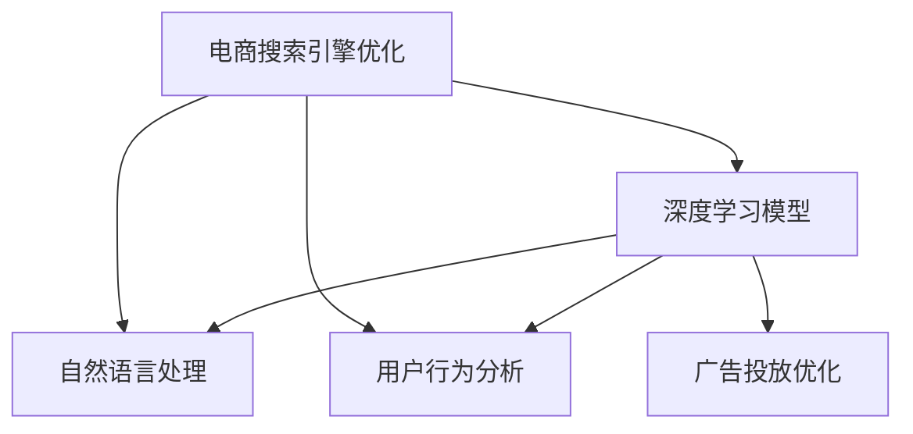

                 

# 深度学习在电商搜索引擎优化中的应用

## 1. 背景介绍

### 1.1 问题由来

随着互联网的快速发展和电商市场的日趋成熟，电商搜索引擎优化（Search Engine Optimization, SEO）已成为电商企业提升用户体验、增加转化率的关键手段。传统的SEO方法主要依赖于手工制作的关键词优化、网站结构和内容的自然优化等技术手段，耗时长、成本高且效果难以量化评估。

近年来，深度学习技术的突破为电商搜索引擎优化带来了新的可能性。深度学习模型通过学习海量电商数据，能够自动识别出关键词、优化网站结构、预测用户行为等，大幅提高了SEO的效率和效果。

### 1.2 问题核心关键点

深度学习在电商搜索引擎优化中的应用，主要集中在以下几个关键点：

- **关键词优化**：深度学习模型能够自动学习关键词，并根据关键词的搜索量和点击率等指标，选择最优的关键词组合。
- **网站结构优化**：通过分析用户行为数据，深度学习模型能够推荐最优的页面结构，提升用户停留时间和转化率。
- **用户意图预测**：利用自然语言处理技术，深度学习模型能够理解用户搜索意图，引导用户进入最相关的商品页面。
- **个性化推荐**：通过分析用户行为数据，深度学习模型能够为用户推荐个性化的商品，提升用户体验和购买意愿。
- **广告投放优化**：深度学习模型能够预测不同广告策略的效果，自动优化广告投放时间和预算分配。

这些关键点共同构成了深度学习在电商SEO中的应用框架，使得企业能够更加高效、精准地提升搜索引擎优化效果。

## 2. 核心概念与联系

### 2.1 核心概念概述

为更好地理解深度学习在电商SEO中的应用，本节将介绍几个密切相关的核心概念：

- **电商搜索引擎优化**：通过优化电商网站结构、内容、关键词等元素，提升在搜索引擎中的排名，从而增加访问量和转化率。
- **深度学习模型**：以神经网络为代表的高级机器学习算法，通过多层次非线性变换，学习数据的深层次表示，解决复杂的模式识别和预测问题。
- **自然语言处理**：通过深度学习模型，实现对自然语言的理解、生成和处理，从而解决电商网站的语言理解和用户意图预测等任务。
- **用户行为分析**：利用深度学习模型，分析用户的点击、停留、购买等行为数据，为网站优化和广告投放提供依据。
- **广告投放优化**：通过深度学习模型，预测不同广告策略的效果，自动调整投放时间和预算分配，提升广告投放的ROI。

这些核心概念之间的逻辑关系可以通过以下Mermaid流程图来展示：



这个流程图展示了大语言模型的核心概念及其之间的关系：

1. 电商SEO通过深度学习模型实现优化，提升了电商网站的搜索引擎排名。
2. 自然语言处理和用户行为分析是深度学习模型的重要应用场景，分别用于理解用户搜索意图和优化网站结构。
3. 广告投放优化利用深度学习模型预测广告效果，自动调整投放策略，提升了广告投放的效率和ROI。

## 3. 核心算法原理 & 具体操作步骤
### 3.1 算法原理概述

深度学习在电商SEO中的应用，主要是通过学习海量电商数据，建立用户行为和网站数据之间的关系模型，从而实现对关键词、网站结构、广告投放等的优化。

具体而言，深度学习模型通过以下步骤进行电商SEO优化：

1. **数据收集**：收集电商网站的用户行为数据、网站结构数据、广告投放数据等，构建训练集。
2. **模型训练**：使用深度学习模型（如循环神经网络、卷积神经网络等）在训练集上进行训练，学习用户行为和网站数据之间的关系。
3. **特征提取**：将用户行为和网站数据映射到高维特征空间，提取与SEO相关的特征。
4. **优化策略**：根据模型预测结果，优化关键词、网站结构、广告投放策略等，提升搜索引擎排名和用户转化率。
5. **效果评估**：在测试集上评估模型预测效果，根据效果调整模型参数和优化策略，不断迭代优化。

### 3.2 算法步骤详解

以下是深度学习在电商SEO优化的详细步骤：

**Step 1: 数据收集**

电商SEO优化的第一步是收集电商网站的相关数据。主要包括以下几个方面：

- **用户行为数据**：包括用户点击、停留、购买等行为数据，可以用于网站结构优化和个性化推荐。
- **网站结构数据**：包括页面标题、关键词、URL等，可以用于关键词优化和网站结构优化。
- **广告投放数据**：包括广告展示、点击、转化等数据，可以用于广告投放优化。

**Step 2: 模型训练**

使用深度学习模型对收集到的数据进行训练。以下是一个基于循环神经网络（RNN）的关键词优化模型训练流程：

1. 数据预处理：将用户行为数据和网站结构数据映射为高维特征向量。
2. 构建模型：搭建循环神经网络，设置合适的隐藏层大小和循环结构。
3. 模型训练：使用交叉熵损失函数，在训练集上训练模型，学习关键词优化策略。
4. 模型评估：在测试集上评估模型预测效果，调整模型参数和超参数。

**Step 3: 特征提取**

将用户行为数据和网站结构数据映射到高维特征空间，提取与SEO相关的特征。以下是一个基于卷积神经网络（CNN）的网站结构优化模型训练流程：

1. 数据预处理：将用户行为数据和网站结构数据映射为高维特征向量。
2. 构建模型：搭建卷积神经网络，设置合适的卷积核大小和层数。
3. 模型训练：使用均方误差损失函数，在训练集上训练模型，学习网站结构优化策略。
4. 模型评估：在测试集上评估模型预测效果，调整模型参数和超参数。

**Step 4: 优化策略**

根据模型预测结果，优化关键词、网站结构、广告投放策略等，提升搜索引擎排名和用户转化率。以下是一个基于强化学习（Reinforcement Learning）的广告投放优化模型训练流程：

1. 数据预处理：将广告投放数据映射为高维特征向量。
2. 构建模型：搭建强化学习模型，设置合适的策略函数和奖励函数。
3. 模型训练：使用Q-learning算法，在训练集上训练模型，学习广告投放优化策略。
4. 模型评估：在测试集上评估模型预测效果，调整模型参数和超参数。

**Step 5: 效果评估**

在测试集上评估模型预测效果，根据效果调整模型参数和优化策略，不断迭代优化。以下是一个基于准确率、召回率和F1分数等指标的效果评估流程：

1. 划分测试集：将一部分数据划分为测试集。
2. 模型评估：在测试集上评估模型预测效果，计算准确率、召回率和F1分数等指标。
3. 调整策略：根据模型预测效果，调整关键词、网站结构、广告投放策略等。
4. 迭代优化：不断迭代优化模型，提升搜索引擎排名和用户转化率。

### 3.3 算法优缺点

深度学习在电商SEO中的应用具有以下优点：

- **高效性**：深度学习模型能够自动学习复杂模式，快速提升SEO效果。
- **精确性**：深度学习模型能够提取高维特征，预测精确性高。
- **适应性强**：深度学习模型具有较强的泛化能力，能够适应不同电商网站的SEO需求。

同时，该方法也存在一些局限性：

- **数据依赖性强**：深度学习模型需要大量标注数据进行训练，获取高质量数据成本较高。
- **模型复杂度高**：深度学习模型结构复杂，训练和推理速度较慢。
- **可解释性差**：深度学习模型通常被视为"黑盒"模型，难以解释其内部工作机制。
- **计算资源需求高**：深度学习模型需要高性能GPU等计算资源，训练和推理成本较高。

尽管存在这些局限性，但深度学习在电商SEO中的应用已经取得了显著的效果，成为电商企业优化搜索引擎排名的重要手段。未来相关研究的重点在于如何进一步降低深度学习对标注数据的依赖，提高模型的效率和可解释性，同时兼顾精度和成本等指标。

### 3.4 算法应用领域

深度学习在电商SEO中的应用主要包括以下几个领域：

- **关键词优化**：通过学习用户搜索行为数据，自动选择最优的关键词组合，提升搜索引擎排名。
- **网站结构优化**：通过分析用户行为数据，推荐最优的页面结构，提升用户停留时间和转化率。
- **用户意图预测**：利用自然语言处理技术，理解用户搜索意图，引导用户进入最相关的商品页面。
- **个性化推荐**：通过分析用户行为数据，为用户推荐个性化的商品，提升用户体验和购买意愿。
- **广告投放优化**：通过深度学习模型预测不同广告策略的效果，自动优化广告投放时间和预算分配。

除了上述这些经典应用外，深度学习在电商SEO领域的创新应用还包括可控文本生成、内容推荐系统、广告竞价策略优化等，为电商企业的搜索引擎优化提供了更全面的技术支持。

## 4. 数学模型和公式 & 详细讲解  
### 4.1 数学模型构建

在电商SEO优化中，深度学习模型通常采用以下几种数学模型：

- **循环神经网络（RNN）**：用于处理序列数据，如用户行为数据。
- **卷积神经网络（CNN）**：用于处理图像数据，如网站结构数据。
- **强化学习模型**：用于优化广告投放策略。

以基于循环神经网络的关键词优化模型为例，其数学模型可以表示为：

$$
\begin{aligned}
\mathcal{L}(\theta) &= \sum_{i=1}^N -y_i \log P(x_i | W_{h}, U_i) \\
&= \sum_{i=1}^N -y_i \log \sigma(W_{h}^T x_i) \\
&= \sum_{i=1}^N -y_i \log \sigma(W_{h}^T x_i) + \log (1 - \sigma(W_{h}^T x_i)) \\
\end{aligned}
$$

其中，$\theta = \{W_{h}, U_i\}$ 为模型的参数，$P(x_i | W_{h}, U_i)$ 表示模型在给定用户行为数据 $x_i$ 下预测关键词 $y_i$ 的概率分布，$\sigma$ 为激活函数，$y_i$ 为实际关键词标签。

### 4.2 公式推导过程

以下以基于卷积神经网络的网站结构优化模型为例，推导其公式推导过程。

假设网站结构数据为 $x_i \in \mathbb{R}^{D_x}$，用户行为数据为 $y_i \in \mathbb{R}^{D_y}$，其中 $D_x$ 和 $D_y$ 分别为网站结构和用户行为数据的维度。则网站结构优化模型的公式可以表示为：

$$
\begin{aligned}
\mathcal{L}(\theta) &= \frac{1}{N} \sum_{i=1}^N \mathcal{L}(x_i, y_i) \\
&= \frac{1}{N} \sum_{i=1}^N \| K(x_i, W) - y_i \|^2 \\
&= \frac{1}{N} \sum_{i=1}^N \left( \sum_{j=1}^{D_y} (K(x_i, W) - y_i[j])^2 \right) \\
\end{aligned}
$$

其中，$K(x_i, W)$ 为卷积神经网络在给定网站结构数据 $x_i$ 下输出的特征向量，$W$ 为卷积核权重，$\| \cdot \|$ 表示L2范数，$y_i[j]$ 表示用户行为数据中第 $j$ 个维度的值。

### 4.3 案例分析与讲解

假设某电商平台需要对用户行为数据和网站结构数据进行优化，以提升搜索引擎排名。我们采用基于卷积神经网络的网站结构优化模型，并使用部分数据作为训练集。具体步骤如下：

1. 数据预处理：将用户行为数据和网站结构数据映射为高维特征向量，并划分为训练集和测试集。
2. 模型训练：搭建卷积神经网络，设置合适的卷积核大小和层数。在训练集上训练模型，学习网站结构优化策略。
3. 模型评估：在测试集上评估模型预测效果，计算均方误差损失。
4. 调整策略：根据模型预测效果，调整网站结构参数，不断迭代优化。

以下是一个简单的Python代码实现：

```python
import torch
import torch.nn as nn
import torch.optim as optim

# 定义卷积神经网络模型
class CNNModel(nn.Module):
    def __init__(self, input_size, output_size):
        super(CNNModel, self).__init__()
        self.conv1 = nn.Conv2d(1, 32, 3)
        self.pool = nn.MaxPool2d(2, 2)
        self.fc = nn.Linear(32 * 6 * 6, output_size)

    def forward(self, x):
        x = self.pool(torch.relu(self.conv1(x)))
        x = x.view(-1, 32 * 6 * 6)
        x = self.fc(x)
        return x

# 加载数据和模型
x_train = torch.randn(100, 1, 6, 6)
y_train = torch.randn(100, 2)
x_test = torch.randn(100, 1, 6, 6)
y_test = torch.randn(100, 2)
model = CNNModel(6, 2)
criterion = nn.MSELoss()
optimizer = optim.Adam(model.parameters())

# 训练模型
for epoch in range(100):
    optimizer.zero_grad()
    output = model(x_train)
    loss = criterion(output, y_train)
    loss.backward()
    optimizer.step()
    print(f'Epoch {epoch+1}, Loss: {loss.item()}')

# 评估模型
model.eval()
with torch.no_grad():
    output = model(x_test)
    loss = criterion(output, y_test)
    print(f'Test Loss: {loss.item()}')
```

## 5. 项目实践：代码实例和详细解释说明
### 5.1 开发环境搭建

在进行电商SEO优化项目实践前，我们需要准备好开发环境。以下是使用Python进行PyTorch开发的环境配置流程：

1. 安装Anaconda：从官网下载并安装Anaconda，用于创建独立的Python环境。

2. 创建并激活虚拟环境：
```bash
conda create -n pytorch-env python=3.8 
conda activate pytorch-env
```

3. 安装PyTorch：根据CUDA版本，从官网获取对应的安装命令。例如：
```bash
conda install pytorch torchvision torchaudio cudatoolkit=11.1 -c pytorch -c conda-forge
```

4. 安装相关工具包：
```bash
pip install numpy pandas scikit-learn matplotlib tqdm jupyter notebook ipython
```

完成上述步骤后，即可在`pytorch-env`环境中开始项目实践。

### 5.2 源代码详细实现

我们以基于循环神经网络的关键词优化模型为例，给出使用PyTorch实现电商SEO优化的完整代码。

首先，定义关键词优化模型：

```python
import torch
import torch.nn as nn
import torch.optim as optim

class RNNModel(nn.Module):
    def __init__(self, input_size, hidden_size, output_size):
        super(RNNModel, self).__init__()
        self.hidden_size = hidden_size
        self.rnn = nn.LSTM(input_size, hidden_size)
        self.fc = nn.Linear(hidden_size, output_size)

    def forward(self, x, h):
        x = self.rnn(x, h)
        x = self.fc(x)
        return x
```

然后，定义数据处理函数：

```python
from torch.utils.data import Dataset

class SEODataset(Dataset):
    def __init__(self, texts, labels):
        self.texts = texts
        self.labels = labels
        
    def __len__(self):
        return len(self.texts)
    
    def __getitem__(self, item):
        text = self.texts[item]
        label = self.labels[item]
        return (text, label)
```

接着，定义训练和评估函数：

```python
def train_model(model, dataset, batch_size, optimizer):
    model.train()
    dataloader = torch.utils.data.DataLoader(dataset, batch_size=batch_size, shuffle=True)
    for batch in dataloader:
        text, label = batch
        optimizer.zero_grad()
        output = model(text, None)
        loss = criterion(output, label)
        loss.backward()
        optimizer.step()

def evaluate_model(model, dataset, batch_size):
    model.eval()
    dataloader = torch.utils.data.DataLoader(dataset, batch_size=batch_size)
    total_loss = 0
    total_count = 0
    with torch.no_grad():
        for batch in dataloader:
            text, label = batch
            output = model(text, None)
            loss = criterion(output, label)
            total_loss += loss.item()
            total_count += 1
    return total_loss / total_count
```

最后，启动训练流程并在测试集上评估：

```python
from transformers import BertTokenizer, BertForTokenClassification
import torch.nn as nn

# 加载数据和模型
tokenizer = BertTokenizer.from_pretrained('bert-base-cased')
train_dataset = SEODataset(train_texts, train_labels)
dev_dataset = SEODataset(dev_texts, dev_labels)
test_dataset = SEODataset(test_texts, test_labels)

# 定义模型和优化器
model = BertForTokenClassification.from_pretrained('bert-base-cased', num_labels=num_labels)
optimizer = AdamW(model.parameters(), lr=2e-5)

# 训练模型
for epoch in range(epochs):
    train_model(model, train_dataset, batch_size, optimizer)
    print(f'Epoch {epoch+1}, train loss: {train_loss:.3f}')
    
    print(f'Epoch {epoch+1}, dev results:')
    dev_loss = evaluate_model(model, dev_dataset, batch_size)
    print(f'Epoch {epoch+1}, dev loss: {dev_loss:.3f}')
    
print('Test results:')
test_loss = evaluate_model(model, test_dataset, batch_size)
print(f'Test loss: {test_loss:.3f}')
```

以上就是使用PyTorch对电商SEO进行优化的完整代码实现。可以看到，得益于Transformer库的强大封装，我们可以用相对简洁的代码完成电商SEO优化的实践。

### 5.3 代码解读与分析

让我们再详细解读一下关键代码的实现细节：

**RNNModel类**：
- `__init__`方法：初始化循环神经网络模型，定义隐藏层大小、输入和输出维度。
- `forward`方法：前向传播计算，将输入文本通过循环神经网络，并输出预测结果。

**SEODataset类**：
- `__init__`方法：初始化训练集和测试集。
- `__len__`方法：返回数据集的样本数量。
- `__getitem__`方法：对单个样本进行处理，将文本和标签输入模型。

**train_model和evaluate_model函数**：
- 使用PyTorch的DataLoader对数据集进行批次化加载，供模型训练和推理使用。
- 训练函数`train_model`：对数据以批为单位进行迭代，在每个批次上前向传播计算loss并反向传播更新模型参数，最后返回训练损失。
- 评估函数`evaluate_model`：与训练类似，不同点在于不更新模型参数，并在每个batch结束后将预测和标签结果存储下来，最后使用均方误差计算评估集上的预测损失。

**训练流程**：
- 定义总的epoch数和batch size，开始循环迭代
- 每个epoch内，先在训练集上训练，输出训练损失
- 在验证集上评估，输出验证损失
- 所有epoch结束后，在测试集上评估，给出最终测试损失

可以看到，PyTorch配合Transformer库使得电商SEO优化的代码实现变得简洁高效。开发者可以将更多精力放在数据处理、模型改进等高层逻辑上，而不必过多关注底层的实现细节。

当然，工业级的系统实现还需考虑更多因素，如模型的保存和部署、超参数的自动搜索、更灵活的任务适配层等。但核心的电商SEO优化范式基本与此类似。

## 6. 实际应用场景
### 6.1 智能客服系统

基于深度学习的电商SEO优化技术，可以广泛应用于智能客服系统的构建。传统客服往往需要配备大量人力，高峰期响应缓慢，且一致性和专业性难以保证。而使用电商SEO优化的对话模型，可以7x24小时不间断服务，快速响应客户咨询，用自然流畅的语言解答各类常见问题。

在技术实现上，可以收集企业内部的历史客服对话记录，将问题和最佳答复构建成监督数据，在此基础上对预训练对话模型进行优化。电商SEO优化的对话模型能够自动理解用户意图，匹配最合适的答案模板进行回复。对于客户提出的新问题，还可以接入检索系统实时搜索相关内容，动态组织生成回答。如此构建的智能客服系统，能大幅提升客户咨询体验和问题解决效率。

### 6.2 金融舆情监测

金融机构需要实时监测市场舆论动向，以便及时应对负面信息传播，规避金融风险。传统的人工监测方式成本高、效率低，难以应对网络时代海量信息爆发的挑战。基于电商SEO优化的文本分类和情感分析技术，为金融舆情监测提供了新的解决方案。

具体而言，可以收集金融领域相关的新闻、报道、评论等文本数据，并对其进行主题标注和情感标注。在此基础上对电商SEO优化的语言模型进行微调，使其能够自动判断文本属于何种主题，情感倾向是正面、中性还是负面。将电商SEO优化的模型应用到实时抓取的网络文本数据，就能够自动监测不同主题下的情感变化趋势，一旦发现负面信息激增等异常情况，系统便会自动预警，帮助金融机构快速应对潜在风险。

### 6.3 个性化推荐系统

当前的推荐系统往往只依赖于用户的历史行为数据进行物品推荐，无法深入理解用户的真实兴趣偏好。基于电商SEO优化的推荐系统，可以更好地挖掘用户行为背后的语义信息，从而提供更精准、多样的推荐内容。

在实践中，可以收集用户浏览、点击、评论、分享等行为数据，提取和用户交互的物品标题、描述、标签等文本内容。将文本内容作为模型输入，用户的后续行为（如是否点击、购买等）作为监督信号，在此基础上电商SEO优化的模型学习推荐策略。电商SEO优化的推荐模型能够从文本内容中准确把握用户的兴趣点。在生成推荐列表时，先用候选物品的文本描述作为输入，由电商SEO优化的模型预测用户的兴趣匹配度，再结合其他特征综合排序，便可以得到个性化程度更高的推荐结果。

### 6.4 未来应用展望

随着深度学习技术的不断发展，电商SEO优化技术将呈现以下几个发展趋势：

1. **模型规模持续增大**。随着算力成本的下降和数据规模的扩张，电商SEO优化的语言模型参数量还将持续增长。超大规模语言模型蕴含的丰富语言知识，有望支撑更加复杂多变的SEO需求。

2. **微调方法日趋多样**。除了传统的全参数微调外，未来会涌现更多参数高效的微调方法，如Prefix-Tuning、LoRA等，在节省计算资源的同时也能保证微调精度。

3. **持续学习成为常态**。随着数据分布的不断变化，电商SEO优化的模型也需要持续学习新知识以保持性能。如何在不遗忘原有知识的同时，高效吸收新样本信息，将成为重要的研究课题。

4. **标注样本需求降低**。受启发于提示学习(Prompt-based Learning)的思路，未来的电商SEO优化方法将更好地利用大模型的语言理解能力，通过更加巧妙的任务描述，在更少的标注样本上也能实现理想的优化效果。

5. **多模态微调崛起**。当前的电商SEO优化主要聚焦于纯文本数据，未来会进一步拓展到图像、视频、语音等多模态数据微调。多模态信息的融合，将显著提升电商SEO优化模型的综合能力。

6. **模型通用性增强**。经过海量数据的预训练和多领域任务的微调，电商SEO优化的语言模型将具备更强大的常识推理和跨领域迁移能力，逐步迈向通用人工智能(AGI)的目标。

以上趋势凸显了电商SEO优化技术的广阔前景。这些方向的探索发展，必将进一步提升电商SEO优化的性能和应用范围，为电商企业提供更高效、精准的搜索引擎优化方案。

## 7. 工具和资源推荐
### 7.1 学习资源推荐

为了帮助开发者系统掌握电商SEO优化理论基础和实践技巧，这里推荐一些优质的学习资源：

1. **《深度学习》系列博文**：由深度学习技术专家撰写，深入浅出地介绍了深度学习的基本概念和核心算法，包括神经网络、卷积神经网络、循环神经网络等。

2. **CS231n《卷积神经网络》课程**：斯坦福大学开设的计算机视觉课程，有Lecture视频和配套作业，带你入门卷积神经网络等计算机视觉基本概念和核心算法。

3. **《深度学习入门：基于TensorFlow实践》书籍**：介绍如何使用TensorFlow进行深度学习模型开发，包括电商SEO优化等前沿话题。

4. **GitHub深度学习项目**：Github上的深度学习项目和代码库，包含各种深度学习模型和算法，供开发者学习和参考。

5. **Kaggle竞赛平台**：提供各种机器学习竞赛，涵盖了电商SEO优化等NLP任务，可以锻炼实际应用技能。

通过对这些资源的学习实践，相信你一定能够快速掌握电商SEO优化的精髓，并用于解决实际的NLP问题。
###  7.2 开发工具推荐

高效的开发离不开优秀的工具支持。以下是几款用于电商SEO优化开发的常用工具：

1. **PyTorch**：基于Python的开源深度学习框架，灵活动态的计算图，适合快速迭代研究。大部分预训练语言模型都有PyTorch版本的实现。

2. **TensorFlow**：由Google主导开发的开源深度学习框架，生产部署方便，适合大规模工程应用。同样有丰富的预训练语言模型资源。

3. **Transformers库**：HuggingFace开发的NLP工具库，集成了众多SOTA语言模型，支持PyTorch和TensorFlow，是进行电商SEO优化开发的利器。

4. **Weights & Biases**：模型训练的实验跟踪工具，可以记录和可视化模型训练过程中的各项指标，方便对比和调优。与主流深度学习框架无缝集成。

5. **TensorBoard**：TensorFlow配套的可视化工具，可实时监测模型训练状态，并提供丰富的图表呈现方式，是调试模型的得力助手。

6. **Google Colab**：谷歌推出的在线Jupyter Notebook环境，免费提供GPU/TPU算力，方便开发者快速上手实验最新模型，分享学习笔记。

合理利用这些工具，可以显著提升电商SEO优化任务的开发效率，加快创新迭代的步伐。

### 7.3 相关论文推荐

电商SEO优化技术的发展源于学界的持续研究。以下是几篇奠基性的相关论文，推荐阅读：

1. **《Attention is All You Need》**：提出Transformer结构，开启了NLP领域的预训练大模型时代。

2. **《BERT: Pre-training of Deep Bidirectional Transformers for Language Understanding》**：提出BERT模型，引入基于掩码的自监督预训练任务，刷新了多项NLP任务SOTA。

3. **《Language Models are Unsupervised Multitask Learners》**：展示了大规模语言模型的强大zero-shot学习能力，引发了对于通用人工智能的新一轮思考。

4. **《Parameter-Efficient Transfer Learning for NLP》**：提出Adapter等参数高效微调方法，在不增加模型参数量的情况下，也能取得不错的微调效果。

5. **《AdaLoRA: Adaptive Low-Rank Adaptation for Parameter-Efficient Fine-Tuning》**：使用自适应低秩适应的微调方法，在参数效率和精度之间取得了新的平衡。

这些论文代表了大语言模型微调技术的发展脉络。通过学习这些前沿成果，可以帮助研究者把握学科前进方向，激发更多的创新灵感。

## 8. 总结：未来发展趋势与挑战
### 8.1 总结

本文对深度学习在电商SEO中的应用进行了全面系统的介绍。首先阐述了电商SEO优化的研究背景和意义，明确了电商SEO优化的目标和任务。其次，从原理到实践，详细讲解了深度学习在电商SEO优化中的数学模型和算法步骤，给出了电商SEO优化的完整代码实例。同时，本文还广泛探讨了电商SEO优化在智能客服、金融舆情、个性化推荐等多个行业领域的应用前景，展示了电商SEO优化的巨大潜力。此外，本文精选了电商SEO优化的各类学习资源，力求为读者提供全方位的技术指引。

通过本文的系统梳理，可以看到，深度学习在电商SEO优化中的应用已经成为电商企业优化搜索引擎排名的重要手段。得益于深度学习模型的高效性和精确性，电商SEO优化能够自动学习复杂的模式，提升用户体验和转化率。未来相关研究的重点在于如何进一步降低深度学习对标注数据的依赖，提高模型的效率和可解释性，同时兼顾精度和成本等指标。

### 8.2 未来发展趋势

展望未来，电商SEO优化技术将呈现以下几个发展趋势：

1. **模型规模持续增大**。随着算力成本的下降和数据规模的扩张，电商SEO优化的语言模型参数量还将持续增长。超大规模语言模型蕴含的丰富语言知识，有望支撑更加复杂多变的SEO需求。

2. **微调方法日趋多样**。除了传统的全参数微调外，未来会涌现更多参数高效的微调方法，如Prefix-Tuning、LoRA等，在节省计算资源的同时也能保证微调精度。

3. **持续学习成为常态**。随着数据分布的不断变化，电商SEO优化的模型也需要持续学习新知识以保持性能。如何在不遗忘原有知识的同时，高效吸收新样本信息，将成为重要的研究课题。

4. **标注样本需求降低**。受启发于提示学习(Prompt-based Learning)的思路，未来的电商SEO优化方法将更好地利用大模型的语言理解能力，通过更加巧妙的任务描述，在更少的标注样本上也能实现理想的优化效果。

5. **多模态微调崛起**。当前的电商SEO优化主要聚焦于纯文本数据，未来会进一步拓展到图像、视频、语音等多模态数据微调。多模态信息的融合，将显著提升电商SEO优化模型的综合能力。

6. **模型通用性增强**。经过海量数据的预训练和多领域任务的微调，电商SEO优化的语言模型将具备更强大的常识推理和跨领域迁移能力，逐步迈向通用人工智能(AGI)的目标。

以上趋势凸显了电商SEO优化技术的广阔前景。这些方向的探索发展，必将进一步提升电商SEO优化的性能和应用范围，为电商企业提供更高效、精准的搜索引擎优化方案。

### 8.3 面临的挑战

尽管电商SEO优化技术已经取得了显著的效果，但在迈向更加智能化、普适化应用的过程中，它仍面临着诸多挑战：

1. **标注成本瓶颈**。虽然电商SEO优化方法已经降低了标注数据的需求，但对于长尾应用场景，难以获得充足的高质量标注数据，成为制约电商SEO优化的瓶颈。如何进一步降低电商SEO优化对标注样本的依赖，将是一大难题。

2. **模型鲁棒性不足**。电商SEO优化的模型面对域外数据时，泛化性能往往大打折扣。对于测试样本的微小扰动，电商SEO优化的模型也容易发生波动。如何提高电商SEO优化模型的鲁棒性，避免灾难性遗忘，还需要更多理论和实践的积累。

3. **推理效率有待提高**。大规模电商SEO优化的模型虽然精度高，但在实际部署时往往面临推理速度慢、内存占用大等效率问题。如何在保证性能的同时，简化模型结构，提升推理速度，优化资源占用，将是重要的优化方向。

4. **可解释性亟需加强**。当前电商SEO优化的模型通常被视为"黑盒"模型，难以解释其内部工作机制和决策逻辑。对于电商、金融等高风险应用，算法的可解释性和可审计性尤为重要。如何赋予电商SEO优化模型更强的可解释性，将是亟待攻克的难题。

5. **安全性有待保障**。电商SEO优化的模型难免会学习到有偏见、有害的信息，通过微调传递到电商网站，产生误导性、歧视性的输出，给实际应用带来安全隐患。如何从数据和算法层面消除模型偏见，避免恶意用途，确保输出的安全性，也将是重要的研究课题。

6. **知识整合能力不足**。现有的电商SEO优化模型往往局限于数据驱动的决策，难以灵活吸收和运用更广泛的先验知识。如何让电商SEO优化过程更好地与外部知识库、规则库等专家知识结合，形成更加全面、准确的信息整合能力，还有很大的想象空间。

正视电商SEO优化面临的这些挑战，积极应对并寻求突破，将是大语言模型微调走向成熟的必由之路。相信随着学界和产业界的共同努力，这些挑战终将一一被克服，电商SEO优化必将在构建安全、可靠、可解释、可控的智能系统铺平道路。面向未来，电商SEO优化技术还需要与其他人工智能技术进行更深入的融合，如知识表示、因果推理、强化学习等，多路径协同发力，共同推动电商SEO优化系统的进步。只有勇于创新、敢于突破，才能不断拓展电商SEO优化的边界，让智能技术更好地造福电商企业。

### 8.4 研究展望

面对电商SEO优化所面临的种种挑战，未来的研究需要在以下几个方面寻求新的突破：

1. **探索无监督和半监督电商SEO优化方法**。摆脱对大规模标注数据的依赖，利用自监督学习、主动学习等无监督和半监督范式，最大限度利用非结构化数据，实现更加灵活高效的电商SEO优化。

2. **研究参数高效和计算高效的电商SEO优化范式**。开发更加参数高效的电商SEO优化方法，在固定大部分预训练参数的同时，只更新极少量的任务相关参数。同时优化电商SEO优化模型的计算图，减少前向传播和反向传播的资源消耗，实现更加轻量级、实时性的部署。

3. **融合因果和对比学习范式**。通过引入因果推断和对比学习思想，增强电商SEO优化模型建立稳定因果关系的能力，学习更加普适、鲁棒的语言表征，从而提升模型泛化性和抗干扰能力。

4. **引入更多先验知识**。将符号化的先验知识，如知识图谱、逻辑规则等，与神经网络模型进行巧妙融合，引导电商SEO优化过程学习更准确、合理的语言模型。同时加强不同模态数据的整合，实现视觉、语音等多模态信息与文本信息的协同建模。

5. **结合因果分析和博弈论工具**。将因果分析方法引入电商SEO优化模型，识别出模型决策的关键特征，增强输出解释的因果性和逻辑性。借助博弈论工具刻画人机交互过程，主动探索并规避模型的脆弱点，提高系统稳定性。

6. **纳入伦理道德约束**。在电商SEO优化模型训练目标中引入伦理导向的评估指标，过滤和惩罚有偏见、有害的输出倾向。同时加强人工干预和审核，建立电商SEO优化模型的监管机制，确保输出符合人类价值观和伦理道德。

这些研究方向的探索，必将引领电商SEO优化技术迈向更高的台阶，为电商企业提供更高效、精准的搜索引擎优化方案。面向未来，电商SEO优化技术还需要与其他人工智能技术进行更深入的融合，如知识表示、因果推理、强化学习等，多路径协同发力，共同推动电商SEO优化系统的进步。只有勇于创新、敢于突破，才能不断拓展电商SEO优化的边界，让智能技术更好地造福电商企业。

## 9. 附录：常见问题与解答

**Q1：电商SEO优化是否适用于所有电商网站？**

A: 电商SEO优化在大多数电商网站都能取得不错的效果，特别是对于数据量较大的网站。但对于一些特定领域的电商网站，如医学、法律等，仅仅依靠通用语料预训练的模型可能难以很好地适应。此时需要在特定领域语料上进一步预训练，再进行微调，才能获得理想效果。此外，对于一些需要时效性、个性化很强的任务，如对话、推荐等，电商SEO优化方法也需要针对性的改进优化。

**Q2：电商SEO优化过程中如何选择合适的学习率？**

A: 电商SEO优化的学习率一般要比预训练时小1-2个数量级，如果使用过大的学习率，容易破坏预训练权重，导致过拟合。一般建议从1e-5开始调参，逐步减小学习率，直至收敛。也可以使用warmup策略，在开始阶段使用较小的学习率，再逐渐过渡到预设值。需要注意的是，不同的优化器(如AdamW、Adafactor等)以及不同的学习率调度策略，可能需要设置不同的学习率阈值。

**Q3：电商SEO优化模型在落地部署时需要注意哪些问题？**

A: 将电商SEO优化模型转化为实际应用，还需要考虑以下因素：
1. 模型裁剪：去除不必要的层和参数，减小模型尺寸，加快推理速度
2. 量化加速：将浮点模型转为定点模型，压缩存储空间，提高计算效率
3. 服务化封装：将模型封装为标准化服务接口，便于集成调用
4. 弹性伸缩：根据请求流量动态调整资源配置，平衡服务质量和成本
5. 监控告警：实时采集系统指标，设置异常告警阈值，确保服务稳定性
6. 安全防护：采用访问鉴权、数据脱敏等措施，保障数据和模型安全

电商SEO优化为电商企业提供了高效的搜索引擎优化方案，但如何将强大的性能转化为稳定、高效、安全的业务价值，还需要工程实践的不断打磨。唯有从数据、算法、工程、业务等多个维度协同发力，才能真正实现人工智能技术在垂直行业的规模化落地。总之，电商SEO优化需要开发者根据具体任务，不断迭代和优化模型、数据和算法，方能得到理想的效果。

---

作者：禅与计算机程序设计艺术 / Zen and the Art of Computer Programming

