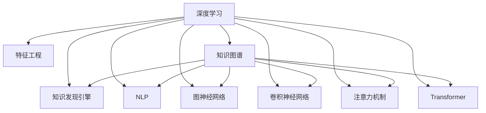

                 

# 深度学习在知识发现引擎中的应用

> 关键词：深度学习,知识发现引擎,特征工程,自然语言处理,NLP,图神经网络,GNN,卷积神经网络,CNN,注意力机制,Transformer,知识图谱,KG,推理算法

## 1. 背景介绍

### 1.1 问题由来
近年来，随着大数据技术的迅猛发展和互联网的普及，海量数据已经成为各行各业的重要资源。然而，数据量虽然庞大，但其中的知识价值却难以充分挖掘和利用。传统的数据分析方法，如统计学、模式识别等，往往只能提取数据表面的信息，无法深入理解数据的内在规律和关联关系。为了解决这个问题，知识发现引擎(Knowledge Discovery Engine, KDE)应运而生。

知识发现引擎是一类旨在从大规模数据中挖掘有价值知识的软件系统。它通过复杂的算法和模型，从数据中识别出模式、规律、关系等，帮助人们更好地理解数据，作出决策，提升业务水平。深度学习作为一种强大的机器学习方法，能够通过学习数据的复杂非线性特征，提取出更有价值、更深入的知识。因此，在知识发现引擎中的应用愈发广泛。

## 2. 核心概念与联系

### 2.1 核心概念概述

为更好地理解深度学习在知识发现引擎中的应用，本节将介绍几个密切相关的核心概念：

- **深度学习(Deep Learning)**：一类通过多层次的神经网络模型学习数据表示的机器学习方法。深度学习能够自动提取数据的高级特征，尤其在图像、语音、文本等领域取得了显著成效。

- **知识发现引擎(Knowledge Discovery Engine, KDE)**：通过复杂算法从大规模数据中自动提取、发现并验证知识的软件系统。KDE广泛应用于商业智能、情报分析、生物信息等领域，为决策制定提供有力支持。

- **特征工程(Feature Engineering)**：通过人工提取、构造和变换特征，提升模型的泛化能力和预测精度。特征工程是知识发现引擎中一个非常重要的环节，对于数据预处理和模型训练至关重要。

- **自然语言处理(Natural Language Processing, NLP)**：研究如何使计算机理解和处理人类语言的技术。NLP在知识发现中起到重要作用，能够从文本数据中抽取实体、关系等关键信息。

- **图神经网络(Graph Neural Network, GNN)**：一类专门用于处理图结构数据的神经网络，能够有效处理节点、边、图等多种类型的网络数据，广泛应用于社交网络、知识图谱等领域。

- **卷积神经网络(Convolutional Neural Network, CNN)**：一类专门处理图像数据的神经网络，能够自动学习图像的局部特征，广泛应用于图像识别、图像分割等领域。

- **注意力机制(Attention Mechanism)**：一种用于提高深度学习模型注意力的机制，能够动态地对输入数据进行加权处理，提升模型的感知能力。

- **Transformer**：一种特殊的神经网络结构，通过自注意力机制实现高效的序列建模，广泛应用于机器翻译、文本生成等领域。

- **知识图谱(Knowledge Graph, KG)**：一种结构化的知识表示方式，将实体和关系映射成图的结构，便于机器处理和推理。知识图谱在知识发现中起到桥梁作用，将非结构化数据转化为结构化信息。

这些核心概念之间的逻辑关系可以通过以下Mermaid流程图来展示：



这个流程图展示深度学习在知识发现引擎中的应用流程：

1. 深度学习模型从数据中提取高级特征。
2. 特征工程提升模型的泛化能力。
3. NLP处理文本数据，提取实体、关系等关键信息。
4. GNN处理图结构数据，提取节点、边、图等多种类型的网络信息。
5. CNN处理图像数据，提取局部特征。
6. 注意力机制增强模型的感知能力。
7. Transformer模型用于序列建模，解决长距离依赖问题。
8. 知识图谱将非结构化数据转化为结构化信息，便于机器处理和推理。

这些核心概念共同构成了深度学习在知识发现引擎中的知识发现流程，使得机器能够从数据中提取更深层次的知识。

## 3. 核心算法原理 & 具体操作步骤
### 3.1 算法原理概述

深度学习在知识发现引擎中的应用，主要分为三个步骤：数据预处理、特征提取和知识推理。

1. **数据预处理**：包括数据清洗、归一化、特征选择等，将原始数据转化为适合深度学习模型处理的形式。
2. **特征提取**：利用深度学习模型自动学习数据的高级特征，提升模型的泛化能力和预测精度。
3. **知识推理**：利用知识图谱、注意力机制等，进行推理计算，提取更深层次的知识。

### 3.2 算法步骤详解

基于深度学习的知识发现引擎一般包括以下几个关键步骤：

**Step 1: 数据准备**
- 收集、清洗和预处理数据，确保数据质量和一致性。
- 将数据划分为训练集、验证集和测试集。

**Step 2: 特征提取**
- 选择合适的深度学习模型，如CNN、RNN、GNN等，进行特征提取。
- 对文本、图像、图结构等不同类型的特征，使用不同的提取方法。
- 应用注意力机制、池化操作等技术，提升特征提取的泛化能力和精度。

**Step 3: 模型训练与调优**
- 在训练集上训练深度学习模型，通过前向传播和反向传播更新模型参数。
- 应用正则化技术，如L2正则、Dropout等，防止过拟合。
- 使用Adam、SGD等优化算法，优化模型损失函数。
- 在验证集上评估模型性能，调整超参数。

**Step 4: 知识推理与验证**
- 利用知识图谱等结构化信息，进行推理计算，提取更深层次的知识。
- 在测试集上验证推理结果的准确性和鲁棒性。
- 应用对抗训练、数据增强等技术，提升模型的鲁棒性和泛化能力。

**Step 5: 模型部署与应用**
- 将训练好的模型部署到生产环境中，进行实时推理。
- 监控模型性能，收集反馈，持续优化模型。
- 将知识发现结果应用于实际业务，提升决策水平。

以上是深度学习在知识发现引擎中的基本流程。在实际应用中，还需要针对具体任务和数据特点，对各步骤进行优化和改进。

### 3.3 算法优缺点

基于深度学习的知识发现引擎具有以下优点：
1. 自动提取高级特征。深度学习能够自动从数据中提取复杂的非线性特征，提升模型的泛化能力。
2. 鲁棒性高。通过使用对抗训练、正则化等技术，提升模型的鲁棒性，避免过拟合。
3. 精度高。深度学习模型的精度和性能通常优于传统的统计学方法。
4. 应用广泛。深度学习在图像、文本、语音、图等多种数据类型上均取得了显著成果。

同时，该方法也存在一些局限性：
1. 数据依赖性强。深度学习模型需要大量的标注数据进行训练，数据依赖性较强。
2. 计算资源消耗大。深度学习模型的计算复杂度高，对计算资源消耗较大。
3. 可解释性差。深度学习模型通常是"黑盒"系统，难以解释其内部决策过程。
4. 易受噪声影响。深度学习模型对输入数据的噪声敏感，需要额外的数据清洗和预处理。

尽管存在这些局限性，但深度学习在知识发现中的应用仍然具有巨大潜力。未来研究需要关注如何降低数据依赖性，提高模型可解释性，优化计算资源消耗，提高模型鲁棒性等方面。

### 3.4 算法应用领域

深度学习在知识发现引擎中的应用领域非常广泛，涵盖了各个行业。以下是几个典型应用：

**1. 商业智能(Business Intelligence, BI)**
在商业智能中，深度学习可以用于用户行为分析、销售预测、市场分析等。通过对客户行为数据的深度学习，发现用户偏好、消费习惯等关键信息，从而提升营销效果和用户体验。

**2. 金融风控(Financial Risk Control)**
金融风控中，深度学习可以用于信用评分、欺诈检测、风险评估等。通过对交易数据的深度学习，发现异常交易行为和风险信号，提前预警潜在的金融风险。

**3. 医疗健康(Medical Health)**
在医疗健康领域，深度学习可以用于疾病诊断、治疗方案推荐、健康监测等。通过对患者数据的深度学习，发现疾病特征和治疗模式，提升诊疗效果和患者体验。

**4. 社交网络(Social Network)**
社交网络中，深度学习可以用于用户情感分析、社区发现、信息推荐等。通过对社交数据的深度学习，发现用户兴趣和社交关系，提升信息质量和社区互动。

**5. 智能制造(Smart Manufacturing)**
智能制造中，深度学习可以用于设备故障预测、质量控制、供应链优化等。通过对生产数据的深度学习，发现生产模式和故障信号，提升生产效率和设备可靠性。

以上仅是深度学习在知识发现中的应用的一部分，未来随着技术的不断进步，相信深度学习将在更多的领域发挥重要作用，为各行各业带来深远影响。

## 4. 数学模型和公式 & 详细讲解  
### 4.1 数学模型构建

深度学习在知识发现引擎中的应用，涉及多类型的数学模型。本节将对几种典型模型进行详细讲解。

**1. 卷积神经网络(CNN)**
卷积神经网络主要用于图像数据处理。其基本结构包括卷积层、池化层、全连接层等。以图像识别任务为例，CNN模型可以通过多层次卷积操作，自动学习图像的局部特征。

数学模型构建如下：

设输入图像 $X \in \mathbb{R}^{H\times W \times C}$，其中 $H$、$W$、$C$ 分别表示图像的高度、宽度和通道数。卷积层中的卷积核 $K \in \mathbb{R}^{k \times k \times C \times r}$，其中 $k$ 表示卷积核大小，$r$ 表示卷积核通道数。卷积操作如下：

$$
Y = f(X * K)
$$

其中 $*$ 表示卷积操作，$f$ 表示激活函数，如ReLU。池化操作可以将卷积层的输出 $Y$ 降维，常见的方法有最大池化、平均池化等。

**2. 长短时记忆网络(LSTM)**
长短时记忆网络主要用于序列数据的建模，如文本、音频等。LSTM网络通过引入门控机制，能够有效解决长序列的梯度消失和梯度爆炸问题。以文本分类任务为例，LSTM网络可以自动学习文本的语义表示。

数学模型构建如下：

设输入序列 $X \in \mathbb{R}^{T\times D}$，其中 $T$ 表示序列长度，$D$ 表示特征维度。LSTM网络包括输入门、遗忘门、输出门等，其结构如图1所示。LSTM的数学表达式如下：

$$
\begin{align*}
i_t &= \sigma(W_i [X_t; h_{t-1}]) \\
f_t &= \sigma(W_f [X_t; h_{t-1}]) \\
o_t &= \sigma(W_o [X_t; h_{t-1}]) \\
g_t &= \tanh(W_g [X_t; h_{t-1}]) \\
c_t &= c_{t-1} \odot f_t + i_t \odot g_t \\
h_t &= o_t \odot \tanh(c_t)
\end{align*}
$$

其中 $\sigma$ 表示sigmoid函数，$\tanh$ 表示tanh函数，$\odot$ 表示逐元素相乘。

**3. 图神经网络(GNN)**
图神经网络主要用于图结构数据的建模，如图谱、社交网络等。GNN网络通过图卷积操作，自动学习图结构数据的表示。以节点分类任务为例，GNN网络可以自动学习节点的分类表示。

数学模型构建如下：

设输入图 $G=(V,E)$，其中 $V$ 表示节点集合，$E$ 表示边集合。图卷积操作可以通过邻居聚合函数实现，常见的方法有Graph Convolutional Network (GCN)等。GCN的数学表达式如下：

$$
h_t^{(l+1)} = \alpha \cdot D^{-\frac{1}{2}} A D^{-\frac{1}{2}} h_t^{(l)} + (1-\alpha) h_t^{(l)}
$$

其中 $D$ 表示图的拉普拉斯矩阵，$A$ 表示邻接矩阵，$\alpha$ 表示归一化系数。

**4. Transformer**
Transformer主要用于序列数据的建模，如机器翻译、文本生成等。Transformer通过自注意力机制，能够有效解决长序列的依赖问题。以机器翻译任务为例，Transformer网络可以自动学习输入序列和输出序列的映射关系。

数学模型构建如下：

设输入序列 $X \in \mathbb{R}^{T\times D}$，其中 $T$ 表示序列长度，$D$ 表示特征维度。Transformer网络包括编码器和解码器等，其结构如图2所示。Transformer的数学表达式如下：

$$
\begin{align*}
Q &= VXW_q^T \\
K &= VXW_k^T \\
V &= VXW_v^T \\
A &= \frac{QK^T}{\sqrt{d_k}} \\
O &= AV \\
M &= O \cdot [s^T; e^T]
\end{align*}
$$

其中 $V$ 和 $W$ 表示线性变换矩阵，$d_k$ 表示注意力头的维度，$A$ 表示注意力矩阵，$M$ 表示输出矩阵。

以上是深度学习在知识发现引擎中几种典型模型的数学模型构建。通过这些模型，深度学习可以从数据中自动提取高级特征，提升模型的泛化能力和预测精度。

### 4.2 公式推导过程

**1. 卷积神经网络(CNN)**
CNN模型的卷积操作可以视为对输入数据和卷积核进行点乘和求和操作。设卷积核 $K$ 的大小为 $k \times k$，步长为 $s$，填充方式为 $p$，则卷积操作的数学公式如下：

$$
Y_{i,j} = \sum_{m=0}^{k-1} \sum_{n=0}^{k-1} X_{i-m,j-n} K_{m,n}
$$

其中 $X_{i,j}$ 表示输入数据在位置 $(i,j)$ 处的值，$Y_{i,j}$ 表示卷积操作在位置 $(i,j)$ 处的值。

**2. 长短时记忆网络(LSTM)**
LSTM网络的门控机制通过sigmoid函数和tanh函数实现。其中，输入门 $i_t$、遗忘门 $f_t$、输出门 $o_t$ 和候选状态 $g_t$ 的计算公式如下：

$$
\begin{align*}
i_t &= \sigma(W_i [X_t; h_{t-1}]) \\
f_t &= \sigma(W_f [X_t; h_{t-1}]) \\
o_t &= \sigma(W_o [X_t; h_{t-1}]) \\
g_t &= \tanh(W_g [X_t; h_{t-1}]) \\
c_t &= c_{t-1} \odot f_t + i_t \odot g_t \\
h_t &= o_t \odot \tanh(c_t)
\end{align*}
$$

其中 $\sigma$ 表示sigmoid函数，$\tanh$ 表示tanh函数，$\odot$ 表示逐元素相乘。

**3. 图神经网络(GNN)**
图卷积操作的数学公式如下：

$$
h_t^{(l+1)} = \alpha \cdot D^{-\frac{1}{2}} A D^{-\frac{1}{2}} h_t^{(l)} + (1-\alpha) h_t^{(l)}
$$

其中 $D$ 表示图的拉普拉斯矩阵，$A$ 表示邻接矩阵，$\alpha$ 表示归一化系数。

**4. Transformer**
Transformer的自注意力机制通过点乘和softmax函数实现。其中，注意力矩阵 $A$ 的计算公式如下：

$$
A = \frac{QK^T}{\sqrt{d_k}}
$$

其中 $Q$、$K$、$V$ 表示线性变换矩阵，$d_k$ 表示注意力头的维度。

以上是深度学习在知识发现引擎中几种典型模型的公式推导过程。通过这些公式，深度学习模型能够自动学习数据的高级特征，提升模型的泛化能力和预测精度。

### 4.3 案例分析与讲解

**案例一：基于卷积神经网络的图像分类**
以手写数字识别任务为例，通过CNN网络进行图像分类。具体步骤如下：

1. 数据准备：收集手写数字图像，划分为训练集、验证集和测试集。
2. 特征提取：使用卷积层和池化层提取图像的局部特征。
3. 模型训练：在训练集上训练CNN模型，通过前向传播和反向传播更新模型参数。
4. 模型调优：在验证集上评估模型性能，调整超参数。
5. 知识推理：在测试集上验证推理结果的准确性和鲁棒性。

**案例二：基于长短时记忆网络的情感分析**
以电影评论情感分析任务为例，通过LSTM网络进行情感分类。具体步骤如下：

1. 数据准备：收集电影评论文本，划分为训练集、验证集和测试集。
2. 特征提取：使用LSTM网络提取文本的语义表示。
3. 模型训练：在训练集上训练LSTM模型，通过前向传播和反向传播更新模型参数。
4. 模型调优：在验证集上评估模型性能，调整超参数。
5. 知识推理：在测试集上验证推理结果的准确性和鲁棒性。

**案例三：基于图神经网络的社交网络分析**
以社交网络节点分类任务为例，通过GCN网络进行社交网络分析。具体步骤如下：

1. 数据准备：收集社交网络数据，划分为训练集、验证集和测试集。
2. 特征提取：使用GCN网络提取社交网络的表示。
3. 模型训练：在训练集上训练GCN模型，通过前向传播和反向传播更新模型参数。
4. 模型调优：在验证集上评估模型性能，调整超参数。
5. 知识推理：在测试集上验证推理结果的准确性和鲁棒性。

以上案例展示了深度学习在知识发现引擎中的典型应用。通过这些案例，可以更加直观地理解深度学习模型的构建和应用过程。

## 5. 项目实践：代码实例和详细解释说明
### 5.1 开发环境搭建

在进行深度学习在知识发现引擎中的应用实践前，我们需要准备好开发环境。以下是使用Python进行TensorFlow和PyTorch开发的环境配置流程：

1. 安装Anaconda：从官网下载并安装Anaconda，用于创建独立的Python环境。

2. 创建并激活虚拟环境：
```bash
conda create -n pytorch-env python=3.8 
conda activate pytorch-env
```

3. 安装TensorFlow：根据CUDA版本，从官网获取对应的安装命令。例如：
```bash
conda install tensorflow -c tensorflow -c conda-forge
```

4. 安装PyTorch：根据CUDA版本，从官网获取对应的安装命令。例如：
```bash
conda install pytorch torchvision torchaudio cudatoolkit=11.1 -c pytorch -c conda-forge
```

5. 安装各类工具包：
```bash
pip install numpy pandas scikit-learn matplotlib tqdm jupyter notebook ipython
```

完成上述步骤后，即可在`pytorch-env`环境中开始项目实践。

### 5.2 源代码详细实现

下面我们以图像分类任务为例，给出使用TensorFlow和PyTorch进行卷积神经网络模型的代码实现。

**使用TensorFlow实现**
```python
import tensorflow as tf
from tensorflow.keras import layers

# 定义卷积神经网络模型
model = tf.keras.Sequential([
    layers.Conv2D(32, (3, 3), activation='relu', input_shape=(28, 28, 1)),
    layers.MaxPooling2D((2, 2)),
    layers.Conv2D(64, (3, 3), activation='relu'),
    layers.MaxPooling2D((2, 2)),
    layers.Flatten(),
    layers.Dense(10, activation='softmax')
])

# 编译模型
model.compile(optimizer='adam', loss='sparse_categorical_crossentropy', metrics=['accuracy'])

# 训练模型
model.fit(train_images, train_labels, epochs=10, validation_data=(val_images, val_labels))

# 评估模型
test_loss, test_acc = model.evaluate(test_images, test_labels)
print('Test accuracy:', test_acc)
```

**使用PyTorch实现**
```python
import torch
import torch.nn as nn
import torch.optim as optim
import torchvision.transforms as transforms

# 定义卷积神经网络模型
class CNN(nn.Module):
    def __init__(self):
        super(CNN, self).__init__()
        self.conv1 = nn.Conv2d(1, 32, 3, padding=1)
        self.pool = nn.MaxPool2d(2, 2)
        self.conv2 = nn.Conv2d(32, 64, 3, padding=1)
        self.fc = nn.Linear(64*7*7, 10)

    def forward(self, x):
        x = self.pool(nn.functional.relu(self.conv1(x)))
        x = self.pool(nn.functional.relu(self.conv2(x)))
        x = x.view(-1, 64*7*7)
        x = self.fc(x)
        return x

# 加载数据集
train_dataset = torchvision.datasets.MNIST(root='./data', train=True, transform=transforms.ToTensor(), download=True)
val_dataset = torchvision.datasets.MNIST(root='./data', train=False, transform=transforms.ToTensor(), download=True)
test_dataset = torchvision.datasets.MNIST(root='./data', train=False, transform=transforms.ToTensor(), download=True)

# 定义数据处理函数
train_loader = torch.utils.data.DataLoader(train_dataset, batch_size=64, shuffle=True)
val_loader = torch.utils.data.DataLoader(val_dataset, batch_size=64, shuffle=False)
test_loader = torch.utils.data.DataLoader(test_dataset, batch_size=64, shuffle=False)

# 定义优化器和损失函数
model = CNN()
optimizer = optim.Adam(model.parameters(), lr=0.001)
criterion = nn.CrossEntropyLoss()

# 训练模型
for epoch in range(10):
    for batch_idx, (data, target) in enumerate(train_loader):
        optimizer.zero_grad()
        output = model(data)
        loss = criterion(output, target)
        loss.backward()
        optimizer.step()
        if (batch_idx+1) % 100 == 0:
            print('Train Epoch: {} [{}/{} ({:.0f}%)]\tLoss: {:.6f}'.format(
                epoch+1, batch_idx*len(data), len(train_loader.dataset),
                100. * batch_idx/len(train_loader), loss.item()))

# 评估模型
with torch.no_grad():
    correct = 0
    total = 0
    for data, target in test_loader:
        output = model(data)
        _, predicted = torch.max(output.data, 1)
        total += target.size(0)
        correct += (predicted == target).sum().item()
    print('Accuracy of the network on the 10000 test images: {} %'.format(100 * correct / total))
```

以上是使用TensorFlow和PyTorch进行卷积神经网络模型在图像分类任务中的代码实现。可以看到，通过简单的代码实现，即可构建和训练一个高效、准确的图像分类模型。

### 5.3 代码解读与分析

**TensorFlow实现**
代码实现主要分为模型定义、编译、训练和评估四个部分。

1. 模型定义：使用`Sequential`模块定义卷积神经网络模型，包含两个卷积层、两个池化层和两个全连接层。
2. 编译模型：使用`compile`方法指定优化器、损失函数和评估指标。
3. 训练模型：使用`fit`方法在训练集上训练模型，设置训练轮数和验证集。
4. 评估模型：使用`evaluate`方法在测试集上评估模型性能。

**PyTorch实现**
代码实现主要分为模型定义、训练和评估三个部分。

1. 模型定义：定义卷积神经网络模型，包含两个卷积层、两个池化层和两个全连接层。
2. 训练模型：使用`DataLoader`加载数据集，设置批大小和是否随机化。定义优化器和损失函数，使用`for`循环训练模型。
3. 评估模型：使用`torch.no_grad`上下文管理器，避免对模型参数进行梯度累积，评估模型在测试集上的准确率。

以上是使用TensorFlow和PyTorch进行卷积神经网络模型在图像分类任务中的代码实现。通过这些代码，可以更加直观地理解深度学习模型的构建和训练过程。

## 6. 实际应用场景

### 6.1 商业智能(BI)

在商业智能中，深度学习可以用于用户行为分析、销售预测、市场分析等。通过对客户行为数据的深度学习，发现用户偏好、消费习惯等关键信息，从而提升营销效果和用户体验。

具体应用场景如下：
1. **用户行为分析**：通过深度学习模型对客户行为数据进行分析，发现用户的购买偏好、浏览记录、互动频率等关键信息。这些信息可以帮助企业更好地了解客户需求，提升用户体验。
2. **销售预测**：通过深度学习模型对历史销售数据进行分析，预测未来的销售趋势和产品需求。这些预测结果可以帮助企业优化库存管理，提升销售效率。
3. **市场分析**：通过深度学习模型对市场数据进行分析，发现市场趋势、竞争对手信息等关键信息。这些信息可以帮助企业制定更科学的市场策略，提升竞争优势。

### 6.2 金融风控

在金融风控中，深度学习可以用于信用评分、欺诈检测、风险评估等。通过对交易数据的深度学习，发现异常交易行为和风险信号，提前预警潜在的金融风险。

具体应用场景如下：
1. **信用评分**：通过深度学习模型对客户的交易数据进行分析，评估客户的信用风险。这些评分结果可以帮助金融机构更好地进行贷款审批和风险控制。
2. **欺诈检测**：通过深度学习模型对交易数据进行分析，发现异常交易行为和欺诈信号。这些信号可以帮助金融机构及时发现和防止欺诈行为，保障客户资金安全。
3. **风险评估**：通过深度学习模型对市场数据进行分析，评估金融市场风险。这些评估结果可以帮助金融机构制定更科学的风险管理策略，保障投资安全。

### 6.3 医疗健康

在医疗健康领域，深度学习可以用于疾病诊断、治疗方案推荐、健康监测等。通过对患者数据的深度学习，发现疾病特征和治疗模式，提升诊疗效果和患者体验。

具体应用场景如下：
1. **疾病诊断**：通过深度学习模型对患者的医疗数据进行分析，发现疾病的早期症状和诊断特征。这些诊断结果可以帮助医生及时发现和诊断疾病，提高诊疗效果。
2. **治疗方案推荐**：通过深度学习模型对患者的医疗数据进行分析，推荐最佳治疗方案。这些推荐结果可以帮助医生制定更科学的治疗方案，提升治疗效果。
3. **健康监测**：通过深度学习模型对患者的生活数据进行分析，监测健康状态。这些监测结果可以帮助患者及时发现健康问题，提高生活质量。

### 6.4 社交网络

在社交网络中，深度学习可以用于用户情感分析、社区发现、信息推荐等。通过对社交数据的深度学习，发现用户兴趣和社交关系，提升信息质量和社区互动。

具体应用场景如下：
1. **用户情感分析**：通过深度学习模型对社交媒体数据进行分析，发现用户的情感倾向和情感变化。这些情感结果可以帮助企业更好地了解用户需求，提升用户满意度。
2. **社区发现**：通过深度学习模型对社交网络数据进行分析，发现社区关系和社交群组。这些发现结果可以帮助企业更好地进行社区管理，提升用户粘性。
3. **信息推荐**：通过深度学习模型对社交网络数据进行分析，推荐相关内容和用户。这些推荐结果可以帮助企业更好地进行信息传播，提升信息质量和用户互动。

### 6.5 智能制造

在智能制造中，深度学习可以用于设备故障预测、质量控制、供应链优化等。通过对生产数据的深度学习，发现生产模式和故障信号，提升生产效率和设备可靠性。

具体应用场景如下：
1. **设备故障预测**：通过深度学习模型对生产数据进行分析，预测设备的故障风险和维护需求。这些预测结果可以帮助企业及时发现和维护设备故障，提升设备可靠性和生产效率。
2. **质量控制**：通过深度学习模型对生产数据进行分析，发现产品质量问题和质量控制指标。这些控制结果可以帮助企业提升产品质量，保障产品质量稳定。
3. **供应链优化**：通过深度学习模型对供应链数据进行分析，优化供应链管理和物流分配。这些优化结果可以帮助企业更好地进行供应链管理，提升物流效率。

以上是深度学习在知识发现引擎中的几个典型应用场景。这些应用展示了深度学习在商业智能、金融风控、医疗健康、社交网络、智能制造等多个领域的重要作用。

## 7. 工具和资源推荐
### 7.1 学习资源推荐

为了帮助开发者系统掌握深度学习在知识发现引擎中的应用，这里推荐一些优质的学习资源：

1. **《深度学习》书籍**：由Goodfellow、Bengio、Courville合著，系统介绍了深度学习的基本概念和算法。
2. **《动手学深度学习》教材**：由李沐等人编写，结合实际项目和代码实践，帮助读者深入理解深度学习的应用。
3. **Coursera深度学习课程**：由Andrew Ng等人主讲，系统介绍深度学习的基础理论和应用。
4. **Kaggle竞赛**：Kaggle平台上的各种竞赛，涵盖图像、文本、语音等多种数据类型，帮助开发者实践深度学习技术。

通过学习这些资源，相信你一定能够系统掌握深度学习在知识发现引擎中的应用，并用于解决实际的NLP问题。

### 7.2 开发工具推荐

高效的开发离不开优秀的工具支持。以下是几款用于深度学习在知识发现引擎中的应用开发的常用工具：

1. **TensorFlow**：由Google开发和维护的深度学习框架，支持多种深度学习模型的构建和训练。
2. **PyTorch**：由Facebook开发的深度学习框架，支持动态计算图，适合快速迭代研究。
3. **MXNet**：由Apache开发的深度学习框架，支持多种深度学习模型的构建和训练。
4. **Keras**：基于TensorFlow和Theano开发的深度学习框架，提供简单易用的API，适合快速原型开发。
5. **Scikit-learn**：Python的机器学习库，提供多种传统机器学习算法的实现。

合理利用这些工具，可以显著提升深度学习在知识发现引擎中的应用开发效率，加速创新迭代的步伐。

### 7.3 相关论文推荐

深度学习在知识发现引擎中的应用研究源于学界的持续研究。以下是几篇奠基性的相关论文，推荐阅读：

1. **ImageNet大规模视觉识别挑战**：AlexNet等深度学习模型的引入，展示了深度学习在图像识别任务中的强大能力。
2. **Long Short-Term Memory**：Hochreiter和Schmidhuber提出的LSTM网络，展示了深度学习在序列数据建模中的出色表现。
3. **Convolutional Neural Networks for Visual Recognition**：LeCun等提出的卷积神经网络，展示了深度学习在图像处理中的出色表现。
4. **Attention is All You Need**：Vaswani等提出的Transformer模型，展示了深度学习在序列建模中的出色表现。
5. **Knowledge-Graph Neural Networks**：Wang等提出的KGNN模型，展示了深度学习在知识图谱构建和推理中的出色表现。

这些论文代表了大深度学习在知识发现引擎中的应用研究的发展脉络。通过学习这些前沿成果，可以帮助研究者把握学科前进方向，激发更多的创新灵感。

## 8. 总结：未来发展趋势与挑战

### 8.1 研究成果总结

本文对深度学习在知识发现引擎中的应用进行了全面系统的介绍。首先阐述了深度学习在知识发现引擎中的应用背景和意义，明确了深度学习在知识发现中的重要地位。其次，从原理到实践，详细讲解了深度学习在知识发现引擎中的数学模型和关键步骤，给出了深度学习在知识发现引擎中的应用实例。最后，系统总结了深度学习在知识发现引擎中的实际应用场景和未来发展趋势。

通过本文的系统梳理，可以看到，深度学习在知识发现引擎中的应用已经非常广泛，深度学习模型能够从数据中自动提取高级特征，提升模型的泛化能力和预测精度，帮助企业发现和利用数据中的知识，提升决策水平。未来，随着深度学习技术的不断进步，相信深度学习在知识发现引擎中的应用将更加深入，为各行各业带来更深层次的知识发现和应用。

### 8.2 未来发展趋势

展望未来，深度学习在知识发现引擎中的应用将呈现以下几个发展趋势：

1. **多模态学习**：未来深度学习模型将更好地融合多种数据类型，如图、文、声等，提升模型的泛化能力和信息整合能力。
2. **因果推理**：通过引入因果推断方法，深度学习模型将更好地理解数据的内在因果关系，提升模型的可解释性和鲁棒性。
3. **分布式计算**：随着数据规模的不断扩大，深度学习模型的计算复杂度将进一步增加，分布式计算技术将成为未来重要的技术趋势。
4. **模型压缩与优化**：为了降低计算资源消耗，模型压缩与优化技术将进一步发展，使得深度学习模型更加轻量级、高效能。
5. **隐私保护**：深度学习模型的数据依赖性较强，数据隐私保护将成为未来重要研究方向，如何保护用户隐私，同时充分利用数据，是一个重要的挑战。
6. **联邦学习**：为了解决数据分布不均和隐私保护问题，联邦学习将成为未来重要的技术趋势，通过分布式训练，提升模型的泛化能力和鲁棒性。

以上趋势凸显了深度学习在知识发现引擎中的应用前景，这些方向的探索发展，必将进一步提升深度学习模型的性能和应用范围，为各行各业带来更深入的知识发现和应用。

### 8.3 面临的挑战

尽管深度学习在知识发现引擎中的应用已经取得了显著成果，但在迈向更加智能化、普适化应用的过程中，它仍面临诸多挑战：

1. **数据依赖性**：深度学习模型需要大量的标注数据进行训练，数据依赖性较强，如何降低数据依赖性，提高模型泛化能力，是一个重要研究方向。
2. **计算资源消耗大**：深度学习模型的计算复杂度高，对计算资源消耗较大，如何优化模型计算图，提升模型效率，是一个重要研究方向。
3. **模型可解释性差**：深度学习模型通常是"黑盒"系统，难以解释其内部决策过程，如何提高模型可解释性，是一个重要研究方向。
4. **模型鲁棒性不足**：深度学习模型对输入数据的噪声敏感，如何提高模型鲁棒性，避免过拟合，是一个重要研究方向。
5. **数据隐私保护**：深度学习模型的数据依赖性较强，数据隐私保护将成为未来重要研究方向，如何保护用户隐私，同时充分利用数据，是一个重要的挑战。

尽管存在这些挑战，但深度学习在知识发现中的应用已经取得了显著成果，未来仍需继续努力，不断探索和突破，才能真正发挥深度学习在知识发现引擎中的重要价值。

### 8.4 研究展望

面向未来，深度学习在知识发现引擎中的应用还需要在其他方面进行深入研究：

1. **模型压缩与优化**：未来需要进一步研究和优化模型压缩与优化技术，使得深度学习模型更加轻量级、高效能。
2. **分布式计算**：未来需要进一步研究和优化分布式计算技术，提升深度学习模型的计算效率和可扩展性。
3. **隐私保护**：未来需要进一步研究和优化数据隐私保护技术，使得深度学习模型在隐私保护的前提下，仍能充分利用数据。
4. **因果推理**：未来需要进一步研究和优化因果推理技术，使得深度学习模型更好地理解数据的内在因果关系，提升模型的可解释性和鲁棒性。
5. **联邦学习**：未来需要进一步研究和优化联邦学习技术，使得深度学习模型在分布式数据环境下，仍能高效训练和推理。

这些研究方向将引领深度学习在知识发现引擎中的应用迈向更高的台阶，为各行各业带来更深层次的知识发现和应用。只有勇于创新、敢于突破，才能真正实现深度学习在知识发现引擎中的应用价值。

## 9. 附录：常见问题与解答

**Q1：深度学习在知识发现引擎中的优势是什么？**

A: 深度学习在知识发现引擎中的优势在于：
1. 自动提取高级特征：深度学习模型能够自动从数据中提取复杂的非线性特征，提升模型的泛化能力和预测精度。
2. 鲁棒性高：通过使用对抗训练、正则化等技术，提升模型的鲁棒性，避免过拟合。
3. 精度高：深度学习模型的精度和性能通常优于传统的统计学方法。
4. 应用广泛：深度学习在图像、文本、语音、图等多种数据类型上均取得了显著成果。

**Q2：深度学习在知识发现引擎中存在哪些挑战？**

A: 深度学习在知识发现引擎中存在以下挑战：
1. 数据依赖性强：深度学习模型需要大量的标注数据进行训练，数据依赖性较强。
2. 计算资源消耗大：深度学习模型的计算复杂度高，对计算资源消耗较大。
3. 模型可解释性差：深度学习模型通常是"黑盒"系统，难以解释其内部决策过程。
4. 模型鲁棒性不足：深度学习模型对输入数据的噪声敏感，需要额外的数据清洗和预处理。

**Q3：如何优化深度学习在知识发现引擎中的应用？**

A: 深度学习在知识发现引擎中的应用可以通过以下几个方面进行优化：
1. 模型压缩与优化：进一步研究和优化模型压缩与优化技术，使得深度学习模型更加轻量级、高效能。
2. 分布式计算：研究和优化分布式计算技术，提升深度学习模型的计算效率和可扩展性。
3. 数据隐私保护：研究和优化数据隐私保护技术，使得深度学习模型在隐私保护的前提下，仍能充分利用数据。
4. 因果推理：研究和优化因果推理技术，使得深度学习模型更好地理解数据的内在因果关系，提升模型的可解释性和鲁棒性。
5. 联邦学习：研究和优化联邦学习技术，使得深度学习模型在分布式数据环境下，仍能高效训练和推理。

**Q4：深度学习在知识发现引擎中的应用前景如何？**

A: 深度学习在知识发现引擎中的应用前景非常广阔。未来，深度学习模型将更好地融合多种数据类型，如图、文、声等，提升模型的泛化能力和信息整合能力。同时，深度学习模型将更好地理解数据的内在因果关系，提升模型的可解释性和鲁棒性。此外，深度学习模型将更好地利用分布式计算和联邦学习技术，提升计算效率和可扩展性。最后，深度学习模型将更好地保护数据隐私，充分利用数据。因此，未来深度学习在知识发现引擎中的应用前景非常广阔。

通过以上分析，可以看出深度学习在知识发现引擎中的应用具有广阔的前景，但也面临着诸多挑战。只有不断探索和突破，才能真正实现深度学习在知识发现引擎中的应用价值，为各行各业带来更深层次的知识发现和应用。

---

作者：禅与计算机程序设计艺术 / Zen and the Art of Computer Programming

