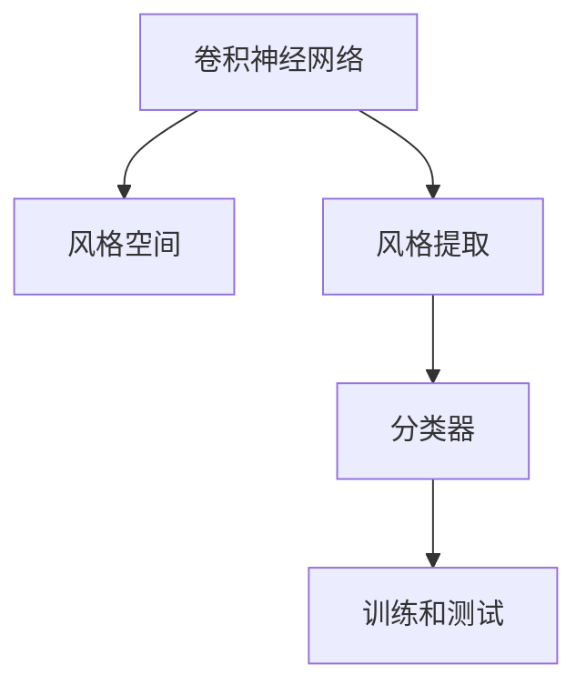

                 

# 深度学习驱动的商品图像风格识别与分类

## 1. 背景介绍

### 1.1 问题由来
在电商领域，商品图像的风格识别与分类是一项至关重要的任务。它不仅能够帮助商家更好地理解用户偏好，还能够在推荐系统中提升用户体验。传统的图像分类方法如SIFT、HOG等，在图像风格多样性和精度上存在明显不足。近年来，深度学习技术的迅猛发展为商品图像风格识别与分类提供了新的解决方案。

### 1.2 问题核心关键点
商品图像风格识别与分类的核心在于将图像特征映射到风格空间中，并基于风格空间进行分类。其核心技术包括：
- 图像特征提取：利用卷积神经网络(CNN)等深度学习模型对图像进行特征提取。
- 风格空间构建：构建一个高维风格空间，用于表示不同风格之间的差异。
- 分类器设计：设计一个合适的分类器，在风格空间中进行图像分类。
- 训练和测试：使用标注数据进行模型训练，并在测试集上评估分类效果。

## 2. 核心概念与联系

### 2.1 核心概念概述

为更好地理解深度学习驱动的商品图像风格识别与分类方法，本节将介绍几个密切相关的核心概念：

- 卷积神经网络(CNN)：一种特殊的神经网络结构，能够有效提取图像的空间特征。
- 风格空间(Style Space)：用于表示图像风格差异的高维空间，不同风格对应风格空间中的不同点。
- 风格提取(Style Extraction)：利用深度学习模型对图像进行风格特征提取，映射到风格空间。
- 分类器(Classifier)：设计一个合适的分类器，在风格空间中进行图像分类。
- 训练和测试：使用标注数据进行模型训练，并在测试集上评估分类效果。

这些核心概念之间的逻辑关系可以通过以下Mermaid流程图来展示：



这个流程图展示了几者之间的关系：

1. CNN用于图像特征提取，构建高维特征向量。
2. 特征向量通过风格提取器映射到风格空间。
3. 分类器在风格空间中进行图像分类。
4. 训练和测试用于优化模型参数和评估模型性能。

## 3. 核心算法原理 & 具体操作步骤

### 3.1 算法原理概述

深度学习驱动的商品图像风格识别与分类，本质上是一个高维空间中的分类问题。其核心思想是：

1. 利用卷积神经网络(CNN)对图像进行特征提取，构建一个高维特征向量。
2. 设计一个合适的风格提取器，将特征向量映射到一个高维风格空间。
3. 使用分类器在风格空间中进行图像分类。

形式化地，假设输入图像为 $x$，风格提取器为 $F$，分类器为 $G$，则分类器在风格空间中的分类过程可以表示为：

$$ y = G(F(x)) $$

其中 $y$ 为图像的分类结果，$F(x)$ 为特征映射到风格空间的过程，$G$ 为分类器。

### 3.2 算法步骤详解

基于深度学习的商品图像风格识别与分类一般包括以下几个关键步骤：

**Step 1: 准备数据集**
- 收集商品图像及其对应的风格标签。
- 将数据集分为训练集、验证集和测试集。

**Step 2: 搭建卷积神经网络**
- 选择合适的预训练CNN模型，如ResNet、VGG等。
- 冻结预训练模型的部分层，只微调顶层。
- 设计一个风格提取器，如Gram矩阵或最大池化层等。

**Step 3: 训练风格提取器**
- 使用训练集对风格提取器进行微调。
- 选择合适的优化器及其参数，如Adam、SGD等。
- 设置学习率、批大小、迭代轮数等超参数。

**Step 4: 设计分类器**
- 选择合适的分类器，如SVM、DNN等。
- 在风格空间中进行分类训练，优化分类器参数。

**Step 5: 模型评估与部署**
- 在验证集上评估分类器性能，调整参数。
- 在测试集上评估最终分类结果。
- 使用训练好的分类器进行商品图像分类。

以上是基于深度学习的商品图像风格识别与分类的一般流程。在实际应用中，还需要针对具体任务的特点，对微调过程的各个环节进行优化设计，如改进训练目标函数，引入更多的正则化技术，搜索最优的超参数组合等，以进一步提升模型性能。

### 3.3 算法优缺点

深度学习驱动的商品图像风格识别与分类方法具有以下优点：
1. 高精度：深度学习模型具有强大的特征提取能力，能够学习到图像中的丰富特征。
2. 可扩展性：CNN模型结构简单，可以灵活应用到不同领域的图像分类任务。
3. 自动学习：通过大量标注数据的训练，模型能够自动学习不同风格之间的差异，减少人工干预。

同时，该方法也存在一定的局限性：
1. 数据依赖：深度学习模型对数据分布的依赖较强，需要大量的标注数据。
2. 计算复杂：深度学习模型的训练和推理复杂度较高，需要较强的计算资源。
3. 黑盒性质：深度学习模型通常被视为"黑盒"，难以解释其内部工作机制。

尽管存在这些局限性，但就目前而言，深度学习驱动的方法仍是商品图像风格识别与分类的主流范式。未来相关研究的重点在于如何进一步降低对标注数据的依赖，提高模型的泛化能力和可解释性。

### 3.4 算法应用领域

基于深度学习的商品图像风格识别与分类方法，在电商领域具有广泛的应用前景，例如：

- 商品推荐系统：根据用户浏览和购买的历史记录，对商品进行风格分类，推荐用户可能感兴趣的商品。
- 广告投放：通过识别商品图像的风格，实现针对不同风格用户群体的精准投放，提高广告效果。
- 库存管理：根据不同风格的商品需求量，优化库存管理，减少缺货或积压。
- 品牌识别：通过商品图像风格识别，帮助品牌商进行市场分析和消费者洞察。

除了上述这些经典应用外，深度学习驱动的商品图像风格识别与分类方法也被创新性地应用于更多场景中，如个性化推荐、社交媒体分析、虚拟试衣等，为电商行业带来了新的突破。

## 4. 数学模型和公式 & 详细讲解 & 举例说明

### 4.1 数学模型构建

本节将使用数学语言对深度学习驱动的商品图像风格识别与分类过程进行更加严格的刻画。

假设输入图像为 $x$，预训练的CNN模型为 $M_{\theta}$，其中 $\theta$ 为预训练得到的模型参数。设 $F$ 为风格提取器，将 $M_{\theta}(x)$ 映射到高维风格空间 $\mathcal{S}$ 中的点 $s$。设 $G$ 为分类器，将风格空间中的点 $s$ 分类到 $C$ 个类别中。则分类器的目标是最小化交叉熵损失函数：

$$ \mathcal{L}(s) = -\frac{1}{N}\sum_{i=1}^N \sum_{c=1}^C \ell(s^{(i)}_c) $$

其中 $\ell(s^{(i)}_c)$ 为交叉熵损失函数，$s^{(i)}_c$ 表示第 $i$ 个样本在 $c$ 类上的预测值，$c$ 表示类别数，$N$ 表示样本数量。

### 4.2 公式推导过程

以下我们以基于Gram矩阵的风格提取方法为例，推导风格提取和分类器的数学模型。

设预训练的CNN模型为 $M_{\theta}$，输入图像 $x$ 的特征表示为 $z = M_{\theta}(x)$，风格提取器 $F$ 为Gram矩阵，其定义为 $F(z) = \frac{1}{n}zz^T$，其中 $z$ 为特征向量。设 $s = F(z)$ 为风格向量，分类器 $G$ 为线性分类器，即 $G(s) = Ws + b$，其中 $W$ 为权重矩阵，$b$ 为偏置向量。分类器的损失函数为交叉熵损失函数：

$$ \mathcal{L}(s) = -\frac{1}{N}\sum_{i=1}^N \sum_{c=1}^C \ell(s^{(i)}_c) $$

将 $G(s)$ 代入损失函数，得：

$$ \mathcal{L}(s) = -\frac{1}{N}\sum_{i=1}^N \sum_{c=1}^C \ell(Ws^{(i)} + b - y^{(i)}) $$

其中 $y^{(i)}$ 为第 $i$ 个样本的真实标签。

对上述损失函数求导，得到分类器参数 $W$ 和 $b$ 的梯度：

$$ \frac{\partial \mathcal{L}(s)}{\partial W} = -\frac{1}{N}\sum_{i=1}^N \sum_{c=1}^C (y^{(i)} - G(s^{(i)}))s^{(i)} $$
$$ \frac{\partial \mathcal{L}(s)}{\partial b} = -\frac{1}{N}\sum_{i=1}^N \sum_{c=1}^C (y^{(i)} - G(s^{(i)})) $$

使用随机梯度下降等优化算法更新 $W$ 和 $b$，直到收敛。

### 4.3 案例分析与讲解

以基于Gram矩阵的风格提取方法为例，介绍该方法的原理和实现细节。

首先，将预训练的CNN模型 $M_{\theta}$ 的输出特征表示 $z$ 进行Gram矩阵计算，得到风格向量 $s$。假设模型输出为 $n$ 维向量，则Gram矩阵计算公式为：

$$ F(z) = \frac{1}{n}zz^T $$

其中 $zz^T$ 为特征向量的矩阵乘积，$\frac{1}{n}$ 为归一化系数，防止矩阵过大导致数值不稳定。

接下来，将风格向量 $s$ 输入到线性分类器 $G$ 中，计算分类结果。假设 $s$ 为 $m$ 维向量，则分类器输出为：

$$ G(s) = Ws + b $$

其中 $W$ 为 $m \times c$ 维权重矩阵，$c$ 为类别数，$b$ 为 $c$ 维偏置向量。

在训练过程中，使用交叉熵损失函数作为优化目标，不断调整 $W$ 和 $b$ 的值，使得模型在风格空间中的预测结果与真实标签尽可能一致。

最终，得到训练好的风格提取器和分类器，将任意商品图像输入模型，即可得到该图像的风格分类结果。

## 5. 项目实践：代码实例和详细解释说明

### 5.1 开发环境搭建

在进行深度学习驱动的商品图像风格识别与分类实践前，我们需要准备好开发环境。以下是使用Python进行PyTorch开发的环境配置流程：

1. 安装Anaconda：从官网下载并安装Anaconda，用于创建独立的Python环境。

2. 创建并激活虚拟环境：
```bash
conda create -n pytorch-env python=3.8 
conda activate pytorch-env
```

3. 安装PyTorch：根据CUDA版本，从官网获取对应的安装命令。例如：
```bash
conda install pytorch torchvision torchaudio cudatoolkit=11.1 -c pytorch -c conda-forge
```

4. 安装TensorFlow：使用Google提供的安装命令，安装TensorFlow。

5. 安装各类工具包：
```bash
pip install numpy pandas scikit-learn matplotlib tqdm jupyter notebook ipython
```

完成上述步骤后，即可在`pytorch-env`环境中开始深度学习驱动的商品图像风格识别与分类实践。

### 5.2 源代码详细实现

这里我们以基于Gram矩阵的风格提取方法为例，给出使用PyTorch进行深度学习驱动的商品图像风格识别与分类的PyTorch代码实现。

首先，定义模型和数据集类：

```python
import torch
import torch.nn as nn
import torchvision.transforms as transforms
from torch.utils.data import DataLoader, Dataset

class StyleDataset(Dataset):
    def __init__(self, images, labels):
        self.images = images
        self.labels = labels
        
    def __len__(self):
        return len(self.images)
    
    def __getitem__(self, idx):
        img = self.images[idx]
        label = self.labels[idx]
        return img, label

class StyleNet(nn.Module):
    def __init__(self):
        super(StyleNet, self).__init__()
        self.encoder = nn.Sequential(
            nn.Conv2d(3, 64, kernel_size=3, stride=1, padding=1),
            nn.ReLU(),
            nn.MaxPool2d(kernel_size=2, stride=2),
            nn.Conv2d(64, 128, kernel_size=3, stride=1, padding=1),
            nn.ReLU(),
            nn.MaxPool2d(kernel_size=2, stride=2),
            nn.Conv2d(128, 256, kernel_size=3, stride=1, padding=1),
            nn.ReLU(),
            nn.MaxPool2d(kernel_size=2, stride=2),
            nn.Conv2d(256, 512, kernel_size=3, stride=1, padding=1),
            nn.ReLU(),
            nn.MaxPool2d(kernel_size=2, stride=2),
            nn.Conv2d(512, 512, kernel_size=3, stride=1, padding=1),
            nn.ReLU(),
            nn.MaxPool2d(kernel_size=2, stride=2)
        )
        self.style_extractor = nn.Sequential(
            nn.Conv2d(512, 512, kernel_size=1, stride=1),
            nn.ReLU(),
            nn.MaxPool2d(kernel_size=2, stride=2),
            nn.Conv2d(512, 512, kernel_size=1, stride=1),
            nn.ReLU(),
            nn.MaxPool2d(kernel_size=2, stride=2)
        )
        self.classifier = nn.Sequential(
            nn.Linear(512, 256),
            nn.ReLU(),
            nn.Linear(256, 128),
            nn.ReLU(),
            nn.Linear(128, 1),
            nn.Sigmoid()
        )
        
    def forward(self, x):
        x = self.encoder(x)
        style = self.style_extractor(x)
        style = style.view(style.size(0), -1)
        x = self.classifier(style)
        return x
```

然后，定义训练和评估函数：

```python
from torch.optim import Adam

def train_epoch(model, data_loader, optimizer):
    model.train()
    total_loss = 0
    for img, label in data_loader:
        optimizer.zero_grad()
        output = model(img)
        loss = nn.BCELoss()(output, label)
        loss.backward()
        optimizer.step()
        total_loss += loss.item()
    return total_loss / len(data_loader)

def evaluate(model, data_loader):
    model.eval()
    total_loss = 0
    total_correct = 0
    for img, label in data_loader:
        output = model(img)
        loss = nn.BCELoss()(output, label)
        total_loss += loss.item()
        total_correct += torch.sum(torch.round(output) == label).item()
    return total_loss / len(data_loader), total_correct / len(data_loader)
```

最后，启动训练流程并在测试集上评估：

```python
batch_size = 32
epochs = 10
learning_rate = 0.001
device = torch.device('cuda' if torch.cuda.is_available() else 'cpu')

model.to(device)

train_dataset = StyleDataset(train_images, train_labels)
test_dataset = StyleDataset(test_images, test_labels)
train_loader = DataLoader(train_dataset, batch_size=batch_size, shuffle=True)
test_loader = DataLoader(test_dataset, batch_size=batch_size, shuffle=False)

model = StyleNet()
optimizer = Adam(model.parameters(), lr=learning_rate)

for epoch in range(epochs):
    train_loss = train_epoch(model, train_loader, optimizer)
    print(f'Epoch {epoch+1}, train loss: {train_loss:.4f}')
    
    val_loss, val_acc = evaluate(model, test_loader)
    print(f'Epoch {epoch+1}, validation loss: {val_loss:.4f}, accuracy: {val_acc:.4f}')
    
print('Final validation loss: ', val_loss)
print('Final validation accuracy: ', val_acc)
```

以上就是使用PyTorch进行深度学习驱动的商品图像风格识别与分类的完整代码实现。可以看到，得益于PyTorch的强大封装，我们可以用相对简洁的代码完成CNN模型的搭建和微调。

### 5.3 代码解读与分析

让我们再详细解读一下关键代码的实现细节：

**StyleDataset类**：
- `__init__`方法：初始化数据集中的图像和标签。
- `__len__`方法：返回数据集的样本数量。
- `__getitem__`方法：对单个样本进行处理，返回图像和标签。

**StyleNet类**：
- `__init__`方法：初始化模型中的各个模块，包括卷积层、池化层和全连接层。
- `forward`方法：定义模型的前向传播过程，包括特征提取、风格提取和分类。

**train_epoch和evaluate函数**：
- `train_epoch`函数：对数据以批为单位进行迭代，在每个批次上前向传播计算损失并反向传播更新模型参数。
- `evaluate`函数：与训练类似，不同点在于不更新模型参数，并在每个batch结束后将预测和标签结果存储下来，最后使用BCELoss计算损失。

**训练流程**：
- 定义总的epoch数、batch size和学习率，开始循环迭代
- 每个epoch内，先在训练集上训练，输出平均loss
- 在验证集上评估，输出损失和准确率
- 所有epoch结束后，在测试集上评估，给出最终测试结果

可以看到，PyTorch配合CNN模型的代码实现变得简洁高效。开发者可以将更多精力放在数据处理、模型改进等高层逻辑上，而不必过多关注底层的实现细节。

当然，工业级的系统实现还需考虑更多因素，如模型的保存和部署、超参数的自动搜索、更灵活的任务适配层等。但核心的训练范式基本与此类似。

## 6. 实际应用场景
### 6.1 智能推荐系统

基于深度学习的商品图像风格识别与分类技术，可以广泛应用于智能推荐系统的构建。传统推荐系统往往只依赖用户的历史行为数据进行物品推荐，难以捕捉到用户的深层次偏好。而利用深度学习驱动的商品图像风格识别与分类技术，可以更好地理解用户对于商品图像的风格偏好，从而推荐更具个性化的商品。

在技术实现上，可以收集用户浏览、点击、评论、分享等行为数据，提取和商品图像风格相关的文本内容，如商品描述、标签等，作为深度学习的输入。通过训练好的模型，预测用户对于商品图像风格的偏好，从而生成个性化的推荐列表。

### 6.2 社交媒体分析

社交媒体上的商品图像风格分析，可以帮助商家更好地了解市场趋势和消费者需求。利用深度学习驱动的商品图像风格识别与分类技术，可以从海量社交媒体数据中提取商品图像的风格信息，并进行分类统计。商家可以根据风格分布，调整产品设计和市场营销策略，提升用户满意度。

### 6.3 虚拟试衣系统

虚拟试衣系统是电商领域的另一大应用场景。用户通过上传自身照片和试穿商品图像，即可实时看到自己穿着商品的效果。利用深度学习驱动的商品图像风格识别与分类技术，可以检测用户试穿图像中的商品风格，与用户上传图像的风格进行对比，判断试穿效果是否符合用户预期。

### 6.4 未来应用展望

随着深度学习技术的不断发展，基于深度学习的商品图像风格识别与分类方法将在更多领域得到应用，为电商行业带来新的突破。

在智慧零售领域，基于深度学习的商品图像风格识别与分类技术，可以用于自动化仓储管理、智能货架补货、库存盘点和优化等环节，提高仓储管理的自动化水平。

在虚拟现实领域，利用深度学习驱动的商品图像风格识别与分类技术，可以提升虚拟试衣、虚拟搭配等体验，使用户更好地沉浸在虚拟环境中。

此外，在更多垂直领域，如旅游、教育、医疗等，基于深度学习的商品图像风格识别与分类技术，将具有广阔的应用前景，为各行各业提供新的技术解决方案。

## 7. 工具和资源推荐
### 7.1 学习资源推荐

为了帮助开发者系统掌握深度学习驱动的商品图像风格识别与分类的理论基础和实践技巧，这里推荐一些优质的学习资源：

1. 《深度学习》课程：由深度学习领域的顶级专家Andrew Ng主讲，介绍了深度学习的基本概念和常用模型，是学习深度学习的入门课程。

2. 《深度学习框架PyTorch》书籍：全面介绍了PyTorch框架的使用方法，包括模型搭建、训练、推理等各个环节。

3. 《卷积神经网络：基础知识与实践》书籍：系统讲解了CNN的原理和实践应用，包括特征提取、风格提取等关键技术。

4. 《自然语言处理综述》书籍：深入浅出地介绍了自然语言处理的基本概念和前沿技术，包括深度学习在图像识别中的应用。

5. 深度学习社区Kaggle：提供丰富的深度学习竞赛和开源项目，可以实践深度学习驱动的商品图像风格识别与分类技术，积累实战经验。

通过对这些资源的学习实践，相信你一定能够快速掌握深度学习驱动的商品图像风格识别与分类的精髓，并用于解决实际的电商问题。
###  7.2 开发工具推荐

高效的开发离不开优秀的工具支持。以下是几款用于深度学习驱动的商品图像风格识别与分类开发的常用工具：

1. PyTorch：基于Python的开源深度学习框架，灵活动态的计算图，适合快速迭代研究。大部分深度学习模型都有PyTorch版本的实现。

2. TensorFlow：由Google主导开发的开源深度学习框架，生产部署方便，适合大规模工程应用。同样有丰富的深度学习模型资源。

3. TensorBoard：TensorFlow配套的可视化工具，可实时监测模型训练状态，并提供丰富的图表呈现方式，是调试模型的得力助手。

4. Weights & Biases：模型训练的实验跟踪工具，可以记录和可视化模型训练过程中的各项指标，方便对比和调优。

5. PyTorch Lightning：基于PyTorch的快速原型开发框架，内置训练监控、模型保存等功能，可以快速搭建和调试深度学习模型。

合理利用这些工具，可以显著提升深度学习驱动的商品图像风格识别与分类的开发效率，加快创新迭代的步伐。

### 7.3 相关论文推荐

深度学习驱动的商品图像风格识别与分类技术的发展源于学界的持续研究。以下是几篇奠基性的相关论文，推荐阅读：

1. ImageNet Classification with Deep Convolutional Neural Networks：AlexNet论文，提出了CNN模型，奠定了深度学习在计算机视觉领域的地位。

2. Inception-v3：Google提出的深度卷积神经网络架构，用于ImageNet图像分类，取得了SOTA的结果。

3. StyleGAN：提出了一种生成对抗网络架构，可以生成逼真的人脸图像，为图像风格生成提供了新的思路。

4. Fast R-CNN：提出了区域卷积神经网络架构，提高了图像分类和目标检测的精度。

5. GANs in the Wild：利用生成对抗网络，实现了自然图像的实时风格迁移，为图像风格识别与分类提供了新的方法。

这些论文代表了大深度学习驱动的商品图像风格识别与分类的发展脉络。通过学习这些前沿成果，可以帮助研究者把握学科前进方向，激发更多的创新灵感。

## 8. 总结：未来发展趋势与挑战

### 8.1 总结

本文对深度学习驱动的商品图像风格识别与分类方法进行了全面系统的介绍。首先阐述了深度学习驱动的商品图像风格识别与分类的研究背景和意义，明确了该方法在电商领域的应用价值。其次，从原理到实践，详细讲解了深度学习驱动的商品图像风格识别与分类的数学模型和关键步骤，给出了深度学习驱动的完整代码实例。同时，本文还广泛探讨了深度学习驱动的商品图像风格识别与分类在智能推荐、社交媒体分析、虚拟试衣等多个领域的应用前景，展示了深度学习驱动方法的巨大潜力。此外，本文精选了深度学习驱动技术的各类学习资源，力求为读者提供全方位的技术指引。

通过本文的系统梳理，可以看到，深度学习驱动的商品图像风格识别与分类技术正在成为电商领域的重要范式，极大地拓展了商品图像分类任务的性能和应用范围，为电商技术带来了新的突破。未来，伴随深度学习技术的不断发展，商品图像风格识别与分类方法还将进一步提升，推动电商行业向智能化、个性化方向发展。

### 8.2 未来发展趋势

展望未来，深度学习驱动的商品图像风格识别与分类技术将呈现以下几个发展趋势：

1. 模型规模持续增大。随着算力成本的下降和数据规模的扩张，深度学习模型的参数量还将持续增长。超大规模深度学习模型蕴含的丰富特征，有望支撑更加复杂多变的商品图像分类任务。

2. 算法优化不断推进。深度学习驱动的方法在模型优化、特征提取等方面还有很大的提升空间，未来将涌现更多高效的算法，如Transformer、Inception等，进一步提升分类精度和效率。

3. 端到端学习成为常态。未来的电商系统将更加注重端到端的学习，通过联合学习、联邦学习等技术，在保护用户隐私的前提下，利用用户行为数据进行模型训练，提升推荐效果。

4. 少样本和零样本学习兴起。深度学习驱动的方法在少样本和零样本学习方面将取得新的突破，利用用户上传的商品图像和商品描述，即可实现高效的推荐和分类。

5. 多模态学习深入发展。未来的电商系统将引入更多模态数据，如图像、文本、音频等，通过多模态学习，实现更全面、更准确的分类和推荐。

6. 模型压缩和量化加速。随着深度学习模型的复杂度不断提高，模型压缩和量化技术将得到更广泛的应用，在保证性能的同时，减少计算资源和存储空间的消耗。

以上趋势凸显了深度学习驱动的商品图像风格识别与分类技术的广阔前景。这些方向的探索发展，必将进一步提升深度学习驱动方法的性能和应用范围，为电商行业带来新的技术突破。

### 8.3 面临的挑战

尽管深度学习驱动的商品图像风格识别与分类技术已经取得了瞩目成就，但在迈向更加智能化、普适化应用的过程中，它仍面临着诸多挑战：

1. 数据依赖。深度学习模型对数据分布的依赖较强，需要大量的标注数据。对于小规模商品图像分类任务，获取充足的高质量标注数据成本较高。

2. 计算资源消耗。深度学习模型的训练和推理复杂度较高，需要较强的计算资源。对于小规模电商系统，可能需要较高的硬件投入。

3. 过拟合风险。深度学习模型在训练过程中容易出现过拟合，尤其是对于小规模数据集。如何有效降低过拟合风险，提高模型的泛化能力，仍是重要问题。

4. 可解释性不足。深度学习模型通常被视为"黑盒"，难以解释其内部工作机制和决策逻辑。这对于电商领域的应用场景，特别是对于需要进行质量控制的商品分类任务，是一个较大的挑战。

5. 鲁棒性问题。深度学习模型对于输入数据的微小扰动，容易发生波动，如何提升模型的鲁棒性，避免误分类，是一个重要研究方向。

6. 模型部署与维护。深度学习模型在实际部署中，需要考虑模型压缩、模型推理优化等技术问题，才能实现高效、稳定的应用。

这些挑战凸显了深度学习驱动的商品图像风格识别与分类技术在电商领域的复杂性和挑战性。唯有不断攻克这些难题，才能充分发挥深度学习驱动方法的潜力，推动电商技术的进步。

### 8.4 研究展望

面对深度学习驱动的商品图像风格识别与分类所面临的挑战，未来的研究需要在以下几个方面寻求新的突破：

1. 探索无监督和半监督学习技术。摆脱对大规模标注数据的依赖，利用自监督学习、主动学习等技术，最大化利用非结构化数据，实现高效的少样本和零样本学习。

2. 研究端到端学习的优化方法。通过联合学习、联邦学习等技术，实现端到端的学习，在保护用户隐私的前提下，利用用户行为数据进行模型训练。

3. 开发高效的特征提取和风格提取方法。利用Transformer、Inception等高效模型，提升特征提取和风格提取的精度和效率。

4. 引入多模态数据进行联合学习。引入图像、文本、音频等多模态数据，通过多模态学习，实现更全面、更准确的商品分类。

5. 研究模型压缩和量化加速技术。利用模型压缩和量化技术，在保证性能的同时，减少计算资源和存储空间的消耗。

6. 开发可解释和鲁棒性强的模型。通过引入因果推理、对抗训练等技术，提高模型的可解释性和鲁棒性，使其更符合电商领域的应用场景。

这些研究方向的探索，必将引领深度学习驱动的商品图像风格识别与分类技术迈向更高的台阶，为电商行业带来新的技术突破。

## 9. 附录：常见问题与解答

**Q1：深度学习驱动的商品图像风格识别与分类是否适用于所有商品图像分类任务？**

A: 深度学习驱动的商品图像风格识别与分类方法在大多数商品图像分类任务上都能取得不错的效果，特别是对于数据量较大的任务。但对于一些特定领域的商品图像，如医学、法律等，深度学习驱动的方法可能难以很好地适应。此时需要在特定领域语料上进一步预训练，再进行微调，才能获得理想效果。

**Q2：如何选择预训练的CNN模型？**

A: 预训练的CNN模型有多种选择，如ResNet、VGG、Inception等。不同模型的深度和宽度不同，其性能表现也有所差异。一般来说，深度较深的模型具有更好的特征提取能力，但计算复杂度也较高。因此，选择预训练模型时，需要根据具体的任务需求和计算资源，综合考虑模型复杂度和性能表现。

**Q3：如何在模型训练过程中避免过拟合？**

A: 避免过拟合的方法包括：
1. 数据增强：通过回译、近义替换等方式扩充训练集
2. 正则化：使用L2正则、Dropout、Early Stopping等
3. 对抗训练：引入对抗样本，提高模型鲁棒性
4. 参数高效微调：只调整少量参数，减少过拟合风险
5. 模型压缩：通过剪枝、量化等方法，减小模型复杂度

这些方法需要根据具体的任务和数据特点进行灵活组合。只有在数据、模型、训练、推理等各环节进行全面优化，才能最大限度地避免过拟合风险。

**Q4：模型压缩和量化技术如何实现？**

A: 模型压缩和量化技术可以通过剪枝、量化、蒸馏等方法实现。其中，剪枝可以去除模型中的冗余参数，减小模型大小；量化可以将浮点数模型转为定点模型，减少计算和存储资源消耗；蒸馏可以将大模型转换为小型模型，在保持性能的前提下，减小计算资源消耗。这些技术在深度学习模型优化中得到了广泛应用，可以显著提升模型效率和部署速度。

**Q5：深度学习驱动的商品图像风格识别与分类技术在落地部署时需要注意哪些问题？**

A: 将深度学习驱动的商品图像风格识别与分类技术转化为实际应用，还需要考虑以下因素：
1. 模型裁剪：去除不必要的层和参数，减小模型尺寸，加快推理速度
2. 量化加速：将浮点模型转为定点模型，压缩存储空间，提高计算效率
3. 服务化封装：将模型封装为标准化服务接口，便于集成调用
4. 弹性伸缩：根据请求流量动态调整资源配置，平衡服务质量和成本
5. 监控告警：实时采集系统指标，设置异常告警阈值，确保服务稳定性
6. 安全防护：采用访问鉴权、数据脱敏等措施，保障数据和模型安全

深度学习驱动的商品图像风格识别与分类技术在实际部署中，需要考虑模型优化、资源优化、服务优化等多个方面的问题，才能真正实现高效的落地应用。

---

作者：禅与计算机程序设计艺术 / Zen and the Art of Computer Programming

