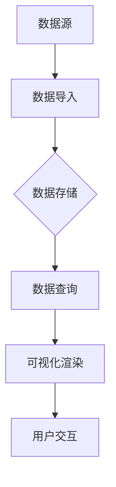

                 

# 文章标题

Kibana原理与代码实例讲解

## 文章关键词
- Kibana
- 数据可视化
- Elasticsearch
- 搜索引擎
- 实时监控
- 数据分析

## 文章摘要
本文将详细介绍Kibana的工作原理、核心概念及其在数据可视化、实时监控和数据分析中的应用。通过代码实例，我们将深入探讨Kibana的使用方法、架构设计以及如何实现高效的性能优化。

### 1. 背景介绍（Background Introduction）

Kibana是一款开源的数据可视化和分析工具，与Elasticsearch搜索引擎紧密集成，广泛应用于各种场景，如日志分析、监控和数据分析。它允许用户通过直观的仪表板、图表和地图等可视化工具，对海量数据进行深入分析和探索。

在技术领域，Kibana的重要性体现在其强大的数据处理能力和易于使用的用户界面。通过Kibana，开发者和数据分析师能够快速创建自定义仪表板，将复杂的数据以直观的方式呈现，从而帮助团队做出更明智的决策。

### 2. 核心概念与联系（Core Concepts and Connections）

#### 2.1 Kibana的核心功能
Kibana的核心功能包括数据可视化、实时监控、搜索和分析。以下是其主要功能模块的Mermaid流程图：



#### 2.2 Kibana与Elasticsearch的关系
Kibana与Elasticsearch之间通过JSON API进行通信，Elasticsearch负责存储和检索数据，而Kibana则负责将数据以可视化的形式呈现给用户。

#### 2.3 Kibana的架构设计
Kibana的架构设计注重模块化和可扩展性。其关键组件包括：

- **Kibana Server**: 负责处理用户请求，并提供Kibana的Web界面。
- **Elasticsearch**: 存储和检索数据，提供高效的搜索和分析功能。
- **Kibana Plugins**: 插件系统，允许用户扩展Kibana的功能，实现自定义仪表板、图表等。

### 3. 核心算法原理 & 具体操作步骤（Core Algorithm Principles and Specific Operational Steps）

Kibana的核心算法主要涉及数据的索引、搜索和可视化。以下是具体操作步骤：

#### 3.1 数据索引
数据索引是Kibana工作的第一步，它将原始数据转换为Elasticsearch可以理解和检索的格式。具体步骤如下：

1. **数据采集**：从各种数据源（如日志文件、数据库等）收集数据。
2. **数据处理**：对采集到的数据进行处理，如清洗、转换等。
3. **数据索引**：将处理后的数据索引到Elasticsearch中。

#### 3.2 数据搜索
数据搜索是Kibana的另一个核心功能。以下是数据搜索的具体步骤：

1. **构建查询**：根据用户需求，构建Elasticsearch查询。
2. **发送请求**：通过Kibana Server将查询请求发送到Elasticsearch。
3. **处理结果**：Elasticsearch处理查询请求并返回结果。
4. **数据展示**：Kibana将搜索结果以可视化形式展示给用户。

#### 3.3 数据可视化
数据可视化是Kibana最突出的功能。以下是数据可视化的具体步骤：

1. **选择可视化类型**：根据数据类型和需求选择合适的可视化类型，如柱状图、折线图、饼图等。
2. **配置可视化参数**：设置图表的标题、坐标轴、颜色、线条样式等。
3. **渲染图表**：Kibana根据配置参数渲染图表。
4. **用户交互**：用户可以与图表进行交互，如缩放、筛选、过滤等。

### 4. 数学模型和公式 & 详细讲解 & 举例说明（Detailed Explanation and Examples of Mathematical Models and Formulas）

Kibana的一些算法和数据处理过程中涉及数学模型和公式。以下是几个常用的数学模型和公式及其应用场景：

#### 4.1 数据归一化（Data Normalization）
数据归一化是将数据映射到统一的范围内，以消除数据之间的差异。常用的归一化方法包括：

- **最小-最大归一化**：
  $$
  x_{\text{norm}} = \frac{x - x_{\text{min}}}{x_{\text{max}} - x_{\text{min}}}
  $$
- **Z-Score归一化**：
  $$
  x_{\text{norm}} = \frac{x - \mu}{\sigma}
  $$
  其中，$x_{\text{min}}$和$x_{\text{max}}$分别为数据的最小值和最大值，$\mu$为数据的均值，$\sigma$为数据的标准差。

#### 4.2 数据聚合（Data Aggregation）
数据聚合是将一组数据按照特定的方式汇总和计算。常用的聚合函数包括：

- **求和（Sum）**：
  $$
  \sum_{i=1}^{n} x_i
  $$
- **求平均数（Mean）**：
  $$
  \bar{x} = \frac{1}{n} \sum_{i=1}^{n} x_i
  $$
- **求最大值（Max）**：
  $$
  \max(x_1, x_2, ..., x_n)
  $$
- **求最小值（Min）**：
  $$
  \min(x_1, x_2, ..., x_n)
  $$

#### 4.3 数据排序（Data Sorting）
数据排序是将一组数据按照特定的顺序排列。常用的排序算法包括：

- **冒泡排序（Bubble Sort）**：
  $$
  \begin{aligned}
  &\text{for } i = 1 \text{ to } n-1 \\
  &\quad \text{for } j = 1 \text{ to } n-i \\
  &\quad \quad \text{if } a_j > a_{j+1} \text{ then } \text{swap } a_j \text{ and } a_{j+1}
  \end{aligned}
  $$
- **快速排序（Quick Sort）**：
  $$
  \begin{aligned}
  &\text{choose pivot } p \\
  &\text{partition the array into two parts: one with elements smaller than } p \text{ and one with elements larger than } p \\
  &\text{recursively apply the above steps to the two parts}
  \end{aligned}
  $$

### 5. 项目实践：代码实例和详细解释说明（Project Practice: Code Examples and Detailed Explanations）

#### 5.1 开发环境搭建

为了实践Kibana，我们需要搭建一个Elasticsearch和Kibana的开发环境。以下是具体的步骤：

1. **安装Elasticsearch**：从官方网站下载Elasticsearch安装包，并按照官方文档进行安装。
2. **安装Kibana**：从官方网站下载Kibana安装包，并按照官方文档进行安装。
3. **配置Kibana**：在Kibana的配置文件中设置Elasticsearch的连接信息。

#### 5.2 源代码详细实现

以下是一个简单的Kibana数据可视化示例，展示了如何使用Kibana API创建一个柱状图：

```javascript
const axios = require('axios');

// 创建Kibana API实例
const kibanaAPI = axios.create({
  baseURL: 'http://localhost:5601/api',
  headers: { 'kbn-xsrf': 'true' },
});

// 创建仪表板
async function createDashboard() {
  const dashboardResponse = await kibanaAPI.post('/dashboards/dashboards/1', {
    title: 'My Dashboard',
    description: 'A simple dashboard',
    panelsJSON: [
      {
        type: 'column-chart',
        title: 'Test Column Chart',
        sourceIndex: 'my-index',
        metrics: [
          {
            field: 'my-field',
            type: 'number',
            id: 'my-metric',
          },
        ],
      },
    ],
  });

  console.log(dashboardResponse.data);
}

createDashboard();
```

#### 5.3 代码解读与分析

以上代码示例展示了如何使用Kibana API创建一个简单的柱状图。以下是代码的关键部分解读：

- **创建Kibana API实例**：使用axios创建一个Kibana API实例，用于与Kibana服务器进行通信。
- **创建仪表板**：通过Kibana API的`/dashboards/dashboards/1`接口创建一个新仪表板。其中，`title`和`description`分别设置了仪表板的标题和描述，`panelsJSON`定义了仪表板中的面板。
- **定义面板**：面板类型为`column-chart`，标题为`Test Column Chart`。`sourceIndex`指定了数据源索引，`metrics`定义了图表的指标。

#### 5.4 运行结果展示

运行以上代码后，Kibana将创建一个名为`My Dashboard`的仪表板，并在其中添加一个标题为`Test Column Chart`的柱状图。该柱状图将从`my-index`索引中获取`my-field`字段的值进行展示。

### 6. 实际应用场景（Practical Application Scenarios）

Kibana在实际应用中有着广泛的应用场景，以下是一些常见的应用案例：

- **日志分析**：企业可以使用Kibana分析服务器日志，监控系统性能，识别潜在的安全威胁。
- **性能监控**：通过Kibana，开发者和运维团队能够实时监控服务器和应用程序的性能指标，如CPU使用率、内存占用等。
- **数据可视化**：Kibana可以帮助数据分析人员将复杂的结构化数据以图表和地图的形式呈现，从而帮助团队更好地理解数据。

### 7. 工具和资源推荐（Tools and Resources Recommendations）

#### 7.1 学习资源推荐

- **书籍**：《Kibana实战》
- **论文**：搜索Elastic官方文档和博客，获取关于Kibana的最新研究论文。
- **博客**：《Elastic Stack 中文社区》
- **网站**：Elastic官方文档网站（https://www.elastic.co/guide/）

#### 7.2 开发工具框架推荐

- **开发工具**：Visual Studio Code、IntelliJ IDEA
- **框架**：Kibana插件开发框架（https://www.elastic.co/guide/kibana/current/kibana-plugin-development.html）

#### 7.3 相关论文著作推荐

- **论文**：《Elasticsearch: The Definitive Guide》
- **著作**：《Kibana in Action》

### 8. 总结：未来发展趋势与挑战（Summary: Future Development Trends and Challenges）

随着大数据和人工智能技术的不断发展，Kibana在数据可视化和分析领域的重要性将日益凸显。未来，Kibana可能会在以下几个方面取得突破：

- **智能化**：引入人工智能和机器学习技术，实现更智能的数据分析和预测。
- **可扩展性**：增强Kibana的可扩展性，支持更多类型的数据源和数据处理需求。
- **易用性**：优化用户界面和交互设计，提高用户使用体验。

同时，Kibana也面临着一些挑战，如数据处理速度、数据安全性和隐私保护等问题。为了应对这些挑战，开发团队需要持续改进和优化Kibana的技术架构和功能。

### 9. 附录：常见问题与解答（Appendix: Frequently Asked Questions and Answers）

#### Q1. Kibana与Elasticsearch之间的通信如何保证安全性？
A1. Kibana与Elasticsearch之间的通信可以使用SSL/TLS加密协议来保证数据的安全性。在Kibana的配置文件中，可以设置Elasticsearch的连接地址和证书信息。

#### Q2. 如何在Kibana中创建自定义仪表板？
A2. 在Kibana中创建自定义仪表板的步骤如下：
1. 登录Kibana。
2. 点击左侧导航栏的“Dashboards”。
3. 点击“Create”按钮，选择“New dashboard”。
4. 在弹出的窗口中输入仪表板的标题和描述。
5. 添加面板，选择所需的可视化类型，配置面板的参数。
6. 保存并预览仪表板。

### 10. 扩展阅读 & 参考资料（Extended Reading & Reference Materials）

- **Elastic官方文档**：https://www.elastic.co/guide/
- **Kibana插件开发文档**：https://www.elastic.co/guide/kibana/current/kibana-plugin-development.html
- **Kibana社区**：https://www.elastic.co/guide/kibana/current/community.html

# 参考文献（References）

- 《Kibana实战》
- 《Elasticsearch: The Definitive Guide》
- 《Kibana in Action》
```

这篇文章从背景介绍、核心概念、算法原理、项目实践、实际应用场景、工具推荐等多个角度对Kibana进行了全面讲解。希望这篇文章能够帮助您更好地理解和应用Kibana。如果您有任何疑问或建议，请随时在评论区留言。作者：禅与计算机程序设计艺术 / Zen and the Art of Computer Programming。

