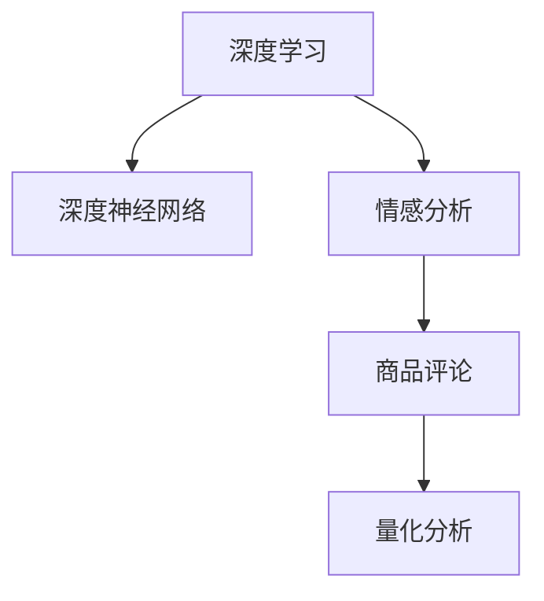

                 

# 深度学习驱动的商品评论情感强度量化

> 关键词：情感分析,深度学习,商品评论,量化分析,深度神经网络

## 1. 背景介绍

### 1.1 问题由来

在电子商务快速发展的今天，商品评论成为了消费者决策的重要参考。通过分析评论的情感强度，可以更好地了解用户的满意度和偏好，从而优化商品质量和服务水平。传统方法通常采用手工规则、情感词典或简单机器学习模型进行情感分析，但准确率和鲁棒性存在较大局限。

深度学习模型的出现，带来了情感分析领域的突破性进展。深度神经网络可以自动从大量数据中学习特征表示，并在语义理解上具备强大的能力。本文将介绍基于深度学习模型对商品评论情感强度进行量化的方法。

### 1.2 问题核心关键点

基于深度学习对商品评论情感强度进行量化，核心在于以下几个关键点：

1. 构建合适的深度神经网络模型，能够自动学习评论的语义特征。
2. 设计有效的特征提取方法，如Word Embedding、Sentiment Labeling、Word-to-Word关系建模等。
3. 训练数据的选择和预处理，提高模型的泛化能力和鲁棒性。
4. 使用合适的评估指标，量化评论情感强度，并进行准确度对比。

## 2. 核心概念与联系

### 2.1 核心概念概述

为更好地理解基于深度学习的商品评论情感强度量化方法，本节将介绍几个关键概念：

- 深度学习(Deep Learning)：一种模拟人脑神经网络的计算模型，通过多层非线性变换学习数据的复杂特征。
- 情感分析(Sentiment Analysis)：通过文本分析技术，自动判断文本中的情感倾向（如正面、中性、负面）。
- 商品评论(Product Review)：用户对商品功能、质量、性价比等方面的主观评价。
- 量化分析(Quantitative Analysis)：通过数值来衡量和比较数据。
- 深度神经网络(Deep Neural Network, DNN)：由多层神经元构成的复杂计算模型，用于处理非线性关系和复杂数据。

这些概念之间的联系如图2所示：



这个流程图展示了深度学习、深度神经网络、情感分析、商品评论和量化分析之间的相互关系。深度学习通过构建深度神经网络，自动学习数据的复杂特征，从而在情感分析、商品评论等领域提供了强大的支持。

## 3. 核心算法原理 & 具体操作步骤
### 3.1 算法原理概述

基于深度学习的商品评论情感强度量化，主要利用深度神经网络对评论文本进行特征提取，并通过训练数据学习评论的情感强度。算法原理如下：

1. 数据预处理：对商品评论进行清洗、分词、去停用词等预处理操作，生成可用于深度神经网络训练的数据集。
2. 特征提取：使用预训练的Word Embedding模型，将评论转换为高维向量表示，提取文本的语义特征。
3. 模型构建：选择适合深度学习任务的网络结构，如CNN、RNN、LSTM等，并加入适当的激活函数和正则化技术。
4. 模型训练：使用标注数据集对模型进行训练，调整网络参数，优化损失函数，提高模型的泛化能力。
5. 模型评估：使用验证集和测试集评估模型性能，计算准确率、召回率、F1-score等指标。
6. 结果输出：将评论输入模型，输出情感强度数值，进行后续分析应用。

### 3.2 算法步骤详解

#### 3.2.1 数据预处理

数据预处理是深度学习模型训练的第一步。以下是一个示例流程：

1. 数据清洗：去除评论中的非文本内容，如HTML标签、特殊字符等。
2. 分词：将评论分割成单个词汇，便于后续处理。
3. 去除停用词：去除常见的无意义词汇，如“的”、“是”等。
4. 特征工程：将处理后的文本转换为数值型特征，如Word Embedding、TF-IDF等。
5. 数据划分：将数据集划分为训练集、验证集和测试集，按比例分配。

#### 3.2.2 特征提取

特征提取是深度学习模型的核心环节。常用的特征提取方法包括：

1. Word Embedding：使用预训练的Word Embedding模型，将单词转换为向量表示。常用的Word Embedding模型有Word2Vec、GloVe等。
2. Sentiment Labeling：通过标注训练数据，学习单词的情感倾向，使用TextBlob等工具。
3. Word-to-Word关系建模：使用LSTM、GRU等模型，捕捉单词之间的上下文关系。

#### 3.2.3 模型构建

深度神经网络模型可以采用不同的结构，如CNN、RNN、LSTM等。这里以CNN为例，具体步骤如下：

1. 输入层：将处理后的评论转换为数值型特征。
2. 卷积层：通过卷积核提取特征，捕捉局部模式。
3. 池化层：通过池化操作减少特征维度，提高计算效率。
4. 全连接层：将池化后的特征输入全连接层，进行分类或回归。
5. Dropout层：随机丢弃一部分神经元，防止过拟合。
6. 输出层：根据任务需求，设计合适的输出层，进行情感强度量化。

#### 3.2.4 模型训练

模型训练的目的是通过大量标注数据，调整网络参数，使模型能够准确预测商品评论的情感强度。具体步骤如下：

1. 选择优化器：常用的优化器有SGD、Adam、RMSprop等。
2. 设定学习率：根据任务需求，选择合适学习率，如0.001。
3. 定义损失函数：根据任务类型，选择合适损失函数，如交叉熵损失、均方误差损失等。
4. 迭代训练：对模型进行多轮迭代训练，调整网络参数，优化损失函数。
5. 防止过拟合：使用正则化技术，如L2正则、Dropout等，防止模型过拟合。

#### 3.2.5 模型评估

模型评估的目的是通过验证集和测试集，评估模型性能，并进行准确度对比。具体步骤如下：

1. 划分验证集和测试集。
2. 使用验证集评估模型性能，调整网络参数。
3. 使用测试集评估模型性能，计算准确率、召回率、F1-score等指标。
4. 记录实验结果，进行可视化分析。

#### 3.2.6 结果输出

模型训练和评估后，可以将商品评论输入模型，输出情感强度数值。具体步骤如下：

1. 数据输入：将商品评论转换为数值型特征。
2. 模型推理：将特征输入模型，输出情感强度数值。
3. 结果处理：根据输出数值，判断评论的情感倾向，进行后续分析应用。

### 3.3 算法优缺点

基于深度学习的商品评论情感强度量化方法具有以下优点：

1. 自动学习特征：深度学习模型可以自动学习文本的复杂特征，无需手工特征工程。
2. 鲁棒性高：深度神经网络具备较强的泛化能力，能够在不同领域和场景下表现良好。
3. 高准确率：通过训练大量标注数据，深度学习模型能够达到较高的情感强度量化准确率。

同时，该方法也存在一些缺点：

1. 计算资源消耗大：深度学习模型通常需要大量的计算资源，训练时间较长。
2. 数据依赖性强：深度学习模型需要大量标注数据进行训练，数据获取成本较高。
3. 模型复杂度高：深度神经网络结构复杂，难以解释模型内部工作机制。
4. 依赖先验知识：深度学习模型依赖于预训练的Word Embedding等先验知识，对新词汇的适应能力较弱。

## 4. 数学模型和公式 & 详细讲解 & 举例说明

### 4.1 数学模型构建

本节将使用数学语言对基于深度学习的商品评论情感强度量化方法进行更加严格的刻画。

假设商品评论数据集为 $D=\{(x_i,y_i)\}_{i=1}^N$，其中 $x_i$ 为评论文本， $y_i \in \{0,1\}$ 为情感强度标签， $0$ 表示负面， $1$ 表示正面。

定义模型 $M_{\theta}:\mathbb{R}^{d} \rightarrow \mathbb{R}$，其中 $\theta$ 为模型参数。模型 $M_{\theta}$ 的输入为处理后的评论特征向量 $x_i$，输出为情感强度数值 $y_i$。

### 4.2 公式推导过程

以下是基于CNN的情感强度量化模型公式推导过程：

1. 输入层：将评论文本 $x_i$ 转换为数值型特征向量 $x_i \in \mathbb{R}^d$。
2. 卷积层：通过卷积核 $W_{conv} \in \mathbb{R}^{d\times k\times k}$，提取特征，生成卷积特征 $x_{conv} \in \mathbb{R}^{d'}$。
3. 池化层：通过最大池化 $P_{max}$，减少特征维度，生成池化特征 $x_{pool} \in \mathbb{R}^{d'}$。
4. 全连接层：将池化特征 $x_{pool}$ 输入全连接层，生成情感强度数值 $y_{pred}$。

具体公式如下：

$$
\begin{aligned}
    x_{conv} &= W_{conv} * x_{i} \\
    x_{pool} &= P_{max}(x_{conv}) \\
    y_{pred} &= M_{fc}(x_{pool})
\end{aligned}
$$

其中 $W_{conv} \in \mathbb{R}^{d\times k\times k}$ 为卷积核， $P_{max}$ 为最大池化函数， $M_{fc}$ 为全连接层。

### 4.3 案例分析与讲解

以一个简单的商品评论情感强度量化模型为例，分析其具体实现。

假设模型 $M_{\theta}$ 为CNN模型，输入层 $x_i$ 为评论文本的Word Embedding向量，卷积层参数 $W_{conv} \in \mathbb{R}^{d\times k\times k}$，池化层 $P_{max}$，全连接层 $M_{fc}$。

模型训练步骤如下：

1. 输入处理：将评论文本 $x_i$ 转换为Word Embedding向量 $x_i \in \mathbb{R}^{d'}$。
2. 卷积提取：通过卷积核 $W_{conv} \in \mathbb{R}^{d\times k\times k}$，提取特征，生成卷积特征 $x_{conv} \in \mathbb{R}^{d'}$。
3. 池化操作：通过最大池化 $P_{max}$，减少特征维度，生成池化特征 $x_{pool} \in \mathbb{R}^{d'}$。
4. 全连接层：将池化特征 $x_{pool}$ 输入全连接层，生成情感强度数值 $y_{pred}$。

模型评估步骤如下：

1. 划分验证集和测试集。
2. 使用验证集评估模型性能，调整网络参数。
3. 使用测试集评估模型性能，计算准确率、召回率、F1-score等指标。
4. 记录实验结果，进行可视化分析。

## 5. 项目实践：代码实例和详细解释说明
### 5.1 开发环境搭建

在进行商品评论情感强度量化实践前，我们需要准备好开发环境。以下是使用Python进行TensorFlow开发的环境配置流程：

1. 安装Anaconda：从官网下载并安装Anaconda，用于创建独立的Python环境。

2. 创建并激活虚拟环境：
```bash
conda create -n tf-env python=3.7 
conda activate tf-env
```

3. 安装TensorFlow：根据CUDA版本，从官网获取对应的安装命令。例如：
```bash
conda install tensorflow -c tensorflow -c conda-forge
```

4. 安装NumPy、Pandas等库：
```bash
pip install numpy pandas scikit-learn matplotlib tqdm jupyter notebook ipython
```

完成上述步骤后，即可在`tf-env`环境中开始商品评论情感强度量化实践。

### 5.2 源代码详细实现

下面以一个基于CNN的情感强度量化模型为例，给出使用TensorFlow进行开发的完整代码实现。

首先，定义数据处理函数：

```python
import tensorflow as tf
from tensorflow.keras.preprocessing.text import Tokenizer
from tensorflow.keras.preprocessing.sequence import pad_sequences
from tensorflow.keras.layers import Input, Embedding, Conv1D, MaxPooling1D, Flatten, Dense, Dropout

def preprocess_text(texts, max_len):
    tokenizer = Tokenizer(oov_token='<OOV>')
    tokenizer.fit_on_texts(texts)
    sequences = tokenizer.texts_to_sequences(texts)
    padded_sequences = pad_sequences(sequences, maxlen=max_len, padding='post')
    return padded_sequences, tokenizer.word_index

# 假设商品评论文本和标签
train_texts = ['product1', 'product2', 'product3']
train_labels = [1, 0, 1]

# 数据预处理
max_len = 20
train_padded, word_index = preprocess_text(train_texts, max_len)
```

然后，定义模型：

```python
from tensorflow.keras.models import Sequential

model = Sequential([
    Embedding(len(word_index) + 1, 16, input_length=max_len),
    Conv1D(64, 3, activation='relu'),
    MaxPooling1D(2),
    Dropout(0.25),
    Flatten(),
    Dense(128, activation='relu'),
    Dropout(0.5),
    Dense(1, activation='sigmoid')
])

model.compile(loss='binary_crossentropy', optimizer='adam', metrics=['accuracy'])
```

接着，训练模型：

```python
batch_size = 32
epochs = 10

model.fit(train_padded, train_labels, epochs=epochs, batch_size=batch_size, validation_split=0.2)
```

最后，使用训练好的模型进行预测：

```python
test_texts = ['product4', 'product5']
test_padded, _ = preprocess_text(test_texts, max_len)

test_labels = model.predict(test_padded)
```

以上就是使用TensorFlow进行商品评论情感强度量化的完整代码实现。可以看到，利用TensorFlow可以方便地构建、训练和评估深度学习模型。

### 5.3 代码解读与分析

让我们再详细解读一下关键代码的实现细节：

**preprocess_text函数**：
- `Tokenizer`：用于将文本转换为Token序列。
- `pad_sequences`：对Token序列进行填充，使得所有序列长度一致。
- `word_index`：建立单词到Token的映射关系。

**模型定义**：
- `Embedding`：将单词转换为16维的向量表示。
- `Conv1D`：通过3x3的卷积核提取特征。
- `MaxPooling1D`：对特征进行最大池化操作。
- `Dropout`：随机丢弃20%的神经元，防止过拟合。
- `Flatten`：将特征展平，输入全连接层。
- `Dense`：全连接层，输出情感强度数值。
- `Dropout`：随机丢弃50%的神经元，防止过拟合。
- `Dense`：输出层，使用Sigmoid激活函数，输出情感强度概率。

**模型训练**：
- `compile`：定义模型的损失函数、优化器和评估指标。
- `fit`：使用训练集进行模型训练，指定批次大小和训练轮数。
- `validation_split`：使用20%的验证集进行验证，评估模型性能。

**模型评估和预测**：
- `predict`：使用测试集进行模型预测，输出情感强度数值。
- `test_labels`：将预测结果转化为概率，判断情感强度。

可以看到，TensorFlow提供了丰富的深度学习模型组件，使得构建、训练和评估深度学习模型变得非常方便。开发者可以专注于模型的设计和优化，而不必过多关注底层实现细节。

## 6. 实际应用场景

### 6.1 电商公司商品评论分析

电商公司可以利用基于深度学习的情感强度量化模型，对用户评论进行情感分析。通过分析评论的情感强度，电商公司可以了解用户的满意度，优化商品质量和服务水平。例如，针对某款产品，通过情感强度量化模型，可以快速识别用户的不满之处，及时反馈给供应商，优化产品设计。

### 6.2 内容平台用户反馈分析

内容平台如抖音、快手等，可以利用情感强度量化模型对用户评论进行情感分析。通过分析评论的情感强度，内容平台可以了解用户对内容的喜好，优化内容推荐策略。例如，对于某段视频，通过情感强度量化模型，可以识别用户的正面或负面情感，动态调整推荐算法，提升用户粘性。

### 6.3 客服系统情感判断

客服系统可以利用情感强度量化模型，自动判断用户情感。通过分析用户对话中的情感强度，客服系统可以自动回复情感化的回答，提升客户服务质量。例如，对于用户的投诉，通过情感强度量化模型，可以自动回复安抚的话语，减少用户不满情绪的升级。

### 6.4 未来应用展望

随着深度学习模型的不断进步，基于深度学习的商品评论情感强度量化技术将逐渐成熟，有望在更多场景中得到应用。

1. 智能推荐系统：利用情感强度量化模型，对用户评论进行情感分析，优化商品推荐策略。
2. 舆情监控系统：通过情感强度量化模型，对社交媒体上的用户评论进行情感分析，监控舆情变化，预防风险。
3. 市场营销：利用情感强度量化模型，对用户反馈进行情感分析，优化市场营销策略，提升品牌形象。
4. 心理研究：通过情感强度量化模型，对用户评论进行情感分析，研究用户心理变化，提升用户体验。

未来，基于深度学习的商品评论情感强度量化技术将不断拓展应用领域，为各个行业带来深远影响。

## 7. 工具和资源推荐

### 7.1 学习资源推荐

为了帮助开发者系统掌握商品评论情感强度量化技术，这里推荐一些优质的学习资源：

1. 《深度学习》课程：斯坦福大学开设的深度学习课程，有Lecture视频和配套作业，带你入门深度学习的基本概念和经典模型。
2. 《TensorFlow官方文档》：TensorFlow的官方文档，提供了详细的API介绍和代码示例，是TensorFlow学习的重要参考资料。
3. 《深度学习实战》：Facebook开源的深度学习实战项目，提供了丰富的TensorFlow代码和模型，适合实践和调试。
4. Kaggle数据集：Kaggle提供了大量的商品评论数据集，可以用于训练和测试情感强度量化模型。
5. Coursera课程：Coursera提供了多门深度学习课程，涵盖从基础到高级的多个层次，适合深度学习进阶学习。

通过对这些资源的学习实践，相信你一定能够快速掌握商品评论情感强度量化技术的精髓，并用于解决实际的NLP问题。

### 7.2 开发工具推荐

高效的开发离不开优秀的工具支持。以下是几款用于商品评论情感强度量化开发的常用工具：

1. TensorFlow：由Google主导开发的深度学习框架，生产部署方便，适合大规模工程应用。
2. PyTorch：基于Python的开源深度学习框架，灵活动态的计算图，适合快速迭代研究。
3. Keras：高层次的深度学习API，简单易用，适合初学者入门。
4. Weights & Biases：模型训练的实验跟踪工具，可以记录和可视化模型训练过程中的各项指标，方便对比和调优。
5. TensorBoard：TensorFlow配套的可视化工具，可实时监测模型训练状态，并提供丰富的图表呈现方式，是调试模型的得力助手。
6. Jupyter Notebook：Python交互式开发环境，支持代码块、数学公式和可视化，是深度学习研究常用的工具。

合理利用这些工具，可以显著提升商品评论情感强度量化任务的开发效率，加快创新迭代的步伐。

### 7.3 相关论文推荐

商品评论情感强度量化技术的发展源于学界的持续研究。以下是几篇奠基性的相关论文，推荐阅读：

1. "Convolutional Neural Networks for Sentence Classification"（卷积神经网络用于句子分类）：使用卷积神经网络进行情感分析的经典论文，提出了CNN模型在文本分类中的应用。
2. "Recursive Deep Models for Semantic Compositionality Over a Sentiment Treebank"（递归深度模型用于情感树库的语义组合性）：使用递归神经网络对情感树库进行情感分析，提出了递归神经网络在文本分类中的应用。
3. "A Survey on Sentiment Analysis"（情感分析综述）：综述了情感分析领域的经典模型和最新进展，包括基于深度学习的方法。
4. "EmotionAI: An Open Platform for Developing and Testing Sentiment Analysis Systems"（情感AI：一个开发和测试情感分析系统的开放平台）：介绍了情感分析系统的开发和测试工具，提供了丰富的数据集和代码示例。
5. "Sentiment Analysis Using Deep Learning"（使用深度学习进行情感分析）：介绍了深度学习在情感分析中的应用，包括情感强度量化模型。

这些论文代表了大语言模型微调技术的发展脉络。通过学习这些前沿成果，可以帮助研究者把握学科前进方向，激发更多的创新灵感。

## 8. 总结：未来发展趋势与挑战

### 8.1 总结

本文对基于深度学习的商品评论情感强度量化方法进行了全面系统的介绍。首先阐述了商品评论情感强度量化的研究背景和意义，明确了深度学习在情感分析领域的应用前景。其次，从原理到实践，详细讲解了深度神经网络模型的构建和训练方法，给出了商品评论情感强度量化的完整代码实现。同时，本文还广泛探讨了情感强度量化技术在电商公司、内容平台、客服系统等场景中的广泛应用，展示了深度学习模型在实际问题解决中的强大能力。此外，本文精选了深度学习模型开发所需的各种学习资源、开发工具和相关论文，力求为读者提供全方位的技术指引。

通过本文的系统梳理，可以看到，基于深度学习的商品评论情感强度量化技术正在成为商品评论分析的重要范式，极大地拓展了情感分析的应用边界，催生了更多的落地场景。随着深度学习模型的不断进步，基于深度学习的情感强度量化技术必将走向更广阔的天地，为人类认知智能的进化带来深远影响。

### 8.2 未来发展趋势

展望未来，深度学习在商品评论情感强度量化领域将呈现以下几个发展趋势：

1. 模型规模持续增大。随着算力成本的下降和数据规模的扩张，深度学习模型的参数量还将持续增长。超大规模模型蕴含的丰富语言知识，有望支撑更加复杂多变的商品评论情感强度量化任务。
2. 情感维度拓展。目前深度学习模型通常只考虑正面、负面两种情感维度，未来将拓展到更丰富的情感维度，如愉悦、愤怒、悲伤等。
3. 多模态融合。除了文本数据，未来将更多地融合图像、视频、音频等多模态数据，进行综合情感分析。
4. 无监督学习。深度学习模型在未来将越来越多地使用无监督学习技术，降低对标注数据的依赖，提升模型的泛化能力和鲁棒性。
5. 交互式学习。未来的深度学习模型将更加注重与用户之间的交互学习，提升模型的实时性和适应性。

以上趋势凸显了深度学习在商品评论情感强度量化领域的广阔前景。这些方向的探索发展，必将进一步提升商品评论情感强度量化技术的性能和应用范围，为电商公司、内容平台、客服系统等场景带来深远影响。

### 8.3 面临的挑战

尽管深度学习在商品评论情感强度量化领域取得了显著进展，但在迈向更加智能化、普适化应用的过程中，仍面临诸多挑战：

1. 数据获取难度大。深度学习模型需要大量的标注数据进行训练，数据获取成本较高。如何降低数据标注成本，提高数据质量，是一个重要问题。
2. 模型复杂度高。深度神经网络结构复杂，难以解释模型内部工作机制。如何提升模型的可解释性，降低模型复杂度，是一个重要研究方向。
3. 模型鲁棒性不足。深度学习模型在面对噪声数据和变化数据时，泛化能力较弱。如何提高模型的鲁棒性，确保模型在不同数据集上的稳定性能，是一个重要问题。
4. 计算资源消耗大。深度学习模型通常需要大量的计算资源，训练时间和计算成本较高。如何优化模型结构和计算效率，降低计算资源消耗，是一个重要研究方向。
5. 模型训练困难。深度学习模型通常需要大量的训练数据和较长的训练时间，如何提高模型训练效率，是一个重要问题。

正视这些挑战，积极应对并寻求突破，将是大语言模型微调技术走向成熟的必由之路。相信随着学界和产业界的共同努力，这些挑战终将一一被克服，深度学习技术必将为电商公司、内容平台、客服系统等场景带来深远影响。

### 8.4 研究展望

面向未来，深度学习在商品评论情感强度量化领域的研究方向包括：

1. 多模态情感分析。未来的深度学习模型将越来越多地融合多模态数据，进行综合情感分析，提升模型的表现力和应用范围。
2. 无监督学习。未来的深度学习模型将更多地使用无监督学习技术，降低对标注数据的依赖，提升模型的泛化能力和鲁棒性。
3. 交互式学习。未来的深度学习模型将更加注重与用户之间的交互学习，提升模型的实时性和适应性。
4. 知识增强。未来的深度学习模型将更多地融合知识库、规则库等专家知识，提升模型的认知能力和决策能力。
5. 模型压缩。未来的深度学习模型将更多地使用模型压缩技术，降低计算资源消耗，提升模型效率。

这些研究方向的探索，必将引领深度学习在商品评论情感强度量化技术走向更高的台阶，为电商公司、内容平台、客服系统等场景带来深远影响。只有勇于创新、敢于突破，才能不断拓展深度学习在商品评论情感强度量化技术的应用边界，推动人工智能技术在垂直行业的规模化落地。

## 9. 附录：常见问题与解答

**Q1：如何选择合适的深度学习模型？**

A: 选择合适的深度学习模型需要考虑以下几个因素：
1. 任务类型：不同的任务类型适合不同的模型结构。例如，文本分类适合CNN，文本生成适合RNN/LSTM。
2. 数据规模：数据规模较小的任务适合简单的模型结构，数据规模较大的任务适合复杂的模型结构。
3. 计算资源：计算资源充足的场合适合复杂的模型结构，计算资源有限的场合适合简单的模型结构。
4. 任务需求：任务需求高的场合适合精度较高的模型结构，任务需求低的场合适合效率较高的模型结构。

**Q2：深度学习模型在商品评论情感强度量化中如何降低数据标注成本？**

A: 降低数据标注成本可以采用以下几种方法：
1. 无监督学习：使用无监督学习技术，如Word Embedding、CTC等，直接从文本中学习特征，无需标注数据。
2. 弱监督学习：使用弱监督学习技术，如半监督学习、主动学习等，使用少量的标注数据进行模型训练。
3. 数据增强：通过回译、近义替换等方式扩充训练集，增加训练数据的数量和多样性。
4. 多任务学习：在同一个模型中同时训练多个任务，共享特征提取器，降低标注成本。

**Q3：如何提高深度学习模型的可解释性？**

A: 提高深度学习模型的可解释性可以采用以下几种方法：
1. 可视化技术：使用可视化技术，如热力图、特征图等，展示模型的特征提取过程。
2. 解释模型：使用解释模型，如LIME、SHAP等，生成模型的局部解释和全局解释。
3. 模型简化：通过简化模型结构，降低模型复杂度，提高可解释性。
4. 知识增强：通过融合专家知识，提升模型的认知能力和决策能力，增强模型的可解释性。

**Q4：深度学习模型在商品评论情感强度量化中如何提高鲁棒性？**

A: 提高深度学习模型的鲁棒性可以采用以下几种方法：
1. 数据增强：通过回译、近义替换等方式扩充训练集，增加训练数据的数量和多样性。
2. 正则化技术：使用正则化技术，如L2正则、Dropout等，防止过拟合。
3. 对抗训练：加入对抗样本，提高模型鲁棒性。
4. 多模型集成：训练多个模型，取平均输出，抑制过拟合。

**Q5：深度学习模型在商品评论情感强度量化中如何优化模型效率？**

A: 优化深度学习模型效率可以采用以下几种方法：
1. 模型压缩：通过模型压缩技术，如剪枝、量化等，降低模型参数量和计算资源消耗。
2. 并行计算：使用并行计算技术，如分布式训练、GPU加速等，提高模型训练效率。
3. 特征工程：通过特征工程，选择合适的特征表示方法，提高模型效率。
4. 数据预处理：通过数据预处理，选择合适的数据表示方法，提高模型效率。

综上所述，深度学习技术在商品评论情感强度量化领域具有广阔的应用前景。通过不断优化模型结构、提高模型鲁棒性、降低数据标注成本和计算资源消耗，深度学习技术必将为电商公司、内容平台、客服系统等场景带来深远影响。只有勇于创新、敢于突破，才能不断拓展深度学习在商品评论情感强度量化技术的应用边界，推动人工智能技术在垂直行业的规模化落地。

---

作者：禅与计算机程序设计艺术 / Zen and the Art of Computer Programming

