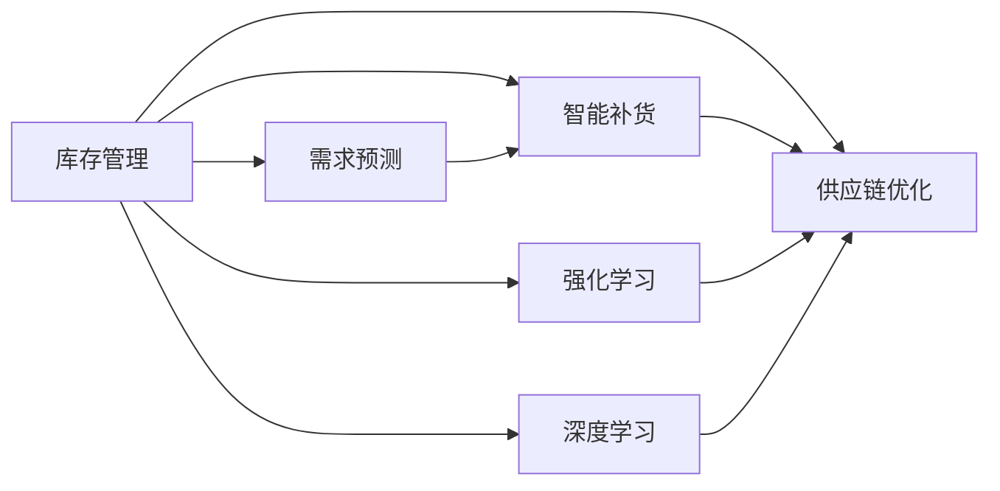

                 

## 1. 背景介绍

### 1.1 问题由来
库存管理是企业生产运营中的一个重要环节，直接影响企业的效率、成本和客户满意度。传统的库存管理方法如经济订货量模型（EOQ）和经典的时序模型，虽然在短期内取得了一些成效，但难以应对市场波动、需求不确定性等因素，无法实现真正的动态优化。

近年来，随着深度学习与强化学习的不断发展，研究人员开始尝试将这些技术应用于库存管理中，以期实现更智能、更高效的库存管理。深度强化学习在库存管理中的应用，能更好地利用数据，自动优化库存水平和订单策略，提升企业的运营效率。

### 1.2 问题核心关键点
深度强化学习在库存管理中的应用，主要集中于以下几个核心关键点：

- **多层次库存优化**：通过多层次模型对库存水平进行综合优化，考虑因素包括需求、订单成本、供应链复杂性等。
- **智能动态补货**：通过智能算法实时调整补货策略，确保库存水平满足需求同时降低成本。
- **需求预测**：利用深度学习模型对市场需求进行预测，减少库存缺货和过剩情况。
- **供应链协同**：通过协同优化供应链中的各个环节，提升整体效率和响应速度。
- **风险管理**：采用强化学习算法对库存管理中的不确定性因素进行建模和优化。

### 1.3 问题研究意义
深度强化学习在库存管理中的应用，对于提升企业的运营效率、降低库存成本、提升客户满意度等方面具有重要意义：

- **提升运营效率**：通过实时优化补货策略，动态调整库存水平，减少库存积压和缺货情况，提升运营效率。
- **降低库存成本**：通过精确的需求预测和动态补货策略，减少过剩和缺货，降低库存持有成本。
- **提升客户满意度**：通过实时响应市场需求，确保产品供应，提升客户满意度。
- **数据驱动决策**：通过深度学习模型对大量历史数据进行挖掘，支持数据驱动的决策。
- **智能自动化**：将复杂的库存管理任务交给算法自动处理，解放人工，提升决策速度和准确性。

## 2. 核心概念与联系

### 2.1 核心概念概述

为更好地理解深度强化学习在库存管理中的应用，本节将介绍几个密切相关的核心概念：

- **强化学习(Reinforcement Learning, RL)**：一种通过智能体与环境的交互，通过奖励和惩罚信号，逐步学习最优决策策略的学习范式。强化学习的应用场景包括自动驾驶、游戏策略优化、推荐系统等。
- **深度学习(Deep Learning, DL)**：一种基于多层神经网络的机器学习方法，通过大量的数据训练模型，提取数据中的高级特征，用于分类、回归、生成等任务。深度学习的应用领域广泛，包括图像识别、语音识别、自然语言处理等。
- **库存管理(Inventory Management)**：指通过控制库存量，确保产品供应同时避免库存积压的运营活动。
- **智能补货(Intelligent Replenishment)**：通过智能算法对补货策略进行优化，实现动态补货。
- **供应链优化(Supply Chain Optimization)**：指对供应链中的各个环节进行优化，提升整体效率。
- **需求预测(Demand Forecasting)**：通过模型对市场需求进行预测，减少库存波动。

这些核心概念之间的逻辑关系可以通过以下Mermaid流程图来展示：



这个流程图展示了一些核心概念及其之间的关系：

1. 库存管理通过需求预测、智能补货、供应链优化等手段进行优化。
2. 需求预测和智能补货都可以通过深度学习模型进行。
3. 供应链优化和需求预测/智能补货的优化过程都依赖于强化学习算法。
4. 深度学习与强化学习相互结合，共同实现库存管理的智能优化。

## 3. 核心算法原理 & 具体操作步骤

### 3.1 算法原理概述

深度强化学习在库存管理中的应用，主要通过智能体（如机器学习模型）与环境（如库存状态）的交互，根据奖励信号，不断优化库存水平和补货策略，以实现最优的库存管理。

形式化地，假设库存系统状态为 $S$，智能体的动作为 $A$，下一个状态为 $S'$，奖励为 $R$。强化学习的目标是通过算法 $π$，最大化未来奖励的期望值：

$$
\max_π \mathbb{E}[\sum_t R(s_t, π(a_t|s_t))]
$$

其中，$\mathbb{E}$ 表示期望值，$R$ 表示奖励函数，$S_t$ 表示状态，$A_t$ 表示动作。在库存管理中，目标是最小化平均库存成本，即最小化期望成本 $C$：

$$
\min_π \mathbb{E}[\sum_t C(s_t, π(a_t|s_t))]
$$

通过强化学习算法，模型能够在不断的试错和反馈中学习到最优的补货策略和库存管理方案。

### 3.2 算法步骤详解

基于深度强化学习的库存管理优化，一般包括以下几个关键步骤：

**Step 1: 确定状态空间和动作空间**

- **状态空间 $S$**：定义库存系统的状态，如库存量、补货成本、需求分布等。
- **动作空间 $A$**：定义智能体的动作空间，如补货量、订单频率等。

**Step 2: 设计奖励函数**

- **奖励函数 $R(s_t, a_t)$**：根据动作 $a_t$ 在状态 $s_t$ 下的效果，设计奖励函数。常见的奖励函数包括：
  - 库存成本奖励：减少库存积压时给予奖励，增加库存积压时给予惩罚。
  - 订单成本奖励：每发一次订单给予奖励，每次延迟订单给予惩罚。
  - 服务水平奖励：满足需求时给予奖励，未满足需求时给予惩罚。

**Step 3: 构建深度学习模型**

- **深度学习模型 $θ$**：构建一个深度神经网络，用于对库存系统的状态进行预测和决策。
- **训练过程**：利用历史数据对模型进行训练，优化模型参数 $θ$，使其在当前状态下，能够选择最优动作。

**Step 4: 执行强化学习算法**

- **策略优化**：通过强化学习算法，不断调整策略 $π$，使得总奖励期望最大化。
- **探索和利用平衡**：在探索未知动作的同时，利用已知的有效动作，寻找最优策略。

**Step 5: 部署和监控**

- **部署**：将优化后的模型部署到实际的库存管理系统中。
- **监控和优化**：实时监控库存系统状态，根据监控结果对模型进行微调，确保其适应性。

### 3.3 算法优缺点

深度强化学习在库存管理中的应用，具有以下优点：

- **数据驱动**：利用历史数据进行训练，能够挖掘数据中的深层次规律，提供数据驱动的决策支持。
- **自适应性强**：通过强化学习算法，模型能够自动适应库存管理中的不确定性和变化。
- **智能优化**：通过智能算法，能够实现库存水平的动态优化，提升效率。

同时，该方法也存在一定的局限性：

- **计算成本高**：训练深度模型需要大量的计算资源和时间。
- **模型复杂度高**：模型需要考虑多种因素，构建复杂的神经网络，增加实现难度。
- **数据需求大**：模型训练需要大量的历史数据，且数据质量对模型的性能有直接影响。
- **解释性不足**：深度强化学习模型通常是黑箱模型，缺乏可解释性。

尽管存在这些局限性，但就目前而言，深度强化学习在库存管理中的应用，仍是最先进、最有效的技术之一。未来相关研究的重点在于如何进一步降低计算成本、提高模型效率、增强可解释性等，以实现更广泛的实际应用。

### 3.4 算法应用领域

基于深度强化学习的库存管理方法，已经在多个行业和场景中得到应用，例如：

- **零售行业**：优化商品库存水平和补货策略，提升销售和库存效率。
- **制造业**：优化零部件库存和生产计划，降低库存成本和生产周期。
- **物流行业**：优化仓库管理和物流配送，提升配送效率和客户满意度。
- **电子商务**：优化库存和订单管理，减少库存积压和缺货情况。
- **医疗行业**：优化药品库存和采购计划，减少药品积压和短缺。

除了上述这些经典应用外，深度强化学习还被创新性地应用到更多场景中，如智能采购、智能库存调度等，为库存管理带来了新的突破。随着深度学习与强化学习的不断进步，相信库存管理技术将在更广泛的领域大放异彩。

## 4. 数学模型和公式 & 详细讲解 & 举例说明

### 4.1 数学模型构建

本节将使用数学语言对深度强化学习在库存管理中的应用进行更加严格的刻画。

假设库存系统的状态为 $S_t=(s_{t-1},d_t)$，其中 $s_{t-1}$ 表示库存量，$d_t$ 表示第 $t$ 时间段的需求。智能体的动作为 $A_t=a_t$，其中 $a_t$ 表示第 $t$ 时间段补货的数量。奖励函数为 $R(s_t, a_t)$，表示动作 $a_t$ 在状态 $s_t$ 下的奖励。模型的目标是最小化平均库存成本 $C$：

$$
\min_π \mathbb{E}[\sum_t C(s_t, π(a_t|s_t))]
$$

其中，平均库存成本 $C$ 可表示为：

$$
C(s_t, a_t) = h(s_t) + r(s_t, a_t)
$$

其中，$h(s_t)$ 表示库存持有成本，$r(s_t, a_t)$ 表示订单成本。

### 4.2 公式推导过程

以下我们以订单成本和库存持有成本为例，推导强化学习中的动态优化公式。

假设库存系统的状态为 $s_t=(s_{t-1},d_t)$，智能体的动作为 $a_t=a$，其中 $a$ 表示补货的数量。订单成本为 $r(s_t, a_t) = k \cdot a_t$，库存持有成本为 $h(s_t) = c \cdot s_t$，其中 $k$ 和 $c$ 为常数。

目标是最小化总成本：

$$
\min_π \mathbb{E}[\sum_t C(s_t, π(a_t|s_t))]
$$

具体地，从状态 $s_{t-1}$ 出发，执行动作 $a_t$，到达下一个状态 $s_t$，奖励为 $R(s_t, a_t)$，总成本为 $C(s_t, a_t)$。目标是最小化未来总成本：

$$
\min_π \mathbb{E}[\sum_t C(s_t, π(a_t|s_t))]
$$

通过引入动态规划的思想，可以将其转化为贝尔曼方程：

$$
V_{t}^{*}(s_{t})=\min _{a} R(s_{t}, a)+\gamma \max _{π} V_{t+1}^{*}(s_{t+1})
$$

其中，$V_t^{*}(s_t)$ 表示在状态 $s_t$ 下，通过最优策略 $\pi$ 可以获得的最大总成本，$\gamma$ 为折现因子。

利用上述公式，可以对库存系统的状态进行动态优化，逐步更新最优策略。

### 4.3 案例分析与讲解

**案例：某零售商库存管理系统优化**

假设某零售商的库存系统状态为 $s_t=(s_{t-1},d_t)$，其中 $s_{t-1}$ 表示库存量，$d_t$ 表示第 $t$ 时间段的需求。智能体的动作为 $a_t=a$，其中 $a$ 表示第 $t$ 时间段补货的数量。订单成本为 $r(s_t, a_t) = k \cdot a_t$，库存持有成本为 $h(s_t) = c \cdot s_t$，其中 $k=10$，$c=0.5$，$\gamma=0.9$。

利用上述公式，构建深度学习模型进行训练，优化库存管理策略。具体步骤如下：

1. 确定状态空间和动作空间。状态空间为 $s_t=(s_{t-1},d_t)$，动作空间为 $a_t=a$。
2. 设计奖励函数 $R(s_t, a_t)$。订单成本为 $r(s_t, a_t) = k \cdot a_t$，库存持有成本为 $h(s_t) = c \cdot s_t$。
3. 构建深度学习模型 $θ$。使用一个深度神经网络，用于对库存系统的状态进行预测和决策。
4. 训练深度学习模型。利用历史数据对模型进行训练，优化模型参数 $θ$，使其在当前状态下，能够选择最优动作。
5. 执行强化学习算法。通过强化学习算法，不断调整策略 $π$，使得总奖励期望最大化。
6. 部署和监控。将优化后的模型部署到实际的库存管理系统中，实时监控库存系统状态，根据监控结果对模型进行微调，确保其适应性。

## 5. 项目实践：代码实例和详细解释说明

### 5.1 开发环境搭建

在进行深度强化学习库存管理项目实践前，我们需要准备好开发环境。以下是使用Python进行TensorFlow开发的环境配置流程：

1. 安装Anaconda：从官网下载并安装Anaconda，用于创建独立的Python环境。

2. 创建并激活虚拟环境：
```bash
conda create -n reinforcement-env python=3.8 
conda activate reinforcement-env
```

3. 安装TensorFlow：根据CUDA版本，从官网获取对应的安装命令。例如：
```bash
conda install tensorflow -c pytorch -c conda-forge
```

4. 安装各类工具包：
```bash
pip install numpy pandas scikit-learn matplotlib tqdm jupyter notebook ipython
```

完成上述步骤后，即可在`reinforcement-env`环境中开始项目实践。

### 5.2 源代码详细实现

下面我们以零售行业的库存管理系统优化为例，给出使用TensorFlow进行强化学习的PyTorch代码实现。

首先，定义库存系统的状态和动作：

```python
import tensorflow as tf
import numpy as np

class InventorySystem:
    def __init__(self, initial_inventory, demand):
        self.inventory = initial_inventory
        self.demand = demand
        self.total_cost = 0
    
    def update_inventory(self, order):
        self.inventory += order
        self.total_cost += self.demand * order
    
    def get_state(self):
        return np.array([self.inventory, self.demand])
    
    def get_total_cost(self):
        return self.total_cost
```

然后，定义强化学习的奖励函数：

```python
def reward(state, action):
    inventory, demand = state
    order = action
    if order <= inventory:
        return -demand * order
    else:
        return -demand * inventory - order
```

接着，定义深度学习模型：

```python
class DNNModel:
    def __init__(self, state_dim, action_dim, learning_rate):
        self.input_dim = state_dim
        self.output_dim = action_dim
        self.learning_rate = learning_rate
        self.model = tf.keras.Sequential([
            tf.keras.layers.Dense(64, activation='relu', input_shape=[state_dim]),
            tf.keras.layers.Dense(32, activation='relu'),
            tf.keras.layers.Dense(action_dim, activation='linear')
        ])
    
    def train(self, states, actions, rewards, next_states, next_rewards):
        with tf.GradientTape() as tape:
            preds = self.model(states)
            loss = tf.reduce_mean(tf.square(preds - actions))
        grads = tape.gradient(loss, self.model.trainable_variables)
        self.model.optimizer.apply_gradients(zip(grads, self.model.trainable_variables))
    
    def predict(self, state):
        return self.model.predict(state)
```

最后，定义强化学习算法的训练过程：

```python
class ReinforcementLearning:
    def __init__(self, model, state_dim, action_dim, learning_rate, discount_factor):
        self.model = model
        self.state_dim = state_dim
        self.action_dim = action_dim
        self.learning_rate = learning_rate
        self.discount_factor = discount_factor
    
    def train(self, states, actions, rewards, next_states, next_rewards):
        for i in range(len(states)):
            state = states[i]
            action = actions[i]
            reward = rewards[i]
            next_state = next_states[i]
            next_reward = next_rewards[i]
            next_action = self.model.predict(next_state)
            next_reward = next_reward * self.discount_factor
            reward = reward + next_reward
            next_action = np.argmax(next_action)
            self.model.train(state, action, reward, next_state, next_action)
    
    def test(self, states):
        actions = []
        for state in states:
            action = np.argmax(self.model.predict(state))
            actions.append(action)
        return actions
```

在上述代码中，我们定义了库存系统的状态、动作和奖励函数，构建了深度学习模型，并实现了强化学习算法的训练和测试过程。在训练过程中，我们利用历史数据对模型进行训练，优化模型参数。在测试过程中，我们利用训练好的模型对新状态进行动作预测，从而实现动态优化。

### 5.3 代码解读与分析

让我们再详细解读一下关键代码的实现细节：

**InventorySystem类**：
- `__init__`方法：初始化库存系统的初始库存量和需求。
- `update_inventory`方法：根据订单更新库存量，并计算总成本。
- `get_state`方法：返回库存系统的当前状态。
- `get_total_cost`方法：返回库存系统的总成本。

**reward函数**：
- 根据当前库存量和订单量，计算奖励值。如果订单量小于库存量，则不惩罚库存持有成本，只惩罚订单成本；如果订单量大于库存量，则惩罚库存持有成本和订单成本。

**DNNModel类**：
- `__init__`方法：初始化深度学习模型的输入维数、输出维数和学习率。
- `train`方法：使用梯度下降算法训练模型，更新模型参数。
- `predict`方法：使用训练好的模型对新状态进行动作预测。

**ReinforcementLearning类**：
- `__init__`方法：初始化强化学习算法的深度学习模型、状态维数、动作维数、学习率和折扣因子。
- `train`方法：使用强化学习算法训练模型，更新模型参数。
- `test`方法：使用训练好的模型对新状态进行动作预测。

可以看到，通过上述代码，我们实现了深度强化学习在库存管理中的应用。在实际应用中，还需要考虑更多因素，如模型的参数设置、数据预处理、奖励函数的设计等，以进一步优化模型性能。

## 6. 实际应用场景

### 6.1 智能动态补货

在零售行业中，动态补货是库存管理中的核心问题。通过强化学习算法，零售商可以实时调整补货策略，确保库存水平满足需求同时降低成本。例如，在电商平台上，可以根据用户的浏览和购买历史数据，使用强化学习算法预测用户需求，动态调整补货量和频率，从而实现最优的库存管理。

### 6.2 供应链协同

在制造业中，供应链的各个环节相互依赖，协同优化是提升整体效率的关键。通过深度强化学习算法，可以优化供应链中的各个环节，如原材料采购、零部件生产、成品配送等，减少库存积压和延迟时间，提升供应链的整体响应速度。例如，可以利用强化学习算法，对供应链中的物流和生产计划进行优化，实时调整各个环节的订单量和交付时间。

### 6.3 需求预测

需求预测是库存管理中的重要环节，准确的预测可以减少库存波动和缺货风险。通过深度强化学习算法，可以构建预测模型，实时更新库存水平和补货策略。例如，在电商平台上，可以使用强化学习算法对用户需求进行预测，动态调整库存量和补货策略，从而实现更精确的需求预测和库存管理。

### 6.4 未来应用展望

随着深度强化学习在库存管理中的应用不断发展，未来将会在更多领域和场景中得到应用，为企业管理和运营带来新的突破。

在智慧物流领域，通过深度强化学习算法，可以优化仓库管理和物流配送，提升配送效率和客户满意度。例如，可以利用强化学习算法，优化仓储布局和拣货策略，减少拣货时间和成本，提升仓库的运营效率。

在智能制造领域，通过深度强化学习算法，可以优化生产计划和供应链管理，提升生产效率和灵活性。例如，可以利用强化学习算法，优化生产线的调度计划，减少生产时间和成本，提升生产效率。

在金融领域，通过深度强化学习算法，可以优化风险管理和投资决策，提升投资回报率和风险控制能力。例如，可以利用强化学习算法，对金融市场进行实时预测和风险管理，优化投资策略和风险控制。

此外，在农业、能源、医疗等众多领域，深度强化学习算法也将得到广泛应用，为各行各业带来新的突破。相信随着技术的不断进步，深度强化学习算法必将在更多领域大放异彩，为人类社会带来新的发展机遇。

## 7. 工具和资源推荐

### 7.1 学习资源推荐

为了帮助开发者系统掌握深度强化学习在库存管理中的应用，这里推荐一些优质的学习资源：

1. 《强化学习与神经网络》书籍：李航、朱进庞著，系统介绍了强化学习的基本概念和神经网络模型的应用。
2. 《深度强化学习》课程：DeepMind开设的在线课程，涵盖强化学习的理论和实践，适合深入学习。
3. 《TensorFlow深度学习》书籍：张正宇、余柯著，系统介绍了TensorFlow的深度学习模型和应用。
4. 《TensorFlow实战深度学习》书籍：贾扬清著，系统介绍了TensorFlow的实际应用案例，适合实战练习。
5. 《Reinforcement Learning with TensorFlow 2.0》书籍：Kyle S望远著，系统介绍了TensorFlow的强化学习算法和应用。

通过对这些资源的学习实践，相信你一定能够快速掌握深度强化学习在库存管理中的应用，并用于解决实际的业务问题。

### 7.2 开发工具推荐

高效的开发离不开优秀的工具支持。以下是几款用于深度强化学习库存管理开发的常用工具：

1. TensorFlow：由Google主导开发的深度学习框架，支持高效的计算图和分布式训练，适合大规模工程应用。
2. PyTorch：Facebook开发的深度学习框架，灵活的计算图和动态图，适合快速迭代研究。
3. OpenAI Gym：开源的强化学习模拟环境，提供了丰富的环境库，支持各种强化学习算法的测试和优化。
4. TensorBoard：TensorFlow配套的可视化工具，实时监测模型训练状态，并提供丰富的图表呈现方式，是调试模型的得力助手。
5. Weights & Biases：模型训练的实验跟踪工具，记录和可视化模型训练过程中的各项指标，方便对比和调优。

合理利用这些工具，可以显著提升深度强化学习库存管理的开发效率，加快创新迭代的步伐。

### 7.3 相关论文推荐

深度强化学习在库存管理中的应用源于学界的持续研究。以下是几篇奠基性的相关论文，推荐阅读：

1. "Q-learning for Supply Chain Optimization"：通过Q-learning算法优化供应链中的各个环节，提升整体效率。
2. "Reinforcement Learning for Inventory Management"：利用强化学习算法优化库存水平和补货策略，降低库存成本。
3. "Deep Reinforcement Learning for Dynamic Inventory Management"：利用深度强化学习算法优化动态库存管理，提升运营效率。
4. "Reinforcement Learning for Demand Forecasting"：利用强化学习算法优化需求预测，减少库存波动和缺货风险。
5. "Deep Reinforcement Learning for Logistics and Distribution Management"：利用深度强化学习算法优化物流和配送管理，提升配送效率和客户满意度。

这些论文代表了大强化学习在库存管理中的应用方向，为后续的研究提供了理论基础和实践指导。

## 8. 总结：未来发展趋势与挑战

### 8.1 研究成果总结

深度强化学习在库存管理中的应用，近年来取得了显著进展，但在实现更广泛、更深入的应用时，仍面临诸多挑战：

- **计算成本高**：训练深度学习模型需要大量的计算资源和时间。
- **模型复杂度高**：构建复杂的深度学习模型，增加实现难度。
- **数据需求大**：需要大量的历史数据，且数据质量对模型的性能有直接影响。
- **可解释性不足**：深度强化学习模型通常是黑箱模型，缺乏可解释性。
- **风险管理不足**：无法有效应对市场波动、需求不确定性等因素。

尽管存在这些挑战，但就目前而言，深度强化学习在库存管理中的应用，仍是最先进、最有效的技术之一。未来相关研究的重点在于如何进一步降低计算成本、提高模型效率、增强可解释性等，以实现更广泛的实际应用。

### 8.2 未来发展趋势

展望未来，深度强化学习在库存管理中的应用，将呈现以下几个发展趋势：

1. **模型简化和优化**：未来的研究将更多关注模型简化和优化，通过参数共享、稀疏化等技术，降低模型的计算复杂度，提高模型效率。
2. **多模态数据融合**：未来的研究将更多关注多模态数据的融合，如将库存数据、物流数据、销售数据等结合，提升整体预测和优化能力。
3. **实时优化**：未来的研究将更多关注实时优化，通过在线学习算法，实时更新模型参数，提升库存管理的实时响应能力。
4. **分布式优化**：未来的研究将更多关注分布式优化，通过多机协同训练，提升算法的计算效率和性能。
5. **动态环境适应**：未来的研究将更多关注动态环境适应，通过动态模型训练和优化，提升模型在变化环境中的适应能力。
6. **可解释性增强**：未来的研究将更多关注可解释性增强，通过引入因果分析、对抗性分析等技术，提高模型的解释能力。

这些趋势将进一步推动深度强化学习在库存管理中的应用，提升模型的性能和实际应用价值。

### 8.3 面临的挑战

尽管深度强化学习在库存管理中的应用取得了一定进展，但在迈向更加智能化、普适化应用的过程中，仍面临诸多挑战：

1. **计算成本高**：训练深度学习模型需要大量的计算资源和时间，尤其是对于大规模数据集的训练，计算成本高昂。
2. **模型复杂度高**：深度强化学习模型通常需要构建复杂的神经网络，增加实现难度。
3. **数据需求大**：深度强化学习模型需要大量的历史数据进行训练，且数据质量对模型的性能有直接影响。
4. **可解释性不足**：深度强化学习模型通常是黑箱模型，缺乏可解释性，难以进行模型调试和优化。
5. **风险管理不足**：深度强化学习模型难以有效应对市场波动、需求不确定性等因素，需要进行更深入的研究。

尽管存在这些挑战，但随着技术的不断进步，相信深度强化学习必将在库存管理中发挥更大的作用，推动企业管理和运营的智能化进程。

### 8.4 研究展望

未来的研究需要在以下几个方面进行探索：

1. **模型简化和优化**：通过参数共享、稀疏化等技术，降低模型的计算复杂度，提高模型效率。
2. **多模态数据融合**：将库存数据、物流数据、销售数据等结合，提升整体预测和优化能力。
3. **实时优化**：通过在线学习算法，实时更新模型参数，提升库存管理的实时响应能力。
4. **分布式优化**：通过多机协同训练，提升算法的计算效率和性能。
5. **动态环境适应**：通过动态模型训练和优化，提升模型在变化环境中的适应能力。
6. **可解释性增强**：通过引入因果分析、对抗性分析等技术，提高模型的解释能力。

这些研究方向将进一步推动深度强化学习在库存管理中的应用，提升模型的性能和实际应用价值。相信随着技术的不断进步，深度强化学习必将在更多领域大放异彩，为人类社会带来新的发展机遇。

## 9. 附录：常见问题与解答

**Q1：深度强化学习在库存管理中的应用是否适用于所有行业？**

A: 深度强化学习在库存管理中的应用，主要适用于需求波动较大的行业，如零售、制造业、物流等。对于需求稳定、产品种类单一的行业，传统经济订货量模型可能更加适用。

**Q2：如何选择深度学习模型的结构？**

A: 深度学习模型的结构选择需要根据具体任务和数据特点进行设计。常用的深度学习模型包括卷积神经网络（CNN）、循环神经网络（RNN）、长短期记忆网络（LSTM）、变换器（Transformer）等。可以根据任务需求和数据特征选择合适的模型结构。

**Q3：如何在训练过程中进行模型优化？**

A: 在训练过程中，可以通过以下方式进行模型优化：
1. 数据增强：通过数据扩充、噪声注入等方式，增加训练数据的多样性。
2. 正则化：使用L2正则、Dropout等技术，避免模型过拟合。
3. 学习率调整：使用学习率衰减、学习率调度等技术，动态调整学习率，提升训练效果。
4. 自适应算法：使用自适应优化算法，如AdaGrad、Adam等，动态调整模型参数。
5. 数据平衡：处理不平衡数据，增加少数类样本的权重，提升模型的泛化能力。

**Q4：如何评估深度强化学习算法的性能？**

A: 评估深度强化学习算法的性能需要综合考虑以下几个指标：
1. 总成本：模型在训练和测试过程中产生的总成本。
2. 库存水平：模型在不同状态下的库存水平，需要满足客户需求。
3. 响应时间：模型在不同状态下的响应时间，需要快速响应订单请求。
4. 准确率：模型在不同状态下的动作预测准确率，需要最大化奖励。
5. 鲁棒性：模型在不同状态下的鲁棒性，需要应对动态环境变化。

**Q5：深度强化学习在库存管理中的应用有哪些具体案例？**

A: 深度强化学习在库存管理中的应用包括：
1. 零售行业：优化商品库存水平和补货策略，提升销售和库存效率。
2. 制造业：优化零部件库存和生产计划，降低库存成本和生产周期。
3. 物流行业：优化仓库管理和物流配送，提升配送效率和客户满意度。
4. 电子商务：优化库存和订单管理，减少库存积压和缺货情况。
5. 医疗行业：优化药品库存和采购计划，减少药品积压和短缺。

通过对这些资源的学习实践，相信你一定能够快速掌握深度强化学习在库存管理中的应用，并用于解决实际的业务问题。

---

作者：禅与计算机程序设计艺术 / Zen and the Art of Computer Programming

