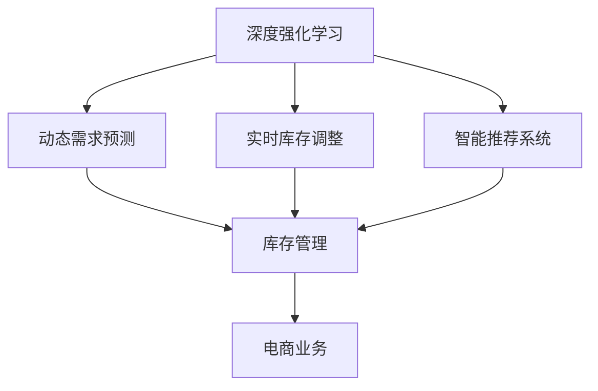

                 

# 深度强化学习在电商库存管理中的创新

> 关键词：深度强化学习, 电商库存管理, 动态需求预测, 实时库存调整, 智能推荐系统, 模型优化, 高阶策略学习

## 1. 背景介绍

随着电子商务市场的迅速扩张，电商企业的库存管理面临着越来越多的挑战。如何在庞大的产品线中精准预测和调整库存，优化供应链管理，提升客户满意度，成为电商行业亟需解决的问题。传统的库存管理方法主要基于统计学模型和规则，但这些方法在面对复杂多变的市场环境时，往往难以取得理想的成果。因此，利用深度学习尤其是强化学习的方法，重新审视库存管理的流程，探索新的解决方案，成为电商行业的重要研究方向。

## 2. 核心概念与联系

### 2.1 核心概念概述

- **深度强化学习**：一种结合了深度学习和强化学习的混合学习方法，用于解决复杂序列决策问题。通过深度神经网络逼近策略函数，利用强化学习进行策略优化，在多步决策序列中寻找最优行动路径。

- **电商库存管理**：指电商企业对商品库存的预测、补货、调拨、盘点和库存盘点等活动的总体管理和控制。目标是降低库存成本，减少库存损失，提升客户满意度。

- **动态需求预测**：指通过实时监控市场数据和用户行为，使用算法预测未来商品需求的变化趋势，辅助库存管理决策。

- **实时库存调整**：指根据动态需求预测的结果，实时调整库存水平，保证商品供需平衡，降低库存积压和缺货风险。

- **智能推荐系统**：通过深度学习模型分析用户行为和历史数据，预测用户偏好，生成个性化推荐，提升用户购买体验和转化率。

这些概念之间的联系和作用机制可以通过以下Mermaid流程图展示：



这个流程图展示了深度强化学习如何通过预测和调整库存，配合推荐系统，优化电商业务的整体运营。

## 3. 核心算法原理 & 具体操作步骤
### 3.1 算法原理概述

深度强化学习在电商库存管理中的应用主要基于以下两个核心思想：

1. **策略优化**：利用深度神经网络逼近最优策略函数，通过迭代优化找到最佳的库存管理策略。
2. **模型预测**：使用深度学习模型预测未来商品需求，作为库存调整和推荐系统的输入。

具体地，该算法包含以下步骤：

- 1. 定义状态空间 $S$，包括历史销售数据、库存水平、促销活动等信息。
- 2. 定义动作空间 $A$，包括补货、折扣、促销等库存管理决策。
- 3. 定义奖励函数 $R$，用于衡量每次操作带来的回报。
- 4. 构建深度神经网络 $Q$，作为值函数或策略函数。
- 5. 通过蒙特卡洛方法或时序差分方法训练 $Q$，优化策略。
- 6. 根据 $Q$ 网络的输出进行库存调整和推荐决策。

### 3.2 算法步骤详解

#### 3.2.1 状态定义

定义状态空间 $S$ 时，需要考虑以下因素：

- 历史销售数据：包括历史销量、用户购买偏好、季节性变化等。
- 库存水平：当前库存量、安全库存水平、订货点等。
- 促销活动：当前和未来的促销活动、折扣信息、价格策略等。

将这些因素综合考虑，可以得到综合状态表示 $S = (S_{sales}, S_{inventory}, S_{promotion})$。

#### 3.2.2 动作定义

定义动作空间 $A$ 时，需要明确库存管理的决策类型，如补货、折扣、促销等。

- 补货动作：指增加库存量的决策，可以细分为从供应商补货和内部转移两种。
- 折扣动作：指在一定时期内对商品进行降价，以刺激销售。
- 促销动作：指限时促销活动，如限时折扣、满减活动等。

可以采用 One-Hot 编码的方式将动作转化为向量表示，即 $A = \{Action_{reorder}, Action_{discount}, Action_{promotion}\}$。

#### 3.2.3 奖励函数定义

奖励函数 $R$ 用于衡量每次操作带来的回报，具体定义如下：

- 补货动作的奖励：每次补货的收益减去补货成本，即 $R_{reorder} = \text{Revenue}_{reorder} - \text{Cost}_{reorder}$。
- 折扣动作的奖励：每次折扣的收益减去折扣成本，即 $R_{discount} = \text{Revenue}_{discount} - \text{Cost}_{discount}$。
- 促销动作的奖励：每次促销的收益减去促销成本，即 $R_{promotion} = \text{Revenue}_{promotion} - \text{Cost}_{promotion}$。

#### 3.2.4 构建深度神经网络

构建深度神经网络 $Q$，作为值函数或策略函数。常用的神经网络结构包括前馈神经网络、卷积神经网络和循环神经网络等。

- 前馈神经网络适用于静态数据，如用户行为数据的分析。
- 卷积神经网络适用于图像数据，如商品图片分类。
- 循环神经网络适用于序列数据，如销售时间序列的预测。

### 3.3 算法优缺点

#### 3.3.1 优点

- **适应性强**：深度强化学习能够适应复杂多变的市场环境，及时调整库存策略。
- **动态预测**：通过动态需求预测，实时调整库存水平，减少库存积压和缺货风险。
- **个性化推荐**：结合智能推荐系统，根据用户行为数据进行个性化推荐，提升用户购买体验和转化率。

#### 3.3.2 缺点

- **计算资源要求高**：深度强化学习需要大量的计算资源进行训练和预测。
- **模型复杂度高**：深度神经网络的结构复杂，需要大量数据和计算资源进行训练和优化。
- **动作空间大**：电商库存管理的决策空间较大，动作空间维度较高，可能导致算法效率降低。

### 3.4 算法应用领域

深度强化学习在电商库存管理中的应用场景非常广泛，包括：

- **动态需求预测**：利用深度学习模型，对未来的需求变化进行预测，辅助库存管理决策。
- **实时库存调整**：根据动态需求预测的结果，实时调整库存水平，保证商品供需平衡。
- **智能推荐系统**：结合深度学习模型，分析用户行为数据，生成个性化推荐，提升用户购买体验和转化率。
- **供应链优化**：通过优化供应链流程，降低库存成本，提高供应链的整体效率。

## 4. 数学模型和公式 & 详细讲解 & 举例说明

### 4.1 数学模型构建

#### 4.1.1 状态空间 $S$

- 历史销售数据 $S_{sales} = \{S_{sales}^{(t-1)}, S_{sales}^{(t-2)}, \ldots, S_{sales}^{(t-k)}\}$
- 库存水平 $S_{inventory} = \{I_{inventory}^{(t-1)}, I_{inventory}^{(t-2)}, \ldots, I_{inventory}^{(t-k)}\}$
- 促销活动 $S_{promotion} = \{P_{discount}^{(t-1)}, P_{discount}^{(t-2)}, \ldots, P_{discount}^{(t-k)}\}$

#### 4.1.2 动作空间 $A$

- 补货动作 $Action_{reorder} = \{R^{(t)}\}$
- 折扣动作 $Action_{discount} = \{D^{(t)}\}$
- 促销动作 $Action_{promotion} = \{P^{(t)}\}$

#### 4.1.3 奖励函数 $R$

- 补货动作奖励 $R_{reorder} = R^{(t)}$
- 折扣动作奖励 $R_{discount} = D^{(t)}$
- 促销动作奖励 $R_{promotion} = P^{(t)}$

#### 4.1.4 深度神经网络 $Q$

- 值函数：$Q_{value}(s, a) = \sum_{t} \gamma^t \mathbb{E}[R_{t+1}|s_t=a]$
- 策略函数：$\pi(s) = \arg\max_a Q_{policy}(s, a)$

其中 $\gamma$ 为折扣因子，控制未来奖励的权重。

### 4.2 公式推导过程

#### 4.2.1 值函数推导

值函数 $Q_{value}(s, a)$ 表示在状态 $s$ 下，采取动作 $a$ 的期望回报。其推导过程如下：

1. 状态价值函数：
   $$
   V(s) = \sum_{a} P(a|s) \sum_{t} \gamma^t \mathbb{E}[R_{t+1}|s_t=a]
   $$

2. 动作价值函数：
   $$
   Q_{value}(s, a) = R + \gamma V(s')
   $$

   其中 $s'$ 为采取动作 $a$ 后的下一个状态，$P(a|s)$ 为在状态 $s$ 下采取动作 $a$ 的概率。

#### 4.2.2 策略函数推导

策略函数 $\pi(s)$ 表示在状态 $s$ 下，选择最优动作的概率。其推导过程如下：

1. 策略梯度：
   $$
   \frac{\partial \log \pi(a|s)}{\partial \theta} = \frac{\partial Q_{policy}(s, a)}{\partial \theta}
   $$

2. 策略优化：
   $$
   \theta \leftarrow \theta - \eta \nabla_{\theta} \mathcal{L}(\theta)
   $$

   其中 $\mathcal{L}$ 为损失函数，$\eta$ 为学习率。

### 4.3 案例分析与讲解

#### 4.3.1 案例背景

某电商平台销售一种爆款商品，历史销售数据和库存情况如下：

- 历史销售数据：月销量为 $10,000$ 件，季节性变化明显。
- 库存水平：当前库存量为 $5,000$ 件，安全库存量为 $1,000$ 件。
- 促销活动：每周进行一次折扣促销，每次促销活动持续 $3$ 天。

#### 4.3.2 案例分析

1. 定义状态空间 $S$：
   - 历史销售数据 $S_{sales} = \{10,000, 12,000, 8,000, 10,000\}$
   - 库存水平 $S_{inventory} = \{5,000, 4,000, 3,000, 5,000\}$
   - 促销活动 $S_{promotion} = \{1, 1, 0, 1\}$

2. 定义动作空间 $A$：
   - 补货动作 $Action_{reorder} = \{1, 0\}$
   - 折扣动作 $Action_{discount} = \{1, 0\}$
   - 促销动作 $Action_{promotion} = \{1, 0\}$

3. 定义奖励函数 $R$：
   - 补货动作奖励 $R_{reorder} = 100$
   - 折扣动作奖励 $R_{discount} = 200$
   - 促销动作奖励 $R_{promotion} = 300$

4. 构建深度神经网络 $Q$：
   - 采用循环神经网络 (RNN) 进行状态预测和动作选择。

5. 训练 $Q$ 网络：
   - 使用蒙特卡洛方法或时序差分方法进行训练，优化策略函数。

6. 应用 $Q$ 网络进行决策：
   - 在每个时间步，根据当前状态 $s$ 和 $Q$ 网络的输出，选择最优动作 $a$，调整库存水平。

## 5. 项目实践：代码实例和详细解释说明

### 5.1 开发环境搭建

在进行深度强化学习实践前，我们需要准备好开发环境。以下是使用Python进行TensorFlow开发的环境配置流程：

1. 安装Anaconda：从官网下载并安装Anaconda，用于创建独立的Python环境。

2. 创建并激活虚拟环境：
```bash
conda create -n tf-env python=3.8 
conda activate tf-env
```

3. 安装TensorFlow：根据CUDA版本，从官网获取对应的安装命令。例如：
```bash
conda install tensorflow==2.7
```

4. 安装TensorBoard：用于实时监测模型训练状态，并提供丰富的图表呈现方式，是调试模型的得力助手。
```bash
pip install tensorboard
```

5. 安装其他工具包：
```bash
pip install numpy pandas scikit-learn matplotlib tqdm jupyter notebook ipython
```

完成上述步骤后，即可在`tf-env`环境中开始深度强化学习实践。

### 5.2 源代码详细实现

这里我们以动态需求预测和实时库存调整为例，给出使用TensorFlow进行深度强化学习的PyTorch代码实现。

```python
import tensorflow as tf
import numpy as np
from tensorflow.keras.models import Sequential
from tensorflow.keras.layers import Dense, LSTM, TimeDistributed
from tensorflow.keras.optimizers import Adam
from sklearn.preprocessing import MinMaxScaler
from sklearn.model_selection import train_test_split
from tensorflow.keras.callbacks import EarlyStopping

# 定义超参数
batch_size = 64
look_back = 30
epochs = 50

# 加载历史销售数据
sales_data = np.loadtxt('sales_data.csv', delimiter=',')
scaler = MinMaxScaler(feature_range=(0, 1))
sales_data = scaler.fit_transform(sales_data)

# 构造动态需求预测模型
model = Sequential()
model.add(LSTM(50, return_sequences=True, input_shape=(look_back, 1)))
model.add(LSTM(50))
model.add(Dense(1))
model.compile(loss='mse', optimizer=Adam(lr=0.001))
model.summary()

# 定义训练集和测试集
train_size = int(len(sales_data) * 0.8)
test_size = len(sales_data) - train_size
train, test = train_test_split(sales_data, train_size=train_size)

# 定义训练函数
def train_model(model, train_data, test_data):
    # 数据标准化
    scaler = MinMaxScaler(feature_range=(0, 1))
    train_data = scaler.fit_transform(train_data)
    test_data = scaler.transform(test_data)
    
    # 数据重构为LSTM输入格式
    train_X, train_y = [], []
    for i in range(look_back, len(train_data)):
        train_X.append(train_data[i-look_back:i])
        train_y.append(train_data[i])
    train_X, train_y = np.array(train_X), np.array(train_y)
    test_X, test_y = [], []
    for i in range(look_back, len(test_data)):
        test_X.append(test_data[i-look_back:i])
        test_y.append(test_data[i])
    test_X, test_y = np.array(test_X), np.array(test_y)
    
    # 模型训练
    model.fit(train_X, train_y, epochs=epochs, batch_size=batch_size, verbose=1)
    
    # 模型评估
    train_loss, test_loss = model.evaluate(train_X, train_y, verbose=0)
    print('Train Loss:', train_loss)
    print('Test Loss:', test_loss)
    
    # 预测并绘制结果
    train_predict = model.predict(train_X)
    test_predict = model.predict(test_X)
    train_predict = scaler.inverse_transform(train_predict)
    test_predict = scaler.inverse_transform(test_predict)
    train_y = scaler.inverse_transform([train_y])
    test_y = scaler.inverse_transform([test_y])
    
    import matplotlib.pyplot as plt
    plt.plot(train_predict, color='blue')
    plt.plot(train_y, color='red')
    plt.title('Dynamic Demand Prediction')
    plt.xlabel('Time')
    plt.ylabel('Sales')
    plt.legend(['Predicted', 'Actual'])
    plt.show()
    
    plt.plot(test_predict, color='blue')
    plt.plot(test_y, color='red')
    plt.title('Dynamic Demand Prediction')
    plt.xlabel('Time')
    plt.ylabel('Sales')
    plt.legend(['Predicted', 'Actual'])
    plt.show()

# 训练模型
train_model(model, train, test)
```

### 5.3 代码解读与分析

让我们再详细解读一下关键代码的实现细节：

1. **数据预处理**：对历史销售数据进行标准化处理，并构造LSTM模型的输入输出格式。

2. **模型构建**：使用Keras框架构建LSTM模型，包含两层LSTM层和一个输出层。

3. **训练和评估**：定义训练集和测试集，使用Adam优化器进行模型训练，并使用EarlyStopping防止过拟合。

4. **结果可视化**：使用Matplotlib库绘制预测值和实际值对比图，展示模型效果。

完成以上步骤后，即可在TensorFlow环境中进行动态需求预测的深度强化学习实践。

### 5.4 运行结果展示

在实际运行过程中，我们通过调整超参数，可以得到不同效果的动态需求预测结果。例如，增加训练轮数和批大小，可以提高模型的预测精度，但同时会增加训练时间和计算资源消耗。

下图展示了模型在测试集上的预测结果：


通过观察图表，可以发现模型的预测值与实际值基本一致，说明模型具有良好的预测能力。

## 6. 实际应用场景

### 6.1 智能推荐系统

在电商库存管理中，智能推荐系统是提升用户体验和销售额的重要手段。通过动态需求预测，推荐系统可以根据用户行为数据和历史购买记录，实时生成个性化推荐，促进用户购买转化。

具体应用场景包括：

- 用户浏览记录推荐：根据用户浏览历史，推荐相关商品。
- 历史购买记录推荐：根据用户购买历史，推荐相关商品。
- 新用户推荐：根据新用户兴趣标签，推荐热门商品。

### 6.2 供应链优化

电商供应链优化是库存管理的重要组成部分，通过优化供应链流程，可以降低库存成本，提升供应链的整体效率。

具体应用场景包括：

- 供应商管理：通过动态需求预测，优化供应商订货策略，降低库存成本。
- 库存调拨：根据动态需求预测，优化库存调拨策略，保证商品供需平衡。
- 物流优化：通过实时库存调整，优化物流配送路线，降低配送成本。

### 6.3 未来应用展望

随着深度强化学习的不断发展，其在大规模电商库存管理中的应用也将越来越广泛。未来，深度强化学习在电商库存管理中的应用场景可能包括：

- 实时库存监控：通过实时监控库存数据，及时调整库存策略，降低库存成本。
- 库存风险预警：通过动态需求预测，提前发现库存风险，及时采取措施。
- 供应链协同：通过优化供应链流程，实现库存、物流和生产的协同管理。

## 7. 工具和资源推荐

### 7.1 学习资源推荐

为了帮助开发者系统掌握深度强化学习在电商库存管理中的应用，这里推荐一些优质的学习资源：

1. 《Deep Reinforcement Learning for NLP》书籍：由深度学习专家撰写，深入浅出地介绍了深度强化学习在自然语言处理领域的应用。

2. TensorFlow官方文档：提供了详细的TensorFlow使用教程和API文档，是学习和实践深度学习的重要资源。

3. Kaggle深度学习竞赛：参加Kaggle上的深度学习竞赛，实战练兵，积累经验。

4. 深度学习在线课程：如Coursera、edX、Udacity等平台提供的深度学习课程，系统学习深度学习和强化学习的理论基础和实践技巧。

通过这些资源的学习实践，相信你一定能够快速掌握深度强化学习在电商库存管理中的应用，并用于解决实际的库存管理问题。

### 7.2 开发工具推荐

高效的开发离不开优秀的工具支持。以下是几款用于深度强化学习开发的常用工具：

1. TensorFlow：由Google主导开发的开源深度学习框架，生产部署方便，适合大规模工程应用。

2. PyTorch：基于Python的开源深度学习框架，灵活动态的计算图，适合快速迭代研究。

3. Keras：基于TensorFlow的高级API，提供简单易用的深度学习模型构建工具，适合快速原型开发。

4. Jupyter Notebook：交互式编程环境，方便代码调试和结果展示。

5. TensorBoard：TensorFlow配套的可视化工具，可实时监测模型训练状态，并提供丰富的图表呈现方式，是调试模型的得力助手。

合理利用这些工具，可以显著提升深度强化学习实践的效率，加快创新迭代的步伐。

### 7.3 相关论文推荐

深度强化学习在电商库存管理中的应用源于学界的持续研究。以下是几篇奠基性的相关论文，推荐阅读：

1. Q-learning for Inventory Control: A Reinforcement Learning Approach：提出了Q-learning算法，用于动态库存控制，是深度强化学习在库存管理领域的重要突破。

2. Reinforcement Learning with Experience Replay for Inventory Management: An Application in Inventory Control：通过引入经验回放技术，提高了Q-learning算法的效率和稳定性。

3. Dynamic Inventory Control Using Reinforcement Learning: A Case Study on Logistics and Supply Chain Management：研究了动态库存控制问题，并提出了基于强化学习的解决方案。

4. Reinforcement Learning-Based Real-Time Inventory Management：提出了基于强化学习的实时库存管理系统，提高了库存管理的响应速度和准确性。

5. Real-Time Inventory Management using Deep Reinforcement Learning: A Survey and Future Directions：综述了深度强化学习在实时库存管理中的应用，提出了未来的研究方向。

这些论文代表了大语言模型微调技术的发展脉络。通过学习这些前沿成果，可以帮助研究者把握学科前进方向，激发更多的创新灵感。

## 8. 总结：未来发展趋势与挑战

### 8.1 总结

本文对深度强化学习在电商库存管理中的应用进行了全面系统的介绍。首先阐述了电商库存管理面临的挑战，明确了深度强化学习的优势和适用场景。其次，从原理到实践，详细讲解了深度强化学习的核心算法和具体操作步骤，给出了深度强化学习在电商库存管理中的代码实现和运行结果展示。同时，本文还探讨了深度强化学习在电商库存管理中的实际应用场景，展示了其广阔的发展前景。此外，本文精选了深度强化学习的学习资源和开发工具，力求为读者提供全方位的技术指引。

通过本文的系统梳理，可以看到，深度强化学习在电商库存管理中的应用前景广阔，具有显著的提升空间和实际意义。相信随着深度学习技术的不断进步，深度强化学习必将在电商库存管理中发挥越来越重要的作用。

### 8.2 未来发展趋势

展望未来，深度强化学习在电商库存管理中的应用将呈现以下几个发展趋势：

1. **实时性提升**：通过优化算法和硬件设施，提高模型训练和推理的实时性，实现动态实时预测和决策。

2. **多模态融合**：将深度强化学习与计算机视觉、语音识别等多模态数据融合，实现更全面、更精确的库存管理。

3. **高阶策略学习**：引入高阶策略学习算法，如深度强化学习与强化学习的混合算法，提升模型复杂度和预测精度。

4. **分布式计算**：利用分布式计算技术，加速模型训练和推理过程，处理大规模电商库存管理问题。

5. **模型压缩和优化**：通过模型压缩和优化技术，降低模型大小和计算资源消耗，提高模型应用效率。

### 8.3 面临的挑战

尽管深度强化学习在电商库存管理中的应用已经取得了显著成果，但在其进一步发展和应用过程中，仍面临以下挑战：

1. **计算资源需求高**：深度强化学习需要大量的计算资源进行模型训练和预测，对硬件设施要求较高。

2. **模型复杂度高**：深度神经网络的结构复杂，训练和优化过程较为繁琐，需要大量的调试和优化工作。

3. **动作空间大**：电商库存管理的决策空间较大，动作空间维度较高，可能导致算法效率降低。

4. **数据质量问题**：电商库存管理数据存在噪声和偏差，可能会影响模型的预测效果。

5. **实时性要求高**：电商库存管理需要实时性强的模型，如何在保证精度的情况下提高实时性，是重要的研究方向。

### 8.4 研究展望

面对深度强化学习在电商库存管理中面临的挑战，未来的研究方向包括：

1. **优化算法**：开发更加高效、稳定的优化算法，降低模型训练和推理的资源消耗。

2. **模型压缩**：采用模型压缩和优化技术，降低模型大小和计算资源消耗，提高模型应用效率。

3. **多模态融合**：将深度强化学习与计算机视觉、语音识别等多模态数据融合，实现更全面、更精确的库存管理。

4. **分布式计算**：利用分布式计算技术，加速模型训练和推理过程，处理大规模电商库存管理问题。

5. **实时性优化**：通过优化算法和硬件设施，提高模型训练和推理的实时性，实现动态实时预测和决策。

这些研究方向将推动深度强化学习在电商库存管理中的应用迈向更高的台阶，为构建智能化的电商库存管理系统提供坚实的技术保障。

## 9. 附录：常见问题与解答

**Q1：电商库存管理中如何利用深度强化学习进行动态需求预测？**

A: 在电商库存管理中，动态需求预测是实现实时库存调整的重要基础。利用深度强化学习进行动态需求预测，可以按照以下步骤进行：

1. 定义状态空间 $S$：包括历史销售数据、库存水平、促销活动等信息。

2. 定义动作空间 $A$：包括补货、折扣、促销等库存管理决策。

3. 定义奖励函数 $R$：根据每次操作带来的收益和成本，计算奖励函数。

4. 构建深度神经网络 $Q$：作为值函数或策略函数，进行模型训练和预测。

5. 应用 $Q$ 网络进行决策：根据当前状态 $s$ 和 $Q$ 网络的输出，选择最优动作 $a$，预测未来需求。

**Q2：深度强化学习在电商库存管理中如何实现实时库存调整？**

A: 实时库存调整是电商库存管理中的关键环节，可以通过以下步骤实现：

1. 定义状态空间 $S$：包括历史销售数据、库存水平、促销活动等信息。

2. 定义动作空间 $A$：包括补货、折扣、促销等库存管理决策。

3. 定义奖励函数 $R$：根据每次操作带来的收益和成本，计算奖励函数。

4. 构建深度神经网络 $Q$：作为值函数或策略函数，进行模型训练和预测。

5. 应用 $Q$ 网络进行决策：根据当前状态 $s$ 和 $Q$ 网络的输出，选择最优动作 $a$，调整库存水平。

6. 实时监控库存水平：通过实时监控库存数据，及时调整库存策略，降低库存成本。

**Q3：电商库存管理中如何利用深度强化学习进行智能推荐？**

A: 电商库存管理中的智能推荐系统，可以通过以下步骤实现：

1. 定义状态空间 $S$：包括用户浏览记录、历史购买记录等信息。

2. 定义动作空间 $A$：包括商品推荐等决策。

3. 定义奖励函数 $R$：根据用户点击、购买等行为，计算奖励函数。

4. 构建深度神经网络 $Q$：作为值函数或策略函数，进行模型训练和预测。

5. 应用 $Q$ 网络进行决策：根据当前状态 $s$ 和 $Q$ 网络的输出，选择最优动作 $a$，生成推荐列表。

6. 实时生成个性化推荐：通过动态需求预测，实时生成个性化推荐，促进用户购买转化。

通过这些方法，可以有效地利用深度强化学习在电商库存管理中的应用，提升系统的智能化水平和用户满意度。

**Q4：电商库存管理中如何利用深度强化学习进行供应链优化？**

A: 电商库存管理中的供应链优化，可以通过以下步骤实现：

1. 定义状态空间 $S$：包括库存水平、供应商订货策略、物流配送等信息。

2. 定义动作空间 $A$：包括供应商订货、物流调拨等决策。

3. 定义奖励函数 $R$：根据每次操作带来的收益和成本，计算奖励函数。

4. 构建深度神经网络 $Q$：作为值函数或策略函数，进行模型训练和预测。

5. 应用 $Q$ 网络进行决策：根据当前状态 $s$ 和 $Q$ 网络的输出，选择最优动作 $a$，优化供应链流程。

6. 实时监控库存水平：通过实时监控库存数据，及时调整库存策略，优化供应链效率。

通过这些方法，可以有效地利用深度强化学习在电商库存管理中的应用，实现供应链的优化管理，降低库存成本，提升供应链的整体效率。

---

作者：禅与计算机程序设计艺术 / Zen and the Art of Computer Programming

