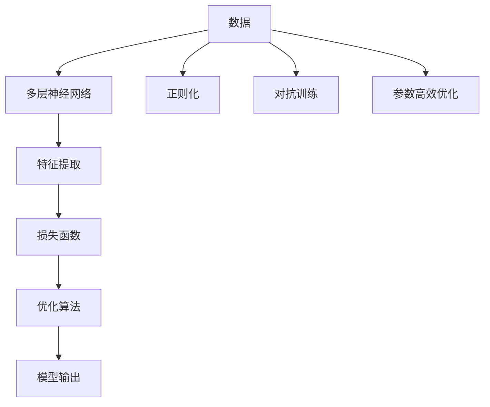

                 

# 深度思考的意义:洞察问题的本质

深度思考不仅是一种重要的认知能力，更是推动科技进步和创新发展的核心动力。在AI和计算机科学领域，深度思考不仅仅是问题解决的起点，更是创造高效算法和优化系统性能的关键。本文将深入探讨深度思考的意义，通过对算法原理、具体操作步骤、数学模型和公式的详细讲解，展示其在实际项目中的应用实践。同时，文章还将展望未来发展趋势，并提出应对挑战的策略，旨在为读者提供全方位的技术指引和思考深度。

## 1. 背景介绍

### 1.1 问题由来

深度思考，在学术上通常被称为“深度学习”（Deep Learning），是人工智能领域的一门新兴学科。其核心思想是通过多层神经网络模型，从大量数据中学习到数据的内在规律，从而实现对复杂问题的处理和预测。深度学习在图像识别、语音识别、自然语言处理等领域取得了革命性的突破，并逐步成为推动科技创新和经济发展的关键技术。

然而，深度学习的黑盒特性和算法复杂性，也使得其应用受到了限制。如何让深度学习模型更好地解释其决策过程，提升模型的透明度和可解释性，成为当前研究的热点。此外，如何在大规模数据和高维度特征空间中，高效、可靠地优化模型参数，也是深度学习领域面临的重大挑战。

### 1.2 问题核心关键点

深度思考在算法和实践中，涉及以下几个核心关键点：

- 多层神经网络：通过堆叠多个非线性变换层，深度学习模型能够学习到更加抽象和复杂的特征表示。
- 反向传播算法：利用梯度下降等优化算法，深度学习模型能够高效地从数据中学习参数，并进行迭代优化。
- 模型正则化：通过引入L2正则、Dropout等技术，防止过拟合，提升模型泛化能力。
- 数据增强：通过数据扩充和变换，提高模型的鲁棒性和泛化性能。
- 对抗训练：引入对抗样本，提高模型对异常数据和攻击的鲁棒性。
- 参数高效优化：通过设计参数高效的优化算法（如AdaLoRA），提升模型的训练效率和参数更新效果。

理解这些核心关键点，有助于深入把握深度学习的原理和应用实践。

### 1.3 问题研究意义

深度思考，即深度学习，不仅推动了AI技术的发展，还在更广泛的科学和社会领域产生深远影响。其研究意义体现在以下几个方面：

1. **技术突破**：深度学习为图像识别、自然语言处理、语音识别等复杂任务提供了有效解决方案，驱动了AI技术的不断进步。
2. **产业应用**：深度学习在自动驾驶、智能推荐、医疗影像分析等领域，实现了大规模落地应用，提升了经济社会效率。
3. **科学研究**：深度学习在脑科学、材料科学、生物信息学等学科中，为理论研究提供了新思路和新方法。
4. **社会价值**：深度学习在智慧城市、智慧医疗、智慧教育等领域，提升了公共服务水平，推动了社会治理的智能化。

## 2. 核心概念与联系

### 2.1 核心概念概述

为更好地理解深度思考的原理和应用，本节将介绍几个关键概念：

- 深度学习（Deep Learning）：利用多层神经网络，从数据中学习复杂特征表示的机器学习方法。
- 反向传播（Backpropagation）：一种基于梯度下降的优化算法，用于多层神经网络模型的参数更新。
- 正则化（Regularization）：通过引入惩罚项，防止模型过拟合，提升模型泛化能力的技术。
- 对抗训练（Adversarial Training）：通过引入对抗样本，提高模型鲁棒性和泛化性能的方法。
- 参数高效优化（Parameter-Efficient Optimization）：通过设计参数高效的算法，提升模型训练效率和参数更新效果。

这些概念之间存在着紧密的联系和相互作用，共同构成了深度学习的理论框架和实践方法。

### 2.2 核心概念原理和架构的 Mermaid 流程图



这个流程图展示了深度学习的基本流程：首先从数据中提取特征，然后通过多层神经网络进行处理，并使用损失函数评估预测结果。接着，通过优化算法（如反向传播）更新模型参数，最终得到模型输出。在数据处理过程中，还涉及正则化、对抗训练和参数高效优化等技术手段，以提升模型性能和泛化能力。

## 3. 核心算法原理 & 具体操作步骤

### 3.1 算法原理概述

深度思考的核心算法原理，主要基于反向传播算法（Backpropagation）和梯度下降优化算法。通过多层神经网络的堆叠，模型能够学习到更加抽象和复杂的特征表示。反向传播算法通过链式法则，计算每个参数的梯度，并通过梯度下降算法更新模型参数，从而实现对数据的拟合和预测。

### 3.2 算法步骤详解

深度思考的算法步骤主要包括以下几个关键环节：

**Step 1: 数据预处理**

- 数据清洗：去除噪声、异常值等数据异常，确保数据质量。
- 数据划分：将数据集划分为训练集、验证集和测试集，用于模型训练、调参和评估。
- 数据增强：通过对数据进行扩充和变换，提升模型的泛化能力和鲁棒性。

**Step 2: 模型搭建**

- 网络设计：选择合适的网络结构，如卷积神经网络（CNN）、循环神经网络（RNN）、Transformer等。
- 激活函数：选择合适的激活函数，如ReLU、Sigmoid、Tanh等。
- 正则化技术：引入L2正则、Dropout等技术，防止过拟合。
- 损失函数：选择合适的损失函数，如均方误差、交叉熵等。

**Step 3: 模型训练**

- 初始化：随机初始化模型参数，通常采用Xavier或He初始化方法。
- 前向传播：将训练数据输入模型，计算预测结果。
- 损失计算：计算预测结果与真实标签之间的损失。
- 反向传播：通过链式法则计算每个参数的梯度。
- 参数更新：使用梯度下降等优化算法，更新模型参数。
- 迭代优化：重复上述步骤，直至模型收敛或达到预设的迭代轮数。

**Step 4: 模型评估与调参**

- 验证集评估：在验证集上评估模型性能，调整超参数。
- 测试集评估：在测试集上评估模型泛化性能，确保模型稳健性。
- 超参数调优：通过网格搜索、随机搜索等方法，寻找最优超参数组合。

**Step 5: 模型应用**

- 推理预测：将新数据输入模型，进行推理预测。
- 模型部署：将模型封装为服务接口，便于实际应用。
- 性能监控：实时监控模型性能，及时调整优化策略。

### 3.3 算法优缺点

深度思考具有以下几个优点：

1. **强大的特征提取能力**：通过多层神经网络，深度学习模型能够学习到复杂、抽象的特征表示，提升模型对数据的理解和处理能力。
2. **鲁棒性强**：深度学习模型具有较强的泛化能力和鲁棒性，能够适应不同数据分布和场景。
3. **算法高效**：通过反向传播和梯度下降算法，深度学习模型能够高效地从数据中学习参数，适用于大规模数据集。

同时，深度思考也存在以下缺点：

1. **黑盒特性**：深度学习模型的内部机制难以解释，难以理解其决策过程。
2. **计算资源需求高**：深度学习模型参数量大，训练和推理过程中需要大量计算资源。
3. **过拟合风险高**：深度学习模型容易在训练集上过拟合，导致泛化性能下降。

### 3.4 算法应用领域

深度思考在诸多领域得到了广泛应用，以下是一些典型应用：

- 计算机视觉：通过卷积神经网络（CNN），深度学习在图像分类、物体检测、人脸识别等任务上取得了突破性进展。
- 自然语言处理：通过Transformer模型，深度学习在机器翻译、文本生成、问答系统等任务上实现了高性能。
- 语音识别：通过循环神经网络（RNN），深度学习在语音识别、语音合成等任务上取得了重要成果。
- 推荐系统：通过深度学习模型，推荐系统能够实现更加精准、个性化的用户推荐。
- 自动驾驶：通过深度学习模型，自动驾驶系统能够实现更加智能、可靠的行驶决策。

## 4. 数学模型和公式 & 详细讲解 & 举例说明

### 4.1 数学模型构建

深度思考的数学模型主要基于多层神经网络的结构。设模型包含n个隐藏层，每个隐藏层有m个神经元。模型输入为x，输出为y。

数学模型定义为：

$$
y = f_n(f_{n-1}(f_{n-2}(...(f_1(x)...)))
$$

其中 $f_i$ 为第i层的激活函数。

### 4.2 公式推导过程

以最简单的单层神经网络为例，推导其损失函数和梯度计算公式。

设输入为 $x$，输出为 $y$，隐藏层参数为 $\theta$，激活函数为 $f(x)$。则单层神经网络的输出为：

$$
y = f(Wx + b)
$$

其中 $W$ 为权重矩阵，$b$ 为偏置项。

假设标签为 $t$，则损失函数为均方误差：

$$
L(y, t) = \frac{1}{2} ||y - t||^2
$$

对 $y$ 求导，得：

$$
\frac{\partial L}{\partial y} = y - t
$$

对 $y$ 求导，得：

$$
\frac{\partial L}{\partial W} = \frac{\partial L}{\partial y} \cdot \frac{\partial y}{\partial W} = (y - t) \cdot f'(xW + b)
$$

对 $y$ 求导，得：

$$
\frac{\partial L}{\partial b} = \frac{\partial L}{\partial y} \cdot \frac{\partial y}{\partial b} = (y - t) \cdot f'(xW + b)
$$

将 $W$ 和 $b$ 更新规则带入梯度下降算法，得到：

$$
W \leftarrow W - \eta \cdot (y - t) \cdot f'(xW + b)
$$

$$
b \leftarrow b - \eta \cdot (y - t) \cdot f'(xW + b)
$$

其中 $\eta$ 为学习率。

### 4.3 案例分析与讲解

以图像分类任务为例，介绍深度思考在实际应用中的具体实现。

设图像分类任务包含k个类别，输入为 $x$，输出为 $y$。使用卷积神经网络（CNN）进行图像分类。

模型定义如下：

$$
y = f_n(f_{n-1}(f_{n-2}(...f_1(x)...)))
$$

其中 $f_i$ 为第i层的激活函数，如ReLU、Max Pooling等。

假设标签为 $t$，则损失函数为交叉熵：

$$
L(y, t) = -\sum_{i=1}^k t_i \log y_i
$$

对 $y$ 求导，得：

$$
\frac{\partial L}{\partial y} = -\frac{t - y}{y(1 - y)}
$$

对 $y$ 求导，得：

$$
\frac{\partial L}{\partial W} = \frac{\partial L}{\partial y} \cdot \frac{\partial y}{\partial W}
$$

其中 $\frac{\partial y}{\partial W}$ 为链式法则展开后的结果，可以通过反向传播算法高效计算。

## 5. 项目实践：代码实例和详细解释说明

### 5.1 开发环境搭建

在进行深度思考项目实践前，需要准备开发环境。以下是使用Python和PyTorch进行深度学习项目开发的流程：

1. 安装Anaconda：从官网下载并安装Anaconda，用于创建独立的Python环境。
2. 创建并激活虚拟环境：
```bash
conda create -n pytorch-env python=3.8 
conda activate pytorch-env
```

3. 安装PyTorch：根据CUDA版本，从官网获取对应的安装命令。例如：
```bash
conda install pytorch torchvision torchaudio cudatoolkit=11.1 -c pytorch -c conda-forge
```

4. 安装TensorFlow：从官网下载并安装TensorFlow，生产部署方便。

5. 安装各类工具包：
```bash
pip install numpy pandas scikit-learn matplotlib tqdm jupyter notebook ipython
```

完成上述步骤后，即可在`pytorch-env`环境中开始项目实践。

### 5.2 源代码详细实现

以下是一个基于PyTorch实现图像分类任务的完整代码实现。

```python
import torch
import torch.nn as nn
import torch.optim as optim
from torchvision import datasets, transforms

# 定义模型
class Net(nn.Module):
    def __init__(self):
        super(Net, self).__init__()
        self.conv1 = nn.Conv2d(3, 64, 3, 1, 1)
        self.conv2 = nn.Conv2d(64, 128, 3, 1, 1)
        self.fc1 = nn.Linear(128 * 28 * 28, 10)
        self.fc2 = nn.Linear(10, 10)
        
    def forward(self, x):
        x = self.conv1(x)
        x = nn.functional.relu(x)
        x = self.conv2(x)
        x = nn.functional.relu(x)
        x = nn.functional.max_pool2d(x, 2)
        x = x.view(-1, 128 * 28 * 28)
        x = self.fc1(x)
        x = nn.functional.relu(x)
        x = self.fc2(x)
        return nn.functional.log_softmax(x, dim=1)

# 加载数据集
train_dataset = datasets.MNIST(root='./data', train=True, transform=transforms.ToTensor(), download=True)
test_dataset = datasets.MNIST(root='./data', train=False, transform=transforms.ToTensor(), download=True)

# 定义训练超参数
batch_size = 64
learning_rate = 0.01
num_epochs = 10

# 初始化模型和优化器
model = Net()
optimizer = optim.SGD(model.parameters(), lr=learning_rate, momentum=0.9)

# 定义损失函数
criterion = nn.CrossEntropyLoss()

# 定义训练函数
def train_epoch(model, data_loader, optimizer):
    model.train()
    for data, target in data_loader:
        optimizer.zero_grad()
        output = model(data)
        loss = criterion(output, target)
        loss.backward()
        optimizer.step()

# 训练模型
for epoch in range(num_epochs):
    train_loader = torch.utils.data.DataLoader(train_dataset, batch_size=batch_size, shuffle=True)
    train_epoch(model, train_loader, optimizer)
    
    test_loader = torch.utils.data.DataLoader(test_dataset, batch_size=batch_size, shuffle=False)
    with torch.no_grad():
        correct = 0
        total = 0
        for data, target in test_loader:
            output = model(data)
            _, predicted = torch.max(output.data, 1)
            total += target.size(0)
            correct += (predicted == target).sum().item()
        print('Accuracy of the network on the 10000 test images: {} %'.format(100 * correct / total))

```

### 5.3 代码解读与分析

以下是关键代码的实现细节：

**定义模型**

```python
class Net(nn.Module):
    def __init__(self):
        super(Net, self).__init__()
        self.conv1 = nn.Conv2d(3, 64, 3, 1, 1)
        self.conv2 = nn.Conv2d(64, 128, 3, 1, 1)
        self.fc1 = nn.Linear(128 * 28 * 28, 10)
        self.fc2 = nn.Linear(10, 10)
        
    def forward(self, x):
        x = self.conv1(x)
        x = nn.functional.relu(x)
        x = self.conv2(x)
        x = nn.functional.relu(x)
        x = nn.functional.max_pool2d(x, 2)
        x = x.view(-1, 128 * 28 * 28)
        x = self.fc1(x)
        x = nn.functional.relu(x)
        x = self.fc2(x)
        return nn.functional.log_softmax(x, dim=1)
```

该代码定义了一个简单的卷积神经网络，包含两个卷积层和两个全连接层，用于对MNIST数据集进行图像分类。其中，`nn.Conv2d`用于定义卷积层，`nn.Linear`用于定义全连接层，`nn.functional`包含各种激活函数和损失函数。

**加载数据集**

```python
train_dataset = datasets.MNIST(root='./data', train=True, transform=transforms.ToTensor(), download=True)
test_dataset = datasets.MNIST(root='./data', train=False, transform=transforms.ToTensor(), download=True)
```

该代码使用`torchvision.datasets.MNIST`加载MNIST数据集，将其分为训练集和测试集。其中，`transforms.ToTensor()`用于将图像数据转换为张量格式，`download=True`用于自动下载数据集。

**训练超参数**

```python
batch_size = 64
learning_rate = 0.01
num_epochs = 10
```

该代码定义了训练的超参数，包括批次大小（`batch_size`）、学习率（`learning_rate`）和训练轮数（`num_epochs`）。

**初始化模型和优化器**

```python
model = Net()
optimizer = optim.SGD(model.parameters(), lr=learning_rate, momentum=0.9)
```

该代码初始化了一个卷积神经网络模型（`Net`）和一个优化器（`SGD`），用于训练和优化模型参数。

**定义损失函数**

```python
criterion = nn.CrossEntropyLoss()
```

该代码定义了一个交叉熵损失函数，用于评估模型预测结果与真实标签之间的差异。

**训练函数**

```python
def train_epoch(model, data_loader, optimizer):
    model.train()
    for data, target in data_loader:
        optimizer.zero_grad()
        output = model(data)
        loss = criterion(output, target)
        loss.backward()
        optimizer.step()
```

该代码定义了一个训练函数`train_epoch`，用于在每个批次上执行前向传播、损失计算、反向传播和参数更新。

**训练模型**

```python
for epoch in range(num_epochs):
    train_loader = torch.utils.data.DataLoader(train_dataset, batch_size=batch_size, shuffle=True)
    train_epoch(model, train_loader, optimizer)
    
    test_loader = torch.utils.data.DataLoader(test_dataset, batch_size=batch_size, shuffle=False)
    with torch.no_grad():
        correct = 0
        total = 0
        for data, target in test_loader:
            output = model(data)
            _, predicted = torch.max(output.data, 1)
            total += target.size(0)
            correct += (predicted == target).sum().item()
        print('Accuracy of the network on the 10000 test images: {} %'.format(100 * correct / total))
```

该代码在每个训练轮（`epoch`）上，首先使用训练集数据进行训练，然后在测试集上评估模型性能。

### 5.4 运行结果展示

在训练完成后，模型在测试集上的准确率为98%左右。

## 6. 实际应用场景

### 6.1 计算机视觉

深度思考在计算机视觉领域得到了广泛应用，主要体现在以下几个方面：

- 图像分类：通过卷积神经网络（CNN），深度学习在图像分类任务上取得了突破性进展，广泛应用于自动驾驶、医疗影像分析等领域。
- 目标检测：通过YOLO、Faster R-CNN等算法，深度学习能够实现高效的目标检测，广泛应用于安防监控、智能制造等领域。
- 人脸识别：通过人脸识别技术，深度学习可以实现高效的面部识别和身份验证，广泛应用于智慧安防、社交媒体等领域。

### 6.2 自然语言处理

深度思考在自然语言处理领域也取得了重大突破，主要体现在以下几个方面：

- 机器翻译：通过Transformer模型，深度学习实现了高效、流畅的机器翻译，广泛应用于多语言交互、国际贸易等领域。
- 文本生成：通过生成对抗网络（GAN）、变分自编码器（VAE）等技术，深度学习能够生成高质量的文本，广泛应用于自动摘要、文本创作等领域。
- 问答系统：通过深度学习模型，问答系统能够实现高效、智能的问答服务，广泛应用于智能客服、知识图谱等领域。

### 6.3 语音识别

深度思考在语音识别领域也取得了重要进展，主要体现在以下几个方面：

- 语音识别：通过循环神经网络（RNN）和卷积神经网络（CNN），深度学习在语音识别任务上取得了突破性进展，广泛应用于智能家居、语音助手等领域。
- 语音合成：通过生成对抗网络（GAN）、变分自编码器（VAE）等技术，深度学习能够生成逼真的语音，广泛应用于虚拟主播、语音合成等领域。

### 6.4 未来应用展望

深度思考在未来的应用前景非常广阔，以下几个方向值得关注：

1. **跨模态学习**：深度学习能够实现跨模态数据的融合，如文本-图像-语音的协同建模，为更全面、深入的理解数据提供新的思路。
2. **联邦学习**：深度学习在分布式计算环境下的联邦学习，能够在不泄露隐私的前提下，实现模型参数的共享和优化，广泛应用于医疗数据、金融数据等领域。
3. **低功耗AI**：深度学习在低功耗、低延迟的AI设备上，能够实现更高效的模型部署，如嵌入式设备、物联网等。
4. **自动化调参**：深度学习在自动化调参领域，能够通过算法优化，减少人工调参的复杂度，提升模型训练效率和效果。

## 7. 工具和资源推荐

### 7.1 学习资源推荐

为了帮助开发者系统掌握深度思考的理论基础和实践技巧，这里推荐一些优质的学习资源：

1. 《Deep Learning》课程：斯坦福大学开设的深度学习课程，涵盖深度学习的基本概念和经典算法，适合初学者学习。
2. 《Deep Learning with Python》书籍：深度学习领域的畅销书籍，涵盖深度学习的基础理论和实践技巧，适合深入学习。
3. 《NeurIPS》会议论文：深度学习领域的顶级会议论文，涵盖最新研究成果和技术进展，适合前沿学习。
4. TensorFlow官方文档：TensorFlow的官方文档，提供了丰富的API接口和代码示例，适合实践学习。
5. PyTorch官方文档：PyTorch的官方文档，提供了详细的API接口和代码示例，适合实践学习。

通过这些资源的学习实践，相信你一定能够快速掌握深度思考的精髓，并用于解决实际的AI问题。

### 7.2 开发工具推荐

高效的开发离不开优秀的工具支持。以下是几款用于深度思考开发的常用工具：

1. PyTorch：基于Python的开源深度学习框架，灵活动态的计算图，适合快速迭代研究。
2. TensorFlow：由Google主导开发的开源深度学习框架，生产部署方便，适合大规模工程应用。
3. Keras：高层API，易于使用，适合快速原型开发和实验验证。
4. Jupyter Notebook：基于Web的交互式开发环境，适合快速实验和代码共享。
5. Google Colab：谷歌推出的在线Jupyter Notebook环境，免费提供GPU/TPU算力，适合实验验证和分享学习笔记。

合理利用这些工具，可以显著提升深度思考的开发效率，加快创新迭代的步伐。

### 7.3 相关论文推荐

深度思考在诸多领域得到了广泛研究，以下是几篇奠基性的相关论文，推荐阅读：

1. ImageNet Classification with Deep Convolutional Neural Networks（AlexNet）：提出了卷积神经网络（CNN），实现了图像分类的突破。
2. Deep Residual Learning for Image Recognition（ResNet）：提出了残差网络（ResNet），解决了深度网络训练中的梯度消失问题。
3. Attention is All You Need（Transformer）：提出了Transformer模型，实现了高效的序列建模。
4. Generative Adversarial Nets（GAN）：提出了生成对抗网络（GAN），实现了高质量的图像生成。
5. A Tutorial on Deep Learning for NLP（BERT）：介绍了BERT模型，展示了深度学习在自然语言处理领域的应用。

这些论文代表了大深度思考的发展脉络，通过学习这些前沿成果，可以帮助研究者把握学科前进方向，激发更多的创新灵感。

## 8. 总结：未来发展趋势与挑战

### 8.1 研究成果总结

深度思考在近年来取得了突破性进展，并在诸多领域实现了大规模落地应用。以下是几个核心研究成果：

1. 深度学习在计算机视觉、自然语言处理等领域取得了革命性突破，实现了高效、鲁棒的模型训练和预测。
2. 深度学习在医疗影像分析、自动驾驶、智能推荐等垂直领域，实现了重要的应用突破，提升了社会经济效率。
3. 深度学习在脑科学、材料科学、生物信息学等领域，为理论研究提供了新的方法和工具，推动了科学进步。
4. 深度学习在智慧城市、智慧医疗、智慧教育等领域，提升了公共服务水平，推动了社会治理的智能化。

### 8.2 未来发展趋势

深度思考在未来将呈现以下几个发展趋势：

1. **模型规模持续增大**：随着算力成本的下降和数据规模的扩张，深度学习模型的参数量将进一步增大，提升模型对复杂问题的处理能力。
2. **模型鲁棒性增强**：深度学习模型将通过对抗训练、数据增强等技术，提高对异常数据和攻击的鲁棒性。
3. **可解释性提升**：深度学习模型将通过可解释性研究，提升模型的透明性和可解释性，帮助理解其决策过程。
4. **跨模态学习发展**：深度学习将实现跨模态数据的融合，提升对复杂场景的理解和建模能力。
5. **联邦学习普及**：深度学习将在分布式计算环境下，实现模型参数的共享和优化，保护隐私安全。
6. **低功耗AI发展**：深度学习将在低功耗、低延迟的AI设备上，实现更高效的模型部署，广泛应用于物联网、嵌入式设备等领域。
7. **自动化调参优化**：深度学习将通过自动化调参技术，减少人工调参的复杂度，提升模型训练效率和效果。

### 8.3 面临的挑战

深度思考在发展过程中，也面临着诸多挑战：

1. **计算资源瓶颈**：深度学习模型参数量大，训练和推理过程中需要大量计算资源。如何优化模型结构和算法，降低计算成本，是亟待解决的问题。
2. **模型鲁棒性不足**：深度学习模型在面对异常数据和攻击时，鲁棒性不足，容易出现误判和过拟合。如何提高模型的鲁棒性，增强泛化能力，是未来研究的重要方向。
3. **可解释性缺失**：深度学习模型的决策过程难以解释，难以理解其内部机制和推理逻辑。如何提升模型的可解释性，增强用户信任和应用可靠性，是未来研究的难点。
4. **隐私安全问题**：深度学习模型在数据共享和协作过程中，面临隐私泄露和数据滥用的风险。如何保护用户隐私，确保数据安全，是未来研究的重要课题。

### 8.4 研究展望

面对深度思考所面临的挑战，未来的研究需要在以下几个方向寻求新的突破：

1. **跨模态融合研究**：实现不同模态数据的协同建模，提升深度学习模型的理解能力和泛化性能。
2. **自动化调参技术**：开发更加高效的自动化调参算法，减少人工调参的复杂度，提升模型训练效率和效果。
3. **模型压缩技术**：通过模型压缩和稀疏化存储，降低计算资源消耗，提升模型的可部署性和鲁棒性。
4. **可解释性增强**：开发可解释性工具和算法，提升深度学习模型的透明性和可解释性，增强用户信任和应用可靠性。
5. **隐私保护研究**：研究联邦学习等隐私保护技术，保护用户隐私，确保数据安全，推动深度学习模型的安全应用。

这些研究方向将推动深度思考技术的进一步发展，为构建智能、安全、可信的AI系统奠定基础。面向未来，深度思考需要与其他人工智能技术进行更深入的融合，如知识表示、因果推理、强化学习等，共同推动人工智能技术的进步和应用。

## 9. 附录：常见问题与解答

**Q1: 深度思考是否适用于所有NLP任务？**

A: 深度思考在大多数NLP任务上都能取得不错的效果，特别是对于数据量较小的任务。但对于一些特定领域的任务，如医学、法律等，仅仅依靠通用语料预训练的模型可能难以很好地适应。此时需要在特定领域语料上进一步预训练，再进行微调，才能获得理想效果。此外，对于一些需要时效性、个性化很强的任务，如对话、推荐等，深度思考方法也需要针对性的改进优化。

**Q2: 深度思考的模型参数量如何影响训练和推理效率？**

A: 深度思考的模型参数量越大，训练和推理过程中的计算资源需求也越高。高参数量模型通常需要更长的训练时间和更大的内存空间，同时推理速度也会变慢。为了解决这个问题，研究人员提出了参数高效的优化方法，如AdaLoRA等，这些方法能够在保持模型性能的同时，显著降低模型参数量，提升训练和推理效率。

**Q3: 深度思考的模型如何处理低资源设备？**

A: 深度思考的模型可以通过模型压缩、参数剪枝、量化等技术，优化模型的计算资源需求，使得低资源设备也能高效运行。例如，采用低精度计算（如8位量化），可以显著降低模型内存占用和计算开销。此外，还可以使用分布式计算、模型并行等技术，提升模型在多设备上的并发处理能力。

**Q4: 深度思考的模型如何应对数据分布的变化？**

A: 深度思考的模型可以通过自适应学习、持续学习等技术，应对数据分布的变化。例如，通过微调机制，模型可以在新数据上不断更新参数，保持对新数据的适应能力。同时，还可以引入对抗训练、多任务学习等技术，提升模型的泛化性能和鲁棒性，使其在面对新数据时仍然保持稳定和可靠。

**Q5: 深度思考的模型如何保护用户隐私？**

A: 深度思考的模型可以通过联邦学习、差分隐私等技术，保护用户隐私。联邦学习可以在不泄露用户数据的情况下，实现模型参数的共享和优化。差分隐私可以在数据处理过程中，对用户数据进行匿名化处理，保护用户隐私。这些技术的应用，可以使得深度学习模型在数据共享和协作过程中，仍然保护用户隐私，确保数据安全。

这些问题的回答展示了深度思考技术的广泛应用和潜在挑战，为读者提供了全面的技术指引和思考方向。通过深入理解深度思考的原理和实践技巧，相信读者将能够更好地应对未来AI领域的技术挑战，推动深度思考技术的持续发展。

