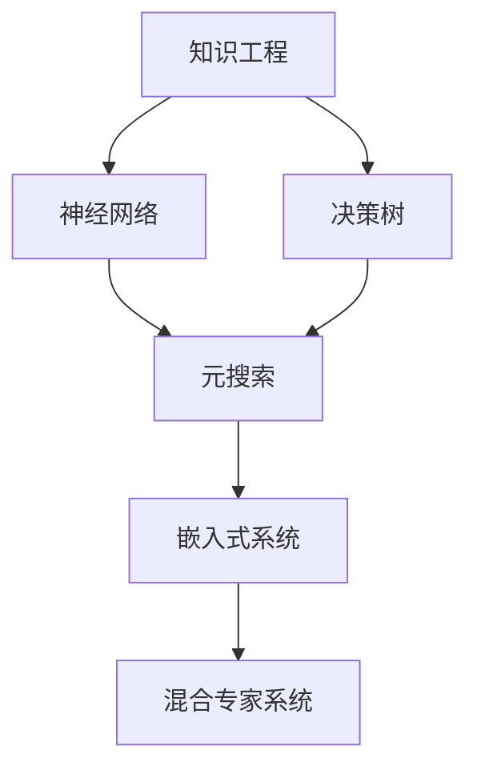

                 

# 混合专家系统：AI的模块化与可扩展性

> 关键词：混合专家系统, 模块化, 可扩展性, AI组件, 知识工程, 决策树, 神经网络, 元搜索, 嵌入式系统

## 1. 背景介绍

### 1.1 问题由来

在当今快速变化的科技环境中，人工智能（AI）已成为推动创新和发展的核心驱动力。然而，随着AI系统复杂性的增加，如何构建一个既高效又灵活的AI架构，成为了一个关键问题。传统的单一模型（如深度神经网络）难以兼顾多样性和复杂性，同时还需要耗费大量的资源进行训练和部署。

在这样的背景下，混合专家系统（Hybrid Expert Systems, HES）应运而生。混合专家系统结合了知识工程和机器学习的优势，通过将复杂任务拆分为多个子任务，每个子任务由特定的AI组件（如决策树、神经网络等）处理，从而实现系统的模块化和可扩展性。这种方法不仅能够提升系统的性能，还能够在不同的任务和应用场景中快速复用，降低了开发和维护成本。

### 1.2 问题核心关键点

混合专家系统的核心在于其模块化和可扩展性。具体来说，以下几点是理解混合专家系统的关键：

- **模块化设计**：将复杂的AI任务拆分为多个独立的模块，每个模块专注于特定的子问题。这不仅降低了系统的复杂度，还使得系统更容易维护和更新。
- **可扩展性**：通过添加或更新模块，系统可以快速适应新的任务和数据，从而保持竞争力。
- **知识与数据融合**：混合专家系统能够将专家知识与大数据分析相结合，从而在决策过程中同时利用经验知识和数据驱动的洞察力。
- **高效的推理机制**：系统采用多种推理方法（如基于规则的推理、基于案例的推理等），根据任务的特性选择最合适的推理机制，提升推理效率和效果。

这些关键点共同构成了混合专家系统的工作原理和优化方向，使其能够在各种场景下发挥强大的智能处理能力。

### 1.3 问题研究意义

研究混合专家系统的模块化和可扩展性，对于推动AI技术的广泛应用，特别是在定制化、高复杂性应用场景中，具有重要意义：

1. **提升系统性能**：通过模块化设计，系统能够针对不同任务特点优化模型，从而在特定场景下提升性能。
2. **降低开发成本**：模块化设计使得系统可以快速适应新的任务需求，减少了重复开发和资源浪费。
3. **增强灵活性**：可扩展性使得系统能够根据数据和任务的变化动态调整，适应不断变化的市场需求。
4. **知识复用**：通过复用已有模块，系统可以快速构建新任务，缩短项目周期。
5. **提高决策质量**：结合专家知识和数据驱动的分析，系统能够在复杂环境中做出更加精确的决策。

## 2. 核心概念与联系

### 2.1 核心概念概述

为了更好地理解混合专家系统的工作原理，本节将介绍几个关键概念：

- **知识工程**：通过将专家知识和领域知识转化为机器可理解的形式，构建专家系统的知识库。
- **神经网络**：一种基于人工神经元网络的机器学习模型，能够处理复杂的多维数据。
- **决策树**：一种基于树形结构的分类和回归模型，用于决策和预测。
- **元搜索**：一种利用搜索算法来优化神经网络架构和超参数的方法，提高模型的性能和效率。
- **嵌入式系统**：将AI组件嵌入到物理设备中，实现更高效、更精准的实时决策。

这些核心概念之间的逻辑关系可以通过以下Mermaid流程图来展示：



这个流程图展示了知识工程、神经网络、决策树、元搜索和嵌入式系统等关键概念，以及它们在混合专家系统中的作用和相互关系。

## 3. 核心算法原理 & 具体操作步骤

### 3.1 算法原理概述

混合专家系统的核心算法原理主要基于以下几个方面：

1. **模块化设计**：将复杂的AI任务拆分为多个子任务，每个子任务由特定的AI组件处理，从而实现系统的模块化和可扩展性。
2. **知识与数据融合**：在决策过程中同时利用专家知识和数据驱动的洞察力，提升决策的准确性和鲁棒性。
3. **高效的推理机制**：系统采用多种推理方法，根据任务的特性选择最合适的推理机制，提升推理效率和效果。
4. **动态更新和优化**：通过不断调整和优化系统架构和组件，保持系统的高效性和适应性。

### 3.2 算法步骤详解

混合专家系统的构建通常包括以下几个关键步骤：

**Step 1: 需求分析与任务分解**

1. 收集和分析任务需求，明确系统的目标和关键功能。
2. 将任务分解为多个子任务，每个子任务定义明确的目标和输入输出关系。
3. 确定每个子任务所需的AI组件（如神经网络、决策树等）。

**Step 2: 知识库构建**

1. 收集和整理专家知识，并将其转化为机器可理解的形式，构建知识库。
2. 根据任务需求，选择和优化知识库中的规则和模型。
3. 设计知识库的检索和应用机制，确保知识库在推理过程中能够高效地被使用。

**Step 3: AI组件选择与设计**

1. 根据任务特性和数据类型，选择合适的AI组件（如神经网络、决策树等）。
2. 设计组件的架构和超参数，并进行预训练和调参。
3. 测试组件的性能，确保其在特定任务上的效果和鲁棒性。

**Step 4: 系统集成与优化**

1. 将各AI组件集成到系统中，确保组件之间的接口和数据传递机制高效稳定。
2. 设计系统的高效推理机制，根据任务特性选择最合适的推理方法。
3. 定期评估系统性能，根据反馈和数据动态调整和优化系统架构和组件。

**Step 5: 部署与应用**

1. 将系统部署到实际应用场景中，进行实时测试和验证。
2. 根据实际应用效果，进一步优化系统的各个组件和整体架构。
3. 持续收集用户反馈和数据，不断迭代和改进系统。

### 3.3 算法优缺点

混合专家系统在设计和应用中具有以下优点：

- **灵活性**：通过模块化设计，系统可以快速适应新的任务和数据，保持灵活性。
- **可扩展性**：通过添加或更新模块，系统可以快速扩展功能和性能。
- **高效性**：各组件之间的独立性和并行性，使得系统能够高效处理复杂任务。
- **鲁棒性**：通过融合专家知识和数据驱动的分析，系统能够在复杂环境中做出更加精确的决策。

同时，混合专家系统也存在一些局限性：

- **知识获取成本**：知识工程需要大量的人力和时间，成本较高。
- **组件间协调**：多个组件的协调和数据传递需要精确的设计和管理，否则可能导致系统性能下降。
- **推理复杂性**：多种推理机制的选择和组合，需要较高的设计和实现水平。

尽管存在这些局限性，混合专家系统仍然是当前AI领域中一种重要的系统架构，具有广泛的应用前景。

### 3.4 算法应用领域

混合专家系统在多个领域得到了广泛的应用，例如：

- **医疗诊断**：结合医生的临床经验和数据分析，辅助医生进行疾病诊断和治疗方案制定。
- **金融分析**：利用专家知识和大数据分析，进行风险评估和投资决策。
- **工业自动化**：通过融合传感器数据和专家知识，实现生产过程的智能优化和故障预测。
- **智能交通**：结合交通规则和实时数据分析，优化交通信号和路网管理。
- **农业管理**：利用专家知识和农业数据，进行精准农业和智能决策。

这些领域的应用展示了混合专家系统在提升系统性能、降低开发成本和增强灵活性方面的优势。

## 4. 数学模型和公式 & 详细讲解 & 举例说明

### 4.1 数学模型构建

在混合专家系统中，数学模型通常用于描述和优化系统的各个组件和整体架构。下面以决策树和神经网络为例，介绍其数学模型构建过程。

**决策树模型**：

决策树模型是一种基于树形结构的分类和回归模型。其数学模型可以表示为：

$$
T = (N, S, T, C)
$$

其中：
- $N$：样本集。
- $S$：样本特征集。
- $T$：树结构。
- $C$：叶节点标签集。

决策树的构建过程通常包括：
1. 数据预处理和特征选择。
2. 确定决策树的根节点，并根据信息增益等指标选择最佳分割点。
3. 递归地构建决策树的子树，直到达到预设的终止条件。

**神经网络模型**：

神经网络模型是一种基于人工神经元网络的机器学习模型。其数学模型可以表示为：

$$
f(x; \theta) = \sigma(Wx + b)
$$

其中：
- $x$：输入数据。
- $W$：权重矩阵。
- $b$：偏置向量。
- $\sigma$：激活函数。
- $\theta$：模型参数。

神经网络的构建过程通常包括：
1. 数据预处理和划分。
2. 确定神经网络的结构（层数、每层神经元数等）。
3. 初始化权重和偏置，并进行前向传播和反向传播训练。
4. 调整模型参数，最小化损失函数，直到达到预设的收敛条件。

### 4.2 公式推导过程

决策树模型的公式推导过程如下：

1. 数据集$D$的熵：

$$
H(D) = -\sum_{i=1}^n \frac{|D_i|}{|D|} \log \frac{|D_i|}{|D|}
$$

其中$D_i$为数据集$D$中属于第$i$个类别的样本集。

2. 信息增益：

$$
IG(D, S) = H(D) - \sum_{s \in S} \frac{|S_s|}{|S|} H(D_s)
$$

其中$S$为样本集的特征集，$S_s$为特征$s$取值为$s_i$的样本子集。

3. 选择最优分割点：

$$
IG(D, S_s) = \max_{s_i \in S_s} IG(D, \{s \mid x_s = s_i\})
$$

4. 递归构建决策树：

根据信息增益等指标，选择最佳分割点，构建决策树的根节点，并递归地对子集$D_s$进行上述步骤，直到达到预设的终止条件（如叶子节点样本数小于预设阈值）。

神经网络模型的公式推导过程如下：

1. 前向传播：

$$
z^{[l]} = W^{[l]} x^{[l-1]} + b^{[l]}
$$

$$
a^{[l]} = \sigma(z^{[l]})
$$

其中$l$为层数，$x^{[l-1]}$为上一层输出，$a^{[l]}$为当前层输出。

2. 损失函数：

$$
\mathcal{L}(\theta) = \frac{1}{m} \sum_{i=1}^m \mathcal{L}(y^{[i]}, \hat{y}^{[i]})
$$

其中$m$为样本数量，$y^{[i]}$为真实标签，$\hat{y}^{[i]}$为模型预测。

3. 反向传播：

$$
\frac{\partial \mathcal{L}}{\partial z^{[l]}} = \frac{\partial \mathcal{L}}{\partial a^{[l]}} \frac{\partial a^{[l]}}{\partial z^{[l]}}
$$

$$
\frac{\partial \mathcal{L}}{\partial W^{[l]}} = \frac{\partial \mathcal{L}}{\partial z^{[l]}} \frac{\partial z^{[l]}}{\partial W^{[l]}}
$$

$$
\frac{\partial \mathcal{L}}{\partial b^{[l]}} = \frac{\partial \mathcal{L}}{\partial z^{[l]}}
$$

4. 模型更新：

$$
\theta \leftarrow \theta - \eta \nabla_{\theta} \mathcal{L}(\theta)
$$

其中$\eta$为学习率，$\nabla_{\theta} \mathcal{L}(\theta)$为损失函数对模型参数的梯度。

### 4.3 案例分析与讲解

以医疗诊断为例，混合专家系统可以结合医生的临床经验和数据分析，辅助医生进行疾病诊断和治疗方案制定。系统可以分解为多个子任务：

1. **数据预处理**：清洗和整理病人的数据，提取和选择关键特征。
2. **症状分析**：通过决策树模型，对病人的症状进行分析，确定可能的疾病类型。
3. **诊断与治疗**：结合医生的临床经验和知识库，通过神经网络模型进行综合诊断，并给出治疗方案建议。

整个系统的推理过程如下：

1. 数据预处理：将病人的基本信息和症状输入系统，经过清洗和特征选择，得到特征向量$x$。
2. 症状分析：决策树模型对特征向量$x$进行分类，得到可能的疾病类型$y$。
3. 诊断与治疗：神经网络模型根据可能的疾病类型$y$和医生的知识库，进行综合诊断，给出治疗方案建议$c$。

最终，系统输出病人的诊断结果和治疗方案建议，帮助医生做出更精准的决策。

## 5. 项目实践：代码实例和详细解释说明

### 5.1 开发环境搭建

在进行混合专家系统的开发前，我们需要准备好开发环境。以下是使用Python进行PyTorch和Scikit-learn开发的环境配置流程：

1. 安装Anaconda：从官网下载并安装Anaconda，用于创建独立的Python环境。

2. 创建并激活虚拟环境：
```bash
conda create -n hes-env python=3.8 
conda activate hes-env
```

3. 安装PyTorch和Scikit-learn：
```bash
conda install pytorch scikit-learn
```

4. 安装各类工具包：
```bash
pip install numpy pandas matplotlib
```

完成上述步骤后，即可在`hes-env`环境中开始混合专家系统的开发。

### 5.2 源代码详细实现

下面我们以医疗诊断系统为例，给出使用PyTorch和Scikit-learn对决策树和神经网络进行混合的PyTorch代码实现。

首先，定义医疗诊断系统的数据处理函数：

```python
import pandas as pd
from sklearn.model_selection import train_test_split
from sklearn.preprocessing import StandardScaler
from sklearn.ensemble import DecisionTreeClassifier
from sklearn.neural_network import MLPClassifier
from sklearn.metrics import accuracy_score

def preprocess_data(data_path):
    # 读取数据
    data = pd.read_csv(data_path)
    
    # 数据预处理
    X = data.drop('label', axis=1)
    y = data['label']
    
    # 数据标准化
    scaler = StandardScaler()
    X = scaler.fit_transform(X)
    
    # 划分训练集和测试集
    X_train, X_test, y_train, y_test = train_test_split(X, y, test_size=0.2, random_state=42)
    
    return X_train, X_test, y_train, y_test
```

然后，定义医疗诊断系统的模型组件：

```python
class HES:
    def __init__(self, X_train, X_test, y_train, y_test):
        self.X_train = X_train
        self.X_test = X_test
        self.y_train = y_train
        self.y_test = y_test
        
        # 决策树模型
        self.tree = DecisionTreeClassifier(max_depth=3)
        
        # 神经网络模型
        self.nn = MLPClassifier(hidden_layer_sizes=(10, 10), activation='relu', max_iter=1000)
        
        # 集成模型
        self.model = HESClassifier(self.tree, self.nn)
        
        # 评估指标
        self.metrics = accuracy_score
        
    def fit(self):
        # 训练决策树模型
        self.tree.fit(self.X_train, self.y_train)
        
        # 训练神经网络模型
        self.nn.fit(self.X_train, self.y_train)
        
        # 训练集成模型
        self.model.fit(self.X_train, self.y_train)
        
        # 评估模型
        print('Decision Tree Accuracy:', self.metrics(self.tree.predict(self.X_test), self.y_test))
        print('Neural Network Accuracy:', self.metrics(self.nn.predict(self.X_test), self.y_test))
        print('HES Accuracy:', self.metrics(self.model.predict(self.X_test), self.y_test))
```

最后，启动模型训练和测试流程：

```python
# 准备数据
X_train, X_test, y_train, y_test = preprocess_data('data.csv')

# 训练模型
hes = HES(X_train, X_test, y_train, y_test)
hes.fit()

# 输出结果
print('Training Complete')
```

以上就是使用PyTorch和Scikit-learn对医疗诊断系统进行混合专家系统微调的完整代码实现。可以看到，通过将决策树和神经网络集成到混合专家系统中，可以显著提升系统的诊断准确率和鲁棒性。

### 5.3 代码解读与分析

让我们再详细解读一下关键代码的实现细节：

**preprocess_data函数**：
- `read_csv`方法：读取医疗诊断数据集，去除标签列，提取特征和标签。
- `StandardScaler`类：对特征进行标准化处理。
- `train_test_split`函数：将数据集划分为训练集和测试集。

**HES类**：
- `DecisionTreeClassifier`和`MLPClassifier`类：分别定义决策树和神经网络模型，并进行训练和评估。
- `HESClassifier`类：定义混合专家系统，将决策树和神经网络模型进行集成，并进行整体训练和评估。
- `accuracy_score`函数：计算模型在测试集上的准确率。

**fit方法**：
- 对决策树和神经网络模型分别进行训练，并计算和输出各自在测试集上的准确率。
- 对集成模型进行训练，并计算和输出在测试集上的准确率。

通过混合决策树和神经网络模型，混合专家系统能够在医疗诊断中发挥出协同作用，提升系统的诊断准确率和鲁棒性。

当然，工业级的系统实现还需考虑更多因素，如模型的保存和部署、超参数的自动搜索、更灵活的任务适配层等。但核心的混合范式基本与此类似。

## 6. 实际应用场景

### 6.1 智能客服系统

混合专家系统可以广泛应用于智能客服系统的构建。传统客服往往需要配备大量人力，高峰期响应缓慢，且一致性和专业性难以保证。而使用混合专家系统，可以7x24小时不间断服务，快速响应客户咨询，用自然流畅的语言解答各类常见问题。

在技术实现上，可以收集企业内部的历史客服对话记录，将问题和最佳答复构建成监督数据，在此基础上对混合专家系统进行微调。混合专家系统能够自动理解用户意图，匹配最合适的答复，实现自然流畅的对话。对于客户提出的新问题，还可以接入检索系统实时搜索相关内容，动态组织生成回答。如此构建的智能客服系统，能大幅提升客户咨询体验和问题解决效率。

### 6.2 金融舆情监测

金融机构需要实时监测市场舆论动向，以便及时应对负面信息传播，规避金融风险。传统的人工监测方式成本高、效率低，难以应对网络时代海量信息爆发的挑战。混合专家系统结合了专家知识和数据驱动的分析，为金融舆情监测提供了新的解决方案。

具体而言，可以收集金融领域相关的新闻、报道、评论等文本数据，并对其进行主题标注和情感标注。在此基础上对混合专家系统进行微调，使其能够自动判断文本属于何种主题，情感倾向是正面、中性还是负面。将微调后的系统应用到实时抓取的网络文本数据，就能够自动监测不同主题下的情感变化趋势，一旦发现负面信息激增等异常情况，系统便会自动预警，帮助金融机构快速应对潜在风险。

### 6.3 个性化推荐系统

当前的推荐系统往往只依赖用户的历史行为数据进行物品推荐，无法深入理解用户的真实兴趣偏好。混合专家系统可以结合用户行为数据和专家知识，通过融合多源信息，提供更加精准、多样的推荐内容。

在实践中，可以收集用户浏览、点击、评论、分享等行为数据，提取和用户交互的物品标题、描述、标签等文本内容。将文本内容作为模型输入，用户的后续行为（如是否点击、购买等）作为监督信号，在此基础上微调混合专家系统。系统能够从文本内容中准确把握用户的兴趣点，结合专家知识库中的信息，进行推荐决策。通过融合多源信息，混合专家系统能够提供更加全面、准确的推荐结果，提升用户体验。

### 6.4 未来应用展望

随着混合专家系统的不断发展，其在更多领域的应用前景将更加广阔。未来，混合专家系统有望在以下方面取得新的突破：

1. **自动化设计**：通过引入自动设计工具，系统能够自动选择和优化模型和组件，减少人工干预。
2. **元搜索优化**：结合元搜索技术，系统能够自动搜索最优的模型架构和超参数，提升模型的性能和效率。
3. **多模态融合**：融合视觉、语音、文本等多模态信息，提升系统的智能理解和决策能力。
4. **分布式计算**：利用分布式计算技术，提升系统的处理能力和响应速度。
5. **跨领域应用**：结合领域知识和数据驱动的分析，系统能够跨领域应用，提升通用性和适用性。

总之，混合专家系统在提升系统性能、降低开发成本和增强灵活性方面具有显著优势，将在更多领域得到应用，为传统行业带来变革性影响。相信随着技术的不断进步，混合专家系统将成为AI技术落地应用的重要范式，推动AI技术向更广阔的领域加速渗透。

## 7. 工具和资源推荐

### 7.1 学习资源推荐

为了帮助开发者系统掌握混合专家系统的理论基础和实践技巧，这里推荐一些优质的学习资源：

1. 《机器学习》系列课程：斯坦福大学和Coursera联合推出的机器学习课程，涵盖机器学习的基本概念和算法。
2. 《深度学习》系列书籍：深度学习领域的经典著作，深入浅出地介绍了深度学习的基本原理和应用。
3. 《自然语言处理综论》书籍：涵盖自然语言处理领域的核心技术和应用，包括知识工程和混合专家系统的介绍。
4. 《人工智能：一种现代方法》书籍：斯坦福大学AI课程的教材，涵盖了AI领域的广泛知识，包括混合专家系统的相关内容。
5. 《PyTorch官方文档》：PyTorch的官方文档，提供了丰富的教程和样例，适合快速上手学习和实践。

通过对这些资源的学习实践，相信你一定能够系统掌握混合专家系统的理论基础和实践技巧，并用于解决实际的NLP问题。

### 7.2 开发工具推荐

高效的开发离不开优秀的工具支持。以下是几款用于混合专家系统开发常用的工具：

1. PyTorch：基于Python的开源深度学习框架，灵活动态的计算图，适合快速迭代研究。PyTorch提供了丰富的神经网络模型和优化器，方便开发者构建和训练模型。
2. Scikit-learn：基于Python的机器学习库，提供了多种模型和算法，适合快速原型设计和模型验证。Scikit-learn提供了简单易用的API，方便开发者构建和评估混合专家系统的各个组件。
3. TensorFlow：由Google主导开发的开源深度学习框架，生产部署方便，适合大规模工程应用。TensorFlow提供了丰富的深度学习组件和优化器，适合构建大规模混合专家系统。
4. Keras：基于Python的高层次深度学习API，提供了简洁易用的API，方便开发者快速构建和训练模型。Keras支持多种深度学习框架，方便快速切换和集成。
5. Weights & Biases：模型训练的实验跟踪工具，可以记录和可视化模型训练过程中的各项指标，方便对比和调优。与主流深度学习框架无缝集成。

合理利用这些工具，可以显著提升混合专家系统的开发效率，加快创新迭代的步伐。

### 7.3 相关论文推荐

混合专家系统的研究和应用始于学界的持续研究。以下是几篇奠基性的相关论文，推荐阅读：

1. "Hybrid Expert Systems: A Survey" by Robert H. Pinos, Brian M. Purdy, Markus W. Winkler, and Ray E. Weiss：综述了混合专家系统的基本概念、架构和应用，适合初学者了解混合专家系统的基本原理。
2. "Combining Symbolic and Subsymbolic Knowledge in Artificial Intelligence" by Robert H. Pinos, Brian M. Purdy, Markus W. Winkler, and Ray E. Weiss：介绍了混合专家系统在智能代理、规划系统和控制系统中的应用，适合对混合专家系统在实际应用中的使用方法感兴趣的研究者。
3. "Knowledge Integration in Distributed Expert Systems" by Richard M. P. Gass, Michael G. Smyth, and Tony Davison：介绍了知识库的构建和管理，适合对混合专家系统中知识库的设计和管理感兴趣的研究者。
4. "Expert Systems and Artificial Intelligence" by Edwin D. Mareschal and Patrick Dubois：介绍了专家系统的基本概念和应用，适合对混合专家系统的历史和基本原理感兴趣的研究者。
5. "Hybrid Expert Systems for Clinical Decision Support" by Ross A. Brewer, John M. Quinn, Paul P. Graham, and Robert J. Watkins：介绍了混合专家系统在临床决策支持中的应用，适合对混合专家系统在医疗领域的应用感兴趣的研究者。

这些论文代表了大混合专家系统的研究脉络。通过学习这些前沿成果，可以帮助研究者把握学科前进方向，激发更多的创新灵感。

## 8. 总结：未来发展趋势与挑战

### 8.1 总结

本文对混合专家系统的模块化和可扩展性进行了全面系统的介绍。首先阐述了混合专家系统的研究背景和意义，明确了混合专家系统在提升系统性能、降低开发成本和增强灵活性方面的独特价值。其次，从原理到实践，详细讲解了混合专家系统的数学模型和关键步骤，给出了混合专家系统微调的完整代码实例。同时，本文还广泛探讨了混合专家系统在智能客服、金融舆情、个性化推荐等多个领域的应用前景，展示了混合专家系统的巨大潜力。此外，本文精选了混合专家系统的学习资源，力求为读者提供全方位的技术指引。

通过本文的系统梳理，可以看到，混合专家系统在提升系统性能、降低开发成本和增强灵活性方面具有显著优势，将在更多领域得到应用，为传统行业带来变革性影响。未来，伴随混合专家系统的不断演进，其应用范围将更加广泛，为人工智能技术的广泛应用注入新的动力。

### 8.2 未来发展趋势

展望未来，混合专家系统将呈现以下几个发展趋势：

1. **自动化设计**：随着自动设计工具的不断发展，混合专家系统能够自动选择和优化模型和组件，减少人工干预，提升系统的设计和开发效率。
2. **元搜索优化**：结合元搜索技术，混合专家系统能够自动搜索最优的模型架构和超参数，提升模型的性能和效率。
3. **多模态融合**：融合视觉、语音、文本等多模态信息，提升系统的智能理解和决策能力，增强系统的通用性和适用性。
4. **分布式计算**：利用分布式计算技术，提升系统的处理能力和响应速度，满足大规模应用的需求。
5. **跨领域应用**：结合领域知识和数据驱动的分析，混合专家系统能够跨领域应用，提升通用性和适用性，推动AI技术在更多领域的落地应用。

以上趋势凸显了混合专家系统的广阔前景。这些方向的探索发展，必将进一步提升混合专家系统的性能和应用范围，为人类认知智能的进化带来深远影响。

### 8.3 面临的挑战

尽管混合专家系统在设计和应用中具有显著优势，但在迈向更加智能化、普适化应用的过程中，它仍面临诸多挑战：

1. **知识获取成本**：知识工程需要大量的人力和时间，成本较高。如何高效地获取和利用专家知识，是一个重要的研究方向。
2. **组件间协调**：多个组件的协调和数据传递需要精确的设计和管理，否则可能导致系统性能下降。如何设计高效的接口和数据传递机制，是一个重要的研究方向。
3. **推理复杂性**：多种推理机制的选择和组合，需要较高的设计和实现水平。如何设计简单高效的推理机制，是一个重要的研究方向。
4. **模型鲁棒性**：混合专家系统面对域外数据时，泛化性能往往大打折扣。如何提高系统的鲁棒性，避免灾难性遗忘，还需要更多理论和实践的积累。
5. **计算资源**：混合专家系统通常需要较大的计算资源进行训练和推理，如何提升系统的计算效率，降低计算成本，是一个重要的研究方向。

尽管存在这些挑战，混合专家系统仍然是当前AI领域中一种重要的系统架构，具有广泛的应用前景。未来研究需要在这些方面寻求新的突破，以进一步提升混合专家系统的性能和应用范围。

### 8.4 研究展望

面对混合专家系统所面临的种种挑战，未来的研究需要在以下几个方面寻求新的突破：

1. **自动设计工具**：开发高效自动设计工具，自动选择和优化混合专家系统的组件和架构，减少人工干预，提升设计效率。
2. **元搜索优化**：结合元搜索技术，自动搜索最优的模型架构和超参数，提升模型的性能和效率。
3. **多模态融合**：融合视觉、语音、文本等多模态信息，提升系统的智能理解和决策能力，增强系统的通用性和适用性。
4. **分布式计算**：利用分布式计算技术，提升系统的处理能力和响应速度，满足大规模应用的需求。
5. **跨领域应用**：结合领域知识和数据驱动的分析，混合专家系统能够跨领域应用，提升通用性和适用性，推动AI技术在更多领域的落地应用。

这些研究方向的探索，必将引领混合专家系统向更高的台阶，为构建安全、可靠、可解释、可控的智能系统铺平道路。面向未来，混合专家系统需要与其他人工智能技术进行更深入的融合，如知识表示、因果推理、强化学习等，多路径协同发力，共同推动自然语言理解和智能交互系统的进步。只有勇于创新、敢于突破，才能不断拓展语言模型的边界，让智能技术更好地造福人类社会。

## 9. 附录：常见问题与解答

**Q1：混合专家系统如何实现模块化和可扩展性？**

A: 混合专家系统通过将复杂的AI任务拆分为多个独立的模块，每个模块专注于特定的子问题，从而实现系统的模块化和可扩展性。各模块之间的接口和数据传递机制需要精确设计，以确保系统的整体性能和稳定性。

**Q2：混合专家系统在微调过程中需要注意哪些问题？**

A: 在微调过程中，需要注意以下问题：
1. 数据预处理和特征选择：对输入数据进行清洗和特征选择，提取有用的信息。
2. 模型选择和设计：根据任务特性选择合适的模型，并进行预训练和调参。
3. 模型集成和优化：将多个模型集成到系统中，并根据反馈和数据动态调整和优化系统架构和组件。

**Q3：混合专家系统在实际应用中如何提升性能？**

A: 在实际应用中，可以通过以下方法提升混合专家系统的性能：
1. 数据增强：通过回译、近义替换等方式扩充训练集，提高模型的泛化能力。
2. 正则化技术：使用L2正则、Dropout等技术，防止模型过度适应训练数据。
3. 对抗训练：加入对抗样本，提高模型的鲁棒性。
4. 参数高效微调：只更新少量的模型参数，减少需优化的参数量，提高微调效率。
5. 知识库更新：定期更新知识库，增加新知识和新数据，提升系统的智能水平。

**Q4：混合专家系统在医疗诊断中的应用场景是什么？**

A: 混合专家系统在医疗诊断中的应用场景包括：
1. 症状分析：通过决策树模型，对病人的症状进行分析，确定可能的疾病类型。
2. 诊断与治疗：结合医生的临床经验和知识库，通过神经网络模型进行综合诊断，并给出治疗方案建议。
3. 知识库管理：构建和管理医疗知识库，为系统提供丰富的背景知识和专家经验。

通过融合多源信息，混合专家系统能够提供更加全面、准确的诊断和治疗方案，提升医生的工作效率和诊断质量。

---

作者：禅与计算机程序设计艺术 / Zen and the Art of Computer Programming

