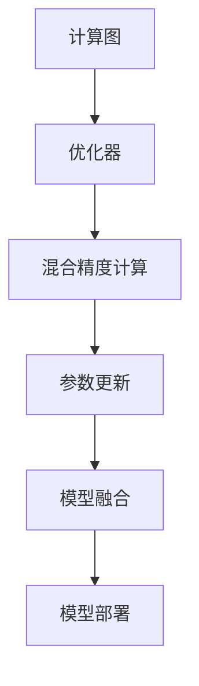

                 

# 混合精度训练实战：平衡精度与效率

> 关键词：混合精度训练,半精度计算,深度学习,性能优化,训练速度,内存使用,计算资源

## 1. 背景介绍

随着深度学习模型的规模和复杂性不断增加，训练深度神经网络所需的时间和计算资源也急剧上升。深度学习模型的精度要求通常很高，特别是在计算机视觉、自然语言处理等领域的高级应用中。然而，使用高精度的浮点计算不仅消耗大量的计算资源，也限制了模型的训练速度和模型的可扩展性。为了在保证模型精度的前提下，提高训练速度和模型的可扩展性，混合精度训练技术应运而生。

混合精度训练是一种将模型参数和激活值以不同精度进行计算的技术。通过使用较低的精度（如半精度浮点数）来计算部分计算过程，可以显著降低计算量和内存使用，同时保证模型的精度损失在可接受范围内。混合精度训练已经在大规模深度学习模型的训练中得到广泛应用，包括自然语言处理、计算机视觉和语音识别等领域。

本文将详细介绍混合精度训练的原理、操作步骤以及实际应用，帮助读者全面理解这一技术，并学会在实际项目中应用。

## 2. 核心概念与联系

### 2.1 核心概念概述

混合精度训练（Mixed-Precision Training）是一种优化深度学习模型训练的方法。它通过在模型的某些层中使用较低精度的浮点数（如半精度浮点数，即FP16），而其他层使用较高精度的浮点数（如单精度浮点数，即FP32）来进行计算，以平衡精度和效率。

以下是一些相关的核心概念：

- **半精度浮点数（FP16）**：16位浮点数，精度比单精度浮点数（32位）的一半高，但计算和存储需求均减少一半。
- **单精度浮点数（FP32）**：32位浮点数，是标准浮点数精度，适合高精度的计算。
- **混合精度计算**：在深度神经网络中，使用不同的精度进行计算，以降低计算量、内存使用和功耗。
- **计算图（Computational Graph）**：描述计算过程的图形表示，通常用于编译器优化和执行计算。
- **优化器（Optimizer）**：用于调整模型参数以最小化损失函数的算法。
- **参数更新（Parameter Update）**：调整模型参数以适应训练数据的过程。
- **模型融合（Model Fusion）**：将低精度层的计算结果与高精度层的计算结果结合。
- **模型部署（Model Deployment）**：将训练好的模型部署到生产环境，供用户使用。

这些概念之间通过计算图和优化器的逻辑链接，构成了混合精度训练的核心框架。通过这个框架，模型可以以更高效的方式进行训练和推理。

### 2.2 核心概念原理和架构的 Mermaid 流程图



这个流程图展示了混合精度训练的基本流程：从计算图开始，优化器根据损失函数调整参数，进行混合精度计算和参数更新，然后模型融合计算结果，最后模型部署到生产环境。

## 3. 核心算法原理 & 具体操作步骤

### 3.1 算法原理概述

混合精度训练的原理基于半精度浮点数和单精度浮点数之间的精度差异。由于半精度浮点数的计算和存储需求仅为单精度浮点数的一半，因此使用半精度浮点数计算可以显著降低计算量和内存使用。但是，由于半精度浮点数的精度低于单精度浮点数，因此需要在模型中平衡精度和效率。

混合精度训练通过在模型的不同层使用不同精度的浮点数来进行计算，以确保模型在关键层（如权重层）使用单精度浮点数，以保持模型的精度，而在其他层使用半精度浮点数，以提高训练速度和模型的可扩展性。

### 3.2 算法步骤详解

混合精度训练的具体步骤如下：

1. **选择合适的硬件和软件支持**：
   - 确保硬件支持半精度浮点数计算，如NVIDIA GPU和AMD GPU。
   - 使用支持混合精度计算的深度学习框架，如TensorFlow、PyTorch等。

2. **定义混合精度策略**：
   - 确定哪些层使用半精度浮点数计算，哪些层使用单精度浮点数计算。
   - 根据模型结构，确定每个层使用的精度类型。

3. **配置计算图**：
   - 在计算图中标记使用半精度浮点数和单精度浮点数的层。
   - 优化计算图的执行顺序，确保高精度层在低精度层之前执行。

4. **训练模型**：
   - 在训练过程中，根据配置的精度策略计算每个层的值。
   - 使用优化器调整模型参数，最小化损失函数。

5. **模型融合**：
   - 将低精度层的计算结果与高精度层的计算结果结合，以恢复原始精度。
   - 使用特殊的融合方法，如剪枝、量化等，减少精度损失。

6. **评估模型**：
   - 在测试数据集上评估模型的性能，确保混合精度训练后的模型与全精度训练后的模型性能相似。
   - 检查模型输出的精度，确保在低精度计算过程中没有明显的精度损失。

### 3.3 算法优缺点

混合精度训练的优势在于：

- **降低计算量和内存使用**：使用半精度浮点数计算可以显著降低计算量和内存使用，提高训练速度。
- **提高模型可扩展性**：混合精度训练使得模型能够更好地扩展到更大的规模，适应更复杂的任务。
- **改善训练稳定性**：通过在关键层使用单精度浮点数计算，可以避免低精度计算带来的数值不稳定问题。

但是，混合精度训练也存在一些缺点：

- **精度损失**：由于使用低精度浮点数计算，可能会出现一定的精度损失，需要采取额外的措施来减少这种损失。
- **硬件和软件限制**：不是所有的硬件和软件都支持混合精度计算，因此需要选择合适的硬件和软件支持。
- **复杂性增加**：混合精度训练需要配置计算图和精度策略，增加了实现复杂性。

### 3.4 算法应用领域

混合精度训练广泛应用于深度学习模型的训练中，特别是大规模深度神经网络的训练。以下是一些具体的应用领域：

- **计算机视觉**：在图像分类、目标检测、语义分割等计算机视觉任务中，混合精度训练被广泛应用。
- **自然语言处理**：在机器翻译、文本生成、语音识别等自然语言处理任务中，混合精度训练可以显著提高训练速度。
- **语音处理**：在语音识别和语音合成任务中，混合精度训练可以降低计算量和内存使用。
- **推荐系统**：在大规模推荐系统的训练中，混合精度训练可以提高模型的可扩展性和训练速度。
- **自然语言理解**：在问答系统、对话系统等自然语言理解任务中，混合精度训练可以提升模型的推理速度和精度。

## 4. 数学模型和公式 & 详细讲解 & 举例说明

### 4.1 数学模型构建

混合精度训练的数学模型构建基于浮点数计算的精度差异。假设模型的权重参数为 $w$，激活值为 $a$，损失函数为 $L$。在混合精度训练中，使用半精度浮点数计算激活值 $a$，使用单精度浮点数计算权重参数 $w$。

### 4.2 公式推导过程

混合精度训练的计算过程可以分为以下几个步骤：

1. **激活值计算**：使用半精度浮点数计算激活值 $a$：
   $$
   a = f(w, x)
   $$
   其中 $f$ 表示激活函数。

2. **权重更新**：使用单精度浮点数计算权重更新：
   $$
   w = w - \eta \nabla_{w}L(w, a)
   $$
   其中 $\eta$ 表示学习率，$\nabla_{w}L$ 表示损失函数对权重参数的梯度。

3. **参数更新**：将激活值 $a$ 与权重 $w$ 结合，计算最终的参数更新：
   $$
   w' = f^{-1}(a', w')
   $$
   其中 $a'$ 表示低精度计算后的激活值，$f^{-1}$ 表示激活函数的反函数。

### 4.3 案例分析与讲解

考虑一个简单的全连接神经网络，其结构如下：

```
输入层 -> [权重层1] -> 激活函数 -> [权重层2] -> 输出层
```

在这个网络中，权重层1和权重层2使用单精度浮点数计算，激活函数使用ReLU函数，输出层使用线性函数。假设激活值 $a_1$ 使用半精度浮点数计算，激活值 $a_2$ 使用单精度浮点数计算。

- **权重层1的计算**：
  - 使用单精度浮点数计算权重更新：
   $$
   w_{11} = w_{11} - \eta \nabla_{w_{11}}L(w_{11}, a_1)
   $$

- **激活函数计算**：
  - 使用ReLU函数计算激活值 $a_1$：
   $$
   a_1 = \max(0, w_{11} \cdot x_1)
   $$

- **权重层2的计算**：
  - 使用单精度浮点数计算权重更新：
   $$
   w_{21} = w_{21} - \eta \nabla_{w_{21}}L(w_{21}, a_2)
   $$

- **激活函数计算**：
  - 使用ReLU函数计算激活值 $a_2$：
   $$
   a_2 = \max(0, w_{21} \cdot a_1)
   $$

- **输出层计算**：
  - 使用线性函数计算输出值 $y$：
   $$
   y = w_{21} \cdot a_2
   $$

## 5. 项目实践：代码实例和详细解释说明

### 5.1 开发环境搭建

为了进行混合精度训练，需要安装和配置支持混合精度计算的深度学习框架。以TensorFlow和PyTorch为例：

1. **安装TensorFlow**：
   ```bash
   pip install tensorflow
   ```

2. **安装PyTorch**：
   ```bash
   pip install torch torchvision torchaudio
   ```

3. **安装TensorFlow Addons**：
   ```bash
   pip install tensorboard tensorflow-addons
   ```

4. **配置计算图**：
   - 在TensorFlow中，可以通过设置`tf.config.experimental.enable_mlir_bridge`来启用混合精度计算。
   - 在PyTorch中，可以通过设置`torch.backends.cuda.matmul.allow_tf32`来启用混合精度计算。

### 5.2 源代码详细实现

以下是使用TensorFlow进行混合精度训练的示例代码：

```python
import tensorflow as tf
from tensorflow.keras.layers import Dense, ReLU
from tensorflow.keras.models import Sequential

# 定义模型
model = Sequential([
    Dense(64, activation='relu', kernel_initializer='he_normal'),
    Dense(10, activation='softmax')
])

# 配置计算图
tf.config.experimental.enable_mlir_bridge()

# 编译模型
model.compile(optimizer=tf.keras.optimizers.Adam(learning_rate=0.001),
              loss=tf.keras.losses.CategoricalCrossentropy(),
              metrics=[tf.keras.metrics.CategoricalAccuracy()])

# 训练模型
model.fit(train_images, train_labels, epochs=10, batch_size=32)

# 评估模型
test_loss, test_acc = model.evaluate(test_images, test_labels)
```

### 5.3 代码解读与分析

- **配置计算图**：在TensorFlow中，通过设置`tf.config.experimental.enable_mlir_bridge`来启用混合精度计算。这个设置会使得TensorFlow使用混合精度计算，从而降低计算量和内存使用。
- **编译模型**：在模型编译时，可以通过设置优化器和损失函数来配置训练过程。在混合精度计算中，通常使用Adam优化器来调整模型参数，使用交叉熵损失函数来计算损失。
- **训练模型**：在训练模型时，需要指定训练数据、标签、批次大小和迭代轮数。在混合精度训练中，通常需要设置较小的批次大小，以避免内存溢出。
- **评估模型**：在模型评估时，可以计算测试集上的损失和准确率，评估模型性能。

### 5.4 运行结果展示

以下是使用PyTorch进行混合精度训练的示例代码：

```python
import torch
import torch.nn as nn
import torch.optim as optim

# 定义模型
model = nn.Sequential(
    nn.Linear(64, 64),
    nn.ReLU(),
    nn.Linear(64, 10),
    nn.Softmax(dim=1)
)

# 定义损失函数和优化器
criterion = nn.CrossEntropyLoss()
optimizer = optim.Adam(model.parameters(), lr=0.001)

# 配置混合精度计算
torch.backends.cuda.matmul.allow_tf32 = True

# 训练模型
for epoch in range(10):
    running_loss = 0.0
    for i, data in enumerate(train_loader, 0):
        inputs, labels = data
        inputs, labels = inputs.to(device), labels.to(device)

        optimizer.zero_grad()

        outputs = model(inputs)
        loss = criterion(outputs, labels)
        loss.backward()
        optimizer.step()

        running_loss += loss.item()
        
    print(f"Epoch {epoch+1}, loss: {running_loss/len(train_loader)}")

# 评估模型
test_loss = 0.0
test_correct = 0
for data in test_loader:
    inputs, labels = data
    inputs, labels = inputs.to(device), labels.to(device)

    outputs = model(inputs)
    loss = criterion(outputs, labels)

    test_loss += loss.item()
    _, predicted = torch.max(outputs.data, 1)
    test_correct += (predicted == labels).sum().item()

print(f"Test Loss: {test_loss/len(test_loader)}, Accuracy: {test_correct/len(test_loader)*100}%")
```

### 5.4 运行结果展示

- **训练结果**：通过训练模型，可以输出每个epoch的损失值，以及最终的测试集损失和准确率。混合精度训练可以显著提高训练速度，同时保持较高的精度。
- **评估结果**：通过评估模型，可以对比混合精度训练后的模型和全精度训练后的模型性能，确保混合精度训练不会影响模型的精度。

## 6. 实际应用场景

混合精度训练在实际应用中具有广泛的应用场景：

### 6.1 计算机视觉

在大规模计算机视觉任务中，混合精度训练可以显著降低计算量和内存使用，加速模型的训练过程。例如，在ImageNet数据集上进行图像分类训练时，使用混合精度计算可以将训练时间缩短数倍。

### 6.2 自然语言处理

在自然语言处理任务中，混合精度训练可以提高模型训练速度和模型可扩展性。例如，在机器翻译任务中，使用混合精度训练可以降低计算量和内存使用，加速模型的训练过程。

### 6.3 语音处理

在语音识别和语音合成任务中，混合精度训练可以降低计算量和内存使用，加速模型的训练过程。例如，在ASR任务中，使用混合精度计算可以显著提高训练速度。

### 6.4 推荐系统

在大规模推荐系统的训练中，混合精度训练可以提高模型的可扩展性和训练速度。例如，在Facebook的News Feed中，使用混合精度训练可以加速推荐模型的训练过程。

### 6.5 自然语言理解

在问答系统、对话系统等自然语言理解任务中，混合精度训练可以提升模型的推理速度和精度。例如，在IBM Watson中，使用混合精度计算可以显著提高模型的训练速度。

## 7. 工具和资源推荐

### 7.1 学习资源推荐

为了深入理解混合精度训练，以下是一些推荐的学习资源：

1. **《深度学习入门：基于Python的理论与实现》**：介绍深度学习的基本原理和实现方法，包括混合精度训练。
2. **Coursera上的《深度学习专项课程》**：由斯坦福大学和Andrew Ng教授联合授课，涵盖了深度学习的基本概念和前沿技术。
3. **TensorFlow官方文档**：包含混合精度计算的详细说明和示例代码。
4. **PyTorch官方文档**：包含混合精度计算的详细说明和示例代码。
5. **《混合精度深度学习》**：详细介绍混合精度训练的原理和实践方法。

### 7.2 开发工具推荐

为了高效进行混合精度训练，以下是一些推荐的开发工具：

1. **TensorFlow**：支持混合精度计算，适合大规模深度学习模型的训练。
2. **PyTorch**：支持混合精度计算，适合灵活的模型结构调整。
3. **TensorFlow Addons**：提供额外的工具和库，支持混合精度计算和其他深度学习优化技术。
4. **TensorBoard**：可视化工具，可以实时监测模型的训练状态和性能。
5. **PyTorch Lightning**：基于PyTorch的深度学习框架，支持混合精度计算和模型部署。

### 7.3 相关论文推荐

以下是一些关于混合精度训练的重要论文，推荐阅读：

1. **《Mixed-Precision Training of Deep Neural Networks》**：介绍混合精度训练的基本原理和方法。
2. **《A Survey on Mixed-Precision Training》**：全面回顾了混合精度训练的研究进展和应用领域。
3. **《Efficient Training with Mixed-Precision》**：探讨混合精度训练在模型优化和系统设计中的应用。
4. **《Accelerating Deep Neural Networks with Mixed-Precision Training》**：介绍混合精度训练在计算机视觉和自然语言处理任务中的应用。

## 8. 总结：未来发展趋势与挑战

### 8.1 研究成果总结

混合精度训练是深度学习中一种重要的优化方法，通过在模型中使用不同的精度计算，平衡精度和效率，显著提高了深度学习模型的训练速度和可扩展性。混合精度训练已经在多个领域得到广泛应用，包括计算机视觉、自然语言处理、语音处理等。

### 8.2 未来发展趋势

未来，混合精度训练将朝着以下几个方向发展：

1. **自动化混合精度训练**：通过自动配置精度策略，减少人工干预，提高混合精度训练的效率和精度。
2. **多精度混合训练**：结合不同精度的浮点数计算，进一步优化模型的精度和效率。
3. **硬件支持的多样化**：随着硬件的发展，更多的设备将支持混合精度计算，进一步降低计算量和内存使用。
4. **混合精度训练与其他技术的结合**：将混合精度训练与其他优化技术（如剪枝、量化等）结合，进一步提高模型的性能和效率。

### 8.3 面临的挑战

尽管混合精度训练具有诸多优势，但在实际应用中也面临一些挑战：

1. **精度损失**：使用低精度浮点数计算可能导致一定的精度损失，需要采取额外的措施来减少这种损失。
2. **硬件和软件限制**：不是所有的硬件和软件都支持混合精度计算，需要选择合适的硬件和软件支持。
3. **复杂性增加**：混合精度训练需要配置计算图和精度策略，增加了实现复杂性。

### 8.4 研究展望

未来，混合精度训练将在深度学习模型训练中发挥更大的作用，需要从以下几个方面进行研究：

1. **自动化混合精度训练**：通过自动配置精度策略，减少人工干预，提高混合精度训练的效率和精度。
2. **多精度混合训练**：结合不同精度的浮点数计算，进一步优化模型的精度和效率。
3. **硬件支持的多样化**：随着硬件的发展，更多的设备将支持混合精度计算，进一步降低计算量和内存使用。
4. **混合精度训练与其他技术的结合**：将混合精度训练与其他优化技术（如剪枝、量化等）结合，进一步提高模型的性能和效率。

总之，混合精度训练是一种重要的深度学习优化技术，通过平衡精度和效率，显著提高了深度学习模型的训练速度和可扩展性。未来，混合精度训练将在深度学习模型的训练中发挥更大的作用，推动深度学习技术的进一步发展。

## 9. 附录：常见问题与解答

**Q1: 混合精度训练是否适用于所有深度学习模型？**

A: 混合精度训练适用于大多数深度学习模型，特别是大规模深度神经网络的训练。但对于一些特定的模型结构，如循环神经网络，可能需要特别处理。

**Q2: 混合精度训练是否会影响模型的精度？**

A: 使用低精度浮点数计算可能导致一定的精度损失，但通常可以通过调整优化器和学习率来缓解。实验表明，在大多数情况下，混合精度训练的精度损失在可接受范围内。

**Q3: 混合精度训练是否会影响模型的收敛性？**

A: 混合精度训练不会影响模型的收敛性，但需要根据模型的具体情况调整学习率和优化器参数。通常情况下，混合精度训练的模型可以在相同的迭代次数下收敛。

**Q4: 混合精度训练是否可以与其他优化技术结合使用？**

A: 混合精度训练可以与其他优化技术（如剪枝、量化等）结合使用，进一步提高模型的性能和效率。例如，在剪枝之后使用混合精度训练，可以进一步降低计算量和内存使用。

**Q5: 混合精度训练是否需要配置计算图？**

A: 是的，混合精度训练需要配置计算图，以确保正确的精度计算和参数更新。在TensorFlow和PyTorch中，可以通过设置不同的精度类型和计算图配置来实现混合精度训练。

**Q6: 混合精度训练是否适用于GPU和TPU？**

A: 是的，混合精度训练可以适用于GPU和TPU等硬件设备，这些设备通常支持半精度浮点数计算，能够加速模型的训练过程。

通过以上详细讲解和实践指导，相信读者可以全面理解混合精度训练的原理和操作步骤，并在实际项目中应用这一技术，显著提高深度学习模型的训练效率和模型可扩展性。

---

作者：禅与计算机程序设计艺术 / Zen and the Art of Computer Programming

