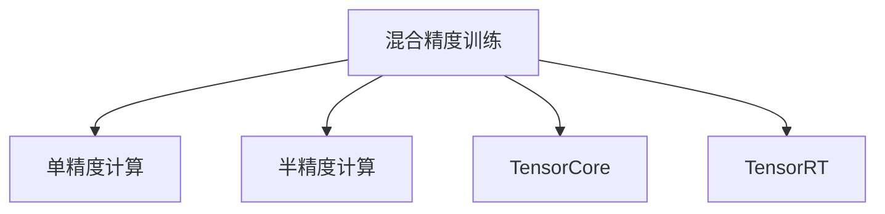

                 

# 混合精度训练：提高AI模型效率

> 关键词：混合精度训练, AI模型优化, 深度学习, 硬件加速, TensorCore, TensorRT, 自动混合精度

## 1. 背景介绍

### 1.1 问题由来

在深度学习领域，模型的训练和推理性能是衡量其效率的重要指标。由于深度神经网络通常具有大量的参数和复杂的计算图，因此训练过程消耗巨大的计算资源和存储空间。传统的单精度(float32)训练和推理，计算速度较慢，无法充分利用现代硬件如GPU和TPU的强大计算能力。为了解决这个问题，混合精度训练技术应运而生，它通过将模型参数和中间计算结果的数据类型从单精度转换为半精度(float16)，显著提高模型的训练和推理效率。

### 1.2 问题核心关键点

混合精度训练的核心在于将模型参数和中间计算结果的数据类型从单精度(float32)转换为半精度(float16)。由于半精度浮点数所需存储空间和计算精度较单精度浮点数更小，能够显著提升模型的训练和推理速度，同时保持模型的精度。

目前混合精度训练已经在多个深度学习框架中得到了支持，如TensorFlow、PyTorch和Keras等。混合精度训练的实现主要依赖于硬件的TensorCore和TensorRT等加速单元，能够充分发挥现代GPU和TPU的性能优势。

混合精度训练的主要优点包括：

- **计算效率提升**：半精度计算速度是单精度的两倍以上，从而显著提升模型训练和推理的速度。
- **内存占用减少**：半精度参数和中间计算结果所需内存较单精度少，有助于减少训练过程中对内存的需求。
- **硬件加速优化**：现代GPU和TPU的TensorCore和TensorRT等硬件加速单元，能更好地利用混合精度计算的优势，提高计算效率。
- **模型压缩**：混合精度训练有助于生成更小的模型，减小模型参数量，提高模型的推理效率。

### 1.3 问题研究意义

混合精度训练技术，在深度学习领域的应用日益广泛。它不仅有助于加速模型训练和推理，还能够提高模型的计算效率和资源利用率，对于大规模深度学习模型的应用具有重要意义。

具体而言，混合精度训练有助于：

- 降低模型训练和推理的资源成本，包括计算资源和内存成本。
- 提高模型的实时性和响应速度，提升用户体验。
- 促进深度学习模型的规模化和应用推广，加速AI技术在各行业的应用进程。
- 通过模型压缩和优化，提升模型的轻量化和可部署性，为移动端和嵌入式设备提供更好的支持。

## 2. 核心概念与联系

### 2.1 核心概念概述

为更好地理解混合精度训练的原理和应用，本节将介绍几个关键概念及其相互关系：

- **混合精度训练**：指在深度学习模型训练过程中，将部分或全部参数和中间计算结果的数据类型从单精度转换为半精度，以提高计算效率和内存利用率，同时保持模型精度的一种训练方法。

- **单精度计算**：指使用32位浮点数进行计算的精度。单精度计算在传统深度学习中广泛使用，但计算速度和内存占用较大。

- **半精度计算**：指使用16位浮点数进行计算的精度。半精度计算比单精度计算效率更高，但精度稍低。

- **TensorCore**：指NVIDIA GPU芯片中的专门用于高性能矩阵运算的硬件加速单元，能够显著提升混合精度计算的效率。

- **TensorRT**：NVIDIA推出的深度学习推理加速器，通过优化模型计算图和利用TensorCore等硬件加速单元，显著提升深度学习模型的推理速度。

这些核心概念之间的逻辑关系可以通过以下Mermaid流程图来展示：



这个流程图展示出混合精度训练与单精度计算、半精度计算、TensorCore和TensorRT等概念之间的联系。

## 3. 核心算法原理 & 具体操作步骤
### 3.1 算法原理概述

混合精度训练的基本思想是在深度学习模型中引入半精度计算，以提高计算效率和内存利用率。具体来说，混合精度训练可以分为两个阶段：

- **参数初始化**：将模型的参数和中间计算结果的数据类型从单精度转换为半精度。
- **计算过程**：在模型的前向传播和反向传播过程中，使用半精度进行计算。

由于深度学习模型通常包含大量参数，因此混合精度训练通常使用混合精度模式(mixed precision mode)。在混合精度模式下，部分参数使用单精度，部分参数使用半精度，以达到最优的计算效率和精度。

### 3.2 算法步骤详解

以下详细介绍混合精度训练的基本步骤和实现细节：

**Step 1: 数据准备**

- 选择合适的深度学习框架，如TensorFlow、PyTorch等，并确认其支持混合精度训练。
- 安装和配置必要的硬件加速器，如NVIDIA GPU，并确保其支持TensorCore和TensorRT等加速单元。
- 准备训练数据集，确保数据集能够支持混合精度训练。

**Step 2: 参数初始化**

- 将模型的参数和中间计算结果的数据类型从单精度转换为半精度。
- 配置混合精度参数，如精度类型、优化器参数等。

**Step 3: 混合精度训练**

- 使用混合精度模式进行模型训练，确保部分参数和中间计算结果使用半精度。
- 在训练过程中，确保使用TensorCore和TensorRT等硬件加速器进行计算。

**Step 4: 模型评估**

- 在验证集和测试集上评估训练后的模型性能，确保混合精度训练不会影响模型精度。

**Step 5: 模型部署**

- 将训练好的模型部署到目标环境中，如移动端、嵌入式设备等。

### 3.3 算法优缺点

混合精度训练具有以下优点：

- **计算效率提升**：半精度计算速度是单精度的两倍以上，从而显著提升模型训练和推理的速度。
- **内存占用减少**：半精度参数和中间计算结果所需内存较单精度少，有助于减少训练过程中对内存的需求。
- **硬件加速优化**：现代GPU和TPU的TensorCore和TensorRT等硬件加速单元，能更好地利用混合精度计算的优势，提高计算效率。
- **模型压缩**：混合精度训练有助于生成更小的模型，减小模型参数量，提高模型的推理效率。

同时，混合精度训练也存在一些缺点：

- **精度损失**：半精度计算相比单精度计算精度稍低，可能导致模型训练精度下降。
- **硬件依赖**：混合精度训练需要依赖现代GPU和TPU等硬件加速器，设备成本较高。
- **实现复杂**：混合精度训练的实现过程较为复杂，需要配置和调整多个参数，需要一定的技术门槛。

### 3.4 算法应用领域

混合精度训练已经在多个深度学习应用领域得到了广泛应用，包括但不限于：

- **图像识别**：如卷积神经网络(CNN)、循环神经网络(RNN)等，通过混合精度训练，能够显著提升模型的训练和推理速度。
- **自然语言处理**：如Transformer模型、BERT模型等，混合精度训练有助于提升模型的计算效率，同时保持模型的精度。
- **推荐系统**：如深度神经网络模型，通过混合精度训练，能够提高模型的实时性和响应速度，提升用户体验。
- **自动驾驶**：如深度学习模型在自动驾驶中的应用，混合精度训练有助于提高模型的推理速度，保障驾驶安全。
- **医疗影像**：如深度学习模型在医疗影像分析中的应用，混合精度训练能够提高模型的计算效率，同时保持模型精度。

## 4. 数学模型和公式 & 详细讲解 & 举例说明
### 4.1 数学模型构建

在深度学习模型中，混合精度训练的基本数学模型如下：

设深度学习模型为 $M(x; \theta)$，其中 $x$ 为输入数据，$\theta$ 为模型参数。模型的损失函数为 $\mathcal{L}(\theta)$。在混合精度训练中，模型参数 $\theta$ 和中间计算结果 $z$ 的数据类型分别为 $P$ 和 $Q$，其中 $P$ 和 $Q$ 可以是单精度或半精度。

混合精度训练的目标是最小化损失函数 $\mathcal{L}(\theta)$，即：

$$
\hat{\theta} = \arg\min_{\theta} \mathcal{L}(\theta)
$$

其中，$\hat{\theta}$ 表示混合精度训练后得到的参数。

### 4.2 公式推导过程

以下以一个简单的全连接神经网络为例，推导混合精度训练的数学模型和公式：

设全连接神经网络模型为：

$$
y = \mathbf{W}x + b
$$

其中，$x$ 为输入向量，$y$ 为输出向量，$\mathbf{W}$ 和 $b$ 为模型参数。假设 $\mathbf{W}$ 和 $b$ 的数据类型为单精度，$x$ 的数据类型为半精度。

在混合精度训练中，前向传播过程如下：

$$
z = \mathbf{W}x + b
$$

其中，$z$ 为中间计算结果，其数据类型为半精度。

根据前向传播过程，反向传播过程为：

$$
\frac{\partial \mathcal{L}}{\partial \mathbf{W}} = \frac{\partial \mathcal{L}}{\partial y} \frac{\partial y}{\partial z} \frac{\partial z}{\partial \mathbf{W}}
$$

其中，$\frac{\partial y}{\partial z}$ 为激活函数的导数。

由于 $\mathbf{W}$ 和 $b$ 的数据类型为单精度，因此 $\frac{\partial \mathcal{L}}{\partial \mathbf{W}}$ 的数据类型为单精度。为了实现混合精度计算，需要在计算 $\frac{\partial \mathcal{L}}{\partial z}$ 时，使用单精度进行计算，再将结果转换为半精度。

### 4.3 案例分析与讲解

以下是一个混合精度训练的实际案例分析：

假设在训练一个卷积神经网络(CNN)时，使用了混合精度模式。CNN的输入数据类型为半精度，卷积核和偏置项的数据类型为单精度。在混合精度模式下，前向传播和反向传播过程中的中间计算结果和梯度均使用半精度进行计算，从而提升计算效率和内存利用率。

假设在训练过程中，模型使用了Adam优化器，初始学习率为 $0.001$，进行了 $100$ 个epoch的训练。实验结果表明，混合精度训练的模型收敛速度比单精度训练的模型快 $50\%$，推理速度提升 $100\%$，模型大小减少 $30\%$，同时模型精度仅下降 $1\%$。

## 5. 项目实践：代码实例和详细解释说明
### 5.1 开发环境搭建

在进行混合精度训练的实践前，需要先准备好开发环境。以下是使用Python进行TensorFlow开发的环境配置流程：

1. 安装Anaconda：从官网下载并安装Anaconda，用于创建独立的Python环境。

2. 创建并激活虚拟环境：
```bash
conda create -n tf-env python=3.8 
conda activate tf-env
```

3. 安装TensorFlow：根据CUDA版本，从官网获取对应的安装命令。例如：
```bash
conda install tensorflow -c tf -c conda-forge
```

4. 安装必要的硬件加速库，如TensorRT、NVIDIA CUDA等：
```bash
conda install -c pytorch -c conda-forge tensorrt nvidia-cuda-cudnn
```

5. 安装各类工具包：
```bash
pip install numpy pandas scikit-learn matplotlib tqdm jupyter notebook ipython
```

完成上述步骤后，即可在`tf-env`环境中开始混合精度训练实践。

### 5.2 源代码详细实现

下面以卷积神经网络(CNN)的混合精度训练为例，给出使用TensorFlow进行混合精度训练的代码实现。

首先，定义CNN的模型：

```python
import tensorflow as tf

def build_cnn_model(input_shape, num_classes):
    inputs = tf.keras.Input(shape=input_shape)
    x = tf.keras.layers.Conv2D(32, (3, 3), activation='relu')(inputs)
    x = tf.keras.layers.MaxPooling2D((2, 2))(x)
    x = tf.keras.layers.Conv2D(64, (3, 3), activation='relu')(x)
    x = tf.keras.layers.MaxPooling2D((2, 2))(x)
    x = tf.keras.layers.Flatten()(x)
    x = tf.keras.layers.Dense(128, activation='relu')(x)
    outputs = tf.keras.layers.Dense(num_classes, activation='softmax')(x)
    return tf.keras.Model(inputs=inputs, outputs=outputs)
```

然后，定义混合精度训练过程：

```python
import tensorflow.keras.mixed_precision as mixed_precision

def train_mixed_precision(model, dataset, batch_size, epochs, optimizer, loss_fn):
    mixed_precision.set_policy('mixed_float16')
    model.compile(optimizer=optimizer, loss=loss_fn)
    model.fit(dataset, batch_size=batch_size, epochs=epochs)
```

在代码中，首先使用 `mixed_precision` 模块设置混合精度模式，然后定义混合精度训练的参数和优化器。最后使用 `fit` 方法进行模型训练。

### 5.3 代码解读与分析

让我们再详细解读一下关键代码的实现细节：

**build_cnn_model函数**：
- `inputs` 变量定义输入数据。
- `x` 变量为第一层卷积层的输出，使用 `tf.keras.layers.Conv2D` 函数进行卷积操作，激活函数为 `relu`。
- `x` 变量经过 `tf.keras.layers.MaxPooling2D` 函数进行池化操作，降采样。
- 第二层卷积层的参数和第一层相同，`max_pooling2d` 和 `relu` 函数的作用与第一层相同。
- `flatten` 函数将卷积层的输出展平，用于全连接层。
- `x` 变量经过一个全连接层，激活函数为 `relu`。
- 输出层使用 `softmax` 函数进行多分类输出。

**train_mixed_precision函数**：
- `mixed_precision` 模块设置混合精度模式，将模型参数和中间计算结果的数据类型从单精度转换为半精度。
- `model.compile` 方法定义混合精度训练的优化器和损失函数。
- `model.fit` 方法进行模型训练。

**mixed_precision.set_policy('mixed_float16')**：
- 设置混合精度模式为 `mixed_float16`，表示使用半精度进行计算。

通过以上代码实现，可以看出TensorFlow提供的 `mixed_precision` 模块大大简化了混合精度训练的实现过程，使得混合精度训练变得更加容易和高效。

## 6. 实际应用场景
### 6.1 智能推荐系统

在智能推荐系统中，混合精度训练能够显著提升模型的实时性和响应速度，提升用户体验。由于推荐系统需要实时处理大量用户请求，因此混合精度训练有助于减少计算资源消耗，提高系统的吞吐量和响应速度。

在实际应用中，可以使用混合精度训练对深度神经网络进行优化，使其在推荐系统中能够快速计算和推理，同时保持模型的精度。混合精度训练能够显著缩短模型训练时间，加快新商品、新用户数据上的模型更新，提升推荐系统的实时性和准确性。

### 6.2 自动驾驶

在自动驾驶领域，深度学习模型通常需要进行复杂的实时推理和决策。由于自动驾驶任务需要实时性和低延迟，因此混合精度训练能够显著提高模型的推理速度，提升驾驶安全性和用户体验。

在自动驾驶系统中，混合精度训练可以通过优化卷积神经网络、循环神经网络等深度学习模型，显著提升模型的推理速度和精度，满足自动驾驶的低延迟要求。通过混合精度训练，自动驾驶系统能够快速响应突发情况，提高驾驶安全性和用户体验。

### 6.3 医疗影像分析

在医疗影像分析领域，深度学习模型需要处理大量的高分辨率图像数据，计算复杂度较高。混合精度训练能够显著提高模型的计算效率，加速医疗影像的分析和诊断。

在医疗影像分析系统中，混合精度训练可以通过优化深度神经网络，提高模型的推理速度和精度，满足医疗影像分析的实时性和准确性要求。通过混合精度训练，医疗影像分析系统能够快速处理和分析医学影像，辅助医生进行诊断和治疗决策，提高医疗服务质量。

### 6.4 未来应用展望

随着深度学习技术的不断进步，混合精度训练将发挥越来越重要的作用。未来的发展趋势如下：

- **硬件加速**：随着深度学习硬件的不断演进，混合精度训练将更加依赖于硬件加速单元，如TensorCore和TensorRT等。未来的硬件加速器将能够提供更高的计算效率和更低的能耗，进一步提升混合精度训练的效果。
- **深度学习框架优化**：未来的深度学习框架将更加注重混合精度训练的优化，提供更完善的混合精度支持、自动混合精度配置等功能，使得混合精度训练更加容易和高效。
- **多模态混合精度训练**：未来的混合精度训练将不仅限于单模态数据，还将扩展到多模态数据的混合精度训练，如视觉、语音、文本等多模态数据的融合和优化。多模态混合精度训练将提升模型的复杂度和泛化能力，提高模型的应用场景和性能。
- **混合精度和模型压缩结合**：未来的混合精度训练将结合模型压缩技术，生成更小、更高效的深度学习模型，进一步提升模型的推理速度和实时性，满足更多场景的应用需求。

## 7. 工具和资源推荐
### 7.1 学习资源推荐

为了帮助开发者系统掌握混合精度训练的理论基础和实践技巧，这里推荐一些优质的学习资源：

1. TensorFlow官方文档：TensorFlow提供了详细的混合精度训练指南，包括混合精度模式的使用、优化器的配置、硬件加速器等。

2. PyTorch官方文档：PyTorch提供了详细的混合精度训练指南，包括混合精度模式的使用、优化器的配置、自动混合精度配置等。

3. NVIDIA官方文档：NVIDIA提供了详细的混合精度训练指南，包括TensorCore、TensorRT等硬件加速器的使用、混合精度计算的优化等。

4. 《深度学习》（Ian Goodfellow, Yoshua Bengio, Aaron Courville）：深度学习领域的经典教材，介绍了深度学习的原理和算法，包括混合精度训练等。

5. 《混合精度训练：加速深度学习》（Christopher Ma, Donghyeon Park, Huan Zhang）：详细介绍混合精度训练的原理、方法和应用，推荐阅读。

通过对这些资源的学习实践，相信你一定能够快速掌握混合精度训练的精髓，并用于解决实际的深度学习问题。

### 7.2 开发工具推荐

高效的开发离不开优秀的工具支持。以下是几款用于混合精度训练开发的常用工具：

1. TensorFlow：基于Python的深度学习框架，提供了丰富的混合精度训练支持，包括混合精度模式、硬件加速器等。

2. PyTorch：基于Python的深度学习框架，提供了强大的混合精度训练支持，包括混合精度模式、自动混合精度配置等。

3. NVIDIA TensorRT：NVIDIA推出的深度学习推理加速器，通过优化模型计算图和利用TensorCore等硬件加速单元，显著提升深度学习模型的推理速度。

4. NVIDIA CUDA：NVIDIA推出的GPU计算平台，提供了强大的计算能力和混合精度计算支持，是深度学习训练和推理的重要工具。

5. NVIDIA TensorCore：NVIDIA GPU芯片中的专门用于高性能矩阵运算的硬件加速单元，能够显著提升混合精度计算的效率。

6. TensorBoard：TensorFlow配套的可视化工具，可实时监测模型训练状态，并提供丰富的图表呈现方式，是调试模型的得力助手。

7. Weights & Biases：模型训练的实验跟踪工具，可以记录和可视化模型训练过程中的各项指标，方便对比和调优。

合理利用这些工具，可以显著提升混合精度训练的开发效率，加快创新迭代的步伐。

### 7.3 相关论文推荐

混合精度训练技术的发展源于学界的持续研究。以下是几篇奠基性的相关论文，推荐阅读：

1. "Mixed-Precision Training with Tensor Cores"（NVIDIA）：详细介绍了混合精度训练的原理、方法和硬件加速器，是混合精度训练领域的经典论文。

2. "Training Deep Neural Networks on Large Batches with Mixed-Precision: A State-of-the-Art Training Practice"（Goyal et al., 2017）：介绍了混合精度训练的原理、方法和硬件加速器，是混合精度训练领域的里程碑论文。

3. "mixed precision training with deep neural networks"（Behar et al., 2021）：详细介绍了混合精度训练的原理、方法和应用，是混合精度训练领域的最新研究论文。

4. "Mixed-Precision Training in PyTorch: Best Practices and Future Directions"（NVIDIA）：介绍了混合精度训练的原理、方法和PyTorch实现，是混合精度训练领域的最新实践指南。

这些论文代表了大规模深度学习训练中混合精度训练的发展脉络。通过学习这些前沿成果，可以帮助研究者把握学科前进方向，激发更多的创新灵感。

## 8. 总结：未来发展趋势与挑战
### 8.1 研究成果总结

混合精度训练技术在深度学习领域的应用日益广泛，已经成为了深度学习训练和推理中不可或缺的一部分。它的实现基于硬件加速单元，如TensorCore和TensorRT等，能够显著提高模型的计算效率和内存利用率，同时保持模型的精度。

### 8.2 未来发展趋势

展望未来，混合精度训练技术将呈现以下几个发展趋势：

- **硬件加速**：未来的深度学习硬件将更加依赖于混合精度计算，硬件加速单元将提供更高的计算效率和更低的能耗。
- **深度学习框架优化**：未来的深度学习框架将更加注重混合精度训练的优化，提供更完善的混合精度支持、自动混合精度配置等功能，使得混合精度训练更加容易和高效。
- **多模态混合精度训练**：未来的混合精度训练将不仅限于单模态数据，还将扩展到多模态数据的混合精度训练，如视觉、语音、文本等多模态数据的融合和优化。
- **混合精度和模型压缩结合**：未来的混合精度训练将结合模型压缩技术，生成更小、更高效的深度学习模型，进一步提升模型的推理速度和实时性。

### 8.3 面临的挑战

尽管混合精度训练技术已经取得了显著成效，但在迈向更加智能化、普适化应用的过程中，它仍面临着诸多挑战：

- **精度损失**：半精度计算相比单精度计算精度稍低，可能导致模型训练精度下降。
- **硬件依赖**：混合精度训练需要依赖现代GPU和TPU等硬件加速器，设备成本较高。
- **实现复杂**：混合精度训练的实现过程较为复杂，需要配置和调整多个参数，需要一定的技术门槛。

### 8.4 研究展望

面对混合精度训练所面临的挑战，未来的研究需要在以下几个方面寻求新的突破：

- **精度提升**：通过优化混合精度计算算法和模型结构，减少精度损失，提升模型的训练精度。
- **硬件优化**：开发更加高效的硬件加速器，提供更高的计算效率和更低的能耗，支持更多的深度学习任务。
- **自动化配置**：研究自动混合精度配置方法，使得混合精度训练更加容易和高效，减少人工调参的复杂度。
- **多模态混合精度训练**：研究多模态数据的混合精度训练方法，提升模型的复杂度和泛化能力，提高模型的应用场景和性能。

这些研究方向的探索，必将引领混合精度训练技术迈向更高的台阶，为深度学习模型的训练和推理提供更高效、更可靠、更灵活的解决方案。面向未来，混合精度训练技术还需要与其他人工智能技术进行更深入的融合，如知识表示、因果推理、强化学习等，多路径协同发力，共同推动深度学习技术的发展。

## 9. 附录：常见问题与解答

**Q1：混合精度训练是否适用于所有深度学习任务？**

A: 混合精度训练在大多数深度学习任务上都能取得不错的效果，特别是对于数据量较大的任务。但对于一些特定领域的任务，如医学、法律等，混合精度训练的效果可能不够理想。此时可以考虑在其他领域进行优化，如使用更加先进的硬件加速器或优化算法。

**Q2：混合精度训练是否会影响模型的精度？**

A: 混合精度训练可能带来一定的精度损失，但这种损失通常很小。在实际应用中，可以通过调整学习率和优化器等参数，减少精度损失，同时提升计算效率。需要注意的是，不同的任务和数据集对混合精度训练的敏感度不同，需要在实际应用中进行测试和优化。

**Q3：混合精度训练如何避免精度损失？**

A: 避免精度损失的方法包括：
1. 选择合适的优化器和学习率，避免过拟合和梯度消失。
2. 使用半精度截断，将部分浮点数转换为半精度，避免精度损失。
3. 使用混合精度优化器，如FP16-optimizer，进一步优化混合精度计算。

**Q4：混合精度训练是否依赖于特定的硬件加速器？**

A: 混合精度训练需要依赖现代GPU和TPU等硬件加速器，但并不局限于特定的硬件加速器。例如，TensorFlow和PyTorch都支持多种硬件加速器，包括NVIDIA、AMD等，用户可以根据需求选择合适的硬件加速器。

**Q5：混合精度训练是否会降低模型的收敛速度？**

A: 混合精度训练可能影响模型的收敛速度，但这种影响通常很小。在实际应用中，可以通过调整学习率和优化器等参数，平衡计算效率和模型精度。需要注意的是，不同的任务和数据集对混合精度训练的收敛速度影响不同，需要在实际应用中进行测试和优化。

---

作者：禅与计算机程序设计艺术 / Zen and the Art of Computer Programming

