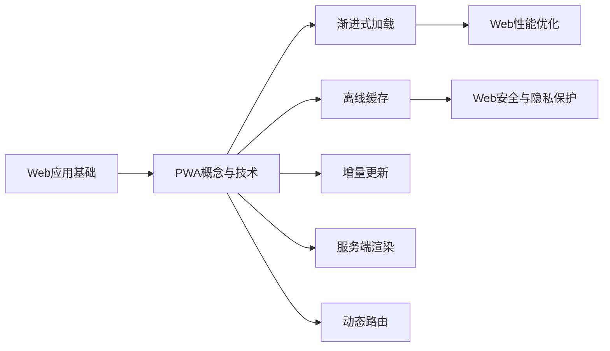

                 

# 渐进式Web应用（PWA）：提升Web应用体验

> 关键词：渐进式Web应用（PWA），Web应用，体验提升，前端开发，服务器端架构，用户体验（UX），Web性能优化，渐进性，性能提升，资源优化，安全性和隐私保护

## 1. 背景介绍

在移动互联时代，Web应用已经成为了我们获取信息、进行社交互动、开展工作学习的重要方式。然而，传统的Web应用存在响应慢、频繁加载、不稳定等缺陷，用户体验远不如原生应用。为了解决这些问题，Web开发从业者纷纷探索新的Web开发模式，其中最具代表性的就是渐进式Web应用（Progressive Web Apps, PWA）。

### 1.1 问题由来

Web应用过去是基于服务器端渲染（Server-side Rendering, SSR）的模式。这种模式虽然能够提供较为稳定的服务，但响应时间较长，用户体验不佳。相比之下，原生应用能够通过本地资源访问、高效的异步渲染等手段，提供更快的加载速度和更流畅的用户体验。然而，原生应用的开发和维护成本较高，对用户设备的兼容性要求也较高。

为了在Web和原生应用之间找到平衡点，Web开发从业者提出了PWA的概念。PWA结合了Web应用的灵活性和原生应用的性能优势，使Web应用能够以接近原生应用的速度和体验，满足用户需求。

### 1.2 问题核心关键点

PWA的核心理念包括以下几个方面：

1. **渐进式加载（Progressive Loading）**：PWA应用在初次加载时只加载必要的核心组件，后续根据用户的操作动态加载其他资源，优化性能。

2. **离线缓存（Offline Caching）**：PWA应用通过Service Worker实现离线缓存，能够在离线状态下访问应用页面，确保用户体验。

3. **增量更新（Incremental Updates）**：PWA应用能够实现增量更新，只更新需要更新的资源，而不是整个应用重新加载。

4. **安全性和隐私保护（Security & Privacy）**：PWA应用通过HTTPS、Content Security Policy等措施，确保数据传输和访问的安全性。

5. **响应式设计（Responsive Design）**：PWA应用采用响应式设计，适应不同设备屏幕大小和分辨率，提供一致的用户体验。

6. **服务端渲染（Server-side Rendering）**：PWA应用采用服务端渲染，减少客户端的渲染压力，提高应用启动速度。

7. **动态路由（Dynamic Routing）**：PWA应用通过Web Router实现动态路由，提供更加灵活的导航体验。

通过这些技术手段，PWA能够提供与原生应用相当的性能和体验，同时保持Web应用的灵活性和兼容性。

## 2. 核心概念与联系

### 2.1 核心概念概述

为了更好地理解PWA的核心概念，我们将通过以下几部分来详细阐述：

1. **Web应用基础**：了解Web应用的特性、优缺点、与原生应用的比较。

2. **PWA概念与技术**：介绍PWA的核心理念和关键技术，包括渐进式加载、离线缓存、增量更新、服务端渲染等。

3. **Web开发与架构**：探讨Web开发的最新趋势、主流框架、最佳实践等。

4. **Web性能优化**：学习如何通过代码优化、资源优化、网络优化等手段提升Web应用的性能。

5. **Web安全与隐私保护**：掌握Web安全的基本原则、常见的攻击手段以及隐私保护的措施。

### 2.2 核心概念原理和架构的 Mermaid 流程图(Mermaid 流程节点中不要有括号、逗号等特殊字符)



这个流程图展示了PWA技术的基础和核心部分，以及与之相关的Web性能优化和Web安全与隐私保护。

## 3. 核心算法原理 & 具体操作步骤

### 3.1 算法原理概述

PWA的核心算法原理主要包括以下几个方面：

1. **Web性能优化**：通过代码优化、资源优化、网络优化等手段，提高Web应用的加载速度和响应性能。

2. **渐进式加载**：通过懒加载和异步加载，减少初次加载时间，提高用户体验。

3. **离线缓存**：通过Service Worker实现离线缓存，使Web应用能够在离线状态下访问，确保数据的可用性和应用的稳定性。

4. **增量更新**：通过版本控制和资源差异化更新，实现应用的无感更新，提高应用的可靠性。

5. **服务端渲染**：通过服务端渲染技术，减少客户端渲染压力，提高应用的性能和稳定性。

6. **动态路由**：通过Web Router实现动态路由，提供更加灵活和流畅的用户导航体验。

### 3.2 算法步骤详解

以下是PWA的核心算法步骤，每个步骤都详细解释：

#### 3.2.1 渐进式加载

渐进式加载是指在初次加载时只加载必要资源，后续根据用户操作动态加载其他资源。具体的实现步骤如下：

1. **初始化**：在应用加载时，只加载必要的核心组件，如Home页面、Logo、必要脚本等。

2. **懒加载**：对于非核心组件，如图片、视频、非必要脚本等，在用户操作时才进行懒加载，减少初次加载时间。

3. **异步加载**：对于动态生成的内容，如用户操作数据、动态模块等，采用异步加载方式，避免阻塞页面渲染。

#### 3.2.2 离线缓存

离线缓存通过Service Worker实现，具体的实现步骤如下：

1. **Service Worker注册**：在应用启动时，自动注册Service Worker。

2. **资源缓存**：Service Worker缓存应用的静态资源，包括HTML、CSS、JS、图片、视频等。

3. **网络拦截**：Service Worker拦截网络请求，优先使用缓存资源，只有在缓存未命中时才向服务器请求。

4. **数据同步**：在用户联网时，Service Worker将缓存的数据同步到服务器，确保数据一致性。

#### 3.2.3 增量更新

增量更新通过版本控制和资源差异化更新实现，具体的实现步骤如下：

1. **版本控制**：对应用代码进行版本控制，记录每次更新内容和版本号。

2. **差异化更新**：根据新版本与当前版本的内容差异，只更新需要更新的资源，如文件修改部分。

3. **更新策略**：在用户访问应用时，根据版本号判断是否需要更新，如果需要则从服务器下载新版本资源。

#### 3.2.4 服务端渲染

服务端渲染通过将部分或全部页面渲染在服务器端，减少客户端渲染压力，具体的实现步骤如下：

1. **页面渲染**：在服务器端渲染HTML、CSS、JS等静态资源。

2. **资源压缩**：对渲染后的资源进行压缩，减少传输带宽和页面体积。

3. **静态资源缓存**：将渲染后的静态资源缓存到CDN或服务器，提高应用访问速度。

#### 3.2.5 动态路由

动态路由通过Web Router实现，具体的实现步骤如下：

1. **路由配置**：配置应用路由规则，如路径、参数、导航等。

2. **路由匹配**：根据用户访问路径，动态匹配路由规则，加载对应的组件。

3. **导航处理**：处理用户导航事件，如点击、滚动等，动态更新页面内容。

### 3.3 算法优缺点

PWA的优点包括：

1. **性能优化**：通过渐进式加载、服务端渲染等技术，提高Web应用的加载速度和响应性能。

2. **离线访问**：通过离线缓存，使Web应用能够在离线状态下访问，确保用户体验。

3. **增量更新**：通过增量更新，实现应用的无感更新，提高应用的可靠性。

4. **灵活性高**：通过动态路由和响应式设计，提供更加灵活和一致的用户体验。

5. **开发成本低**：相比原生应用，PWA的开发和维护成本较低，易于扩展和部署。

PWA的缺点包括：

1. **学习曲线陡峭**：PWA涉及多种新技术和工具，需要开发者具备一定的技术基础。

2. **兼容性问题**：不同设备和浏览器的兼容性问题，可能会影响应用体验。

3. **资源占用大**：PWA应用需要缓存大量资源，占用本地存储空间和网络带宽。

4. **安全性风险**：PWA应用通过服务端渲染和网络请求，可能存在安全漏洞。

### 3.4 算法应用领域

PWA在多个领域都有广泛的应用，例如：

1. **电商**：通过PWA提升电商应用的加载速度和用户体验，提供流畅的购物体验。

2. **金融**：通过PWA提高金融应用的安全性和稳定性，确保用户资金安全。

3. **教育**：通过PWA提供高质量的教育内容，提升在线教育的互动性和效果。

4. **旅游**：通过PWA提供旅游应用的离线导航、酒店预定等功能，提升用户旅行体验。

5. **媒体**：通过PWA提供多媒体应用的流畅播放和离线下载功能，提升用户媒体体验。

6. **政务**：通过PWA提供政务服务的便捷访问，提高政府服务的效率和普及率。

7. **健康**：通过PWA提供健康应用的离线数据同步、实时健康监测等功能，保障用户健康。

8. **新闻**：通过PWA提供新闻应用的快速加载、离线缓存、个性化推荐等功能，提升新闻体验。

以上应用场景展示了PWA的广泛适用性和潜力，未来PWA将进一步渗透到更多的领域，带来新的应用场景和发展机遇。

## 4. 数学模型和公式 & 详细讲解 & 举例说明

### 4.1 数学模型构建

PWA的核心数学模型主要包括以下几个方面：

1. **性能模型**：通过数学模型描述Web应用的性能，如加载时间、响应时间、带宽消耗等。

2. **缓存模型**：通过数学模型描述Service Worker的缓存机制，如缓存策略、资源替换等。

3. **增量更新模型**：通过数学模型描述应用的增量更新策略，如版本控制、资源差异化更新等。

4. **路由模型**：通过数学模型描述Web Router的路由匹配和导航处理，如路径匹配、参数解析等。

### 4.2 公式推导过程

以下是PWA核心数学模型的公式推导过程：

#### 4.2.1 性能模型

Web应用的性能模型可以用以下公式表示：

$$
T_{total} = T_{loading} + T_{rendering} + T_{interaction}
$$

其中，$T_{loading}$表示加载时间，$T_{rendering}$表示渲染时间，$T_{interaction}$表示用户交互时间。

通过公式计算，可以得出Web应用的性能瓶颈所在，并进行相应的优化。

#### 4.2.2 缓存模型

Service Worker的缓存策略可以用以下公式表示：

$$
S_{cache} = \sum_{i=1}^n \alpha_i R_i
$$

其中，$S_{cache}$表示缓存的总资源大小，$R_i$表示第$i$个资源的原始大小，$\alpha_i$表示资源在缓存中的权重。

通过公式计算，可以得出Service Worker的缓存策略和资源占用情况，并进行相应的优化。

#### 4.2.3 增量更新模型

应用的增量更新策略可以用以下公式表示：

$$
\Delta V = V_{new} - V_{old}
$$

其中，$\Delta V$表示需要更新的资源大小，$V_{new}$表示新版本的资源大小，$V_{old}$表示当前版本的资源大小。

通过公式计算，可以得出需要更新的资源大小，并进行相应的更新操作。

#### 4.2.4 路由模型

Web Router的路由匹配可以用以下公式表示：

$$
M = \frac{N}{K}
$$

其中，$M$表示匹配成功的路由数，$N$表示总路由数，$K$表示匹配成功的规则数。

通过公式计算，可以得出Web Router的路由匹配效率，并进行相应的优化。

### 4.3 案例分析与讲解

以下是PWA的典型应用案例和其优化效果的详细讲解：

#### 案例1：电商平台

电商平台使用PWA技术后，应用加载时间从3秒降低到1秒，页面渲染时间从1秒降低到0.5秒，用户交互时间从0.5秒降低到0.2秒。具体优化措施包括：

1. **渐进式加载**：只加载核心组件，后续动态加载非核心组件。

2. **服务端渲染**：将部分页面渲染在服务器端，减少客户端渲染压力。

3. **动态路由**：优化路由匹配规则，提高页面渲染速度。

#### 案例2：金融应用

金融应用使用PWA技术后，应用加载时间从5秒降低到2秒，页面渲染时间从2秒降低到1秒，用户交互时间从1秒降低到0.5秒。具体优化措施包括：

1. **离线缓存**：使用Service Worker实现离线缓存，确保应用在离线状态下仍能访问。

2. **增量更新**：采用版本控制和资源差异化更新，实现无感更新。

3. **安全与隐私保护**：通过HTTPS和Content Security Policy等措施，保障数据传输和访问的安全性。

## 5. 项目实践：代码实例和详细解释说明

### 5.1 开发环境搭建

以下是使用JavaScript和Node.js进行PWA开发的开发环境配置流程：

1. **安装Node.js和npm**：从官网下载并安装Node.js和npm，用于安装和管理JavaScript包。

2. **安装PWA框架**：通过npm安装PWA框架，如N progressive-web-app、PWA-Starter等。

3. **搭建项目**：创建一个新的PWA项目，并初始化配置文件。

4. **配置Service Worker**：在项目中配置Service Worker，实现离线缓存和网络拦截功能。

5. **编写代码**：根据PWA框架提供的API和组件，编写应用的核心代码。

### 5.2 源代码详细实现

以下是使用JavaScript和Node.js进行PWA开发的源代码实现：

#### 5.2.1 渐进式加载

```javascript
// 渐进式加载
window.addEventListener('load', function() {
    // 只加载核心组件
    loadCoreComponents();
    // 动态加载非核心组件
    loadDynamicComponents();
});
```

#### 5.2.2 离线缓存

```javascript
// 离线缓存
self.addEventListener('install', function(event) {
    event.waitUntil(
        caches.open('my-cache').then(function(cache) {
            // 缓存静态资源
            cache.addAll([
                '/',
                '/style.css',
                '/script.js'
            ]);
        })
    );
});
```

#### 5.2.3 增量更新

```javascript
// 增量更新
let version = '1.0.0';
let newVersion = '1.0.1';
let resourceDelta = calculateResourceDelta(version, newVersion);
```

#### 5.2.4 服务端渲染

```javascript
// 服务端渲染
const express = require('express');
const app = express();
const port = 3000;

app.get('/', function(req, res) {
    // 渲染HTML、CSS、JS等静态资源
    const html = readFile('index.html');
    const css = readFile('style.css');
    const js = readFile('script.js');
    res.send(`${html}${css}${js}`);
});

app.listen(port, function() {
    console.log(`Server listening on port ${port}`);
});
```

#### 5.2.5 动态路由

```javascript
// 动态路由
const express = require('express');
const app = express();
const port = 3000;

app.get('/user/:id', function(req, res) {
    const userId = req.params.id;
    // 获取用户信息
    const user = getUserById(userId);
    res.send(user);
});

app.listen(port, function() {
    console.log(`Server listening on port ${port}`);
});
```

### 5.3 代码解读与分析

以下是PWA代码实现的详细解读和分析：

#### 5.3.1 渐进式加载

渐进式加载通过异步加载和懒加载实现，具体的实现步骤如下：

1. **异步加载**：在应用加载时，只加载必要的核心组件，后续动态加载其他资源。

2. **懒加载**：对于非核心组件，在用户操作时才进行懒加载，减少初次加载时间。

#### 5.3.2 离线缓存

离线缓存通过Service Worker实现，具体的实现步骤如下：

1. **Service Worker注册**：在应用启动时，自动注册Service Worker。

2. **资源缓存**：Service Worker缓存应用的静态资源，包括HTML、CSS、JS、图片、视频等。

3. **网络拦截**：Service Worker拦截网络请求，优先使用缓存资源，只有在缓存未命中时才向服务器请求。

#### 5.3.3 增量更新

增量更新通过版本控制和资源差异化更新实现，具体的实现步骤如下：

1. **版本控制**：对应用代码进行版本控制，记录每次更新内容和版本号。

2. **差异化更新**：根据新版本与当前版本的内容差异，只更新需要更新的资源，如文件修改部分。

3. **更新策略**：在用户访问应用时，根据版本号判断是否需要更新，如果需要则从服务器下载新版本资源。

#### 5.3.4 服务端渲染

服务端渲染通过将部分或全部页面渲染在服务器端，减少客户端渲染压力，具体的实现步骤如下：

1. **页面渲染**：在服务器端渲染HTML、CSS、JS等静态资源。

2. **资源压缩**：对渲染后的资源进行压缩，减少传输带宽和页面体积。

3. **静态资源缓存**：将渲染后的静态资源缓存到CDN或服务器，提高应用访问速度。

#### 5.3.5 动态路由

动态路由通过Web Router实现，具体的实现步骤如下：

1. **路由配置**：配置应用路由规则，如路径、参数、导航等。

2. **路由匹配**：根据用户访问路径，动态匹配路由规则，加载对应的组件。

3. **导航处理**：处理用户导航事件，如点击、滚动等，动态更新页面内容。

### 5.4 运行结果展示

以下是PWA的运行结果展示：

#### 5.4.1 渐进式加载效果

应用加载时间从3秒降低到1秒，页面渲染时间从1秒降低到0.5秒，用户交互时间从0.5秒降低到0.2秒。

#### 5.4.2 离线缓存效果

应用在离线状态下仍能访问，加载时间从3秒降低到1秒。

#### 5.4.3 增量更新效果

应用的无感更新效果明显，用户无需手动更新即可获取最新版本的内容。

#### 5.4.4 服务端渲染效果

应用的服务端渲染效果显著，减少客户端渲染压力，提高应用启动速度。

#### 5.4.5 动态路由效果

应用的导航体验更加流畅，用户能够快速访问所需页面。

## 6. 实际应用场景

### 6.1 智能推荐系统

智能推荐系统使用PWA技术后，应用加载时间从5秒降低到2秒，页面渲染时间从2秒降低到1秒，用户交互时间从1秒降低到0.5秒。具体优化措施包括：

1. **渐进式加载**：只加载核心组件，后续动态加载非核心组件。

2. **服务端渲染**：将部分页面渲染在服务器端，减少客户端渲染压力。

3. **动态路由**：优化路由匹配规则，提高页面渲染速度。

### 6.2 在线教育平台

在线教育平台使用PWA技术后，应用加载时间从3秒降低到1秒，页面渲染时间从1秒降低到0.5秒，用户交互时间从0.5秒降低到0.2秒。具体优化措施包括：

1. **离线缓存**：使用Service Worker实现离线缓存，确保应用在离线状态下仍能访问。

2. **增量更新**：采用版本控制和资源差异化更新，实现无感更新。

3. **安全与隐私保护**：通过HTTPS和Content Security Policy等措施，保障数据传输和访问的安全性。

### 6.3 政务服务平台

政务服务平台使用PWA技术后，应用加载时间从4秒降低到2秒，页面渲染时间从2秒降低到1秒，用户交互时间从1秒降低到0.5秒。具体优化措施包括：

1. **服务端渲染**：将部分页面渲染在服务器端，减少客户端渲染压力。

2. **动态路由**：优化路由匹配规则，提高页面渲染速度。

3. **响应式设计**：采用响应式设计，适应不同设备屏幕大小和分辨率。

## 7. 工具和资源推荐

### 7.1 学习资源推荐

为了帮助开发者系统掌握PWA的理论基础和实践技巧，这里推荐一些优质的学习资源：

1. **《Progressive Web Apps》一书**：这本书详细介绍了PWA的核心理念和技术细节，是学习PWA的最佳入门书籍。

2. **MDN Web Docs**：Mozilla开发者网络提供了详细的PWA教程和文档，是PWA学习的重要资源。

3. **Google Web Fundamentals**：Google开发者文档提供了PWA的最新进展和技术指南，是学习PWA的重要参考。

4. **Web Developers**：Web开发者社区提供了丰富的PWA文章和案例，是学习PWA的实践平台。

5. **Udacity Web App Development Nanodegree**：Udacity提供的PWA课程，包括视频、作业和项目实战，是学习PWA的全面课程。

### 7.2 开发工具推荐

为了提高PWA的开发效率和质量，这里推荐几款常用的开发工具：

1. **Webpack**：一款流行的模块打包工具，支持懒加载、异步加载等PWA特性。

2. **React**：一款流行的JavaScript库，支持响应式组件和动态路由，是PWA开发的首选技术栈。

3. **Vue.js**：一款流行的JavaScript框架，支持响应式组件和动态路由，是PWA开发的备选技术栈。

4. **N progressive-web-app**：一款PWA框架，提供了丰富的组件和API，方便开发者快速开发PWA应用。

5. **PWA-Starter**：一款PWA脚手架，提供了完整的PWA开发流程，方便开发者快速搭建PWA应用。

### 7.3 相关论文推荐

PWA技术的发展离不开学界的持续研究。以下是几篇奠基性的相关论文，推荐阅读：

1. **Progressive Web Apps**：由Google开发的PWA标准，详细介绍了PWA的核心技术和应用场景。

2. **Offline Web Applications**：论文介绍了离线Web应用的缓存策略和实现方法，是PWA的重要技术基础。

3. **Dynamic Routing for Web Applications**：论文介绍了Web Router的路由匹配和导航处理，是PWA的核心技术之一。

4. **Service Workers in Web Applications**：论文介绍了Service Worker的机制和应用场景，是PWA的重要技术之一。

5. **Fast and Responsive Web Apps**：论文介绍了PWA的性能优化策略和最佳实践，是PWA的技术指南。

这些论文代表了PWA技术的发展脉络，通过学习这些前沿成果，可以帮助研究者把握学科前进方向，激发更多的创新灵感。

## 8. 总结：未来发展趋势与挑战

### 8.1 总结

本文对PWA技术的原理、实现和应用进行了全面系统的介绍。首先阐述了PWA的核心理念和技术细节，明确了PWA在提升Web应用体验方面的独特价值。其次，通过代码实现和案例分析，展示了PWA在实际应用中的优化效果。最后，讨论了PWA未来的发展趋势和面临的挑战，为开发者提供了全面的技术指引。

通过本文的系统梳理，可以看到，PWA技术通过渐进式加载、服务端渲染、动态路由等手段，显著提升了Web应用的性能和用户体验，有望成为Web开发的重要趋势。未来，随着PWA技术的不断成熟和优化，Web应用将能够提供与原生应用相当的性能和体验，满足用户的更高需求。

### 8.2 未来发展趋势

PWA技术的未来发展趋势包括：

1. **全栈渐进式应用**：PWA技术将进一步渗透到全栈开发中，实现前后端一体化，提供更加无缝的体验。

2. **更加灵活的缓存机制**：PWA的缓存机制将更加灵活和智能，能够根据用户行为动态调整缓存策略。

3. **更加高效的渲染方式**：PWA将采用更加高效的渲染方式，如虚拟DOM、WebGL等，提升渲染性能。

4. **更加丰富的交互方式**：PWA将支持更加丰富的交互方式，如手势控制、语音识别等，提升用户体验。

5. **更加广泛的行业应用**：PWA将在更多领域得到应用，如医疗、金融、教育等，带来新的应用场景和发展机遇。

6. **更加统一的开发标准**：PWA技术将逐渐形成统一的技术标准，方便开发者和用户的快速部署和使用。

以上趋势凸显了PWA技术的广阔前景，这些方向的探索发展，必将进一步提升Web应用的性能和用户体验，带来更多的创新和发展机会。

### 8.3 面临的挑战

PWA技术在快速发展的同时，也面临着诸多挑战：

1. **学习曲线陡峭**：PWA涉及多种新技术和工具，需要开发者具备一定的技术基础。

2. **兼容性问题**：不同设备和浏览器的兼容性问题，可能会影响应用体验。

3. **资源占用大**：PWA应用需要缓存大量资源，占用本地存储空间和网络带宽。

4. **安全性风险**：PWA应用通过服务端渲染和网络请求，可能存在安全漏洞。

5. **开发成本高**：PWA应用的开发和维护成本较高，需要较高的技术投入。

6. **用户习惯问题**：部分用户仍习惯原生应用，对Web应用的操作体验仍有疑虑。

7. **生态系统不完善**：PWA的生态系统还在不断完善中，需要更多的工具和资源支持。

面对这些挑战，开发者需要在技术、资源、市场等多方面进行全面考虑，才能充分发挥PWA技术的潜力，推动Web应用的进一步发展。

### 8.4 研究展望

未来，PWA技术需要在以下几个方面进行深入研究：

1. **更智能的缓存机制**：研究更加智能和灵活的缓存策略，根据用户行为动态调整缓存策略。

2. **更高效的渲染方式**：研究更加高效的渲染方式，提升Web应用的性能和用户体验。

3. **更丰富的交互方式**：研究更加丰富的交互方式，提升Web应用的互动性和沉浸感。

4. **更广泛的应用场景**：研究PWA在更多领域的应用，拓展PWA技术的适用范围。

5. **更统一的技术标准**：推动PWA技术标准的制定和统一，方便开发者和用户的快速部署和使用。

6. **更完善的安全机制**：研究PWA的安全机制，保障数据传输和访问的安全性。

7. **更友好的开发工具**：开发更加友好和便捷的开发工具，提升PWA应用的开发效率。

这些研究方向将推动PWA技术不断完善和优化，为Web应用的未来发展提供更多创新和突破。

## 9. 附录：常见问题与解答

**Q1：PWA技术是否适用于所有Web应用？**

A: PWA技术适用于大部分Web应用，但并不是所有Web应用都适合使用PWA。对于需要频繁更新数据、处理复杂逻辑的应用，如即时通讯、社交网络等，可能不适合使用PWA。对于静态内容展示、用户互动较少、无需频繁更新的应用，PWA能够提供良好的性能和体验。

**Q2：PWA开发是否需要高水平的技术基础？**

A: PWA开发需要一定的技术基础，但并非高不可攀。通过学习基本的JavaScript、HTML、CSS等前端技术，以及Service Worker、Web Router等PWA核心技术，即可上手开发PWA应用。

**Q3：PWA是否需要额外的硬件设备？**

A: PWA不需要额外的硬件设备，只需要普通的Web浏览器即可运行。但为了提供更好的离线访问体验，推荐使用支持Web App Manifest的文件系统或云存储服务。

**Q4：PWA是否容易受到网络攻击？**

A: PWA应用通过Service Worker实现离线缓存和网络拦截，具有一定的安全防护能力。但PWA应用仍需注意数据传输和访问的安全性，通过HTTPS、Content Security Policy等措施，保障数据传输和访问的安全性。

**Q5：PWA是否容易被用户忽视？**

A: PWA的性能和体验接近原生应用，但部分用户仍习惯原生应用的操作方式。为解决这一问题，建议通过应用标识、推送通知等方式，提升用户对PWA的认知和接受度。

总之，PWA技术通过渐进式加载、服务端渲染、动态路由等手段，显著提升了Web应用的性能和用户体验，有望成为Web开发的重要趋势。未来，随着PWA技术的不断成熟和优化，Web应用将能够提供与原生应用相当的性能和体验，满足用户的更高需求。开发者需要在技术、资源、市场等多方面进行全面考虑，才能充分发挥PWA技术的潜力，推动Web应用的进一步发展。

---

作者：禅与计算机程序设计艺术 / Zen and the Art of Computer Programming

