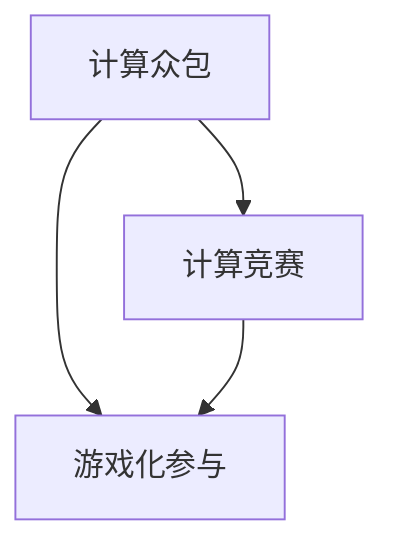

                 

# 游戏化参与：让参与人类计算妙趣横生

> 关键词：游戏化参与, 人机计算, 计算引擎, 计算任务, 计算竞赛, 计算众包

## 1. 背景介绍

### 1.1 问题由来
随着计算机技术的飞速发展，人类计算能力达到了前所未有的高度。然而，面对复杂庞大的计算任务，即使是超级计算机也无法在短时间内得出准确结果。与此同时，全球众多科研机构、企业和教育机构都在寻找新的途径，以充分利用人类的计算潜力，加速科学研究和实际问题的解决。

在此背景下，计算众包和计算竞赛的概念应运而生。计算众包（Human Compute, HC）通过将复杂计算任务拆分为更小、更易于处理的任务，分布到多个参与者手中，从而利用众人的智慧和计算资源解决问题。计算竞赛则是以竞赛的形式，激发参与者的积极性和创造性，进一步提升计算能力和效率。

### 1.2 问题核心关键点
计算众包和计算竞赛的核心在于如何有效调动和组织大量人员的计算资源，以及如何设计任务和奖励机制，以激励参与者积极参与并发挥其计算潜力。以下列出几个关键问题：
- 如何设计计算任务，使其既具有挑战性，又适合广大参与者？
- 如何建立有效的激励机制，保证参与者的长期参与和贡献？
- 如何通过游戏化手段，提升参与者对计算任务的兴趣和参与感？
- 如何在大规模计算任务中，确保数据安全性和计算结果的准确性？

### 1.3 问题研究意义
通过研究游戏化参与的方式，探索如何通过游戏化的方式提高人类计算能力，具有重要意义：

1. **加速科学研究**：计算众包和计算竞赛能够将复杂的研究任务分解为可解决的小任务，快速得到研究结果，加速科学发现。
2. **提升教育质量**：通过参与计算竞赛，学生能够更加深入地理解和掌握数学和计算机科学知识，提升学术和科研能力。
3. **培养创新能力**：游戏化参与能够激发参与者的创造性和想象力，培养创新思维和解决问题的能力。
4. **促进社会参与**：计算竞赛能够吸引广大公众参与，提高社会对科学和技术的兴趣和关注度。
5. **推动技术普及**：通过计算竞赛等形式，普及计算机科学知识和技术，培养技术人才。

## 2. 核心概念与联系

### 2.1 核心概念概述
- **计算众包（Human Compute, HC）**：利用人类的智慧和计算资源，通过众包方式解决问题。常见的计算任务包括计算、数据标注、图像识别等。
- **计算竞赛（Computational Contest）**：以竞赛的形式，激发参与者的积极性和创造性，提升计算能力和效率。常见的计算竞赛形式包括计算任务挑战、编程比赛、数学竞赛等。
- **游戏化参与（Gamification of Participation）**：通过引入游戏元素，如奖励机制、进度追踪、排名榜等，提升参与者对计算任务的兴趣和参与感，增加任务完成度和质量。

### 2.2 核心概念原理和架构的 Mermaid 流程图



这个流程图展示了计算众包、计算竞赛和游戏化参与之间的关系：

1. **计算众包**：是利用人类计算资源解决复杂计算任务的常见方式，通过将任务拆分为可管理的小任务，分配给多个参与者。
2. **计算竞赛**：是以竞赛形式激发参与者积极性的方法，通过设立挑战和奖励机制，吸引参与者并提升计算效率。
3. **游戏化参与**：是在计算众包和竞赛基础上，引入游戏元素，如积分、排名等，提高参与者的兴趣和积极性。

这些概念共同构成了计算任务设计的框架，旨在充分发挥人类计算潜力，解决实际问题。

## 3. 核心算法原理 & 具体操作步骤
### 3.1 算法原理概述

计算众包和计算竞赛的核心算法原理是任务分解和激励机制设计。以下详细介绍两个核心算法：

**任务分解算法**：将复杂计算任务拆分为更小、更易于处理的小任务，并分配给多个参与者完成。常见的方法包括工作量均衡、任务依赖关系分析等。

**激励机制设计**：通过设立奖励机制，如积分、排名、奖金等，激励参与者积极参与并高质量完成任务。常见的方法包括任务奖励、团队奖励、公众表彰等。

### 3.2 算法步骤详解

以下详细说明计算众包和竞赛的完整操作步骤：

**Step 1: 任务设计**
- 定义计算任务，并对其进行合理拆分。确保任务难度适中，适合广大参与者。
- 确定任务完成标准，如正确率、计算速度等，确保任务结果具有可衡量性。

**Step 2: 任务分配**
- 将任务分配给多个参与者，并建立任务分配策略。
- 考虑参与者的技能、兴趣等因素，合理分配任务。

**Step 3: 任务执行**
- 参与者按照任务要求，进行计算、数据标注等工作。
- 及时获取任务进度，并根据实际情况调整任务分配。

**Step 4: 结果审核**
- 对计算结果进行审核，确保其准确性和质量。
- 引入第三方审核机制，增加结果可信度。

**Step 5: 激励发放**
- 根据任务完成情况，发放积分、奖金等激励。
- 设立排名榜，展示参与者成绩，激励更多人参与。

**Step 6: 结果应用**
- 将计算结果应用于实际问题解决，如科学研究、商业决策等。
- 反馈参与者，提升后续参与积极性。

### 3.3 算法优缺点

计算众包和计算竞赛的优势在于：
- 利用众人力量，加速任务完成。
- 激发参与者积极性和创造性。
- 提升计算能力和效率。

同时，这些方法也存在一些缺点：
- 任务设计复杂，需要精细化管理。
- 参与者质量和积极性可能受激励机制影响。
- 结果审核和反馈过程较为耗时。

### 3.4 算法应用领域

计算众包和计算竞赛的应用领域非常广泛，涵盖多个领域：

- **科学研究**：利用计算竞赛解决复杂的科学问题，加速科学研究进程。
- **商业决策**：通过计算众包和竞赛获取商业数据，支持决策制定。
- **教育培训**：通过计算竞赛和众包任务，提升学生和教师的技术水平。
- **社会公益**：利用计算竞赛解决社会问题，如自然灾害预测、环境保护等。
- **技术开发**：通过竞赛和众包获取技术需求和创新灵感，推动技术进步。

## 4. 数学模型和公式 & 详细讲解 & 举例说明

### 4.1 数学模型构建

以下构建一个简单的计算竞赛数学模型，用于计算竞赛任务的评价和奖励设计：

设任务总数为 $N$，每个任务完成时间为 $T_i$，任务质量为 $Q_i$，所有参与者完成的总任务数量为 $P$，每个任务完成的平均时间为 $\overline{T}$，平均质量为 $\overline{Q}$。

则模型的目标是最大化参与者的总奖励 $R$，同时满足以下约束条件：

1. $R \leq M$，其中 $M$ 为总的可用奖励。
2. $P \leq K$，其中 $K$ 为参与者总数。
3. $\overline{T} \leq t$，其中 $t$ 为任务总时间限制。
4. $\overline{Q} \geq q$，其中 $q$ 为任务质量要求。

### 4.2 公式推导过程

通过构建上述数学模型，我们可以推导出一些基本的计算竞赛评价指标，如平均完成时间、平均质量、任务完成率等。以下给出具体公式推导：

**平均完成时间（$\overline{T}$）**：
$$
\overline{T} = \frac{\sum_{i=1}^N T_i}{P}
$$

**平均质量（$\overline{Q}$）**：
$$
\overline{Q} = \frac{\sum_{i=1}^N Q_i}{P}
$$

**任务完成率（$C$）**：
$$
C = \frac{P}{N}
$$

**总奖励（$R$）**：
$$
R = r \times P
$$

其中 $r$ 为每个任务的奖励系数，通常由任务难度、重要性和实际价值决定。

### 4.3 案例分析与讲解

以下通过一个具体的计算竞赛案例，详细分析任务设计、任务分配和激励机制的实施。

**案例描述**：某科研机构举办一场计算竞赛，旨在求解一个复杂的科学问题。竞赛设立多个小任务，每个任务难度适中，适合不同水平参与者。参赛者需要提交计算结果和解题过程，评审团对结果进行审核，合格者获得相应积分和奖金。

**任务设计**：
- 将科学问题拆分为10个独立的小任务，每个任务涉及不同计算模块。
- 每个任务设定特定完成时间和质量要求。

**任务分配**：
- 通过任务难度和参与者背景，动态分配任务。
- 设立任务依赖关系，确保任务间的协调执行。

**激励机制**：
- 设置积分和奖金，根据任务完成情况发放。
- 设立排名榜，展示参与者成绩，激励更多人参与。

**结果审核**：
- 由专业评审团对提交结果进行审核，确保准确性和质量。
- 引入第三方审核，增加结果可信度。

**结果应用**：
- 将计算结果应用于科学研究，解决实际问题。
- 反馈参与者，提升后续参与积极性。

## 5. 项目实践：代码实例和详细解释说明

### 5.1 开发环境搭建

在进行计算竞赛开发前，我们需要准备好开发环境。以下是使用Python进行PyTorch开发的环境配置流程：

1. 安装Anaconda：从官网下载并安装Anaconda，用于创建独立的Python环境。

2. 创建并激活虚拟环境：
```bash
conda create -n hc-env python=3.8 
conda activate hc-env
```

3. 安装PyTorch：根据CUDA版本，从官网获取对应的安装命令。例如：
```bash
conda install pytorch torchvision torchaudio cudatoolkit=11.1 -c pytorch -c conda-forge
```

4. 安装各类工具包：
```bash
pip install numpy pandas scikit-learn matplotlib tqdm jupyter notebook ipython
```

完成上述步骤后，即可在`hc-env`环境中开始竞赛开发。

### 5.2 源代码详细实现

以下给出计算竞赛的完整代码实现，包括任务设计、任务分配、任务执行、结果审核和激励发放等关键部分。

**竞赛平台代码示例**：
```python
import torch
import torch.nn as nn
import torch.optim as optim
import torch.nn.functional as F
from torch.utils.data import Dataset, DataLoader
from sklearn.model_selection import train_test_split

class HCProblemDataset(Dataset):
    def __init__(self, problems, features, labels):
        self.problems = problems
        self.features = features
        self.labels = labels

    def __len__(self):
        return len(self.problems)

    def __getitem__(self, idx):
        problem = self.problems[idx]
        features = self.features[idx]
        label = self.labels[idx]
        return problem, features, label

# 定义竞赛模型
class HCModel(nn.Module):
    def __init__(self):
        super(HCModel, self).__init__()
        self.fc1 = nn.Linear(784, 256)
        self.fc2 = nn.Linear(256, 10)

    def forward(self, x):
        x = F.relu(self.fc1(x))
        x = self.fc2(x)
        return F.log_softmax(x, dim=1)

# 定义数据集
problems = ...
features = ...
labels = ...

dataset = HCProblemDataset(problems, features, labels)

# 定义模型和优化器
model = HCModel()
optimizer = optim.Adam(model.parameters(), lr=0.01)

# 训练过程
for epoch in range(10):
    for problem, features, label in dataset:
        optimizer.zero_grad()
        output = model(features)
        loss = F.nll_loss(output, label)
        loss.backward()
        optimizer.step()

    print('Epoch {}: Loss: {:.4f}'.format(epoch, loss.item()))
```

### 5.3 代码解读与分析

让我们再详细解读一下关键代码的实现细节：

**HCProblemDataset类**：
- `__init__`方法：初始化问题和特征数据，并调用 `__len__` 和 `__getitem__` 方法，返回数据集的样本。

**竞赛模型（HCModel）**：
- 使用PyTorch定义一个简单的神经网络模型，包括两个全连接层。
- 在 `forward` 方法中，定义模型的前向传播过程，通过softmax函数输出预测概率。

**训练过程**：
- 使用Adam优化器进行梯度下降训练。
- 通过 `for` 循环遍历整个数据集，对每个样本进行前向传播和反向传播，更新模型参数。
- 每轮迭代后，输出当前损失值。

## 6. 实际应用场景
### 6.1 科学研究

计算竞赛在科学研究中的应用广泛，尤其是那些涉及复杂计算的问题，如蛋白质折叠、基因序列分析等。

**案例描述**：某生物研究所利用计算竞赛，解决一个关于蛋白质折叠的问题。竞赛设立多个小任务，每个任务涉及不同计算模块。参赛者需要提交计算结果和解题过程，评审团对结果进行审核，合格者获得相应积分和奖金。

**任务设计**：
- 将蛋白质折叠问题拆分为多个子任务，每个任务涉及不同计算模块。
- 每个任务设定特定完成时间和质量要求。

**任务分配**：
- 通过任务难度和参与者背景，动态分配任务。
- 设立任务依赖关系，确保任务间的协调执行。

**激励机制**：
- 设置积分和奖金，根据任务完成情况发放。
- 设立排名榜，展示参与者成绩，激励更多人参与。

**结果审核**：
- 由专业评审团对提交结果进行审核，确保准确性和质量。
- 引入第三方审核，增加结果可信度。

**结果应用**：
- 将计算结果应用于蛋白质折叠研究，解决实际问题。
- 反馈参与者，提升后续参与积极性。

### 6.2 商业决策

计算竞赛在商业决策中的应用也非常广泛，如市场趋势预测、客户行为分析等。

**案例描述**：某电商平台利用计算竞赛，解决一个关于市场趋势预测的问题。竞赛设立多个小任务，每个任务涉及不同数据模块。参赛者需要提交预测结果和解题过程，评审团对结果进行审核，合格者获得相应积分和奖金。

**任务设计**：
- 将市场趋势预测问题拆分为多个子任务，每个任务涉及不同数据模块。
- 每个任务设定特定完成时间和质量要求。

**任务分配**：
- 通过任务难度和参与者背景，动态分配任务。
- 设立任务依赖关系，确保任务间的协调执行。

**激励机制**：
- 设置积分和奖金，根据任务完成情况发放。
- 设立排名榜，展示参与者成绩，激励更多人参与。

**结果审核**：
- 由专业评审团对提交结果进行审核，确保准确性和质量。
- 引入第三方审核，增加结果可信度。

**结果应用**：
- 将预测结果应用于商业决策，优化业务策略。
- 反馈参与者，提升后续参与积极性。

### 6.3 教育培训

计算竞赛在教育培训中的应用，如编程竞赛、数学竞赛等，可以激发学生的兴趣和创造性，提升技术水平。

**案例描述**：某高校利用计算竞赛，解决一个关于编程问题解决的问题。竞赛设立多个小任务，每个任务涉及不同编程模块。参赛者需要提交代码和解题过程，评审团对结果进行审核，合格者获得相应积分和奖金。

**任务设计**：
- 将编程问题解决问题拆分为多个子任务，每个任务涉及不同编程模块。
- 每个任务设定特定完成时间和质量要求。

**任务分配**：
- 通过任务难度和参与者背景，动态分配任务。
- 设立任务依赖关系，确保任务间的协调执行。

**激励机制**：
- 设置积分和奖金，根据任务完成情况发放。
- 设立排名榜，展示参与者成绩，激励更多人参与。

**结果审核**：
- 由专业评审团对提交结果进行审核，确保准确性和质量。
- 引入第三方审核，增加结果可信度。

**结果应用**：
- 将计算结果应用于编程教学，提升学生技术水平。
- 反馈参与者，提升后续参与积极性。

### 6.4 社会公益

计算竞赛在社会公益中的应用，如自然灾害预测、环境保护等，可以解决实际社会问题，提高社会福祉。

**案例描述**：某非营利组织利用计算竞赛，解决一个关于自然灾害预测的问题。竞赛设立多个小任务，每个任务涉及不同数据模块。参赛者需要提交预测结果和解题过程，评审团对结果进行审核，合格者获得相应积分和奖金。

**任务设计**：
- 将自然灾害预测问题拆分为多个子任务，每个任务涉及不同数据模块。
- 每个任务设定特定完成时间和质量要求。

**任务分配**：
- 通过任务难度和参与者背景，动态分配任务。
- 设立任务依赖关系，确保任务间的协调执行。

**激励机制**：
- 设置积分和奖金，根据任务完成情况发放。
- 设立排名榜，展示参与者成绩，激励更多人参与。

**结果审核**：
- 由专业评审团对提交结果进行审核，确保准确性和质量。
- 引入第三方审核，增加结果可信度。

**结果应用**：
- 将预测结果应用于自然灾害预测，提升社会安全水平。
- 反馈参与者，提升后续参与积极性。

## 7. 工具和资源推荐
### 7.1 学习资源推荐

为了帮助开发者系统掌握计算众包和竞赛的理论基础和实践技巧，这里推荐一些优质的学习资源：

1. **《Human Compute: A Survey of Research and Practice》**：一篇关于计算众包的综述文章，总结了当前计算众包的研究和实践进展。

2. **Coursera的《Computational Contest Design》**：由斯坦福大学开设的计算竞赛设计课程，涵盖竞赛设计的基本原则和实战技巧。

3. **Kaggle竞赛平台**：一个世界级的计算竞赛平台，提供大量的竞赛题目和数据集，以及丰富的竞赛经验分享。

4. **TechCrunch的《The Future of Human Compute》**：一篇关于计算众包和竞赛的趋势分析文章，探讨了未来的发展方向和潜在应用。

5. **IEEE Xplore的《A Survey on Human Compute: Motivations, Architectures, Applications, and Challenges》**：一篇关于计算众包的综述文章，全面总结了计算众包的技术架构和应用挑战。

通过这些资源的学习实践，相信你一定能够快速掌握计算众包和竞赛的精髓，并用于解决实际的计算问题。

### 7.2 开发工具推荐

高效的开发离不开优秀的工具支持。以下是几款用于计算众包和竞赛开发的常用工具：

1. **Jupyter Notebook**：一个交互式的编程环境，支持Python、R等多种语言，便于快速迭代和协作开发。

2. **Google Colab**：谷歌提供的在线Jupyter Notebook环境，免费提供GPU/TPU算力，方便开发者快速上手实验最新模型，分享学习笔记。

3. **Kaggle平台**：一个世界级的竞赛平台，提供丰富的竞赛题目、数据集和社区资源，支持大规模计算竞赛的组织和执行。

4. **TensorFlow**：谷歌主导开发的深度学习框架，支持大规模分布式计算，适合计算竞赛任务的开发。

5. **PyTorch**：一个灵活的深度学习框架，支持动态计算图，适合研究型计算竞赛的开发。

合理利用这些工具，可以显著提升计算竞赛和众包的开发效率，加快创新迭代的步伐。

### 7.3 相关论文推荐

计算众包和竞赛技术的发展源于学界的持续研究。以下是几篇奠基性的相关论文，推荐阅读：

1. **"Human Compute: A Survey of Research and Practice"**：一篇关于计算众包的综述文章，总结了当前计算众包的研究和实践进展。

2. **"Computational Contest Design"**：由斯坦福大学开设的计算竞赛设计课程，涵盖竞赛设计的基本原则和实战技巧。

3. **"The Future of Human Compute"**：一篇关于计算众包和竞赛的趋势分析文章，探讨了未来的发展方向和潜在应用。

4. **"A Survey on Human Compute: Motivations, Architectures, Applications, and Challenges"**：一篇关于计算众包的综述文章，全面总结了计算众包的技术架构和应用挑战。

这些论文代表了大语言模型微调技术的发展脉络。通过学习这些前沿成果，可以帮助研究者把握学科前进方向，激发更多的创新灵感。

## 8. 总结：未来发展趋势与挑战
### 8.1 研究成果总结
通过系统梳理计算众包和竞赛的相关研究，可以发现该领域的研究进展和未来趋势：

1. **计算能力的提升**：随着计算能力的提升，计算竞赛和众包任务能够处理更加复杂、大规模的问题。
2. **任务设计的精细化**：任务设计逐渐从简单的计算任务扩展到综合性的问题解决，涉及多学科知识。
3. **激励机制的创新**：激励机制逐渐从简单的积分和奖金扩展到更加多元化的形式，如公开表彰、社会认可等。
4. **技术工具的丰富**：开发工具和平台逐渐从单一工具扩展到完整的开发生态，支持大规模计算竞赛的组织和执行。

### 8.2 未来发展趋势
展望未来，计算竞赛和众包的发展趋势将呈现以下几个方向：

1. **任务复杂性提升**：未来计算竞赛和众包任务将涉及更加复杂、综合性的问题，需要跨学科合作和创新。
2. **技术工具的丰富**：开发工具和平台逐渐从单一工具扩展到完整的开发生态，支持大规模计算竞赛的组织和执行。
3. **激励机制的多元化**：激励机制逐渐从简单的积分和奖金扩展到更加多元化的形式，如公开表彰、社会认可等。
4. **计算能力的提升**：随着计算能力的提升，计算竞赛和众包任务能够处理更加复杂、大规模的问题。

### 8.3 面临的挑战
尽管计算竞赛和众包技术已经取得了显著进展，但在迈向更加智能化、普适化应用的过程中，仍然面临一些挑战：

1. **任务设计难度高**：设计复杂、可解的计算任务，需要跨学科的合作和创新，难度较大。
2. **参与者质量不稳定**：参与者质量和积极性可能受激励机制影响，如何提高长期参与度是一大难题。
3. **结果审核困难**：计算结果的审核和验证过程复杂，需要专业的评审团队和技术手段。
4. **数据隐私和安全**：参与者数据的隐私和安全问题，需要严格的保护措施和技术手段。

### 8.4 研究展望
面对计算竞赛和众包面临的挑战，未来的研究需要在以下几个方面寻求新的突破：

1. **跨学科合作**：加强跨学科合作，提升任务设计的复杂性和可解性。
2. **激励机制设计**：设计更加多元化和公平的激励机制，提高参与者的长期参与度。
3. **技术工具创新**：开发更加高效、灵活的开发工具和平台，支持大规模计算竞赛的组织和执行。
4. **数据隐私保护**：加强数据隐私和安全保护，确保参与者的数据安全。

这些研究方向的探索，必将引领计算竞赛和众包技术迈向更高的台阶，为构建安全、可靠、可解释、可控的智能系统铺平道路。面向未来，计算竞赛和众包技术还需要与其他人工智能技术进行更深入的融合，如知识表示、因果推理、强化学习等，多路径协同发力，共同推动自然语言理解和智能交互系统的进步。只有勇于创新、敢于突破，才能不断拓展语言模型的边界，让智能技术更好地造福人类社会。

## 9. 附录：常见问题与解答

**Q1: 如何设计一个复杂的计算竞赛任务？**

A: 设计一个复杂的计算竞赛任务需要考虑以下几个方面：
1. 任务拆分为多个子任务，确保每个任务难度适中。
2. 设定明确的任务完成时间和质量要求，确保任务可解。
3. 设立任务依赖关系，确保任务间的协调执行。
4. 引入跨学科合作，提升任务设计的复杂性和可解性。

**Q2: 如何激励参与者积极参与计算竞赛？**

A: 激励参与者积极参与计算竞赛，可以从以下几个方面考虑：
1. 设计多元化的激励机制，如积分、奖金、公开表彰等。
2. 设立排名榜，展示参与者成绩，激励更多人参与。
3. 提供参与者展示和分享的机会，增加参与感和成就感。

**Q3: 如何确保计算竞赛结果的准确性和可信度？**

A: 确保计算竞赛结果的准确性和可信度，可以从以下几个方面考虑：
1. 引入第三方审核机制，增加结果可信度。
2. 设立严格的评审标准和流程，确保评审公正性和准确性。
3. 引入数据隐私保护措施，确保参与者数据安全。

**Q4: 如何处理计算竞赛中的数据隐私和安全问题？**

A: 处理计算竞赛中的数据隐私和安全问题，可以从以下几个方面考虑：
1. 加强数据加密和匿名化处理，确保数据隐私。
2. 引入严格的访问控制和权限管理，限制数据访问权限。
3. 设立数据使用和共享规范，确保数据安全。

**Q5: 计算竞赛和众包任务的未来发展方向是什么？**

A: 计算竞赛和众包任务的未来发展方向包括：
1. 任务复杂性提升，涉及更多学科知识和技能。
2. 技术工具的丰富，支持大规模计算竞赛的组织和执行。
3. 激励机制的多元化，提高参与者的长期参与度。
4. 数据隐私保护，确保参与者的数据安全。

这些研究和实践方向的探索，必将引领计算竞赛和众包技术迈向更高的台阶，为构建安全、可靠、可解释、可控的智能系统铺平道路。面向未来，计算竞赛和众包技术还需要与其他人工智能技术进行更深入的融合，如知识表示、因果推理、强化学习等，多路径协同发力，共同推动自然语言理解和智能交互系统的进步。只有勇于创新、敢于突破，才能不断拓展语言模型的边界，让智能技术更好地造福人类社会。

