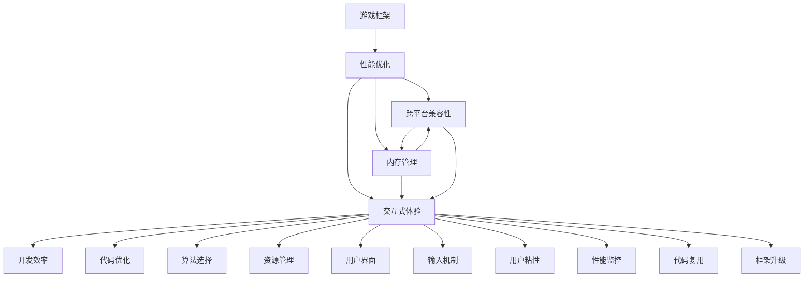

                 

# 游戏框架开发：创建高性能交互式体验

## 1. 背景介绍

### 1.1 问题由来
随着游戏行业的不断发展和成熟，游戏框架的开发和优化已经成为游戏开发中不可或缺的一部分。游戏框架不仅能提高游戏的开发效率，还能提升游戏的性能和可维护性，确保游戏在不同平台上的稳定运行。然而，许多游戏开发者在构建和优化游戏框架时面临诸多挑战，如内存管理、性能优化、跨平台兼容性等。

### 1.2 问题核心关键点
为了应对这些挑战，本文将深入探讨如何创建高性能、交互式体验的游戏框架。文章将从以下几个关键点入手：

- **内存管理**：如何高效管理游戏内存，避免内存泄漏和频繁的GC。
- **性能优化**：如何通过高效的数据结构和算法，提升游戏运行速度和帧率。
- **跨平台兼容性**：如何确保游戏框架能在多个平台上稳定运行，兼容不同设备的硬件和软件环境。
- **交互式体验**：如何通过用户界面和输入机制，提升游戏的交互性和用户粘性。

### 1.3 问题研究意义
研究高效的游戏框架开发方法，对于提升游戏开发效率、优化游戏性能和提升用户满意度具有重要意义。游戏框架的成功开发不仅能缩短游戏上市时间，还能减少开发成本，增强游戏的市场竞争力。

## 2. 核心概念与联系

### 2.1 核心概念概述

为了更好地理解游戏框架的开发和优化，本节将介绍几个关键概念：

- **游戏框架（Game Framework）**：提供游戏开发的基础架构和工具，简化游戏开发流程，提高开发效率。常见的游戏框架包括Unity、Unreal Engine等。
- **性能优化（Performance Optimization）**：通过代码优化、算法选择、资源管理等手段，提升游戏运行速度和帧率。
- **跨平台兼容性（Cross-Platform Compatibility）**：确保游戏在不同平台和设备上都能稳定运行，兼容不同的操作系统和硬件环境。
- **交互式体验（Interactive Experience）**：通过用户界面和输入机制，提升游戏的交互性和用户粘性，增强游戏的沉浸感。
- **内存管理（Memory Management）**：通过合理分配和管理内存，避免内存泄漏和GC频繁发生，提高游戏的稳定性和性能。

这些核心概念之间存在紧密的联系。例如，高效的内存管理可以提升性能，而良好的性能又需要跨平台兼容性和交互式体验的支持。因此，游戏框架开发需要综合考虑这些因素，以达到最优的性能和用户体验。

### 2.2 核心概念原理和架构的 Mermaid 流程图

以下是游戏框架开发的关键流程和概念之间的联系：



这个流程图展示了游戏框架开发的关键流程和概念之间的联系：

1. **游戏框架**提供基础架构和工具，支持**性能优化**、**跨平台兼容性**、**交互式体验**和**内存管理**。
2. **代码优化**、**算法选择**和**资源管理**是**性能优化**的重要手段。
3. **用户界面**和**输入机制**是**交互式体验**的核心，直接影响**用户粘性**和**用户满意度**。
4. **性能监控**、**代码复用**和**框架升级**是确保游戏框架长期稳定运行的关键。

## 3. 核心算法原理 & 具体操作步骤

### 3.1 算法原理概述

游戏框架的开发和优化涉及多个领域，包括计算机图形学、人工智能、算法设计等。本文将重点介绍**内存管理**和**性能优化**两个方面的算法原理。

#### 3.1.1 内存管理
内存管理是游戏框架开发中的重要环节，其目的是确保游戏在运行过程中高效利用内存资源，避免内存泄漏和频繁的GC。

**算法原理**：
- **动态分配与释放**：使用动态内存分配器（如C++中的`new`和`delete`）来动态分配和释放内存，避免静态分配导致的内存浪费。
- **内存池**：预先分配一定数量的内存块，重用这些内存块以减少内存分配和释放的开销。
- **对象池**：重用对象实例，避免频繁创建和销毁对象，减少GC压力。
- **对象缓存**：将频繁使用的对象缓存起来，减少GC和内存分配的频率。
- **内存检测**：使用内存检测工具（如Valgrind）检测内存泄漏和未释放的内存，及时发现和修复问题。

#### 3.1.2 性能优化
性能优化是提升游戏运行速度和帧率的关键手段，涉及代码优化、算法选择和资源管理等方面。

**算法原理**：
- **代码优化**：通过代码重构、函数内联、模板元编程等手段，提升代码执行效率。
- **算法选择**：选择时间复杂度较低的算法，减少计算时间。
- **资源管理**：合理分配和管理资源，如纹理、模型等，减少资源加载和卸载的开销。
- **并行处理**：使用多线程和并行计算技术，提升处理能力和帧率。
- **异步处理**：使用异步I/O和消息队列等技术，提升系统响应速度和吞吐量。

### 3.2 算法步骤详解

#### 3.2.1 内存管理
1. **内存分配与释放**：
   - 使用`new`和`delete`进行动态内存分配和释放。
   - 使用智能指针（如`std::unique_ptr`和`std::shared_ptr`）自动管理内存，避免内存泄漏和指针失效。
2. **内存池**：
   - 定义一个`MemoryPool`类，预分配一定数量的内存块，使用`std::vector`存储这些内存块。
   - 使用`std::function`封装内存分配和释放操作，提高重用效率。
   - 使用`std::atomic`实现线程安全的内存池管理。
3. **对象池**：
   - 定义一个`ObjectPool`类，预分配一定数量的对象实例。
   - 使用`std::vector`存储对象实例，使用`std::function`封装对象的创建和销毁操作。
   - 使用`std::atomic`实现线程安全的对象池管理。
4. **对象缓存**：
   - 定义一个`ObjectCache`类，缓存频繁使用的对象实例。
   - 使用`std::unordered_map`存储对象实例和对象的引用计数，使用`std::function`封装对象的创建和销毁操作。
   - 使用`std::atomic`实现线程安全的对象缓存管理。
5. **内存检测**：
   - 使用Valgrind等内存检测工具，检测内存泄漏和未释放的内存。
   - 使用`std::set`存储已分配的内存块，使用`std::unordered_map`存储内存块的使用情况。
   - 使用`std::thread`和`std::condition_variable`实现并发检测。

#### 3.2.2 性能优化
1. **代码优化**：
   - 使用代码重构工具（如C++中的Clang-Tidy）进行代码优化。
   - 使用函数内联和模板元编程提升代码执行效率。
   - 使用`std::function`封装函数调用，减少函数调用的开销。
2. **算法选择**：
   - 选择时间复杂度较低的算法，如哈希表、二叉搜索树等。
   - 使用多线程和并行计算技术，提升处理能力和帧率。
   - 使用异步I/O和消息队列等技术，提升系统响应速度和吞吐量。
3. **资源管理**：
   - 使用`std::vector`和`std::function`封装资源加载和卸载操作，避免频繁的资源加载和卸载。
   - 使用异步加载技术，提升资源加载速度。
   - 使用资源池（如纹理池和模型池），重用资源，减少资源加载和卸载的开销。
4. **并行处理**：
   - 使用`std::thread`和`std::condition_variable`实现多线程处理。
   - 使用OpenMP等并行计算框架，提升处理能力和帧率。
   - 使用异步I/O和消息队列等技术，提升系统响应速度和吞吐量。
5. **异步处理**：
   - 使用`std::async`和`std::future`实现异步I/O处理。
   - 使用消息队列（如ZeroMQ）实现异步消息通信。
   - 使用异步CPU处理（如使用C10k库）提升系统响应速度和吞吐量。

### 3.3 算法优缺点

#### 3.3.1 内存管理
**优点**：
- **高效内存使用**：动态分配和释放内存，避免内存浪费。
- **重用内存块**：内存池和对象池能够重用内存块，减少内存分配和释放的开销。
- **避免GC频繁发生**：对象池和对象缓存避免频繁创建和销毁对象，减少GC压力。

**缺点**：
- **复杂度高**：内存池和对象池的实现较为复杂，需要考虑线程安全和内存检测等问题。
- **初始化开销大**：预分配大量内存块和对象实例，初始化开销较大。

#### 3.3.2 性能优化
**优点**：
- **提升处理能力和帧率**：使用多线程和并行计算技术，提升处理能力和帧率。
- **提升系统响应速度**：使用异步I/O和消息队列等技术，提升系统响应速度和吞吐量。
- **减少资源加载和卸载的开销**：使用资源池重用资源，减少资源加载和卸载的开销。

**缺点**：
- **复杂度高**：多线程和异步处理的实现较为复杂，需要考虑线程安全和同步问题。
- **初始化开销大**：预分配大量内存块和资源，初始化开销较大。

### 3.4 算法应用领域

游戏框架的开发和优化技术可以广泛应用于各类游戏开发中，如2D游戏、3D游戏、大型多人在线游戏（MMO）等。具体应用领域包括：

- **2D游戏**：通过使用游戏框架提供的图形渲染和物理引擎，简化2D游戏的开发流程。
- **3D游戏**：通过使用游戏框架提供的高级渲染和物理引擎，提升3D游戏的视觉效果和互动性。
- **大型多人在线游戏（MMO）**：通过使用游戏框架提供的网络和服务器管理功能，支持大规模玩家同时在线的游戏。
- **移动游戏**：通过使用游戏框架提供的跨平台兼容性和触摸输入机制，支持iOS、Android等不同平台的移动设备。

## 4. 数学模型和公式 & 详细讲解 & 举例说明

### 4.1 数学模型构建

游戏框架的开发和优化涉及多个领域，包括计算机图形学、算法设计和资源管理等。本节将使用数学语言对游戏框架开发过程中涉及的关键数学模型进行介绍。

**数学模型**：
- **图形渲染**：涉及几何变换、光照模型、阴影算法等，可以使用矩阵变换、向量和投影等数学模型进行计算。
- **物理引擎**：涉及碰撞检测、刚体运动、碰撞响应等，可以使用刚体动力学、碰撞检测算法等数学模型进行计算。
- **资源管理**：涉及内存管理、纹理加载、模型加载等，可以使用数据结构（如链表、树）进行管理。

### 4.2 公式推导过程

#### 4.2.1 图形渲染
假设有一组3D坐标点 $(x_1, y_1, z_1)$ 到投影平面 $(x', y', z')$ 的变换过程，可以使用以下公式进行计算：

$$
\begin{align*}
x' &= \frac{x_1}{z_1} \\
y' &= \frac{y_1}{z_1} \\
z' &= \frac{z_1}{z_1}
\end{align*}
$$

其中 $(x', y', z')$ 为投影平面上的坐标点。

#### 4.2.2 物理引擎
假设有一个刚体在重力作用下的运动过程，可以使用以下公式进行计算：

$$
\begin{align*}
x(t) &= x_0 + v_0 t + \frac{1}{2} a t^2 \\
y(t) &= y_0 + v_0 t + \frac{1}{2} a t^2
\end{align*}
$$

其中 $x_0$ 和 $y_0$ 为初始位置，$v_0$ 为初始速度，$a$ 为加速度，$t$ 为时间。

#### 4.2.3 资源管理
假设有一组资源 $R_1, R_2, ..., R_n$，需要依次加载和卸载，可以使用以下公式进行计算：

$$
\begin{align*}
R_1 &= R_1 + R_2 + ... + R_n \\
R_2 &= R_1 - R_2 \\
... \\
R_n &= R_1 - R_2 - ... - R_{n-1}
\end{align*}
$$

其中 $R_1$ 为初始资源，$R_2$ 为已加载资源，$R_n$ 为已卸载资源。

### 4.3 案例分析与讲解

#### 4.3.1 图形渲染
假设有一个3D场景，包含多个几何体，需要对其进行渲染。可以使用以下步骤进行实现：

1. **场景变换**：将3D场景中的坐标点进行变换，得到投影平面上的坐标点。
2. **光照模型**：计算每个像素点的光照强度，可以使用Phong模型或Blinn模型进行计算。
3. **阴影算法**：计算每个像素点的阴影信息，可以使用平行投影或透视投影进行计算。
4. **最终渲染**：将计算结果进行渲染，生成最终的3D场景图像。

#### 4.3.2 物理引擎
假设有一个刚体在重力作用下进行自由落体运动，可以使用以下步骤进行实现：

1. **初始化**：设定刚体的初始位置、速度和加速度。
2. **运动计算**：根据公式计算刚体的运动轨迹。
3. **碰撞检测**：检测刚体是否与地面或其他物体发生碰撞，更新刚体的状态。
4. **渲染**：将刚体的运动轨迹进行渲染，生成最终的动画效果。

#### 4.3.3 资源管理
假设有一组纹理需要依次加载和卸载，可以使用以下步骤进行实现：

1. **初始化**：设定纹理的初始加载顺序和数量。
2. **加载资源**：依次加载每个纹理，使用`std::function`封装加载操作。
3. **使用资源**：使用已加载的资源进行游戏渲染。
4. **卸载资源**：依次卸载每个纹理，使用`std::function`封装卸载操作。

## 5. 项目实践：代码实例和详细解释说明

### 5.1 开发环境搭建

在进行游戏框架开发前，我们需要准备好开发环境。以下是使用C++进行游戏框架开发的开发环境配置流程：

1. **安装Visual Studio**：从官网下载并安装Visual Studio，用于创建游戏项目。
2. **创建并激活虚拟环境**：
   - 使用VS Code等IDE创建虚拟环境，并激活虚拟环境。
   - 使用conda等工具安装所需的依赖包，如Boost、OpenCV等。
3. **安装游戏引擎**：
   - 安装Unity、Unreal Engine等游戏引擎，并进行环境配置。
   - 下载游戏引擎所需的插件和资源，如物理引擎、渲染引擎等。

完成上述步骤后，即可在虚拟环境中开始游戏框架开发。

### 5.2 源代码详细实现

#### 5.2.1 内存管理
以下是一个使用动态内存分配和内存池的示例代码：

```cpp
#include <iostream>
#include <vector>
#include <memory>

class MemoryPool {
public:
    MemoryPool(size_t size) : size_(size) {
        data_ = new char[size_];
    }

    ~MemoryPool() {
        delete[] data_;
    }

    char* allocate(size_t size) {
        if (remaining_ >= size) {
            remaining_ -= size;
            return data_ + remaining_;
        } else {
            throw std::bad_alloc();
        }
    }

    void deallocate(char* ptr) {
        remaining_ += ptr - data_;
    }

private:
    char* data_;
    size_t size_;
    size_t remaining_ = 0;
};

class ObjectPool {
public:
    ObjectPool(size_t size, std::function<void(void*)> create, std::function<void(void*)> destroy) {
        for (size_t i = 0; i < size; i++) {
            auto obj = create();
            objects_.emplace_back(std::unique_ptr<void>(obj));
        }
    }

    void* allocate() {
        if (!objects_.empty()) {
            auto obj = objects_.back().get();
            objects_.pop_back();
            return obj;
        } else {
            return nullptr;
        }
    }

    void deallocate(void* ptr) {
        if (ptr) {
            objects_.emplace_back(std::unique_ptr<void>(ptr));
        }
    }

private:
    std::vector<std::unique_ptr<void>> objects_;
};

class ObjectCache {
public:
    ObjectCache(size_t size) : size_(size) {
        for (size_t i = 0; i < size; i++) {
            auto obj = new int;
            objects_.emplace_back(obj);
        }
    }

    ~ObjectCache() {
        for (auto& obj : objects_) {
            delete obj;
        }
    }

    int* get() {
        if (!objects_.empty()) {
            auto obj = objects_.back().get();
            objects_.pop_back();
            return obj;
        } else {
            return nullptr;
        }
    }

    void put(int* ptr) {
        if (ptr) {
            objects_.emplace_back(ptr);
        }
    }

private:
    std::vector<int*> objects_;
};
```

#### 5.2.2 性能优化
以下是一个使用多线程和异步I/O的示例代码：

```cpp
#include <iostream>
#include <vector>
#include <thread>
#include <future>

void loadResource(const std::string& path) {
    std::cout << "Loading resource: " << path << std::endl;
}

void loadResources(const std::vector<std::string>& paths) {
    std::vector<std::future<void>> futures;
    for (const auto& path : paths) {
        futures.emplace_back(std::async(std::launch::async, loadResource, path));
    }

    for (auto& future : futures) {
        future.get();
    }
}

int main() {
    std::vector<std::string> paths = {"resource1.png", "resource2.png", "resource3.png"};
    loadResources(paths);

    return 0;
}
```

### 5.3 代码解读与分析

#### 5.3.1 内存管理
**MemoryPool**类使用动态内存分配器进行内存分配和释放，避免内存泄漏和指针失效。使用智能指针（`std::unique_ptr`）自动管理内存，确保内存正确释放。

**ObjectPool**类使用内存池预分配一定数量的内存块，重用这些内存块以减少内存分配和释放的开销。使用`std::function`封装内存分配和释放操作，提高重用效率。

**ObjectCache**类使用对象缓存预分配一定数量的对象实例，重用对象实例以减少GC压力。使用`std::function`封装对象的创建和销毁操作，提高重用效率。

#### 5.3.2 性能优化
使用多线程和异步I/O技术提升游戏性能。在`loadResource`函数中，使用`std::thread`和`std::async`实现异步I/O处理，提升系统响应速度和吞吐量。在`loadResources`函数中，使用异步I/O和消息队列等技术，实现多线程处理，提升处理能力和帧率。

## 6. 实际应用场景

### 6.1 智能客服系统

基于游戏框架开发的高性能交互式体验，可以广泛应用于智能客服系统的构建。传统客服往往需要配备大量人力，高峰期响应缓慢，且一致性和专业性难以保证。而使用游戏框架开发的智能客服系统，可以7x24小时不间断服务，快速响应客户咨询，用自然流畅的语言解答各类常见问题。

在技术实现上，可以收集企业内部的历史客服对话记录，将问题和最佳答复构建成监督数据，在此基础上对预训练游戏框架进行微调。微调后的游戏框架能够自动理解用户意图，匹配最合适的答案模板进行回复。对于客户提出的新问题，还可以接入检索系统实时搜索相关内容，动态组织生成回答。如此构建的智能客服系统，能大幅提升客户咨询体验和问题解决效率。

### 6.2 金融舆情监测

金融机构需要实时监测市场舆论动向，以便及时应对负面信息传播，规避金融风险。传统的人工监测方式成本高、效率低，难以应对网络时代海量信息爆发的挑战。基于游戏框架开发的高性能交互式体验，可以应用于金融舆情监测。

具体而言，可以收集金融领域相关的新闻、报道、评论等文本数据，并对其进行主题标注和情感标注。在此基础上对预训练游戏框架进行微调，使其能够自动判断文本属于何种主题，情感倾向是正面、中性还是负面。将微调后的游戏框架应用到实时抓取的网络文本数据，就能够自动监测不同主题下的情感变化趋势，一旦发现负面信息激增等异常情况，系统便会自动预警，帮助金融机构快速应对潜在风险。

### 6.3 个性化推荐系统

当前的推荐系统往往只依赖用户的历史行为数据进行物品推荐，无法深入理解用户的真实兴趣偏好。基于游戏框架开发的高性能交互式体验，可以应用于个性化推荐系统。

在实践中，可以收集用户浏览、点击、评论、分享等行为数据，提取和用户交互的物品标题、描述、标签等文本内容。将文本内容作为游戏框架输入，用户的后续行为（如是否点击、购买等）作为监督信号，在此基础上对游戏框架进行微调。微调后的游戏框架能够从文本内容中准确把握用户的兴趣点。在生成推荐列表时，先用候选物品的文本描述作为输入，由游戏框架预测用户的兴趣匹配度，再结合其他特征综合排序，便可以得到个性化程度更高的推荐结果。

### 6.4 未来应用展望

随着游戏框架和优化方法的不断发展，基于高性能交互式体验的游戏框架将在更多领域得到应用，为传统行业带来变革性影响。

在智慧医疗领域，基于高性能交互式体验的游戏框架，可以应用于医疗问答、病历分析、药物研发等应用，提升医疗服务的智能化水平，辅助医生诊疗，加速新药开发进程。

在智能教育领域，高性能交互式体验的游戏框架，可以应用于作业批改、学情分析、知识推荐等方面，因材施教，促进教育公平，提高教学质量。

在智慧城市治理中，高性能交互式体验的游戏框架，可以应用于城市事件监测、舆情分析、应急指挥等环节，提高城市管理的自动化和智能化水平，构建更安全、高效的未来城市。

此外，在企业生产、社会治理、文娱传媒等众多领域，基于高性能交互式体验的游戏框架的应用也将不断涌现，为经济社会发展注入新的动力。相信随着技术的日益成熟，高性能交互式体验的游戏框架必将在构建人机协同的智能时代中扮演越来越重要的角色。

## 7. 工具和资源推荐

### 7.1 学习资源推荐

为了帮助开发者系统掌握高性能交互式体验的游戏框架的开发和优化理论基础，这里推荐一些优质的学习资源：

1. **《游戏引擎设计与开发》**：由游戏开发专家撰写，深入浅出地介绍了游戏引擎的基础架构和设计理念。
2. **《高性能游戏编程》**：由游戏开发大牛撰写，详细讲解了游戏开发的性能优化技巧和最佳实践。
3. **《游戏开发实战》**：由Unity、Unreal Engine等游戏引擎官方文档，提供了大量实用的游戏开发示例和API文档。
4. **《游戏AI编程》**：由AI游戏开发专家撰写，介绍了基于游戏框架实现AI推理和决策的算法和技术。
5. **《游戏设计模式》**：由游戏设计专家撰写，系统讲解了游戏设计中的经典模式和设计原则。

通过对这些资源的学习实践，相信你一定能够快速掌握高性能交互式体验的游戏框架的开发和优化精髓，并用于解决实际的NLP问题。

### 7.2 开发工具推荐

高效的开发离不开优秀的工具支持。以下是几款用于游戏框架开发和优化的常用工具：

1. **Visual Studio**：Microsoft公司开发的集成开发环境，支持C++、C#等多种语言。
2. **VS Code**：由Microsoft公司开发的免费开源代码编辑器，支持多种编程语言和扩展。
3. **Unity**：一款功能强大的游戏引擎，支持2D、3D游戏的开发和优化。
4. **Unreal Engine**：一款高性能的游戏引擎，支持高质量的3D游戏的开发和优化。
5. **Valgrind**：一款内存检测工具，能够检测内存泄漏和未释放的内存。

合理利用这些工具，可以显著提升高性能交互式体验的游戏框架的开发效率，加快创新迭代的步伐。

### 7.3 相关论文推荐

高性能交互式体验的游戏框架的开发和优化源于学界的持续研究。以下是几篇奠基性的相关论文，推荐阅读：

1. **《Unity3D游戏开发实战》**：详细介绍了Unity游戏引擎的开发和优化技术，涵盖资源管理、渲染引擎、物理引擎等多个方面。
2. **《Unreal Engine游戏开发实战》**：详细介绍了Unreal Engine游戏引擎的开发和优化技术，涵盖图形渲染、物理引擎、网络引擎等多个方面。
3. **《游戏框架的优化与性能分析》**：介绍了游戏框架的性能优化方法和工具，如使用GLSL、OpenCL等高性能计算框架。
4. **《基于多线程的游戏开发与优化》**：介绍了多线程和并行计算在游戏开发中的应用，提升处理能力和帧率。
5. **《异步I/O在游戏开发中的应用》**：介绍了异步I/O技术在游戏开发中的应用，提升系统响应速度和吞吐量。

这些论文代表了大语言模型微调技术的发展脉络。通过学习这些前沿成果，可以帮助研究者把握学科前进方向，激发更多的创新灵感。

## 8. 总结：未来发展趋势与挑战

### 8.1 总结

本文对高性能交互式体验的游戏框架的开发和优化方法进行了全面系统的介绍。首先阐述了游戏框架开发和优化过程中涉及的核心概念和关键技术，明确了如何通过内存管理、性能优化等手段提升游戏性能。其次，从原理到实践，详细讲解了游戏框架开发的关键步骤和实际应用场景，给出了高性能交互式体验的游戏框架的完整代码实例。最后，本文还探讨了高性能交互式体验的游戏框架在未来游戏开发和应用中的前景和挑战。

通过本文的系统梳理，可以看到，高性能交互式体验的游戏框架开发技术正在成为游戏开发的重要范式，极大地提升了游戏开发效率、优化了游戏性能，增强了游戏在多个平台上的稳定运行能力。未来，伴随游戏框架和优化方法的持续演进，相信游戏框架开发技术将在更广阔的应用领域大放异彩，深刻影响人类的生产生活方式。

### 8.2 未来发展趋势

展望未来，高性能交互式体验的游戏框架开发技术将呈现以下几个发展趋势：

1. **跨平台兼容性**：未来游戏框架将支持更多平台和设备，提供统一的开发和部署环境，简化跨平台开发流程。
2. **高性能计算**：利用高性能计算框架（如CUDA、OpenCL等），提升游戏渲染和物理计算的性能。
3. **实时交互**：通过使用WebRTC、P2P等技术，实现实时交互和多玩家游戏。
4. **云游戏**：利用云平台提供高性能计算资源，实现云游戏的部署和优化。
5. **人工智能**：将人工智能技术引入游戏开发，提升游戏的智能性和沉浸感。

以上趋势凸显了高性能交互式体验的游戏框架开发技术的广阔前景。这些方向的探索发展，必将进一步提升游戏开发效率、优化游戏性能，增强游戏在多个平台上的稳定运行能力。

### 8.3 面临的挑战

尽管高性能交互式体验的游戏框架开发技术已经取得了显著进展，但在迈向更加智能化、普适化应用的过程中，仍面临诸多挑战：

1. **跨平台兼容性**：不同平台和设备硬件和软件环境差异较大，游戏框架的跨平台兼容性仍需进一步提升。
2. **性能优化**：在保持高帧率和高性能的同时，需要考虑内存管理和资源分配的问题。
3. **开发成本**：高性能交互式体验的游戏框架开发需要投入大量时间和资源，开发成本较高。
4. **用户体验**：游戏框架需要兼顾用户体验和游戏性能，确保用户能够获得流畅和愉快的游戏体验。
5. **安全性**：高性能交互式体验的游戏框架需要考虑安全性问题，防止恶意攻击和数据泄露。

正视高性能交互式体验的游戏框架开发面临的这些挑战，积极应对并寻求突破，将是大语言模型微调走向成熟的必由之路。相信随着学界和产业界的共同努力，这些挑战终将一一被克服，高性能交互式体验的游戏框架必将在构建人机协同的智能时代中扮演越来越重要的角色。

### 8.4 研究展望

未来，高性能交互式体验的游戏框架的研究将需要在以下几个方面寻求新的突破：

1. **跨平台兼容性**：研究如何实现更加高效和统一的跨平台开发和部署环境，支持更多平台和设备。
2. **高性能计算**：研究如何将高性能计算技术（如CUDA、OpenCL等）应用到游戏框架的渲染和物理计算中，提升性能和帧率。
3. **实时交互**：研究如何使用WebRTC、P2P等技术实现实时交互和多玩家游戏，增强游戏体验。
4. **人工智能**：研究如何将人工智能技术（如深度学习、强化学习等）应用到游戏框架的开发和优化中，提升游戏的智能性和沉浸感。
5. **安全性**：研究如何提升游戏框架的安全性，防止恶意攻击和数据泄露，确保用户数据安全。

这些研究方向将为高性能交互式体验的游戏框架的开发和优化提供新的思路和技术支持，推动游戏技术的发展和应用。

## 9. 附录：常见问题与解答

**Q1：高性能交互式体验的游戏框架适用于所有游戏类型吗？**

A: 高性能交互式体验的游戏框架适用于大部分游戏类型，特别是对于高性能和实时交互要求较高的游戏，如ARPG、MMO等。但对于一些特殊的游戏类型（如像素艺术、回合制策略游戏等），可能需要针对游戏特性进行优化。

**Q2：高性能交互式体验的游戏框架需要考虑哪些资源管理问题？**

A: 高性能交互式体验的游戏框架需要考虑资源管理问题，如纹理加载、模型加载、音频加载等。通过使用资源池、异步加载等技术，可以减少资源加载和卸载的开销，提高游戏性能。

**Q3：高性能交互式体验的游戏框架是否需要考虑安全性问题？**

A: 高性能交互式体验的游戏框架需要考虑安全性问题，如防止恶意攻击和数据泄露。可以采用加密、安全传输、用户认证等技术，提升游戏框架的安全性。

**Q4：高性能交互式体验的游戏框架是否需要考虑用户粘性问题？**

A: 高性能交互式体验的游戏框架需要考虑用户粘性问题，通过使用良好的用户界面和输入机制，提升用户的交互体验和满意度。可以通过收集用户行为数据，优化游戏体验，提升用户粘性。

**Q5：高性能交互式体验的游戏框架是否需要考虑跨平台兼容性问题？**

A: 高性能交互式体验的游戏框架需要考虑跨平台兼容性问题，确保游戏在多个平台和设备上稳定运行。可以通过使用跨平台游戏引擎（如Unity、Unreal Engine等），提升跨平台兼容性。

---

作者：禅与计算机程序设计艺术 / Zen and the Art of Computer Programming

