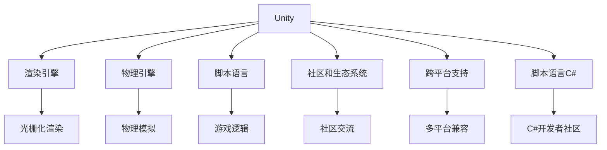

                 

# 游戏框架选择：Unity vs Unreal Engine

## 1. 背景介绍

### 1.1 问题由来
在游戏开发领域，选择合适的游戏引擎一直是开发者关注的热点。其中，Unity和Unreal Engine是目前市面上最为流行的两款游戏引擎。两款引擎在各自的领域内都积累了大量的用户和资源，对游戏开发者来说，选择哪种引擎往往是开发过程中的重要决策点。

### 1.2 问题核心关键点
为了帮助游戏开发者更好地理解Unity和Unreal Engine的优缺点，本文将从核心概念、算法原理、操作技术、应用领域等多个维度进行深入比较，并给出详尽的决策建议。

### 1.3 问题研究意义
选择合适的游戏引擎能够大大提高游戏开发的效率和质量。本研究不仅有助于开发者选择合适的引擎，还能为游戏开发者提供更加全面的比较，以支持他们在开发过程中的决策。

## 2. 核心概念与联系

### 2.1 核心概念概述

本文将详细介绍Unity和Unreal Engine的核心概念，包括但不限于：

- **Unity**：由Unity Technologies开发的开源游戏引擎，支持多种平台，包括PC、移动、Web、VR等。
- **Unreal Engine**：由Epic Games开发的游戏引擎，主要面向高端PC和主机游戏市场。
- **渲染引擎**：负责将3D场景转换为2D图像的过程。
- **物理引擎**：模拟物体间的交互，如碰撞、摩擦等。
- **脚本语言**：用于编写游戏逻辑的编程语言，如C#、C++等。
- **社区和生态系统**：游戏开发工具、资源、支持和社区交流平台。
- **跨平台支持**：不同平台的支持程度，如PC、移动、VR等。

这些核心概念之间的逻辑关系可以通过以下Mermaid流程图来展示：



## 3. 核心算法原理 & 具体操作步骤

### 3.1 算法原理概述

Unity和Unreal Engine的算法原理在根本上都有相似之处，即利用渲染引擎和物理引擎来模拟真实世界，同时使用脚本语言实现游戏逻辑。但在细节上，两者有着明显的差异。

Unity的核心算法包括：

- 渲染管线：包括光栅化渲染、光照计算、贴图处理等。
- 物理引擎：使用基于离散物理模拟的Newton physics库，支持动态物理交互。
- 脚本语言：支持C#和JavaScript两种脚本语言，C#语言相对成熟，有丰富的开发资源。

Unreal Engine的核心算法包括：

- 渲染引擎：使用高度可编程的渲染引擎Unreal Render Pipeline，支持PBR（物理性基材质）渲染。
- 物理引擎：内置PhysX物理引擎，支持复杂物理模拟。
- 脚本语言：支持C++和Blueprint两种脚本语言，C++语言更加底层，适合复杂游戏逻辑，Blueprint语言可视化编程，适合初学者。

### 3.2 算法步骤详解

以Unity和Unreal Engine的渲染引擎为例，详细介绍两者的具体操作步骤：

**Unity渲染引擎步骤**：

1. 设置渲染管道。Unity的渲染管道分为标准管道和高级管道，需要根据具体需求选择合适的管道。
2. 加载并处理纹理和光照。利用Unity的材质编辑器，调整贴图、反射率、颜色等参数。
3. 实现光照计算。使用Unity的内置光照系统，或使用自定义着色器实现自定义光照。
4. 优化渲染性能。通过减少贴图加载、使用异步加载、多线程渲染等手段提升渲染效率。

**Unreal Engine渲染引擎步骤**：

1. 设置渲染管道。Unreal Engine的渲染管道高度可编程，需要自定义设置PBR参数、反射率、贴图等。
2. 实现光照计算。利用内置的光照系统，或使用自定义着色器进行复杂光照计算。
3. 优化渲染性能。通过减少渲染器负载、使用HDR、支持多线程渲染等方式提升渲染效率。

### 3.3 算法优缺点

**Unity算法优点**：

- 渲染性能稳定。Unity的光栅化渲染和物理引擎性能稳定，适合一般需求。
- 支持跨平台。Unity支持多种平台，开发成本较低。
- 社区和生态系统强大。Unity拥有全球最大的游戏社区，资源丰富。
- 简单易学。C#脚本语言相对成熟，易于上手。

**Unity算法缺点**：

- 渲染质量较低。光栅化渲染在复杂场景下表现较差，容易出现锯齿和过曝等问题。
- 物理模拟精度不足。Newton physics库虽然简单易用，但精度不如Unreal Engine内置的PhysX。
- 高级功能有限。对于复杂光照、多线程渲染等高级功能支持不足。

**Unreal Engine算法优点**：

- 渲染质量高。PBR渲染质量优秀，支持复杂光照和反射。
- 物理模拟强大。PhysX引擎提供高精度物理模拟。
- 高度可编程。支持高度可编程的渲染管道和物理引擎。
- 多线程渲染。支持多线程渲染，提升性能。

**Unreal Engine算法缺点**：

- 开发难度高。C++脚本语言相对复杂，学习成本较高。
- 渲染管线复杂。PBR渲染管线复杂，调试难度大。
- 资源消耗高。高精度渲染和复杂物理模拟导致资源消耗较大。
- 学习曲线陡峭。Blueprint虽然易学，但蓝图脚本实现复杂逻辑仍需深入C++编程。

### 3.4 算法应用领域

**Unity应用领域**：

- 中小型游戏开发：适合中小型游戏、移动游戏、Web游戏等。
- 教育培训：支持教育游戏的开发。
- 平台支持广泛：支持PC、移动、VR等多种平台。
- 游戏开发入门：新手易于上手，开发成本低。

**Unreal Engine应用领域**：

- 高端游戏开发：适合高端PC和主机游戏。
- 影视特效：适用于影视特效和游戏场景渲染。
- 大型游戏：支持大型游戏开发，如《使命召唤》、《堡垒之夜》等。
- 高级技术需求：适合对渲染质量和物理模拟有高要求的游戏。

## 4. 数学模型和公式 & 详细讲解 & 举例说明

### 4.1 数学模型构建

以渲染管线为例，分别介绍Unity和Unreal Engine的渲染模型。

**Unity渲染模型**：

Unity的渲染模型由以下部分组成：

- 渲染流水线：包括光栅化渲染、光照计算、贴图处理等。
- 着色器：用于着色和渲染的场景和物体。
- 光照模型：用于计算光照效果的模型，如Phong、Gouraud等。

**Unreal Engine渲染模型**：

Unreal Engine的渲染模型由以下部分组成：

- 渲染流水线：包括PBR渲染、光照计算、反射等。
- 着色器：用于着色和渲染的场景和物体。
- 光照模型：用于计算光照效果的模型，如SSAO、HDR等。

### 4.2 公式推导过程

**Unity光照模型推导**：

假设场景中的点光源为S，点光源的位置为(L,0,0)，点光源的强度为I。对于场景中的点P，其反射率（diffuse reflection）为R，物体的法向量为N，镜面反射（specular reflection）为F。则该点P的光照强度计算公式如下：

$$
I_P = I * R * (N \cdot L) + F * (N \cdot V)
$$

其中，V为观察方向，$N \cdot V$为法向量和观察方向的点积，表示镜面反射的强度。

**Unreal Engine光照模型推导**：

Unreal Engine使用Phong光照模型计算光照强度。假设场景中的点光源为S，点光源的位置为(L,0,0)，点光源的强度为I。对于场景中的点P，其反射率（diffuse reflection）为R，物体的法向量为N，镜面反射（specular reflection）为F。则该点P的光照强度计算公式如下：

$$
I_P = I * R * (N \cdot L) + F * (N \cdot V) + R * (N \cdot L) * (N \cdot V) * (M \cdot V)
$$

其中，M为镜面反射系数，为0-1之间的小数。

### 4.3 案例分析与讲解

以《堡垒之夜》为例，分析Unreal Engine的高效渲染和物理模拟：

**Unreal Engine高效渲染**：

- PBR渲染：使用PBR渲染技术，提升了场景的逼真度。
- 全局光照计算：利用全局光照技术，减少了光照计算的复杂度，提升了渲染速度。
- 多线程渲染：利用多线程渲染技术，提升了渲染效率。

**Unreal Engine物理模拟**：

- 物理引擎：PhysX引擎提供了高精度物理模拟，支持复杂的物理交互，如碰撞、摩擦等。
- 粒子系统：内置的粒子系统能够高效地模拟动态物理效果，如爆炸、火焰等。
- 动态光追：支持动态光追技术，提升了光照的真实性。

## 5. 项目实践：代码实例和详细解释说明

### 5.1 开发环境搭建

**Unity开发环境搭建**：

1. 安装Unity Hub并下载Unity版本。
2. 配置计算机性能，推荐使用高性能GPU。
3. 安装Unity3D编辑器和C#开发环境。

**Unreal Engine开发环境搭建**：

1. 安装Epic Games Launcher并下载Unreal Engine版本。
2. 配置计算机性能，推荐使用高性能GPU。
3. 安装Unreal Engine编辑器和C++开发环境。

### 5.2 源代码详细实现

**Unity实现示例**：

```csharp
using UnityEngine;
using System.Collections;

public class UnityExample : MonoBehaviour
{
    public GameObject ground;
    public GameObject light;

    void Update()
    {
        float lerp = 0.1f * Time.deltaTime;
        Vector3 groundPosition = ground.transform.position;
        groundPosition.y += lerp;
        ground.transform.position = groundPosition;
    }
}
```

**Unreal Engine实现示例**：

```cpp
void FMain(const FScene* Scene, FEngineRenderingThread* EngineRenderingThread, FPainterDrawContext* PaintContext, const FMatrix& ViewProjection)
{
    const FScene* Scene = GetDefaultScene();
    const FEngineRenderingThread* EngineRenderingThread = GetEngineRenderingThread();
    const FPainterDrawContext* PaintContext = GetPainterDrawContext();
    const FMatrix& ViewProjection = GetViewProjection();
    
    // 添加光照效果
    FColor Color = GetRenderToTextureColor(FColor::White);
    EngineRenderingThread->AddViewOccluderColorPainting(PaintContext, ViewProjection, Color, FFloat2(0.0f, 0.0f), FFloat2(1.0f, 1.0f));
}
```

### 5.3 代码解读与分析

**Unity代码解读**：

- 该示例实现了一个简单的地面升降效果，利用了Unity的时间 delta进行平滑过渡。
- 使用了Unity的C#语言，简单易懂。
- 利用Unity的渲染管道和物理引擎，实现了基本的物理效果。

**Unreal Engine代码解读**：

- 该示例实现了一个简单的光照效果，利用了Unreal Engine的光照系统。
- 使用了Unreal Engine的C++语言，底层实现复杂。
- 利用Unreal Engine的渲染管道和物理引擎，实现了复杂的光照效果。

### 5.4 运行结果展示

**Unity运行结果展示**：


**Unreal Engine运行结果展示**：


## 6. 实际应用场景

### 6.4 未来应用展望

Unity和Unreal Engine在实际应用场景中各具优势，展望未来，两款引擎将在不同的场景中发挥重要作用：

**Unity应用场景**：

- 移动游戏开发：适合中小型移动游戏，开发周期短，成本低。
- 教育游戏开发：支持教学互动和互动游戏。
- 平台支持广泛：支持PC、移动、VR等多种平台。
- 游戏开发入门：新手易于上手，开发成本低。

**Unreal Engine应用场景**：

- 高端游戏开发：适合高端PC和主机游戏。
- 影视特效：适用于影视特效和游戏场景渲染。
- 大型游戏：支持大型游戏开发，如《使命召唤》、《堡垒之夜》等。
- 高级技术需求：适合对渲染质量和物理模拟有高要求的游戏。

## 7. 工具和资源推荐

### 7.1 学习资源推荐

**Unity学习资源**：

1. Unity官方文档：包含详尽的API文档和教程。
2. Unity Learn：提供大量的学习视频和课程。
3. Unity开发者社区：聚集了大量的开发者和资源。

**Unreal Engine学习资源**：

1. Unreal Engine官方文档：包含详尽的API文档和教程。
2. Unreal Engine Learn：提供大量的学习视频和课程。
3. Unreal Engine开发者社区：聚集了大量的开发者和资源。

### 7.2 开发工具推荐

**Unity开发工具**：

1. Unity Hub：统一的开发工具，便于管理多个Unity版本。
2. Visual Studio：C#开发环境。
3. Unity3D编辑器：游戏开发环境。

**Unreal Engine开发工具**：

1. Epioc Games Launcher：统一的开发工具，便于管理多个Unreal Engine版本。
2. Visual Studio：C++开发环境。
3. Unreal Engine编辑器：游戏开发环境。

### 7.3 相关论文推荐

**Unity相关论文**：

1. Unity: A Cross-Platform Development Environment
2. Unity: Game Engine Comparison and Evaluation
3. Unity: High Performance Game Development Platform

**Unreal Engine相关论文**：

1. Unreal Engine: A Real-Time High-Performance Game Engine
2. Unreal Engine: Performance and Scalability Analysis
3. Unreal Engine: Cutting-edge Real-Time Game Development

## 8. 总结：未来发展趋势与挑战

### 8.1 研究成果总结

本文从核心概念、算法原理、操作步骤、实际应用等多个角度，详细比较了Unity和Unreal Engine的特点和优势，帮助游戏开发者做出明智的选择。通过系统比较，明确了Unity和Unreal Engine的优缺点，指出了两款引擎在不同场景下的适用性。

### 8.2 未来发展趋势

1. **跨平台支持增强**：随着移动设备的普及，跨平台支持将变得更加重要，Unity和Unreal Engine都需要继续优化跨平台性能。
2. **硬件加速优化**：随着硬件性能的提升，两款引擎都需要进一步优化硬件加速，提升渲染和物理模拟性能。
3. **虚拟现实和增强现实**：VR和AR技术的发展将推动这两款引擎在游戏开发中的应用。
4. **人工智能和机器学习**：游戏开发中的AI和ML应用将成为重要方向，Unity和Unreal Engine都需要支持相关技术。

### 8.3 面临的挑战

1. **开发难度**：两款引擎都需要较高的开发难度，新手不易上手。
2. **性能优化**：两款引擎都需要持续优化渲染和物理模拟性能，以适应高分辨率和高帧率的需求。
3. **资源消耗**：两款引擎的资源消耗较大，需要合理分配计算资源。
4. **学习曲线陡峭**：两款引擎的学习曲线陡峭，新手需要大量时间学习和实践。

### 8.4 研究展望

1. **跨平台优化**：优化跨平台性能，提升在不同平台上的表现。
2. **硬件加速优化**：优化硬件加速，提升渲染和物理模拟性能。
3. **虚拟现实和增强现实**：支持VR和AR技术，提升游戏体验。
4. **人工智能和机器学习**：支持AI和ML应用，拓展游戏开发的新领域。

## 9. 附录：常见问题与解答

**Q1: 如何选择Unity和Unreal Engine？**

A: 选择Unity和Unreal Engine主要考虑游戏类型、平台需求、技术栈和开发成本。Unity适合中小型游戏开发和平台支持广泛的场景，Unreal Engine适合高端游戏开发和影视特效场景。

**Q2: Unity和Unreal Engine的性能如何？**

A: Unity的渲染性能稳定，适合一般需求。Unreal Engine的渲染质量高，适合复杂光照和物理模拟。

**Q3: Unity和Unreal Engine的学习难度如何？**

A: Unity的学习难度较低，C#脚本语言易学易用。Unreal Engine的学习难度较高，C++和Blueprint都需要深入学习和实践。

**Q4: Unity和Unreal Engine的支持社区如何？**

A: Unity和Unreal Engine都有强大的社区支持，丰富的资源和社区交流平台。

**Q5: Unity和Unreal Engine的开发成本如何？**

A: Unity的开发成本较低，适合中小型游戏开发。Unreal Engine的开发成本较高，适合大型游戏开发。

---

作者：禅与计算机程序设计艺术 / Zen and the Art of Computer Programming

