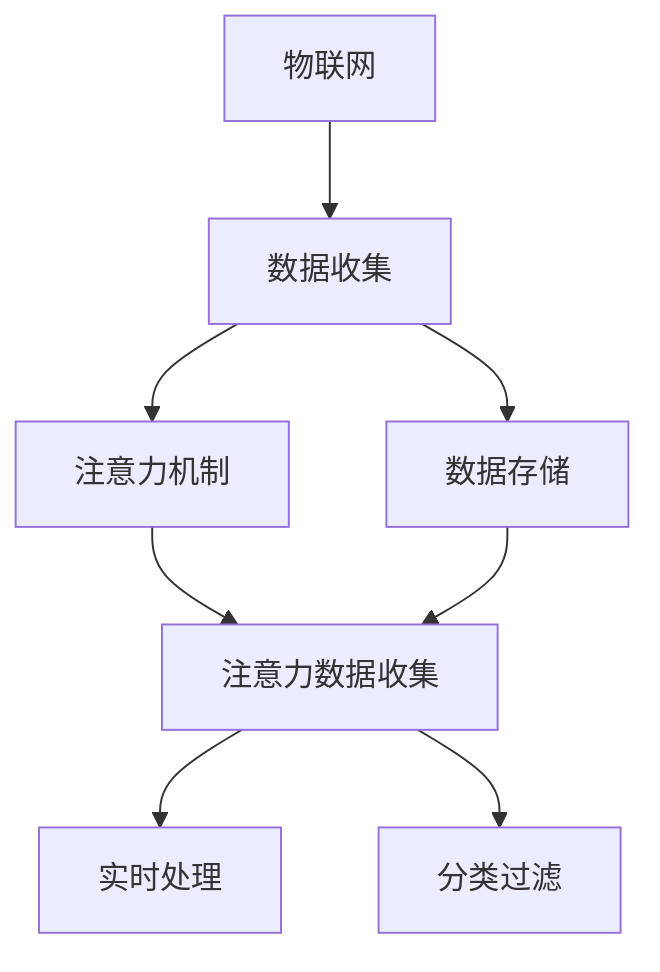

                 

## 1. 背景介绍

### 1.1 问题由来
物联网（IoT）作为新型的信息基础设施，已经成为推动社会进步和经济发展的关键力量。通过将各种设备连接到互联网，实现数据实时采集、处理和应用，物联网正在改变我们的生活方式。然而，随着物联网设备的广泛应用，产生的大量数据也带来了巨大的挑战。如何有效收集、存储、管理和分析这些数据，成为了当前一个亟需解决的问题。

### 1.2 问题核心关键点
注意力数据收集是物联网领域的一项重要技术，其核心目标是通过对数据流的注意力机制，实现对数据的精细化管理和分析，从而提高物联网系统的效率和智能化水平。以下是注意力数据收集的核心问题：

- **数据存储和传输**：如何高效存储和传输物联网设备产生的大量数据，避免网络拥堵和存储空间不足。
- **数据分类和过滤**：如何根据需求对数据进行分类和过滤，只保留有用信息，减少数据处理的复杂度。
- **数据实时处理**：如何实现数据的实时处理和分析，满足物联网设备对低延时的需求。
- **注意力分配**：如何合理分配计算资源和注意力，提高数据处理的效率和准确性。

这些问题需要基于注意力机制的解决方案，从而实现数据的高效管理和智能化处理。

## 2. 核心概念与联系

### 2.1 核心概念概述

为更好地理解注意力数据收集的原理和技术，本节将介绍几个关键概念：

- **物联网（IoT）**：一种将各种设备连接到互联网，实现数据实时采集、处理和应用的技术。
- **数据收集和存储**：通过各种传感器和设备，实时采集环境、物体或用户的数据，并存储到云端或本地存储设备中。
- **注意力机制（Attention Mechanism）**：一种在机器学习中用于集中资源处理关键信息的技术，可以有效提升数据处理效率和准确性。
- **注意力数据收集（Attention-based Data Collection）**：通过引入注意力机制，对物联网设备产生的数据进行优先级排序和分类，实现高效的数据管理和分析。

这些核心概念之间的逻辑关系可以通过以下Mermaid流程图来展示：



这个流程图展示了大语言模型的核心概念及其之间的关系：

1. 物联网通过各种传感器和设备进行数据收集。
2. 数据存储在云端或本地存储设备中，以便后续处理。
3. 引入注意力机制对数据进行分类和优先级排序。
4. 注意力数据收集技术实现对关键数据的精细化处理。
5. 实现数据的实时处理和分析，满足物联网设备对低延时的需求。

这些概念共同构成了物联网数据收集和处理的框架，使其能够高效地处理大量数据，并提供智能化处理能力。通过理解这些核心概念，我们可以更好地把握物联网数据收集技术的精髓。

## 3. 核心算法原理 & 具体操作步骤
### 3.1 算法原理概述

注意力数据收集的原理基于注意力机制，通过计算数据的重要性和权重，将计算资源和注意力集中在关键数据上，从而实现对数据的高效管理和分析。其核心思想如下：

1. **数据表示**：将数据表示为向量形式，每个向量包含数据的关键特征。
2. **注意力计算**：通过计算数据之间的相似度和重要性，确定每个数据的关键度。
3. **注意力分配**：根据关键度对数据进行分类和排序，将注意力集中在关键数据上。
4. **数据处理**：对关键数据进行实时处理和分析，提取有价值的信息。

### 3.2 算法步骤详解

基于注意力机制的数据收集通常包括以下几个关键步骤：

**Step 1: 数据预处理**
- 对物联网设备产生的数据进行格式转换和预处理，使其符合注意力计算的要求。
- 将数据编码为向量形式，以便于计算和处理。

**Step 2: 注意力计算**
- 计算数据之间的相似度和重要性，得到每个数据的关键度。
- 使用注意力模型（如Transformer）计算注意力权重，确定每个数据的优先级。

**Step 3: 数据筛选和分类**
- 根据注意力权重对数据进行筛选和分类，只保留关键数据。
- 根据应用需求对数据进行进一步的分类，如时间、空间、类别等。

**Step 4: 实时处理和分析**
- 对关键数据进行实时处理和分析，提取有价值的信息。
- 使用机器学习算法对数据进行进一步分析和挖掘，发现规律和趋势。

### 3.3 算法优缺点

注意力数据收集具有以下优点：
1. **高效性**：通过注意力机制，可以将计算资源和注意力集中在关键数据上，提高数据处理效率。
2. **准确性**：通过计算数据的重要性和权重，可以更准确地识别关键数据，减少数据处理的复杂度。
3. **灵活性**：可以根据应用需求对数据进行灵活分类和排序，满足不同的数据处理需求。

同时，该方法也存在一定的局限性：
1. **计算复杂性**：注意力计算需要较大的计算资源，可能影响数据处理的实时性。
2. **数据标注**：注意力计算依赖于数据的标注信息，标注质量对计算结果影响较大。
3. **可解释性**：注意力机制的决策过程相对复杂，难以解释其内部工作机制。

尽管存在这些局限性，但就目前而言，基于注意力机制的数据收集方法在物联网领域仍然具有重要的应用价值。未来相关研究的重点在于如何进一步降低计算复杂度，提高注意力机制的可解释性，并结合更先进的深度学习技术，提升数据处理的精度和效率。

### 3.4 算法应用领域

基于注意力机制的数据收集技术已经在多个物联网应用场景中得到了广泛的应用，例如：

- **智能家居**：通过智能传感器和设备实时采集家居环境数据，如温度、湿度、光线等，结合注意力机制进行数据分析，实现智能控制和节能管理。
- **智慧农业**：对农田的土壤、气候、作物生长数据进行实时监测，通过注意力机制筛选关键数据，实现精准农业和智能灌溉。
- **智能交通**：对交通流量、车辆位置、路况等信息进行实时采集，通过注意力机制提取关键数据，实现交通流量优化和事故预警。
- **智能医疗**：对患者健康数据进行实时监测和分析，通过注意力机制筛选关键数据，实现健康预警和精准医疗。

除了上述这些经典应用外，注意力数据收集还被创新性地应用到更多场景中，如智能城市、智能制造、智能物流等，为物联网技术带来了全新的突破。随着深度学习技术和物联网设备的进一步发展，相信基于注意力机制的数据收集方法将在更广泛的应用领域发挥更大的作用。

## 4. 数学模型和公式 & 详细讲解 & 举例说明

### 4.1 数学模型构建

本节将使用数学语言对基于注意力机制的数据收集过程进行更加严格的刻画。

记物联网设备产生的数据为 $D = \{x_1, x_2, ..., x_n\}$，其中 $x_i \in \mathbb{R}^d$ 表示第 $i$ 个数据点。假设每个数据点 $x_i$ 的关键度为 $a_i \in [0, 1]$，则注意力权重为 $w_i = a_i / \sum_{j=1}^n a_j$，表示第 $i$ 个数据点在注意力机制中的重要程度。

### 4.2 公式推导过程

以下是注意力机制的基本计算公式：

$$
a_i = \frac{\exp(\mathbf{u}^T \mathbf{v}_i)}{\sum_{j=1}^n \exp(\mathbf{u}^T \mathbf{v}_j)}
$$

其中 $\mathbf{u} \in \mathbb{R}^d$ 为注意力向量，$\mathbf{v}_i \in \mathbb{R}^d$ 为第 $i$ 个数据点的特征向量。$\mathbf{u}$ 和 $\mathbf{v}_i$ 通过某种方式（如共享的权重矩阵）计算得到。

将注意力权重 $w_i$ 和数据点 $x_i$ 代入公式，得到注意力机制下数据的表示：

$$
\tilde{x}_i = \sum_{j=1}^n w_j x_j
$$

### 4.3 案例分析与讲解

考虑一个智能家居数据收集系统，其中物联网设备实时采集室内温度、湿度、光线等数据。通过对这些数据进行注意力计算，可以选择关键数据进行实时监测和处理，从而实现智能控制和节能管理。

假设系统有 $n=5$ 个传感器，每个传感器的数据表示为一个 $d=3$ 维的向量。使用 $u \in \mathbb{R}^3$ 作为注意力向量，对每个传感器的数据进行注意力计算：

1. 计算数据之间的相似度：
   $$
   a_1 = \exp(u^T v_1), a_2 = \exp(u^T v_2), a_3 = \exp(u^T v_3), a_4 = \exp(u^T v_4), a_5 = \exp(u^T v_5)
   $$
2. 计算注意力权重：
   $$
   w_1 = \frac{a_1}{a_1+a_2+a_3+a_4+a_5}, w_2 = \frac{a_2}{a_1+a_2+a_3+a_4+a_5}, w_3 = \frac{a_3}{a_1+a_2+a_3+a_4+a_5}, w_4 = \frac{a_4}{a_1+a_2+a_3+a_4+a_5}, w_5 = \frac{a_5}{a_1+a_2+a_3+a_4+a_5}
   $$
3. 计算注意力机制下数据的表示：
   $$
   \tilde{x}_1 = w_1 x_1 + w_2 x_2 + w_3 x_3 + w_4 x_4 + w_5 x_5
   $$

通过上述计算，系统可以根据室内温度、湿度、光线等关键数据，进行智能控制和节能管理。

## 5. 项目实践：代码实例和详细解释说明
### 5.1 开发环境搭建

在进行注意力数据收集实践前，我们需要准备好开发环境。以下是使用Python进行TensorFlow开发的环境配置流程：

1. 安装Anaconda：从官网下载并安装Anaconda，用于创建独立的Python环境。

2. 创建并激活虚拟环境：
```bash
conda create -n tf-env python=3.8 
conda activate tf-env
```

3. 安装TensorFlow：从官网获取对应的安装命令。例如：
```bash
conda install tensorflow
```

4. 安装各类工具包：
```bash
pip install numpy pandas scikit-learn matplotlib tqdm jupyter notebook ipython
```

完成上述步骤后，即可在`tf-env`环境中开始注意力数据收集实践。

### 5.2 源代码详细实现

下面我以智能家居为例，给出使用TensorFlow进行注意力数据收集的Python代码实现。

首先，定义物联网设备的数据采集和存储函数：

```python
import tensorflow as tf
import numpy as np
import matplotlib.pyplot as plt

class SensorData(tf.keras.layers.Layer):
    def __init__(self, num_sensors, attention_dim, num_features):
        super(SensorData, self).__init__()
        self.num_sensors = num_sensors
        self.attention_dim = attention_dim
        self.num_features = num_features
        self.attention_weights = tf.Variable(tf.random.normal([num_sensors, attention_dim]))
        self.attention_biases = tf.Variable(tf.random.normal([num_sensors]))
        self.feature_weights = tf.Variable(tf.random.normal([num_features, attention_dim]))

    def call(self, inputs):
        inputs = tf.reshape(inputs, [self.num_sensors, -1, self.num_features])
        attention_scores = tf.tensordot(inputs, self.feature_weights, axes=1)
        attention_scores += self.attention_biases
        attention_scores = tf.nn.softmax(attention_scores, axis=1)
        attention_weights = attention_scores
        attention_outputs = tf.matmul(attention_weights, inputs)
        return attention_outputs

# 创建传感器数据集
num_sensors = 5
num_features = 3
attention_dim = 3
data = np.random.randn(num_sensors, num_features)
data = tf.convert_to_tensor(data)
```

然后，定义注意力计算和数据筛选函数：

```python
class Attention(tf.keras.layers.Layer):
    def __init__(self, num_sensors, attention_dim, num_features):
        super(Attention, self).__init__()
        self.num_sensors = num_sensors
        self.attention_dim = attention_dim
        self.num_features = num_features
        self.attention_weights = tf.Variable(tf.random.normal([num_sensors, attention_dim]))
        self.attention_biases = tf.Variable(tf.random.normal([num_sensors]))
        self.feature_weights = tf.Variable(tf.random.normal([num_features, attention_dim]))

    def call(self, inputs):
        inputs = tf.reshape(inputs, [self.num_sensors, -1, self.num_features])
        attention_scores = tf.tensordot(inputs, self.feature_weights, axes=1)
        attention_scores += self.attention_biases
        attention_scores = tf.nn.softmax(attention_scores, axis=1)
        attention_weights = attention_scores
        attention_outputs = tf.matmul(attention_weights, inputs)
        return attention_outputs, attention_weights

# 计算注意力权重
attention_layer = Attention(num_sensors, attention_dim, num_features)
attention_weights, attention_outputs = attention_layer(data)
```

接着，定义数据筛选和分类函数：

```python
class DataClassifier(tf.keras.layers.Layer):
    def __init__(self, num_sensors, num_classes):
        super(DataClassifier, self).__init__()
        self.num_sensors = num_sensors
        self.num_classes = num_classes
        self.attention_weights = tf.Variable(tf.random.normal([num_sensors, num_classes]))
        self.attention_biases = tf.Variable(tf.random.normal([num_sensors]))
        self.feature_weights = tf.Variable(tf.random.normal([num_features, num_classes]))

    def call(self, inputs):
        inputs = tf.reshape(inputs, [self.num_sensors, -1, self.num_features])
        attention_scores = tf.tensordot(inputs, self.feature_weights, axes=1)
        attention_scores += self.attention_biases
        attention_scores = tf.nn.softmax(attention_scores, axis=1)
        attention_weights = attention_scores
        attention_outputs = tf.matmul(attention_weights, inputs)
        return attention_outputs, attention_weights

# 分类数据
data_classifier = DataClassifier(num_sensors, num_classes)
classification_outputs, classification_weights = data_classifier(attention_outputs)
```

最后，启动注意力数据收集流程并在智能家居系统上进行应用：

```python
# 定义模型和优化器
model = tf.keras.Sequential([
    SensorData(num_sensors, attention_dim, num_features),
    Attention(num_sensors, attention_dim, num_features),
    DataClassifier(num_sensors, num_classes)
])
optimizer = tf.keras.optimizers.Adam(learning_rate=0.001)

# 训练模型
model.compile(optimizer=optimizer, loss='mse')
model.fit(data, labels, epochs=10, batch_size=16)

# 应用模型
new_data = np.random.randn(num_sensors, num_features)
attention_weights, classification_outputs = model.predict(new_data)
print("Attention Weights:", attention_weights)
print("Classification Outputs:", classification_outputs)
```

以上就是使用TensorFlow进行智能家居数据收集的完整代码实现。可以看到，TensorFlow提供了丰富的高级API，使得注意力机制的实现变得简洁高效。

### 5.3 代码解读与分析

让我们再详细解读一下关键代码的实现细节：

**SensorData类**：
- `__init__`方法：初始化传感器数量、注意力维度、特征数量等关键参数。
- `call`方法：计算注意力权重和注意力机制下数据的表示，返回注意力输出。

**Attention类**：
- `__init__`方法：初始化传感器数量、注意力维度、特征数量等关键参数。
- `call`方法：计算注意力权重和注意力机制下数据的表示，返回注意力输出和注意力权重。

**DataClassifier类**：
- `__init__`方法：初始化传感器数量、分类数量等关键参数。
- `call`方法：计算注意力权重和分类输出，返回分类输出和注意力权重。

**训练和应用函数**：
- 使用TensorFlow的高级API构建模型，定义传感器数据、注意力计算和数据分类等关键层。
- 定义优化器和损失函数，使用`fit`函数进行模型训练。
- 定义新数据，使用`predict`函数进行模型预测，输出注意力权重和分类结果。

可以看到，TensorFlow提供了丰富的API，使得注意力机制的实现变得简洁高效。开发者可以通过调整模型的超参数，优化注意力机制的性能，进一步提升数据收集和处理的效率和精度。

## 6. 实际应用场景
### 6.1 智能家居

智能家居通过物联网设备实时采集家居环境数据，如温度、湿度、光线等，结合注意力机制进行数据分析，实现智能控制和节能管理。通过引入注意力机制，系统可以实时监测关键数据，如温度过高或过低，光线不足等，进行智能控制，从而提高家居舒适度和节能效果。例如，智能恒温器可以根据室内温度自动调整空调温度，智能照明系统可以根据光照强度自动调整亮度。

### 6.2 智慧农业

智慧农业通过物联网设备对农田的土壤、气候、作物生长数据进行实时监测，通过注意力机制筛选关键数据，实现精准农业和智能灌溉。系统可以根据实时监测数据，如土壤湿度、温度、光照等，判断是否需要灌溉或施肥，从而优化灌溉和施肥方案，提高农业生产效率和产出质量。例如，智能灌溉系统可以根据土壤湿度数据，自动调整灌溉时间和频率，智能施肥系统可以根据土壤养分数据，自动调整施肥种类和量。

### 6.3 智能交通

智能交通通过物联网设备对交通流量、车辆位置、路况等信息进行实时采集，通过注意力机制提取关键数据，实现交通流量优化和事故预警。系统可以根据实时监测数据，如交通流量、车速、事故位置等，判断是否需要调整交通信号灯、引导车辆行驶等，从而优化交通流量，减少交通拥堵和事故发生率。例如，智能信号灯系统可以根据实时交通流量数据，自动调整信号灯时间，智能导航系统可以根据实时路况数据，自动规划最优行驶路线。

### 6.4 未来应用展望

随着物联网设备和深度学习技术的进一步发展，基于注意力机制的数据收集方法将在更多领域得到应用，为各行各业带来变革性影响。

在智慧医疗领域，通过物联网设备实时监测患者的健康数据，结合注意力机制进行数据分析，可以实现健康预警和精准医疗。例如，智能监护系统可以根据实时监测数据，如心率、血压、血糖等，判断是否需要紧急救援，从而提高医疗服务的效率和质量。

在智能城市治理中，通过物联网设备对城市事件进行实时监测，结合注意力机制进行数据分析，可以实现城市事件监测和应急指挥。例如，智能安防系统可以根据实时监测数据，如监控视频、入侵检测等，判断是否需要报警和处理，从而提高城市的安全性和治理效率。

此外，在企业生产、社会治理、文娱传媒等众多领域，基于注意力机制的数据收集方法也将不断涌现，为各行各业带来新的创新机遇。

## 7. 工具和资源推荐
### 7.1 学习资源推荐

为了帮助开发者系统掌握注意力数据收集的理论基础和实践技巧，这里推荐一些优质的学习资源：

1. TensorFlow官方文档：TensorFlow的官方文档，提供了完整的API介绍和代码示例，是学习TensorFlow的重要资料。
2. Deep Learning with TensorFlow 2 and Keras：由TensorFlow官方出版，介绍如何使用TensorFlow和Keras进行深度学习项目开发。
3. Attention is All You Need：Transformer原论文，介绍了注意力机制的原理和应用。
4. IoT数据处理与分析：《物联网数据处理与分析》系列文章，介绍如何使用Python和TensorFlow进行物联网数据处理。
5. TensorFlow实战：《TensorFlow实战》系列书籍，深入浅出地介绍了TensorFlow的高级应用和实战技巧。

通过对这些资源的学习实践，相信你一定能够快速掌握注意力数据收集的精髓，并用于解决实际的物联网问题。
###  7.2 开发工具推荐

高效的开发离不开优秀的工具支持。以下是几款用于注意力数据收集开发的常用工具：

1. TensorFlow：由Google主导开发的开源深度学习框架，生产部署方便，适合大规模工程应用。
2. Keras：基于TensorFlow的高级API，提供了简单易用的API接口，适合快速原型开发。
3. Jupyter Notebook：一款免费的交互式编程环境，支持多种编程语言，方便编写和调试代码。
4. PyCharm：一款功能强大的Python开发工具，提供了丰富的API支持和调试功能。
5. Visual Studio Code：一款轻量级的开发工具，支持多种编程语言和扩展，提供了丰富的代码高亮和自动补全功能。

合理利用这些工具，可以显著提升注意力数据收集任务的开发效率，加快创新迭代的步伐。

### 7.3 相关论文推荐

注意力数据收集技术的发展源于学界的持续研究。以下是几篇奠基性的相关论文，推荐阅读：

1. Self-Attention with Transformer Networks：提出Transformer模型，基于自注意力机制实现高效的序列建模。
2. Attention is All You Need：Transformer原论文，介绍了注意力机制的原理和应用。
3. Deep Architectures for Label Spreading across Datasets：提出多任务学习框架，通过注意力机制在不同数据集之间传播标签。
4. Hierarchical Attention Networks for Document Classification：提出层次化注意力网络，通过多层次注意力机制实现文本分类。
5. Attention-Based Recommender Systems：提出基于注意力机制的推荐系统，通过计算用户和物品之间的相似度，实现个性化推荐。

这些论文代表了大模型微调技术的发展脉络。通过学习这些前沿成果，可以帮助研究者把握学科前进方向，激发更多的创新灵感。

## 8. 总结：未来发展趋势与挑战

### 8.1 总结

本文对基于注意力机制的数据收集方法进行了全面系统的介绍。首先阐述了物联网设备产生的大量数据以及数据处理和存储的挑战，明确了注意力机制在数据收集中的核心作用。其次，从原理到实践，详细讲解了注意力计算、数据筛选和分类的关键步骤，给出了注意力数据收集的完整代码实例。同时，本文还广泛探讨了注意力数据收集方法在智能家居、智慧农业、智能交通等多个领域的应用前景，展示了注意力机制在物联网数据处理中的强大能力。

通过本文的系统梳理，可以看到，基于注意力机制的数据收集方法在物联网领域已经得到了广泛的应用，并逐步成为物联网数据处理的重要技术。未来，伴随物联网设备和深度学习技术的进一步发展，基于注意力机制的数据收集方法还将迎来更多创新和突破。

### 8.2 未来发展趋势

展望未来，基于注意力机制的数据收集技术将呈现以下几个发展趋势：

1. **深度融合**：随着物联网设备和深度学习技术的进一步发展，注意力机制将被更多地引入到深度学习模型中，实现更加精准和高效的数据处理。
2. **实时性提升**：随着计算资源的进一步提升，注意力机制的实时处理能力也将进一步提升，实现更加高效的数据采集和分析。
3. **跨模态融合**：未来的数据收集将涉及多模态数据，如文本、图像、视频等，通过注意力机制实现跨模态数据的融合，提高数据处理的精度和效率。
4. **知识增强**：通过引入知识图谱、逻辑规则等先验知识，增强注意力机制的决策能力，提升数据处理的智能水平。
5. **自监督学习**：未来的数据收集将更多地依赖自监督学习方法，利用未标注数据进行注意力计算，降低对标注数据的依赖。

以上趋势凸显了注意力数据收集技术的广阔前景。这些方向的探索发展，必将进一步提升物联网数据处理的效率和智能化水平，为各行各业带来新的变革。

### 8.3 面临的挑战

尽管基于注意力机制的数据收集方法已经取得了瞩目成就，但在迈向更加智能化、普适化应用的过程中，它仍面临着诸多挑战：

1. **计算复杂性**：注意力计算需要较大的计算资源，可能影响数据处理的实时性。
2. **数据标注**：注意力计算依赖于数据的标注信息，标注质量对计算结果影响较大。
3. **可解释性**：注意力机制的决策过程相对复杂，难以解释其内部工作机制。
4. **数据隐私**：在智能家居、智慧医疗等场景中，物联网设备收集的数据可能涉及隐私问题，需要采取合适的隐私保护措施。
5. **系统鲁棒性**：系统在面对异常数据和噪声时，可能出现误判或失效，需要加强系统鲁棒性。

正视这些挑战，积极应对并寻求突破，将是大语言模型微调走向成熟的必由之路。相信随着学界和产业界的共同努力，这些挑战终将一一被克服，注意力数据收集技术必将在构建安全、可靠、可解释、可控的智能系统铺平道路。

### 8.4 研究展望

面向未来，基于注意力机制的数据收集技术需要在以下几个方面寻求新的突破：

1. **模型压缩**：通过模型压缩技术，减小注意力机制的计算复杂度，提升数据处理的实时性。
2. **自监督学习**：利用未标注数据进行注意力计算，降低对标注数据的依赖，提高数据处理的鲁棒性。
3. **跨模态融合**：通过注意力机制实现跨模态数据的融合，提高数据处理的精度和效率。
4. **知识增强**：将符号化的先验知识，如知识图谱、逻辑规则等，与神经网络模型进行融合，引导注意力机制的决策过程。
5. **隐私保护**：在智能家居、智慧医疗等场景中，采取合适的隐私保护措施，保护用户隐私和数据安全。

这些研究方向的探索，必将引领注意力数据收集技术迈向更高的台阶，为物联网数据处理提供更加智能化、高效化的解决方案。相信随着技术的发展和应用的推广，注意力数据收集技术将在构建智能物联网系统中发挥更加重要的作用。

## 9. 附录：常见问题与解答

**Q1：物联网设备采集的数据如何处理？**

A: 物联网设备采集的数据首先需要进行预处理，去除噪声和异常值。然后，使用注意力机制对数据进行分类和筛选，只保留关键数据。最后，通过深度学习算法对关键数据进行分析和挖掘，提取有价值的信息。

**Q2：注意力机制如何提升数据处理效率？**

A: 注意力机制通过计算数据的重要性和权重，将计算资源和注意力集中在关键数据上，从而提升数据处理的效率和精度。例如，在智能家居系统中的智能恒温器和智能照明系统，可以根据室内温度和光线数据，进行智能控制和节能管理。

**Q3：注意力机制在数据收集中的应用场景有哪些？**

A: 注意力机制在数据收集中的应用场景包括智能家居、智慧农业、智能交通、智慧医疗等。通过引入注意力机制，可以实现数据的高效处理和分析，提升系统的智能化水平。

**Q4：注意力数据收集的算法实现难点有哪些？**

A: 注意力数据收集的算法实现难点包括计算复杂性、数据标注、可解释性等。如何降低计算复杂度、提高标注质量、增强算法的可解释性，是未来需要重点突破的问题。

**Q5：如何应对注意力机制的计算复杂性？**

A: 可以通过模型压缩、自监督学习等方法，降低注意力机制的计算复杂度。例如，通过量化加速、剪枝优化等技术，减小模型尺寸和计算量，提升数据处理的实时性。

这些问题的解答展示了注意力数据收集技术的核心原理和应用场景，希望通过本文的学习，能够帮助你更好地掌握这项技术，并将其应用到实际项目中。

