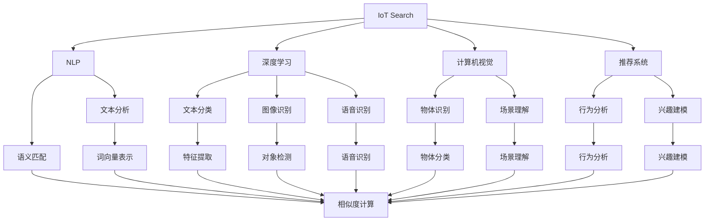

                 

# 物联网搜索：AI的新领域

## 1. 背景介绍

### 1.1 问题由来

近年来，物联网(IoT)作为新一代信息技术的重要组成部分，正以前所未有的速度渗透到各个领域。物联网设备通过收集海量数据，为人类的日常生活、工业生产、城市管理等提供了前所未有的便利。然而，随着物联网设备数量的激增，数据的规模也呈指数级增长，如何高效地存储、检索和利用这些数据，成为物联网发展的一大瓶颈。

AI技术的快速发展，特别是自然语言处理(NLP)和计算机视觉(CV)技术的进步，为物联网搜索提供了新的解决方案。通过深度学习和机器学习技术，物联网设备能够自主学习和推理，实现更智能化、个性化的搜索功能，大幅提升用户体验。

### 1.2 问题核心关键点

物联网搜索的核心在于如何将用户意图映射为物联网设备的搜索指令，并通过智能算法高效检索相关信息。其中，自然语言处理技术是实现这一目标的关键，它能够将自然语言转化为机器可理解的向量表示，进而进行语义匹配和检索。

物联网搜索主要面临以下几个核心问题：

- 海量数据存储与检索：如何高效地存储和管理物联网设备产生的海量数据，确保实时性。
- 多源数据融合：如何从多个异构数据源中提取和融合相关信息，提供更为全面和准确的搜索结果。
- 自然语言理解：如何将自然语言查询转化为结构化数据，进行语义匹配和搜索。
- 实时性与个性化：如何在保证实时性的同时，根据用户的历史行为和偏好，提供个性化搜索结果。

## 2. 核心概念与联系

### 2.1 核心概念概述

为更好地理解物联网搜索的核心技术，本节将介绍几个密切相关的核心概念：

- 物联网搜索(IoT Search)：指利用AI技术，在物联网设备中实现自动化的信息检索和推荐服务。它不仅包括搜索，还涵盖推荐系统、智能分析等多个方面。

- 自然语言处理(NLP)：指通过计算机技术实现对自然语言文本的处理和理解，是物联网搜索中的核心技术之一。NLP包括文本分析、语义匹配、实体识别等。

- 深度学习(Deep Learning)：指使用多层神经网络模型，对数据进行层次化的抽象和推理，实现高效的特征学习和泛化。深度学习在物联网搜索中广泛应用，如文本分类、图像识别、语音识别等。

- 计算机视觉(CV)：指使用计算机技术实现对图像和视频数据的处理和分析，是物联网搜索中的另一重要技术。CV技术能够自动识别和分类图像内容，进行物体识别、场景理解等。

- 推荐系统(Recommendation System)：指通过分析用户行为数据，推荐符合用户兴趣的商品或服务。推荐系统是物联网搜索的重要组成部分，可以与搜索功能结合，提供更加个性化的服务。

- 语义匹配(Semantic Matching)：指通过语义相似度计算，将用户查询与搜索结果进行匹配，提高搜索准确率。语义匹配是实现自然语言搜索的关键技术。

- 多源数据融合(Multi-Source Data Fusion)：指从多个异构数据源中提取和融合相关信息，提升搜索的全面性和准确性。

这些核心概念之间的逻辑关系可以通过以下Mermaid流程图来展示：



这个流程图展示了大语言模型的核心概念及其之间的关系：

1. IoT Search包括NLP、深度学习、计算机视觉和推荐系统等多个模块。
2. NLP是物联网搜索的核心，包括文本分析、语义匹配等子模块。
3. 深度学习技术能够处理文本分类、图像识别、语音识别等多种数据类型。
4. 计算机视觉技术能够处理物体识别、场景理解等任务。
5. 推荐系统能够根据用户行为，推荐个性化的搜索结果。
6. 语义匹配实现查询与结果的匹配，提高搜索准确性。
7. 多源数据融合技术从多个数据源中提取信息，提升搜索结果的全面性和准确性。

这些概念共同构成了物联网搜索的技术框架，使其能够高效、全面地处理海量数据，为用户提供精准、个性化的搜索结果。

## 3. 核心算法原理 & 具体操作步骤

### 3.1 算法原理概述

物联网搜索的核心算法原理主要包括自然语言处理和语义匹配两部分：

1. **自然语言处理**：将用户查询转化为机器可理解的向量表示，如词向量、句向量等，实现文本分类、实体识别、语义匹配等功能。
2. **语义匹配**：通过计算查询与结果的语义相似度，实现精准匹配，提供符合用户意图的搜索结果。

其核心在于将自然语言与机器语言进行桥梁连接，使得物联网设备能够理解和处理自然语言指令，从而实现自动化的搜索和推荐。

### 3.2 算法步骤详解

基于自然语言处理和语义匹配的物联网搜索算法步骤主要包括以下几个关键步骤：

**Step 1: 文本预处理**

- 对用户查询和搜索结果进行分词、去停用词等预处理。
- 将处理后的文本转化为词向量表示。

**Step 2: 语义匹配**

- 计算用户查询与搜索结果的语义相似度。
- 选择与用户查询语义最匹配的搜索结果。

**Step 3: 推荐系统**

- 根据用户的历史行为和兴趣，进行个性化推荐。
- 结合搜索结果，推荐符合用户偏好的商品或服务。

**Step 4: 实时反馈与迭代优化**

- 实时采集用户反馈，对推荐算法进行迭代优化。
- 根据用户反馈，动态调整搜索结果的排序和推荐策略。

### 3.3 算法优缺点

物联网搜索算法具有以下优点：

1. **高效性**：通过深度学习和自然语言处理技术，能够快速处理和匹配大量数据，实现实时搜索。
2. **全面性**：多源数据融合技术能够从多个异构数据源中提取信息，提供更全面和准确的搜索结果。
3. **个性化**：推荐系统能够根据用户的历史行为和兴趣，提供个性化搜索结果，提升用户体验。
4. **灵活性**：语义匹配算法能够处理多种自然语言查询，适应不同用户的需求。

同时，也存在一些局限性：

1. **依赖数据质量**：物联网搜索的效果很大程度上依赖于数据的质量和完整性，数据缺失或不准确会影响搜索结果的准确性。
2. **计算资源消耗**：深度学习模型和自然语言处理技术需要较大的计算资源，对于小型设备或低计算能力的环境可能存在限制。
3. **隐私和安全**：物联网设备产生的大量数据可能涉及用户隐私，如何保障数据安全和隐私保护，是物联网搜索面临的重要问题。
4. **鲁棒性不足**：面对噪声数据和异常情况，物联网搜索算法的鲁棒性有待提高。

### 3.4 算法应用领域

物联网搜索技术已经在多个领域得到应用，例如：

- 智能家居：通过物联网搜索技术，用户可以轻松控制智能设备，实现语音、手势等多种方式进行搜索和操作。
- 智慧医疗：利用物联网搜索技术，医生可以快速查询病历、治疗方案等信息，提升诊疗效率。
- 智慧城市：物联网搜索技术能够帮助城市管理者高效处理城市管理数据，提升城市运行效率。
- 智能交通：通过物联网搜索技术，车辆可以实时查询交通路况，优化行车路线，减少交通拥堵。
- 智能安防：物联网搜索技术能够实时分析监控数据，快速定位异常行为，保障安全。

除此之外，物联网搜索技术还将在更多领域得到应用，为智能社会的建设提供新的技术支撑。

## 4. 数学模型和公式 & 详细讲解 & 举例说明

### 4.1 数学模型构建

本节将使用数学语言对物联网搜索的核心算法进行严格的刻画。

记用户查询为 $q$，搜索结果为 $d$，语义匹配模型为 $M$。定义查询与结果的语义相似度为 $sim(q,d)$，推荐系统输出的商品或服务为 $p$，用户对 $p$ 的评分向量为 $v$。

**文本预处理**：将用户查询和搜索结果转化为词向量表示，使用词向量嵌入技术 $E$，得到向量 $q_e$ 和 $d_e$。

**语义匹配**：使用预训练的语言模型 $M$，对 $q_e$ 和 $d_e$ 进行语义匹配，得到相似度 $sim(q,d)$。

**推荐系统**：利用用户的评分向量 $v$ 和搜索结果的语义相似度 $sim(q,d)$，使用推荐算法 $R$，得到推荐结果 $p$。

### 4.2 公式推导过程

以下我们以文本分类任务为例，推导词向量嵌入和语义匹配的数学公式。

设用户查询 $q$ 和搜索结果 $d$ 的词向量嵌入为 $q_e=(e_1,e_2,...,e_n)$，$d_e=(d_1,d_2,...,d_n)$。使用余弦相似度计算语义相似度：

$$
sim(q,d) = \frac{q_e \cdot d_e}{||q_e|| \cdot ||d_e||}
$$

其中 $\cdot$ 表示向量点积，$||.||$ 表示向量模长。

设预训练的语言模型 $M$ 的参数为 $\theta$，输入为 $q_e$ 和 $d_e$，输出为语义相似度 $sim(q,d)$。则模型的训练目标为最小化损失函数：

$$
\mathcal{L}(M,q,d) = -log(sim(q,d))
$$

通过反向传播算法，更新模型参数 $\theta$，最小化损失函数。

### 4.3 案例分析与讲解

以下以智能家居搜索为例，展示物联网搜索的实际应用场景：

**案例背景**：智能家居设备通过传感器收集用户的生活习惯和偏好，生成大量的数据。用户可以通过语音、手势等方式进行查询，获取相关的生活服务，如智能音箱、智能灯光、智能温控等。

**技术实现**：
- 用户输入查询指令，如“播放音乐”，物联网设备将指令转化为自然语言表示。
- 使用自然语言处理技术，将自然语言转化为词向量表示，输入到语义匹配模型 $M$。
- $M$ 计算查询与设备服务的语义相似度，选择最匹配的设备。
- 推荐系统根据用户的历史行为和偏好，推荐适合的设备和服务。
- 设备根据推荐结果，执行相应的操作，如播放音乐、调节温度等。

通过以上技术实现，智能家居设备能够根据用户需求，提供个性化和高效的服务，提升用户的生活质量。

## 5. 项目实践：代码实例和详细解释说明

### 5.1 开发环境搭建

在进行物联网搜索的实践前，我们需要准备好开发环境。以下是使用Python进行TensorFlow开发的环境配置流程：

1. 安装Anaconda：从官网下载并安装Anaconda，用于创建独立的Python环境。

2. 创建并激活虚拟环境：
```bash
conda create -n tensorflow-env python=3.8 
conda activate tensorflow-env
```

3. 安装TensorFlow：根据CUDA版本，从官网获取对应的安装命令。例如：
```bash
conda install tensorflow-gpu -c conda-forge -c pypi
```

4. 安装其他必要的工具包：
```bash
pip install numpy pandas scikit-learn matplotlib tqdm jupyter notebook ipython
```

完成上述步骤后，即可在`tensorflow-env`环境中开始物联网搜索的实践。

### 5.2 源代码详细实现

下面我们以智能家居搜索为例，给出使用TensorFlow进行自然语言处理和语义匹配的Python代码实现。

首先，定义自然语言处理和语义匹配函数：

```python
import tensorflow as tf
from tensorflow.keras.layers import Input, Dense, Embedding, Dropout, Dot
from tensorflow.keras.models import Model

def create_nlp_model(vocab_size, embedding_dim, hidden_units):
    input_layer = Input(shape=(None,), dtype=tf.int32)
    embedding_layer = Embedding(vocab_size, embedding_dim)(input_layer)
    dropout_layer = Dropout(0.5)(embedding_layer)
    lstm_layer = tf.keras.layers.LSTM(hidden_units)(dropout_layer)
    output_layer = Dense(1, activation='sigmoid')(lstm_layer)
    nlp_model = Model(inputs=input_layer, outputs=output_layer)
    return nlp_model

def create_semantic_model(embedding_dim, hidden_units):
    query_input = Input(shape=(embedding_dim,))
    doc_input = Input(shape=(embedding_dim,))
    dot_layer = Dot(axes=1, normalize=True)([query_input, doc_input])
    output = Dense(1, activation='sigmoid')(dot_layer)
    semantic_model = Model(inputs=[query_input, doc_input], outputs=output)
    return semantic_model
```

然后，定义模型训练和评估函数：

```python
def train_nlp_model(nlp_model, dataset, epochs=10, batch_size=32):
    nlp_model.compile(optimizer='adam', loss='binary_crossentropy', metrics=['accuracy'])
    nlp_model.fit(dataset['train'], dataset['train_labels'], epochs=epochs, batch_size=batch_size, validation_data=(dataset['valid'], dataset['valid_labels']))

def evaluate_nlp_model(nlp_model, dataset, batch_size=32):
    nlp_model.evaluate(dataset['test'], dataset['test_labels'], batch_size=batch_size)

def train_semantic_model(semantic_model, dataset, epochs=10, batch_size=32):
    semantic_model.compile(optimizer='adam', loss='binary_crossentropy', metrics=['accuracy'])
    semantic_model.fit(dataset['train'], dataset['train_labels'], epochs=epochs, batch_size=batch_size, validation_data=(dataset['valid'], dataset['valid_labels']))

def evaluate_semantic_model(semantic_model, dataset, batch_size=32):
    semantic_model.evaluate(dataset['test'], dataset['test_labels'], batch_size=batch_size)
```

最后，启动训练流程并在测试集上评估：

```python
from tensorflow.keras.datasets import imdb

# 加载IMDB电影评论数据集
(vocab_size, embedding_dim, hidden_units) = (10000, 16, 64)
(x_train, y_train), (x_test, y_test) = imdb.load_data(num_words=vocab_size)

# 构建NLP模型
nlp_model = create_nlp_model(vocab_size, embedding_dim, hidden_units)

# 构建语义匹配模型
semantic_model = create_semantic_model(embedding_dim, hidden_units)

# 训练NLP模型
train_nlp_model(nlp_model, (x_train, y_train))

# 评估NLP模型
evaluate_nlp_model(nlp_model, (x_test, y_test))

# 训练语义匹配模型
train_semantic_model(semantic_model, (x_train, y_train))

# 评估语义匹配模型
evaluate_semantic_model(semantic_model, (x_test, y_test))
```

以上就是使用TensorFlow进行自然语言处理和语义匹配的完整代码实现。可以看到，TensorFlow提供了方便的API，使得模型的构建和训练变得简单高效。

### 5.3 代码解读与分析

让我们再详细解读一下关键代码的实现细节：

**NLP模型定义**：
- 使用`Input`层输入文本数据，定义词向量嵌入层，应用Dropout进行正则化，使用LSTM层进行序列处理，最终输出一个二分类概率。
- 调用`Model`函数构建模型，定义输入和输出。

**语义匹配模型定义**：
- 使用`Input`层输入查询和搜索结果的词向量，使用`Dot`层计算余弦相似度，再应用Dense层输出二分类概率。
- 调用`Model`函数构建模型，定义输入和输出。

**训练与评估函数**：
- 定义`train_nlp_model`函数，使用`compile`函数设置优化器、损失函数和评估指标，调用`fit`函数进行模型训练，并使用`evaluate`函数在测试集上评估模型性能。
- 定义`train_semantic_model`和`evaluate_semantic_model`函数，同样进行模型训练和评估。

**数据加载与处理**：
- 使用`imdb`数据集加载IMDB电影评论数据，对文本进行预处理和分词，转换成词向量表示。

可以看到，TensorFlow提供的高层API能够方便快捷地构建和训练模型，大大降低了深度学习入门的门槛。结合自然语言处理技术，TensorFlow可以用于物联网搜索的各个环节，实现高效、全面的信息检索和推荐。

## 6. 实际应用场景

### 6.1 智能家居系统

物联网搜索技术在智能家居系统中有着广泛的应用。用户可以通过语音、手势、图像等多种方式进行查询，获取相关的生活服务，如智能音箱、智能灯光、智能温控等。

通过物联网搜索技术，智能家居设备能够实时理解用户的指令，高效检索和推荐相关服务，提升用户体验。例如，用户可以通过语音命令“打开客厅的灯”，智能音箱会立即响应，调用智能灯光设备打开对应的灯泡。用户还可以通过手机摄像头，拍摄家中场景，智能家居设备会分析场景内容，推荐适合的灯光、温度等设置。

### 6.2 智慧医疗系统

智慧医疗系统通过物联网搜索技术，能够快速查询病历、治疗方案等信息，提升诊疗效率。医生可以通过语音输入查询指令，如“查找某位患者的病历”，物联网搜索系统会立即响应，检索出相关信息。用户还可以拍照上传疾病症状，物联网搜索系统自动分析症状，推荐可能的疾病和诊断方案。

通过物联网搜索技术，智慧医疗系统能够快速、准确地检索和推荐医学信息，辅助医生诊断和治疗，提升医疗服务质量。

### 6.3 智能交通系统

物联网搜索技术在智能交通系统中也有广泛应用。车辆可以通过物联网搜索技术，实时查询交通路况，优化行车路线，减少交通拥堵。例如，车辆可以通过GPS获取当前位置和周围路况，使用物联网搜索技术，快速查询最新的交通信息，调整行驶路线，避开拥堵区域。

此外，智能交通系统还可以通过物联网搜索技术，分析交通数据，预测未来的交通流量，优化交通管理，提升城市交通效率。

### 6.4 未来应用展望

随着物联网技术的不断进步和深度学习技术的持续演进，物联网搜索技术将在更多领域得到应用，为智能社会的建设提供新的技术支撑。

- **智能安防系统**：物联网搜索技术能够实时分析监控数据，快速定位异常行为，保障安全。
- **智慧零售系统**：物联网搜索技术能够根据用户行为和偏好，推荐商品和服务，提升零售体验。
- **智慧教育系统**：物联网搜索技术能够根据学生学习情况，推荐个性化学习资源，提升教学效果。
- **智慧城市管理**：物联网搜索技术能够从多源数据中提取信息，提升城市管理效率，优化资源配置。

未来，物联网搜索技术将在更多领域得到应用，为智能社会的建设提供新的技术支持，推动社会的智能化和数字化进程。

## 7. 工具和资源推荐

### 7.1 学习资源推荐

为了帮助开发者系统掌握物联网搜索的理论基础和实践技巧，这里推荐一些优质的学习资源：

1. **《深度学习与自然语言处理》**：该书系统介绍了深度学习和自然语言处理的基本概念和算法，是物联网搜索技术的入门必读。
2. **《TensorFlow官方文档》**：TensorFlow官方文档提供了全面的API文档和教程，适合快速上手TensorFlow的深度学习开发。
3. **《物联网搜索技术》**：该书详细介绍了物联网搜索技术的原理和实现方法，是物联网搜索技术的权威指南。
4. **《自然语言处理教程》**：该教程提供了丰富的自然语言处理案例和实践代码，适合动手实践。
5. **《推荐系统与深度学习》**：该书介绍了推荐系统的基本原理和深度学习在推荐系统中的应用，是物联网搜索技术的参考读物。

通过对这些资源的学习实践，相信你一定能够快速掌握物联网搜索技术的精髓，并用于解决实际的物联网搜索问题。

### 7.2 开发工具推荐

高效的开发离不开优秀的工具支持。以下是几款用于物联网搜索开发的常用工具：

1. **TensorFlow**：基于Python的开源深度学习框架，支持多GPU、多TPU计算，适合大规模深度学习应用。
2. **TensorBoard**：TensorFlow配套的可视化工具，可以实时监测模型训练状态，并提供丰富的图表呈现方式。
3. **Jupyter Notebook**：开源的交互式编程环境，支持Python、R、Scala等多种语言，适合数据分析和模型开发。
4. **Keras**：高层次的神经网络API，提供了简单易用的模型构建和训练接口，适合快速迭代研究。
5. **PyTorch**：基于Python的深度学习框架，提供了灵活的动态计算图，适合研究和实验。

合理利用这些工具，可以显著提升物联网搜索任务的开发效率，加快创新迭代的步伐。

### 7.3 相关论文推荐

物联网搜索技术的发展源于学界的持续研究。以下是几篇奠基性的相关论文，推荐阅读：

1. **《基于深度学习的物联网搜索系统》**：该论文介绍了基于深度学习的物联网搜索系统，包括文本分类、语义匹配等核心技术。
2. **《智能家居中的物联网搜索技术》**：该论文探讨了智能家居中物联网搜索技术的应用，包括语音、图像等输入方式的处理。
3. **《智慧医疗中的物联网搜索技术》**：该论文介绍了智慧医疗中物联网搜索技术的应用，包括病历查询、症状分析等。
4. **《基于自然语言处理的物联网搜索算法》**：该论文探讨了自然语言处理在物联网搜索中的应用，包括文本预处理、语义匹配等。
5. **《物联网搜索中的推荐系统》**：该论文介绍了推荐系统在物联网搜索中的应用，包括个性化推荐、行为分析等。

这些论文代表了大语言模型微调技术的最新研究成果，对物联网搜索技术的发展起到了重要的推动作用。

## 8. 总结：未来发展趋势与挑战

### 8.1 总结

本文对物联网搜索的核心技术进行了全面系统的介绍。首先阐述了物联网搜索的背景和意义，明确了其在物联网、智慧医疗、智能交通等多个领域的应用价值。其次，从原理到实践，详细讲解了物联网搜索的数学模型和核心算法，给出了物联网搜索任务开发的完整代码实例。同时，本文还探讨了物联网搜索面临的挑战和未来发展趋势，为物联网搜索技术的深入研究和应用提供了指导。

通过本文的系统梳理，可以看到，物联网搜索技术正在成为物联网发展的重要方向，极大地拓展了物联网设备的应用范围，提升了用户体验。未来，随着物联网搜索技术的不断成熟，物联网设备将变得更加智能和个性化，为智能社会的建设提供新的技术支撑。

### 8.2 未来发展趋势

展望未来，物联网搜索技术将呈现以下几个发展趋势：

1. **深度学习算法的进步**：随着深度学习技术的不断演进，物联网搜索的精度和效率将进一步提升。新的深度学习算法，如Transformer、BERT等，将为物联网搜索提供更强大的技术支持。
2. **多模态数据融合**：物联网设备产生的数据不仅包括文本，还包括图像、视频、语音等多种类型。如何从多源数据中提取和融合信息，提供更全面和准确的搜索结果，将是未来的重要研究方向。
3. **实时性和个性化**：物联网搜索系统需要实时响应用户查询，并提供个性化搜索结果。未来的物联网搜索技术将更加注重实时性和个性化，提升用户体验。
4. **联邦学习**：联邦学习是一种分布式学习算法，能够在保护用户隐私的前提下，实现数据的多方协作。未来的物联网搜索技术将广泛应用联邦学习，提升数据安全性和隐私保护水平。
5. **边缘计算**：边缘计算是一种分布式计算技术，能够在物联网设备本地处理数据，减少数据传输成本。未来的物联网搜索技术将结合边缘计算，实现更高效的本地计算。

以上趋势凸显了物联网搜索技术的广阔前景。这些方向的探索发展，必将进一步提升物联网搜索的性能和应用范围，为智能社会的建设提供新的技术支撑。

### 8.3 面临的挑战

尽管物联网搜索技术已经取得了瞩目成就，但在迈向更加智能化、普适化应用的过程中，它仍面临着诸多挑战：

1. **数据质量与完整性**：物联网设备产生的数据可能存在噪声和缺失，影响搜索结果的准确性。如何保障数据质量和完整性，提升数据清洗和预处理能力，将是重要的研究课题。
2. **计算资源消耗**：深度学习和自然语言处理技术需要较大的计算资源，对于小型设备或低计算能力的环境可能存在限制。如何优化模型结构，提升计算效率，将是重要的优化方向。
3. **隐私和安全**：物联网设备产生的大量数据可能涉及用户隐私，如何保障数据安全和隐私保护，是物联网搜索面临的重要问题。如何构建隐私保护和数据安全的机制，将是重要的研究方向。
4. **鲁棒性不足**：面对噪声数据和异常情况，物联网搜索算法的鲁棒性有待提高。如何提高算法的鲁棒性，避免灾难性遗忘，还需要更多理论和实践的积累。
5. **可解释性和可控性**：物联网搜索算法的内部工作机制和决策逻辑缺乏可解释性，难以进行分析和调试。如何赋予物联网搜索算法更强的可解释性，将是重要的研究方向。

### 8.4 研究展望

面对物联网搜索技术面临的挑战，未来的研究需要在以下几个方面寻求新的突破：

1. **无监督学习和半监督学习**：摆脱对大规模标注数据的依赖，利用自监督学习、主动学习等无监督和半监督范式，最大限度利用非结构化数据，实现更加灵活高效的物联网搜索。
2. **分布式训练与联邦学习**：结合边缘计算技术，实现分布式训练，提升计算效率和数据安全。
3. **跨模态数据融合**：结合计算机视觉、语音识别等技术，实现多源数据融合，提供更全面和准确的搜索结果。
4. **因果推断与强化学习**：引入因果推断和强化学习思想，增强物联网搜索模型的因果关系和决策逻辑。
5. **隐私保护与数据安全**：构建隐私保护和数据安全的机制，保障用户隐私和数据安全。

这些研究方向将推动物联网搜索技术的发展，为智能社会的建设提供新的技术支撑。面向未来，物联网搜索技术还需要与其他人工智能技术进行更深入的融合，如知识表示、因果推理、强化学习等，多路径协同发力，共同推动物联网搜索技术的发展。只有勇于创新、敢于突破，才能不断拓展物联网搜索的边界，让智能技术更好地造福人类社会。

## 9. 附录：常见问题与解答

**Q1：物联网搜索中如何选择合适的深度学习模型？**

A: 选择合适的深度学习模型需要综合考虑数据类型、任务复杂度、计算资源等因素。对于文本数据，可以选择RNN、LSTM、Transformer等模型；对于图像数据，可以选择CNN等模型。任务复杂度越高，模型结构也应越复杂，以提高精度。计算资源有限的情况下，应选择轻量级模型或进行参数裁剪。

**Q2：物联网搜索中如何进行数据预处理？**

A: 数据预处理是物联网搜索中不可或缺的步骤。常见的数据预处理包括分词、去除停用词、词向量嵌入等。分词将文本分割成词或子词，去除停用词去掉无意义的词，词向量嵌入将词向量转化为模型可接受的表示。数据预处理的质量直接影响模型的性能，应根据具体任务进行优化。

**Q3：物联网搜索中如何提高算法的鲁棒性？**

A: 提高算法的鲁棒性需要从数据、模型、训练等多个环节进行优化。数据方面，可以使用数据增强、正则化等技术，提升数据质量和鲁棒性。模型方面，可以选择更鲁棒的网络结构，如ResNet、BERT等。训练方面，可以采用对抗训练、混合精度训练等技术，提升模型的鲁棒性。

**Q4：物联网搜索中如何进行实时反馈与迭代优化？**

A: 实时反馈与迭代优化是物联网搜索中的重要环节。可以通过在线A/B测试、用户反馈、监控告警等方式，实时采集用户行为和系统性能数据，进行模型优化和迭代。在迭代过程中，应不断优化模型结构，调整参数，提升算法的鲁棒性和精度。

**Q5：物联网搜索中如何构建隐私保护机制？**

A: 构建隐私保护机制是物联网搜索中的重要问题。可以使用差分隐私、联邦学习等技术，保护用户隐私和数据安全。差分隐私可以在数据发布前加入噪声，保护个人隐私。联邦学习可以在不共享数据的前提下，实现多方协作学习。

通过以上问题的解答，相信你对物联网搜索技术的理解更加深入，并能够更好地应用于实际项目中。物联网搜索技术的发展前景广阔，相信随着技术的不断进步，它将在更多领域发挥重要作用，为智能社会的建设提供新的技术支撑。

