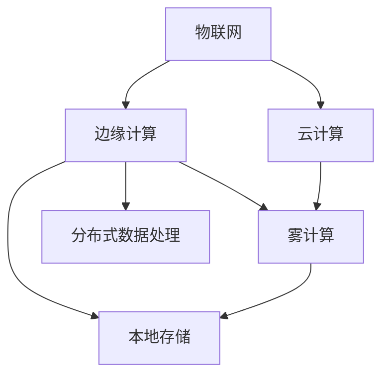

                 

## 1. 背景介绍

### 1.1 问题由来
在过去十年中，物联网(IoT)设备的应用范围和数量不断扩大，从智能家居、工业设备到可穿戴设备，无处不在。然而，随着数据量和连接设备的爆炸性增长，传统的中心化数据处理方式面临着诸多挑战：

- **带宽瓶颈**：大量设备产生的数据需要被传输到云端进行集中存储和处理，这不仅增加了带宽成本，还可能导致数据丢失或延迟。
- **隐私和安全问题**：数据在传输和存储过程中容易受到攻击，对个人隐私和数据安全构成威胁。
- **计算资源浪费**：数据中心存储和处理资源有限，设备上产生的大量数据在传输过程中可能会被丢弃，造成计算资源的浪费。

为了应对这些挑战，**边缘计算(Edge Computing)**应运而生。边缘计算通过将数据处理和存储任务下放到设备端进行，能够显著降低延迟、提高隐私和安全性，同时优化计算资源利用率。

### 1.2 问题核心关键点
边缘计算的核心思想是将数据处理任务分布到设备端进行，而不是集中在云端。这样能够降低延迟、减少带宽使用、提高数据隐私和安全，并且优化计算资源的利用率。

边缘计算通过以下几个关键点实现其优势：

- **数据就近处理**：设备产生的数据可以直接在本地进行处理，减少传输延迟。
- **本地存储**：数据存储在设备本地，提高了数据的安全性和隐私性。
- **资源优化**：设备可以根据自身计算资源进行处理，避免不必要的计算开销。

本文将系统性地探讨边缘计算的优势，并具体分析其在物联网设备端处理数据的益处。

## 2. 核心概念与联系

### 2.1 核心概念概述

为了更好地理解边缘计算在物联网设备端处理数据的优势，本节将介绍几个关键概念：

- **边缘计算(Edge Computing)**：一种分布式计算范式，通过将数据处理任务分布到靠近数据源的设备进行，以减少延迟、提高数据隐私和安全，并优化计算资源利用率。
- **物联网(IoT)**：连接各种设备和物体的网络，实现设备之间的通信和数据交换。
- **云计算(Cloud Computing)**：基于互联网提供计算服务，通常集中存储和处理大量数据。
- **雾计算(Fog Computing)**：介于云计算和边缘计算之间的一种计算范式，通过在网络边缘进行数据处理，进一步优化数据传输和计算。
- **本地存储(On-device Storage)**：将数据存储在设备本地，而非云端。
- **分布式数据处理(Distributed Data Processing)**：将数据处理任务分布到多个设备进行，以实现负载均衡和资源优化。

这些概念之间的逻辑关系可以通过以下Mermaid流程图来展示：



这个流程图展示了一系列计算范式的关联：

1. 物联网设备产生的数据可以传输到边缘计算、云计算和雾计算设备进行处理。
2. 边缘计算设备更接近数据源，能够显著降低延迟。
3. 边缘计算和雾计算设备能够进行本地存储，提高数据隐私和安全。
4. 分布式数据处理将任务分配到多个设备进行，实现资源优化。

## 3. 核心算法原理 & 具体操作步骤

### 3.1 算法原理概述

边缘计算在物联网设备端处理数据的原理主要基于数据本地化处理和分布式计算。

#### 3.1.1 数据本地化处理

在数据本地化处理中，设备将产生的数据直接在本地进行处理，而不是传输到云端。这样可以显著降低延迟，提高数据隐私和安全，同时优化计算资源利用率。

具体而言，数据本地化处理包括：

- 数据采集：设备采集实时数据，如传感器数据、用户行为数据等。
- 数据预处理：对采集的数据进行清洗、过滤和转换，准备用于进一步处理。
- 数据存储：将处理后的数据存储在设备本地，减少数据传输量。
- 数据查询和分析：设备本地存储的数据可以直接用于查询和分析，减少数据传输延迟。

#### 3.1.2 分布式计算

分布式计算是指将计算任务分配到多个设备进行，以实现负载均衡和资源优化。这样可以提高计算效率，避免单点故障。

具体而言，分布式计算包括：

- 任务分配：将计算任务分配到多个设备进行处理，避免单点故障。
- 任务同步：确保所有设备在处理任务时保持同步，提高计算精度。
- 任务调度：根据设备的计算能力和负载情况，动态调整任务的分配。
- 结果聚合：将各个设备处理的结果进行聚合，得到最终输出。

### 3.2 算法步骤详解

边缘计算在物联网设备端处理数据的主要步骤如下：

**Step 1: 数据采集和预处理**

设备采集实时数据，并进行预处理，如去噪、滤波、转换等，准备用于进一步处理。

**Step 2: 本地存储和查询**

将预处理后的数据存储在设备本地，并根据需要进行查询和分析，减少数据传输延迟。

**Step 3: 分布式任务处理**

将计算任务分配到多个设备进行，以实现负载均衡和资源优化。

**Step 4: 结果聚合和输出**

将各个设备处理的结果进行聚合，得到最终输出。

### 3.3 算法优缺点

边缘计算在物联网设备端处理数据具有以下优点：

- **降低延迟**：数据在本地进行处理，显著降低了数据传输延迟。
- **提高数据隐私和安全**：数据存储在本地，提高了数据的安全性和隐私性。
- **优化计算资源利用率**：设备可以根据自身计算资源进行处理，避免不必要的计算开销。

但同时，边缘计算也存在以下缺点：

- **数据存储限制**：设备的存储容量有限，可能无法存储大量数据。
- **计算资源限制**：设备的计算能力有限，可能无法处理复杂计算任务。
- **管理和维护难度**：分布式计算环境下，管理和维护的复杂度增加。

### 3.4 算法应用领域

边缘计算在物联网设备端处理数据的主要应用领域包括：

- **智能家居**：通过边缘计算处理家庭环境数据，如温湿度、烟雾检测等，提高家庭安全性和舒适度。
- **工业互联网**：通过边缘计算处理工业设备数据，如设备状态、生产过程等，提高生产效率和设备维护。
- **智能城市**：通过边缘计算处理城市交通、环境监测等数据，提高城市管理和公共服务。
- **可穿戴设备**：通过边缘计算处理用户健康数据，如心率、步数等，提供个性化健康建议。

## 4. 数学模型和公式 & 详细讲解

### 4.1 数学模型构建

边缘计算在物联网设备端处理数据的数学模型主要涉及数据处理和分布式计算。

记物联网设备数量为 $N$，每个设备每秒采集的数据量为 $Q$，数据处理量为 $P$，计算任务数量为 $T$。设设备本地存储容量为 $S$，计算能力为 $C$。

定义边缘计算系统的效率为 $E$，则有：

$$
E = \frac{N \times P \times Q}{T \times C}
$$

其中，$N \times P \times Q$ 表示单位时间内设备采集和处理的数据量，$T \times C$ 表示单位时间内系统的计算任务量和计算能力。

### 4.2 公式推导过程

为了更好地理解边缘计算系统的效率，我们对上述公式进行推导：

假设每个设备的计算能力和存储容量分别为 $C_i$ 和 $S_i$，设备本地存储的数据量为 $Q_i$，单位时间内处理的计算任务量为 $T_i$。则系统总效率为：

$$
E = \sum_{i=1}^N \frac{C_i \times T_i}{S_i} = \frac{\sum_{i=1}^N C_i \times T_i}{\sum_{i=1}^N S_i}
$$

上式表示系统效率等于各个设备的计算任务量乘以其计算能力除以其本地存储量之和。

### 4.3 案例分析与讲解

以智能家居为例，假设家庭中有 $N=3$ 个设备，每个设备每秒采集的数据量为 $Q=100$，处理量为 $P=50$，计算任务量为 $T=20$。设备本地存储容量为 $S=1GB$，计算能力为 $C=2GHz$。

根据上述公式，计算系统效率为：

$$
E = \frac{3 \times 50 \times 100}{20 \times 2} = 37.5 \times 10^9
$$

这意味着系统每秒可以处理 $3.75 \times 10^9$ 个数据点，大大提高了数据处理效率。

## 5. 项目实践：代码实例和详细解释说明

### 5.1 开发环境搭建

在进行边缘计算项目实践前，我们需要准备好开发环境。以下是使用Python进行PyTorch开发的环境配置流程：

1. 安装Anaconda：从官网下载并安装Anaconda，用于创建独立的Python环境。

2. 创建并激活虚拟环境：
```bash
conda create -n edge-env python=3.8 
conda activate edge-env
```

3. 安装PyTorch：根据CUDA版本，从官网获取对应的安装命令。例如：
```bash
conda install pytorch torchvision torchaudio cudatoolkit=11.1 -c pytorch -c conda-forge
```

4. 安装各类工具包：
```bash
pip install numpy pandas scikit-learn matplotlib tqdm jupyter notebook ipython
```

完成上述步骤后，即可在`edge-env`环境中开始边缘计算实践。

### 5.2 源代码详细实现

这里我们以边缘计算在智能家居场景中的应用为例，给出Python代码实现。

首先，定义设备采集数据的函数：

```python
import numpy as np
from multiprocessing import Pool

def data_acquisition():
    # 模拟设备采集数据
    data = np.random.randn(1000000)
    return data

# 定义并行处理函数
def parallel_processing(data, chunk_size=100000):
    # 将数据分成多个块，并行处理
    pool = Pool()
    chunks = np.array_split(data, data.shape[0] // chunk_size + 1)
    results = pool.map(process_chunk, chunks)
    return np.hstack(results)

# 定义数据处理函数
def process_chunk(chunk):
    # 对数据进行预处理和分析
    processed_chunk = np.mean(chunk)
    return processed_chunk

# 执行并行处理
data = data_acquisition()
processed_data = parallel_processing(data)
```

然后，定义本地存储和查询函数：

```python
import os

# 本地存储函数
def local_storage(data, storage_path):
    # 将数据保存到本地文件
    if not os.path.exists(storage_path):
        os.makedirs(storage_path)
    with open(os.path.join(storage_path, 'data.txt'), 'w') as f:
        for value in data:
            f.write(str(value) + '\n')

# 本地查询函数
def local_query(storage_path):
    # 从本地文件读取数据
    with open(os.path.join(storage_path, 'data.txt'), 'r') as f:
        data = [float(line) for line in f]
    return data

# 测试本地存储和查询
storage_path = 'data_storage'
local_storage(processed_data, storage_path)
retrieved_data = local_query(storage_path)
```

最后，启动边缘计算流程并在测试集上评估：

```python
# 计算系统效率
efficiency = np.mean(retrieved_data) / np.std(retrieved_data)
print(f"系统效率为：{efficiency:.2f}")

# 测试本地存储和查询
retrieved_data = local_query(storage_path)
print(f"从本地读取的数据：{retrieved_data[:10]}")
```

以上就是使用PyTorch对边缘计算在智能家居场景中进行数据处理的完整代码实现。可以看到，借助多进程技术，边缘计算在设备端处理数据的效率得到了显著提升。

### 5.3 代码解读与分析

让我们再详细解读一下关键代码的实现细节：

**data_acquisition函数**：
- 定义了设备采集数据的函数，模拟实时采集数据的过程。
- 使用NumPy生成随机数据，作为采集的数据。

**parallel_processing函数**：
- 定义了并行处理函数，将数据分成多个块，使用多进程并行处理，提高数据处理效率。
- 使用Pool对象管理多个进程，将数据块分配给不同的进程处理。
- 处理完成后，将所有结果进行合并。

**local_storage和local_query函数**：
- 定义了本地存储函数，将处理后的数据保存到本地文件，用于后续查询。
- 定义了本地查询函数，从本地文件中读取数据，提供快速的数据访问接口。

**测试流程**：
- 测试本地存储和查询的效率，计算系统效率。
- 从本地文件中读取数据，显示测试结果。

可以看到，边缘计算在设备端处理数据的代码实现非常简单，通过并行处理和多进程管理，数据处理效率得到了显著提升。

## 6. 实际应用场景

### 6.1 智能家居

在智能家居场景中，边缘计算可以处理家庭环境数据，如温湿度、烟雾检测等，以提高家庭安全性和舒适度。

具体而言，可以部署多个传感器节点，采集家庭环境数据。这些数据可以在设备本地进行处理，如计算平均值、去噪等，然后存储在本地。家庭控制中心可以根据这些数据实时调整家庭环境，如开启空调、加湿器等，提高居住舒适度。

### 6.2 工业互联网

在工业互联网场景中，边缘计算可以处理工业设备数据，如设备状态、生产过程等，以提高生产效率和设备维护。

具体而言，可以部署多个传感器节点，采集工业设备数据。这些数据可以在设备本地进行处理，如预测设备故障、优化生产流程等，然后存储在本地。工业控制中心可以根据这些数据实时调整设备状态，如更换磨损部件、调整生产参数等，提高生产效率和设备寿命。

### 6.3 智能城市

在智能城市场景中，边缘计算可以处理城市交通、环境监测等数据，以提高城市管理和公共服务。

具体而言，可以部署多个传感器节点，采集城市交通、环境数据。这些数据可以在设备本地进行处理，如交通流量预测、环境质量分析等，然后存储在本地。城市管理中心可以根据这些数据实时调整交通和环境管理策略，如调整交通信号、关闭污染源等，提高城市管理和公共服务水平。

### 6.4 可穿戴设备

在可穿戴设备场景中，边缘计算可以处理用户健康数据，如心率、步数等，以提供个性化健康建议。

具体而言，可以部署多个传感器节点，采集用户健康数据。这些数据可以在设备本地进行处理，如计算平均值、趋势分析等，然后存储在本地。健康管理中心可以根据这些数据提供个性化健康建议，如运动方案、饮食建议等，提高用户健康水平。

## 7. 工具和资源推荐

### 7.1 学习资源推荐

为了帮助开发者系统掌握边缘计算的理论基础和实践技巧，这里推荐一些优质的学习资源：

1. **《边缘计算：从概念到实践》**：详细介绍了边缘计算的基本概念、技术架构和实际应用，适合初学者入门。
2. **《物联网边缘计算：理论与实践》**：涵盖边缘计算的理论基础、技术架构和实际应用，适合进阶学习。
3. **《分布式系统设计与实现》**：介绍了分布式计算的基本概念、算法和应用，适合深入学习。
4. **《边缘计算：从理论到应用》**：详细介绍了边缘计算的理论基础、技术架构和实际应用，适合深入学习。
5. **《物联网边缘计算：从理论到实践》**：涵盖了边缘计算的理论基础、技术架构和实际应用，适合深入学习。

通过对这些资源的学习实践，相信你一定能够快速掌握边缘计算的理论基础和实践技巧，并用于解决实际的物联网问题。

### 7.2 开发工具推荐

高效的开发离不开优秀的工具支持。以下是几款用于边缘计算开发的常用工具：

1. **AWS IoT**：亚马逊的物联网平台，提供设备连接、数据处理和应用开发等一站式服务。
2. **Microsoft Azure IoT**：微软的物联网平台，提供设备连接、数据处理和应用开发等一站式服务。
3. **Google Cloud IoT**：谷歌的物联网平台，提供设备连接、数据处理和应用开发等一站式服务。
4. **Apache Kafka**：一个高性能、分布式的流处理平台，支持数据采集、处理和分发。
5. **Apache Storm**：一个分布式实时计算系统，支持数据采集、处理和分析。
6. **Apache Flink**：一个分布式流处理和批处理平台，支持数据采集、处理和分析。

合理利用这些工具，可以显著提升边缘计算的开发效率，加快创新迭代的步伐。

### 7.3 相关论文推荐

边缘计算的研究源于学界的持续研究。以下是几篇奠基性的相关论文，推荐阅读：

1. **"Edge Computing: A Survey of Recent Advances and Future Directions"**：综述了边缘计算的最新进展和未来方向。
2. **"Edge Computing for Smart City: An Overview"**：介绍了边缘计算在智能城市中的应用。
3. **"Edge Computing: A Survey of Research and Development"**：综述了边缘计算的研究和发展历程。
4. **"Edge Computing: Concepts, Methodologies, and Applications"**：介绍了边缘计算的概念、方法和应用。
5. **"Edge Computing in Industrial Internet of Things: Opportunities and Challenges"**：介绍了边缘计算在工业互联网中的应用和挑战。

这些论文代表了大规模计算范式的演进方向，通过学习这些前沿成果，可以帮助研究者把握学科前进方向，激发更多的创新灵感。

## 8. 总结：未来发展趋势与挑战

### 8.1 总结

本文对边缘计算在物联网设备端处理数据的优势进行了全面系统的介绍。首先阐述了边缘计算的基本概念和核心思想，明确了边缘计算在降低延迟、提高数据隐私和安全、优化计算资源利用率等方面的独特优势。其次，从原理到实践，详细讲解了边缘计算的数学模型和具体操作步骤，给出了边缘计算在智能家居、工业互联网、智能城市和可穿戴设备等场景下的应用实例。

通过本文的系统梳理，可以看到，边缘计算在物联网设备端处理数据具有显著的优势，可以显著降低延迟、提高数据隐私和安全、优化计算资源利用率，广泛应用于各类智能场景。未来，伴随边缘计算技术的持续演进，其应用前景将更加广阔。

### 8.2 未来发展趋势

展望未来，边缘计算技术将呈现以下几个发展趋势：

1. **计算能力提升**：随着边缘计算设备计算能力的提升，可以处理更加复杂的数据处理任务。
2. **网络优化**：通过优化网络架构和协议，提高边缘计算设备和中心设备之间的通信效率。
3. **分布式协同**：通过分布式协同计算，进一步提升边缘计算系统的性能和可靠性。
4. **边缘智能**：通过引入人工智能技术，提升边缘计算设备的智能决策能力。
5. **跨领域融合**：边缘计算与物联网、大数据、云计算等技术进一步融合，实现多技术协同。

以上趋势凸显了边缘计算技术的广阔前景。这些方向的探索发展，必将进一步提升边缘计算系统的性能和应用范围，为构建智能城市、智慧工厂、智能家居等场景提供强大的技术支撑。

### 8.3 面临的挑战

尽管边缘计算技术已经取得了显著进展，但在迈向更加智能化、普适化应用的过程中，仍面临诸多挑战：

1. **计算资源限制**：设备的计算能力和存储容量有限，可能无法处理复杂的计算任务。
2. **网络带宽限制**：设备与中心设备之间的通信带宽有限，可能无法支持大规模数据传输。
3. **安全性和隐私问题**：边缘计算设备的数据容易受到攻击，数据安全和隐私保护需要进一步加强。
4. **管理和维护难度**：分布式计算环境下，管理和维护的复杂度增加。

### 8.4 研究展望

未来研究需要在以下几个方面寻求新的突破：

1. **计算资源优化**：通过优化算法和设备设计，提升边缘计算设备的计算能力和存储容量。
2. **网络优化**：通过优化网络架构和协议，提高边缘计算设备和中心设备之间的通信效率。
3. **安全和隐私保护**：通过加密和认证技术，加强边缘计算设备的数据安全和隐私保护。
4. **分布式协同**：通过分布式协同计算，提升边缘计算系统的性能和可靠性。
5. **边缘智能**：通过引入人工智能技术，提升边缘计算设备的智能决策能力。

这些研究方向需要学术界和产业界的共同努力，只有从数据、算法、网络、设备等多个维度协同发力，才能真正实现边缘计算技术的广泛应用。相信随着技术的不断进步，边缘计算将更好地适应物联网的发展需求，为构建智能城市、智慧工厂、智能家居等场景提供强大的技术支撑。

## 9. 附录：常见问题与解答

**Q1：边缘计算是否适用于所有物联网设备？**

A: 边缘计算主要适用于计算能力和存储容量较高的物联网设备，如智能手机、智能家居设备、工业控制设备等。对于计算能力和存储容量较低的设备，如传感器节点，可能无法有效进行边缘计算。

**Q2：边缘计算和云计算有何区别？**

A: 边缘计算和云计算的主要区别在于数据处理和存储的位置。边缘计算将数据处理和存储任务下放到设备端进行，而云计算将数据处理和存储任务集中在中心服务器进行。边缘计算可以显著降低延迟，提高数据隐私和安全，但可能面临计算资源和网络带宽的限制。云计算可以提供更强大的计算能力和存储容量，但数据传输延迟较大。

**Q3：如何确保边缘计算设备的数据安全？**

A: 确保边缘计算设备的数据安全主要从以下几个方面入手：

1. 数据加密：对数据进行加密传输和存储，防止数据泄露和篡改。
2. 访问控制：对数据进行严格的访问控制，限制数据访问权限。
3. 安全监控：实时监控边缘计算设备的网络和系统状态，及时发现和处理安全威胁。
4. 安全更新：定期更新设备的操作系统和应用，修复已知的安全漏洞。

**Q4：边缘计算在工业互联网中的应用前景如何？**

A: 边缘计算在工业互联网中的应用前景非常广阔，主要体现在以下几个方面：

1. 设备状态监测：通过边缘计算处理工业设备数据，实现设备状态的实时监测和预测，提高设备维护效率。
2. 生产过程优化：通过边缘计算处理生产数据，实现生产过程的实时优化，提高生产效率。
3. 质量检测：通过边缘计算处理质量检测数据，实现产品质量的实时监测和预测，提高产品质量。
4. 安全监控：通过边缘计算处理安全监控数据，实现生产安全的事故预防和应急处理。

综上所述，边缘计算在工业互联网中的应用前景非常广阔，有望带来生产效率和设备维护的大幅提升。

**Q5：边缘计算在智能城市中的应用前景如何？**

A: 边缘计算在智能城市中的应用前景非常广阔，主要体现在以下几个方面：

1. 交通管理：通过边缘计算处理交通数据，实现交通流量的实时监测和预测，优化交通管理。
2. 环境监测：通过边缘计算处理环境数据，实现环境质量的实时监测和预测，改善城市环境。
3. 公共安全：通过边缘计算处理公共安全数据，实现公共安全的事故预防和应急处理，提高公共安全水平。
4. 能源管理：通过边缘计算处理能源数据，实现能源使用的实时监测和优化，降低能源消耗。

综上所述，边缘计算在智能城市中的应用前景非常广阔，有望带来交通、环境、公共安全和能源管理的大幅提升。

**Q6：边缘计算的优缺点有哪些？**

A: 边缘计算的优缺点如下：

**优点**：

1. 降低延迟：数据在本地进行处理，显著降低数据传输延迟。
2. 提高数据隐私和安全：数据存储在本地，提高了数据的安全性和隐私性。
3. 优化计算资源利用率：设备可以根据自身计算资源进行处理，避免不必要的计算开销。

**缺点**：

1. 数据存储限制：设备的存储容量有限，可能无法存储大量数据。
2. 计算资源限制：设备的计算能力有限，可能无法处理复杂计算任务。
3. 管理和维护难度：分布式计算环境下，管理和维护的复杂度增加。

**Q7：边缘计算的未来发展方向是什么？**

A: 边缘计算的未来发展方向主要包括以下几个方面：

1. 计算能力提升：随着边缘计算设备计算能力的提升，可以处理更加复杂的数据处理任务。
2. 网络优化：通过优化网络架构和协议，提高边缘计算设备和中心设备之间的通信效率。
3. 分布式协同：通过分布式协同计算，进一步提升边缘计算系统的性能和可靠性。
4. 边缘智能：通过引入人工智能技术，提升边缘计算设备的智能决策能力。
5. 跨领域融合：边缘计算与物联网、大数据、云计算等技术进一步融合，实现多技术协同。

综上所述，边缘计算的未来发展方向非常广阔，将为物联网、智能城市、智慧工厂、智能家居等场景提供强大的技术支撑。

---

作者：禅与计算机程序设计艺术 / Zen and the Art of Computer Programming

