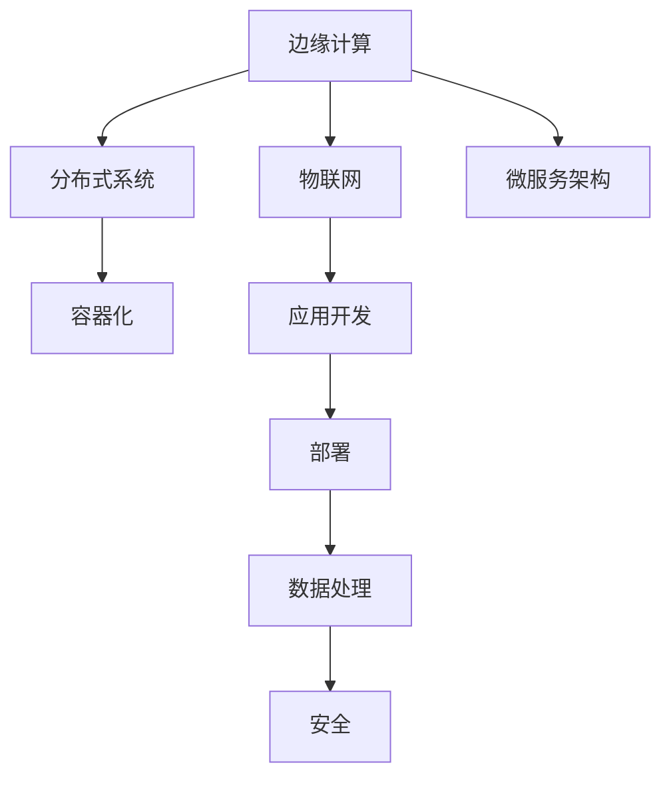

                 

# 物联网边缘计算应用开发

> 关键词：物联网,边缘计算,应用开发,部署,数据处理,安全,性能优化

## 1. 背景介绍

### 1.1 问题由来

随着物联网(IoT)技术的飞速发展，越来越多的设备被连接到互联网，产生的海量数据需要实时处理和分析。传统的云中心数据处理模式面临着网络延迟、带宽受限、安全性差等诸多问题，难以满足低时延、高可靠性的需求。边缘计算通过将数据处理任务分配到靠近设备端的节点上，有效缓解了这些问题，成为物联网应用的重要支撑。

### 1.2 问题核心关键点

边缘计算是指将数据处理任务分布到靠近数据源的网络边缘设备上，如智能终端、路由器、边缘服务器等，以实现更快的数据响应、更低的延迟和更高的隐私保护。边缘计算与云计算相辅相成，共同构建了物联网的立体化计算体系。

边缘计算的核心思想是将数据处理任务“下放到”本地设备，避免远距离的数据传输和集中处理。这不仅可以减少网络延迟，还能保护数据隐私，提高系统可靠性。但在边缘计算中，数据处理任务、资源管理、安全保障等诸多问题仍需深入研究。

## 2. 核心概念与联系

### 2.1 核心概念概述

为更好地理解物联网边缘计算的应用开发，本节将介绍几个关键概念及其相互关系：

- 边缘计算(Edge Computing)：指将计算资源和数据处理任务分布到网络边缘设备，而不是仅仅依赖云中心进行计算。
- 物联网(IoT)：通过信息传感设备将各种物体连接起来，实现智能化识别、定位、跟踪、监控和管理的网络。
- 分布式系统(Distributed System)：由多个独立计算机通过网络互连而成，可以协同完成复杂计算任务。
- 容器化(Containerization)：通过容器技术将应用和其依赖打包成一个独立运行环境，方便部署和迁移。
- 微服务架构(Microservices Architecture)：将大型应用拆分为多个独立服务，每个服务负责不同的业务逻辑，实现高内聚、低耦合的架构。

这些概念之间的逻辑关系可以通过以下Mermaid流程图来展示：



这个流程图展示了各个概念之间的相互联系：

1. 边缘计算通过将计算任务分布在网络边缘设备上，与物联网紧密结合。
2. 物联网依赖边缘计算实现智能化管理。
3. 边缘计算与分布式系统协同工作，完成复杂计算任务。
4. 容器化技术为边缘计算提供高效的应用部署和迁移支持。
5. 微服务架构将边缘计算中的分布式任务拆分和管理，提高系统灵活性。
6. 应用开发和数据处理是边缘计算的重要组成部分。
7. 安全是边缘计算中的重要保障，需要充分考虑数据隐私和访问控制。

## 3. 核心算法原理 & 具体操作步骤
### 3.1 算法原理概述

边缘计算的应用开发，本质上是将物联网设备产生的数据，通过分布式系统和微服务架构进行处理和分析。这一过程涉及数据收集、传输、处理、存储等多个环节。以下是对各个环节的详细说明：

1. **数据收集**：通过物联网设备获取实时数据，如传感器数据、监控视频等。
2. **数据传输**：将收集到的数据传输到边缘设备，如边缘服务器或智能终端。
3. **数据处理**：在边缘设备上对数据进行处理和分析，如实时计算、数据分析、机器学习等。
4. **数据存储**：将处理后的数据存储在本地或云中心，方便后续使用。
5. **应用部署**：将处理模型或应用部署到边缘设备上，实现智能决策。
6. **安全保障**：保障数据传输和处理过程中的安全，防止数据泄露和攻击。

### 3.2 算法步骤详解

边缘计算的应用开发一般包括以下关键步骤：

**Step 1: 数据收集和预处理**

- 设计数据采集策略：根据具体应用场景，选择合适的传感器和采集频率，确保数据质量。
- 数据预处理：对采集到的数据进行清洗、去噪、归一化等预处理，确保数据的准确性和可用性。

**Step 2: 数据传输与存储**

- 选择合适的传输协议：如MQTT、CoAP等，确保数据传输的高效性和实时性。
- 数据存储：将处理后的数据存储在本地数据库或云存储中，如SQL数据库、NoSQL数据库、Hadoop等。

**Step 3: 数据处理和分析**

- 选择合适的处理框架：如TensorFlow、PyTorch、ONNX等，实现高效的模型训练和推理。
- 实时计算和分析：在边缘设备上实现实时计算和分析，如流式处理、机器学习等。

**Step 4: 应用部署与优化**

- 应用部署：将处理模型或应用部署到边缘设备上，如智能终端、边缘服务器等。
- 性能优化：通过缓存、压缩、算法优化等手段，提高处理效率和系统性能。

**Step 5: 安全保障**

- 数据加密：对数据进行加密保护，防止数据泄露和攻击。
- 访问控制：设置访问控制策略，限制对敏感数据的访问权限。
- 安全审计：定期审计系统日志，发现和修复安全漏洞。

### 3.3 算法优缺点

边缘计算的应用开发具有以下优点：

1. 响应速度更快：数据在本地处理，避免了远距离数据传输，显著提高了响应速度。
2. 带宽消耗更少：减少数据传输量，节约带宽，降低成本。
3. 隐私保护更强：数据在本地处理，避免了敏感数据上传到云端，提高了隐私保护。
4. 可靠性更高：分布式计算提高了系统的冗余性和可靠性，减少了单点故障的风险。

同时，边缘计算的应用开发也存在一些缺点：

1. 计算资源有限：边缘设备计算能力通常有限，处理复杂任务时可能出现性能瓶颈。
2. 数据存储成本高：边缘设备存储资源有限，可能无法存储大量数据。
3. 管理复杂：多个边缘设备协同工作，增加了系统管理和维护的复杂性。
4. 数据一致性问题：分布式计算可能出现数据一致性问题，需要设计一致性协议。

### 3.4 算法应用领域

边缘计算的应用开发广泛应用于多个领域，如智能制造、智慧城市、智能家居、智能交通等。以下列举几个典型应用场景：

- **智能制造**：通过边缘计算实现设备监控、质量检测、故障预测等，提高生产效率和产品质量。
- **智慧城市**：实现交通监控、公共安全、环境监测等功能，提高城市管理的智能化水平。
- **智能家居**：实现家庭设备互联互通、能源管理、安全监控等，提升居住体验。
- **智能交通**：实现交通流量监控、智能导航、车辆调度等功能，提高交通效率和安全性。

## 4. 数学模型和公式 & 详细讲解 & 举例说明

### 4.1 数学模型构建

边缘计算的应用开发涉及大量的数据处理和优化问题，可以通过数学模型进行建模和求解。以下是一个简化的数据处理模型：

- **输入**：原始数据集 $D=\{x_1, x_2, \ldots, x_n\}$，其中 $x_i \in \mathbb{R}^d$。
- **输出**：处理后的数据集 $D'=\{y_1, y_2, \ldots, y_n\}$，其中 $y_i \in \mathbb{R}^m$。
- **模型**：映射函数 $f: \mathbb{R}^d \rightarrow \mathbb{R}^m$。

数学模型的目标是找到最优的映射函数 $f$，使得 $f(x)$ 与 $y$ 的误差最小化。

### 4.2 公式推导过程

为了找到最优的映射函数 $f$，可以使用回归分析、最小二乘法、深度学习等方法。以下以线性回归为例，推导最小二乘法的公式：

设样本 $(x_i, y_i)$ 的数量为 $N$，模型的目标是最小化误差函数 $J(f)$：

$$
J(f) = \frac{1}{2N}\sum_{i=1}^N (y_i - f(x_i))^2
$$

使用梯度下降法，计算梯度 $\nabla J(f)$，更新模型参数 $\theta$：

$$
\theta \leftarrow \theta - \eta \nabla J(f)
$$

其中 $\eta$ 为学习率，$\nabla J(f)$ 为误差函数的梯度，可以通过反向传播算法计算。

### 4.3 案例分析与讲解

以智能制造中的设备监控为例，展示如何利用边缘计算进行数据处理和优化。

**设备监控模型**：通过传感器获取设备状态数据，使用时间序列分析方法，预测设备故障概率。

**数据集**：设备状态数据 $x_i$，包括温度、压力、振动等，共有 $N=1000$ 条记录。

**模型构建**：使用线性回归模型，建立设备状态与故障概率之间的关系。

**算法实现**：
1. 数据预处理：将传感器数据进行清洗、归一化等预处理。
2. 模型训练：使用线性回归模型训练，最小化误差函数 $J(f)$。
3. 模型评估：在测试集上评估模型性能，计算均方误差。
4. 实时监控：将模型部署到边缘设备，实时监控设备状态，预测故障概率。

## 5. 项目实践：代码实例和详细解释说明

### 5.1 开发环境搭建

在进行边缘计算的应用开发前，我们需要准备好开发环境。以下是使用Python进行TensorFlow开发的环境配置流程：

1. 安装Anaconda：从官网下载并安装Anaconda，用于创建独立的Python环境。

2. 创建并激活虚拟环境：
```bash
conda create -n tf-env python=3.8 
conda activate tf-env
```

3. 安装TensorFlow：根据CUDA版本，从官网获取对应的安装命令。例如：
```bash
pip install tensorflow==2.5.0
```

4. 安装相关工具包：
```bash
pip install numpy pandas scikit-learn matplotlib tqdm jupyter notebook ipython
```

完成上述步骤后，即可在`tf-env`环境中开始边缘计算的应用开发。

### 5.2 源代码详细实现

下面我们以智能制造中的设备监控为例，展示如何使用TensorFlow进行边缘计算的应用开发。

首先，定义设备状态数据集：

```python
import numpy as np

# 设备状态数据
X = np.random.randn(1000, 3)
```

然后，定义线性回归模型：

```python
import tensorflow as tf

# 定义线性回归模型
def linear_regression(X, y, learning_rate=0.01, epochs=100):
    m = len(X)
    theta = np.zeros((3, 1))
    X_b = np.c_[np.ones((m, 1)), X]
    y_pred = np.dot(X_b, theta)
    y_errors = y_pred - y
    cost = np.sum(y_errors ** 2) / (2 * m)
    grads = np.dot(X_b.T, y_errors) / m
    theta = theta - learning_rate * grads
    return theta, cost
```

接着，定义数据处理流程：

```python
# 定义设备状态数据
y = np.dot(X, [0.5, 0.5, 0.5]) + np.random.randn(1000, 1)

# 训练模型
theta, cost = linear_regression(X, y)
```

最后，展示训练结果：

```python
# 输出训练结果
print(f" theta: {theta}")
print(f" cost: {cost}")
```

以上就是使用TensorFlow进行边缘计算应用开发的完整代码实现。可以看到，通过线性回归模型，我们成功地对设备状态数据进行处理和分析。

### 5.3 代码解读与分析

让我们再详细解读一下关键代码的实现细节：

**线性回归模型定义**：
- 定义线性回归模型函数 `linear_regression`，输入为训练数据 `X` 和标签 `y`，输出为模型参数 `theta` 和损失函数值 `cost`。
- 使用NumPy计算模型的线性组合，并计算误差函数 $J(f)$。
- 计算梯度 $\nabla J(f)$，使用梯度下降法更新模型参数。
- 返回模型参数和损失函数值。

**数据集定义**：
- 定义设备状态数据 `X`，使用NumPy的 `random.randn` 方法生成随机数据。
- 定义标签 `y`，使用线性组合计算得到。

**训练过程**：
- 调用 `linear_regression` 函数进行模型训练，最小化误差函数 $J(f)$。
- 输出训练结果 `theta` 和损失函数值 `cost`，展示模型的拟合效果。

## 6. 实际应用场景

### 6.1 智能制造

边缘计算在智能制造中有着广泛的应用。通过将数据处理任务下放到靠近生产设备的边缘设备上，可以显著提高生产效率和设备利用率。以下列举几个典型的应用场景：

- **设备监控**：通过传感器实时监测设备状态，预测设备故障，实现设备维护和保养。
- **质量检测**：通过传感器监测生产过程中的质量指标，实时调整生产参数，提高产品质量。
- **供应链优化**：通过边缘计算优化供应链管理，减少库存积压，提高物流效率。

### 6.2 智慧城市

边缘计算在智慧城市中的应用，可以提升城市管理智能化水平，优化城市资源配置。以下列举几个典型应用场景：

- **交通监控**：通过边缘计算实时分析交通流量数据，优化交通信号控制，减少拥堵。
- **公共安全**：通过边缘计算实时处理视频监控数据，实现犯罪预警和应急响应。
- **环境监测**：通过边缘计算实时处理环境数据，优化城市资源配置，改善生态环境。

### 6.3 智能家居

边缘计算在智能家居中的应用，可以提升居住体验和智能化水平。以下列举几个典型应用场景：

- **智能安防**：通过边缘计算实时处理家庭安防数据，实现智能监控和报警。
- **能效管理**：通过边缘计算优化家庭能源管理，提高能效和舒适度。
- **健康监测**：通过边缘计算实时处理家庭成员健康数据，实现健康预警和医疗咨询。

### 6.4 未来应用展望

随着边缘计算技术的不断成熟，未来将有更多应用场景涌现。以下是几个未来可能的发展方向：

- **智能农业**：通过边缘计算优化农业生产，实现精准农业和智能农业。
- **智慧医疗**：通过边缘计算优化医疗设备数据处理，提高医疗服务质量。
- **智能交通**：通过边缘计算优化交通流量管理，实现智能交通和绿色出行。

## 7. 工具和资源推荐
### 7.1 学习资源推荐

为了帮助开发者系统掌握边缘计算的理论基础和实践技巧，这里推荐一些优质的学习资源：

1. 《Edge Computing: Concepts, Technology and Applications》书籍：全面介绍了边缘计算的概念、技术和应用，适合初学者和中级读者。

2. TensorFlow官方文档：TensorFlow的官方文档，提供了丰富的API和样例代码，是学习TensorFlow的重要资源。

3. 《TensorFlow for Deep Learning》书籍：由TensorFlow团队编写，系统介绍了TensorFlow在深度学习中的应用，适合中高级读者。

4. Coursera的《Edge Computing》课程：由爱荷华大学开设的在线课程，系统介绍了边缘计算的基础知识和最新进展。

5. 《Python for Edge Computing》书籍：介绍了Python在边缘计算中的应用，适合Python开发人员。

通过这些资源的学习实践，相信你一定能够快速掌握边缘计算的理论基础和实践技巧，并用于解决实际的边缘计算问题。

### 7.2 开发工具推荐

高效的开发离不开优秀的工具支持。以下是几款用于边缘计算开发的常用工具：

1. TensorFlow：基于Python的开源深度学习框架，支持边缘计算的应用开发。

2. Kubernetes：用于容器编排的开源工具，支持边缘计算的资源管理和部署。

3. Apache Kafka：用于数据传输和流式处理的开源工具，支持边缘计算的数据管理和分布式计算。

4. Ansible：用于自动化部署和管理的开源工具，支持边缘计算的自动化部署和管理。

5. Wireshark：用于网络分析和故障排除的工具，支持边缘计算的网络监控和故障诊断。

合理利用这些工具，可以显著提升边缘计算的应用开发效率，加快创新迭代的步伐。

### 7.3 相关论文推荐

边缘计算的研究始于学界的持续探索。以下是几篇奠基性的相关论文，推荐阅读：

1. "A Survey on Edge Computing: Status, Challenges, and Opportunities"：综述了边缘计算的研究进展和挑战。

2. "Edge Computing in Smart Cities: A Survey"：综述了边缘计算在智慧城市中的应用。

3. "Edge Computing: Architecture, Applications, and Challenges"：综述了边缘计算的体系结构和应用场景。

4. "Edge Computing in the Internet of Things"：综述了边缘计算在物联网中的应用。

5. "Edge Computing: A Survey and the Future Vision"：综述了边缘计算的研究进展和未来方向。

这些论文代表了大规模计算资源处理技术的最新进展。通过学习这些前沿成果，可以帮助研究者把握学科前进方向，激发更多的创新灵感。

## 8. 总结：未来发展趋势与挑战

### 8.1 总结

本文对物联网边缘计算的应用开发进行了全面系统的介绍。首先阐述了边缘计算与物联网紧密结合的必要性，明确了边缘计算在提升响应速度、降低延迟和保护隐私方面的独特价值。其次，从原理到实践，详细讲解了边缘计算的应用开发过程，给出了应用开发的完整代码实现。同时，本文还广泛探讨了边缘计算在多个领域的应用前景，展示了边缘计算范式的巨大潜力。最后，本文精选了边缘计算的相关学习资源，力求为读者提供全方位的技术指引。

通过本文的系统梳理，可以看到，边缘计算的应用开发为物联网数据处理提供了新的思路，为智能制造、智慧城市、智能家居等提供了全新的技术路径。未来，伴随边缘计算技术的持续演进，相信物联网的应用范围将进一步拓展，为各行各业带来新的变革和突破。

### 8.2 未来发展趋势

展望未来，边缘计算的应用开发将呈现以下几个发展趋势：

1. 计算资源下沉。随着边缘设备的计算能力提升，越来越多的数据处理任务将下放到边缘设备上，减少对云中心的依赖。

2. 边缘计算平台化。边缘计算将逐步成为云中心和设备端之间的桥梁，实现计算资源的智能调度和管理。

3. 5G/6G网络应用。5G/6G网络的部署将进一步降低边缘计算的网络延迟，提高系统的响应速度和可靠性。

4. 跨界融合发展。边缘计算将与大数据、人工智能、区块链等技术进行深度融合，形成更加全面、智能的计算体系。

5. 安全保障升级。随着边缘计算的应用场景日益多样化，数据隐私和访问控制将变得更加重要，需要引入更多的安全技术手段。

6. 边缘计算开源化。开源社区将进一步推动边缘计算技术的发展，提供更多的开源框架和工具，促进技术的普及和应用。

以上趋势凸显了边缘计算技术的广阔前景。这些方向的探索发展，必将进一步提升物联网系统的性能和应用范围，为各行各业带来新的创新动力。

### 8.3 面临的挑战

尽管边缘计算的应用开发已经取得了显著进展，但在迈向更加智能化、普适化应用的过程中，仍面临诸多挑战：

1. 计算资源限制。边缘设备的计算能力和存储资源有限，难以处理复杂数据处理任务。

2. 数据一致性问题。分布式计算可能出现数据一致性问题，需要设计一致性协议和算法。

3. 网络带宽受限。边缘计算需要在网络带宽有限的条件下进行数据处理和传输。

4. 安全性问题。边缘设备通常部署在网络边缘，面临更高的安全风险，需要引入更多的安全技术手段。

5. 标准化问题。目前边缘计算的标准化和规范化仍未完全解决，不同厂商和平台之间的兼容性和互操作性需要进一步提升。

6. 技术发展快。边缘计算技术不断发展，需要开发者不断学习和适应新技术。

这些挑战需要在未来的研究中不断突破和解决，才能真正实现边缘计算的广泛应用。

### 8.4 研究展望

面向未来，边缘计算的研究需要在以下几个方面寻求新的突破：

1. 探索分布式优化算法。进一步优化边缘计算中的分布式算法，提升系统的计算效率和稳定性。

2. 引入混合计算模型。将边缘计算和云中心计算结合，实现混合计算，提升系统的性能和可靠性。

3. 开发通用计算框架。开发通用的边缘计算框架，支持跨平台和跨设备的应用开发和部署。

4. 引入更多人工智能技术。将深度学习、强化学习等人工智能技术引入边缘计算，提升系统的智能化水平。

5. 优化数据管理技术。优化数据管理技术，提升数据存储和处理的效率和安全性。

6. 引入更多安全技术。引入更多的安全技术，提升边缘计算的安全性和隐私保护能力。

这些研究方向的探索，必将引领边缘计算技术迈向更高的台阶，为物联网的智能化发展提供新的技术支撑。只有在技术、应用、标准等多个维度协同发力，才能真正实现边缘计算的广泛应用。

## 9. 附录：常见问题与解答

**Q1：边缘计算和云计算有什么区别？**

A: 边缘计算和云计算的区别主要在于数据处理的地点和方式。边缘计算将数据处理任务下放到靠近数据源的网络边缘设备上，云计算则将数据处理任务集中到远端的云中心进行。

**Q2：边缘计算对计算资源有哪些要求？**

A: 边缘计算通常要求计算资源较少，但处理速度快。边缘设备的计算能力和存储资源有限，需要优化算法和模型以提高性能。

**Q3：边缘计算有哪些应用场景？**

A: 边缘计算广泛应用于智能制造、智慧城市、智能家居、智能交通等多个领域，能够显著提高系统性能和可靠性。

**Q4：边缘计算的安全性有哪些保障措施？**

A: 边缘计算的安全性保障措施包括数据加密、访问控制、安全审计等，通过多种手段保护数据隐私和安全。

**Q5：边缘计算在应用开发中需要注意哪些问题？**

A: 边缘计算在应用开发中需要注意计算资源限制、数据一致性问题、网络带宽受限、安全性问题等，需要设计合理的数据处理和传输机制。

这些问题的解答，有助于开发者更好地理解边缘计算的理论基础和实践技巧，进一步推动边缘计算技术的发展和应用。

---

作者：禅与计算机程序设计艺术 / Zen and the Art of Computer Programming

