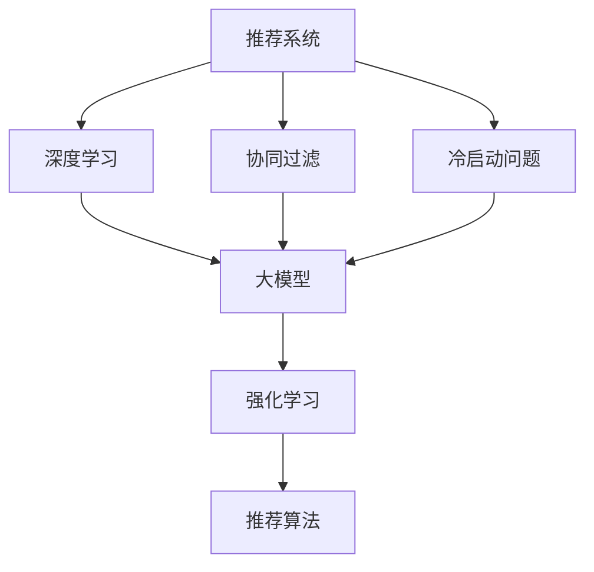

                 

# 现状：推荐系统架构与大模型的能力

> 关键词：推荐系统,大模型,机器学习,深度学习,冷启动,多臂老虎机,强化学习,推荐算法

## 1. 背景介绍

推荐系统（Recommender System）已经成为各大互联网公司的重要核心竞争力之一，旨在通过个性化推荐满足用户需求，提高用户满意度。随着近年来深度学习和大模型的迅猛发展，推荐系统也逐步从传统的协同过滤、内容推荐等方法，转向基于深度学习的推荐方法。

大模型通过大规模的预训练数据，获得了强大的泛化能力和丰富的语义知识，已经成为推荐系统中重要的组成部分。尤其是通过在大规模无标签文本语料上进行预训练的通用语言模型，如BERT、GPT-3等，在推荐系统中展现了巨大的潜力。在广告推荐、商品推荐、视频推荐等多个领域，大模型被用来构建推荐算法，提升模型的精准度和覆盖度。

但与此同时，推荐系统的快速迭代也带来了新的挑战。如何在保证推荐质量的同时，提升推荐系统的实时性和可解释性，是当前亟待解决的问题。本文旨在探讨当前推荐系统架构与大模型能力的关系，并展望未来的发展趋势。

## 2. 核心概念与联系

### 2.1 核心概念概述

为更好地理解推荐系统与大模型的关系，本节将介绍几个密切相关的核心概念：

- 推荐系统（Recommender System）：根据用户历史行为和物品特征，推荐用户可能感兴趣的物品的系统。推荐系统广泛应用于电子商务、在线媒体、社交网络等领域，是互联网公司竞争力的重要体现。

- 深度学习（Deep Learning）：一种基于神经网络的机器学习方法，通过多层非线性变换从数据中提取高级特征，用于分类、回归、聚类等任务。深度学习在大模型上表现尤为突出。

- 大模型（Large Model）：如BERT、GPT-3等通过大规模预训练获得的强大语言模型，在大规模文本数据上预训练，学习丰富的语言知识和常识。

- 协同过滤（Collaborative Filtering）：一种基于用户和物品历史交互数据的推荐方法，包括基于用户的协同过滤和基于物品的协同过滤。

- 冷启动问题（Cold Start Problem）：推荐系统在新用户或新物品刚加入时，如何为用户或物品推荐有价值的物品。

- 多臂老虎机（Multi-Armed Bandit）：一种在线决策问题，描述用户在多个推荐候选中进行选择的过程。强化学习可以用于多臂老虎机问题。

这些核心概念之间的逻辑关系可以通过以下Mermaid流程图来展示：



这个流程图展示了大模型在推荐系统中的核心作用，并介绍了推荐系统架构的基本组成。协同过滤、冷启动问题、强化学习等核心概念都与大模型的使用紧密相关，共同构建了推荐系统的整体架构。

## 3. 核心算法原理 & 具体操作步骤
### 3.1 算法原理概述

深度学习在大模型上的应用，主要通过以下方式提升推荐系统的效果：

1. **特征提取能力**：深度模型可以自动从用户和物品特征中提取高级抽象特征，用于推荐建模。大模型尤其擅长捕捉长距离依赖和语义关系，能更好地理解复杂多变的用户行为和物品属性。

2. **冷启动问题解决**：深度模型能够通过输入文本信息，对新用户或新物品进行个性化的预训练，从而解决冷启动问题。通过输入物品的描述信息、用户的历史浏览记录，可以预训练出与特定用户或物品相关的特征，提升推荐效果。

3. **多臂老虎机问题解决**：强化学习可以用于多臂老虎机问题，通过用户点击行为反馈，动态调整推荐策略，优化推荐效果。强化学习能够学习到不同物品对不同用户的奖励分布，实时调整推荐策略。

4. **推荐算法优化**：深度模型可以被用于优化推荐算法，如在基于内容的推荐算法中，使用预训练语言模型进行特征提取，提升推荐效果。在协同过滤算法中，使用深度模型学习用户和物品的语义表示，提高推荐精准度。

5. **鲁棒性和泛化性**：深度学习模型的鲁棒性和泛化能力更强，可以适应多样化的用户行为和物品特征，从而提升推荐系统的泛化性。

### 3.2 算法步骤详解

深度学习在推荐系统中的应用主要包括以下几个步骤：

**Step 1: 数据准备**
- 收集用户的历史行为数据，包括浏览记录、购买记录、评分等。
- 收集物品的属性信息，如商品名称、描述、标签等。
- 进行数据预处理，包括缺失值填充、特征工程等。

**Step 2: 大模型预训练**
- 选择合适的预训练模型，如BERT、GPT-3等，作为深度学习的特征提取器。
- 在无标签文本语料上进行预训练，学习语言知识和常识。
- 使用特定领域的数据进行微调，如新闻推荐中，可以微调在新闻语料上预训练的BERT模型。

**Step 3: 特征提取**
- 使用预训练模型对用户和物品进行特征提取，生成高维的语义表示。
- 可以将用户和物品的语义表示作为输入，构建推荐模型。

**Step 4: 推荐算法实现**
- 基于用户和物品的语义表示，构建推荐算法，如基于内容的推荐、协同过滤推荐、基于排序的推荐等。
- 根据不同推荐算法的要求，设计不同的输出层和损失函数。

**Step 5: 优化与部署**
- 使用梯度下降等优化算法，训练推荐模型，最小化损失函数。
- 在测试集上评估模型性能，调整模型参数。
- 将模型部署到实际应用系统中，进行实时推荐。

### 3.3 算法优缺点

深度学习在推荐系统中的应用，具有以下优点：
1. **特征提取能力强**：深度模型能够自动学习特征，减少了手工特征工程的工作量。
2. **泛化能力强**：深度模型能够适应多样化的用户行为和物品特征，提升了推荐系统的泛化性。
3. **可解释性强**：深度模型可以通过可视化工具展示特征权重，帮助理解推荐过程。
4. **实时性高**：深度模型可以快速进行特征提取和推荐计算，提升推荐系统的实时性。

但深度学习在推荐系统中也存在一些缺点：
1. **计算成本高**：深度模型的计算复杂度高，需要较强的硬件资源。
2. **过拟合风险高**：深度模型容易过拟合，尤其是训练数据较少的情况下。
3. **模型复杂度高**：深度模型参数较多，模型解释难度大，难以理解复杂决策逻辑。
4. **训练时间长**：深度模型训练时间长，需要大量时间和计算资源。

### 3.4 算法应用领域

深度学习在推荐系统中的应用广泛，主要包括以下几个领域：

- 广告推荐：在推荐系统中，深度模型被广泛用于广告推荐，如展示广告、点击率预测等。
- 商品推荐：电商网站使用深度模型进行商品推荐，提升用户购买转化率。
- 视频推荐：视频平台使用深度模型进行个性化视频推荐，提升用户观看时长和满意度。
- 新闻推荐：新闻应用使用深度模型进行个性化新闻推荐，提高用户阅读量和粘性。
- 音乐推荐：音乐平台使用深度模型进行个性化音乐推荐，提升用户聆听体验。
- 金融推荐：金融领域使用深度模型进行个性化金融产品推荐，提升用户体验和销售转化。

除了上述这些主流领域外，深度学习在更多场景中也有应用，如游戏推荐、教育推荐、社交网络推荐等，展现了强大的生命力和应用潜力。

## 4. 数学模型和公式 & 详细讲解 & 举例说明

### 4.1 数学模型构建

推荐系统中的深度学习模型，主要通过以下数学模型进行建模：

1. **用户-物品矩阵**：用户和物品之间的关联可以用一个二维矩阵表示，其中 $U \in \mathbb{R}^{N \times M}$，$N$ 为用户数，$M$ 为物品数。$U_{ui}$ 表示用户 $u$ 对物品 $i$ 的评分或兴趣度。

2. **预训练模型**：使用BERT、GPT-3等大模型对用户和物品进行特征提取，生成高维语义表示。假设用户 $u$ 的特征表示为 $x_u \in \mathbb{R}^d$，物品 $i$ 的特征表示为 $x_i \in \mathbb{R}^d$，其中 $d$ 为模型维度。

3. **推荐模型**：将用户和物品的语义表示作为输入，构建推荐模型。假设用户 $u$ 对物品 $i$ 的预测评分或兴趣度为 $y_{ui}$，推荐模型的输出为：

   $$
   y_{ui} = \text{sigmoid}(X_u W + b)
   $$

   其中 $X_u = \{x_{ui}\}_{i=1}^M$，$W$ 为模型权重，$b$ 为偏置项。

4. **损失函数**：推荐模型的损失函数通常为均方误差损失：

   $$
   \mathcal{L}(y_{ui}, \hat{y}_{ui}) = \frac{1}{2N}\sum_{i=1}^M \sum_{u=1}^N(y_{ui} - \hat{y}_{ui})^2
   $$

   其中 $\hat{y}_{ui}$ 为模型预测值。

### 4.2 公式推导过程

推荐模型的训练过程，可以形式化地表示为：

1. **输入**：用户 $u$ 的语义表示 $x_u$，物品 $i$ 的语义表示 $x_i$，以及用户和物品的评分 $y_{ui}$。

2. **模型预测**：将用户和物品的语义表示输入推荐模型，得到预测评分 $\hat{y}_{ui}$。

3. **损失计算**：计算预测评分与真实评分之间的均方误差损失 $\mathcal{L}$。

4. **参数更新**：使用梯度下降等优化算法，更新模型参数 $W$ 和偏置项 $b$。

   $$
   W \leftarrow W - \eta \nabla_{W}\mathcal{L}
   $$
   $$
   b \leftarrow b - \eta \nabla_{b}\mathcal{L}
   $$

   其中 $\eta$ 为学习率。

### 4.3 案例分析与讲解

以商品推荐为例，展示深度学习模型在推荐系统中的应用：

1. **数据准备**：收集用户的历史浏览记录和物品的属性信息，如商品名称、描述、类别等。

2. **大模型预训练**：选择BERT模型，在电商商品描述语料上进行预训练，学习商品的语义表示。

3. **特征提取**：使用预训练的BERT模型，对用户和物品进行特征提取，生成高维语义表示。

4. **推荐模型**：使用用户和物品的语义表示，构建推荐模型。假设用户 $u$ 对物品 $i$ 的预测评分 $\hat{y}_{ui}$，模型输出为：

   $$
   \hat{y}_{ui} = \text{sigmoid}(x_u W + b)
   $$

   其中 $x_u$ 为用户的BERT表示，$x_i$ 为物品的BERT表示，$W$ 和 $b$ 为模型参数。

5. **损失函数**：采用均方误差损失，计算预测评分与真实评分之间的差异。

6. **优化训练**：使用梯度下降等优化算法，训练模型，最小化损失函数。

## 5. 项目实践：代码实例和详细解释说明

### 5.1 开发环境搭建

在进行推荐系统项目实践前，我们需要准备好开发环境。以下是使用Python进行PyTorch开发的环境配置流程：

1. 安装Anaconda：从官网下载并安装Anaconda，用于创建独立的Python环境。

2. 创建并激活虚拟环境：
```bash
conda create -n pytorch-env python=3.8 
conda activate pytorch-env
```

3. 安装PyTorch：根据CUDA版本，从官网获取对应的安装命令。例如：
```bash
conda install pytorch torchvision torchaudio cudatoolkit=11.1 -c pytorch -c conda-forge
```

4. 安装TensorFlow：
```bash
conda install tensorflow tensorflow-cpu tensorflow-estimator tensorflow-hub tensorflow-io
```

5. 安装各类工具包：
```bash
pip install numpy pandas scikit-learn matplotlib tqdm jupyter notebook ipython
```

完成上述步骤后，即可在`pytorch-env`环境中开始项目实践。

### 5.2 源代码详细实现

下面是使用PyTorch进行推荐系统开发的代码实现：

```python
import torch
import torch.nn as nn
import torch.optim as optim
from torch.utils.data import DataLoader
from sklearn.metrics import mean_squared_error

# 定义推荐模型的深度学习模型
class RecommenderNet(nn.Module):
    def __init__(self, user_dim, item_dim):
        super(RecommenderNet, self).__init__()
        self.user_encoder = nn.Embedding(user_dim, 128)
        self.item_encoder = nn.Embedding(item_dim, 128)
        self.fc = nn.Linear(256, 1)
        self.sigmoid = nn.Sigmoid()

    def forward(self, user_ids, item_ids):
        user_embeds = self.user_encoder(user_ids)
        item_embeds = self.item_encoder(item_ids)
        concatenated = torch.cat((user_embeds, item_embeds), dim=1)
        scores = self.fc(concatenated)
        preds = self.sigmoid(scores)
        return preds

# 加载数据集
train_data = ...
test_data = ...

# 定义模型和优化器
user_dim = 1000
item_dim = 10000
model = RecommenderNet(user_dim, item_dim)
optimizer = optim.Adam(model.parameters(), lr=0.01)

# 定义训练和评估函数
def train_epoch(model, data_loader, optimizer):
    model.train()
    epoch_loss = 0
    for batch in data_loader:
        user_ids = batch['user_ids']
        item_ids = batch['item_ids']
        scores = model(user_ids, item_ids)
        loss = nn.BCELoss()(scores, batch['scores'])
        epoch_loss += loss.item()
        loss.backward()
        optimizer.step()
    return epoch_loss / len(data_loader)

def evaluate(model, data_loader):
    model.eval()
    preds = []
    targets = []
    with torch.no_grad():
        for batch in data_loader:
            user_ids = batch['user_ids']
            item_ids = batch['item_ids']
            scores = model(user_ids, item_ids)
            batch_preds = scores.sigmoid().round()
            batch_targets = batch['scores']
            preds.extend(batch_preds.numpy().flatten())
            targets.extend(batch_targets.numpy().flatten())
    return mean_squared_error(targets, preds)

# 启动训练流程
for epoch in range(10):
    loss = train_epoch(model, train_data_loader, optimizer)
    print(f"Epoch {epoch+1}, train loss: {loss:.3f}")
    
print(f"Test results:")
mse = evaluate(model, test_data_loader)
print(f"MSE: {mse:.3f}")
```

### 5.3 代码解读与分析

让我们再详细解读一下关键代码的实现细节：

**RecommenderNet类**：
- `__init__`方法：初始化用户和物品的嵌入层以及全连接层，设置模型参数。
- `forward`方法：前向传播计算推荐分数，使用Sigmoid函数输出预测值。

**数据加载函数**：
- 使用PyTorch的DataLoader对数据进行批次化加载，供模型训练和推理使用。

**训练和评估函数**：
- 使用PyTorch的Adam优化器，设定学习率。
- 在训练函数`train_epoch`中，对数据以批为单位进行迭代，在每个批次上前向传播计算loss并反向传播更新模型参数，最后返回该epoch的平均loss。
- 在评估函数`evaluate`中，使用sklearn的mean_squared_error计算预测评分与真实评分之间的均方误差。

**训练流程**：
- 定义总的epoch数和批大小，开始循环迭代
- 每个epoch内，先在训练集上训练，输出平均loss
- 在测试集上评估，输出均方误差
- 所有epoch结束后，在测试集上评估，给出最终测试结果

可以看到，PyTorch配合TensorFlow等深度学习框架，使得推荐系统模型的开发变得简洁高效。开发者可以将更多精力放在数据处理、模型改进等高层逻辑上，而不必过多关注底层的实现细节。

当然，工业级的系统实现还需考虑更多因素，如模型的保存和部署、超参数的自动搜索、更灵活的任务适配层等。但核心的推荐系统架构基本与此类似。

## 6. 实际应用场景
### 6.1 广告推荐

广告推荐系统是推荐系统的重要应用场景之一，通过深度学习模型对用户行为进行建模，预测用户对广告的兴趣，实现精准的广告投放。广告推荐系统对电商、新闻、社交网络等平台都具有重要意义。

以电商平台为例，使用深度学习模型对用户的浏览记录、点击记录、评分记录进行建模，生成用户画像，然后根据广告特征和用户画像进行预测，筛选出用户可能感兴趣的广告进行展示。电商平台的广告推荐系统可以提升广告点击率、转化率，增加平台收入。

### 6.2 商品推荐

商品推荐系统是电商平台的重中之重，通过深度学习模型对用户行为进行建模，预测用户对商品的兴趣，实现个性化商品推荐。电商平台的商品推荐系统可以提升用户购买转化率，增加用户粘性，提升用户体验。

电商平台的商品推荐系统可以基于用户的浏览记录、购买记录、评分记录进行建模，预测用户对不同商品的兴趣度。推荐系统可以根据用户的行为偏好，推荐可能感兴趣的商品，增加用户购买率。

### 6.3 视频推荐

视频推荐系统是视频平台的重要应用，通过深度学习模型对用户行为进行建模，预测用户对视频的兴趣，实现个性化视频推荐。视频平台的推荐系统可以提升用户观看时长，增加平台收入。

视频平台的推荐系统可以基于用户的观看记录、评分记录进行建模，预测用户对不同视频的兴趣度。推荐系统可以根据用户的行为偏好，推荐可能感兴趣的视频，增加用户观看时长。

### 6.4 金融推荐

金融推荐系统是金融行业的重要应用，通过深度学习模型对用户行为进行建模，预测用户对金融产品的兴趣，实现个性化金融产品推荐。金融推荐系统可以提升用户购买金融产品的转化率，增加平台收入。

金融推荐系统可以基于用户的购买记录、投资记录、评分记录进行建模，预测用户对不同金融产品的兴趣度。推荐系统可以根据用户的行为偏好，推荐可能感兴趣的投资产品，增加用户购买率。

### 6.5 未来应用展望

随着深度学习和大模型的持续发展，推荐系统在未来将呈现以下几个发展趋势：

1. **多模态推荐**：推荐系统可以结合图像、音频、视频等多模态数据进行推荐，提升推荐效果。多模态推荐系统将更加全面、准确地理解用户需求。

2. **个性化推荐**：推荐系统将更加注重个性化推荐，根据用户的行为偏好进行动态调整，提升推荐效果。个性化推荐系统将更加智能化、自动化。

3. **实时推荐**：推荐系统将更加注重实时性，根据用户实时行为进行动态调整，提升推荐效果。实时推荐系统将更加快速、高效。

4. **增强学习推荐**：推荐系统将结合增强学习技术，根据用户行为进行动态调整，提升推荐效果。增强学习推荐系统将更加智能、适应性更强。

5. **跨平台推荐**：推荐系统将跨平台进行协同推荐，提升推荐效果。跨平台推荐系统将更加全面、准确地理解用户需求。

6. **联邦学习推荐**：推荐系统将结合联邦学习技术，跨设备、跨平台进行协同推荐，提升推荐效果。联邦学习推荐系统将更加隐私保护、安全性更高。

以上趋势将使推荐系统进入更加智能化、全面化、高效化的阶段，提升用户体验，增加平台收入。

## 7. 工具和资源推荐
### 7.1 学习资源推荐

为了帮助开发者系统掌握推荐系统理论基础和深度学习技术，这里推荐一些优质的学习资源：

1. 《Deep Learning for Recommendation Systems》：深度学习在推荐系统中的应用综述，涵盖协同过滤、深度模型、深度学习推荐架构等内容。

2. 《Python深度学习》：一本面向深度学习初学者的书籍，涵盖深度学习基础知识和深度学习在推荐系统中的应用。

3. 《推荐系统：算法与实现》：一本系统介绍推荐系统算法的书籍，涵盖协同过滤、基于内容的推荐、基于排序的推荐等内容。

4. Coursera《深度学习》课程：斯坦福大学开设的深度学习课程，涵盖深度学习基础知识和深度学习在推荐系统中的应用。

5. Udacity《推荐系统》纳米学位课程：涵盖推荐系统理论、算法、实际应用等内容。

通过对这些资源的学习实践，相信你一定能够快速掌握深度学习在推荐系统中的应用，并用于解决实际的推荐问题。

### 7.2 开发工具推荐

高效的开发离不开优秀的工具支持。以下是几款用于推荐系统开发的常用工具：

1. PyTorch：基于Python的开源深度学习框架，灵活动态的计算图，适合快速迭代研究。大部分深度学习模型都有PyTorch版本的实现。

2. TensorFlow：由Google主导开发的开源深度学习框架，生产部署方便，适合大规模工程应用。同样有丰富的深度学习模型资源。

3. Apache Spark：大数据处理和分析平台，可以用于推荐系统的离线处理和在线实时处理。

4. Hadoop：大数据处理和分析平台，可以用于推荐系统的离线处理。

5. Elasticsearch：分布式搜索与分析引擎，可以用于推荐系统的搜索和推荐功能。

6. Redis：内存数据结构存储系统，可以用于推荐系统的在线缓存和实时处理。

合理利用这些工具，可以显著提升推荐系统开发效率，加快创新迭代的步伐。

### 7.3 相关论文推荐

推荐系统研究领域涉及众多前沿技术，以下是几篇奠基性的相关论文，推荐阅读：

1. Wide & Deep Learning for Recommender Systems：提出Wide & Deep模型，结合线性模型和深度模型，提升推荐系统效果。

2. Neural Collaborative Filtering：使用神经网络进行协同过滤推荐，提升推荐系统效果。

3. Attention-Based Recommender Systems：使用注意力机制提升推荐系统效果。

4. Incorporating Collaborative Information into Learning-Based Recommender Systems：提出基于学习的推荐系统，结合协同过滤和深度学习，提升推荐系统效果。

5. Learning Deep Structured Models for Recommender Systems：提出深度结构化模型，结合深度学习与推荐系统，提升推荐系统效果。

这些论文代表了大模型在推荐系统中的应用方向，帮助读者深入理解推荐系统的工作原理和优化方向。

## 8. 总结：未来发展趋势与挑战

### 8.1 研究成果总结

本文对深度学习在大模型推荐系统中的应用进行了全面系统的介绍。首先阐述了推荐系统和大模型的研究背景和意义，明确了深度学习在推荐系统中的核心作用。其次，从原理到实践，详细讲解了深度学习在推荐系统中的数学模型和优化过程，给出了推荐系统开发的完整代码实例。同时，本文还广泛探讨了深度学习在推荐系统中的多个实际应用场景，展示了深度学习技术的巨大潜力。

通过本文的系统梳理，可以看到，深度学习在大模型推荐系统中的应用已经非常成熟，能够显著提升推荐系统的性能和覆盖度。深度学习模型的鲁棒性和泛化能力，使得推荐系统在多样化的用户行为和物品特征下也能表现出色。未来，随着深度学习和大模型的不断发展，推荐系统将进入更加智能化、全面化、高效化的阶段，带来更加优质的用户体验。

### 8.2 未来发展趋势

推荐系统的未来发展趋势主要体现在以下几个方面：

1. **多模态推荐**：推荐系统将结合图像、音频、视频等多模态数据进行推荐，提升推荐效果。多模态推荐系统将更加全面、准确地理解用户需求。

2. **实时推荐**：推荐系统将更加注重实时性，根据用户实时行为进行动态调整，提升推荐效果。实时推荐系统将更加快速、高效。

3. **增强学习推荐**：推荐系统将结合增强学习技术，根据用户行为进行动态调整，提升推荐效果。增强学习推荐系统将更加智能、适应性更强。

4. **跨平台推荐**：推荐系统将跨平台进行协同推荐，提升推荐效果。跨平台推荐系统将更加全面、准确地理解用户需求。

5. **联邦学习推荐**：推荐系统将结合联邦学习技术，跨设备、跨平台进行协同推荐，提升推荐效果。联邦学习推荐系统将更加隐私保护、安全性更高。

6. **增强隐私保护**：推荐系统将结合隐私保护技术，保护用户数据隐私，提升用户信任度。

这些趋势将使推荐系统进入更加智能化、全面化、高效化的阶段，提升用户体验，增加平台收入。

### 8.3 面临的挑战

尽管深度学习在推荐系统中的应用已经取得了显著成果，但在实际落地应用中，仍然面临诸多挑战：

1. **计算成本高**：深度学习模型的计算复杂度高，需要较强的硬件资源。如何在保证推荐效果的前提下，降低计算成本，是一个亟待解决的问题。

2. **模型复杂度高**：深度模型参数较多，模型解释难度大，难以理解复杂决策逻辑。如何降低模型复杂度，提升模型可解释性，是一个重要挑战。

3. **数据隐私问题**：推荐系统需要收集用户行为数据进行建模，数据隐私问题亟需解决。如何在保证推荐效果的前提下，保护用户数据隐私，是一个重要挑战。

4. **鲁棒性和泛化性**：推荐系统在多样化的用户行为和物品特征下，泛化性和鲁棒性有待提升。如何提升推荐系统的泛化性和鲁棒性，是一个重要挑战。

5. **实时性要求高**：推荐系统需要实时处理用户行为数据，进行动态调整。如何在保证实时性的前提下，提升推荐效果，是一个重要挑战。

### 8.4 研究展望

面对推荐系统面临的诸多挑战，未来的研究需要在以下几个方面寻求新的突破：

1. **模型压缩与优化**：通过模型压缩、稀疏化等技术，降低深度学习模型的计算复杂度，降低计算成本。同时，结合稀疏矩阵计算等优化技术，提升模型计算效率。

2. **模型可解释性**：通过模型解释工具，提高深度学习模型的可解释性，帮助理解推荐过程。结合可视化工具，展示模型的决策路径，提升用户信任度。

3. **隐私保护技术**：结合隐私保护技术，保护用户数据隐私，提升用户信任度。采用差分隐私、联邦学习等技术，保护用户隐私。

4. **跨平台协同推荐**：结合跨平台推荐技术，提升推荐系统的效果。采用跨平台协同推荐算法，提升推荐系统的效果。

5. **实时推荐系统**：结合实时推荐技术，提升推荐系统的效果。采用流式处理、实时缓存等技术，实现实时推荐。

6. **联邦学习推荐**：结合联邦学习技术，跨设备、跨平台进行协同推荐，提升推荐系统的效果。采用联邦学习推荐算法，提升推荐系统的效果。

这些研究方向的探索，必将引领推荐系统技术迈向更高的台阶，为构建安全、可靠、可解释、可控的智能系统铺平道路。面向未来，深度学习在推荐系统中的应用还需与其他人工智能技术进行更深入的融合，如知识表示、因果推理、强化学习等，多路径协同发力，共同推动自然语言理解和智能交互系统的进步。

## 9. 附录：常见问题与解答

**Q1：推荐系统为什么需要使用深度学习模型？**

A: 推荐系统需要使用深度学习模型，主要是基于以下原因：

1. **特征提取能力强**：深度学习模型能够自动从用户和物品特征中提取高级抽象特征，减少了手工特征工程的工作量。大模型尤其擅长捕捉长距离依赖和语义关系，能更好地理解复杂多变的用户行为和物品特征。

2. **泛化能力强**：深度学习模型能够适应多样化的用户行为和物品特征，提升了推荐系统的泛化性。

3. **实时性高**：深度学习模型可以快速进行特征提取和推荐计算，提升推荐系统的实时性。

4. **可解释性强**：深度学习模型可以通过可视化工具展示特征权重，帮助理解推荐过程。

**Q2：推荐系统中如何使用大模型？**

A: 推荐系统中使用大模型，主要通过以下方式：

1. **特征提取**：使用预训练大模型对用户和物品进行特征提取，生成高维语义表示。

2. **推荐建模**：将用户和物品的语义表示作为输入，构建推荐模型。推荐模型可以是基于内容的推荐、协同过滤推荐、基于排序的推荐等。

3. **训练与优化**：使用深度学习模型对用户和物品的语义表示进行建模，使用梯度下降等优化算法进行训练。

4. **部署与实时推荐**：将训练好的推荐模型部署到实际应用系统中，进行实时推荐。

**Q3：推荐系统在实际应用中面临哪些挑战？**

A: 推荐系统在实际应用中面临以下挑战：

1. **计算成本高**：深度学习模型的计算复杂度高，需要较强的硬件资源。如何在保证推荐效果的前提下，降低计算成本，是一个亟待解决的问题。

2. **模型复杂度高**：深度模型参数较多，模型解释难度大，难以理解复杂决策逻辑。如何降低模型复杂度，提升模型可解释性，是一个重要挑战。

3. **数据隐私问题**：推荐系统需要收集用户行为数据进行建模，数据隐私问题亟需解决。如何在保证推荐效果的前提下，保护用户数据隐私，是一个重要挑战。

4. **鲁棒性和泛化性**：推荐系统在多样化的用户行为和物品特征下，泛化性和鲁棒性有待提升。如何提升推荐系统的泛化性和鲁棒性，是一个重要挑战。

5. **实时性要求高**：推荐系统需要实时处理用户行为数据，进行动态调整。如何在保证实时性的前提下，提升推荐效果，是一个重要挑战。

**Q4：推荐系统如何保护用户隐私？**

A: 推荐系统在保护用户隐私方面，可以采用以下技术：

1. **差分隐私**：使用差分隐私技术，保护用户数据隐私。差分隐私通过在查询中加入噪声，使得单个用户的隐私被保护。

2. **联邦学习**：使用联邦学习技术，跨设备、跨平台进行协同推荐，保护用户数据隐私。联邦学习通过在本地设备上进行训练，保护用户数据隐私。

3. **数据匿名化**：使用数据匿名化技术，保护用户数据隐私。数据匿名化通过去除或模糊化用户的个人信息，保护用户隐私。

4. **访问控制**：使用访问控制技术，保护用户数据隐私。访问控制通过限制访问权限，保护用户数据隐私。

通过这些隐私保护技术，可以保护用户数据隐私，提升用户信任度。

---

作者：禅与计算机程序设计艺术 / Zen and the Art of Computer Programming

