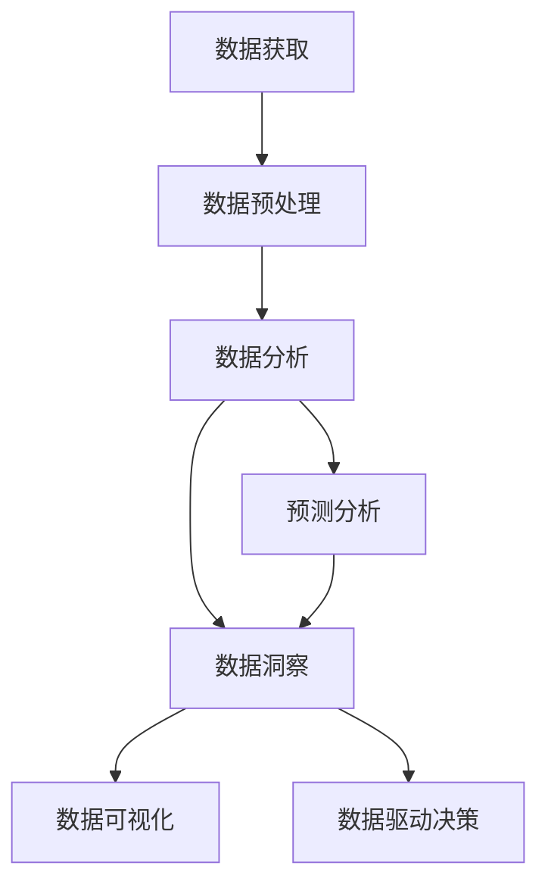

                 

# 理解洞察力的力量：在商业决策中的作用

> 关键词：商业智能(BI), 数据洞察力, 数据分析, 人工智能, 预测分析, 大数据

## 1. 背景介绍

在现代商业环境中，信息的重要性不言而喻。决策者们依靠大量数据和洞察力，做出影响公司命运的关键决策。商业智能(Business Intelligence, BI)系统应运而生，成为企业决策过程中不可或缺的工具。通过BI系统，企业可以实时监测业务数据，进行深度分析和预测，从而制定科学合理的商业策略。然而，如何利用大数据和技术，提升数据分析的深度和广度，增强数据洞察力，成为商业智能领域的新课题。

### 1.1 问题由来
随着信息技术的发展，企业数据量不断增加，包括客户行为、销售记录、市场分析等数据源。然而，传统的数据分析方式往往只停留在表面，难以发现深层次的业务洞见。例如，基于统计分析的报表虽然可以提供一定程度的业务趋势和模式，但无法深入分析数据背后的原因和关联性。而对于异常数据，如欺诈检测、故障预测等任务，仅依赖传统统计方法更是难以应对。

### 1.2 问题核心关键点
商业智能的核心问题在于如何深度挖掘和分析海量数据，发现隐藏的业务洞见，驱动数据驱动决策。具体来说，主要包括以下几个关键点：
- **数据获取与集成**：如何从多数据源高效地获取和集成数据。
- **数据预处理与清洗**：如何处理缺失值、异常值等数据质量问题。
- **数据分析与建模**：如何利用机器学习、数据挖掘等技术，构建模型预测未来趋势。
- **数据可视化与报告**：如何通过可视化工具，直观地展现数据洞察力，帮助决策者理解结果。
- **数据驱动决策**：如何将分析结果转化为实际的商业策略，推动企业发展。

## 2. 核心概念与联系

### 2.1 核心概念概述

为更好地理解商业智能的数据洞察力，本节将介绍几个密切相关的核心概念：

- 商业智能(BI)：利用信息技术对企业运营数据进行全面分析，并提供支持决策的工具和解决方案。
- 数据洞察力：通过深度分析和模型构建，从数据中挖掘隐藏的业务洞见，驱动决策。
- 数据分析：通过统计、机器学习等方法，对数据进行清洗、处理和建模，从而揭示数据背后的规律和趋势。
- 人工智能(AI)：包括机器学习、深度学习等技术，可以自动发现数据中的模式和规律。
- 预测分析：利用历史数据构建模型，对未来趋势进行预测。
- 大数据：包含各种类型的数据，如结构化数据、非结构化数据、实时数据等，需要高效处理和管理。

这些核心概念之间的逻辑关系可以通过以下Mermaid流程图来展示：



这个流程图展示了大数据洞察力的核心概念及其之间的关系：

1. 数据获取：从不同数据源高效地采集数据。
2. 数据预处理：清洗和整理数据，确保数据质量。
3. 数据分析：通过统计和机器学习等方法，分析数据中的规律和趋势。
4. 预测分析：构建模型，预测未来趋势。
5. 数据洞察：从数据中挖掘出业务洞见，辅助决策。
6. 数据可视化：通过可视化工具，直观展示数据分析结果。
7. 数据驱动决策：将分析结果转化为实际的商业策略，推动企业发展。

这些概念共同构成了商业智能系统的工作原理，使得企业能够基于数据分析做出科学合理的决策。

## 3. 核心算法原理 & 具体操作步骤
### 3.1 算法原理概述

商业智能的数据洞察力主要基于数据挖掘、机器学习等技术，从数据中发现隐藏的业务洞见。具体来说，核心原理包括：

1. **数据预处理**：通过数据清洗、标准化等技术，将原始数据转换为高质量的数据集，便于后续分析。
2. **统计分析**：使用描述性统计方法，对数据集进行基本统计分析，如均值、方差、中位数等。
3. **机器学习**：利用回归、分类、聚类等算法，构建预测模型，对未来趋势进行预测。
4. **深度学习**：通过神经网络模型，对大规模非结构化数据进行深度学习，挖掘数据中的复杂模式。
5. **数据可视化**：使用图表、仪表盘等工具，直观展示数据分析结果。

### 3.2 算法步骤详解

商业智能的数据洞察力步骤主要包括以下几个关键步骤：

**Step 1: 数据采集与集成**
- 收集企业内部的运营数据，包括客户行为、销售记录、市场分析等。
- 将不同数据源的数据整合，形成一个统一的数据集。
- 利用ETL工具，进行数据抽取、转换和加载。

**Step 2: 数据预处理与清洗**
- 检测并处理缺失值、异常值等数据质量问题。
- 使用数据标准化、归一化等技术，提高数据的一致性。
- 利用数据转换技术，将数据转换为适合分析的形式。

**Step 3: 数据分析与建模**
- 使用统计分析方法，对数据进行初步探索，识别数据中的基本趋势和规律。
- 利用机器学习算法，构建预测模型，如回归模型、分类模型、聚类模型等。
- 利用深度学习技术，对大规模非结构化数据进行建模。

**Step 4: 数据洞察与分析**
- 使用机器学习模型，对数据进行深入分析，挖掘出隐藏的业务洞见。
- 构建多维度数据洞察，帮助决策者理解数据的深层含义。

**Step 5: 数据可视化与报告**
- 使用可视化工具，如Tableau、Power BI等，将数据分析结果以图表形式展现。
- 生成报表，支持决策者进行可视化分析。

**Step 6: 数据驱动决策**
- 将数据分析结果转化为实际的商业策略。
- 利用BI系统，对策略执行效果进行实时监测和反馈。

以上是商业智能系统的主要步骤，具体实现中还需要结合实际业务需求，灵活设计和调整。

### 3.3 算法优缺点

商业智能的数据洞察力方法具有以下优点：
1. 数据驱动决策：利用数据洞察力，驱动科学合理的决策，提高决策效率。
2. 精准预测：通过机器学习和深度学习模型，对未来趋势进行精准预测。
3. 实时监测：利用BI系统，实时监测业务数据，及时发现问题。
4. 自动化分析：利用自动化工具，自动进行数据预处理和分析，提高工作效率。

同时，该方法也存在一定的局限性：
1. 数据质量依赖：依赖高质量的数据源，数据质量问题会影响分析结果。
2. 模型复杂度：复杂的机器学习和深度学习模型需要大量计算资源和时间，难以快速迭代。
3. 高门槛：需要较强的数据分析能力和技术背景，一般企业难以自行实现。
4. 难以解释：黑盒模型的解释性不足，决策者难以理解模型的内部逻辑。
5. 数据隐私：企业数据隐私保护问题，需要在数据处理和分析中特别关注。

尽管存在这些局限性，但就目前而言，数据洞察力在商业智能领域仍然是主流的分析范式，对于提升企业决策能力具有重要意义。

### 3.4 算法应用领域

商业智能的数据洞察力方法已经在多个行业得到广泛应用，涵盖市场营销、销售管理、客户关系管理等领域。例如：

- **市场营销**：通过分析客户行为数据，识别出高价值客户群体，优化营销策略。
- **销售管理**：利用预测模型，预测销售趋势和产品需求，优化库存管理和销售计划。
- **客户关系管理**：分析客户反馈和行为数据，提升客户满意度和忠诚度。
- **财务分析**：利用预测模型，进行财务报表分析和预算管理。
- **人力资源管理**：通过分析员工绩效数据，提升招聘、培训和绩效管理。

这些领域的应用展示了数据洞察力在实际业务中的重要性和广泛性。

## 4. 数学模型和公式 & 详细讲解  
### 4.1 数学模型构建

本节将使用数学语言对商业智能的数据洞察力进行分析方法进行更加严格的刻画。

假设企业运营数据集为 $D=\{(x_i,y_i)\}_{i=1}^N, x_i \in \mathcal{X}, y_i \in \mathcal{Y}$，其中 $x_i$ 为输入变量，$y_i$ 为输出变量。

定义模型 $M_{\theta}:\mathcal{X} \rightarrow \mathcal{Y}$，其中 $\theta$ 为模型参数。商业智能系统的主要目标是找到最优模型参数 $\theta^*$，使得模型在给定数据集上的预测误差最小化。

常见的方法包括回归模型、分类模型、聚类模型等。这里以回归模型为例，说明数据的数学模型构建和分析过程。

### 4.2 公式推导过程

回归模型的目标是最小化预测值和实际值之间的误差平方和，即：

$$
\mathcal{L}(\theta) = \frac{1}{N}\sum_{i=1}^N (y_i - M_{\theta}(x_i))^2
$$

其中 $M_{\theta}(x_i) = \theta^T x_i$，$\theta^T$ 为模型参数向量，$x_i$ 为输入变量。

求解上述优化问题，可以得到模型的最小二乘解：

$$
\hat{\theta} = (X^TX)^{-1}X^Ty
$$

其中 $X$ 为特征矩阵，$y$ 为输出变量向量。

### 4.3 案例分析与讲解

**案例：客户生命周期价值预测**

假设企业拥有客户的历史交易数据，包括客户ID、交易金额、交易时间等。目标是对客户进行生命周期价值预测，即根据客户的历史交易行为，预测未来一段时间内的总交易金额。

具体步骤包括：
1. 数据预处理：清洗数据，去除缺失值和异常值，标准化数据。
2. 特征选择：选择与客户生命周期价值相关的特征，如交易金额、交易频率等。
3. 模型构建：构建线性回归模型，使用历史交易数据进行训练和预测。
4. 模型评估：使用测试数据集评估模型的预测效果，计算MAE、R^2等指标。
5. 数据可视化：使用图表展示模型的预测结果和实际数据的对比。

## 5. 项目实践：代码实例和详细解释说明
### 5.1 开发环境搭建

在进行商业智能数据分析实践前，我们需要准备好开发环境。以下是使用Python进行Pandas、NumPy、Scikit-Learn等库的开发环境配置流程：

1. 安装Anaconda：从官网下载并安装Anaconda，用于创建独立的Python环境。

2. 创建并激活虚拟环境：
```bash
conda create -n bi-env python=3.8 
conda activate bi-env
```

3. 安装必要的库：
```bash
conda install pandas numpy scikit-learn matplotlib seaborn jupyter notebook ipython
```

4. 安装可视化工具：
```bash
pip install plotly seaborn
```

5. 安装商业智能工具：
```bash
pip install plotly dash
```

完成上述步骤后，即可在`bi-env`环境中开始商业智能数据分析实践。

### 5.2 源代码详细实现

这里以一个简单的客户生命周期价值预测项目为例，给出使用Python进行商业智能数据分析的代码实现。

首先，定义数据预处理函数：

```python
import pandas as pd
import numpy as np

def preprocess_data(data):
    # 删除缺失值
    data.dropna(inplace=True)
    # 标准化数据
    data['total_amount'] = (data['total_amount'] - np.mean(data['total_amount'])) / np.std(data['total_amount'])
    return data
```

然后，定义特征选择和模型构建函数：

```python
from sklearn.linear_model import LinearRegression

def feature_selection(data):
    # 选择与生命周期价值相关的特征
    selected_features = ['transaction_amount', 'transaction_frequency']
    data = data[selected_features]
    return data

def build_model(data):
    # 构建线性回归模型
    X = data.iloc[:, :-1].values
    y = data.iloc[:, -1].values
    model = LinearRegression()
    model.fit(X, y)
    return model
```

接着，定义模型评估和可视化函数：

```python
from sklearn.metrics import mean_absolute_error, r2_score
import plotly.express as px

def evaluate_model(model, test_data):
    # 评估模型预测效果
    y_pred = model.predict(test_data)
    mae = mean_absolute_error(y_pred, test_data['total_amount'])
    r2 = r2_score(y_pred, test_data['total_amount'])
    print(f"MAE: {mae:.2f}, R^2: {r2:.2f}")

def plot_results(model, data, feature):
    # 绘制预测结果与实际数据的对比图
    y_pred = model.predict(data)
    fig = px.line(data, x='transaction_frequency', y='total_amount', line_color='blue', line_width=2, title=f'Predicted vs. Actual {feature} Amount')
    fig.add_trace(px.scatter(data, x='transaction_frequency', y='total_amount', line_color='red', line_width=2))
    fig.show()
```

最后，启动模型训练和评估流程：

```python
# 读取数据集
data = pd.read_csv('customer_data.csv')

# 数据预处理
data = preprocess_data(data)

# 特征选择
data = feature_selection(data)

# 数据划分
train_data = data.sample(frac=0.8, random_state=42)
test_data = data.drop(train_data.index)

# 模型构建
model = build_model(train_data)

# 模型评估
evaluate_model(model, test_data)

# 数据可视化
plot_results(model, test_data, 'total_amount')
```

以上就是使用Python进行商业智能数据分析的完整代码实现。可以看到，通过Pandas、NumPy、Scikit-Learn等库，我们可以轻松地进行数据预处理、特征选择、模型构建和可视化，快速完成商业智能项目的开发。

### 5.3 代码解读与分析

让我们再详细解读一下关键代码的实现细节：

**preprocess_data函数**：
- 该函数用于清洗数据，包括删除缺失值和标准化数据。这是商业智能项目中的重要步骤，数据质量直接影响后续分析和模型效果。

**feature_selection函数**：
- 该函数用于选择与客户生命周期价值相关的特征，如交易金额和交易频率。特征选择是数据分析中的关键环节，选择合适的特征可以提高模型的预测准确性。

**build_model函数**：
- 该函数用于构建线性回归模型，使用训练数据进行训练和预测。模型构建是商业智能项目中的核心步骤，选择合适的模型可以提高预测效果。

**evaluate_model函数**：
- 该函数用于评估模型预测效果，计算MAE和R^2等指标。模型评估是商业智能项目中的重要环节，通过评估可以了解模型效果，进行必要的调整。

**plot_results函数**：
- 该函数用于绘制预测结果与实际数据的对比图，帮助可视化分析。数据可视化是商业智能项目中的重要步骤，通过可视化可以直观展示数据分析结果，便于决策者理解。

可以看到，Python的商业智能数据分析工具集成了数据预处理、特征选择、模型构建和可视化等功能，极大地方便了商业智能项目的发展。

## 6. 实际应用场景
### 6.1 市场营销

在市场营销领域，商业智能系统可以用于识别高价值客户群体，优化营销策略。例如，通过分析客户购买记录和行为数据，识别出高消费客户和潜在客户，从而针对性地进行市场推广和客户维系。

具体来说，商业智能系统可以对客户数据进行聚类分析，找出不同特征的客户群体，然后对每个群体进行针对性营销。例如，对于高消费客户，可以提供高端定制产品和服务；对于潜在客户，可以开展定向广告和促销活动。

### 6.2 销售管理

在销售管理领域，商业智能系统可以用于预测销售趋势和优化库存管理。例如，通过分析历史销售数据和市场趋势，预测未来的销售情况，从而调整库存水平和销售计划。

具体来说，商业智能系统可以利用时间序列预测模型，对未来的销售量进行预测。然后，根据预测结果，优化库存管理和供应链策略。例如，对于预测销量高的产品，可以增加库存量，避免缺货；对于预测销量低的产品，可以减少库存量，提高资金利用率。

### 6.3 客户关系管理

在客户关系管理领域，商业智能系统可以用于提升客户满意度和忠诚度。例如，通过分析客户反馈和行为数据，识别出不满意客户和流失客户，从而采取针对性的措施进行挽回。

具体来说，商业智能系统可以对客户反馈和投诉数据进行分析，找出常见问题和改进点。然后，根据分析结果，制定针对性的客户服务策略。例如，对于投诉量大的问题，可以加强服务培训和改进；对于服务质量低下的客户，可以提供定制化的解决方案。

### 6.4 未来应用展望

随着商业智能技术的发展，未来商业智能系统将在更多领域得到应用，为企业的业务决策提供更大的支持。

在智慧医疗领域，商业智能系统可以用于病历数据分析、医疗资源管理等，帮助医疗机构提升运营效率和医疗质量。在智能教育领域，商业智能系统可以用于学生数据分析、课程推荐等，提升教育质量和学生满意度。在智慧城市治理中，商业智能系统可以用于城市事件监测、舆情分析等，提高城市管理的自动化和智能化水平。

此外，在企业生产、社会治理、文娱传媒等众多领域，商业智能技术也将不断拓展应用，为企业和政府带来更高的价值。

## 7. 工具和资源推荐
### 7.1 学习资源推荐

为了帮助开发者系统掌握商业智能的数据洞察力技术，这里推荐一些优质的学习资源：

1. 《Python数据分析与商业智能实战》书籍：全面介绍了如何使用Python进行商业智能分析，涵盖数据预处理、特征选择、模型构建和可视化等关键技术。

2. Coursera《数据科学导论》课程：由约翰霍普金斯大学开设的课程，系统讲解了数据分析和商业智能的基本原理和应用。

3. 《商业智能与数据分析》视频课程：B站上的一些商业智能课程，如《商业智能数据分析实战》等，详细讲解了商业智能的实际应用案例。

4. Kaggle竞赛平台：Kaggle上有大量的商业智能项目和数据集，可以进行实战练习和算法优化。

5. GitHub商业智能开源项目：GitHub上有很多开源的商业智能项目和代码库，可以参考和学习。

通过对这些资源的学习实践，相信你一定能够快速掌握商业智能的数据洞察力技术，并用于解决实际的业务问题。

### 7.2 开发工具推荐

高效的开发离不开优秀的工具支持。以下是几款用于商业智能数据分析开发的常用工具：

1. Jupyter Notebook：Jupyter Notebook是Python数据分析的经典工具，支持代码和结果的可视化展示，方便开发和调试。

2. Tableau：Tableau是一款强大的数据可视化工具，支持多种数据源和图表类型，可以直观展示商业智能分析结果。

3. Power BI：Power BI是微软推出的商业智能平台，支持数据连接、可视化、报表生成等功能，适合企业内部使用。

4. Python：Python是商业智能数据分析的主流语言，拥有Pandas、NumPy、Scikit-Learn等强大库支持。

5. R：R语言也是商业智能数据分析的常用工具，拥有ggplot2、dplyr等数据可视化库。

6. SQL：SQL语言是商业智能数据分析的基础，可以高效地进行数据管理和查询。

合理利用这些工具，可以显著提升商业智能数据分析的开发效率，加快创新迭代的步伐。

### 7.3 相关论文推荐

商业智能的数据洞察力研究源于学界的持续研究。以下是几篇奠基性的相关论文，推荐阅读：

1. An Introduction to Statistical Learning（《统计学习方法》）：介绍了统计学习的原理和应用，包括回归模型、分类模型等基本方法。

2. Pattern Recognition and Machine Learning（《模式识别与机器学习》）：讲解了机器学习的基本概念和算法，包括决策树、神经网络等模型。

3. Deep Learning（《深度学习》）：讲解了深度学习的基本原理和应用，包括卷积神经网络、循环神经网络等模型。

4. Predictive Analytics with R（《R语言预测分析》）：介绍了R语言在商业智能中的具体应用，包括数据清洗、特征选择、模型构建等技术。

5. The Elements of Statistical Learning（《统计学习要素》）：讲解了统计学习的高级技术，包括集成学习、非参数方法等。

这些论文代表了大数据洞察力的发展脉络。通过学习这些前沿成果，可以帮助研究者把握学科前进方向，激发更多的创新灵感。

## 8. 总结：未来发展趋势与挑战
### 8.1 总结

本文对商业智能的数据洞察力进行了全面系统的介绍。首先阐述了商业智能系统在企业决策中的重要作用，明确了数据分析在提升业务洞见方面的独特价值。其次，从原理到实践，详细讲解了数据分析和建模的数学模型和关键步骤，给出了数据分析任务开发的完整代码实例。同时，本文还广泛探讨了数据分析方法在市场营销、销售管理、客户关系管理等多个行业领域的应用前景，展示了数据洞察力在实际业务中的重要性和广泛性。此外，本文精选了数据分析工具和资源，力求为读者提供全方位的技术指引。

通过本文的系统梳理，可以看到，数据分析和建模是商业智能系统的核心能力，能够从海量数据中挖掘出深层次的业务洞见，驱动数据驱动决策，从而推动企业发展。未来，伴随数据分析技术的发展，数据洞察力必将在更多的业务场景中发挥重要作用，成为企业决策的重要支持。

### 8.2 未来发展趋势

展望未来，商业智能的数据洞察力将呈现以下几个发展趋势：

1. **数据规模扩大**：随着信息技术的发展，企业数据量将不断增加，包括实时数据、物联网数据等。如何高效处理和分析大规模数据，成为未来发展的重点。

2. **自动化程度提升**：自动化数据分析和建模技术将不断发展，减少人工干预，提高数据分析效率。自动化的数据清洗、特征选择、模型构建等技术将得到广泛应用。

3. **跨领域融合**：数据分析将与人工智能、机器学习等技术深度融合，构建更全面的分析模型。例如，将深度学习与数据分析结合，构建端到端的智能分析系统。

4. **实时分析**：实时数据分析和预测技术将不断进步，支持企业实时决策。例如，实时监控业务数据，及时调整策略。

5. **数据可视化**：数据可视化技术将不断发展，支持更丰富的展示形式和交互方式。例如，通过交互式仪表盘展示数据分析结果。

6. **数据安全**：数据隐私和安全问题将得到更多关注，需要在数据处理和分析中特别关注。例如，加密存储和传输数据，保护数据安全。

以上趋势凸显了数据分析和建模技术的广阔前景。这些方向的探索发展，必将进一步提升商业智能系统的性能和应用范围，为企业的业务决策提供更大支持。

### 8.3 面临的挑战

尽管商业智能的数据洞察力已经取得了显著成果，但在迈向更加智能化、普适化应用的过程中，它仍面临诸多挑战：

1. **数据质量问题**：企业数据往往存在数据格式不一、数据不完整等问题，需要高效的数据清洗和预处理技术。

2. **模型复杂度**：复杂的机器学习和深度学习模型需要大量计算资源和时间，难以快速迭代。

3. **高门槛**：数据分析需要较强的技术背景和数据分析能力，一般企业难以自行实现。

4. **可解释性不足**：黑盒模型的解释性不足，决策者难以理解模型的内部逻辑。

5. **数据隐私**：企业数据隐私保护问题，需要在数据处理和分析中特别关注。

6. **系统集成**：企业系统复杂，需要将数据分析系统与现有系统进行无缝集成。

正视数据分析面临的这些挑战，积极应对并寻求突破，将是大数据分析技术走向成熟的必由之路。相信随着学界和产业界的共同努力，这些挑战终将一一被克服，商业智能技术必将在更多的业务场景中发挥重要作用。

### 8.4 研究展望

面向未来，商业智能的数据洞察力研究需要在以下几个方面寻求新的突破：

1. **自动化数据分析**：探索自动化数据分析和建模方法，减少人工干预，提高数据分析效率。

2. **数据可视化**：发展更丰富的数据可视化技术，支持企业更直观地理解数据分析结果。

3. **跨领域融合**：将数据分析与其他人工智能技术深度融合，构建更全面的分析模型。

4. **实时分析**：提升实时数据分析和预测能力，支持企业实时决策。

5. **数据安全**：加强数据隐私和安全保护，保障数据使用安全。

6. **系统集成**：研究数据处理和分析系统的集成技术，提高系统的整体性能和可靠性。

这些研究方向将推动商业智能技术的发展，为企业的业务决策提供更大的支持。相信随着技术的不断进步，数据分析和建模技术将在更多的业务场景中发挥重要作用，推动企业的数字化转型。

## 9. 附录：常见问题与解答

**Q1：商业智能的数据洞察力与传统的数据报表有何不同？**

A: 传统的数据报表主要基于统计分析，可以提供一定程度的业务趋势和模式，但难以深入分析数据背后的原因和关联性。而商业智能的数据洞察力通过深度分析和建模，可以从数据中挖掘出深层次的业务洞见，驱动数据驱动决策。

**Q2：如何选择特征进行数据分析？**

A: 特征选择是数据分析中的重要环节，选择合适的特征可以提高模型的预测准确性。可以选择与业务目标相关的特征，例如与销售量相关的特征包括销售额、客户数量、广告费用等。同时，可以通过特征重要性排序、相关性分析等方法，找到最优特征组合。

**Q3：商业智能的数据洞察力如何处理多模态数据？**

A: 多模态数据包括文本、图像、声音等多种类型，商业智能的数据洞察力需要设计跨模态的分析模型。例如，可以将文本数据与图像数据结合，构建图像识别和文本分析的联合模型，提高分析效果。

**Q4：如何确保商业智能系统中的数据安全？**

A: 数据隐私和安全是商业智能系统中的重要问题，需要在数据处理和分析中特别关注。可以通过数据加密、访问控制等技术，保护数据安全。同时，需要建立数据使用和访问的审计机制，确保数据使用的透明性和合规性。

**Q5：商业智能系统如何与现有系统集成？**

A: 商业智能系统的集成需要考虑现有系统的架构和功能，设计出合理的接口和数据交换方式。例如，可以通过ETL工具，将数据从现有系统中提取出来，再输入到商业智能系统中进行分析。同时，需要考虑系统的性能和可靠性，确保数据实时性和准确性。

总之，商业智能的数据洞察力技术需要从数据预处理、特征选择、模型构建、可视化等多个环节进行全面优化，才能实现科学合理的决策支持。只有不断探索和创新，才能将数据分析和建模技术推向更高的台阶，为企业的业务发展提供更大的支持。

