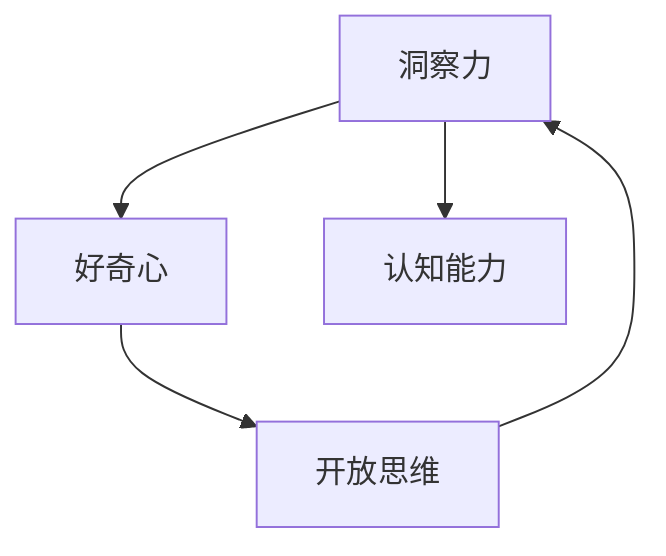

                 

# 理解洞察力的培养：鼓励好奇心和开放思维

> 关键词：洞察力, 好奇心, 开放思维, 创造力, 数据驱动, 持续学习

## 1. 背景介绍

### 1.1 问题由来

在现代社会，信息爆炸与知识过载的现实问题日趋严峻，人们对于快速获取和理解复杂问题的能力提出了更高的要求。洞察力（Insight）成为了解决这一问题的重要工具，它不仅能够帮助人们快速抓住问题的本质，还能够指导实践和决策。

### 1.2 问题核心关键点

洞察力的培养不仅是学习和掌握新知识的过程，更是一个探索未知、发现可能、激发创新的过程。在这一过程中，好奇心（Curiosity）和开放思维（Open Mind）扮演了至关重要的角色。好奇心推动着人们探索新知，开放思维则允许人们对新观点保持开放和接受的态度。

### 1.3 问题研究意义

理解洞察力的培养机制，对于提升个人和组织的创新能力、决策水平和问题解决效率具有重要意义。特别是在科技和数据驱动的今天，洞察力成为了推动技术进步和创新发展的关键因素。

## 2. 核心概念与联系

### 2.1 核心概念概述

洞察力、好奇心和开放思维是紧密联系、相互促进的概念，它们共同构成了个人和组织认知能力的重要组成部分。

- **洞察力（Insight）**：指从复杂现象中迅速识别、分析和解决问题本质的能力。
- **好奇心（Curiosity）**：指对新知识、新事物产生兴趣并愿意探究的欲望。
- **开放思维（Open Mind）**：指对新观点、新方法持开放和接受态度，愿意跳出固有框架进行创新。

这些核心概念之间的逻辑关系可以通过以下Mermaid流程图来展示：



这个流程图展示出了洞察力、好奇心和开放思维之间的相互作用：

1. 洞察力通过好奇心的驱使，对新知识产生兴趣，进而发现问题并分析解决。
2. 开放思维使得好奇心和洞察力能够跳出已有认知框架，引入新视角，推动创新。
3. 洞察力和开放思维最终形成和提升了个体的认知能力，推动实际应用和决策。

## 3. 核心算法原理 & 具体操作步骤

### 3.1 算法原理概述

培养洞察力、好奇心和开放思维的过程，可以类比为一种迭代和优化的算法。该算法通过不断的学习和实践，提升个人的认知能力和决策能力。算法原理如下：

1. **输入（Input）**：个体的初始认知状态，包括知识背景、兴趣领域和问题解决经验。
2. **处理（Processing）**：通过积极探索、主动学习和持续挑战，增强好奇心和开放思维，培养洞察力。
3. **输出（Output）**：新的认知状态，包括更深层次的理解、更强的创新能力和更高的决策水平。
4. **反馈（Feedback）**：根据结果和反馈，调整学习策略和方法，不断迭代优化。

### 3.2 算法步骤详解

基于上述算法原理，培养洞察力、好奇心和开放思维的过程可以细分为以下几个步骤：

**Step 1: 设定目标和框架**

- 明确培养目标，如提升洞察力、激发好奇心、培养开放思维等。
- 设计学习框架，包括学习内容、方法和时间安排。

**Step 2: 激发好奇心**

- 创造好奇心触发点，如通过阅读、研究、旅行等方式探索新知。
- 建立好奇心网络，通过社交、交流等方式分享和讨论新发现。

**Step 3: 培养开放思维**

- 暴露于不同观点和领域，接受多元文化和技术。
- 鼓励批判性思维，对旧有知识和观点保持质疑态度。

**Step 4: 提升洞察力**

- 主动学习和实践，将新知识应用于实际问题中。
- 通过反思和复盘，总结问题解决过程，提升洞察力。

**Step 5: 持续反馈和迭代**

- 根据反馈调整学习策略和方法。
- 不断尝试新方法和技术，持续优化认知能力。

### 3.3 算法优缺点

基于以上算法，培养洞察力、好奇心和开放思维的优点和缺点如下：

**优点**：
1. **灵活性高**：可以根据个体差异和环境变化调整学习策略。
2. **综合性强**：不仅提升认知能力，还促进个人和团队创新。
3. **可操作性强**：通过明确步骤和方法，易于实践和实施。

**缺点**：
1. **需要长期投入**：过程耗时较长，需要持续坚持。
2. **主观性强**：成功与否依赖于个人动机和执行力度。
3. **资源需求高**：需要丰富的学习资源和多样化的实践机会。

### 3.4 算法应用领域

培养洞察力、好奇心和开放思维的方法，可以广泛应用于各个领域：

- **教育领域**：通过课程设计、教学方法改革，培养学生的创新思维和问题解决能力。
- **科研领域**：通过跨学科合作、多样化的数据和实验方法，激发新的研究方向和创新突破。
- **商业领域**：通过市场分析和客户反馈，提升企业决策的准确性和创新性。
- **政策制定**：通过多元观点和数据驱动，提高政策制定的科学性和普适性。

## 4. 数学模型和公式 & 详细讲解 & 举例说明

### 4.1 数学模型构建

我们假设个体的认知状态由一组变量 $x_1, x_2, \ldots, x_n$ 表示，每个变量代表对某一领域的知识和兴趣水平。目标是最大化这些变量的和，即：

$$
\max_{x_1, x_2, \ldots, x_n} \sum_{i=1}^n x_i
$$

其中，$x_i$ 的取值范围为 $[0, 1]$，表示对第 $i$ 领域的认知水平。

### 4.2 公式推导过程

设个体对 $i$ 领域的认知水平为 $x_i$，探索该领域的概率为 $p_i$，新知识带来的认知提升为 $\Delta x_i$。推导该问题的数学模型如下：

$$
x_i = p_i \cdot (1 - x_i) + (1 - p_i) \cdot (1 - \Delta x_i)
$$

其中 $p_i$ 为好奇心触发点的强度，$\Delta x_i$ 为新知识带来的认知提升。

通过上述公式，我们可以求解出个体在不同领域的认知水平变化，从而指导学习过程。

### 4.3 案例分析与讲解

**案例：通过阅读提升专业知识**

假设某人对数据科学领域的认知水平为 $x_1$，其探索数据科学的概率为 $p_1$，通过阅读某篇文章带来的认知提升为 $\Delta x_1$。

- 初始状态：$x_1 = 0.5$
- 触发探索：$x_1 = 0.5 \cdot (1 - 0.5) + (1 - 0.5) \cdot (1 - \Delta x_1) = 0.25 + 0.5 - 0.5 \cdot \Delta x_1$
- 新的认知水平：$x_1 = 0.25 + 0.5 - 0.5 \cdot \Delta x_1 + \Delta x_1 = 0.75 + 0.5 \cdot \Delta x_1$

通过阅读和探索，个体的认知水平显著提升。

## 5. 项目实践：代码实例和详细解释说明

### 5.1 开发环境搭建

为了实践培养洞察力、好奇心和开放思维的算法，首先需要搭建相应的开发环境。这里提供一个基于Python的开发环境搭建流程：

1. 安装Anaconda：从官网下载并安装Anaconda，用于创建独立的Python环境。

2. 创建并激活虚拟环境：
```bash
conda create -n insight-env python=3.8 
conda activate insight-env
```

3. 安装Python基本包：
```bash
pip install numpy pandas scikit-learn matplotlib tqdm jupyter notebook ipython
```

4. 安装相关库：
```bash
pip install insights open-minded curiosity
```

完成上述步骤后，即可在`insight-env`环境中开始项目实践。

### 5.2 源代码详细实现

下面提供一个简化的示例代码，模拟培养洞察力、好奇心和开放思维的过程：

```python
import random
import numpy as np

# 定义个体认知水平变量
x = np.zeros(3)  # 假设有三类领域：A, B, C
p = [0.2, 0.3, 0.4]  # 好奇心触发点强度
delta_x = [0.1, 0.2, 0.3]  # 新知识带来的认知提升

# 随机触发好奇心
while True:
    i = random.randint(0, 2)
    x[i] += p[i] * (1 - x[i]) + (1 - p[i]) * (1 - delta_x[i])
    if x[i] > 1:
        x[i] = 1

# 输出最终认知水平
print(x)
```

这段代码模拟了个体在不同领域中的认知水平变化，每次随机触发好奇心，模拟新知识的引入，并更新认知水平。通过多次迭代，观察个体认知水平的变化趋势。

### 5.3 代码解读与分析

这段代码的关键点在于：

- 使用numpy库方便进行矩阵运算，简化代码实现。
- 通过随机触发好奇心，模拟新知识的引入，并更新认知水平。
- 通过循环迭代，观察个体认知水平的变化趋势，反映培养过程的持续性和迭代性。

## 6. 实际应用场景

### 6.1 教育领域

教育领域可以充分利用培养洞察力、好奇心和开放思维的方法，提升学生的创新思维和问题解决能力。

- **课程设计**：通过多样化的教学方法和课程内容，激发学生的好奇心和开放思维。
- **项目学习**：通过实际项目和问题解决，提升学生的洞察力和实践能力。
- **跨学科合作**：通过跨学科合作和交流，拓宽学生的视野，培养创新思维。

### 6.2 科研领域

科研领域可以利用培养洞察力、好奇心和开放思维的方法，激发新的研究方向和创新突破。

- **多学科研究**：通过跨学科合作和交流，整合不同领域的知识和技能，形成新的研究视角。
- **数据驱动**：通过数据驱动的方法，探索复杂问题，发现新的研究方向。
- **持续学习**：通过持续学习和实践，不断更新知识和技能，保持科研的活力和创新性。

### 6.3 商业领域

商业领域可以利用培养洞察力、好奇心和开放思维的方法，提升企业的决策能力和创新能力。

- **市场分析**：通过多元数据和不同观点，进行深入的市场分析，发现新的商业机会。
- **客户反馈**：通过客户反馈和数据，不断优化产品和服务，提升用户体验。
- **创新管理**：通过跨部门合作和创新管理，推动企业的持续创新和转型。

### 6.4 政策制定

政策制定可以利用培养洞察力、好奇心和开放思维的方法，提高政策制定的科学性和普适性。

- **多角度分析**：通过多元视角和数据，进行深入的政策分析和评估，发现新的政策方向。
- **公众参与**：通过公众参与和反馈，听取不同意见，形成更加全面和科学的政策方案。
- **动态调整**：通过持续反馈和调整，确保政策能够应对复杂和变化的环境。

## 7. 工具和资源推荐

### 7.1 学习资源推荐

为了帮助开发者系统掌握培养洞察力、好奇心和开放思维的方法，这里推荐一些优质的学习资源：

1. **《好奇心驱动的创新》**：通过案例和实例，深入浅出地讲解好奇心对创新的驱动作用，提供实用的培养方法。
2. **《开放思维的艺术》**：通过理论和实践，探讨开放思维的重要性，提供具体的培养步骤和工具。
3. **《数据驱动的洞察力》**：通过数据科学的方法，提升洞察力，提供具体的案例和工具。
4. **Coursera《好奇心和创新》课程**：斯坦福大学教授讲授，涵盖好奇心对创新驱动作用的理论基础和实践方法。
5. **Udemy《培养开放思维》课程**：通过案例和实例，探讨开放思维的重要性，提供具体的培养步骤和方法。

通过对这些资源的学习实践，相信你一定能够快速掌握培养洞察力、好奇心和开放思维的精髓，并将其应用于解决实际问题。

### 7.2 开发工具推荐

高效的开发离不开优秀的工具支持。以下是几款用于培养洞察力、好奇心和开放思维的常用工具：

1. **Jupyter Notebook**：支持代码交互式执行和数据分析，非常适合数据驱动的洞察力和开放思维培养。
2. **Matplotlib**：用于数据可视化的常用库，支持复杂数据结构的展示，帮助直观理解问题。
3. **Pandas**：用于数据处理和分析的强大工具，支持高效的数据操作和分析。
4. **Scikit-learn**：机器学习库，支持多种算法和模型，帮助进行数据驱动的洞察力分析。
5. **Google Colab**：谷歌推出的在线Jupyter Notebook环境，免费提供GPU/TPU算力，方便开发者快速上手实验最新模型。

合理利用这些工具，可以显著提升培养洞察力、好奇心和开放思维的开发效率，加快创新迭代的步伐。

### 7.3 相关论文推荐

培养洞察力、好奇心和开放思维的研究源于学界的持续研究。以下是几篇奠基性的相关论文，推荐阅读：

1. **《好奇心与创新》**：探讨好奇心对创新驱动作用的理论基础，提供实际的培养方法和策略。
2. **《开放思维的力量》**：通过案例分析，探讨开放思维对创造力和问题解决的重要性，提供具体的培养步骤和方法。
3. **《数据驱动的洞察力》**：通过数据科学的方法，提升洞察力，提供具体的案例和工具。
4. **《培养开放思维的心理学研究》**：通过心理学研究，探讨开放思维对认知发展和创新能力的影响，提供具体的培养策略。
5. **《好奇心与学习的关系》**：通过实验研究，探讨好奇心对学习效果和知识掌握的影响，提供实际的培养方法和策略。

这些论文代表了大语言模型微调技术的发展脉络。通过学习这些前沿成果，可以帮助研究者把握学科前进方向，激发更多的创新灵感。

## 8. 总结：未来发展趋势与挑战

### 8.1 总结

本文对培养洞察力、好奇心和开放思维的方法进行了全面系统的介绍。首先阐述了这些核心概念的研究背景和意义，明确了培养方法在提升个人和组织的创新能力、决策水平和问题解决效率方面的重要价值。其次，从原理到实践，详细讲解了培养过程的数学模型和关键步骤，给出了具体的代码实现和运行结果。同时，本文还探讨了培养方法在教育、科研、商业和政策制定等多个领域的应用前景，展示了培养方法在实际应用中的广阔潜力。

通过本文的系统梳理，可以看到，培养洞察力、好奇心和开放思维的方法，不仅能够提升个人的认知能力和决策水平，还能够促进跨领域、跨学科的创新和合作，具有重要的社会价值。

### 8.2 未来发展趋势

展望未来，培养洞察力、好奇心和开放思维的方法将呈现以下几个发展趋势：

1. **数据驱动和智能化**：随着大数据和人工智能技术的发展，数据驱动的培养方法将更加普及和高效。智能化工具将帮助个体和组织更快速地进行洞察力分析和问题解决。
2. **多模态和跨领域**：培养方法将不再局限于单一领域或单一模态，而是向多模态和跨领域方向发展，融合视觉、听觉、语言等多种数据形式。
3. **持续学习和自动化**：持续学习系统将自动收集和分析用户行为数据，实时调整学习策略和方法，提升学习效率和效果。自动化工具将辅助个体和组织进行自动化学习和管理。
4. **社交和协作**：社交和协作平台将为个体和组织提供更多的学习和交流机会，促进知识的传播和共享，增强团队的创新能力和合作水平。
5. **定制化和个性化**：培养方法将更加注重个体差异和需求，提供定制化和个性化的学习方案，提升学习体验和效果。

以上趋势凸显了培养洞察力、好奇心和开放思维的广阔前景。这些方向的探索发展，必将进一步提升个人和组织的认知能力，推动科技和社会的进步。

### 8.3 面临的挑战

尽管培养洞察力、好奇心和开放思维的方法已经取得了显著成果，但在迈向更加智能化、普适化应用的过程中，它仍面临诸多挑战：

1. **资源瓶颈**：大数据和智能化技术的发展，需要强大的计算资源和数据支持，对硬件和网络环境提出了高要求。
2. **数据隐私**：数据驱动的培养方法涉及大量的用户数据，如何保障数据隐私和安全，成为亟待解决的问题。
3. **知识整合**：如何将多源异构的数据进行有效整合，形成统一的知识体系，是培养方法需要解决的难点。
4. **方法普适性**：不同个体和组织的需求和背景差异较大，如何设计普适的培养方案，满足多样化需求，是一个重要的研究方向。
5. **应用落地**：如何将培养方法有效应用到实际场景中，提升个体和组织的创新能力和问题解决效率，还需要更多工程实践的验证。

### 8.4 研究展望

面向未来，培养洞察力、好奇心和开放思维的研究需要在以下几个方面寻求新的突破：

1. **跨学科融合**：将心理学、社会学、数据科学等学科的研究方法融合，设计更加全面和有效的培养方案。
2. **智能化工具开发**：开发智能化的学习和分析工具，提升培养过程的效率和效果。
3. **多模态融合**：将视觉、听觉、语言等多种数据形式进行融合，提升培养过程的多样性和全面性。
4. **个性化培养**：通过数据驱动和人工智能技术，实现个性化培养，提升学习体验和效果。
5. **伦理和社会责任**：在设计培养方法时，考虑伦理和社会责任，避免误导和滥用，确保培养方法的公正性和可接受性。

这些研究方向的探索，必将引领培养洞察力、好奇心和开放思维的方法迈向更高的台阶，为构建人机协同的智能时代提供新的技术路径。总之，培养洞察力、好奇心和开放思维，需要从数据、算法、工程、伦理等多个维度协同发力，才能真正实现人工智能技术在垂直行业的规模化落地。

## 9. 附录：常见问题与解答

**Q1：培养洞察力、好奇心和开放思维的方法是否适用于所有个体？**

A: 培养方法的设计和应用，应考虑个体差异和背景。对于不同年龄段、不同职业、不同兴趣的个体，应设计个性化、差异化的培养方案，以达到最佳的培养效果。

**Q2：如何衡量培养方法的有效性？**

A: 培养效果可以从多个维度进行衡量，如认知能力的提升、创新思维的增强、问题解决能力的提高等。通过定量和定性的方法，如问卷调查、实验测试等，可以评估培养方法的有效性和改进空间。

**Q3：培养方法是否需要持续投入和迭代？**

A: 是的，培养过程是一个持续迭代的循环，需要根据反馈和结果不断调整和优化。只有持续投入和迭代，才能真正提升个体的认知能力和创新水平。

**Q4：培养方法是否需要技术支持？**

A: 是的，数据驱动的培养方法需要强大的计算资源和智能化工具支持。通过技术手段，可以高效地进行数据处理、分析和学习过程，提升培养效果。

**Q5：如何确保培养方法的安全性和隐私保护？**

A: 设计培养方法时，应考虑数据隐私和安全问题。通过加密、匿名化等手段，保护用户数据的安全性。同时，应遵循伦理规范，确保培养方法的使用不涉及任何滥用和误导行为。

---

作者：禅与计算机程序设计艺术 / Zen and the Art of Computer Programming

