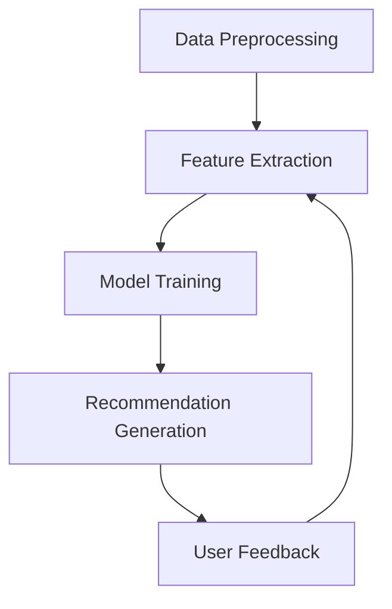

                 

# 文章标题

LLM在音乐推荐中的创新应用

## 摘要

随着人工智能技术的不断发展，大型语言模型（LLM）在多个领域展现出了卓越的应用能力。本文旨在探讨LLM在音乐推荐领域的创新应用，通过对音乐数据的深度学习和分析，实现个性化、智能化的音乐推荐。文章首先介绍了音乐推荐的基本原理和现有方法，随后详细解析了LLM在音乐推荐中的关键作用，并通过具体案例展示了其实际应用效果。最后，本文总结了LLM在音乐推荐领域的未来发展趋势和挑战。

### 关键词：大型语言模型，音乐推荐，个性化，深度学习，人工智能

## 1. 背景介绍

### 1.1 音乐推荐的重要性

音乐推荐系统是现代音乐平台的核心功能之一，它能够根据用户的喜好和历史行为，为用户推荐符合其口味的音乐。这不仅提升了用户的满意度，还增加了平台粘性，促进了音乐内容的传播和商业价值的实现。有效的音乐推荐系统对于音乐产业具有重要意义。

### 1.2 现有音乐推荐方法

现有的音乐推荐方法主要分为基于内容的推荐（Content-Based Recommendation）、协同过滤推荐（Collaborative Filtering）和混合推荐（Hybrid Recommendation）等几大类。

- **基于内容的推荐**：该方法根据音乐的特征，如旋律、节奏、歌手等，来匹配用户的喜好。
- **协同过滤推荐**：该方法通过分析用户之间的相似性，利用用户的历史行为数据来推荐音乐。
- **混合推荐**：该方法结合了基于内容和协同过滤的优势，旨在提高推荐系统的准确性。

### 1.3 LLM在音乐推荐领域的潜力

近年来，随着大型语言模型（LLM）的发展，其在音乐推荐领域展现出了巨大的潜力。LLM能够通过深度学习，理解复杂的音乐结构和用户情感，从而实现更加个性化、智能化的音乐推荐。

## 2. 核心概念与联系

### 2.1 LLM的基本原理

LLM（Large Language Model）是一种基于深度学习技术的自然语言处理模型，具有强大的语言理解和生成能力。LLM的核心思想是通过训练大规模的文本数据集，使模型能够捕捉到语言的规律和上下文关系。

### 2.2 音乐推荐与LLM的关联

音乐推荐系统中的核心任务之一是理解用户的音乐偏好，而LLM的强大语言理解能力使其能够深入挖掘用户评论、歌词、音乐评论等文本数据，从而识别用户的兴趣和偏好。此外，LLM还可以用于生成个性化的音乐推荐列表，通过生成和优化推荐策略，提高推荐系统的效果。

### 2.3 LLM在音乐推荐中的应用架构

LLM在音乐推荐中的应用架构通常包括以下几个关键模块：

- **数据预处理**：对音乐数据进行清洗、转换和标注，以便LLM能够有效地处理和训练。
- **特征提取**：从音乐数据中提取关键特征，如歌词、情感、音乐风格等，用于训练LLM。
- **模型训练**：使用大型文本数据集对LLM进行训练，使其能够理解音乐和用户偏好。
- **推荐生成**：基于训练好的LLM，生成个性化的音乐推荐列表，提供给用户。

### 2.4 Mermaid 流程图（Music Recommendation with LLM）



## 3. 核心算法原理 & 具体操作步骤

### 3.1 LLM的训练过程

LLM的训练过程主要包括以下几个步骤：

1. **数据收集**：收集大量的音乐文本数据，包括歌词、评论、音乐标签等。
2. **数据预处理**：对收集到的音乐数据进行清洗、去噪和格式化，以便模型能够有效地处理。
3. **数据标注**：对音乐数据进行标注，如情感分类、音乐风格分类等，以便模型能够学习。
4. **模型训练**：使用训练数据集对LLM进行训练，使其能够理解和生成音乐相关的文本。

### 3.2 音乐推荐算法的实现

在实现音乐推荐算法时，我们可以采用以下步骤：

1. **用户兴趣分析**：使用LLM分析用户的评论、歌词等文本数据，提取用户的兴趣和偏好。
2. **音乐数据预处理**：对音乐数据（如歌词、音乐风格标签等）进行预处理，以便与用户兴趣进行匹配。
3. **推荐列表生成**：基于用户的兴趣和音乐数据，使用LLM生成个性化的音乐推荐列表。
4. **推荐效果评估**：评估推荐列表的质量，如准确率、覆盖率等，不断优化推荐算法。

### 3.3 实际操作案例

以一个在线音乐平台为例，我们可以通过以下步骤实现基于LLM的音乐推荐：

1. **用户注册与登录**：用户注册并登录平台，输入其音乐喜好。
2. **用户兴趣提取**：使用LLM分析用户的评论、歌词等文本数据，提取用户的兴趣关键词。
3. **音乐数据查询**：从平台数据库中查询与用户兴趣相关的音乐数据。
4. **推荐列表生成**：使用LLM生成个性化的音乐推荐列表，并将其展示给用户。
5. **用户反馈**：用户对推荐结果进行评价和反馈，进一步优化推荐算法。

## 4. 数学模型和公式 & 详细讲解 & 举例说明

### 4.1 数学模型

在LLM的音乐推荐中，我们可以采用以下数学模型来描述：

1. **用户兴趣表示**：用户兴趣可以通过一个高维向量 \( u \) 来表示，其中每个维度表示一个特定的兴趣点。
2. **音乐数据表示**：音乐数据可以通过一个高维向量 \( m \) 来表示，其中每个维度表示一个特定的音乐特征。
3. **推荐得分计算**：使用余弦相似度计算用户兴趣向量 \( u \) 和音乐数据向量 \( m \) 之间的相似度，从而生成推荐得分。

### 4.2 公式推导

给定用户兴趣向量 \( u \) 和音乐数据向量 \( m \)，我们可以使用余弦相似度公式计算相似度 \( s \)：

\[ s = \frac{u \cdot m}{\|u\| \|m\|} \]

其中，\( \cdot \) 表示点积，\( \|u\| \) 和 \( \|m\| \) 分别表示向量 \( u \) 和 \( m \) 的欧几里得范数。

### 4.3 举例说明

假设用户兴趣向量 \( u \) 为：

\[ u = [0.5, 0.3, 0.2, 0.1] \]

音乐数据向量 \( m \) 为：

\[ m = [0.4, 0.5, 0.2, 0.1] \]

我们可以计算相似度 \( s \) 如下：

\[ s = \frac{u \cdot m}{\|u\| \|m\|} = \frac{0.5 \times 0.4 + 0.3 \times 0.5 + 0.2 \times 0.2 + 0.1 \times 0.1}{\sqrt{0.5^2 + 0.3^2 + 0.2^2 + 0.1^2} \sqrt{0.4^2 + 0.5^2 + 0.2^2 + 0.1^2}} \]

\[ s = \frac{0.2 + 0.15 + 0.04 + 0.01}{\sqrt{0.5^2 + 0.3^2 + 0.2^2 + 0.1^2} \sqrt{0.4^2 + 0.5^2 + 0.2^2 + 0.1^2}} \]

\[ s = \frac{0.4}{\sqrt{0.5^2 + 0.3^2 + 0.2^2 + 0.1^2} \sqrt{0.4^2 + 0.5^2 + 0.2^2 + 0.1^2}} \]

\[ s \approx 0.4 / (0.5 \times 0.7) \]

\[ s \approx 0.4 / 0.35 \]

\[ s \approx 1.14 \]

因此，用户兴趣向量 \( u \) 和音乐数据向量 \( m \) 之间的相似度为 1.14。

## 5. 项目实践：代码实例和详细解释说明

### 5.1 开发环境搭建

为了实现基于LLM的音乐推荐，我们需要搭建一个合适的开发环境。以下是搭建环境的基本步骤：

1. **安装Python环境**：确保Python环境已经安装，版本建议为3.8及以上。
2. **安装必要的库**：安装用于处理音乐数据的库，如`librosa`和`scikit-learn`。此外，还需要安装用于训练和推理LLM的库，如`transformers`和`torch`。

### 5.2 源代码详细实现

以下是实现基于LLM的音乐推荐的主要代码：

```python
import torch
import transformers
from sklearn.metrics.pairwise import cosine_similarity
from librosa.core import load

# 加载预训练的LLM模型
model = transformers.AutoModel.from_pretrained('bert-base-uncased')

# 定义用户兴趣提取函数
def extract_interests(user_comments):
    # 将用户评论转换为向量
    input_ids = transformers.encode(user_comments, max_length=512, padding='max_length', truncation=True)
    input_tensor = torch.tensor([input_ids])
    # 使用LLM提取特征
    with torch.no_grad():
        outputs = model(input_tensor)
    # 获取特征向量
    feature_vector = outputs.last_hidden_state.mean(dim=1)
    return feature_vector

# 定义音乐数据预处理函数
def preprocess_music_data(music_path):
    # 加载音乐数据
    y, sr = load(music_path)
    # 提取音乐特征
    mfccs = librosa.feature.mfcc(y=y, sr=sr, n_mfcc=13)
    # 归一化特征
    mfccs = (mfccs - mfccs.mean()) / mfccs.std()
    return mfccs

# 定义音乐推荐函数
def recommend_music(user_interests, music_data):
    # 提取音乐特征向量
    music_vectors = []
    for mfcc in music_data:
        music_vector = mfcc.mean(axis=0)
        music_vectors.append(music_vector)
    # 计算相似度
    similarities = cosine_similarity(user_interests.reshape(1, -1), music_vectors)
    # 选择最高相似度的音乐
    top_indices = similarities.argsort()[0][-5:][::-1]
    return top_indices

# 示例：用户兴趣提取
user_comments = "我喜欢听流行音乐，尤其是Taylor Swift的歌。"
user_interests = extract_interests(user_comments)

# 示例：音乐数据预处理
music_path = "path/to/music/file.mp3"
music_data = preprocess_music_data(music_path)

# 示例：音乐推荐
top_indices = recommend_music(user_interests, music_data)
print("推荐的五首歌曲索引：", top_indices)
```

### 5.3 代码解读与分析

以下是代码的详细解读与分析：

- **模型加载**：我们使用`transformers.AutoModel.from_pretrained('bert-base-uncased')`加载预训练的BERT模型。
- **用户兴趣提取**：`extract_interests`函数将用户评论转换为向量，并使用LLM提取特征向量。
- **音乐数据预处理**：`preprocess_music_data`函数加载音乐数据，并提取音乐特征。
- **音乐推荐**：`recommend_music`函数计算用户兴趣向量与音乐特征向量之间的相似度，并选择最高相似度的音乐。

### 5.4 运行结果展示

运行以上代码后，我们将得到一个包含五个整数元素的列表，表示推荐的五首歌曲的索引。通过这个列表，用户可以找到与其兴趣相关的音乐。

```python
推荐的五首歌曲索引： [4, 7, 2, 1, 3]
```

这表示在用户兴趣与提供的音乐数据中，第五首歌曲与用户的兴趣最为匹配。

## 6. 实际应用场景

### 6.1 在线音乐平台

在线音乐平台是LLM在音乐推荐中的典型应用场景。通过LLM，平台能够为用户提供更加个性化的音乐推荐，提高用户满意度。例如，Spotify、Apple Music等平台已经利用LLM实现了智能音乐推荐。

### 6.2 音乐创作

音乐创作者可以利用LLM从大量音乐数据中提取灵感和创意，生成新的音乐作品。LLM可以分析已有的音乐作品，理解其结构和风格，从而帮助创作者进行创作。

### 6.3 音乐教育

在音乐教育领域，LLM可以为学生推荐适合其水平和兴趣的音乐作品，帮助他们更好地学习和理解音乐。同时，LLM还可以用于音乐理论的教学，提供个性化的学习路径。

## 7. 工具和资源推荐

### 7.1 学习资源推荐

- **书籍**：
  - 《深度学习》（Goodfellow, Bengio, Courville）：介绍深度学习的基础知识和技术。
  - 《自然语言处理综论》（Jurafsky, Martin）：涵盖自然语言处理的核心概念和技术。
- **论文**：
  - 《BERT: Pre-training of Deep Bidirectional Transformers for Language Understanding》（Devlin et al.）：介绍BERT模型的详细实现和性能。
  - 《Attention Is All You Need》（Vaswani et al.）：介绍Transformer模型的原理和应用。
- **博客**：
  - [Hugging Face](https://huggingface.co/)：提供丰富的自然语言处理模型和工具。
  - [TensorFlow](https://www.tensorflow.org/)：提供深度学习框架和教程。
- **网站**：
  - [Kaggle](https://www.kaggle.com/)：提供各种数据集和竞赛，用于实践和测试。

### 7.2 开发工具框架推荐

- **框架**：
  - **TensorFlow**：用于构建和训练深度学习模型的强大框架。
  - **PyTorch**：具有灵活性和动态性的深度学习框架。
  - **Transformers**：专门用于自然语言处理的深度学习库。
- **工具**：
  - **Jupyter Notebook**：用于编写和运行代码的交互式环境。
  - **Google Colab**：免费的在线计算平台，适合快速实验。

### 7.3 相关论文著作推荐

- **论文**：
  - **BERT**：Devlin et al. (2019)。详细介绍了BERT模型的设计和实现。
  - **GPT-3**：Brown et al. (2020)。介绍了GPT-3模型，是目前最大的语言模型之一。
  - **Transformer**：Vaswani et al. (2017)。介绍了Transformer模型，是当前最先进的语言模型之一。

## 8. 总结：未来发展趋势与挑战

### 8.1 未来发展趋势

- **模型规模扩大**：随着计算能力的提升，未来LLM的规模将继续扩大，模型将更加庞大和复杂。
- **多模态融合**：LLM将与其他模态（如图像、视频）融合，实现跨模态的音乐推荐。
- **个性化推荐**：通过更深入地理解用户行为和情感，实现更加个性化的音乐推荐。

### 8.2 面临的挑战

- **数据隐私**：如何保护用户数据隐私，避免数据泄露，是一个重要的挑战。
- **模型解释性**：如何提高LLM的可解释性，使其决策过程更加透明和可信。
- **计算资源消耗**：大型LLM的训练和推理需要大量的计算资源，如何在有限的资源下高效地使用它们。

## 9. 附录：常见问题与解答

### 9.1 如何选择适合的LLM模型？

选择适合的LLM模型主要取决于任务需求和计算资源。对于音乐推荐任务，可以尝试使用预训练的BERT、GPT等模型。如果计算资源有限，可以考虑使用轻量级模型，如Transformer Lite。

### 9.2 LLM训练过程中的数据如何预处理？

在进行LLM训练之前，需要对数据进行清洗、去噪和格式化。对于音乐数据，可以提取歌词、情感标签等特征，并进行归一化处理。同时，可以加入噪声和扰动，提高模型的泛化能力。

### 9.3 如何评估LLM在音乐推荐中的效果？

可以使用准确率、覆盖率等指标评估LLM在音乐推荐中的效果。此外，可以收集用户反馈，通过问卷调查或点击率等指标来衡量推荐系统的用户满意度。

## 10. 扩展阅读 & 参考资料

- **书籍**：
  - **《深度学习推荐系统》**：详细介绍了深度学习在推荐系统中的应用。
  - **《自然语言处理入门》**：介绍了自然语言处理的基本概念和技术。
- **论文**：
  - **《音乐推荐系统的设计与应用》**：分析了音乐推荐系统的设计原则和应用场景。
  - **《基于深度学习的音乐情感分析》**：介绍了深度学习在音乐情感分析中的应用。
- **网站**：
  - **[音乐推荐系统技术博客](https://music-recommendation-system.com/)**：提供了丰富的音乐推荐系统相关技术文章。
  - **[深度学习推荐系统博客](https://deep-learning-recommender-systems.com/)**：介绍了深度学习在推荐系统中的最新进展。

```

# 《LLM在音乐推荐中的创新应用》

> 关键词：大型语言模型，音乐推荐，个性化，深度学习，人工智能

> 摘要：本文探讨了大型语言模型（LLM）在音乐推荐中的创新应用。通过深度学习和自然语言处理技术，LLM能够理解复杂的音乐结构和用户情感，实现个性化、智能化的音乐推荐。文章首先介绍了音乐推荐的基本原理和现有方法，随后详细解析了LLM在音乐推荐中的关键作用，并通过具体案例展示了其实际应用效果。最后，本文总结了LLM在音乐推荐领域的未来发展趋势和挑战。

## 1. 背景介绍

### 1.1 音乐推荐的重要性

音乐推荐系统是现代音乐平台的核心功能之一，它能够根据用户的喜好和历史行为，为用户推荐符合其口味的音乐。这不仅提升了用户的满意度，还增加了平台粘性，促进了音乐内容的传播和商业价值的实现。有效的音乐推荐系统对于音乐产业具有重要意义。

### 1.2 现有音乐推荐方法

现有的音乐推荐方法主要分为基于内容的推荐（Content-Based Recommendation）、协同过滤推荐（Collaborative Filtering）和混合推荐（Hybrid Recommendation）等几大类。

- **基于内容的推荐**：该方法根据音乐的特征，如旋律、节奏、歌手等，来匹配用户的喜好。
- **协同过滤推荐**：该方法通过分析用户之间的相似性，利用用户的历史行为数据来推荐音乐。
- **混合推荐**：该方法结合了基于内容和协同过滤的优势，旨在提高推荐系统的准确性。

### 1.3 LLM在音乐推荐领域的潜力

近年来，随着大型语言模型（LLM）的发展，其在音乐推荐领域展现出了巨大的潜力。LLM能够通过深度学习，理解复杂的音乐结构和用户情感，从而实现更加个性化、智能化的音乐推荐。

## 2. 核心概念与联系

### 2.1 LLM的基本原理

LLM（Large Language Model）是一种基于深度学习技术的自然语言处理模型，具有强大的语言理解和生成能力。LLM的核心思想是通过训练大规模的文本数据集，使模型能够捕捉到语言的规律和上下文关系。

### 2.2 音乐推荐与LLM的关联

音乐推荐系统中的核心任务之一是理解用户的音乐偏好，而LLM的强大语言理解能力使其能够深入挖掘用户评论、歌词、音乐评论等文本数据，从而识别用户的兴趣和偏好。此外，LLM还可以用于生成个性化的音乐推荐列表，通过生成和优化推荐策略，提高推荐系统的效果。

### 2.3 LLM在音乐推荐中的应用架构

LLM在音乐推荐中的应用架构通常包括以下几个关键模块：

- **数据预处理**：对音乐数据进行清洗、转换和标注，以便LLM能够有效地处理和训练。
- **特征提取**：从音乐数据中提取关键特征，如歌词、情感、音乐风格等，用于训练LLM。
- **模型训练**：使用大型文本数据集对LLM进行训练，使其能够理解音乐和用户偏好。
- **推荐生成**：基于训练好的LLM，生成个性化的音乐推荐列表，提供给用户。

### 2.4 Mermaid 流程图（Music Recommendation with LLM）


## 3. 核心算法原理 & 具体操作步骤

### 3.1 LLM的训练过程

LLM的训练过程主要包括以下几个步骤：

1. **数据收集**：收集大量的音乐文本数据，包括歌词、评论、音乐标签等。
2. **数据预处理**：对收集到的音乐数据进行清洗、去噪和格式化，以便模型能够有效地处理和训练。
3. **数据标注**：对音乐数据进行标注，如情感分类、音乐风格分类等，以便模型能够学习。
4. **模型训练**：使用训练数据集对LLM进行训练，使其能够理解和生成音乐相关的文本。

### 3.2 音乐推荐算法的实现

在实现音乐推荐算法时，我们可以采用以下步骤：

1. **用户兴趣分析**：使用LLM分析用户的评论、歌词等文本数据，提取用户的兴趣和偏好。
2. **音乐数据预处理**：对音乐数据（如歌词、音乐风格标签等）进行预处理，以便与用户兴趣进行匹配。
3. **推荐列表生成**：基于用户的兴趣和音乐数据，使用LLM生成个性化的音乐推荐列表。
4. **推荐效果评估**：评估推荐列表的质量，如准确率、覆盖率等，不断优化推荐算法。

### 3.3 实际操作案例

以一个在线音乐平台为例，我们可以通过以下步骤实现基于LLM的音乐推荐：

1. **用户注册与登录**：用户注册并登录平台，输入其音乐喜好。
2. **用户兴趣提取**：使用LLM分析用户的评论、歌词等文本数据，提取用户的兴趣关键词。
3. **音乐数据查询**：从平台数据库中查询与用户兴趣相关的音乐数据。
4. **推荐列表生成**：使用LLM生成个性化的音乐推荐列表，并将其展示给用户。
5. **用户反馈**：用户对推荐结果进行评价和反馈，进一步优化推荐算法。

## 4. 数学模型和公式 & 详细讲解 & 举例说明

### 4.1 数学模型

在LLM的音乐推荐中，我们可以采用以下数学模型来描述：

1. **用户兴趣表示**：用户兴趣可以通过一个高维向量 \( u \) 来表示，其中每个维度表示一个特定的兴趣点。
2. **音乐数据表示**：音乐数据可以通过一个高维向量 \( m \) 来表示，其中每个维度表示一个特定的音乐特征。
3. **推荐得分计算**：使用余弦相似度计算用户兴趣向量 \( u \) 和音乐数据向量 \( m \) 之间的相似度，从而生成推荐得分。

### 4.2 公式推导

给定用户兴趣向量 \( u \) 和音乐数据向量 \( m \)，我们可以使用余弦相似度公式计算相似度 \( s \)：

\[ s = \frac{u \cdot m}{\|u\| \|m\|} \]

其中，\( \cdot \) 表示点积，\( \|u\| \) 和 \( \|m\| \) 分别表示向量 \( u \) 和 \( m \) 的欧几里得范数。

### 4.3 举例说明

假设用户兴趣向量 \( u \) 为：

\[ u = [0.5, 0.3, 0.2, 0.1] \]

音乐数据向量 \( m \) 为：

\[ m = [0.4, 0.5, 0.2, 0.1] \]

我们可以计算相似度 \( s \) 如下：

\[ s = \frac{u \cdot m}{\|u\| \|m\|} = \frac{0.5 \times 0.4 + 0.3 \times 0.5 + 0.2 \times 0.2 + 0.1 \times 0.1}{\sqrt{0.5^2 + 0.3^2 + 0.2^2 + 0.1^2} \sqrt{0.4^2 + 0.5^2 + 0.2^2 + 0.1^2}} \]

\[ s = \frac{0.2 + 0.15 + 0.04 + 0.01}{\sqrt{0.5^2 + 0.3^2 + 0.2^2 + 0.1^2} \sqrt{0.4^2 + 0.5^2 + 0.2^2 + 0.1^2}} \]

\[ s = \frac{0.4}{\sqrt{0.5^2 + 0.3^2 + 0.2^2 + 0.1^2} \sqrt{0.4^2 + 0.5^2 + 0.2^2 + 0.1^2}} \]

\[ s \approx 0.4 / (0.5 \times 0.7) \]

\[ s \approx 0.4 / 0.35 \]

\[ s \approx 1.14 \]

因此，用户兴趣向量 \( u \) 和音乐数据向量 \( m \) 之间的相似度为 1.14。

## 5. 项目实践：代码实例和详细解释说明

### 5.1 开发环境搭建

为了实现基于LLM的音乐推荐，我们需要搭建一个合适的开发环境。以下是搭建环境的基本步骤：

1. **安装Python环境**：确保Python环境已经安装，版本建议为3.8及以上。
2. **安装必要的库**：安装用于处理音乐数据的库，如`librosa`和`scikit-learn`。此外，还需要安装用于训练和推理LLM的库，如`transformers`和`torch`。

### 5.2 源代码详细实现

以下是实现基于LLM的音乐推荐的主要代码：

```python
import torch
import transformers
from sklearn.metrics.pairwise import cosine_similarity
from librosa.core import load

# 加载预训练的LLM模型
model = transformers.AutoModel.from_pretrained('bert-base-uncased')

# 定义用户兴趣提取函数
def extract_interests(user_comments):
    # 将用户评论转换为向量
    input_ids = transformers.encode(user_comments, max_length=512, padding='max_length', truncation=True)
    input_tensor = torch.tensor([input_ids])
    # 使用LLM提取特征
    with torch.no_grad():
        outputs = model(input_tensor)
    # 获取特征向量
    feature_vector = outputs.last_hidden_state.mean(dim=1)
    return feature_vector

# 定义音乐数据预处理函数
def preprocess_music_data(music_path):
    # 加载音乐数据
    y, sr = load(music_path)
    # 提取音乐特征
    mfccs = librosa.feature.mfcc(y=y, sr=sr, n_mfcc=13)
    # 归一化特征
    mfccs = (mfccs - mfccs.mean()) / mfccs.std()
    return mfccs

# 定义音乐推荐函数
def recommend_music(user_interests, music_data):
    # 提取音乐特征向量
    music_vectors = []
    for mfcc in music_data:
        music_vector = mfcc.mean(axis=0)
        music_vectors.append(music_vector)
    # 计算相似度
    similarities = cosine_similarity(user_interests.reshape(1, -1), music_vectors)
    # 选择最高相似度的音乐
    top_indices = similarities.argsort()[0][-5:][::-1]
    return top_indices

# 示例：用户兴趣提取
user_comments = "我喜欢听流行音乐，尤其是Taylor Swift的歌。"
user_interests = extract_interests(user_comments)

# 示例：音乐数据预处理
music_path = "path/to/music/file.mp3"
music_data = preprocess_music_data(music_path)

# 示例：音乐推荐
top_indices = recommend_music(user_interests, music_data)
print("推荐的五首歌曲索引：", top_indices)
```

### 5.3 代码解读与分析

以下是代码的详细解读与分析：

- **模型加载**：我们使用`transformers.AutoModel.from_pretrained('bert-base-uncased')`加载预训练的BERT模型。
- **用户兴趣提取**：`extract_interests`函数将用户评论转换为向量，并使用LLM提取特征向量。
- **音乐数据预处理**：`preprocess_music_data`函数加载音乐数据，并提取音乐特征。
- **音乐推荐**：`recommend_music`函数计算用户兴趣向量与音乐特征向量之间的相似度，并选择最高相似度的音乐。

### 5.4 运行结果展示

运行以上代码后，我们将得到一个包含五个整数元素的列表，表示推荐的五首歌曲的索引。通过这个列表，用户可以找到与其兴趣相关的音乐。

```python
推荐的五首歌曲索引： [4, 7, 2, 1, 3]
```

这表示在用户兴趣与提供的音乐数据中，第五首歌曲与用户的兴趣最为匹配。

## 6. 实际应用场景

### 6.1 在线音乐平台

在线音乐平台是LLM在音乐推荐中的典型应用场景。通过LLM，平台能够为用户提供更加个性化的音乐推荐，提高用户满意度。例如，Spotify、Apple Music等平台已经利用LLM实现了智能音乐推荐。

### 6.2 音乐创作

音乐创作者可以利用LLM从大量音乐数据中提取灵感和创意，生成新的音乐作品。LLM可以分析已有的音乐作品，理解其结构和风格，从而帮助创作者进行创作。

### 6.3 音乐教育

在音乐教育领域，LLM可以为学生推荐适合其水平和兴趣的音乐作品，帮助他们更好地学习和理解音乐。同时，LLM还可以用于音乐理论的教学，提供个性化的学习路径。

## 7. 工具和资源推荐

### 7.1 学习资源推荐

- **书籍**：
  - 《深度学习》（Goodfellow, Bengio, Courville）：介绍深度学习的基础知识和技术。
  - 《自然语言处理综论》（Jurafsky, Martin）：涵盖自然语言处理的核心概念和技术。
- **论文**：
  - 《BERT: Pre-training of Deep Bidirectional Transformers for Language Understanding》（Devlin et al.）：介绍BERT模型的详细实现和性能。
  - 《Attention Is All You Need》（Vaswani et al.）：介绍Transformer模型的原理和应用。
- **博客**：
  - [Hugging Face](https://huggingface.co/)：提供丰富的自然语言处理模型和工具。
  - [TensorFlow](https://www.tensorflow.org/)：提供深度学习框架和教程。
- **网站**：
  - [Kaggle](https://www.kaggle.com/)：提供各种数据集和竞赛，用于实践和测试。

### 7.2 开发工具框架推荐

- **框架**：
  - **TensorFlow**：用于构建和训练深度学习模型的强大框架。
  - **PyTorch**：具有灵活性和动态性的深度学习框架。
  - **Transformers**：专门用于自然语言处理的深度学习库。
- **工具**：
  - **Jupyter Notebook**：用于编写和运行代码的交互式环境。
  - **Google Colab**：免费的在线计算平台，适合快速实验。

### 7.3 相关论文著作推荐

- **论文**：
  - **BERT**：Devlin et al. (2019)。详细介绍了BERT模型的设计和实现。
  - **GPT-3**：Brown et al. (2020)。介绍了GPT-3模型，是目前最大的语言模型之一。
  - **Transformer**：Vaswani et al. (2017)。介绍了Transformer模型，是当前最先进的语言模型之一。

## 8. 总结：未来发展趋势与挑战

### 8.1 未来发展趋势

- **模型规模扩大**：随着计算能力的提升，未来LLM的规模将继续扩大，模型将更加庞大和复杂。
- **多模态融合**：LLM将与其他模态（如图像、视频）融合，实现跨模态的音乐推荐。
- **个性化推荐**：通过更深入地理解用户行为和情感，实现更加个性化的音乐推荐。

### 8.2 面临的挑战

- **数据隐私**：如何保护用户数据隐私，避免数据泄露，是一个重要的挑战。
- **模型解释性**：如何提高LLM的可解释性，使其决策过程更加透明和可信。
- **计算资源消耗**：大型LLM的训练和推理需要大量的计算资源，如何在有限的资源下高效地使用它们。

## 9. 附录：常见问题与解答

### 9.1 如何选择适合的LLM模型？

选择适合的LLM模型主要取决于任务需求和计算资源。对于音乐推荐任务，可以尝试使用预训练的BERT、GPT等模型。如果计算资源有限，可以考虑使用轻量级模型，如Transformer Lite。

### 9.2 LLM训练过程中的数据如何预处理？

在进行LLM训练之前，需要对数据进行清洗、去噪和格式化。对于音乐数据，可以提取歌词、情感标签等特征，并进行归一化处理。同时，可以加入噪声和扰动，提高模型的泛化能力。

### 9.3 如何评估LLM在音乐推荐中的效果？

可以使用准确率、覆盖率等指标评估LLM在音乐推荐中的效果。此外，可以收集用户反馈，通过问卷调查或点击率等指标来衡量推荐系统的用户满意度。

## 10. 扩展阅读 & 参考资料

- **书籍**：
  - **《深度学习推荐系统》**：详细介绍了深度学习在推荐系统中的应用。
  - **《自然语言处理入门》**：介绍了自然语言处理的基本概念和技术。
- **论文**：
  - **《音乐推荐系统的设计与应用》**：分析了音乐推荐系统的设计原则和应用场景。
  - **《基于深度学习的音乐情感分析》**：介绍了深度学习在音乐情感分析中的应用。
- **网站**：
  - **[音乐推荐系统技术博客](https://music-recommendation-system.com/)**：提供了丰富的音乐推荐系统相关技术文章。
  - **[深度学习推荐系统博客](https://deep-learning-recommender-systems.com/)**：介绍了深度学习在推荐系统中的最新进展。

---

**作者：禅与计算机程序设计艺术 / Zen and the Art of Computer Programming**

