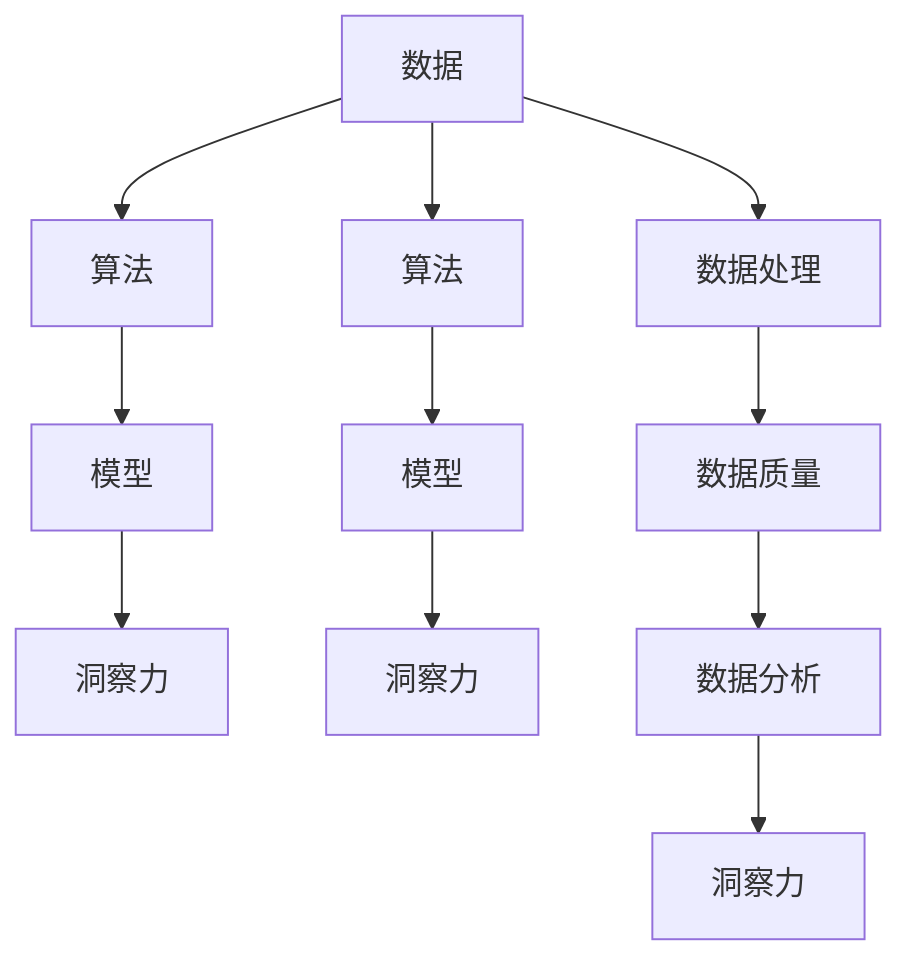

                 

# 理解洞察力的极限：在混乱中寻找规律

> 关键词：理解，洞察力，极限，混乱，规律

## 1. 背景介绍

### 1.1 问题由来
在复杂的世界中，我们每天都在做出各种决策和判断。无论是个人生活还是企业运营，都离不开洞察力的运用。洞察力使我们能够从数据中发现规律，做出明智的选择。然而，随着数据量和复杂度的不断增加，洞察力的极限在哪里？如何在混乱中找到规律，做出最优决策？本文将深入探讨这些问题。

### 1.2 问题核心关键点
- 数据量与复杂性：数据量越大，数据维度和复杂性越高，洞察力的难度也随之增加。
- 数据质量与偏见：数据中的噪音、偏差和缺失会影响分析结果的准确性。
- 算法与模型：如何选择和应用算法，使得模型能够高效、准确地从数据中提取洞察力？
- 解释性与可理解性：模型结果的解释性和可理解性对决策具有重要意义。
- 伦理与隐私：数据的使用需要考虑伦理和隐私问题，确保数据使用的合法性和安全性。

### 1.3 问题研究意义
研究洞察力的极限和在混乱中寻找规律，对于提升决策质量和效率，推动数据科学和人工智能的发展，具有重要意义：

1. 提升决策质量：通过优化数据处理和分析方法，提高决策的科学性和准确性。
2. 加速技术进步：推动算法和模型的创新，促进数据科学与人工智能技术的发展。
3. 强化应用场景：帮助各行各业更好地应用数据和模型，提升业务运营效率和竞争力。
4. 解决伦理问题：确保数据使用符合伦理和法律要求，保护用户隐私和数据安全。

## 2. 核心概念与联系

### 2.1 核心概念概述

为更好地理解在混乱中寻找规律，本节将介绍几个关键概念：

- 洞察力（Insight）：从数据中发现的重要信息或知识，帮助做出决策。
- 数据（Data）：用于分析的原始资料，可以是结构化或非结构化数据。
- 数据质量（Data Quality）：数据的准确性、完整性和一致性，影响分析结果的可靠性。
- 算法（Algorithm）：用于处理数据的数学模型或计算方法，通过优化算法提取洞察力。
- 模型（Model）：对数据进行建模的算法，通过训练和优化提取洞察力。
- 数据处理（Data Processing）：对原始数据进行清洗、转换和规整，提高数据质量。
- 数据分析（Data Analysis）：通过统计分析、机器学习和深度学习等方法，从数据中提取洞察力。

这些核心概念之间的关系可以通过以下Mermaid流程图来展示：



这个流程图展示了大数据处理和分析的核心概念及其之间的关系：

1. 数据经过清洗、转换和规整，提升数据质量。
2. 算法对数据进行处理，形成模型。
3. 模型通过训练和优化，提取洞察力。
4. 模型可以对数据进行多维度的分析，提取不同维度的洞察力。

这些概念共同构成了大数据处理和分析的基本框架，使其能够高效地从数据中提取洞察力。通过理解这些核心概念，我们可以更好地把握大数据处理和分析的关键环节。

## 3. 核心算法原理 & 具体操作步骤
### 3.1 算法原理概述

在大数据处理和分析中，洞察力的提取通常依赖于算法和模型的优化。其核心思想是：通过算法对数据进行处理，形成模型，并通过训练和优化，使得模型能够高效、准确地从数据中提取洞察力。

形式化地，假设原始数据集为 $D$，其维度为 $d$，目标是从数据中提取洞察力 $I$。常见的算法包括：

- 统计分析：通过描述统计和推断统计方法，对数据进行汇总和分析。
- 机器学习：通过训练数据，构建模型，预测未来数据。
- 深度学习：通过多层神经网络，对数据进行抽象特征提取，构建更复杂的模型。

### 3.2 算法步骤详解

大数据处理和分析的流程通常包括以下几个关键步骤：

**Step 1: 数据收集与预处理**
- 收集原始数据，包括结构化数据和半结构化/非结构化数据。
- 清洗和规整数据，包括去除噪音、处理缺失值、标准化数据格式等。
- 转换数据，包括特征工程、数据采样等，提高数据质量。

**Step 2: 数据探索与可视化**
- 通过探索性数据分析（EDA），初步了解数据的基本特征和分布。
- 使用可视化工具，如Matplotlib、Seaborn等，将数据可视化，直观展示数据特征。
- 应用降维技术，如PCA、t-SNE等，减少数据维度，提高数据分析效率。

**Step 3: 数据建模与优化**
- 选择合适的算法和模型，对数据进行建模。
- 使用交叉验证、网格搜索等技术，优化模型参数，提高模型性能。
- 应用正则化、Dropout、Early Stopping等技术，防止模型过拟合，提高泛化能力。

**Step 4: 结果解释与验证**
- 通过模型评估指标（如准确率、召回率、F1分数等），评估模型效果。
- 对模型结果进行解释，理解模型内部工作机制和决策逻辑。
- 应用A/B测试、交叉验证等方法，验证模型在不同场景下的效果。

### 3.3 算法优缺点

大数据处理和分析算法具有以下优点：

- 高效性：通过算法和模型，能够高效地处理大规模数据，提取洞察力。
- 准确性：通过优化算法和模型，提高数据处理和分析的准确性。
- 可解释性：通过解释模型结果，理解模型的内部工作机制和决策逻辑。
- 应用广泛：算法和模型可以应用于各种数据类型和分析场景，提升决策质量。

同时，这些算法也存在一定的局限性：

- 数据依赖：算法的性能依赖于数据质量和完整性，数据偏差会影响分析结果。
- 算法复杂度：部分算法和模型需要较高的计算资源和存储空间，提高分析成本。
- 模型解释性：一些复杂模型（如深度学习模型）难以解释，决策过程不透明。
- 技术门槛：算法和模型需要一定的技术和知识储备，使用门槛较高。

尽管存在这些局限性，但就目前而言，大数据处理和分析算法仍然是大数据处理和分析的主流范式。未来相关研究的重点在于如何进一步降低算法对数据质量和完整性的依赖，提高模型的可解释性和计算效率，同时兼顾算法的应用广泛性和技术门槛。

### 3.4 算法应用领域

大数据处理和分析算法在多个领域得到了广泛应用，包括但不限于：

- 金融风控：通过数据分析和建模，评估贷款风险，制定风险管理策略。
- 医疗健康：通过数据分析和预测，提升疾病诊断和治疗效果，优化医疗资源配置。
- 零售电商：通过数据分析和推荐系统，提升用户购物体验，增加销售收入。
- 物流运输：通过数据分析和路径规划，优化运输路线，提高配送效率，降低成本。
- 城市规划：通过数据分析和空间分析，优化城市布局，提升城市治理水平。
- 能源环保：通过数据分析和建模，优化能源配置，降低碳排放，提升环境质量。

除了上述这些经典应用外，大数据处理和分析算法还被创新性地应用到更多场景中，如智能制造、智慧农业、智慧交通等，为各行各业带来了新的变革。随着数据处理和分析技术的不断进步，相信这些算法将在更多领域得到应用，为经济社会发展注入新的动力。

## 4. 数学模型和公式 & 详细讲解 & 举例说明

### 4.1 数学模型构建

本节将使用数学语言对大数据处理和分析的模型构建过程进行更加严格的刻画。

假设原始数据集为 $D$，其维度为 $d$，目标是从数据中提取洞察力 $I$。常见的数学模型包括：

- 线性回归模型：$y=\theta_0 + \theta_1 x_1 + \theta_2 x_2 + \ldots + \theta_d x_d$，其中 $\theta_i$ 为模型参数，$x_i$ 为数据特征，$y$ 为目标变量。
- 逻辑回归模型：$P(y=1|\mathbf{x})=\frac{1}{1+e^{-(\theta_0 + \theta_1 x_1 + \theta_2 x_2 + \ldots + \theta_d x_d)}}$，其中 $e$ 为自然对数的底数。
- 决策树模型：通过构建决策树，对数据进行分类和回归分析。
- 随机森林模型：通过组合多个决策树，提升模型的稳定性和泛化能力。
- 支持向量机模型：通过优化超平面，对数据进行分类和回归分析。
- 深度学习模型：如神经网络、卷积神经网络（CNN）、循环神经网络（RNN）、长短期记忆网络（LSTM）等。

### 4.2 公式推导过程

以下我们以线性回归模型为例，推导其数学模型及其梯度下降优化的公式。

假设线性回归模型为 $y=\theta_0 + \theta_1 x_1 + \theta_2 x_2 + \ldots + \theta_d x_d$，目标是最小化均方误差损失函数 $\ell(y,\hat{y})=(y-\hat{y})^2$。

将均方误差损失函数代入数据集 $D$，得：

$$
\mathcal{L}(\theta) = \frac{1}{N}\sum_{i=1}^N (y_i - (\theta_0 + \theta_1 x_{i1} + \theta_2 x_{i2} + \ldots + \theta_d x_{id}))^2
$$

求导并设置梯度为零，解得最优参数：

$$
\frac{\partial \mathcal{L}(\theta)}{\partial \theta_j} = -\frac{2}{N}\sum_{i=1}^N (y_i - (\theta_0 + \theta_1 x_{i1} + \theta_2 x_{i2} + \ldots + \theta_d x_{id})) x_{ij} = 0 \quad \text{for} \quad j = 0,1,\ldots,d
$$

进一步整理，得：

$$
\mathbf{X}^T\mathbf{X}\boldsymbol{\theta} = \mathbf{X}^T\mathbf{y}
$$

其中 $\mathbf{X}$ 为特征矩阵，$\mathbf{y}$ 为目标变量向量。求解上述线性方程组，即可得到最优参数 $\boldsymbol{\theta}$。

### 4.3 案例分析与讲解

考虑一个简单的案例：

假设有一个零售电商公司的销售数据集，包含时间、商品类别、销售量等特征。目标是对销售量进行预测，从而优化库存管理和促销策略。

1. 数据收集与预处理：
   - 收集历史销售数据，包括时间、商品类别、销售量等特征。
   - 清洗数据，去除异常值和缺失值，标准化数据格式。
   - 转换数据，使用时间序列特征进行归一化处理。

2. 数据探索与可视化：
   - 使用Matplotlib绘制时间序列销售量的变化趋势。
   - 使用PCA进行降维，减少数据维度。

3. 数据建模与优化：
   - 选择线性回归模型，对数据进行建模。
   - 使用网格搜索和交叉验证，优化模型参数。
   - 应用正则化技术，防止模型过拟合。

4. 结果解释与验证：
   - 使用R平方、均方误差等指标评估模型效果。
   - 绘制预测结果与实际销售量的对比图，验证模型准确性。

## 5. 项目实践：代码实例和详细解释说明
### 5.1 开发环境搭建

在进行数据分析和建模实践前，我们需要准备好开发环境。以下是使用Python进行PyTorch开发的环境配置流程：

1. 安装Anaconda：从官网下载并安装Anaconda，用于创建独立的Python环境。

2. 创建并激活虚拟环境：
```bash
conda create -n pytorch-env python=3.8 
conda activate pytorch-env
```

3. 安装PyTorch：根据CUDA版本，从官网获取对应的安装命令。例如：
```bash
conda install pytorch torchvision torchaudio cudatoolkit=11.1 -c pytorch -c conda-forge
```

4. 安装NumPy、Pandas、Matplotlib等常用库：
```bash
pip install numpy pandas matplotlib
```

完成上述步骤后，即可在`pytorch-env`环境中开始数据分析和建模实践。

### 5.2 源代码详细实现

下面我们以线性回归模型为例，给出使用PyTorch进行数据建模的完整代码实现。

首先，定义数据处理函数：

```python
import pandas as pd
import numpy as np
from torch.utils.data import Dataset
import torch

class SalesDataset(Dataset):
    def __init__(self, df, target, date_col='date', drop_cols=['id'], features=None):
        self.df = df
        self.target = target
        self.date_col = date_col
        self.drop_cols = drop_cols
        self.features = features
        
    def __len__(self):
        return len(self.df)
    
    def __getitem__(self, item):
        date = self.df.iloc[item][self.date_col]
        data = self.df.drop(drop_cols, axis=1)
        if self.features:
            data = data[self.features]
        else:
            data = data[self.drop_cols + [self.target]]
        data = pd.DataFrame(data, columns=self.drop_cols + [self.target])
        data['date'] = pd.to_datetime(date)
        data = data.set_index('date')
        return {'input': data[self.drop_cols].to_numpy(), 'target': data[self.target].to_numpy()}

# 准备数据
data = pd.read_csv('sales_data.csv')
target = 'sales_volume'

# 构建数据集
train_dataset = SalesDataset(data, target, date_col='date', drop_cols=['id'], features=None)
test_dataset = SalesDataset(data, target, date_col='date', drop_cols=['id'], features=None)

# 构建数据加载器
train_loader = torch.utils.data.DataLoader(train_dataset, batch_size=32, shuffle=True)
test_loader = torch.utils.data.DataLoader(test_dataset, batch_size=32, shuffle=False)
```

然后，定义模型和优化器：

```python
from torch import nn, optim
import torch.nn.functional as F

class LinearRegression(nn.Module):
    def __init__(self, input_size, output_size):
        super(LinearRegression, self).__init__()
        self.linear = nn.Linear(input_size, output_size)
    
    def forward(self, x):
        return self.linear(x)
    
# 构建模型
input_size = 4
output_size = 1
model = LinearRegression(input_size, output_size)

# 设置优化器和损失函数
optimizer = optim.SGD(model.parameters(), lr=0.01)
loss_fn = nn.MSELoss()

# 训练模型
for epoch in range(100):
    for data, target in train_loader:
        optimizer.zero_grad()
        output = model(data)
        loss = loss_fn(output, target)
        loss.backward()
        optimizer.step()
    print(f'Epoch {epoch+1}, loss: {loss.item()}')
```

### 5.3 代码解读与分析

让我们再详细解读一下关键代码的实现细节：

**SalesDataset类**：
- `__init__`方法：初始化数据集，包含数据、目标变量、时间列、需要删除的列和特征列等参数。
- `__len__`方法：返回数据集的样本数量。
- `__getitem__`方法：对单个样本进行处理，将时间列转换为日期时间格式，并将数据转换为Tensor，同时去除不需要的列。

**模型构建**：
- 定义线性回归模型，包含一个全连接层。
- 设置优化器和损失函数，使用随机梯度下降（SGD）和均方误差（MSELoss）。
- 在每个epoch中，对数据集进行迭代，计算损失并更新模型参数。

可以看到，PyTorch使得数据建模和优化变得简洁高效。开发者可以将更多精力放在模型设计和数据处理上，而不必过多关注底层的实现细节。

## 6. 实际应用场景
### 6.1 智能制造

大数据处理和分析技术在智能制造领域有着广泛应用。通过数据分析和预测，制造企业可以优化生产流程，提升产品质量，降低成本。

具体而言，企业可以收集生产设备、工艺参数、工人操作等数据，通过机器学习模型对数据进行分析，预测设备故障、优化生产参数。例如，通过预测设备故障，企业可以在设备出现问题前进行维护，避免生产停滞。通过优化生产参数，企业可以提高生产效率，降低能耗和资源浪费。

### 6.2 智慧农业

大数据处理和分析技术在智慧农业中也具有重要应用。通过数据分析和建模，农业生产可以更加科学、精准。

具体而言，农业企业可以收集土壤湿度、气候条件、作物生长数据等，通过数据分析和预测，优化种植方案，提升产量和质量。例如，通过预测气象条件，企业可以调整播种和施肥时间，减少自然灾害带来的损失。通过优化种植方案，企业可以提高土地利用率，降低生产成本。

### 6.3 智慧交通

大数据处理和分析技术在智慧交通领域也得到了广泛应用。通过数据分析和建模，交通管理可以更加智能、高效。

具体而言，交通管理部门可以收集交通流量、车辆信息、道路状况等数据，通过数据分析和预测，优化交通信号灯控制，提升道路通行效率。例如，通过预测交通流量，部门可以调整信号灯配时，减少交通拥堵。通过优化交通管理策略，部门可以提高道路使用效率，降低交通事故发生率。

## 7. 工具和资源推荐
### 7.1 学习资源推荐

为了帮助开发者系统掌握大数据处理和分析的理论基础和实践技巧，这里推荐一些优质的学习资源：

1. 《Python数据分析实战》系列博文：由大数据专家撰写，深入浅出地介绍了数据分析的基本概念和实践方法。

2. Kaggle机器学习竞赛：Kaggle是数据科学竞赛的平台，通过参与竞赛可以学习到最新的算法和模型，同时提升数据处理和分析能力。

3. Coursera《机器学习》课程：由斯坦福大学开设的机器学习课程，有Lecture视频和配套作业，带你入门机器学习的基本概念和经典算法。

4. O'Reilly《数据科学实战》书籍：该书详细介绍了数据科学的基础知识和实践技巧，适合初学者和进阶者阅读。

5. TensorFlow官方文档：TensorFlow是Google开源的深度学习框架，提供了丰富的API和模型库，是进行数据分析和建模的重要工具。

6. Scikit-learn官方文档：Scikit-learn是Python开源的机器学习库，提供了多种算法和模型，适合用于数据分析和建模任务。

通过对这些资源的学习实践，相信你一定能够快速掌握大数据处理和分析的精髓，并用于解决实际的数据分析问题。

### 7.2 开发工具推荐

高效的开发离不开优秀的工具支持。以下是几款用于大数据处理和分析开发的常用工具：

1. Python：作为数据分析和建模的主流语言，Python拥有丰富的库和工具，如Pandas、NumPy、Scikit-learn等。

2. R语言：R语言是数据科学和统计分析的主流语言，拥有丰富的数据处理和分析包，如ggplot2、dplyr、tidyr等。

3. Jupyter Notebook：Jupyter Notebook是一种交互式编程环境，适合用于数据分析和模型验证。

4. Apache Spark：Apache Spark是Apache基金会开源的大数据处理引擎，支持大规模数据处理和分析任务。

5. Tableau：Tableau是一款数据可视化工具，可以直观展示数据分析结果，帮助用户理解数据特征。

6. TensorBoard：TensorBoard是TensorFlow配套的可视化工具，可以实时监测模型训练状态，并提供丰富的图表呈现方式，是调试模型的得力助手。

合理利用这些工具，可以显著提升大数据处理和分析任务的开发效率，加快创新迭代的步伐。

### 7.3 相关论文推荐

大数据处理和分析技术的发展源于学界的持续研究。以下是几篇奠基性的相关论文，推荐阅读：

1. Google Brain团队提出的TensorFlow：引入了分布式计算和自动微分机制，极大地提升了深度学习模型的训练效率。

2. Andrew Ng等人提出的TensorFlow 2.0：进一步简化了TensorFlow的使用，提高了开发效率和模型性能。

3. Kevin Murphy等人编写的《机器学习》教材：系统介绍了机器学习的基本概念和算法，是学习和研究的经典参考书。

4. Ian Goodfellow等人撰写的《深度学习》教材：详细介绍了深度学习的基本原理和应用，是深度学习领域的经典参考书。

5. Yann LeCun等人提出的卷积神经网络（CNN）：通过卷积层和池化层的设计，提高了图像处理模型的准确性和泛化能力。

6. Geoffrey Hinton等人提出的循环神经网络（RNN）：通过循环层的设计，提高了序列数据处理模型的准确性和泛化能力。

这些论文代表了大数据处理和分析技术的发展脉络。通过学习这些前沿成果，可以帮助研究者把握学科前进方向，激发更多的创新灵感。

## 8. 总结：未来发展趋势与挑战

### 8.1 总结

本文对大数据处理和分析的洞察力提取过程进行了全面系统的介绍。首先阐述了大数据处理和分析的研究背景和意义，明确了在数据量增大、复杂性提升的情况下，洞察力的提取难度也在增加。其次，从原理到实践，详细讲解了数据分析和建模的数学模型和关键步骤，给出了数据分析和建模的完整代码实例。同时，本文还广泛探讨了数据分析和建模在智能制造、智慧农业、智慧交通等多个领域的应用前景，展示了数据分析和建模的巨大潜力。此外，本文精选了数据分析和建模的各类学习资源，力求为读者提供全方位的技术指引。

通过本文的系统梳理，可以看到，大数据处理和分析技术在大数据时代具有重要意义。这些技术使得从海量数据中提取洞察力成为可能，极大地提升了决策质量和效率，推动了数据科学和人工智能的发展。未来，伴随数据处理和分析技术的持续演进，相信这些技术将在更多领域得到应用，为经济社会发展注入新的动力。

### 8.2 未来发展趋势

展望未来，大数据处理和分析技术将呈现以下几个发展趋势：

1. 数据量持续增大。随着互联网和物联网设备的普及，数据量将不断增长，推动数据处理和分析技术的进一步发展。

2. 数据类型更加多样化。除了结构化数据，非结构化数据（如文本、图像、视频等）的处理和分析将成为重要方向。

3. 深度学习应用广泛。深度学习模型在图像、语音、自然语言处理等领域已经取得了显著进展，未来将在更多领域得到应用。

4. 联邦学习兴起。联邦学习是一种分布式学习技术，可以在不共享原始数据的前提下，进行模型训练和优化，保护用户隐私和数据安全。

5. 数据隐私保护加强。数据隐私保护成为重要议题，如何保护用户隐私、防止数据滥用将成为关键研究方向。

6. 自动化和智能化水平提升。自动机器学习（AutoML）和智能数据处理工具将使得数据分析和建模更加高效、智能。

以上趋势凸显了大数据处理和分析技术的广阔前景。这些方向的探索发展，必将进一步提升数据处理和分析的效果，推动数据科学和人工智能技术的进步。

### 8.3 面临的挑战

尽管大数据处理和分析技术已经取得了显著进展，但在迈向更加智能化、普适化应用的过程中，它仍面临着诸多挑战：

1. 数据质量问题。数据中的噪音、偏差和缺失会影响分析结果的准确性，需要进一步提升数据处理和清洗能力。

2. 计算资源限制。大数据处理和分析需要大量的计算资源，如何优化算法和模型，提高计算效率，是一个重要问题。

3. 算法复杂度。部分算法和模型需要较高的计算资源和存储空间，如何降低算法复杂度，提高模型性能，是一个重要研究方向。

4. 数据隐私保护。数据隐私保护成为重要议题，如何在保护用户隐私的前提下，进行数据分析和建模，是一个重要挑战。

5. 技术普及问题。大数据处理和分析技术需要一定的技术和知识储备，如何降低技术门槛，普及算法和模型，是一个重要任务。

6. 伦理和法律问题。数据使用需要考虑伦理和法律要求，确保数据使用的合法性和安全性，是一个重要课题。

正视大数据处理和分析技术面临的这些挑战，积极应对并寻求突破，将是大数据处理和分析技术走向成熟的必由之路。相信随着学界和产业界的共同努力，这些挑战终将一一被克服，大数据处理和分析技术必将在构建智能社会中扮演越来越重要的角色。

### 8.4 研究展望

面向未来，大数据处理和分析技术需要在以下几个方面寻求新的突破：

1. 无监督学习和半监督学习：摆脱对大规模标注数据的依赖，利用自监督学习、主动学习等无监督和半监督范式，最大限度利用非结构化数据，实现更加灵活高效的数据分析。

2. 自动化和智能化：通过自动机器学习（AutoML）和智能数据处理工具，提升数据分析和建模的效率和效果。

3. 联邦学习：在保护用户隐私的前提下，进行模型训练和优化，推动分布式数据分析和建模技术的发展。

4. 数据隐私保护：采用差分隐私、数据脱敏等技术，保护用户隐私和数据安全。

5. 模型解释性和可理解性：通过解释模型结果，理解模型的内部工作机制和决策逻辑，提升模型应用的可信度和透明性。

6. 多模态数据融合：将视觉、语音、文本等多模态数据进行融合，提升数据的综合利用率，推动多模态数据分析和建模技术的发展。

这些研究方向将引领大数据处理和分析技术迈向更高的台阶，为构建安全、可靠、可解释、可控的智能系统铺平道路。面向未来，大数据处理和分析技术还需要与其他人工智能技术进行更深入的融合，如知识表示、因果推理、强化学习等，多路径协同发力，共同推动人工智能技术的发展。只有勇于创新、敢于突破，才能不断拓展数据分析和建模的边界，让智能技术更好地造福人类社会。

## 9. 附录：常见问题与解答

**Q1：大数据处理和分析中的数据质量问题如何解决？**

A: 大数据处理和分析中的数据质量问题可以通过以下几种方法解决：

1. 数据清洗：通过去除噪音、处理缺失值、标准化数据格式等，提升数据质量。
2. 数据采样：使用随机抽样或分层抽样等方法，减少数据偏差。
3. 特征工程：通过特征选择、特征转换等方法，提升数据特征的质量和代表性。
4. 数据标注：对数据进行标注，提高数据标签的准确性和一致性。

这些方法可以有效提升数据质量，减少数据偏差和噪音，提高数据分析和建模的效果。

**Q2：大数据处理和分析中的算法复杂度问题如何解决？**

A: 大数据处理和分析中的算法复杂度问题可以通过以下几种方法解决：

1. 算法优化：通过优化算法和模型，提高计算效率，减少计算资源消耗。
2. 分布式计算：使用分布式计算框架，如Apache Spark，进行并行计算，提高计算效率。
3. 模型压缩：通过模型压缩技术，如剪枝、量化等，减小模型尺寸，提高计算效率。
4. 硬件优化：使用高性能硬件设备，如GPU、TPU等，提升计算效率。

这些方法可以有效降低算法复杂度，提高大数据处理和分析的效果，推动技术进步。

**Q3：大数据处理和分析中的数据隐私保护问题如何解决？**

A: 大数据处理和分析中的数据隐私保护问题可以通过以下几种方法解决：

1. 数据脱敏：对敏感数据进行脱敏处理，保护用户隐私。
2. 差分隐私：通过添加噪音和扰动，保护用户隐私，同时保证数据分析的准确性。
3. 联邦学习：在保护用户隐私的前提下，进行模型训练和优化，推动分布式数据分析和建模技术的发展。
4. 数据加密：对数据进行加密处理，保护数据安全。

这些方法可以有效保护用户隐私和数据安全，推动大数据处理和分析技术的安全应用。

**Q4：大数据处理和分析中的模型解释性问题如何解决？**

A: 大数据处理和分析中的模型解释性问题可以通过以下几种方法解决：

1. 可解释性模型：使用可解释性模型，如决策树、线性回归等，提高模型的解释性和透明性。
2. 解释性工具：使用解释性工具，如LIME、SHAP等，帮助理解模型内部工作机制和决策逻辑。
3. 可视化分析：通过数据可视化工具，如Matplotlib、Seaborn等，直观展示模型分析结果，提高模型的可解释性。

这些方法可以有效提升模型的解释性和透明性，推动大数据处理和分析技术的可解释性应用。

**Q5：大数据处理和分析中的自动化和智能化问题如何解决？**

A: 大数据处理和分析中的自动化和智能化问题可以通过以下几种方法解决：

1. 自动机器学习（AutoML）：使用自动机器学习工具，如Auto-Sklearn、TPOT等，自动选择和优化算法和模型。
2. 智能数据处理工具：使用智能数据处理工具，如TensorBoard、Keras等，提升数据处理和分析的效率和效果。
3. 智能算法：使用智能算法，如深度学习、强化学习等，提高数据分析和建模的效果。

这些方法可以有效提升大数据处理和分析的自动化和智能化水平，推动技术进步。

---

作者：禅与计算机程序设计艺术 / Zen and the Art of Computer Programming

