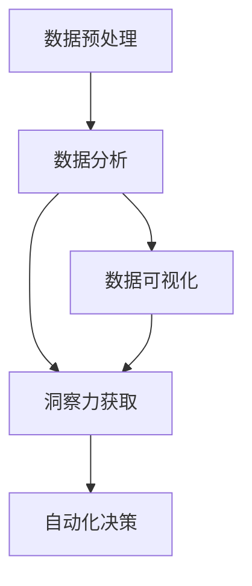

                 

# 理解洞察力的艺术：在纷繁中把握本质

> 关键词：洞察力,数据分析,数据挖掘,机器学习,人工智能,决策支持

## 1. 背景介绍

### 1.1 问题由来
在当今信息爆炸的时代，数据量和种类的爆炸式增长，使得决策者需要从中提取出有价值的洞察力来支持业务决策。传统的数据分析和报告方式往往滞后于现实需求，无法迅速响应快速变化的市场和用户行为。同时，海量的数据也给数据处理和分析带来了巨大的计算压力和存储挑战。

为应对这些挑战，我们迫切需要一种更高效、智能、灵活的洞察力获取手段，能在复杂多变的数据环境中快速发现和提取关键信息，支持高效决策。

### 1.2 问题核心关键点
理解洞察力的艺术，本质上是对数据进行深入分析和挖掘，从中发现隐藏在背后的模式、趋势和关联。关键点包括：

- 数据预处理：清洗、归一化、特征提取等预处理步骤是洞察力提取的基础。
- 数据分析方法：选择合适的分析方法，如图数据可视化、统计分析、时间序列分析等，是获取洞察力的关键。
- 洞察力评估：通过可视化展示、文本报告、实时仪表盘等方式，对分析结果进行评估和反馈。
- 自动化决策：将洞察力嵌入自动化决策系统，实时进行业务优化和策略调整。

## 2. 核心概念与联系

### 2.1 核心概念概述

为更好地理解洞察力获取的艺术，本节将介绍几个核心概念：

- 数据预处理(Data Preprocessing)：对原始数据进行清洗、归一化、特征提取等处理，使其适于后续分析。
- 数据分析(Analytic Techniques)：使用统计学、机器学习、数据挖掘等方法，对数据进行深入挖掘和分析。
- 数据可视化(Data Visualization)：使用图表、仪表盘等工具，将分析结果可视化展示，便于理解和决策。
- 洞察力获取(Insight Extraction)：通过分析方法，从数据中发现模式、趋势和关联，提取有价值的洞察力。
- 自动化决策(Automated Decision Making)：将洞察力嵌入自动化决策系统，实时进行业务优化和策略调整。

这些核心概念之间的逻辑关系可以通过以下Mermaid流程图来展示：



这个流程图展示了从数据预处理到洞察力获取，再到自动化决策的过程。数据分析是核心环节，通过预处理和可视化工具，辅助洞察力的提取和应用，最后实现自动化决策，形成闭环。

## 3. 核心算法原理 & 具体操作步骤

### 3.1 算法原理概述

洞察力获取的核心算法是数据分析，常用的方法包括统计分析、机器学习和数据挖掘。以下对这三种方法进行简要介绍：

- 统计分析：使用统计学方法，如描述性统计、假设检验、回归分析等，对数据进行基本描述和推断。
- 机器学习：通过训练算法模型，对数据进行预测和分类，发现数据中的复杂模式和关系。
- 数据挖掘：使用算法从数据中发现隐藏的模式和关联，如聚类分析、关联规则挖掘、异常检测等。

### 3.2 算法步骤详解

基于数据分析的核心算法，以下是具体的分析步骤：

**Step 1: 数据收集与清洗**
- 收集业务相关数据，包括历史数据、实时数据等。
- 对数据进行清洗，去除缺失值、异常值，保证数据质量。

**Step 2: 数据归一化与特征提取**
- 对数据进行归一化处理，统一数据格式。
- 根据任务需求，选择和提取关键特征，构建特征向量。

**Step 3: 数据分析与建模**
- 选择合适的分析方法，如时间序列分析、分类分析、回归分析等，对数据进行建模。
- 使用统计学、机器学习或数据挖掘算法，对模型进行训练和优化。

**Step 4: 数据可视化与洞察力提取**
- 使用数据可视化工具，如Tableau、PowerBI、Matplotlib等，将分析结果可视化展示。
- 通过分析结果，提取关键洞察力，如图模式、趋势、关联等。

**Step 5: 自动化决策与反馈**
- 将洞察力嵌入自动化决策系统，如优化算法、智能推荐等，进行业务优化和策略调整。
- 实时监控决策效果，根据反馈调整洞察力和决策模型。

### 3.3 算法优缺点

数据分析的核心算法各有优缺点，具体如下：

- 统计分析：易于理解，适用性广，但对复杂数据的处理能力有限。
- 机器学习：模型精度高，适合处理大规模数据，但需要大量标注数据和计算资源。
- 数据挖掘：可以发现数据中的复杂模式，但算法复杂，解释性较差。

### 3.4 算法应用领域

数据分析的核心算法在多个领域都有广泛应用，例如：

- 金融：利用统计分析和机器学习，进行风险控制、信用评估、投资策略优化等。
- 电商：通过数据挖掘和机器学习，进行用户行为分析、推荐系统优化、营销策略调整等。
- 医疗：使用数据分析方法，进行疾病预测、诊疗方案优化、药物研发等。
- 制造：通过数据分析和机器学习，进行生产流程优化、质量控制、设备维护等。
- 能源：利用数据挖掘和机器学习，进行能源消耗分析、需求预测、资源优化等。

这些领域的应用展示了数据分析的广泛潜力和重要性，数据分析已成为推动各个行业发展的关键技术。

## 4. 数学模型和公式 & 详细讲解 & 举例说明

### 4.1 数学模型构建

数据分析的核心数学模型包括统计模型、机器学习模型和数据挖掘模型。

- 统计模型：如线性回归、逻辑回归、方差分析等，用于描述和推断数据的基本规律。
- 机器学习模型：如决策树、随机森林、支持向量机等，用于预测和分类。
- 数据挖掘模型：如K-means聚类、关联规则挖掘、异常检测等，用于发现数据中的隐藏模式。

### 4.2 公式推导过程

以线性回归为例，介绍其公式推导过程。

线性回归的目标是拟合一个线性函数 $y=\beta_0+\beta_1x_1+\beta_2x_2+\ldots+\beta_kx_k+\epsilon$，其中 $\beta_0, \beta_1, \ldots, \beta_k$ 为模型系数，$\epsilon$ 为随机误差。根据最小二乘法，目标函数为：

$$
\hat{\theta}=\mathop{\arg\min}_{\theta} \sum_{i=1}^n(y_i-\theta^Tx_i)^2
$$

求解上述目标函数，得到参数估计值为：

$$
\hat{\theta}=(X^TX)^{-1}X^Ty
$$

其中 $X=[x_1,x_2,\ldots,x_k]$，$y$ 为样本标签，$\theta$ 为模型参数。

### 4.3 案例分析与讲解

假设有一家电商公司，需要分析用户购买行为，预测未来销售额。首先，收集历史销售数据和用户行为数据。对数据进行预处理，去除异常值，进行归一化。接着，选择关键特征，构建特征向量。使用线性回归模型对数据进行建模，拟合历史销售数据和用户行为数据的关系。最后，将模型嵌入到推荐系统中，根据用户行为进行实时推荐，优化销售额。

## 5. 项目实践：代码实例和详细解释说明

### 5.1 开发环境搭建

在进行数据分析实践前，我们需要准备好开发环境。以下是使用Python进行数据分析实践的环境配置流程：

1. 安装Anaconda：从官网下载并安装Anaconda，用于创建独立的Python环境。

2. 创建并激活虚拟环境：
```bash
conda create -n pyanaconda python=3.8 
conda activate pyanaconda
```

3. 安装必要的工具包：
```bash
pip install pandas numpy matplotlib scikit-learn seaborn jupyter notebook ipython
```

4. 安装Jupyter Notebook：
```bash
pip install jupyterlab
```

完成上述步骤后，即可在`pyanaconda`环境中开始数据分析实践。

### 5.2 源代码详细实现

我们使用Python进行数据分析实践，以下是一个简单的线性回归示例代码：

```python
import pandas as pd
import numpy as np
from sklearn.linear_model import LinearRegression
import matplotlib.pyplot as plt

# 读取数据
data = pd.read_csv('sales_data.csv')

# 数据预处理
X = data[['feature1', 'feature2', 'feature3']] # 选择关键特征
y = data['sales'] # 选择标签

# 数据归一化
X = (X - X.mean()) / X.std()

# 模型训练
model = LinearRegression()
model.fit(X, y)

# 模型评估
y_pred = model.predict(X)

# 可视化展示
plt.scatter(X, y)
plt.plot(X, y_pred, color='red')
plt.show()
```

### 5.3 代码解读与分析

这段代码展示了线性回归的基本实现流程。首先，读取数据并预处理，选择关键特征和标签。接着，进行数据归一化，保证数据量级一致。然后，使用线性回归模型对数据进行训练和预测。最后，将预测结果可视化展示，评估模型效果。

## 6. 实际应用场景

### 6.1 金融数据分析

金融行业是数据分析应用的重要领域，通过统计分析和机器学习，金融机构可以进行风险控制、信用评估、投资策略优化等。例如，利用时间序列分析和回归模型，对历史交易数据进行预测，评估交易风险。通过分类算法，识别高风险客户，制定个性化风控策略。

### 6.2 电商客户分析

电商公司需要深入理解用户行为，优化推荐系统和营销策略。通过数据挖掘和机器学习，电商公司可以发现用户购买模式、兴趣偏好等，实现个性化推荐。利用聚类分析，对用户进行细分，制定差异化营销策略。使用异常检测算法，识别潜在欺诈行为，提升平台安全性。

### 6.3 医疗数据挖掘

医疗行业需要利用数据分析技术，进行疾病预测、诊疗方案优化、药物研发等。通过统计分析和机器学习，对患者数据进行分析，预测疾病风险，制定个性化诊疗方案。使用关联规则挖掘，发现药物间的相互作用，指导临床用药。利用聚类算法，对患者进行分类，制定差异化治疗策略。

### 6.4 制造业质量控制

制造业需要利用数据分析技术，进行生产流程优化、质量控制、设备维护等。通过数据挖掘和机器学习，对生产数据进行分析，发现质量问题和设备故障，制定改进措施。利用时间序列分析，对生产过程进行预测，优化生产计划。使用异常检测算法，识别生产异常，提升生产效率。

## 7. 工具和资源推荐

### 7.1 学习资源推荐

为了帮助开发者系统掌握数据分析理论基础和实践技巧，这里推荐一些优质的学习资源：

1. 《Python数据分析与挖掘实战》：该书深入浅出地介绍了Python数据分析和挖掘的基本方法和技巧，适合初学者入门。
2. 《机器学习实战》：该书通过实际案例，详细讲解了机器学习算法的应用和实现。
3. 《Python数据科学手册》：该书介绍了Python在数据科学和分析中的应用，包括数据预处理、可视化、机器学习等。
4. 《数据科学导论》：该课程由Coursera提供，由斯坦福大学提供，涵盖数据科学的各个方面，包括统计学、机器学习、数据挖掘等。
5. Kaggle平台：该平台提供了大量公开数据集和比赛，开发者可以通过实践学习数据分析和机器学习技巧。

通过这些资源的学习实践，相信你一定能够快速掌握数据分析的精髓，并用于解决实际的业务问题。

### 7.2 开发工具推荐

高效的数据分析需要优秀的工具支持。以下是几款用于数据分析开发的常用工具：

1. Jupyter Notebook：支持Python、R等多种语言，提供交互式编程环境，适合数据分析和实验。
2. RStudio：R语言的专业开发环境，支持R语言的各类库和包，适合统计分析和机器学习任务。
3. Tableau：支持数据可视化，易于使用，适合非技术人员进行数据分析和报告。
4. PowerBI：微软提供的商业智能工具，支持复杂的数据分析和可视化。
5. Apache Spark：分布式计算框架，适合处理大规模数据集，支持Python、R等多种语言。
6. Python库：Pandas、NumPy、Scikit-Learn、Matplotlib等，适合各类数据处理和分析任务。

合理利用这些工具，可以显著提升数据分析的开发效率，加快创新迭代的步伐。

### 7.3 相关论文推荐

数据分析技术的发展源于学界的持续研究。以下是几篇奠基性的相关论文，推荐阅读：

1. On the Shoulders of Giants：论文介绍了统计学和机器学习的基本原理和方法，是数据分析的必读之作。
2. Linear Regression: The Faster Way to Minimize the Sum of Squares: 论文详细介绍了线性回归算法的基本原理和实现方法。
3. k-means: The k-means Algorithm for Vector Quantization: 论文介绍了K-means聚类算法的基本原理和实现方法。
4. Anomaly Detection: A Survey: 论文介绍了异常检测算法的各种方法和应用场景。
5. Collaborative Filtering for Implicit Feedback Datasets：论文介绍了协同过滤算法的基本原理和实现方法。

这些论文代表了大数据分析技术的发展脉络。通过学习这些前沿成果，可以帮助研究者把握学科前进方向，激发更多的创新灵感。

## 8. 总结：未来发展趋势与挑战

### 8.1 总结

本文对数据分析的艺术进行了全面系统的介绍。首先阐述了数据分析的核心概念和关键点，明确了数据分析在洞察力提取中的重要作用。其次，从原理到实践，详细讲解了数据分析的数学模型和操作步骤，给出了数据分析任务开发的完整代码实例。同时，本文还广泛探讨了数据分析在金融、电商、医疗、制造等多个行业领域的应用前景，展示了数据分析的广阔潜力。此外，本文精选了数据分析技术的各类学习资源，力求为读者提供全方位的技术指引。

通过本文的系统梳理，可以看到，数据分析作为洞察力获取的核心技术，在现代社会中发挥着越来越重要的作用。大数据分析技术不仅在学术界得到了广泛应用，也在工业界展现出了巨大的价值。未来，伴随数据分析技术的持续演进，相信数据分析必将在更多领域发挥重要作用，为各行各业带来深刻变革。

### 8.2 未来发展趋势

展望未来，数据分析技术将呈现以下几个发展趋势：

1. 自动化和智能化：随着AI技术的发展，数据分析将更加自动化和智能化，能够实时处理和分析大规模数据，实现预测和优化。
2. 实时分析：大数据实时分析技术将越来越普及，能够及时响应市场和用户行为变化，提升决策效率。
3. 多模态分析：将不同类型的数据（如文本、图像、语音等）进行综合分析，能够更全面地理解数据，提取更多有价值的洞察力。
4. 数据隐私和安全：数据隐私和安全问题将成为关注的重点，需要采用更加严格的数据保护措施和算法，防止数据泄露和滥用。
5. 模型解释性：为了增强算法的可信度和可解释性，数据分析将更加注重模型的解释性，帮助用户理解算法的工作机制和决策过程。

这些趋势凸显了数据分析技术的广阔前景。这些方向的探索发展，必将进一步提升数据分析的性能和应用范围，为各行各业带来深刻的变革。

### 8.3 面临的挑战

尽管数据分析技术已经取得了瞩目成就，但在迈向更加智能化、普适化应用的过程中，它仍面临着诸多挑战：

1. 数据质量问题：数据来源多样、格式不一，数据清洗和预处理难度大。如何提高数据质量，保证数据一致性和完整性，将是关键挑战。
2. 计算资源瓶颈：数据分析处理大规模数据需要强大的计算资源，如何高效利用计算资源，优化算法和模型，是未来研究的重点。
3. 模型解释性不足：数据分析算法往往缺乏解释性，难以理解其内部工作机制和决策逻辑。如何增强算法的可解释性，提升用户信任度，是未来需要解决的问题。
4. 数据隐私和安全：数据分析过程中，如何保护用户隐私，防止数据泄露和滥用，是未来研究的重点。
5. 算法鲁棒性：数据分析算法对数据异常和噪声敏感，如何提高算法鲁棒性，防止过拟合和误判，是未来研究的重点。

尽管面临这些挑战，但相信随着学界和产业界的共同努力，这些问题终将逐步被克服，数据分析必将在构建人机协同的智能时代中扮演越来越重要的角色。

### 8.4 研究展望

面对数据分析所面临的挑战，未来的研究需要在以下几个方面寻求新的突破：

1. 引入更加智能化的算法：通过引入AI技术，如深度学习、强化学习等，提升数据分析的自动化和智能化水平，实现更高效的决策和优化。
2. 发展更加可解释的算法：通过引入因果分析和博弈论等方法，增强数据分析算法的解释性和可信度，提升用户信任度。
3. 融合多模态数据：将不同类型的数据进行综合分析，获取更全面、准确的洞察力，支持更全面的业务决策。
4. 优化算法和模型：优化数据分析算法和模型，减少计算资源消耗，提高算法的鲁棒性和解释性，提升数据分析的性能和应用范围。
5. 加强数据隐私和安全：采用更加严格的数据保护措施和算法，防止数据泄露和滥用，提升数据分析的安全性和可信度。

这些研究方向的探索，必将引领数据分析技术迈向更高的台阶，为构建安全、可靠、可解释、可控的智能系统铺平道路。面向未来，数据分析技术还需要与其他人工智能技术进行更深入的融合，如知识表示、因果推理、强化学习等，多路径协同发力，共同推动自然语言理解和智能交互系统的进步。只有勇于创新、敢于突破，才能不断拓展数据分析的边界，让智能技术更好地造福人类社会。

## 9. 附录：常见问题与解答

**Q1：数据分析中的数据清洗和预处理有哪些常见方法？**

A: 数据分析中的数据清洗和预处理包括：

1. 数据清洗：去除缺失值、异常值，处理重复数据等。
2. 数据归一化：将数据缩放到同一量级，如标准化、最小-最大归一化等。
3. 特征提取：选择和构造关键特征，构建特征向量。
4. 数据增强：通过数据增强技术，增加数据量，提高模型泛化能力。

这些方法可以结合使用，根据具体数据特点进行灵活应用。

**Q2：如何选择合适的数据分析方法？**

A: 选择合适的数据分析方法，需要考虑以下因素：

1. 数据类型：如时间序列数据、文本数据、图像数据等，选择相应的方法。
2. 数据分析目标：如预测、分类、聚类等，选择合适的方法。
3. 数据量大小：如大规模数据、小规模数据等，选择合适的方法。
4. 计算资源：如单机分析、分布式分析等，选择合适的方法。

可以根据具体问题和数据特点，选择合适的分析方法。

**Q3：数据分析的结果如何可视化展示？**

A: 数据分析结果通常通过图表、仪表盘等方式进行可视化展示。常用的工具包括：

1. 数据可视化库：如Matplotlib、Seaborn、Plotly等，支持各种类型的图表绘制。
2. 可视化平台：如Tableau、PowerBI等，支持复杂的数据分析和报告。

可以通过这些工具将分析结果直观展示，便于理解和决策。

**Q4：如何评估数据分析模型的效果？**

A: 数据分析模型的效果评估通常通过以下指标进行：

1. 准确率、召回率、F1-score等分类指标。
2. 均方误差、均方根误差等回归指标。
3. R平方、决定系数等拟合指标。

可以使用这些指标评估模型的预测能力和拟合效果，根据实际需求进行优化。

**Q5：数据分析在哪些行业领域有应用？**

A: 数据分析在多个行业领域都有广泛应用，例如：

1. 金融：风险控制、信用评估、投资策略优化等。
2. 电商：用户行为分析、推荐系统优化、营销策略调整等。
3. 医疗：疾病预测、诊疗方案优化、药物研发等。
4. 制造：生产流程优化、质量控制、设备维护等。
5. 能源：能源消耗分析、需求预测、资源优化等。

数据分析技术已成为推动各个行业发展的关键技术。

---

作者：禅与计算机程序设计艺术 / Zen and the Art of Computer Programming

