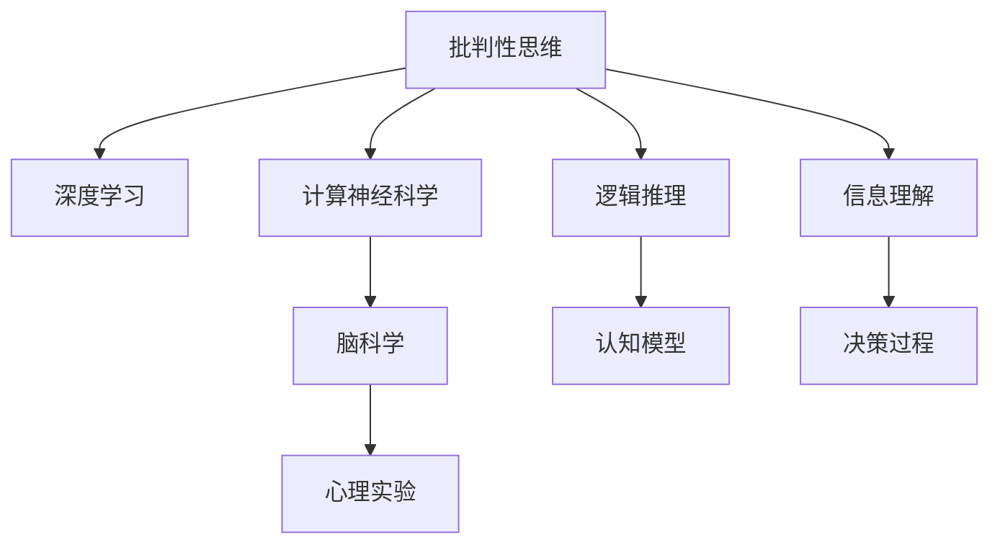

                 

# 理解洞察力的训练：提升批判性思维能力

> 关键词：批判性思维,深度学习,计算神经科学,脑科学,心理实验,洞察力训练,逻辑推理,认知模型

## 1. 背景介绍

### 1.1 问题由来
批判性思维(Critical Thinking)是现代社会必备的一项技能，它不仅仅是逻辑推理和知识应用，更涉及到人类的认知、情感和伦理等多个方面。随着人工智能和大数据技术的发展，如何培养和提升人类的批判性思维能力，成为一个亟待解决的问题。

### 1.2 问题核心关键点
目前，提升批判性思维能力的研究方向主要包括深度学习、计算神经科学、脑科学、心理实验等。其中，深度学习在处理和分析大规模数据方面具有显著优势，已经成为提升批判性思维能力的重要工具之一。

- 深度学习模型可以学习到数据的复杂模式，在处理文本、图像、语音等多种类型数据时表现优异。
- 计算神经科学和脑科学为理解人类思维提供了科学依据，帮助研究者设计更符合人类认知过程的模型。
- 心理实验则通过模拟人类认知过程，验证和优化模型的训练方法，提升模型的预测能力。

## 2. 核心概念与联系

### 2.1 核心概念概述

为了更好地理解批判性思维能力的训练，我们首先需要理解几个关键概念：

- **批判性思维**：指分析和评估信息、逻辑推理和判断的能力。涉及理解、分析、推理、评估等认知过程。
- **深度学习**：一种模拟人类大脑神经网络结构的机器学习方法，通过多层次非线性变换实现对数据的高级抽象。
- **计算神经科学**：结合计算科学和神经科学的交叉学科，研究人类大脑神经元之间的交互和计算过程。
- **脑科学**：研究人类大脑结构和功能的科学，关注神经元、神经回路、大脑网络等微观机制。
- **心理实验**：通过控制变量、随机化实验等方法，验证和优化模型的认知过程，揭示人类思维的规律。

这些概念之间的联系可以通过以下Mermaid流程图来展示：



这个流程图展示了批判性思维与深度学习、计算神经科学、脑科学和心理实验之间的逻辑关系：

1. 批判性思维能力通过深度学习模型实现高级抽象。
2. 计算神经科学和脑科学提供了人类大脑的计算模型。
3. 心理实验验证和优化模型的训练方法。
4. 逻辑推理和认知模型是批判性思维的组成部分。
5. 信息理解和决策过程是批判性思维的核心任务。

## 3. 核心算法原理 & 具体操作步骤
### 3.1 算法原理概述

提升批判性思维能力的训练过程，本质上是通过深度学习模型学习和模拟人类大脑的认知过程。其核心思想是：

- 收集和标注大量的批判性思维训练数据，如逻辑推理题、阅读理解、知识问答等。
- 使用深度学习模型对数据进行训练，学习到批判性思维的能力。
- 通过不断优化模型，提高其对新数据和新任务的适应能力。

### 3.2 算法步骤详解

基于深度学习的批判性思维训练流程一般包括以下几个关键步骤：

**Step 1: 准备数据集**
- 收集和标注批判性思维训练数据，确保数据的多样性和高质量。
- 划分为训练集、验证集和测试集，数据集的划分比例为6:2:2。
- 数据预处理，如文本分词、特征提取、数据增强等。

**Step 2: 设计模型架构**
- 选择合适的深度学习模型架构，如Transformer、CNN、RNN等。
- 设计任务的适配层，如分类层、回归层、注意力层等。
- 确定损失函数和优化器，如交叉熵损失、Adam优化器等。

**Step 3: 训练模型**
- 使用训练集数据，对模型进行前向传播和反向传播，计算损失函数并更新模型参数。
- 设定训练轮数和超参数，如学习率、批大小、梯度裁剪等。
- 周期性在验证集上评估模型性能，防止过拟合。

**Step 4: 测试和验证**
- 在测试集上对模型进行全面评估，验证模型的泛化能力。
- 通过A/B测试等方法，对比不同模型的性能。
- 根据评估结果，优化模型结构和训练参数。

**Step 5: 部署和应用**
- 将训练好的模型部署到实际应用场景中，如智能客服、教育系统、智能助理等。
- 实时收集用户反馈和数据，持续优化模型的训练和应用。

### 3.3 算法优缺点

深度学习模型在提升批判性思维能力方面具有以下优点：
1. 可以处理大规模的训练数据，学习到复杂的人类认知模式。
2. 能够进行高级抽象和推理，解决复杂问题。
3. 可以通过反向传播算法进行参数优化，快速迭代和改进。
4. 可以模拟人类大脑的神经网络结构，具备一定的解释性。

同时，也存在以下局限性：
1. 依赖高质量的标注数据，数据标注成本较高。
2. 模型容易过拟合训练数据，泛化能力不足。
3. 模型结构复杂，训练和推理开销较大。
4. 模型的决策过程缺乏透明性，难以理解和调试。

## 4. 数学模型和公式 & 详细讲解

### 4.1 数学模型构建

批判性思维训练的核心是逻辑推理和知识理解。这里我们以逻辑推理任务为例，展示一个简单的数学模型构建过程。

假设我们有一个简单的逻辑推理问题："如果A并且B，那么C；如果A并且非B，那么非C；那么当A时，C的真假如何？"

我们可以将这个问题转化为一个二分类问题：C为真（Yes）和C为假（No）。使用逻辑回归模型进行分类。

设输入向量为 $x=(A,B)$，输出为 $y=(Yes,No)$。逻辑回归模型的输出为：

$$
\hat{y} = \frac{1}{1 + \exp(-\vec{w} \cdot \vec{x} + b)}
$$

其中 $\vec{w}$ 为模型权重，$b$ 为偏置项。模型的损失函数为交叉熵损失：

$$
\mathcal{L}(w,b) = -\frac{1}{N}\sum_{i=1}^N [y_i \log \hat{y}_i + (1-y_i) \log (1-\hat{y}_i)]
$$

### 4.2 公式推导过程

逻辑回归模型的梯度下降更新公式为：

$$
\frac{\partial \mathcal{L}(w,b)}{\partial w_k} = -\frac{1}{N}\sum_{i=1}^N (\hat{y}_i - y_i)x_{ik}
$$

$$
\frac{\partial \mathcal{L}(w,b)}{\partial b} = -\frac{1}{N}\sum_{i=1}^N (\hat{y}_i - y_i)
$$

通过反向传播算法，可以高效地计算损失函数对模型参数的梯度，并使用随机梯度下降等优化算法更新模型参数。

### 4.3 案例分析与讲解

下面我们以一个具体案例，展示如何通过深度学习模型进行批判性思维训练。

假设我们要训练一个逻辑推理模型，识别文本中的逻辑关系。我们收集了1000个逻辑推理题作为训练集，每个问题由一个前提和多个假设组成。例如：

- 前提：如果天气好，那么人会去公园。
- 假设1：今天是星期五，天气好。
- 假设2：今天是星期六，天气不好。
- 假设3：今天是星期日，天气好。

对于每个问题，我们定义了四个逻辑关系：
- 蕴含关系：假设为真时，前提也一定为真。
- 矛盾关系：假设为真时，前提一定为假。
- 中立关系：假设的真假对前提的真假没有影响。
- 逻辑错误：假设与前提之间没有逻辑关系。

我们可以将每个问题转换为向量形式，如：

- 蕴含关系：$(Yes,Yes,Yes,No)$
- 矛盾关系：$(No,Yes,No,No)$
- 中立关系：$(No,No,No,No)$
- 逻辑错误：$(No,No,No,Yes)$

使用二分类逻辑回归模型，将每个问题的逻辑关系作为输出。通过反向传播算法，不断更新模型参数，使得模型能够准确预测逻辑关系。

## 5. 项目实践：代码实例和详细解释说明
### 5.1 开发环境搭建

在进行批判性思维训练的项目实践前，我们需要准备好开发环境。以下是使用Python进行TensorFlow开发的环境配置流程：

1. 安装Anaconda：从官网下载并安装Anaconda，用于创建独立的Python环境。

2. 创建并激活虚拟环境：
```bash
conda create -n tf-env python=3.8 
conda activate tf-env
```

3. 安装TensorFlow：根据CUDA版本，从官网获取对应的安装命令。例如：
```bash
conda install tensorflow -c conda-forge
```

4. 安装TensorFlow Addons：用于增强TensorFlow的模型库，支持更多的深度学习模型。
```bash
conda install tensorflow-addons
```

5. 安装各类工具包：
```bash
pip install numpy pandas scikit-learn matplotlib tqdm jupyter notebook ipython
```

完成上述步骤后，即可在`tf-env`环境中开始批判性思维训练的实践。

### 5.2 源代码详细实现

下面我们以逻辑推理任务为例，给出使用TensorFlow对逻辑回归模型进行批判性思维训练的代码实现。

首先，定义逻辑推理任务的数据处理函数：

```python
import tensorflow as tf
import numpy as np

class LogicDataset(tf.keras.utils.Sequence):
    def __init__(self, data, batch_size=32):
        self.data = data
        self.batch_size = batch_size

    def __len__(self):
        return len(self.data) // self.batch_size

    def __getitem__(self, item):
        batch = self.data[item * self.batch_size: (item + 1) * self.batch_size]
        inputs = np.array([self.extract_features(row) for row in batch])
        targets = np.array([self.extract_labels(row) for row in batch])
        return inputs, targets

    def extract_features(self, row):
        # 提取特征，这里以二进制向量为例
        premise = self.extract_text(row['premise'])
        conclusion = self.extract_text(row['conclusion'])
        return np.array([premise, conclusion], dtype=np.int32)

    def extract_labels(self, row):
        # 提取标签，这里以二进制向量为例
        labels = np.zeros(4)
        if row['logic_type'] == 'Implication':
            labels[0] = 1
        elif row['logic_type'] == 'Contradiction':
            labels[1] = 1
        elif row['logic_type'] == 'Neutral':
            labels[2] = 1
        elif row['logic_type'] == 'Error':
            labels[3] = 1
        return labels

# 假设数据集包含两个字段：premise和conclusion，逻辑类型以字符串形式标注
data = [
    {'premise': 'If it rains, I will carry an umbrella.', 'conclusion': 'I will carry an umbrella.', 'logic_type': 'Implication'},
    {'premise': 'If it rains, I will carry an umbrella.', 'conclusion': 'I will not carry an umbrella.', 'logic_type': 'Contradiction'},
    {'premise': 'If it rains, I will carry an umbrella.', 'conclusion': 'If it rains, I will not carry an umbrella.', 'logic_type': 'Neutral'},
    {'premise': 'If it rains, I will carry an umbrella.', 'conclusion': 'If it rains, I will carry an umbrella.', 'logic_type': 'Error'}
]
dataset = LogicDataset(data)
```

然后，定义模型和优化器：

```python
from tensorflow.keras.models import Sequential
from tensorflow.keras.layers import Dense

model = Sequential([
    Dense(16, input_shape=(2,), activation='relu'),
    Dense(4, activation='softmax')
])

optimizer = tf.keras.optimizers.Adam(lr=0.001)
```

接着，定义训练和评估函数：

```python
from tensorflow.keras.metrics import CategoricalAccuracy

def train_epoch(model, dataset, batch_size, optimizer, epochs=100):
    model.compile(optimizer=optimizer, loss='categorical_crossentropy', metrics=[CategoricalAccuracy()])
    model.fit(dataset, epochs=epochs, batch_size=batch_size, validation_split=0.2)

def evaluate(model, dataset, batch_size):
    test_loss, test_acc = model.evaluate(dataset)
    print('Test accuracy:', test_acc)
```

最后，启动训练流程并在测试集上评估：

```python
train_epoch(model, dataset, batch_size=16, optimizer=optimizer, epochs=100)
evaluate(model, dataset, batch_size=16)
```

以上就是使用TensorFlow对逻辑回归模型进行批判性思维训练的完整代码实现。可以看到，TensorFlow提供了强大的深度学习模型库，使得模型的实现变得简洁高效。

### 5.3 代码解读与分析

让我们再详细解读一下关键代码的实现细节：

**LogicDataset类**：
- `__init__`方法：初始化数据集和批大小。
- `__len__`方法：返回数据集长度。
- `__getitem__`方法：对单个批次进行处理，返回模型输入和标签。
- `extract_features`方法：将前提和结论转换为向量形式。
- `extract_labels`方法：将逻辑关系转换为二进制向量。

**模型和优化器**：
- 使用Sequential模型堆叠多个Dense层，定义输入维度和输出维度。
- 使用Adam优化器，设置学习率。

**训练和评估函数**：
- 使用TensorFlow的编译方法，定义模型优化器和损失函数。
- 使用CategoricalAccuracy作为模型评估指标。
- 在训练函数中，使用fit方法进行模型训练，设置训练轮数和验证集比例。
- 在评估函数中，使用evaluate方法计算模型在测试集上的损失和准确率。

可以看到，TensorFlow使得批判性思维训练的代码实现变得简单高效。开发者可以将更多精力放在数据处理、模型改进等高层逻辑上，而不必过多关注底层的实现细节。

当然，工业级的系统实现还需考虑更多因素，如模型的保存和部署、超参数的自动搜索、更灵活的任务适配层等。但核心的训练范式基本与此类似。

## 6. 实际应用场景
### 6.1 智能客服系统

基于批判性思维训练的深度学习模型，可以广泛应用于智能客服系统的构建。传统的客服系统往往依赖于规则和模板，无法理解复杂的用户需求。而通过批判性思维训练，可以构建更灵活、智能的客服系统，提升用户体验。

例如，可以使用逻辑推理模型对用户查询进行理解，自动匹配合适的回复模板。用户提出一个复杂问题，如"如何更换合同？"，模型可以自动识别问题的关键信息，如"更换合同"，并自动匹配相应的回复模板。

### 6.2 金融舆情监测

金融领域需要实时监测市场舆论动向，以便及时应对负面信息传播，规避金融风险。传统的人工监测方式成本高、效率低，难以应对网络时代海量信息爆发的挑战。

通过批判性思维训练，构建金融舆情监测系统，可以自动识别和分析金融新闻、报道、评论等文本数据，判断市场趋势和舆情变化。系统可以自动生成舆情报告，及时预警金融风险。

### 6.3 个性化推荐系统

当前的推荐系统往往只依赖用户的历史行为数据进行物品推荐，无法深入理解用户的真实兴趣偏好。通过批判性思维训练，推荐系统可以更好地挖掘用户行为背后的语义信息，从而提供更精准、多样的推荐内容。

例如，用户浏览了一个关于旅游的网页，系统可以自动理解网页的内容，并推荐相关的旅游目的地、酒店、机票等信息。

### 6.4 未来应用展望

随着深度学习和批判性思维训练技术的发展，基于微调范式将在更多领域得到应用，为传统行业带来变革性影响。

在智慧医疗领域，基于批判性思维训练的医疗问答、病历分析、药物研发等应用将提升医疗服务的智能化水平，辅助医生诊疗，加速新药开发进程。

在智能教育领域，批判性思维训练的模型可以应用于作业批改、学情分析、知识推荐等方面，因材施教，促进教育公平，提高教学质量。

在智慧城市治理中，批判性思维训练的模型可应用于城市事件监测、舆情分析、应急指挥等环节，提高城市管理的自动化和智能化水平，构建更安全、高效的未来城市。

此外，在企业生产、社会治理、文娱传媒等众多领域，基于批判性思维训练的人工智能应用也将不断涌现，为经济社会发展注入新的动力。相信随着技术的日益成熟，批判性思维训练范式将成为人工智能落地应用的重要范式，推动人工智能技术在更广阔的领域加速渗透。

## 7. 工具和资源推荐
### 7.1 学习资源推荐

为了帮助开发者系统掌握批判性思维训练的理论基础和实践技巧，这里推荐一些优质的学习资源：

1. **《深度学习入门》书籍**：全面介绍了深度学习的基本概念和原理，适合初学者入门。
2. **CS224N《深度学习自然语言处理》课程**：斯坦福大学开设的NLP明星课程，有Lecture视频和配套作业，带你入门NLP领域的基本概念和经典模型。
3. **《逻辑与计算导论》书籍**：介绍了逻辑推理的基本概念和计算方法，适合深度学习模型设计者阅读。
4. **Kaggle竞赛平台**：提供了丰富的批判性思维训练数据集和竞赛任务，可以练习和验证模型的训练效果。
5. **ArXiv论文库**：收集了大量深度学习领域的最新研究论文，适合前沿技术的追踪和学习。

通过对这些资源的学习实践，相信你一定能够快速掌握批判性思维训练的精髓，并用于解决实际的NLP问题。

### 7.2 开发工具推荐

高效的开发离不开优秀的工具支持。以下是几款用于批判性思维训练开发的常用工具：

1. **TensorFlow**：基于Python的开源深度学习框架，灵活动态的计算图，适合快速迭代研究。
2. **PyTorch**：由Facebook开发的开源深度学习框架，灵活高效，适合研究和部署。
3. **TensorFlow Addons**：增强TensorFlow的模型库，支持更多的深度学习模型。
4. **Keras**：高层次的神经网络API，适合快速搭建模型原型。
5. **Jupyter Notebook**：交互式编程环境，适合数据分析和模型验证。
6. **Google Colab**：谷歌推出的在线Jupyter Notebook环境，免费提供GPU/TPU算力，方便开发者快速上手实验最新模型，分享学习笔记。

合理利用这些工具，可以显著提升批判性思维训练的开发效率，加快创新迭代的步伐。

### 7.3 相关论文推荐

批判性思维训练的研究方向涉及深度学习、计算神经科学、脑科学和心理实验等多个领域。以下是几篇奠基性的相关论文，推荐阅读：

1. **Attention is All You Need（即Transformer原论文）**：提出了Transformer结构，开启了深度学习时代的新篇章。
2. **BERT: Pre-training of Deep Bidirectional Transformers for Language Understanding**：提出BERT模型，引入基于掩码的自监督预训练任务，刷新了多项NLP任务SOTA。
3. **LogicNet: A Neural Network for Human Reasoning**：提出LogicNet模型，使用逻辑门单元模拟人类推理过程。
4. **Reasoning with Neural Symbolic Logic**：介绍神经符号逻辑的基本概念和应用，探讨如何将逻辑推理与深度学习结合。
5. **Neural Models of Deductive Reasoning**：使用深度学习模型进行形式逻辑推理的实验研究，验证了模型的推理能力。

这些论文代表了大语言模型训练和批判性思维训练的发展脉络。通过学习这些前沿成果，可以帮助研究者把握学科前进方向，激发更多的创新灵感。

## 8. 总结：未来发展趋势与挑战

### 8.1 总结

本文对基于深度学习的批判性思维训练方法进行了全面系统的介绍。首先阐述了批判性思维训练的背景和意义，明确了深度学习模型在提升批判性思维能力方面的重要价值。其次，从原理到实践，详细讲解了批判性思维训练的数学模型和关键步骤，给出了批判性思维训练任务开发的完整代码实例。同时，本文还广泛探讨了批判性思维训练方法在智能客服、金融舆情、个性化推荐等多个行业领域的应用前景，展示了批判性思维训练范式的巨大潜力。

通过本文的系统梳理，可以看到，基于深度学习的批判性思维训练技术正在成为人工智能领域的重要范式，极大地拓展了深度学习的应用边界，催生了更多的落地场景。

### 8.2 未来发展趋势

展望未来，批判性思维训练技术将呈现以下几个发展趋势：

1. **模型规模持续增大**：随着算力成本的下降和数据规模的扩张，深度学习模型的参数量还将持续增长。超大规模模型蕴含的丰富认知模式，有望支撑更加复杂多变的批判性思维训练任务。
2. **训练方法多样化**：除了传统的监督学习，未来将涌现更多无监督和半监督的训练方法，如主动学习、对抗训练等，在保证数据质量的同时，减少标注成本。
3. **推理效率提升**：为应对实际部署中的性能瓶颈，需要开发更加高效的推理算法，如量化加速、剪枝优化等，提升模型的实时性和资源占用率。
4. **解释性增强**：提高模型的可解释性，通过可视化、逻辑推理等手段，揭示模型内部机制，增强用户的信任和理解。
5. **多任务学习**：将多个批判性思维任务联合训练，提高模型的泛化能力和推理能力，应对复杂的多任务场景。

以上趋势凸显了深度学习在批判性思维训练领域的广阔前景。这些方向的探索发展，必将进一步提升批判性思维训练模型的性能和应用范围，为构建安全、可靠、可解释、可控的智能系统铺平道路。

### 8.3 面临的挑战

尽管深度学习在批判性思维训练方面取得了显著进展，但在迈向更加智能化、普适化应用的过程中，仍面临诸多挑战：

1. **数据依赖问题**：虽然深度学习模型可以处理大规模数据，但高质量标注数据仍然缺乏，成为制约模型性能提升的瓶颈。
2. **泛化能力不足**：模型容易过拟合训练数据，泛化能力有限，难以应对复杂的多样化场景。
3. **解释性不足**：深度学习模型的决策过程缺乏透明性，难以理解和调试。
4. **资源消耗高**：深度学习模型通常需要大量的计算资源，训练和推理开销较大。

### 8.4 研究展望

面对深度学习批判性思维训练面临的挑战，未来的研究需要在以下几个方面寻求新的突破：

1. **多源数据融合**：将不同类型的数据融合到模型训练中，如文本、图像、音频等，增强模型的综合感知能力。
2. **知识增强学习**：引入符号化的先验知识，如知识图谱、逻辑规则等，引导模型学习更准确、合理的认知模式。
3. **自监督训练**：利用无监督和半监督学习技术，减少对标注数据的依赖，提高模型的泛化能力和自适应能力。
4. **因果推理**：结合因果分析和逻辑推理思想，增强模型的推理能力和解释性，避免错误推理和偏见。
5. **模型压缩和优化**：开发更加高效的模型压缩和优化技术，如知识蒸馏、剪枝、量化等，提升模型的实时性和资源利用率。

这些研究方向的探索，必将引领深度学习批判性思维训练技术迈向更高的台阶，为构建安全、可靠、可解释、可控的智能系统铺平道路。面向未来，深度学习批判性思维训练技术还需要与其他人工智能技术进行更深入的融合，如知识表示、因果推理、强化学习等，多路径协同发力，共同推动智能交互系统的进步。只有勇于创新、敢于突破，才能不断拓展深度学习模型的边界，让智能技术更好地造福人类社会。

## 9. 附录：常见问题与解答

**Q1：深度学习模型如何处理文本数据？**

A: 深度学习模型通常使用自然语言处理技术对文本数据进行处理，包括分词、去除停用词、词向量表示等。如使用BERT模型，将文本转换为固定长度的向量形式，再进行输入。

**Q2：逻辑回归模型是否可以用于处理复杂的推理任务？**

A: 逻辑回归模型适用于处理简单的推理任务，如逻辑推理、分类等。对于复杂的推理任务，如多步骤推理、多目标推理等，需要使用更高级的模型，如神经符号逻辑模型、因果推理模型等。

**Q3：批判性思维训练的模型如何解释其决策过程？**

A: 深度学习模型通常缺乏透明的决策过程，难以解释其内部机制。可以使用可视化技术，如梯度热图、注意力机制等，揭示模型在不同输入下的特征选择和推理路径。此外，也可以结合符号逻辑推理技术，解释模型的推理过程。

**Q4：批判性思维训练的模型如何处理模糊语言？**

A: 模糊语言通常包含歧义和不确定性，对模型的推理能力提出了挑战。可以使用多模态学习技术，结合语言模型和视觉模型，增强模型对模糊语言的理解和推理能力。

**Q5：批判性思维训练的模型如何应对新的知识更新？**

A: 批判性思维训练的模型需要不断学习新的知识和规则，以应对现实世界中的变化。可以通过在线学习、增量学习等方法，实时更新模型的知识库，提高模型的适应能力。

这些常见问题的解答，可以帮助读者更好地理解批判性思维训练的核心概念和关键技术，掌握深度学习在批判性思维领域的应用潜力。相信通过本文的学习，你一定能够更好地理解和应用深度学习模型，提升人类的批判性思维能力，推动人工智能技术的深入发展。

