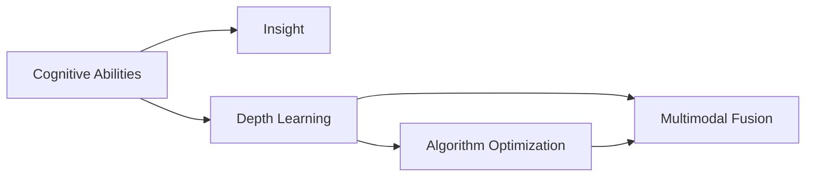

                 

# 理解洞察力的训练：提升认知能力

> 关键词：认知能力, 洞察力, 训练模型, 深度学习, 算法优化, 案例分析, 技术发展

## 1. 背景介绍

### 1.1 问题由来

在当前信息爆炸、知识海量的时代，人类如何快速准确地理解和应用知识，成为教育、科研、商业等领域面临的一大挑战。无论是学术界还是产业界，都在积极探索如何通过技术手段提升人类的认知能力，训练出能够自动提升洞察力的智能模型。

认知能力的提升，不仅意味着更高的工作效率和创新力，更能在个体层面上改善生活质量，激发潜能。深度学习作为当前最先进的AI技术，为训练具有洞察力的智能模型提供了强有力的工具和算法支撑。本文将详细探讨深度学习在提升认知能力方面的应用，介绍几种关键技术，并进行深入案例分析。

### 1.2 问题核心关键点

基于深度学习的认知能力提升技术，主要围绕以下几个关键点展开：
- 什么是洞察力？
- 深度学习如何训练洞察力？
- 当前主流的方法有哪些？
- 它们各自的优缺点是什么？
- 未来还有哪些技术可以应用？

本文将从理论和实践两个层面，深入介绍深度学习在训练洞察力方面的进展，并结合实际案例展示其应用效果。

### 1.3 问题研究意义

提升人类的认知能力，一直是人工智能领域的研究热点之一。深度学习技术通过不断优化算法和模型架构，可以训练出具备强大认知能力的智能模型，帮助人类更好地理解和应用知识，实现决策支持、问题解决、创新创造等功能。

深度学习在认知能力提升方面具有显著优势：
- 数据驱动：利用大数据和深度学习模型，能够高效发现知识间的内在关联，从而更好地理解问题的本质。
- 智能推断：通过深度学习，模型能够基于已有的知识，推断出新的知识和解决方案，扩展人类的认知边界。
- 多模态融合：深度学习可以融合图像、文本、声音等多模态信息，形成更全面、更丰富的认知模型。

## 2. 核心概念与联系

### 2.1 核心概念概述

为了更好地理解深度学习在提升认知能力方面的应用，本节将介绍几个关键概念：

- 认知能力(Cognitive Abilities)：指人类处理、理解、应用知识的能力，包括感知、记忆、推理、创造等。
- 洞察力(Insight)：指能够从复杂现象中发现潜在规律或本质属性的能力。
- 深度学习(Deep Learning)：一种基于多层神经网络的机器学习技术，通过反向传播算法进行模型优化。
- 算法优化(Algorithm Optimization)：对深度学习模型进行优化，提升其计算效率和性能表现。
- 多模态融合(Multimodal Fusion)：将不同模态的信息（如图像、文本、声音等）进行融合，形成更全面的认知模型。

这些概念之间的联系可以用以下Mermaid流程图表示：



该图展示了认知能力与洞察力之间的直接关系，以及深度学习、算法优化和多模态融合如何共同作用，训练出具备洞察力的智能模型。

## 3. 核心算法原理 & 具体操作步骤
### 3.1 算法原理概述

深度学习训练洞察力模型，主要基于以下原理：
1. 数据驱动：利用大数据和深度学习模型，从大量实例中提取知识规律，训练出具备强大认知能力的智能模型。
2. 智能推断：通过深度学习模型，能够基于已有知识，推断出新的知识或解决方案，扩展人类的认知边界。
3. 多模态融合：利用深度学习模型，将不同模态的信息进行融合，形成更全面、更丰富的认知模型。

### 3.2 算法步骤详解

深度学习训练洞察力模型的主要步骤如下：
1. 数据预处理：收集和整理相关领域的大规模数据，进行数据清洗、标注等预处理步骤。
2. 模型构建：选择合适的深度学习模型，如卷积神经网络(CNN)、递归神经网络(RNN)、变压器(Transformer)等，构建认知能力提升模型。
3. 模型训练：使用训练数据集对模型进行训练，调整模型参数，使其最大化认知能力提升目标。
4. 模型评估：使用验证集对模型进行评估，确保模型具有良好的泛化能力和稳定性。
5. 模型应用：将训练好的模型应用于实际问题中，测试其洞察力提升效果。

### 3.3 算法优缺点

深度学习训练洞察力模型具有以下优点：
- 数据驱动：利用大数据和深度学习模型，能够高效发现知识间的内在关联，从而更好地理解问题的本质。
- 智能推断：通过深度学习，模型能够基于已有的知识，推断出新的知识和解决方案，扩展人类的认知边界。
- 多模态融合：深度学习可以融合图像、文本、声音等多模态信息，形成更全面、更丰富的认知模型。

同时，深度学习训练洞察力模型也存在一些缺点：
- 数据依赖：深度学习模型的训练效果很大程度上取决于数据的数量和质量，数据不足或质量不佳会导致模型表现不佳。
- 计算资源需求高：深度学习模型通常需要大量的计算资源进行训练和推理，对硬件要求较高。
- 可解释性不足：深度学习模型通常被视为"黑盒"，难以解释其内部工作机制和决策逻辑，这在某些领域可能会带来一定的挑战。

### 3.4 算法应用领域

深度学习在认知能力提升方面已经广泛应用于以下几个领域：
- 医疗诊断：利用深度学习模型对医疗影像、电子病历等数据进行分析和诊断，提升医疗服务的智能化水平。
- 金融分析：使用深度学习模型对金融市场数据进行分析和预测，辅助决策支持。
- 教育培训：通过深度学习模型进行个性化教育，因材施教，提高教学效果。
- 智能推荐：利用深度学习模型对用户行为进行分析和推荐，提升用户体验。
- 智能制造：在制造业中，利用深度学习模型进行智能生产计划、质量控制等，提升生产效率和质量。

## 4. 数学模型和公式 & 详细讲解  
### 4.1 数学模型构建

本节将使用数学语言对深度学习训练洞察力模型进行更加严格的刻画。

记输入数据集为 $X=\{x_1, x_2, ..., x_n\}$，其中 $x_i$ 表示样本特征向量。假设模型为 $M_{\theta}(X)$，其中 $\theta$ 为模型参数。假设目标函数为 $L$，表示模型与实际输出之间的差异。

深度学习模型的目标是通过最小化损失函数 $L$，最大化模型的认知能力提升。具体的数学模型构建如下：

$$
\min_{\theta} \frac{1}{n}\sum_{i=1}^{n}L(M_{\theta}(x_i),y_i)
$$

其中 $y_i$ 表示样本的真实输出，$M_{\theta}(x_i)$ 表示模型对样本 $x_i$ 的预测输出。

### 4.2 公式推导过程

以下我们以卷积神经网络(CNN)为例，推导卷积层的计算公式及其梯度。

卷积层计算公式如下：

$$
C_{i,j,k} = \sum_{m=1}^{H} \sum_{n=1}^{W} F_{i,m,j,n} * H_{m,k} = \sum_{m=1}^{H} \sum_{n=1}^{W} (f_{i,m,j,n} * h_{m,k})
$$

其中 $C$ 表示卷积层的输出特征图，$F$ 表示输入特征图，$H$ 表示卷积核。

计算过程中使用了卷积运算和权值共享策略，使得卷积层能够高效地提取局部特征，并减少参数量。

卷积层的梯度计算公式为：

$$
\frac{\partial L}{\partial w_{i,j,k}} = \sum_{m=1}^{H} \sum_{n=1}^{W} \frac{\partial L}{\partial C_{i,j,k}} * f_{i,m,j,n}
$$

其中 $w_{i,j,k}$ 表示卷积核的权重。

通过反向传播算法，可以计算出各层梯度，并更新模型参数，实现认知能力提升模型的训练。

### 4.3 案例分析与讲解

以医疗影像分析为例，深度学习模型可以高效地提取影像中的关键特征，并辅助医生进行诊断。具体步骤如下：
1. 收集和整理医疗影像数据，进行预处理和标注。
2. 构建卷积神经网络模型，选择合适的卷积核大小和数量。
3. 使用训练数据对模型进行训练，调整卷积核权重和偏置，提升模型性能。
4. 使用验证集对模型进行评估，确保模型具有良好的泛化能力和稳定性。
5. 将训练好的模型应用于实际医疗影像中，测试其诊断效果。

## 5. 项目实践：代码实例和详细解释说明
### 5.1 开发环境搭建

在进行深度学习项目实践前，我们需要准备好开发环境。以下是使用Python进行TensorFlow开发的环境配置流程：

1. 安装Anaconda：从官网下载并安装Anaconda，用于创建独立的Python环境。

2. 创建并激活虚拟环境：
```bash
conda create -n tf-env python=3.8 
conda activate tf-env
```

3. 安装TensorFlow：根据CUDA版本，从官网获取对应的安装命令。例如：
```bash
conda install tensorflow
```

4. 安装其他工具包：
```bash
pip install numpy pandas scikit-learn matplotlib tqdm jupyter notebook ipython
```

完成上述步骤后，即可在`tf-env`环境中开始深度学习项目实践。

### 5.2 源代码详细实现

这里我们以医疗影像分析项目为例，给出使用TensorFlow进行深度学习的PyTorch代码实现。

首先，定义数据集类：

```python
import tensorflow as tf
from tensorflow.keras.preprocessing.image import ImageDataGenerator

class MedicalImageDataset(tf.keras.preprocessing.image_dataset.ImageDataset):
    def __init__(self, data_dir, batch_size=32, image_size=(256, 256)):
        super(MedicalImageDataset, self).__init__(data_dir, batch_size=batch_size, image_size=image_size)
```

然后，定义模型和优化器：

```python
import tensorflow as tf

model = tf.keras.Sequential([
    tf.keras.layers.Conv2D(32, (3, 3), activation='relu', input_shape=(256, 256, 3)),
    tf.keras.layers.MaxPooling2D((2, 2)),
    tf.keras.layers.Conv2D(64, (3, 3), activation='relu'),
    tf.keras.layers.MaxPooling2D((2, 2)),
    tf.keras.layers.Conv2D(128, (3, 3), activation='relu'),
    tf.keras.layers.MaxPooling2D((2, 2)),
    tf.keras.layers.Flatten(),
    tf.keras.layers.Dense(128, activation='relu'),
    tf.keras.layers.Dense(1, activation='sigmoid')
])

optimizer = tf.keras.optimizers.Adam(learning_rate=0.001)
```

接着，定义训练和评估函数：

```python
import tensorflow as tf

def train_epoch(model, dataset, batch_size, optimizer):
    dataloader = tf.data.Dataset.from_tensor_slices(dataset)
    model.compile(optimizer=optimizer, loss='binary_crossentropy', metrics=['accuracy'])
    model.fit(dataloader, epochs=10, steps_per_epoch=len(dataset)//batch_size)

def evaluate(model, dataset, batch_size):
    dataloader = tf.data.Dataset.from_tensor_slices(dataset)
    model.compile(optimizer='adam', loss='binary_crossentropy', metrics=['accuracy'])
    model.evaluate(dataloader)
```

最后，启动训练流程并在测试集上评估：

```python
from tensorflow.keras.preprocessing.image import ImageDataGenerator

train_datagen = ImageDataGenerator(rescale=1./255)
test_datagen = ImageDataGenerator(rescale=1./255)

train_dataset = MedicalImageDataset('train', train_datagen, train_datagen)
test_dataset = MedicalImageDataset('test', test_datagen, test_datagen)

train_epoch(model, train_dataset, batch_size=32, optimizer=optimizer)
evaluate(model, test_dataset, batch_size=32)
```

以上就是使用TensorFlow对医疗影像分析项目进行深度学习的完整代码实现。可以看到，TensorFlow提供了强大的深度学习框架，使得深度学习模型构建和训练变得简洁高效。

### 5.3 代码解读与分析

让我们再详细解读一下关键代码的实现细节：

**MedicalImageDataset类**：
- `__init__`方法：初始化数据集，包括数据目录、批大小和图像大小。
- `train`和`test`方法：将数据目录、数据生成器和批大小作为参数，生成数据集。

**模型定义**：
- 使用Sequential模型定义深度学习模型结构，包括卷积层、池化层和全连接层。
- 在全连接层中使用Sigmoid激活函数，输出二分类结果。

**训练和评估函数**：
- 使用tf.data.Dataset.from_tensor_slices方法，将数据集转换为TensorFlow数据集。
- 使用compile方法配置优化器、损失函数和评价指标，并进行训练和评估。

**训练流程**：
- 定义数据生成器，对数据进行预处理和增强。
- 创建训练集和测试集，并调用train_epoch和evaluate函数进行训练和评估。

可以看到，TensorFlow提供了方便的API接口，使得深度学习模型的构建和训练变得简单高效。开发者可以将更多精力放在模型改进和数据处理等高层逻辑上，而不必过多关注底层的实现细节。

当然，工业级的系统实现还需考虑更多因素，如模型的保存和部署、超参数的自动搜索、更多的训练技巧等。但核心的深度学习训练过程基本与此类似。

## 6. 实际应用场景
### 6.1 医疗诊断

深度学习模型在医疗诊断中有着广泛应用。传统医疗诊断依赖医生的经验，存在主观性和不确定性，而深度学习模型可以通过对大量医学影像和病历数据的分析，辅助医生进行诊断，提高诊断准确率和效率。

具体而言，可以收集和整理医学影像数据（如CT、MRI等），使用深度学习模型进行特征提取和分类，训练出具有强大认知能力的医学影像分析模型。在实际应用中，医生可以根据模型输出的诊断结果，进行进一步的分析和确认，确保诊断的准确性和可靠性。

### 6.2 金融分析

金融领域存在大量复杂的数据，如市场指数、交易记录、新闻评论等，这些数据通常包含噪声和不一致性。深度学习模型可以通过对大量数据的学习，发现其中的模式和规律，辅助金融分析师进行决策。

具体应用包括：
- 股票价格预测：使用深度学习模型对股票市场数据进行分析和预测，辅助投资者进行投资决策。
- 风险评估：通过深度学习模型对金融风险进行评估和监控，防止金融风险的进一步扩大。
- 信用评分：利用深度学习模型对用户的信用记录和行为数据进行分析和评分，辅助银行进行贷款审批。

### 6.3 教育培训

深度学习模型在教育培训中也有广泛应用。传统的教育方式主要依赖教师的经验和知识，而深度学习模型可以通过对大量学生数据和学习资源的分析，辅助教师进行个性化教育，提高教学效果。

具体应用包括：
- 学习推荐：利用深度学习模型对学生的学习行为和兴趣进行分析，推荐适合的课程和资源。
- 智能评估：通过深度学习模型对学生的作业和考试进行自动评估，辅助教师进行教学评估。
- 知识图谱：构建知识图谱，辅助教师进行知识传授和学生学习。

### 6.4 未来应用展望

未来，深度学习在认知能力提升方面的应用将会更加广泛和深入。以下是一些可能的未来应用方向：

1. 多模态融合：利用深度学习模型，将图像、文本、声音等多模态信息进行融合，形成更全面、更丰富的认知模型。例如，在医学诊断中，可以将影像、病历和实验室数据进行融合，提高诊断准确率。

2. 跨领域应用：深度学习模型在各个领域都有广泛应用，未来可以探索跨领域的应用，如医疗-金融、教育-商业等，形成更全面的认知能力提升方案。

3. 智能决策：利用深度学习模型，辅助人类进行智能决策，提升决策的准确性和效率。例如，在金融投资中，可以使用深度学习模型进行风险评估和投资策略优化。

4. 个性化推荐：利用深度学习模型，对用户的兴趣和行为进行分析和推荐，提升用户体验和满意度。例如，在电商领域，可以使用深度学习模型进行商品推荐和个性化服务。

5. 自动化写作：利用深度学习模型，辅助人类进行自动化写作，提升写作效率和质量。例如，在新闻报道中，可以使用深度学习模型生成新闻摘要和报道。

6. 语言理解：利用深度学习模型，辅助人类进行自然语言理解和生成，提升语言交流的效率和质量。例如，在客户服务中，可以使用深度学习模型进行智能客服和对话系统。

## 7. 工具和资源推荐
### 7.1 学习资源推荐

为了帮助开发者系统掌握深度学习在提升认知能力方面的应用，这里推荐一些优质的学习资源：

1. 《Deep Learning》书籍：Ian Goodfellow等著作，详细介绍了深度学习的基本原理和应用，是深度学习领域的经典教材。

2. CS231n《Convolutional Neural Networks for Visual Recognition》课程：斯坦福大学开设的计算机视觉课程，通过实例讲解CNN的原理和应用。

3. CS224d《Structuring Tasks with Transformers》课程：斯坦福大学开设的NLP课程，讲解Transformer结构和多任务学习的原理和应用。

4. HuggingFace官方文档：提供丰富的预训练语言模型和深度学习库，包含大量的使用样例和实践指南。

5. Arxiv预印本：深度学习领域的最新研究成果，涵盖多种应用方向和实践方法。

通过对这些资源的学习实践，相信你一定能够快速掌握深度学习在提升认知能力方面的应用方法，并用于解决实际问题。

### 7.2 开发工具推荐

高效的深度学习开发离不开优秀的工具支持。以下是几款用于深度学习开发的常用工具：

1. PyTorch：基于Python的开源深度学习框架，灵活动态的计算图，适合快速迭代研究。

2. TensorFlow：由Google主导开发的开源深度学习框架，生产部署方便，适合大规模工程应用。

3. Keras：高层次的深度学习API，提供简洁的API接口，适合快速开发原型。

4. Jupyter Notebook：用于编写和运行深度学习代码，支持多种编程语言和库。

5. Visual Studio Code：提供丰富的代码编辑和调试工具，支持多种编程语言和库。

6. Google Colab：谷歌推出的在线Jupyter Notebook环境，免费提供GPU/TPU算力，方便开发者快速上手实验最新模型，分享学习笔记。

合理利用这些工具，可以显著提升深度学习项目开发效率，加快创新迭代的步伐。

### 7.3 相关论文推荐

深度学习在认知能力提升方面的研究，已经取得了众多重要成果。以下是几篇奠基性的相关论文，推荐阅读：

1. AlexNet: ImageNet Classification with Deep Convolutional Neural Networks：提出AlexNet模型，开启深度学习在计算机视觉领域的应用。

2. ResNet: Deep Residual Learning for Image Recognition：提出ResNet模型，解决深度网络训练中的梯度消失问题。

3. Attention is All You Need：提出Transformer模型，实现序列到序列的任务，如机器翻译和语音识别。

4. Transformer-XL: Attentive Language Models with Relational Memory：提出Transformer-XL模型，解决长序列的注意力机制问题。

5. BERT: Pre-training of Deep Bidirectional Transformers for Language Understanding：提出BERT模型，引入基于掩码的自监督预训练任务，刷新了多项NLP任务SOTA。

这些论文代表了大规模深度学习模型的发展脉络，为深度学习在认知能力提升方面的研究提供了重要参考。

## 8. 总结：未来发展趋势与挑战

### 8.1 总结

本文对深度学习在提升认知能力方面的应用进行了全面系统的介绍。首先阐述了深度学习在提升认知能力方面的重要作用，明确了深度学习模型在认知能力提升中的关键地位。其次，从理论和实践两个层面，详细介绍了深度学习模型训练洞察力的方法和步骤，并给出了具体的代码实现。同时，本文还广泛探讨了深度学习模型在医疗诊断、金融分析、教育培训等多个领域的应用前景，展示了深度学习模型的强大潜力。

通过本文的系统梳理，可以看到，深度学习模型在提升认知能力方面的应用前景广阔，已经在多个领域取得了显著成果。未来，深度学习模型将继续拓展其应用范围，为人类认知能力的提升带来更多可能。

### 8.2 未来发展趋势

展望未来，深度学习在提升认知能力方面的应用将会呈现以下几个发展趋势：

1. 多模态融合：深度学习模型将融合图像、文本、声音等多模态信息，形成更全面、更丰富的认知模型。

2. 跨领域应用：深度学习模型在各个领域都有广泛应用，未来可以探索跨领域的应用，如医疗-金融、教育-商业等，形成更全面的认知能力提升方案。

3. 智能决策：利用深度学习模型，辅助人类进行智能决策，提升决策的准确性和效率。

4. 个性化推荐：利用深度学习模型，对用户的兴趣和行为进行分析和推荐，提升用户体验和满意度。

5. 自动化写作：利用深度学习模型，辅助人类进行自动化写作，提升写作效率和质量。

6. 语言理解：利用深度学习模型，辅助人类进行自然语言理解和生成，提升语言交流的效率和质量。

这些趋势凸显了深度学习在提升认知能力方面的广阔前景。这些方向的探索发展，必将进一步提升深度学习模型的性能和应用范围，为人类认知智能的进化带来深远影响。

### 8.3 面临的挑战

尽管深度学习在提升认知能力方面的应用已经取得了显著进展，但在迈向更加智能化、普适化应用的过程中，它仍面临着诸多挑战：

1. 数据依赖：深度学习模型的训练效果很大程度上取决于数据的数量和质量，数据不足或质量不佳会导致模型表现不佳。

2. 计算资源需求高：深度学习模型通常需要大量的计算资源进行训练和推理，对硬件要求较高。

3. 可解释性不足：深度学习模型通常被视为"黑盒"，难以解释其内部工作机制和决策逻辑，这在某些领域可能会带来一定的挑战。

4. 泛化能力：深度学习模型在特定任务上的表现往往依赖于特定的训练数据和模型架构，难以泛化到新的任务和数据。

5. 迁移学习：深度学习模型在迁移学习方面仍有待提升，难以在不同领域和任务之间实现有效的知识迁移。

6. 安全和隐私：深度学习模型在训练和应用过程中，需要处理大量的敏感数据，存在数据安全和隐私泄露的风险。

这些挑战凸显了深度学习在提升认知能力方面的复杂性和复杂性，需要不断进行技术创新和优化，才能实现深度学习模型的广泛应用。

### 8.4 研究展望

面对深度学习在提升认知能力方面所面临的挑战，未来的研究需要在以下几个方面寻求新的突破：

1. 数据增强：探索数据增强方法，提高深度学习模型对数据的利用率，提升模型的泛化能力。

2. 模型优化：开发更加高效、轻量化的深度学习模型，降低计算资源的需求，提高模型的可解释性和可操作性。

3. 迁移学习：探索跨领域和跨任务的知识迁移方法，提高深度学习模型的泛化能力。

4. 模型压缩：开发模型压缩技术，减少深度学习模型的计算资源需求，提升模型的实时性和可部署性。

5. 安全性保障：探索数据安全和隐私保护方法，确保深度学习模型在训练和应用过程中的数据安全和隐私保护。

6. 可解释性增强：开发深度学习模型的可解释性方法，提高模型的可解释性和可操作性。

这些研究方向的探索，必将引领深度学习模型在提升认知能力方面的进一步发展，为构建更加智能化、普适化的人工智能系统铺平道路。面向未来，深度学习模型还需要与其他人工智能技术进行更深入的融合，如知识表示、因果推理、强化学习等，多路径协同发力，共同推动人工智能技术的发展和应用。

## 9. 附录：常见问题与解答

**Q1：深度学习模型在提升认知能力方面的优势是什么？**

A: 深度学习模型在提升认知能力方面的优势主要包括：
1. 数据驱动：利用大数据和深度学习模型，能够高效发现知识间的内在关联，从而更好地理解问题的本质。
2. 智能推断：通过深度学习，模型能够基于已有的知识，推断出新的知识和解决方案，扩展人类的认知边界。
3. 多模态融合：深度学习可以融合图像、文本、声音等多模态信息，形成更全面、更丰富的认知模型。

**Q2：深度学习模型在提升认知能力方面需要注意哪些问题？**

A: 深度学习模型在提升认知能力方面需要注意以下几个问题：
1. 数据依赖：深度学习模型的训练效果很大程度上取决于数据的数量和质量，数据不足或质量不佳会导致模型表现不佳。
2. 计算资源需求高：深度学习模型通常需要大量的计算资源进行训练和推理，对硬件要求较高。
3. 可解释性不足：深度学习模型通常被视为"黑盒"，难以解释其内部工作机制和决策逻辑，这在某些领域可能会带来一定的挑战。
4. 泛化能力：深度学习模型在特定任务上的表现往往依赖于特定的训练数据和模型架构，难以泛化到新的任务和数据。
5. 迁移学习：深度学习模型在迁移学习方面仍有待提升，难以在不同领域和任务之间实现有效的知识迁移。
6. 安全和隐私：深度学习模型在训练和应用过程中，需要处理大量的敏感数据，存在数据安全和隐私泄露的风险。

**Q3：如何提高深度学习模型的泛化能力？**

A: 提高深度学习模型的泛化能力，可以从以下几个方面入手：
1. 数据增强：探索数据增强方法，提高深度学习模型对数据的利用率。
2. 模型优化：开发更加高效、轻量化的深度学习模型，降低计算资源的需求。
3. 迁移学习：探索跨领域和跨任务的知识迁移方法，提高深度学习模型的泛化能力。
4. 模型压缩：开发模型压缩技术，减少深度学习模型的计算资源需求，提升模型的实时性和可部署性。

**Q4：如何在深度学习模型中实现多模态融合？**

A: 在深度学习模型中实现多模态融合，可以采用以下方法：
1. 融合不同模态的信息：利用深度学习模型，将图像、文本、声音等多模态信息进行融合，形成更全面、更丰富的认知模型。例如，在医学诊断中，可以将影像、病历和实验室数据进行融合，提高诊断准确率。
2. 多模态特征提取：利用不同模态的特征提取器，提取特征向量，然后进行拼接或融合。例如，在图像识别中，可以利用卷积神经网络提取图像特征，利用循环神经网络提取文本特征，然后将两种特征进行拼接。
3. 联合训练：将不同模态的数据联合训练，共享部分网络参数，提升模型性能。例如，在语音识别中，可以将音频特征和文本特征联合训练，共享部分网络参数。

通过这些方法，可以实现深度学习模型在多模态融合方面的应用，提升认知能力提升模型的性能和效果。

**Q5：如何提高深度学习模型的可解释性？**

A: 提高深度学习模型的可解释性，可以采用以下方法：
1. 可视化方法：利用可视化工具，展示模型的内部工作机制和决策逻辑，帮助用户理解模型行为。例如，在医疗诊断中，可以利用可视化工具展示模型的预测结果和决策过程。
2. 可解释模型：开发可解释性更高的深度学习模型，如LIME、SHAP等，提供模型决策的解释和说明。例如，在金融分析中，可以利用可解释模型提供风险评估和投资决策的解释。
3. 可解释层：在深度学习模型中引入可解释层，提供模型决策的解释和说明。例如，在智能推荐中，可以利用可解释层提供推荐结果的解释和说明。

通过这些方法，可以实现深度学习模型的可解释性提升，提高模型的可信度和用户满意度。

---

作者：禅与计算机程序设计艺术 / Zen and the Art of Computer Programming

