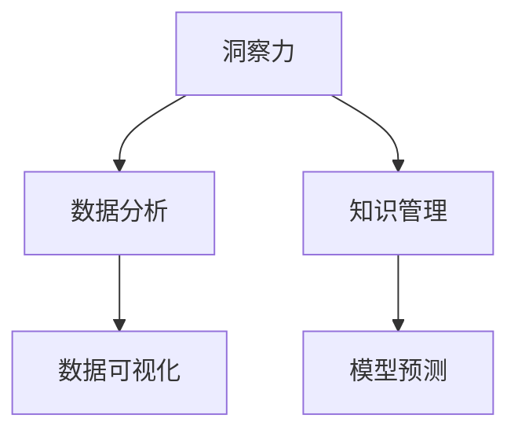

                 

# 理解洞察力的重要性：在复杂世界中的价值

## 1. 背景介绍

### 1.1 问题由来

在快速变化的时代，我们面临的信息爆炸和认知过载，如何从海量数据中提取有价值的洞察力，成为摆在每一个决策者面前的重大挑战。洞察力在商业决策、医疗诊断、社会治理等众多领域都具有不可替代的价值。然而，随着数据量的增长和计算手段的提升，我们对洞察力的理解仍然停留在浅层，缺乏系统化的理论和实践方法。本文旨在探讨洞察力的重要性、如何获取洞察力，以及其在复杂世界中的价值。

### 1.2 问题核心关键点

洞察力在复杂世界中的价值主要体现在以下几个方面：

- **决策支持**：通过数据分析和深入挖掘，洞察力能够提供高质量的决策依据，降低不确定性，提高决策的科学性和准确性。
- **问题诊断**：在复杂系统（如医疗、金融、工业等）中，洞察力能够帮助识别系统中的关键问题和瓶颈，从而优化系统设计和运营。
- **创新驱动**：洞察力能够揭示问题的根本原因，促进产品和服务的创新，驱动企业竞争力的提升。
- **用户理解**：洞察力能够深入理解用户行为和需求，提供更加个性化的服务，增强用户满意度。

## 2. 核心概念与联系

### 2.1 核心概念概述

为了更好地理解洞察力的重要性，本文将介绍几个核心概念：

- **洞察力**：通过数据分析和知识挖掘，揭示数据背后的深层结构和模式，从而发现潜在问题和机会。
- **数据分析**：使用统计学、机器学习等方法，从数据中提取有价值的信息和知识。
- **知识管理**：通过结构化存储和管理知识，促进知识的共享和应用。
- **数据可视化**：利用图表、图形等工具，直观展示数据和知识，便于理解和分析。
- **模型预测**：建立数学或统计模型，对未来趋势进行预测和推断。

这些概念之间的逻辑关系可以通过以下Mermaid流程图来展示：



这个流程图展示了一些关键概念之间的逻辑关系：

1. 洞察力通过数据分析获取，是分析的最终目标。
2. 知识管理是数据分析和模型预测的中间环节，是知识的存储和管理。
3. 数据可视化是洞察力的展示工具，帮助理解分析结果。
4. 模型预测是基于数据分析和知识管理的结果，对未来进行推断。

## 3. 核心算法原理 & 具体操作步骤
### 3.1 算法原理概述

洞察力的获取是一个数据驱动的复杂过程，通常涉及以下几个步骤：

1. **数据采集**：从不同来源收集数据，确保数据的多样性和代表性。
2. **数据清洗**：对数据进行预处理，去除噪音和异常值，确保数据质量。
3. **数据分析**：使用统计学、机器学习等方法，从数据中提取有价值的信息和知识。
4. **知识管理**：将分析结果结构化存储和管理，便于后续应用和推广。
5. **数据可视化**：利用图表、图形等工具，直观展示分析结果，便于理解和分享。
6. **模型预测**：建立数学或统计模型，对未来趋势进行预测和推断。

### 3.2 算法步骤详解

下面详细介绍洞察力的获取过程：

**Step 1: 数据采集**

- 确定数据采集的目标和范围，选择适合的数据源。
- 使用爬虫、API接口、数据库等方法，自动采集所需数据。
- 确保数据的多样性和代表性，涵盖不同类型和来源的数据。

**Step 2: 数据清洗**

- 检查数据的完整性和一致性，确保数据的准确性。
- 去除噪音和异常值，避免对分析结果产生负面影响。
- 使用数据清洗工具（如Pandas、OpenRefine）进行自动化处理。

**Step 3: 数据分析**

- 选择适当的分析方法，如统计学、机器学习等。
- 使用Python、R等工具进行数据分析，提取有价值的信息和知识。
- 对分析结果进行初步验证，确保结果的可靠性和有效性。

**Step 4: 知识管理**

- 将分析结果结构化存储，建立知识库或数据仓库。
- 使用数据库管理系统（如MySQL、PostgreSQL）进行数据存储和管理。
- 确保知识库的易用性和可扩展性，便于后续应用和推广。

**Step 5: 数据可视化**

- 选择合适的数据可视化工具，如Tableau、Power BI、Matplotlib等。
- 设计直观的图表和图形，展示分析结果和洞察力。
- 提供交互式界面，便于用户自定义和探索数据。

**Step 6: 模型预测**

- 建立数学或统计模型，对未来趋势进行预测和推断。
- 使用Python、R等工具进行模型训练和预测。
- 对模型进行评估和验证，确保预测结果的准确性和可靠性。

### 3.3 算法优缺点

洞察力的获取过程具有以下优点：

- **效率高**：通过自动化工具和算法，可以显著提高数据分析和处理的效率。
- **可靠性高**：使用科学的方法和工具，可以确保分析结果的可靠性和准确性。
- **可重复性强**：数据和分析方法标准化，便于复用和推广。
- **可视化效果好**：利用数据可视化工具，可以直观展示分析结果，便于理解和分享。

同时，该过程也存在一定的局限性：

- **数据质量依赖**：数据分析结果的可靠性和有效性高度依赖于数据质量，不完整、不准确的数据可能导致误导性结论。
- **模型复杂度高**：建立高质量的模型需要复杂的算法和大量数据，可能面临计算资源和算法的挑战。
- **技术门槛高**：需要掌握一定的数据科学和技术工具，可能对非专业人员构成一定的门槛。
- **洞察力滞后性**：洞察力通常基于历史数据，难以应对快速变化的市场环境。

尽管存在这些局限性，但就目前而言，洞察力的获取过程仍是大数据和人工智能应用的重要范式。未来相关研究的重点在于如何进一步降低技术门槛，提高模型的自适应性和实时性，同时兼顾可解释性和伦理安全性等因素。

### 3.4 算法应用领域

洞察力的获取方法在诸多领域都有广泛应用，例如：

- **商业智能**：通过对销售数据、市场趋势等进行分析，帮助企业制定战略和优化运营。
- **金融风险管理**：利用数据分析和模型预测，评估金融风险和制定风险控制策略。
- **医疗诊断**：通过患者数据和医学文献的挖掘，提高疾病诊断的准确性和效率。
- **城市规划**：分析交通、环境等数据，优化城市规划和公共服务。
- **环境保护**：监测环境数据，评估环境变化趋势，制定环保政策。

除了上述这些经典领域外，洞察力的方法也在不断拓展到更多场景中，如智能制造、智慧农业、智慧物流等，为各行各业提供更精准的决策支持和数据驱动的创新。

## 4. 数学模型和公式 & 详细讲解 & 举例说明
### 4.1 数学模型构建

本节将使用数学语言对洞察力的获取过程进行更加严格的刻画。

记待分析的数据集为 $D=\{(x_i,y_i)\}_{i=1}^N$，其中 $x_i$ 为特征向量，$y_i$ 为标签。设数据清洗后的数据集为 $\bar{D}=\{(\bar{x}_i,y_i)\}_{i=1}^N$。

定义洞察力 $\mathcal{I}(\bar{D})$ 为对数据 $\bar{D}$ 的深度分析和挖掘结果。

### 4.2 公式推导过程

以下我们以回归分析为例，推导最小二乘法回归模型的公式。

假设回归函数为 $y=f(x;\beta)=\beta_0+\beta_1x_1+\beta_2x_2+\cdots+\beta_px_p$，其中 $\beta=(\beta_0,\beta_1,\cdots,\beta_p)$ 为模型参数。

回归模型的残差平方和为 $SSR=\sum_{i=1}^N (y_i-f(x_i;\beta))^2$。

则最小二乘法回归的目标是最小化残差平方和，即：

$$
\mathop{\min}_{\beta} \sum_{i=1}^N (y_i-f(x_i;\beta))^2
$$

最小二乘法回归的解为：

$$
\hat{\beta}=(X'X)^{-1}X'Y
$$

其中 $X=\begin{bmatrix}1 & x_{11} & x_{12} & \cdots & x_{1p}\\1 & x_{21} & x_{22} & \cdots & x_{2p}\\\vdots & \vdots & \vdots & \ddots & \vdots\\1 & x_{N1} & x_{N2} & \cdots & x_{Np}\end{bmatrix}$，$Y=\begin{bmatrix}y_1\\y_2\\\vdots\\y_N\end{bmatrix}$。

### 4.3 案例分析与讲解

以下我们以预测销售量的回归分析为例，详细讲解最小二乘法回归模型的构建和应用：

**数据集准备**：收集历史销售数据，包括月份、季节、促销活动等信息，构建特征向量 $X$ 和标签向量 $Y$。

**模型构建**：选择最小二乘法回归模型，建立回归函数 $y=\beta_0+\beta_1x_1+\beta_2x_2+\cdots+\beta_px_p$。

**参数求解**：使用最小二乘法求解模型参数 $\hat{\beta}$，计算回归函数 $f(x;\hat{\beta})$。

**模型验证**：在测试数据集上验证模型预测效果，计算预测误差。

**结果展示**：利用数据可视化工具，展示回归结果和预测曲线。

## 5. 项目实践：代码实例和详细解释说明
### 5.1 开发环境搭建

在进行洞察力获取实践前，我们需要准备好开发环境。以下是使用Python进行Pandas和Scikit-learn开发的环境配置流程：

1. 安装Anaconda：从官网下载并安装Anaconda，用于创建独立的Python环境。

2. 创建并激活虚拟环境：
```bash
conda create -n insight-env python=3.8 
conda activate insight-env
```

3. 安装Pandas和Scikit-learn：
```bash
pip install pandas scikit-learn
```

4. 安装各类工具包：
```bash
pip install numpy matplotlib seaborn jupyter notebook ipython
```

完成上述步骤后，即可在`insight-env`环境中开始洞察力获取实践。

### 5.2 源代码详细实现

下面我们以销售量预测为例，给出使用Pandas和Scikit-learn进行回归分析的Python代码实现。

首先，准备销售数据集：

```python
import pandas as pd

# 读取销售数据集
sales_data = pd.read_csv('sales_data.csv')

# 查看数据集信息
print(sales_data.info())
```

然后，进行数据预处理：

```python
# 处理缺失值
sales_data = sales_data.dropna()

# 构建特征向量
X = sales_data[['month', 'season', 'promotion']]
Y = sales_data['sales']
```

接着，进行模型训练和评估：

```python
from sklearn.linear_model import LinearRegression

# 构建线性回归模型
model = LinearRegression()

# 训练模型
model.fit(X, Y)

# 预测销售量
predictions = model.predict(X)

# 评估模型性能
from sklearn.metrics import mean_squared_error
mse = mean_squared_error(Y, predictions)
print(f'Mean Squared Error: {mse}')
```

最后，可视化回归结果：

```python
import matplotlib.pyplot as plt

# 可视化回归曲线
plt.scatter(X['month'], Y, label='Actual Sales')
plt.plot(X['month'], predictions, color='red', label='Predicted Sales')
plt.xlabel('Month')
plt.ylabel('Sales')
plt.legend()
plt.show()
```

以上就是使用Pandas和Scikit-learn进行回归分析的完整代码实现。可以看到，使用Python和Scikit-learn库，可以简洁高效地进行数据分析和模型构建。

### 5.3 代码解读与分析

让我们再详细解读一下关键代码的实现细节：

**数据预处理**：
- `sales_data.info()`方法：查看数据集的基本信息，如列名、数据类型、非空值数量等。
- `sales_data.dropna()`方法：删除缺失值，避免对分析结果产生负面影响。

**特征构建**：
- `X = sales_data[['month', 'season', 'promotion']]`：选择销售数据中的月份、季节和促销活动作为特征向量。
- `Y = sales_data['sales']`：选择销售量作为标签向量。

**模型训练**：
- `LinearRegression()`：创建线性回归模型对象。
- `model.fit(X, Y)`：使用训练数据拟合模型参数。

**模型评估**：
- `mean_squared_error()`：计算预测值与真实值之间的均方误差。

**结果展示**：
- `plt.scatter()`：绘制实际销售量和预测销售量的散点图。
- `plt.plot()`：绘制预测销售量的直线。

可以看到，Pandas和Scikit-learn库提供了强大的数据分析和建模工具，使得洞察力获取过程变得简洁高效。开发者可以将更多精力放在数据处理、模型改进等高层逻辑上，而不必过多关注底层的实现细节。

当然，工业级的系统实现还需考虑更多因素，如模型的保存和部署、超参数的自动搜索、更灵活的任务适配层等。但核心的洞察力获取过程基本与此类似。

## 6. 实际应用场景
### 6.1 智能制造

在智能制造领域，洞察力能够帮助企业优化生产流程、提高产品质量和生产效率。例如，通过对生产数据和设备运行状态进行分析，可以预测设备故障，提前进行维护和保养，避免生产中断。同时，通过分析生产线的能源消耗数据，可以优化生产线的能源利用率，降低能耗成本。

在技术实现上，可以收集生产过程中的各种传感器数据和记录，将数据输入洞察力分析系统。系统自动进行数据清洗、特征提取和模型训练，提取关键洞察力，并给出改进建议和预测结果。工厂管理人员可以依据洞察力结果，进行针对性的生产调整和设备维护，从而提升生产效率和产品质量。

### 6.2 智慧农业

智慧农业中，洞察力能够帮助农民优化种植方案、提高农业产出和资源利用效率。例如，通过对土壤、气象、作物生长数据进行分析，可以预测天气变化和作物生长趋势，优化种植计划。同时，通过分析灌溉、施肥等数据，可以精确控制农业资源的使用，减少浪费，提高资源利用率。

在技术实现上，可以收集农业生产中的各种传感器数据和记录，构建数据分析模型。模型通过分析数据，生成洞察力报告，帮助农民进行生产决策。农民可以依据洞察力报告，进行针对性的种植和灌溉调整，从而提高农业产出和资源利用效率。

### 6.3 金融风控

在金融风控领域，洞察力能够帮助金融机构识别风险点、制定风险控制策略。例如，通过对客户历史交易数据进行分析，可以识别潜在的信用风险和高风险客户。同时，通过分析市场动态和宏观经济数据，可以预测金融市场趋势，优化投资策略。

在技术实现上，可以收集客户交易数据和市场动态数据，构建风险评估模型。模型通过分析数据，生成洞察力报告，帮助金融机构进行风险评估和策略优化。金融机构可以依据洞察力报告，进行针对性的风险控制和投资调整，从而降低金融风险，提高盈利能力。

### 6.4 未来应用展望

随着数据量的增长和计算手段的提升，洞察力将在更多领域得到应用，为各行各业带来变革性影响。

在智慧城市治理中，洞察力能够帮助城市管理者优化交通、环保、能源等城市运营，提高城市治理的智能化水平。在医疗领域，洞察力能够帮助医生进行疾病诊断和治疗方案优化，提高医疗服务的质量和效率。

在零售领域，洞察力能够帮助零售商优化商品库存和销售策略，提高客户满意度和盈利能力。在媒体行业，洞察力能够帮助媒体机构分析用户行为和内容偏好，制定精准的广告和内容推荐策略。

## 7. 工具和资源推荐
### 7.1 学习资源推荐

为了帮助开发者系统掌握洞察力的理论基础和实践方法，这里推荐一些优质的学习资源：

1. 《数据科学导论》：清华大学出版社的入门级数据科学教材，涵盖数据分析和建模的基本概念和方法。

2. 《Python数据分析》：通过Python实现数据分析和可视化，介绍常用的数据分析工具和方法。

3. 《统计学习方法》：李航所著的经典统计学习教材，涵盖机器学习的基础算法和模型。

4. 《数据科学实战》：通过真实案例，介绍数据科学的整个流程，从数据采集到模型评估。

5. 《深度学习》：Ian Goodfellow、Yoshua Bengio和Aaron Courville所著的深度学习教材，涵盖深度学习的基础和前沿技术。

通过对这些资源的学习实践，相信你一定能够快速掌握洞察力的精髓，并用于解决实际的业务问题。
###  7.2 开发工具推荐

高效的开发离不开优秀的工具支持。以下是几款用于洞察力获取开发的常用工具：

1. Python：开源的高级编程语言，具有强大的数据处理和分析能力，是数据分析和建模的主流语言。

2. R：开源的统计分析和数据可视化工具，提供丰富的统计分析和建模库，适合进行数据科学和统计分析。

3. SQL：结构化查询语言，用于管理和查询数据库中的数据，适合进行数据清洗和预处理。

4. Excel：常用的电子表格软件，具有强大的数据处理和可视化功能，适合进行初步的数据分析和报告制作。

5. Tableau：流行的数据可视化工具，提供直观的图表和图形，适合进行数据展示和报告制作。

6. Power BI：微软推出的商业智能工具，提供强大的数据可视化和分析功能，适合进行数据探索和决策支持。

合理利用这些工具，可以显著提升洞察力获取任务的开发效率，加快创新迭代的步伐。

### 7.3 相关论文推荐

洞察力获取方法的发展源于学界的持续研究。以下是几篇奠基性的相关论文，推荐阅读：

1. On the Shoulder of Giants：Nate Silver的畅销书，介绍数据分析和预测的实践经验，深入浅出地讲述了洞察力的获取过程。

2. The Elements of Statistical Learning：Tibshirani、Hastie和Friedman所著的经典统计学习教材，涵盖统计学习的基本算法和方法。

3. Understanding Machine Learning：Shai Shalev-Shwartz和Shai Ben-David所著的机器学习教材，介绍机器学习的基本概念和算法。

4. Predictive Analytics：Eric Siegel所著的预测分析教材，涵盖预测建模和洞察力获取的基本方法和技术。

这些论文代表了大数据和人工智能在洞察力获取领域的发展脉络。通过学习这些前沿成果，可以帮助研究者把握学科前进方向，激发更多的创新灵感。

## 8. 总结：未来发展趋势与挑战

### 8.1 总结

本文对洞察力的重要性、获取方法和应用领域进行了全面系统的介绍。首先阐述了洞察力在复杂世界中的价值，明确了洞察力在决策支持、问题诊断、创新驱动、用户理解等方面的独特价值。其次，从原理到实践，详细讲解了洞察力的获取过程，包括数据采集、数据清洗、数据分析、知识管理、数据可视化、模型预测等关键步骤，给出了洞察力获取的完整代码实例。同时，本文还广泛探讨了洞察力在智能制造、智慧农业、金融风控等多个领域的应用前景，展示了洞察力获取范式的广阔前景。最后，本文精选了洞察力获取技术的各类学习资源，力求为读者提供全方位的技术指引。

通过本文的系统梳理，可以看到，洞察力获取方法正在成为大数据和人工智能应用的重要范式，极大地拓展了数据驱动决策和智能分析的边界，为各行业带来了深刻的变革。未来，伴随数据量的增长和计算手段的提升，洞察力获取方法将进一步发展，成为各行业决策支持和智能化的重要支撑。

### 8.2 未来发展趋势

展望未来，洞察力获取技术将呈现以下几个发展趋势：

1. **自动化程度提高**：随着自动化工具和算法的发展，洞察力获取过程将更加自动化和智能化，需要更少的专业知识和操作。
2. **实时性增强**：通过引入流数据处理和实时分析技术，洞察力获取系统将能够实时监测和响应变化，提供更加及时的决策支持。
3. **多源数据融合**：结合多种数据源（如传感器数据、社交媒体数据等）进行综合分析，提升洞察力获取的全面性和准确性。
4. **跨领域应用广泛**：洞察力获取方法将进一步拓展到更多领域，如医疗、制造、零售、金融等，为各行各业提供更精准的决策支持和智能分析。
5. **可解释性和透明性增强**：提高洞察力获取过程的可解释性和透明性，使用户能够理解和信任分析结果。

以上趋势凸显了洞察力获取技术的广阔前景。这些方向的探索发展，必将进一步提升洞察力获取方法的效率和效果，为各行业带来更深远的影响。

### 8.3 面临的挑战

尽管洞察力获取技术已经取得了瞩目成就，但在迈向更加智能化、普适化应用的过程中，它仍面临着诸多挑战：

1. **数据质量和完整性**：洞察力获取的可靠性高度依赖于数据的质量和完整性，不完整、不准确的数据可能导致误导性结论。
2. **计算资源和算法复杂度**：建立高质量的洞察力模型需要复杂的算法和大量数据，可能面临计算资源和算法复杂度的挑战。
3. **技术门槛和用户体验**：洞察力获取方法需要掌握一定的数据科学和技术工具，可能对非专业人员构成一定的门槛。
4. **洞察力滞后性**：洞察力通常基于历史数据，难以应对快速变化的市场环境。
5. **伦理和安全问题**：洞察力获取过程中可能涉及用户隐私和数据安全，需要加强保护措施。

尽管存在这些挑战，但就目前而言，洞察力获取方法仍是大数据和人工智能应用的重要范式。未来相关研究的重点在于如何进一步降低技术门槛，提高模型的自适应性和实时性，同时兼顾可解释性和伦理安全性等因素。

### 8.4 研究展望

面对洞察力获取面临的诸多挑战，未来的研究需要在以下几个方面寻求新的突破：

1. **无监督学习和半监督学习**：探索无监督和半监督学习范式，利用自监督学习、主动学习等方法，提高数据获取和处理的效率。
2. **跨模态分析**：结合视觉、语音、文本等多种模态数据，提升洞察力获取的全面性和准确性。
3. **自适应模型**：开发能够自动适应新数据和环境的自适应模型，提高洞察力获取的灵活性和实时性。
4. **多目标优化**：结合多种目标（如利润、质量、效率等）进行综合优化，提供更全面的决策支持。
5. **可解释模型**：建立可解释的洞察力模型，提高分析结果的可信度和透明性。

这些研究方向的探索，必将引领洞察力获取方法迈向更高的台阶，为各行业提供更加全面、精准、及时的决策支持和智能分析。总之，洞察力获取方法需要在数据质量、计算资源、技术门槛、实时性和可解释性等方面不断优化，方能满足各行业的实际需求，真正实现其价值。

## 9. 附录：常见问题与解答

**Q1：如何提高数据质量和完整性？**

A: 数据质量和完整性是洞察力获取的基础，可以通过以下方法进行提升：
1. 数据预处理：使用数据清洗工具（如Pandas）去除噪音和异常值。
2. 数据验证：建立数据验证机制，确保数据的准确性和一致性。
3. 数据采集：使用多种数据源（如传感器、API接口等），确保数据的多样性和代表性。
4. 数据标注：对数据进行标注和验证，确保标注数据的准确性和一致性。

**Q2：如何选择适合的洞察力分析方法？**

A: 选择适合的洞察力分析方法需要考虑数据类型、问题类型和应用场景。通常包括以下步骤：
1. 问题定义：明确问题类型（如分类、回归、聚类等）和分析目标。
2. 数据探索：对数据进行初步探索，了解数据的分布和特征。
3. 方法选择：根据问题类型和数据特点，选择合适的分析方法（如回归、分类、聚类等）。
4. 模型训练：使用所选方法进行模型训练，获取洞察力结果。
5. 结果评估：对模型进行评估和验证，确保结果的可靠性和准确性。

**Q3：如何提高洞察力获取的实时性？**

A: 提高洞察力获取的实时性需要引入流数据处理和实时分析技术，通常包括以下方法：
1. 数据流处理：使用流数据处理框架（如Apache Kafka、Apache Flink）进行实时数据处理。
2. 实时分析：使用实时分析工具（如Apache Storm、Apache Spark Streaming）进行实时分析。
3. 分布式计算：使用分布式计算框架（如Apache Hadoop、Apache Spark）进行大规模数据处理。
4. 可扩展架构：设计可扩展的架构，支持大规模数据流处理和实时分析。

**Q4：如何提高洞察力获取的可解释性？**

A: 提高洞察力获取的可解释性需要建立可解释的模型，通常包括以下方法：
1. 模型选择：选择可解释的模型（如线性回归、决策树、KNN等）进行分析和预测。
2. 特征分析：对模型特征进行分析和解释，理解模型的决策过程。
3. 可视化工具：使用可视化工具（如Tableau、Power BI）展示分析结果和模型特征。
4. 用户参与：邀请用户参与分析和验证，提升用户对分析结果的理解和信任。

**Q5：如何保护数据隐私和安全？**

A: 保护数据隐私和安全是洞察力获取中的重要问题，通常包括以下方法：
1. 数据脱敏：对敏感数据进行脱敏处理，保护用户隐私。
2. 访问控制：建立访问控制机制，确保只有授权人员可以访问敏感数据。
3. 数据加密：对数据进行加密处理，防止数据泄露。
4. 安全审计：建立安全审计机制，监控和记录数据访问和使用情况。

这些方法可以确保洞察力获取过程的数据隐私和安全，保护用户数据和隐私。

---

作者：禅与计算机程序设计艺术 / Zen and the Art of Computer Programming

