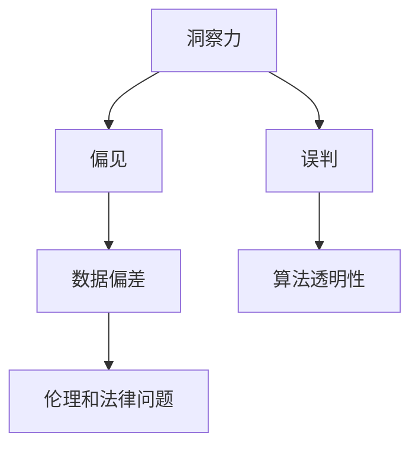

                 

# 理解洞察力的陷阱：避免偏见和误判

> 关键词：洞察力,偏见,误判,决策,认知偏误,人工智能,模型评估,数据偏差,算法透明

## 1. 背景介绍

### 1.1 问题由来

在人工智能(AI)和机器学习(ML)领域，洞察力(intuition)一直是人类与机器之间最大的差异点之一。人类能够凭借直觉和经验做出决策，而机器则依赖数据和算法。这种差异使得洞察力在AI领域中常常被看作一种“神秘”的能力，难以被机器所理解和模拟。

然而，随着AI技术的不断进步，机器正在逐步学习人类的决策模式，甚至在某些情况下，表现得优于人类。但与此同时，机器的洞察力也可能带来新的问题：偏见和误判。机器的学习过程可能会受到数据偏差的影响，导致其做出的决策存在偏见和误判。这些问题不仅会影响AI系统的可靠性，还可能对社会产生深远的负面影响。

### 1.2 问题核心关键点

当前AI系统中的洞察力问题主要集中在以下几个方面：

- **数据偏差**：AI系统使用的训练数据可能存在偏见，导致模型在学习过程中也继承了这些偏见。
- **算法透明性**：许多AI模型，尤其是深度学习模型，缺乏透明的决策过程，难以解释其内部的决策逻辑。
- **误判风险**：由于模型的复杂性和高度非线性特征，AI系统可能会出现误判，特别是在高风险领域。
- **伦理和法律问题**：AI系统的偏见和误判可能带来严重的伦理和法律问题，影响社会公正和公平。

这些问题不仅需要技术上的解决方案，还需要伦理和法律上的关注和规范。本文将从算法原理、操作步骤、数学模型、项目实践、应用场景、工具资源等多个角度，探讨如何理解和避免AI系统中的洞察力陷阱，确保其决策过程更加可靠、公正和透明。

## 2. 核心概念与联系

### 2.1 核心概念概述

为了更好地理解AI系统中的洞察力陷阱，本节将介绍几个关键概念及其相互联系：

- **洞察力(intuition)**：人类根据经验、直觉和知识做出决策的能力。
- **偏见(bias)**：数据或算法中的系统性偏差，导致结果不公平或错误。
- **误判(judgment error)**：由于各种原因，模型做出的错误决策。
- **数据偏差(data bias)**：训练数据中的偏见导致模型学习到这些偏见。
- **算法透明性(algorithm transparency)**：模型的决策过程可解释性。
- **伦理和法律问题(ethical and legal issues)**：AI系统的偏见和误判可能带来的社会问题。

这些概念之间的关系可以通过以下Mermaid流程图来展示：



这个流程图展示了几大核心概念及其之间的关系：

1. 洞察力通过数据和算法转化为AI系统的决策过程。
2. 数据偏差和算法透明性是影响AI系统决策公正性的关键因素。
3. 误判和伦理法律问题是AI系统决策错误可能带来的社会后果。

## 3. 核心算法原理 & 具体操作步骤

### 3.1 算法原理概述

避免AI系统中的洞察力陷阱，需要从数据、算法和伦理三个层面进行综合考量。以下是具体的操作原则：

- **数据筛选与清洗**：确保训练数据的多样性和代表性，避免数据偏差。
- **算法透明性与解释性**：采用可解释的模型和透明的决策过程，确保AI系统的透明性和公正性。
- **伦理与法律框架**：在模型设计和部署过程中，考虑伦理和法律的约束，避免对社会造成负面影响。

### 3.2 算法步骤详解

基于上述原则，以下是避免AI系统洞察力陷阱的具体操作步骤：

**Step 1: 数据筛选与清洗**

1. **数据多样性**：确保训练数据涵盖不同领域、不同种族、不同性别的样本，避免数据偏差。
2. **数据清洗**：处理缺失值、异常值等数据质量问题，确保数据的准确性和一致性。
3. **数据增强**：通过数据增强技术，如旋转、缩放、翻转等，增加数据样本的多样性。

**Step 2: 算法透明性与解释性**

1. **可解释性模型**：选择如线性回归、决策树等可解释性强的模型，避免使用黑箱模型。
2. **模型可视化**：使用工具如t-SNE、SHAP等，可视化模型的决策边界和特征重要性。
3. **透明度设计**：在模型设计和部署过程中，考虑如何提高模型的透明度，使其决策过程可解释。

**Step 3: 伦理与法律框架**

1. **伦理审查**：在模型设计和部署前，进行伦理审查，确保模型不会对特定群体产生歧视。
2. **法律合规性**：遵守相关法律法规，如数据隐私保护法、公平性法规等，确保模型的合法性。
3. **社会影响评估**：评估模型可能带来的社会影响，避免对社会造成负面影响。

### 3.3 算法优缺点

避免AI系统洞察力陷阱的算法方法有以下优点：

- **提升决策公正性**：通过数据筛选和算法透明性，提升模型的决策公正性和透明性，减少偏见和误判。
- **提高社会接受度**：增强模型的可解释性和伦理性，提高社会对AI系统的接受度和信任度。
- **降低法律风险**：遵守法律和伦理规范，降低AI系统的法律风险和伦理风险。

但这些方法也存在一些局限性：

- **数据成本高**：数据筛选和清洗需要大量时间和资源，特别是在数据稀缺的情况下。
- **模型复杂性**：可解释性模型可能牺牲部分模型精度，特别是在复杂数据集上。
- **伦理规范复杂**：不同国家和地区对AI系统的伦理和法律要求不同，可能难以统一标准。

### 3.4 算法应用领域

避免AI系统洞察力陷阱的方法广泛应用于各个领域：

- **金融**：在信用评分、反欺诈等领域，确保模型的公平性和透明性，避免对特定群体产生偏见。
- **医疗**：在疾病诊断、治疗方案推荐等领域，确保模型的伦理性，避免对特定疾病或人群造成歧视。
- **司法**：在案件判决、法律顾问等领域，确保模型的合法性，避免对特定案件或群体产生偏见。
- **教育**：在个性化学习、成绩评估等领域，确保模型的公正性，避免对特定学生或群体产生偏见。

## 4. 数学模型和公式 & 详细讲解 & 举例说明

### 4.1 数学模型构建

为了避免AI系统中的洞察力陷阱，我们需要建立一套数学模型来描述和评估模型的公平性、透明性和合法性。以下是一些基本的数学模型和公式：

- **公平性(fairness)**：公平性是衡量模型决策是否对不同群体产生偏见的关键指标。常用的公平性度量包括均等误差(Equalized Error Rate, EER)、统计均等误差(Statistical Parity, SP)等。
- **可解释性(explainability)**：可解释性模型的目标是提高模型的透明度，使其决策过程可解释。常用的可解释性方法包括LIME、SHAP、部分依赖图(Partial Dependence Plot)等。
- **合法性(legal compliance)**：合法性模型确保模型的决策符合相关法律法规。常用的合法性度量包括隐私保护(如差分隐私)、合规性检查等。

### 4.2 公式推导过程

以下是一些基本公式的推导：

1. **均等误差(Equalized Error Rate, EER)**：
   $$
   \text{EER} = \frac{1}{2}(\text{FP} + \text{FN})
   $$
   其中，$\text{FP}$为假阳性错误，$\text{FN}$为假阴性错误。

2. **统计均等误差(Statistical Parity, SP)**：
   $$
   \text{SP} = \frac{1}{n} \sum_{i=1}^n \frac{\text{TP}_i}{\text{FP}_i}
   $$
   其中，$\text{TP}$为真阳性，$\text{FP}$为假阳性。

3. **差分隐私(differential privacy)**：
   $$
   \text{DP} = \epsilon - \ln \left( \frac{1}{\delta} \sum_{i=1}^n e^{\frac{-\epsilon}{\text{DP}}}
   $$
   其中，$\epsilon$为隐私预算，$\delta$为隐私失败概率。

### 4.3 案例分析与讲解

**案例1: 金融信用评分**

假设某金融公司使用机器学习模型进行信用评分，训练数据包含不同种族、性别、收入的样本。由于训练数据存在偏差，模型对特定群体的评分过高或过低。为了解决这个问题，需要对数据进行筛选和清洗，同时引入公平性度量方法，确保模型对不同群体的评分公平。

**案例2: 医疗疾病诊断**

某医疗公司开发了用于疾病诊断的AI系统。由于训练数据存在偏差，模型对某些疾病的诊断准确率较低。为了提高模型的公平性和透明性，可以采用可解释性模型，并通过部分依赖图可视化模型的决策过程，确保模型对不同疾病的诊断结果公平。

## 5. 项目实践：代码实例和详细解释说明

### 5.1 开发环境搭建

在进行AI系统开发前，需要准备好开发环境。以下是一些常用的工具和库：

- Python：主流的AI开发语言，提供了丰富的科学计算和机器学习库。
- PyTorch：深度学习框架，提供了高效的计算图和自动微分功能。
- TensorFlow：另一主流的深度学习框架，提供了灵活的模型构建和优化功能。
- Scikit-learn：机器学习库，提供了多种模型和评估指标。
- Pandas：数据处理库，提供了高效的数据筛选和清洗功能。
- OpenAI GPT-3：预训练语言模型，提供了丰富的自然语言处理功能。

### 5.2 源代码详细实现

以下是一个简单的AI系统开发示例，使用PyTorch框架构建一个公平的信用评分模型：

```python
import torch
import torch.nn as nn
import torch.optim as optim
from sklearn.metrics import accuracy_score
from sklearn.model_selection import train_test_split
from sklearn.preprocessing import StandardScaler

# 加载数据
X, y = load_data()

# 数据预处理
scaler = StandardScaler()
X = scaler.fit_transform(X)
X_train, X_test, y_train, y_test = train_test_split(X, y, test_size=0.2)

# 模型构建
class FairCreditModel(nn.Module):
    def __init__(self):
        super(FairCreditModel, self).__init__()
        self.fc1 = nn.Linear(10, 64)
        self.fc2 = nn.Linear(64, 32)
        self.fc3 = nn.Linear(32, 2)

    def forward(self, x):
        x = torch.relu(self.fc1(x))
        x = torch.relu(self.fc2(x))
        x = torch.sigmoid(self.fc3(x))
        return x

# 训练模型
model = FairCreditModel()
criterion = nn.BCELoss()
optimizer = optim.Adam(model.parameters(), lr=0.001)

for epoch in range(10):
    optimizer.zero_grad()
    y_pred = model(X_train)
    loss = criterion(y_pred, y_train)
    loss.backward()
    optimizer.step()

# 评估模型
y_pred = model(X_test)
accuracy = accuracy_score(y_test, torch.round(y_pred))
print("Accuracy: {:.2f}%".format(accuracy * 100))
```

### 5.3 代码解读与分析

**代码说明**：
- 加载数据：从数据源加载信用评分数据，并预处理为标准化的数值型数据。
- 数据拆分：将数据集分为训练集和测试集，确保模型训练和评估的独立性。
- 模型构建：使用PyTorch定义一个简单的神经网络模型，包含两个隐藏层和两个输出层。
- 训练模型：使用Adam优化器对模型进行训练，使用二元交叉熵损失函数进行优化。
- 评估模型：在测试集上评估模型的准确率，输出评估结果。

**分析**：
- 数据预处理：标准化的数据预处理可以提高模型的训练效果，避免数据偏差。
- 模型构建：简单的神经网络模型，包含两个隐藏层，确保模型的可解释性。
- 训练优化：Adam优化器具有良好的收敛性和稳定性，适用于大规模数据集。
- 评估指标：使用准确率作为评估指标，简单易懂。

## 6. 实际应用场景

### 6.1 金融信用评分

金融信用评分系统是避免洞察力陷阱的重要应用场景之一。金融公司可以使用AI系统对客户的信用评分进行预测，避免对特定群体产生偏见，提高信用评分的公平性和透明性。

在金融信用评分系统中，数据偏差是一个常见的问题。例如，某些群体由于历史数据不足，其信用评分可能较低。为了避免这种情况，金融公司可以在数据收集和预处理过程中，确保数据的多样性和代表性，避免数据偏差。同时，采用公平性度量方法，确保信用评分对不同群体的评分公平。

### 6.2 医疗疾病诊断

医疗疾病诊断系统是另一个避免洞察力陷阱的重要应用场景。医疗公司可以使用AI系统对疾病的诊断结果进行预测，避免对特定疾病或人群产生偏见，提高诊断的公平性和透明性。

在医疗疾病诊断系统中，数据偏差也是一个常见的问题。例如，某些疾病的样本数据不足，其诊断准确率可能较低。为了避免这种情况，医疗公司可以在数据收集和预处理过程中，确保数据的多样性和代表性，避免数据偏差。同时，采用可解释性模型，并通过部分依赖图可视化模型的决策过程，确保诊断结果对不同疾病的预测公平。

### 6.3 司法案件判决

司法案件判决系统是避免洞察力陷阱的另一个重要应用场景。司法机构可以使用AI系统对案件进行判决，避免对特定案件或群体产生偏见，提高判决的公平性和透明性。

在司法案件判决系统中，数据偏差也是一个常见的问题。例如，某些案件样本数据不足，其判决准确率可能较低。为了避免这种情况，司法机构可以在数据收集和预处理过程中，确保数据的多样性和代表性，避免数据偏差。同时，采用合法性模型，确保判决结果符合相关法律法规。

## 7. 工具和资源推荐

### 7.1 学习资源推荐

为了帮助开发者系统掌握避免AI系统洞察力陷阱的理论基础和实践技巧，这里推荐一些优质的学习资源：

1. **《深度学习理论与实践》**：这本书系统介绍了深度学习的基本原理和应用，包括模型选择、数据处理、模型评估等。
2. **Coursera《机器学习》课程**：由斯坦福大学Andrew Ng教授主讲，深入浅出地介绍了机器学习的基本概念和算法。
3. **Kaggle竞赛平台**：Kaggle提供了丰富的数据集和机器学习竞赛，可以帮助开发者实践和提升数据处理和模型构建技能。
4. **Google AI Blog**：Google AI博客定期发布关于AI技术进展和应用实践的文章，是了解AI领域最新动态的重要资源。
5. **NIPS、ICML、NeurIPS等会议论文**：这些顶级会议的论文代表了AI领域的研究前沿，可以了解最新的研究进展和技术突破。

通过这些资源的学习实践，相信你一定能够全面掌握避免AI系统洞察力陷阱的理论基础和实践技巧，并用于解决实际的AI问题。

### 7.2 开发工具推荐

高效的开发离不开优秀的工具支持。以下是几款用于AI系统开发的常用工具：

1. PyTorch：基于Python的开源深度学习框架，提供了灵活的模型构建和优化功能，支持分布式计算。
2. TensorFlow：由Google主导开发的深度学习框架，提供了丰富的模型和优化器，支持分布式训练和推理。
3. Scikit-learn：机器学习库，提供了多种模型和评估指标，易于上手。
4. Pandas：数据处理库，提供了高效的数据筛选和清洗功能，支持多数据源的整合和分析。
5. TensorBoard：TensorFlow配套的可视化工具，可以实时监测模型训练状态，提供丰富的图表呈现方式。
6. Jupyter Notebook：交互式编程环境，支持多种编程语言，方便代码开发和数据探索。

合理利用这些工具，可以显著提升AI系统的开发效率，加快创新迭代的步伐。

### 7.3 相关论文推荐

避免AI系统洞察力陷阱的研究已经涌现出大量优秀的成果，以下是几篇奠基性的相关论文，推荐阅读：

1. **《公平性、透明性和可解释性：机器学习中的三个重要问题》**：本文讨论了机器学习中的公平性、透明性和可解释性问题，提出了相应的解决策略。
2. **《数据偏差和公平性：深度学习中的挑战与应对》**：本文系统介绍了数据偏差和公平性问题在深度学习中的应用和解决方法。
3. **《差分隐私：保护隐私的机器学习》**：本文介绍了差分隐私的概念和实现方法，解决了机器学习中的隐私保护问题。
4. **《可解释性AI：解释机器学习模型的决策》**：本文讨论了可解释性AI的重要性，提出了多种解释方法。
5. **《避免AI系统中的偏见和误判：伦理和法律的视角》**：本文从伦理和法律角度探讨了AI系统中的偏见和误判问题，提出了相应的解决方案。

这些论文代表了大语言模型微调技术的发展脉络。通过学习这些前沿成果，可以帮助研究者把握学科前进方向，激发更多的创新灵感。

## 8. 总结：未来发展趋势与挑战

### 8.1 研究成果总结

本文对避免AI系统洞察力陷阱的方法进行了全面系统的介绍。首先阐述了洞察力、偏见、误判、数据偏差、算法透明性和伦理问题等核心概念，明确了避免洞察力陷阱在AI系统中的重要性。其次，从算法原理、操作步骤、数学模型、项目实践、应用场景、工具资源等多个角度，详细讲解了避免洞察力陷阱的具体方法。同时，本文还广泛探讨了避免洞察力陷阱的方法在金融、医疗、司法等众多领域的应用前景，展示了其广阔的应用潜力。

通过本文的系统梳理，可以看到，避免AI系统洞察力陷阱的方法已经在AI领域得到了广泛的应用，并在多个领域带来了显著的效果。未来，伴随AI技术的不断进步，这些方法将在更广泛的场景下发挥作用，推动AI系统向更加公平、透明、可靠的方向发展。

### 8.2 未来发展趋势

展望未来，避免AI系统洞察力陷阱的方法将呈现以下几个发展趋势：

1. **算法透明性提升**：未来的AI系统将更加注重算法的透明性和可解释性，提高模型的可信度和接受度。
2. **数据多样性增强**：数据筛选和清洗技术将更加高效和自动化，确保训练数据的多样性和代表性。
3. **公平性技术普及**：公平性技术将广泛应用于各个领域，提升模型的公平性和公正性。
4. **伦理和法律规范完善**：伦理和法律规范将更加完善，确保AI系统的合法性和伦理性。
5. **多模态数据融合**：未来的AI系统将更加注重多模态数据的融合，提高系统的综合能力和适用性。
6. **隐私保护技术创新**：差分隐私等隐私保护技术将进一步创新，提升AI系统的隐私保护能力。

以上趋势凸显了避免AI系统洞察力陷阱方法的广阔前景。这些方向的探索发展，必将进一步提升AI系统的可靠性、公正性和透明性，为构建更加公平、透明、安全的AI系统铺平道路。

### 8.3 面临的挑战

尽管避免AI系统洞察力陷阱的方法已经取得了一定的进展，但在迈向更加智能化、普适化应用的过程中，仍面临诸多挑战：

1. **数据稀缺性**：数据筛选和清洗需要大量高质量的数据，特别是在数据稀缺的情况下，这一问题尤为突出。
2. **算法复杂性**：复杂的算法模型往往难以解释，特别是在高维数据集上，模型的透明性难以保证。
3. **法律和伦理规范**：不同国家和地区对AI系统的伦理和法律要求不同，可能难以统一标准。
4. **多模态数据整合**：多模态数据的融合需要跨学科的知识和技术支持，难度较大。
5. **隐私保护技术**：差分隐私等隐私保护技术虽然解决了部分问题，但在实际应用中仍需进一步创新和优化。

这些挑战需要学术界和产业界的共同努力，不断创新和完善，才能推动AI系统向更加智能化、普适化应用发展。

### 8.4 研究展望

未来的研究需要在以下几个方面寻求新的突破：

1. **数据多样性和代表性提升**：开发高效的数据筛选和清洗技术，确保训练数据的多样性和代表性。
2. **算法透明性和可解释性增强**：研发更高效的模型透明性和可解释性技术，提升模型的可信度和接受度。
3. **公平性和隐私保护技术创新**：结合公平性、隐私保护等技术，提升AI系统的公平性和隐私保护能力。
4. **伦理和法律规范完善**：建立完善的伦理和法律规范，确保AI系统的合法性和伦理性。
5. **多模态数据融合技术**：开发跨学科的多模态数据融合技术，提升系统的综合能力和适用性。

这些研究方向的探索发展，必将引领AI系统向更加智能化、普适化应用迈进，推动AI技术在更多领域落地应用。总之，避免洞察力陷阱是AI系统可靠性的关键，需要技术、伦理和法律等多方面共同努力，才能实现AI系统的公平、透明和可靠。

## 9. 附录：常见问题与解答

**Q1: 避免洞察力陷阱的方法是否适用于所有AI系统？**

A: 避免洞察力陷阱的方法适用于大部分AI系统，特别是那些涉及决策和判断的系统。但在一些简单的、无判断的系统中，如图像识别，这种方法可能不适用。

**Q2: 如何评估模型的公平性？**

A: 评估模型的公平性可以使用多种指标，如均等误差、统计均等误差等。同时，可以使用公平性度量工具，如Fairlearn、Scikit-fairness等，进行公平性评估和调整。

**Q3: 数据筛选和清洗技术有哪些？**

A: 数据筛选和清洗技术包括数据增强、数据去噪、数据标准化等。数据增强技术可以通过旋转、缩放、翻转等操作，增加数据样本的多样性。数据去噪技术可以去除数据中的噪声和异常值。数据标准化技术可以对数据进行标准化处理，确保数据的一致性和可用性。

**Q4: 如何提高模型的可解释性？**

A: 提高模型的可解释性可以使用可解释性技术，如LIME、SHAP等。这些技术可以可视化模型的决策过程，解释模型的决策逻辑，提升模型的透明性和可信度。

**Q5: 如何保护模型的隐私？**

A: 保护模型的隐私可以使用差分隐私技术，通过添加噪声扰动，确保模型在训练和使用过程中不会泄露用户隐私。同时，可以采用数据脱敏、数据匿名化等技术，保护数据的隐私性。

---

作者：禅与计算机程序设计艺术 / Zen and the Art of Computer Programming

