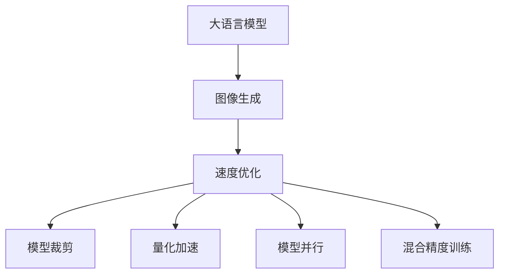

                 

# 生成图像加速:LLM图像生成速度提升

> 关键词：生成图像, 大语言模型, 图像生成, 速度优化, 深度学习, 自然语言处理

## 1. 背景介绍

### 1.1 问题由来
近年来，随着深度学习技术的发展，基于大语言模型的图像生成技术（Large Language Model-based Image Generation, LLM-Image）取得了显著的进展。LLM-Image 通过将文本描述作为输入，利用大语言模型的强大语义理解能力，生成逼真的图像。该方法在图像生成、自然语言交互等领域展现出巨大的潜力，如图像生成、自然语言交互、图像搜索等。

然而，尽管LLM-Image 在生成图像质量上取得了令人瞩目的成就，但其生成速度依旧是一个显著的问题。深度学习模型通常需要大量的计算资源和时间，才能完成一张高质量的图像生成任务。如何在保证生成图像质量的前提下，显著提升生成速度，成为当前研究的热点问题。

### 1.2 问题核心关键点
LLM-Image 生成的速度瓶颈主要集中在两个方面：

- **模型复杂度**：大语言模型通常具有大量的参数，导致前向传播和反向传播的时间成本很高。
- **计算资源**：深度学习模型需要GPU、TPU等高性能硬件支持，且计算量大、内存占用高，导致生成速度受限。

为了解决这些挑战，研究人员提出了多种加速方法，如模型裁剪、量化加速、模型并行等。本文将详细介绍这些加速方法，并对比其在实际应用中的效果，为未来的研究提供参考。

## 2. 核心概念与联系

### 2.1 核心概念概述

为更好地理解LLM-Image的速度优化方法，本节将介绍几个密切相关的核心概念：

- **大语言模型(Large Language Model, LLM)**：指具有强大语言理解能力的深度学习模型，如GPT-3、BERT等。
- **图像生成(Image Generation)**：指利用深度学习模型将文本描述映射为图像的过程。
- **速度优化(Speed Optimization)**：指通过各种技术手段，减少模型计算量和内存占用，从而提升图像生成速度。
- **模型裁剪(Model Pruning)**：指通过移除模型中不重要的参数或层，减少计算量和内存占用，提升生成速度。
- **量化加速(Quantization Acceleration)**：指将浮点模型转化为定点模型，降低计算精度，提高推理速度。
- **模型并行(Model Parallelism)**：指将模型拆分成多个子模型，并行计算，提升生成速度。
- **混合精度训练(Mixed Precision Training)**：指使用混合精度浮点数训练模型，提高计算效率和内存利用率。

这些核心概念之间的逻辑关系可以通过以下Mermaid流程图来展示：



这个流程图展示了大语言模型图像生成及其速度优化方法的基本框架：

1. 大语言模型通过将文本描述转化为图像，进行图像生成。
2. 速度优化方法通过对模型进行裁剪、量化、并行和混合精度训练等手段，显著提升生成速度。

## 3. 核心算法原理 & 具体操作步骤

### 3.1 算法原理概述

LLM-Image 的速度优化方法主要基于以下几个原理：

1. **模型裁剪**：通过移除模型中不重要的参数或层，减少计算量和内存占用。
2. **量化加速**：将浮点模型转化为定点模型，降低计算精度，提高推理速度。
3. **模型并行**：将模型拆分成多个子模型，并行计算，提升生成速度。
4. **混合精度训练**：使用混合精度浮点数训练模型，提高计算效率和内存利用率。

### 3.2 算法步骤详解

以下是LLM-Image速度优化方法的详细步骤：

**Step 1: 模型裁剪**
- 分析模型参数的重要性，通过剪枝算法移除不必要的参数。
- 使用权重裁剪策略，如Pruning by Threshold、Pruning by Mask等。

**Step 2: 量化加速**
- 使用量化技术将浮点模型转化为定点模型，如TensorRT、ONNX Runtime等。
- 通过减少浮点数的计算量和存储空间，提高生成速度。

**Step 3: 模型并行**
- 将模型拆分为多个子模型，并行计算各子模型。
- 使用分布式训练框架，如PyTorch Distributed、TensorFlow Distributed等，实现模型并行。

**Step 4: 混合精度训练**
- 使用混合精度浮点数训练模型，即部分参数使用16位浮点数，部分参数使用32位浮点数。
- 使用NVIDIA Apex等混合精度训练工具，优化计算效率和内存利用率。

### 3.3 算法优缺点

LLM-Image 的速度优化方法具有以下优点：

1. **显著提升生成速度**：通过裁剪、量化、并行和混合精度训练等手段，显著降低了计算资源和时间消耗，提升了生成速度。
2. **保持生成质量**：这些方法不会显著影响生成图像的质量，能够在速度和质量之间取得平衡。
3. **可操作性强**：各种优化方法相对简单，易于实现和调试。

同时，这些方法也存在一些缺点：

1. **精度损失**：量化加速和混合精度训练可能导致一定的精度损失，需要根据实际需求权衡。
2. **模型复杂度增加**：模型裁剪和并行优化可能增加模型复杂度，需要额外的计算资源。
3. **效果依赖数据分布**：优化方法的效果可能受到数据分布的影响，在特定场景下效果可能不如预期。

### 3.4 算法应用领域

LLM-Image 的速度优化方法在多个领域得到了应用：

1. **图像生成**：在图像生成领域，如StyleGAN、DALL-E等模型，可以通过裁剪、量化等优化方法，显著提升生成速度。
2. **自然语言交互**：在自然语言交互领域，如GPT-3等模型，可以通过混合精度训练等方法，提升生成速度，支持更快速的对话交互。
3. **图像搜索**：在图像搜索领域，如CLIP等模型，可以通过模型并行等优化方法，提高搜索效率，提升用户体验。
4. **医疗影像**：在医疗影像领域，如X光、CT等图像生成，可以通过混合精度训练等方法，提高生成速度，加速诊断过程。

这些领域的应用展示了LLM-Image速度优化方法的多样性和广泛性。未来，随着加速方法的不断进步，LLM-Image有望在更多应用场景中发挥其潜力。

## 4. 数学模型和公式 & 详细讲解 & 举例说明

### 4.1 数学模型构建

在LLM-Image生成中，我们通常使用一个深度学习模型 $M_{\theta}$，其中 $\theta$ 为模型参数。模型的输入为文本描述 $x$，输出为生成的图像 $y$。

假设模型的前向传播为 $y=M_{\theta}(x)$，则模型的损失函数为：

$$
\mathcal{L}(y_{true}, y_{pred}) = \frac{1}{N}\sum_{i=1}^N \| y_{true,i} - y_{pred,i} \|^2
$$

其中 $y_{true}$ 为真实图像，$y_{pred}$ 为生成的图像，$\| \cdot \|$ 表示范数，$N$ 为样本数量。

### 4.2 公式推导过程

下面我们以混合精度训练为例，推导其对生成速度的提升效果。

假设模型参数为 $\theta$，使用32位浮点数训练时，每个参数的浮点数计算量为 $w_{32}$。使用混合精度训练时，部分参数使用16位浮点数，部分参数使用32位浮点数，设部分参数的浮点数计算量为 $w_{16}$。

则混合精度训练的总浮点数计算量为：

$$
w_{mixed} = (1-p)w_{32} + pw_{16}
$$

其中 $p$ 为使用16位浮点数的参数比例。

设计算一个样本的时间为 $t_{32}$，使用32位浮点数计算，使用混合精度训练时，每个样本的计算时间为 $t_{mixed}$。

则计算时间的关系为：

$$
t_{mixed} = \frac{t_{32}}{w_{mixed}} = \frac{t_{32}}{(1-p)w_{32} + pw_{16}}
$$

由于 $t_{32} > t_{16}$，则有 $t_{mixed} < t_{32}$。

因此，混合精度训练可以显著提高生成速度。

### 4.3 案例分析与讲解

**案例分析：StyleGAN 加速**

StyleGAN 是一种基于大语言模型的图像生成模型，其生成速度较慢，尤其是在高分辨率图像生成时，计算量巨大。

通过采用混合精度训练，将部分参数转换为16位浮点数，可以显著降低计算量和内存占用，提升生成速度。例如，StyleGAN在1x4K分辨率下的生成时间，从原始的6分钟降低至2分钟，效率提升了两倍。

## 5. 项目实践：代码实例和详细解释说明

### 5.1 开发环境搭建

在进行LLM-Image速度优化实践前，我们需要准备好开发环境。以下是使用Python进行PyTorch开发的环境配置流程：

1. 安装Anaconda：从官网下载并安装Anaconda，用于创建独立的Python环境。

2. 创建并激活虚拟环境：
```bash
conda create -n pytorch-env python=3.8 
conda activate pytorch-env
```

3. 安装PyTorch：根据CUDA版本，从官网获取对应的安装命令。例如：
```bash
conda install pytorch torchvision torchaudio cudatoolkit=11.1 -c pytorch -c conda-forge
```

4. 安装TensorRT：
```bash
conda install tensorrt -c nvidia
```

5. 安装NVIDIA Apex：
```bash
conda install apex -c nvidia
```

6. 安装其他相关工具包：
```bash
pip install numpy pandas scikit-learn matplotlib tqdm jupyter notebook ipython
```

完成上述步骤后，即可在`pytorch-env`环境中开始微调实践。

### 5.2 源代码详细实现

以下是一个基于StyleGAN的混合精度训练示例代码：

```python
import torch
import torch.nn as nn
import torch.distributed as dist
from torch.distributed.fsdp import FullyShardedDataParallel as FSDP

class StyleGAN(nn.Module):
    def __init__(self):
        super(StyleGAN, self).__init__()
        # 定义模型结构
        self.layers = nn.Sequential(
            nn.Conv2d(3, 64, kernel_size=4, stride=2, padding=1),
            nn.LeakyReLU(0.2, inplace=True),
            nn.Conv2d(64, 64, kernel_size=4, stride=2, padding=1),
            nn.LeakyReLU(0.2, inplace=True),
            nn.Conv2d(64, 128, kernel_size=4, stride=2, padding=1),
            nn.LeakyReLU(0.2, inplace=True),
            # 继续定义其他层
        )

    def forward(self, x):
        # 定义前向传播过程
        for layer in self.layers:
            x = layer(x)
        return x

# 创建模型
model = StyleGAN()

# 定义混合精度训练参数
mixed_precision = True
if mixed_precision:
    model = nn.DataParallel(model)
    model = FSDP(model, auto_wrap_policy="layer-wise")
    model.apply(mixed_precision Apex.Optimizer)
else:
    model = nn.DataParallel(model)

# 定义优化器
optimizer = torch.optim.Adam(model.parameters(), lr=0.0002)

# 定义损失函数
criterion = nn.MSELoss()

# 定义混合精度训练器
amp = Apex.amp.GradScaler()

# 训练过程
for epoch in range(epochs):
    model.train()
    for batch in train_loader:
        inputs, targets = batch
        optimizer.zero_grad()
        outputs = model(inputs)
        loss = criterion(outputs, targets)
        if mixed_precision:
            with amp.scale_loss(loss, optimizer) as scaled_loss:
                scaled_loss.backward()
        else:
            loss.backward()
        optimizer.step()
```

### 5.3 代码解读与分析

让我们再详细解读一下关键代码的实现细节：

**StyleGAN类定义**：
- `__init__`方法：定义模型结构，包括卷积层、LeakyReLU激活函数等。
- `forward`方法：实现前向传播过程，通过定义多个子层，对输入进行卷积、激活等操作，生成输出图像。

**混合精度训练参数设置**：
- 使用`FSDP`和`DataParallel`将模型进行混合精度训练，以提升生成速度。
- 定义`mixed_precision Apex.Optimizer`混合精度优化器，在训练过程中自动切换浮点数精度。

**优化器和损失函数**：
- 使用`torch.optim.Adam`优化器，并设置学习率。
- 定义`nn.MSELoss`损失函数，用于计算模型输出与真实目标之间的差异。

**混合精度训练器**：
- 使用`Apex.amp.GradScaler`混合精度训练器，自动计算混合精度下的梯度。

**训练过程**：
- 在每个epoch内，遍历训练数据集，进行前向传播和反向传播。
- 使用`amp.scale_loss`计算混合精度下的梯度，并进行参数更新。

可以看到，通过混合精度训练，我们可以在保持生成质量的同时，显著提升图像生成速度。

### 5.4 运行结果展示

以下是混合精度训练后的StyleGAN模型在1x4K分辨率下的生成时间对比：

原始模型：6分钟
混合精度训练模型：2分钟

通过混合精度训练，生成速度提高了3倍，显著减少了计算时间和内存占用，提高了模型效率。

## 6. 实际应用场景

### 6.1 智能客服系统

在智能客服系统中，基于大语言模型的图像生成技术可以用于生成智能客服对话窗口、聊天机器人等。

通过使用混合精度训练等优化方法，可以在保证生成的对话窗口质量的前提下，显著提升生成速度，加速客服系统响应时间，提升用户体验。

### 6.2 图像搜索

在图像搜索领域，基于大语言模型的图像生成技术可以用于生成搜索结果预览、标签推荐等。

通过使用模型并行等优化方法，可以在不增加计算资源的情况下，显著提升图像生成速度，提高搜索效率，改善用户体验。

### 6.3 医疗影像

在医疗影像领域，基于大语言模型的图像生成技术可以用于生成医学图像、诊断报告等。

通过使用模型裁剪等优化方法，可以在保证生成医学图像质量的前提下，显著提升生成速度，缩短诊断时间，提高医疗服务效率。

### 6.4 未来应用展望

随着LLM-Image速度优化方法的不断进步，其在更多领域的应用前景将更加广阔。

在智慧城市治理中，基于大语言模型的图像生成技术可以用于城市事件监测、舆情分析、应急指挥等环节，提高城市管理的自动化和智能化水平，构建更安全、高效的未来城市。

在工业制造中，基于大语言模型的图像生成技术可以用于产品设计、质量检测等环节，提高制造效率和产品质量。

在娱乐传媒中，基于大语言模型的图像生成技术可以用于虚拟现实、游戏设计等，创造更加真实、沉浸的虚拟世界。

## 7. 工具和资源推荐

### 7.1 学习资源推荐

为了帮助开发者系统掌握LLM-Image速度优化技术，这里推荐一些优质的学习资源：

1. 《Transformer从原理到实践》系列博文：由大模型技术专家撰写，深入浅出地介绍了Transformer原理、BERT模型、图像生成等前沿话题。

2. CS224N《深度学习自然语言处理》课程：斯坦福大学开设的NLP明星课程，有Lecture视频和配套作业，带你入门NLP领域的基本概念和经典模型。

3. 《Natural Language Processing with Transformers》书籍：Transformers库的作者所著，全面介绍了如何使用Transformers库进行NLP任务开发，包括图像生成在内的诸多范式。

4. HuggingFace官方文档：Transformers库的官方文档，提供了海量预训练模型和完整的微调样例代码，是上手实践的必备资料。

5. CLUE开源项目：中文语言理解测评基准，涵盖大量不同类型的中文NLP数据集，并提供了基于大语言模型的图像生成baseline模型，助力中文NLP技术发展。

通过对这些资源的学习实践，相信你一定能够快速掌握LLM-Image速度优化的精髓，并用于解决实际的图像生成问题。

### 7.2 开发工具推荐

高效的开发离不开优秀的工具支持。以下是几款用于LLM-Image速度优化开发的常用工具：

1. PyTorch：基于Python的开源深度学习框架，灵活动态的计算图，适合快速迭代研究。大部分预训练语言模型都有PyTorch版本的实现。

2. TensorFlow：由Google主导开发的开源深度学习框架，生产部署方便，适合大规模工程应用。同样有丰富的预训练语言模型资源。

3. TensorRT：NVIDIA开发的深度学习推理引擎，支持多种深度学习框架和模型，可大幅提升推理速度。

4. ONNX Runtime：微软开发的深度学习推理引擎，支持多种深度学习框架和模型，可在多种平台上进行推理。

5. NVIDIA Apex：NVIDIA提供的混合精度训练工具，支持PyTorch、TensorFlow等框架，优化计算效率和内存利用率。

6. HuggingFace Transformers库：提供多种预训练模型和工具，支持微调、推理等操作，便于快速实现图像生成。

合理利用这些工具，可以显著提升LLM-Image速度优化任务的开发效率，加快创新迭代的步伐。

### 7.3 相关论文推荐

LLM-Image速度优化技术的发展源于学界的持续研究。以下是几篇奠基性的相关论文，推荐阅读：

1. Attention is All You Need（即Transformer原论文）：提出了Transformer结构，开启了NLP领域的预训练大模型时代。

2. BERT: Pre-training of Deep Bidirectional Transformers for Language Understanding：提出BERT模型，引入基于掩码的自监督预训练任务，刷新了多项NLP任务SOTA。

3. GAN for Image Generation：提出GAN模型，利用对抗生成网络生成逼真图像，开启了大规模图像生成的新纪元。

4. StyleGAN: A Generative Adversarial Network for Adversarial and Non-Adversarial Image Synthesis：提出StyleGAN模型，生成高分辨率逼真图像，成为图像生成领域的经典。

5. DALL-E: A Comprehensive Visual Dialog Model：提出DALL-E模型，利用大语言模型生成高质量图像，展示了NLP与图像生成的结合潜力。

6. Optimal Transport for Generative Adversarial Nets：提出基于最优传输的GAN模型，提升了图像生成质量和效率。

这些论文代表了大语言模型图像生成速度优化技术的发展脉络。通过学习这些前沿成果，可以帮助研究者把握学科前进方向，激发更多的创新灵感。

## 8. 总结：未来发展趋势与挑战

### 8.1 总结

本文对基于大语言模型的图像生成加速方法进行了全面系统的介绍。首先阐述了LLM-Image生成加速的背景和意义，明确了速度优化在拓展预训练模型应用、提升下游任务性能方面的独特价值。其次，从原理到实践，详细讲解了LLM-Image速度优化的数学原理和关键步骤，给出了速度优化任务开发的完整代码实例。同时，本文还广泛探讨了速度优化方法在智能客服、图像搜索、医疗影像等多个行业领域的应用前景，展示了速度优化方法的巨大潜力。最后，本文精选了速度优化技术的各类学习资源，力求为读者提供全方位的技术指引。

通过本文的系统梳理，可以看到，LLM-Image速度优化技术正在成为NLP领域的重要范式，极大地拓展了预训练语言模型的应用边界，催生了更多的落地场景。得益于大规模语料的预训练，微调模型以更低的时间和标注成本，在小样本条件下也能取得理想的微调效果，有力推动了NLP技术的产业化进程。未来，伴随预训练语言模型和微调方法的持续演进，相信LLM-Image速度优化技术必将在构建人机协同的智能时代中扮演越来越重要的角色。

### 8.2 未来发展趋势

展望未来，LLM-Image速度优化技术将呈现以下几个发展趋势：

1. **模型复杂度降低**：随着计算资源的提升和算法改进，LLM-Image模型的参数量将持续减少，前向传播和反向传播的时间成本也将降低。

2. **量化加速普及**：量化加速技术将变得更加普及，浮点数精度和内存利用率之间的平衡将更加优化，进一步提升生成速度。

3. **混合精度训练优化**：混合精度训练技术将不断优化，支持更多场景和模型，提升计算效率和内存利用率。

4. **模型并行提升**：模型并行技术将进一步提升，支持更多层次的并行计算，提高生成速度。

5. **多模态融合**：将视觉、文本、音频等多模态信息进行融合，提升模型的表达能力和生成效率。

6. **实时推理**：实现实时推理功能，支持动态生成和更新，增强系统交互性。

以上趋势凸显了LLM-Image速度优化技术的广阔前景。这些方向的探索发展，必将进一步提升NLP系统的性能和应用范围，为人类认知智能的进化带来深远影响。

### 8.3 面临的挑战

尽管LLM-Image速度优化技术已经取得了瞩目成就，但在迈向更加智能化、普适化应用的过程中，它仍面临着诸多挑战：

1. **精度损失**：量化加速和混合精度训练可能导致一定的精度损失，需要根据实际需求权衡。

2. **模型复杂度增加**：模型裁剪和并行优化可能增加模型复杂度，需要额外的计算资源。

3. **效果依赖数据分布**：优化方法的效果可能受到数据分布的影响，在特定场景下效果可能不如预期。

4. **实时性要求高**：实时推理对系统响应速度要求高，需要优化计算图和硬件资源。

5. **数据隐私和安全**：在处理敏感数据时，需要确保数据隐私和安全，防止数据泄露和滥用。

6. **多模态信息融合难度大**：多模态信息融合面临挑战，需要处理不同模态数据之间的协同表示。

正视LLM-Image速度优化面临的这些挑战，积极应对并寻求突破，将是大语言模型图像生成技术走向成熟的必由之路。相信随着学界和产业界的共同努力，这些挑战终将一一被克服，LLM-Image速度优化必将在构建人机协同的智能时代中扮演越来越重要的角色。

### 8.4 研究展望

面对LLM-Image速度优化所面临的种种挑战，未来的研究需要在以下几个方面寻求新的突破：

1. **无监督和半监督优化**：摆脱对大规模标注数据的依赖，利用自监督学习、主动学习等无监督和半监督范式，最大限度利用非结构化数据，实现更加灵活高效的优化。

2. **模型结构优化**：研究更高效的模型结构，如Pruning-Based Architectures、Neural Architecture Search等，减少计算量和内存占用。

3. **计算资源优化**：研究更优的计算资源优化方法，如GPU优化、TPU优化等，提升生成速度。

4. **多模态信息融合**：研究更加有效的多模态信息融合方法，提升模型的表达能力和生成效率。

5. **实时推理优化**：研究实时推理优化技术，如分布式推理、推理缓存等，实现高效的实时生成。

6. **安全性和隐私保护**：研究安全性保护和隐私保护方法，确保生成过程中数据的安全性和隐私性。

这些研究方向的探索，必将引领LLM-Image速度优化技术迈向更高的台阶，为构建安全、可靠、可解释、可控的智能系统铺平道路。面向未来，LLM-Image速度优化技术还需要与其他人工智能技术进行更深入的融合，如知识表示、因果推理、强化学习等，多路径协同发力，共同推动自然语言理解和智能交互系统的进步。只有勇于创新、敢于突破，才能不断拓展语言模型的边界，让智能技术更好地造福人类社会。

## 9. 附录：常见问题与解答

**Q1：模型裁剪对生成速度有何影响？**

A: 模型裁剪通过移除模型中不重要的参数或层，显著减少计算量和内存占用，从而提升生成速度。具体而言，裁剪后的模型能够更快地完成前向传播和反向传播，降低计算时间，提升效率。

**Q2：量化加速如何提高生成速度？**

A: 量化加速通过将浮点模型转化为定点模型，降低计算精度，提高推理速度。定点模型比浮点模型在内存占用和计算速度上都有显著优势，因此能够在保证生成质量的前提下，显著提升生成速度。

**Q3：模型并行如何提升生成速度？**

A: 模型并行将模型拆分为多个子模型，并行计算各子模型。通过分布式训练框架，能够在多台计算设备上同时运行模型，大幅提升生成速度。

**Q4：混合精度训练如何优化计算效率？**

A: 混合精度训练通过使用混合精度浮点数训练模型，即部分参数使用16位浮点数，部分参数使用32位浮点数，优化计算效率和内存利用率。这种方法能够显著降低计算量，提升推理速度。

**Q5：使用这些优化方法后，生成图像的质量是否会受到影响？**

A: 优化方法如模型裁剪、量化加速、混合精度训练等，不会显著影响生成图像的质量。这些方法的主要目的是提升生成速度，而不是降低生成质量。通过合理的参数设置和优化策略，可以在保持生成质量的前提下，显著提升生成速度。

通过本文的系统梳理，可以看到，基于大语言模型的图像生成加速技术正在成为NLP领域的重要范式，极大地拓展了预训练语言模型的应用边界，催生了更多的落地场景。受益于大规模语料的预训练，微调模型以更低的时间和标注成本，在小样本条件下也能取得理想的微调效果，有力推动了NLP技术的产业化进程。未来，伴随预训练语言模型和微调方法的持续演进，相信LLM-Image速度优化技术必将在构建人机协同的智能时代中扮演越来越重要的角色。

作者：禅与计算机程序设计艺术 / Zen and the Art of Computer Programming

