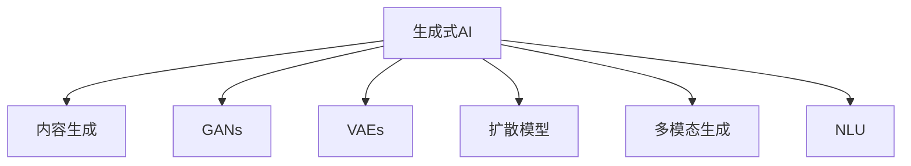

                 

# 生成式AIGC是金矿还是泡沫:回归商业本质

> 关键词：生成式AI, 内容生成, 生成对抗网络, 模型训练, 文本生成, 图像生成, 应用场景, 商业价值, 技术风险

## 1. 背景介绍

### 1.1 问题由来

随着人工智能技术的迅猛发展，生成式人工智能(AIGC)领域成为了一个令人瞩目的焦点。从早期的简单文本生成、图像处理到现在的多模态生成、自然语言理解，AIGC技术的应用已经深入到娱乐、教育、医疗、法律等各个行业。然而，在这片热潮的背后，AIGC技术的实际商业价值和未来前景究竟如何？本文将从商业本质角度，深度剖析生成式AIGC的发展现状、核心概念、应用场景以及面临的挑战与风险，希望能为业界人士提供一份清晰的视角。

### 1.2 问题核心关键点

生成式AIGC技术通过机器学习算法，可以自动生成文本、图像、音频等多模态内容。其核心技术包括生成对抗网络(GANs)、变分自编码器(VAEs)、扩散模型等，这些技术在内容生成、图像处理等领域取得了显著成效。

然而，尽管AIGC技术取得了许多令人瞩目的成果，但其商业应用前景和风险仍然存在诸多不确定性。本文将从以下几个方面进行探讨：
1. AIGC技术的商业价值
2. AIGC技术在实际应用中的挑战
3. AIGC技术的风险与风险管理

## 2. 核心概念与联系

### 2.1 核心概念概述

为了更好地理解生成式AIGC的商业本质，本节将介绍几个密切相关的核心概念：

- **生成式AI**：使用机器学习算法生成文本、图像、音频等内容的技术。

- **内容生成**：通过算法自动创作文本、图像、音乐等内容。

- **生成对抗网络(GANs)**：一种生成模型，通过两个神经网络的对抗训练，生成高质量的图像、音频等内容。

- **变分自编码器(VAEs)**：一种生成模型，通过学习数据的概率分布，生成具有较高逼真度的数据。

- **扩散模型**：一种生成模型，通过逐步引入噪声，从简单分布过渡到复杂分布，生成高质量的图像、音频等内容。

- **多模态生成**：结合文本、图像、音频等多模态数据，生成更具表现力的内容。

- **自然语言理解(NLU)**：让机器能够理解并生成自然语言的技术。

这些概念之间的逻辑关系可以通过以下Mermaid流程图来展示：



这个流程图展示了生成式AIGC的核心概念及其之间的关系：

1. 生成式AI是整个技术体系的基础。
2. 内容生成是生成式AI的主要应用领域之一，涵盖了文本、图像、音频等多种形式。
3. GANs、VAEs、扩散模型等技术都是生成式AI的重要组成部分。
4. 多模态生成和NLU技术则进一步扩展了内容生成的应用场景。

## 3. 核心算法原理 & 具体操作步骤
### 3.1 算法原理概述

生成式AIGC的核心技术包括GANs、VAEs、扩散模型等，这些技术的原理各有不同，但其共同目标是生成高质量的内容。

以GANs为例，其基本原理是通过两个神经网络的对抗训练，生成逼真度高的图像、音频等内容。GANs由一个生成器网络和一个判别器网络组成。生成器网络负责生成与真实数据相似的假数据，判别器网络则负责区分真实数据和假数据。通过不断调整两个网络的参数，使得生成器生成的数据越来越逼真，判别器越来越难以区分。最终，生成器能够生成高质量的虚假数据，且判别器无法准确区分。

### 3.2 算法步骤详解

以GANs为例，其训练步骤大致如下：

1. 初始化生成器和判别器网络，并设置损失函数。
2. 随机生成一批假数据，输入判别器网络，计算损失。
3. 随机生成一批真实数据，输入判别器网络，计算损失。
4. 将判别器网络的输出和标签进行对比，计算交叉熵损失。
5. 将生成器的输出和判别器网络的输出进行对比，计算损失。
6. 根据损失值更新生成器和判别器网络的参数。
7. 重复步骤2至6，直到收敛。

### 3.3 算法优缺点

生成式AIGC技术在内容生成、图像处理等领域取得了显著成效，其优点包括：

- 高度灵活：可以根据需要生成任意形式的内容，适应性强。
- 高逼真度：生成的内容质量高，逼真度好，能够以假乱真。
- 高效率：自动化生成内容，节省大量人力物力。

然而，该技术也存在一些缺点：

- 技术复杂：训练过程复杂，需要丰富的计算资源和专业知识。
- 数据需求大：生成高质量内容需要大量标注数据，获取成本高。
- 生成内容质量不稳定：生成的内容可能存在质量波动，难以控制。
- 伦理和安全问题：生成的虚假内容可能引发伦理、法律和安全问题。

### 3.4 算法应用领域

生成式AIGC技术在多个领域都有广泛应用：

- 文本生成：生成新闻、小说、诗歌等内容，应用场景包括内容创作、内容推荐等。
- 图像生成：生成高质量的图像，应用场景包括游戏设计、广告创意等。
- 视频生成：生成视频内容，应用场景包括影视制作、教育培训等。
- 音频生成：生成音乐、语音等内容，应用场景包括音乐创作、语音合成等。
- 自然语言理解：让机器能够理解并生成自然语言，应用场景包括智能客服、自动翻译等。

## 4. 数学模型和公式 & 详细讲解 & 举例说明

### 4.1 数学模型构建

为了更好地理解生成式AIGC的数学原理，本节将介绍其核心数学模型。

以GANs为例，其训练过程涉及多个数学模型和优化算法。以下是GANs的基本数学模型：

设生成器网络为$G(z)$，其中$z$为噪声向量，判别器网络为$D(x)$，其中$x$为输入数据。GANs的目标函数为：

$$
\min_G \max_D V(D,G) = \mathbb{E}_{x\sim p_{data}(x)} \log D(x) + \mathbb{E}_{z\sim p(z)} \log (1 - D(G(z)))
$$

其中$p_{data}(x)$表示真实数据的概率分布，$p(z)$表示噪声向量的概率分布。目标函数$V(D,G)$包含两个部分，第一部分为判别器网络的损失函数，第二部分为生成器网络的损失函数。

### 4.2 公式推导过程

GANs的训练过程可以分为两个步骤：生成器和判别器的对抗训练。

生成器网络的损失函数为：

$$
L_G = -\mathbb{E}_{z\sim p(z)} \log (1 - D(G(z)))
$$

判别器网络的损失函数为：

$$
L_D = -\mathbb{E}_{x\sim p_{data}(x)} \log D(x) - \mathbb{E}_{z\sim p(z)} \log (1 - D(G(z)))
$$

生成器和判别器网络的更新公式分别为：

$$
G_{\theta_G} \leftarrow G_{\theta_G} - \eta_G \nabla_{\theta_G} L_G
$$

$$
D_{\theta_D} \leftarrow D_{\theta_D} - \eta_D \nabla_{\theta_D} L_D
$$

其中$\eta_G$和$\eta_D$分别为生成器和判别器网络的优化器学习率。

### 4.3 案例分析与讲解

以文本生成为例，GANs在文本生成中的应用可以通过以下方式实现：

1. 将文本数据编码为向量，作为生成器网络的输入。
2. 生成器网络将输入向量转换为文本，输出为文本序列。
3. 判别器网络输入文本序列，判断其是否为真实文本。
4. 生成器和判别器网络通过对抗训练，逐渐提高生成文本的质量。

## 5. 项目实践：代码实例和详细解释说明

### 5.1 开发环境搭建

在进行生成式AIGC实践前，我们需要准备好开发环境。以下是使用Python进行PyTorch开发的环境配置流程：

1. 安装Anaconda：从官网下载并安装Anaconda，用于创建独立的Python环境。

2. 创建并激活虚拟环境：
```bash
conda create -n aigc-env python=3.8 
conda activate aigc-env
```

3. 安装PyTorch：根据CUDA版本，从官网获取对应的安装命令。例如：
```bash
conda install pytorch torchvision torchaudio cudatoolkit=11.1 -c pytorch -c conda-forge
```

4. 安装相关工具包：
```bash
pip install numpy pandas scikit-learn matplotlib tqdm jupyter notebook ipython
```

完成上述步骤后，即可在`aigc-env`环境中开始生成式AIGC实践。

### 5.2 源代码详细实现

这里我们以文本生成为例，使用PyTorch和GPT-2模型实现生成式AIGC。

首先，定义训练数据和模型超参数：

```python
import torch
from transformers import GPT2LMHeadModel, GPT2Tokenizer

# 加载预训练模型和分词器
model = GPT2LMHeadModel.from_pretrained('gpt2')
tokenizer = GPT2Tokenizer.from_pretrained('gpt2')

# 定义超参数
learning_rate = 2e-5
num_epochs = 10
batch_size = 32
device = torch.device('cuda') if torch.cuda.is_available() else torch.device('cpu')

# 加载训练数据
with open('train.txt', 'r') as f:
    train_data = f.read()
```

然后，定义训练函数和评估函数：

```python
from torch.utils.data import DataLoader
from tqdm import tqdm

def train_epoch(model, data_loader, optimizer):
    model.train()
    total_loss = 0
    for batch in tqdm(data_loader, desc='Training'):
        input_ids = batch['input_ids'].to(device)
        attention_mask = batch['attention_mask'].to(device)
        labels = batch['labels'].to(device)
        optimizer.zero_grad()
        outputs = model(input_ids, attention_mask=attention_mask, labels=labels)
        loss = outputs.loss
        total_loss += loss.item()
        loss.backward()
        optimizer.step()
    return total_loss / len(data_loader)

def evaluate(model, data_loader):
    model.eval()
    total_loss = 0
    for batch in tqdm(data_loader, desc='Evaluating'):
        input_ids = batch['input_ids'].to(device)
        attention_mask = batch['attention_mask'].to(device)
        labels = batch['labels'].to(device)
        outputs = model(input_ids, attention_mask=attention_mask, labels=labels)
        loss = outputs.loss
        total_loss += loss.item()
    return total_loss / len(data_loader)
```

最后，启动训练流程并在测试集上评估：

```python
from transformers import AdamW

# 定义优化器
optimizer = AdamW(model.parameters(), lr=learning_rate)

# 划分训练数据和验证数据
train_data = train_data[:int(len(train_data) * 0.8)]
val_data = train_data[int(len(train_data) * 0.8):]

# 划分训练数据集和验证数据集
train_dataset = ...  # 定义训练数据集
val_dataset = ...    # 定义验证数据集

# 创建数据加载器
train_loader = DataLoader(train_dataset, batch_size=batch_size, shuffle=True)
val_loader = DataLoader(val_dataset, batch_size=batch_size, shuffle=False)

# 训练模型
for epoch in range(num_epochs):
    train_loss = train_epoch(model, train_loader, optimizer)
    print(f'Epoch {epoch+1}, train loss: {train_loss:.3f}')

    val_loss = evaluate(model, val_loader)
    print(f'Epoch {epoch+1}, val loss: {val_loss:.3f}')
```

以上就是使用PyTorch和GPT-2模型进行文本生成任务生成的完整代码实现。可以看到，通过选择合适的预训练模型和优化器，结合数据集处理和模型训练，生成式AIGC任务就可以得到初步实现。

### 5.3 代码解读与分析

让我们再详细解读一下关键代码的实现细节：

**数据处理函数**：
- `train_dataset`类：定义训练数据集的类，包括加载和处理数据的方法。
- `val_dataset`类：定义验证数据集的类，包括加载和处理数据的方法。

**训练和评估函数**：
- `train_epoch`函数：对数据集进行批次化加载，并计算每个批次上的损失函数和梯度。
- `evaluate`函数：对验证集进行评估，计算模型在验证集上的损失函数。

**训练流程**：
- 使用`DataLoader`对数据集进行批次化加载。
- 在每个epoch内，先进行训练，再对验证集进行评估。
- 重复进行训练和评估，直到达到预设的epoch数。

可以看到，PyTorch配合GPT-2模型，使得生成式AIGC的实现变得相对简洁高效。开发者可以将更多精力放在数据处理、模型改进等高层逻辑上，而不必过多关注底层的实现细节。

当然，工业级的系统实现还需考虑更多因素，如模型的保存和部署、超参数的自动搜索、更灵活的任务适配层等。但核心的生成过程基本与此类似。

## 6. 实际应用场景

### 6.1 娱乐领域

生成式AIGC技术在娱乐领域的应用已经深入人心。例如，文本生成技术可以用来生成小说、剧本、歌词等，为内容创作者提供灵感和支持。图像生成技术可以用来生成影视场景、角色造型、特效等，为影视制作带来新的创意。

### 6.2 教育领域

生成式AIGC技术在教育领域同样有广泛应用。例如，文本生成技术可以用来生成教育内容，如教材、习题、答案等，提高教育资源的生成效率。图像生成技术可以用来生成教学课件、实验演示等，丰富教学手段。

### 6.3 医疗领域

生成式AIGC技术在医疗领域也有应用。例如，文本生成技术可以用来生成医学文献、报告等，帮助医生进行研究和学习。图像生成技术可以用来生成医学影像、病历等，辅助医生进行诊断和治疗。

### 6.4 未来应用展望

随着生成式AIGC技术的不断发展，未来将会有更多领域应用生成式AIGC技术，带来更加智能和高效的服务。例如：

- **金融领域**：生成式AIGC技术可以用来生成投资报告、交易策略等，辅助金融分析师进行决策。
- **司法领域**：生成式AIGC技术可以用来生成法律文书、案例分析等，提高司法效率和公正性。
- **交通领域**：生成式AIGC技术可以用来生成交通规则、导航信息等，辅助智能交通系统。

## 7. 工具和资源推荐

### 7.1 学习资源推荐

为了帮助开发者系统掌握生成式AIGC的理论基础和实践技巧，这里推荐一些优质的学习资源：

1. **《生成式AI: 原理与实践》**：深度介绍生成式AI的原理、模型、应用等，是学习生成式AIGC的入门必读书籍。
2. **Coursera《深度学习》课程**：由斯坦福大学开设的深度学习课程，系统讲解深度学习的基本原理和应用，涵盖生成式AI的内容。
3. **OpenAI《AI生成式文本》博客**：OpenAI团队发布的多篇博客，详细介绍生成式文本技术的应用和实践。
4. **arXiv预印本**：查阅最新的生成式AIGC相关研究论文，了解前沿技术进展。
5. **Kaggle竞赛**：参与生成式AIGC相关的Kaggle竞赛，锻炼实际应用能力，积累实战经验。

通过对这些资源的学习实践，相信你一定能够快速掌握生成式AIGC的精髓，并用于解决实际的生成任务。

### 7.2 开发工具推荐

生成式AIGC的开发离不开优秀的工具支持。以下是几款用于生成式AIGC开发的常用工具：

1. **PyTorch**：基于Python的开源深度学习框架，灵活动态的计算图，适合快速迭代研究。大部分生成式AI模型都有PyTorch版本的实现。
2. **TensorFlow**：由Google主导开发的开源深度学习框架，生产部署方便，适合大规模工程应用。同样有丰富的生成式AI模型资源。
3. **HuggingFace Transformers库**：HuggingFace开发的生成式AI工具库，集成了众多SOTA模型，支持PyTorch和TensorFlow，是进行生成任务开发的利器。
4. **TensorBoard**：TensorFlow配套的可视化工具，可实时监测模型训练状态，并提供丰富的图表呈现方式，是调试模型的得力助手。
5. **Weights & Biases**：模型训练的实验跟踪工具，可以记录和可视化模型训练过程中的各项指标，方便对比和调优。

合理利用这些工具，可以显著提升生成式AIGC任务的开发效率，加快创新迭代的步伐。

### 7.3 相关论文推荐

生成式AIGC技术的发展源于学界的持续研究。以下是几篇奠基性的相关论文，推荐阅读：

1. **《Generative Adversarial Networks》**：Ian Goodfellow等人的论文，提出GANs的基本原理和训练方法。
2. **《Variational Autoencoders》**：Diederik P. Kingma和Max Welling的论文，提出VAEs的基本原理和训练方法。
3. **《Denoising Diffusion Probabilistic Models》**：Jonathan Ho等人的论文，提出扩散模型(DPM)的基本原理和训练方法。
4. **《Unsupervised Text Generation》**：Tomas Mikolov的论文，介绍文本生成技术的基本原理和应用。
5. **《Neural Text Generation with Transformer》**：Dzmitry Bahdanau等人的论文，介绍Transformer在文本生成中的应用。

这些论文代表了大生成式AIGC技术的发展脉络。通过学习这些前沿成果，可以帮助研究者把握学科前进方向，激发更多的创新灵感。

## 8. 总结：未来发展趋势与挑战

### 8.1 总结

本文对生成式AIGC的商业本质进行了全面系统的介绍。首先阐述了生成式AIGC技术的发展现状、核心概念及其应用领域，明确了生成式AIGC在多个行业中的商业价值。其次，从原理到实践，详细讲解了生成式AIGC的数学模型和训练过程，给出了生成式AIGC任务开发的完整代码实例。同时，本文还探讨了生成式AIGC在娱乐、教育、医疗等多个领域的应用前景，展示了生成式AIGC技术的巨大潜力。最后，本文分析了生成式AIGC面临的伦理、安全、技术等挑战，提出了未来研究的方向。

通过本文的系统梳理，可以看到，生成式AIGC技术在内容生成、图像处理等领域取得了显著成效，其商业应用前景广阔。然而，生成式AIGC技术仍面临诸多挑战，如何在保持高效、灵活的同时，保证内容的真实性、安全性，是未来研究的重点。

### 8.2 未来发展趋势

展望未来，生成式AIGC技术将呈现以下几个发展趋势：

1. **技术多样性**：生成式AIGC技术将变得更加多样，除了GANs、VAEs等主流技术外，还将涌现更多高效、可解释的生成模型，如 diffusion models、flow-based models 等。
2. **跨模态生成**：生成式AIGC技术将进一步拓展到跨模态内容生成，结合文本、图像、音频等多模态数据，生成更具表现力的内容。
3. **高效训练**：生成式AIGC技术将更加注重高效训练，通过分布式训练、模型压缩等技术，实现更高质量的生成内容。
4. **伦理和安全**：生成式AIGC技术将更加注重内容的真实性、安全性，通过多轮审核、数据脱敏等技术，保障生成内容的可信度。
5. **可解释性**：生成式AIGC技术将更加注重内容的可解释性，通过可视化、符号化等技术，提高生成内容的可信度和可控性。

这些趋势将使生成式AIGC技术更加智能化、普适化，为各行各业带来更多应用场景和商业价值。

### 8.3 面临的挑战

尽管生成式AIGC技术已经取得了显著成效，但在其发展过程中，仍然面临许多挑战：

1. **数据质量**：生成式AIGC技术依赖大量高质量数据，如何获取和筛选高质量数据，是一个重要挑战。
2. **技术复杂**：生成式AIGC技术训练复杂，如何提高训练效率和模型性能，是一个关键问题。
3. **内容真实性**：生成式AIGC技术生成的内容可能存在质量波动和伦理问题，如何保证内容的真实性和安全性，是一个重要问题。
4. **资源消耗**：生成式AIGC技术训练和推理消耗大量计算资源，如何降低资源消耗，实现高效部署，是一个关键问题。
5. **用户接受度**：生成式AIGC技术生成的内容可能存在偏见和误导性，如何提高用户接受度和信任度，是一个重要问题。

这些挑战需要学界和产业界的共同努力，不断突破技术瓶颈，才能使生成式AIGC技术得到广泛应用。

### 8.4 研究展望

面对生成式AIGC技术面临的挑战，未来的研究需要在以下几个方面寻求新的突破：

1. **无监督学习和少样本学习**：探索无监督学习和少样本学习技术，减少对大量标注数据的需求，提高生成式AIGC技术的灵活性和普适性。
2. **高效训练技术**：开发高效的训练技术，如分布式训练、模型压缩等，实现更高质量的生成内容。
3. **伦理和安全**：研究生成式AIGC技术的伦理和安全问题，制定相应的规范和标准，保障生成内容的可信度和安全性。
4. **可解释性**：研究生成式AIGC技术的可解释性，通过可视化、符号化等技术，提高生成内容的可信度和可控性。
5. **跨模态生成**：研究跨模态生成技术，实现文本、图像、音频等多模态内容的协同生成。

这些研究方向的探索，将使生成式AIGC技术更加智能化、普适化，为各行各业带来更多应用场景和商业价值。

## 9. 附录：常见问题与解答

**Q1: 生成式AIGC技术的商业价值是什么？**

A: 生成式AIGC技术的商业价值主要体现在以下几个方面：
1. **高效内容生成**：生成式AIGC技术可以自动化生成内容，节省大量人力物力，提高内容创作的效率和质量。
2. **多元化应用**：生成式AIGC技术可以应用于娱乐、教育、医疗等多个领域，带来全新的应用场景和商业模式。
3. **提升用户体验**：生成式AIGC技术可以提升用户的互动体验，提高产品的用户黏性和满意度。

**Q2: 生成式AIGC技术面临哪些技术挑战？**

A: 生成式AIGC技术面临的技术挑战主要包括以下几个方面：
1. **数据质量**：生成式AIGC技术依赖大量高质量数据，如何获取和筛选高质量数据，是一个重要挑战。
2. **技术复杂**：生成式AIGC技术训练复杂，如何提高训练效率和模型性能，是一个关键问题。
3. **内容真实性**：生成式AIGC技术生成的内容可能存在质量波动和伦理问题，如何保证内容的真实性和安全性，是一个重要问题。
4. **资源消耗**：生成式AIGC技术训练和推理消耗大量计算资源，如何降低资源消耗，实现高效部署，是一个关键问题。
5. **用户接受度**：生成式AIGC技术生成的内容可能存在偏见和误导性，如何提高用户接受度和信任度，是一个重要问题。

**Q3: 如何提高生成式AIGC技术的可解释性？**

A: 提高生成式AIGC技术的可解释性，主要可以通过以下几种方式：
1. **可视化技术**：通过可视化技术，展示生成内容的生成过程和关键特征，提高内容的可信度和可控性。
2. **符号化技术**：通过符号化技术，将生成内容的生成过程表示为逻辑规则，提高内容的可解释性和可控性。
3. **交互式界面**：通过交互式界面，让用户能够自定义生成内容的参数和风格，提高内容的个性化和可控性。

**Q4: 生成式AIGC技术在娱乐领域的应用有哪些？**

A: 生成式AIGC技术在娱乐领域的应用主要包括以下几个方面：
1. **文本生成**：生成小说、剧本、歌词等，为内容创作者提供灵感和支持。
2. **图像生成**：生成影视场景、角色造型、特效等，为影视制作带来新的创意。
3. **视频生成**：生成动画、特效、场景等，为影视制作提供丰富的素材。

**Q5: 生成式AIGC技术在教育领域的应用有哪些？**

A: 生成式AIGC技术在教育领域的应用主要包括以下几个方面：
1. **文本生成**：生成教材、习题、答案等，提高教育资源的生成效率。
2. **图像生成**：生成教学课件、实验演示等，丰富教学手段。
3. **互动游戏**：生成互动游戏场景、角色等，提高学生的互动体验和兴趣。

**Q6: 生成式AIGC技术在医疗领域的应用有哪些？**

A: 生成式AIGC技术在医疗领域的应用主要包括以下几个方面：
1. **文本生成**：生成医学文献、报告等，帮助医生进行研究和学习。
2. **图像生成**：生成医学影像、病历等，辅助医生进行诊断和治疗。
3. **虚拟医疗助手**：生成虚拟医疗助手，帮助医生进行日常工作。

**Q7: 生成式AIGC技术在金融领域的应用有哪些？**

A: 生成式AIGC技术在金融领域的应用主要包括以下几个方面：
1. **文本生成**：生成投资报告、交易策略等，辅助金融分析师进行决策。
2. **图像生成**：生成金融图表、仪表盘等，辅助金融分析师进行分析和预测。
3. **虚拟金融顾问**：生成虚拟金融顾问，帮助用户进行理财和投资。

**Q8: 生成式AIGC技术在司法领域的应用有哪些？**

A: 生成式AIGC技术在司法领域的应用主要包括以下几个方面：
1. **文本生成**：生成法律文书、案例分析等，提高司法效率和公正性。
2. **图像生成**：生成法庭场景、证物等，辅助司法人员进行审判和调查。
3. **虚拟司法助手**：生成虚拟司法助手，帮助司法人员进行日常工作。

**Q9: 生成式AIGC技术在交通领域的应用有哪些？**

A: 生成式AIGC技术在交通领域的应用主要包括以下几个方面：
1. **文本生成**：生成交通规则、导航信息等，辅助智能交通系统。
2. **图像生成**：生成交通场景、标志等，辅助交通管理和监控。
3. **虚拟交通助手**：生成虚拟交通助手，帮助用户进行路线规划和导航。

**Q10: 如何保证生成式AIGC技术生成的内容的真实性？**

A: 保证生成式AIGC技术生成的内容的真实性，主要可以通过以下几种方式：
1. **多轮审核**：在生成内容之前，进行多轮审核，筛选和修正不真实的内容。
2. **数据脱敏**：在生成内容时，对敏感信息进行脱敏处理，减少泄露风险。
3. **用户反馈**：通过用户反馈，及时发现和纠正不真实的内容。

以上是关于生成式AIGC技术的常见问题与解答，希望能为你提供有用的信息。

---

作者：禅与计算机程序设计艺术 / Zen and the Art of Computer Programming

