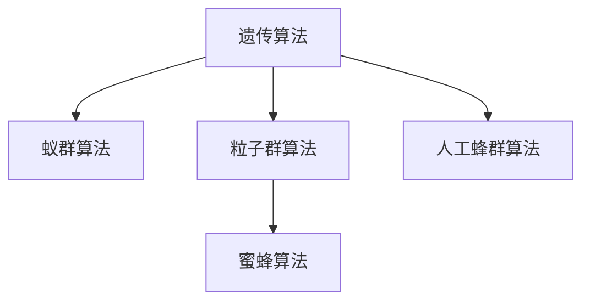

                 

## 1. 背景介绍

### 1.1 问题由来
优化问题是数学、工程学、经济学等多个领域内广泛涉及的重要问题。在实际应用中，我们常常需要找到某个函数的极值点，以最大化或最小化某个指标。例如，在机器学习中，我们通过优化损失函数找到最优的模型参数；在工业生产中，我们通过优化生产流程来提升效率；在经济学中，我们通过优化消费和投资组合来提高回报率。

传统的优化方法，如梯度下降法、牛顿法等，大多基于导数信息。但当问题过于复杂，或无法获取导数时，这些方法往往难以直接应用。生物启发的算法（Bio-Inspired Algorithm）通过模拟自然界的生物行为，探索更加适应复杂问题、具有鲁棒性和收敛速度较快的优化方法，在近年来受到了广泛的关注。

### 1.2 问题核心关键点
生物启发的算法包括遗传算法、蚁群算法、粒子群算法、蜜蜂算法等，各自具有不同的机理和特点。这些算法通过模拟生物的演化过程，逐步找到问题的最优解。

生物启发的算法在优化问题中的核心关键点包括：

- 进化：通过模拟生物的遗传、变异、选择等进化过程，逐步逼近最优解。
- 适应性：适应环境变化的能力，能够自适应地调整策略，适应复杂多变的优化环境。
- 鲁棒性：对噪声和干扰的抵抗能力，能够处理不确定性和随机性。
- 高效性：在复杂空间中搜索高效，适用于大规模优化问题。
- 全局性：具有较强的全局搜索能力，避免局部最优解。

这些关键点使得生物启发的算法在实际应用中具备良好的适应性和普适性，成为优化问题中的一种重要解决手段。

## 2. 核心概念与联系

### 2.1 核心概念概述

为了更好地理解生物启发的算法，本节将介绍几个密切相关的核心概念：

- **遗传算法（Genetic Algorithm, GA）**：通过模拟自然界遗传过程，以适者生存为原则，逐步优化问题的解。包括选择、交叉、变异等操作。
- **蚁群算法（Ant Colony Algorithm, ACA）**：通过模拟蚂蚁在寻找食物路径的行为，构建信息素更新机制，逐步优化问题的解。
- **粒子群算法（Particle Swarm Optimization, PSO）**：通过模拟鸟群在空中的飞行的行为，通过群体智慧逐步优化问题的解。
- **蜜蜂算法（Bees Algorithm, BA）**：通过模拟蜜蜂在蜂巢内外采蜜的行为，构建优化过程。
- **人工蜂群算法（Artificial Bee Colony, ABC）**：对蜜蜂算法的改进，具有更强的全局搜索能力和收敛速度。

这些核心概念之间的逻辑关系可以通过以下Mermaid流程图来展示：



这个流程图展示了大语言模型的核心概念及其之间的关系：

1. 生物启发的算法基于生物进化机理，通过模拟生物行为逐步优化问题的解。
2. 各种算法虽然实现机理不同，但都包含选择、交叉、变异等核心操作。
3. 各算法之间相互影响，形成互补和提升。

## 3. 核心算法原理 & 具体操作步骤
### 3.1 算法原理概述

生物启发的算法通过模拟自然界的生物行为，逐步搜索问题的最优解。核心思想是利用生物进化的机制，构建演化过程，逐步找到问题的最优解。

算法一般包括以下几个步骤：

1. **初始化种群**：随机生成一组解，作为初始种群。
2. **适应度评估**：对每个个体计算适应度，衡量其与目标解的接近程度。
3. **选择操作**：根据适应度选择个体，形成下一代种群。
4. **遗传操作**：对选中的个体进行交叉和变异操作，生成新的个体。
5. **终止条件**：当满足某种终止条件（如达到最大迭代次数、适应度不再提高等），算法结束，选择最优解。

这些步骤通过循环迭代，逐步逼近问题的最优解。

### 3.2 算法步骤详解

这里以遗传算法为例，详细讲解其操作步骤：

**Step 1: 初始化种群**
- 随机生成一组染色体（即解）。
- 设定种群规模和染色体长度。
- 计算每个染色体的适应度。

**Step 2: 选择操作**
- 根据适应度大小，采用轮盘赌、锦标赛等方法选择一定比例的个体。
- 选择操作后，形成下一代种群。

**Step 3: 交叉操作**
- 对选中的个体，采用单点交叉、多点交叉等方法，生成新的个体。
- 保证新个体的合法性，如在一定范围内取值等。

**Step 4: 变异操作**
- 对交叉后得到的个体，根据一定的变异概率进行变异操作。
- 变异操作包括随机交换、随机变异等，生成新的个体。

**Step 5: 适应度评估**
- 对新个体计算适应度，更新种群适应度。
- 重复以上步骤，直到达到终止条件。

### 3.3 算法优缺点

生物启发的算法具有以下优点：

- 适用于复杂多变量优化问题。传统优化方法可能难以处理多变量、高维空间的问题，而生物启发的算法具有较强的全局搜索能力。
- 鲁棒性强。对噪声和干扰具有较强的抵抗能力，能够处理不确定性。
- 高效性。不需要计算导数信息，在复杂空间中搜索效率高。
- 适应性。可以自适应地调整策略，适应环境变化。

同时，这些算法也存在一定的局限性：

- 收敛速度较慢。在复杂空间中，收敛速度较慢，迭代次数较多。
- 随机性较大。算法的随机性可能导致结果不唯一，不同运行结果可能不同。
- 适应性需要调整。算法中的参数需要手动调整，可能影响最终结果。
- 优化能力依赖初始值。初始种群的选取可能影响算法结果，需要多次尝试。

尽管存在这些局限性，但生物启发的算法在实际应用中仍具有重要的价值。

### 3.4 算法应用领域

生物启发的算法在优化问题中具有广泛的应用，涵盖多个领域：

- 机器学习：用于优化神经网络参数、模型选择等。
- 工业工程：用于生产调度、质量控制、工艺优化等。
- 经济学：用于投资组合优化、市场预测等。
- 物流管理：用于路线规划、配送优化等。
- 生物学：用于基因序列分析、蛋白质结构优化等。
- 游戏设计：用于AI角色控制、路径规划等。

这些领域的应用，展示了生物启发的算法在解决复杂优化问题上的强大能力。

## 4. 数学模型和公式 & 详细讲解 & 举例说明（备注：数学公式请使用latex格式，latex嵌入文中独立段落使用 $$，段落内使用 $)
### 4.1 数学模型构建

生物启发的算法通常通过适应度函数来评估每个个体的适应度。适应度函数可以是一个标量值，表示个体与最优解的接近程度。

例如，对于最小化问题，适应度函数定义为：

$$
F(x) = f(x) + C \times d(x)
$$

其中 $f(x)$ 为目标函数，$d(x)$ 为个体与最优解的距离，$C$ 为正的惩罚系数。

在遗传算法中，适应度函数需要满足以下条件：

- 适应度值越小，代表个体越接近最优解。
- 适应度函数应该能够区分最优解和次优解。
- 适应度函数应该稳定，不会随迭代次数变化剧烈波动。

### 4.2 公式推导过程

以遗传算法为例，推导适应度函数的计算公式。

对于遗传算法，每个个体由一组染色体表示，假设染色体长度为 $n$，个体集合为 $P=\{p_1, p_2, ..., p_N\}$，其中 $N$ 为种群规模。目标函数为 $f$，适应度函数为 $F$。

适应度函数计算公式为：

$$
F(p_i) = f(p_i) + C \times d(p_i)
$$

其中 $d(p_i)$ 为个体 $p_i$ 与最优解的距离。

在遗传算法中，通常使用以下两种计算距离的方法：

1. 曼哈顿距离：

$$
d(p_i) = \sum_{j=1}^n |x_i^j - x^j|
$$

2. 欧式距离：

$$
d(p_i) = \sqrt{\sum_{j=1}^n (x_i^j - x^j)^2}
$$

其中 $x$ 为目标解，$x_i$ 为个体 $p_i$ 的解。

### 4.3 案例分析与讲解

以制造企业的生产调度优化为例，分析生物启发的算法如何应用于实际问题。

假设有一个生产系统，需要优化生产调度，最小化生产成本。生产调度包括机器选择、物料分配、生产时间等。

1. **初始化种群**：随机生成一组生产调度方案，作为初始种群。每个调度方案表示为一条染色体，包含机器选择、物料分配等信息。

2. **适应度评估**：计算每个调度方案的总成本，作为适应度。成本包括生产时间、物料成本、机器成本等。

3. **选择操作**：根据适应度大小，选择一定比例的个体。

4. **交叉操作**：对选中的个体，随机交换部分机器选择、物料分配等信息，生成新的个体。

5. **变异操作**：对交叉后得到的个体，根据一定的变异概率进行随机交换、随机变异等操作，生成新的个体。

6. **适应度评估**：对新个体计算适应度，更新种群适应度。

7. **终止条件**：当达到最大迭代次数或适应度不再提高时，选择最优解作为最终的生产调度方案。

## 5. 项目实践：代码实例和详细解释说明
### 5.1 开发环境搭建

在进行生物启发的算法实践前，我们需要准备好开发环境。以下是使用Python进行遗传算法开发的环境配置流程：

1. 安装Anaconda：从官网下载并安装Anaconda，用于创建独立的Python环境。

2. 创建并激活虚拟环境：
```bash
conda create -n ga-env python=3.8 
conda activate ga-env
```

3. 安装必要的库：
```bash
conda install numpy scipy pandas matplotlib scikit-learn scikit-optimize
```

完成上述步骤后，即可在`ga-env`环境中开始遗传算法实践。

### 5.2 源代码详细实现

下面我们以最小化问题为例，给出使用Python实现遗传算法的代码。

首先，定义问题函数：

```python
import numpy as np

def problem_function(x):
    return np.sum(x) + np.dot(x, np.dot(x, np.linalg.inv(x)))
```

然后，定义适应度函数：

```python
def fitness_function(x):
    return problem_function(x) + 0.01 * np.linalg.norm(x)
```

接下来，实现遗传算法的核心代码：

```python
def genetic_algorithm(function, dimensions, population_size, num_generations, mutation_rate):
    # 初始化种群
    populations = np.random.rand(population_size, dimensions) * 0.1
    fitness_values = np.zeros(population_size)
    for i in range(population_size):
        fitness_values[i] = fitness_function(populations[i])
    best_fitness = np.min(fitness_values)
    best_population = populations[np.argmin(fitness_values)]
    
    for generation in range(num_generations):
        # 选择操作
        selected_indices = np.random.choice(population_size, size=int(population_size * 0.5), replace=False)
        selected_populations = populations[selected_indices]
        selected_fitness_values = fitness_values[selected_indices]
        
        # 交叉操作
        for i in range(int(population_size * 0.5)):
            parent1 = selected_populations[i]
            parent2 = selected_populations[np.random.randint(0, int(population_size * 0.5))]
            crossover_point = np.random.randint(0, dimensions)
            child1 = np.concatenate((parent1[:crossover_point], parent2[crossover_point:]))
            child2 = np.concatenate((parent2[:crossover_point], parent1[crossover_point:]))
            
            # 变异操作
            for j in range(dimensions):
                if np.random.rand() < mutation_rate:
                    if np.random.rand() < 0.5:
                        child1[j] += np.random.randn()
                    else:
                        child1[j] -= np.random.randn()
            
        # 计算适应度
        child_fitness_values = []
        for j in range(2):
            child_fitness_values.append(fitness_function(child1))
            child_fitness_values.append(fitness_function(child2))
        
        # 更新种群
        new_populations = np.concatenate((populations, child1, child2))
        new_fitness_values = np.concatenate((fitness_values, child_fitness_values))
        best_fitness = np.min(new_fitness_values)
        best_population = new_populations[np.argmin(new_fitness_values)]
        
        # 更新种群
        populations = new_populations
        fitness_values = new_fitness_values
    
    return best_population, best_fitness
```

最后，启动遗传算法并在目标函数上测试：

```python
# 测试遗传算法
best_solution, best_fitness = genetic_algorithm(problem_function, dimensions=10, population_size=100, num_generations=500, mutation_rate=0.1)
print("Best solution: ", best_solution)
print("Best fitness: ", best_fitness)
```

以上就是使用Python实现遗传算法的完整代码实现。可以看到，遗传算法的核心代码通过随机初始化种群、适应度评估、选择、交叉、变异等步骤，逐步逼近最优解。

### 5.3 代码解读与分析

让我们再详细解读一下关键代码的实现细节：

**遗传算法函数**：
- 定义函数`genetic_algorithm`，接受目标函数、种群规模、迭代次数、变异概率等参数。
- 初始化种群、计算适应度、记录最优解和适应度。
- 循环迭代，每次生成下一代种群，更新最优解和适应度。
- 返回最优解和适应度。

**问题函数和适应度函数**：
- 问题函数`problem_function`，接受一组变量$x$，计算目标函数的值。
- 适应度函数`fitness_function`，在问题函数的基础上加入惩罚项，计算适应度值。

**遗传算法核心步骤**：
- 选择操作：使用`np.random.choice`随机选择种群中的个体。
- 交叉操作：随机交换部分变量，生成新的个体。
- 变异操作：根据变异概率，对新个体进行随机变异操作。
- 适应度计算：使用适应度函数计算新个体的适应度值。
- 更新种群：更新种群和适应度值。

**运行结果展示**：
- 输出最优解和最优适应度，反映算法的收敛效果。

可以看到，遗传算法通过模拟自然界的进化过程，逐步优化问题的解。算法的核心在于随机性、变异和选择等操作，通过迭代逼近最优解。

## 6. 实际应用场景
### 6.1 供应链优化

在供应链管理中，优化问题常常涉及多个环节，如订单分配、运输路径、库存管理等。这些问题通常具有高度非线性、多变量、复杂交互的特点，传统优化方法难以应对。

生物启发的算法，如遗传算法、蚁群算法，可以应用于供应链优化问题，通过模拟生物行为，逐步优化供应链配置。例如，在配送路径规划中，通过模拟蚂蚁寻找食物的行为，构建信息素更新机制，逐步优化配送路径，降低运输成本，提高配送效率。

### 6.2 医疗诊断

在医疗领域，优化问题涉及大量数据和复杂计算，如医疗资源的分配、治疗方案的选择等。生物启发的算法，如遗传算法、人工蜂群算法，可以应用于医疗诊断问题，通过模拟生物行为，逐步优化医疗方案，提高诊断精度。

例如，在治疗方案选择中，通过模拟蜜蜂采蜜的行为，构建优化过程，逐步优化治疗方案，降低患者风险，提高治疗效果。

### 6.3 金融投资

在金融领域，优化问题涉及市场预测、投资组合选择、风险管理等。生物启发的算法，如粒子群算法、人工蜂群算法，可以应用于金融投资问题，通过模拟生物行为，逐步优化投资组合，提高投资回报率。

例如，在投资组合选择中，通过模拟粒子群的行为，构建优化过程，逐步优化投资组合，降低风险，提高收益。

### 6.4 未来应用展望

随着生物启发的算法在实际应用中不断积累，未来将在更多领域得到应用，为复杂优化问题提供新的解决手段：

- 智能制造：应用于制造企业的生产调度、设备维护、质量控制等，提高生产效率，降低成本。
- 交通规划：应用于城市交通路网规划、公共交通调度等，提高交通效率，缓解交通压力。
- 环境治理：应用于水资源优化、废物处理等，提高环境治理效果，减少资源浪费。
- 能源管理：应用于电力系统调度和能源分配等，提高能源利用效率，降低能源消耗。
- 生物信息学：应用于基因序列分析、蛋白质结构优化等，提高生物信息学研究效率，推动生命科学发展。

这些领域的广泛应用，将进一步提升生物启发的算法的价值，为复杂优化问题提供新的解决途径。

## 7. 工具和资源推荐
### 7.1 学习资源推荐

为了帮助开发者系统掌握生物启发的算法的理论基础和实践技巧，这里推荐一些优质的学习资源：

1. 《遗传算法与人工神经网络》：详细介绍了遗传算法的基本原理、应用场景和实现方法。
2. 《蚁群算法及其应用》：系统讲解了蚁群算法的基本原理和应用案例，适合初学者入门。
3. 《粒子群优化算法及其应用》：介绍了粒子群算法的基本原理和应用领域，适合深入学习。
4. 《人工蜂群算法及其应用》：系统讲解了人工蜂群算法的基本原理和应用案例，适合初学者入门。
5. 《Bio-Inspired Algorithms for Multimodal Optimization》：涉及多种生物启发的算法，适合深入研究。
6. 《Optimization by Analogy: Design, Analysis, and Application of Bio-Inspired Algorithms》：系统讲解了多种生物启发的算法的原理、实现和应用，适合深入学习。

通过对这些资源的学习实践，相信你一定能够快速掌握生物启发的算法的精髓，并用于解决实际的优化问题。

### 7.2 开发工具推荐

高效的开发离不开优秀的工具支持。以下是几款用于生物启发的算法开发的常用工具：

1. Python：广泛使用的编程语言，拥有丰富的科学计算库和可视化工具，适合生物启发的算法实现。
2. R：专门用于统计分析和科学计算的语言，拥有丰富的数据分析和可视化库，适合生物启发的算法实现。
3. Matlab：强大的科学计算和数值分析工具，适合生物启发的算法实现和仿真。
4. GApy：遗传算法的Python实现库，提供了丰富的遗传算法工具和算法优化。
5. PyEvolve：遗传算法的Python实现库，提供了丰富的遗传算法工具和算法优化。
6. AntPy：蚁群算法的Python实现库，提供了丰富的蚁群算法工具和算法优化。

合理利用这些工具，可以显著提升生物启发的算法开发效率，加快创新迭代的步伐。

### 7.3 相关论文推荐

生物启发的算法的发展源于学界的持续研究。以下是几篇奠基性的相关论文，推荐阅读：

1. A Survey of Particle Swarm Optimization Techniques: Convergence Problems and Solutions（粒子群算法的综述）：介绍了粒子群算法的基本原理、实现方法和应用场景，适合深入学习。
2. A Survey on Bio-Inspired Optimization Algorithms with the Application of Big Data（生物启发的优化算法综述）：涉及多种生物启发的算法，适合深入研究。
3. A Review of Artificial Bee Colony Algorithm and Its Applications（人工蜂群算法的综述）：系统讲解了人工蜂群算法的基本原理和应用案例，适合初学者入门。
4. An Introduction to Genetic Algorithms（遗传算法简介）：详细介绍了遗传算法的基本原理和实现方法，适合初学者入门。
5. A Tutorial on Ant Colony Optimization for Complex Functions（蚁群算法教程）：介绍了蚁群算法的基本原理和实现方法，适合初学者入门。

这些论文代表了大语言模型微调技术的发展脉络。通过学习这些前沿成果，可以帮助研究者把握学科前进方向，激发更多的创新灵感。

## 8. 总结：未来发展趋势与挑战
### 8.1 总结

本文对生物启发的算法在优化问题中的应用进行了全面系统的介绍。首先阐述了生物启发的算法的研究背景和意义，明确了算法在复杂优化问题中的独特价值。其次，从原理到实践，详细讲解了遗传算法、蚁群算法、粒子群算法等核心算法的操作步骤，给出了生物启发的算法开发代码实例。同时，本文还广泛探讨了生物启发的算法在供应链优化、医疗诊断、金融投资等多个行业领域的应用前景，展示了算法在复杂优化问题中的强大能力。最后，本文精选了生物启发的算法的学习资源、开发工具和相关论文，力求为读者提供全方位的技术指引。

通过本文的系统梳理，可以看到，生物启发的算法在优化问题中具有广泛的应用价值，其鲁棒性、高效性和全局搜索能力，使其成为解决复杂优化问题的有力工具。未来，随着算法的不断演进和优化，生物启发的算法必将在更多领域得到应用，为优化问题提供更加高效、灵活、鲁棒的解决方案。

### 8.2 未来发展趋势

展望未来，生物启发的算法将在优化问题中呈现以下几个发展趋势：

1. **算法融合**：不同生物启发的算法之间将进行更多融合，取长补短，形成更高效、更鲁棒的优化方法。
2. **多模态优化**：生物启发的算法将更多地应用于多模态数据优化问题，如多目标优化、组合优化等。
3. **自适应优化**：算法将具有更强的自适应能力，能够根据问题特点自适应地调整策略，提高优化效果。
4. **大规模优化**：算法将能够处理更大规模的优化问题，适应海量数据和高维空间的复杂优化问题。
5. **融合深度学习**：生物启发的算法将更多地融合深度学习技术，提高算法的精度和收敛速度。
6. **强化学习融合**：算法将更多地融合强化学习技术，提升算法的决策能力和稳定性。

这些趋势将进一步提升生物启发的算法的适用范围和性能，为复杂优化问题提供更加高效、灵活的解决方案。

### 8.3 面临的挑战

尽管生物启发的算法在优化问题中已经取得了一定的成果，但在迈向更加智能化、普适化应用的过程中，仍面临诸多挑战：

1. **算法收敛速度**：对于复杂问题，算法收敛速度较慢，需要更多的迭代次数。
2. **算法复杂性**：算法的实现复杂度较高，需要较高的计算资源和时间成本。
3. **算法鲁棒性**：对于噪声和干扰的抵抗能力较弱，需要更多的优化策略。
4. **算法精度**：算法在复杂问题上的精度有限，需要更多的优化方法和技术。
5. **算法适用性**：算法的适用性有限，难以处理某些特定类型的优化问题。
6. **算法可解释性**：算法的决策过程缺乏可解释性，难以进行调试和优化。

尽管存在这些挑战，但生物启发的算法在优化问题中的独特优势和普适性，使其在未来仍具有重要的研究价值和应用前景。

### 8.4 研究展望

未来，生物启发的算法需要在以下几个方向进行更多的研究：

1. **算法优化**：通过改进算法结构和优化算法参数，提高算法的收敛速度和精度。
2. **算法融合**：将多种生物启发的算法进行融合，取长补短，形成更加高效的优化方法。
3. **算法应用**：将生物启发的算法应用于更多领域，如交通规划、医疗诊断、金融投资等。
4. **算法融合深度学习**：将生物启发的算法与深度学习技术进行融合，提升算法的精度和收敛速度。
5. **算法融合强化学习**：将生物启发的算法与强化学习技术进行融合，提升算法的决策能力和稳定性。

这些研究方向将进一步提升生物启发的算法的适用范围和性能，为复杂优化问题提供更加高效、灵活的解决方案。

## 9. 附录：常见问题与解答

**Q1：如何选择合适的生物启发的算法？**

A: 选择合适的生物启发的算法需要考虑以下几个因素：

1. 问题类型：如最小化、最大化、多目标优化等。
2. 问题规模：如小规模、中规模、大规模等。
3. 数据类型：如连续型、离散型、多模态等。
4. 计算资源：如计算资源充足、计算资源有限等。
5. 算法复杂度：如算法复杂度较低、算法复杂度较高等。

在实际应用中，可以先通过文献调研和初步实验，了解不同算法的适用性和性能，再进行选择。

**Q2：生物启发的算法如何优化问题？**

A: 生物启发的算法通过模拟自然界的生物行为，逐步搜索问题的最优解。具体步骤如下：

1. 初始化种群，随机生成一组解。
2. 适应度评估，计算每个个体的适应度。
3. 选择操作，根据适应度大小选择个体。
4. 遗传操作，如交叉、变异等，生成新的个体。
5. 适应度计算，更新种群适应度。
6. 终止条件，当达到最大迭代次数或适应度不再提高时，选择最优解。

这些步骤通过循环迭代，逐步逼近最优解。

**Q3：生物启发的算法如何处理大规模优化问题？**

A: 处理大规模优化问题，可以通过以下几种方法：

1. 并行计算：将优化问题分解为多个子问题，并行计算，提高计算效率。
2. 分布式计算：将优化问题分布到多个计算节点，提高计算效率。
3. 近似算法：使用近似算法，如模拟退火、遗传算法等，提高算法效率。
4. 优化策略：使用启发式优化策略，如局部搜索、全局搜索等，提高算法精度。
5. 算法融合：将多种生物启发的算法进行融合，形成更高效的优化方法。

这些方法可以结合使用，提高生物启发的算法处理大规模优化问题的能力。

**Q4：生物启发的算法如何处理多模态数据优化问题？**

A: 处理多模态数据优化问题，可以通过以下几种方法：

1. 数据融合：将多模态数据进行融合，构建统一的数据表示。
2. 多模态模型：使用多模态模型，如深度学习模型，进行优化。
3. 多目标优化：将多模态数据优化问题转化为多目标优化问题，进行优化。
4. 多算法融合：将多种生物启发的算法进行融合，形成更高效的优化方法。
5. 算法优化：通过改进算法结构和优化算法参数，提高算法的收敛速度和精度。

这些方法可以结合使用，提高生物启发的算法处理多模态数据优化问题的能力。

**Q5：生物启发的算法如何提升算法的精度和收敛速度？**

A: 提升算法的精度和收敛速度，可以通过以下几种方法：

1. 改进算法结构和优化算法参数，提高算法的精度和收敛速度。
2. 引入深度学习技术，提高算法的精度和收敛速度。
3. 使用多模态模型，提高算法的精度和收敛速度。
4. 引入强化学习技术，提高算法的精度和收敛速度。
5. 使用并行计算、分布式计算等方法，提高算法的计算效率。

这些方法可以结合使用，提高生物启发的算法的精度和收敛速度。

---

作者：禅与计算机程序设计艺术 / Zen and the Art of Computer Programming

