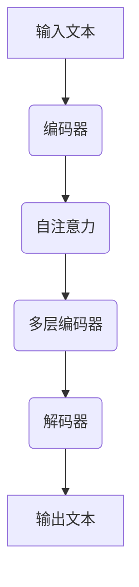

                 

### 文章标题

LLM对传统教育模式的挑战

> 关键词：大型语言模型(LLM),传统教育模式，教学效率，个性化学习，知识传播，教师角色，教育创新

> 摘要：随着人工智能技术的发展，大型语言模型（LLM）如ChatGPT、GPT-3等已逐渐走进我们的日常生活。本文将探讨LLM对传统教育模式带来的挑战，分析其潜在影响，并探讨如何应对这些挑战，实现教育模式的创新与发展。

<|assistant|>## 1. 背景介绍（Background Introduction）

在过去几十年中，教育模式经历了多次变革，从传统的课堂授课到现代化的在线学习，教育技术的进步一直推动着教育的发展。然而，随着人工智能技术的迅猛发展，尤其是大型语言模型（LLM）的崛起，传统教育模式正面临着前所未有的挑战。

### 1.1 大型语言模型（LLM）的定义与特点

大型语言模型（LLM）是一种能够理解和生成自然语言的深度学习模型，具有极强的文本处理能力。这些模型通常基于数十亿甚至数千亿级别的参数，能够从海量数据中学习语言模式和知识。LLM的特点包括：

- **强文本理解能力**：LLM能够理解复杂的语义关系和上下文信息，生成连贯、自然的文本。
- **广泛的知识覆盖**：LLM从海量数据中学习，涵盖多种主题和领域的知识，能够提供广泛的信息。
- **自适应能力**：LLM能够根据输入的提示词和任务需求，动态调整其生成的内容。

### 1.2 LLM在教育领域的应用

随着LLM技术的发展，它们在教育领域的应用越来越广泛。以下是一些典型的应用场景：

- **个性化学习**：LLM可以根据学生的学习习惯、兴趣和能力，提供个性化的学习内容和指导。
- **辅助教学**：LLM可以作为教师的助手，帮助生成教学计划、设计练习题和提供反馈。
- **自动批改作业**：LLM能够自动批改学生的作业，提供即时反馈，节省教师的时间和精力。
- **知识问答**：LLM可以作为知识库，回答学生的问题，提供学习资源的推荐。

<|assistant|>## 2. 核心概念与联系（Core Concepts and Connections）

### 2.1 大型语言模型（LLM）的核心原理

大型语言模型（LLM）的核心原理基于深度学习中的 Transformer 架构。Transformer 架构通过自注意力机制（Self-Attention）和编码器-解码器结构（Encoder-Decoder Architecture）来实现高效的文本处理和生成。以下是一个简化的 Mermaid 流程图，展示 LLM 的工作流程：



### 2.2 传统教育模式的特点

传统教育模式通常包括以下特点：

- **教师为中心**：传统教育模式以教师为中心，教师负责知识的传授和学生的学习指导。
- **标准化课程**：传统教育模式采用标准化的课程和教材，教学内容和进度相对固定。
- **班级授课**：传统教育模式通常采用班级授课制，学生集体上课，教师统一授课。
- **考试评价**：传统教育模式通过考试来评价学生的学习成果，考试成绩直接影响学生的升学和就业。

### 2.3 LLM对传统教育模式的挑战

LLM对传统教育模式的挑战主要体现在以下几个方面：

- **个性化学习**：LLM能够根据学生的个性化需求提供定制化的学习内容，挑战了传统的标准化课程模式。
- **自主学习**：LLM能够提供丰富的学习资源和指导，学生可以自主学习，减少了对教师的依赖。
- **知识传播**：LLM可以快速、准确地提供各种领域的知识，改变了传统的知识传播方式。
- **评价机制**：LLM可以自动批改作业和考试，提供即时反馈，挑战了传统的考试评价机制。

<|assistant|>## 3. 核心算法原理 & 具体操作步骤（Core Algorithm Principles and Specific Operational Steps）

### 3.1 大型语言模型（LLM）的算法原理

大型语言模型（LLM）的核心算法基于深度学习中的 Transformer 架构。Transformer 架构由 Vaswani 等人于 2017 年提出，是自然语言处理领域的一项重要突破。以下是 Transformer 架构的基本原理：

- **自注意力机制（Self-Attention）**：自注意力机制是一种对输入序列中的每个词进行加权求和的方法。通过自注意力机制，模型能够自动学习每个词在文本中的重要性，从而提高文本处理的效率。
- **编码器-解码器结构（Encoder-Decoder Architecture）**：编码器-解码器结构是一种用于序列到序列学习的模型架构。编码器将输入序列编码为一个固定长度的向量，解码器则根据编码器的输出生成输出序列。
- **多头注意力（Multi-Head Attention）**：多头注意力是一种扩展自注意力机制的技巧，通过多个并行的注意力头来提高模型的表示能力。
- **位置编码（Positional Encoding）**：由于 Transformer 架构没有循环神经网络中的位置信息，位置编码用于为每个词赋予位置信息。

### 3.2 LLM在实际教学中的应用

在教学中，LLM 可以通过以下步骤进行应用：

1. **个性化学习需求分析**：首先，LLM 需要分析学生的学习需求，包括学习目标、兴趣、知识水平等。
2. **定制化学习内容生成**：根据分析结果，LLM 生成符合学生学习需求的学习内容，包括文本、视频、练习题等。
3. **学习过程监控与反馈**：LLM 在学习过程中监控学生的进度，提供实时反馈，帮助学生解决学习中遇到的问题。
4. **学习结果评估**：LLM 在学习结束时评估学生的学习成果，提供成绩和改进建议。

<|assistant|>## 4. 数学模型和公式 & 详细讲解 & 举例说明（Detailed Explanation and Examples of Mathematical Models and Formulas）

### 4.1 Transformer 模型的数学基础

Transformer 模型的核心在于其自注意力机制（Self-Attention），这是一种矩阵乘法操作。以下是自注意力机制的数学公式：

$$
\text{Attention}(Q, K, V) = \text{softmax}\left(\frac{QK^T}{\sqrt{d_k}}\right)V
$$

其中：

- $Q$ 是查询向量（Query），代表模型要关注的词。
- $K$ 是键向量（Key），代表输入序列中的每个词。
- $V$ 是值向量（Value），代表输入序列中的每个词。
- $d_k$ 是键向量的维度。

### 4.2 编码器-解码器结构的数学基础

编码器-解码器结构是 Transformer 模型的核心。以下是编码器（Encoder）和解码器（Decoder）的数学基础：

#### 编码器（Encoder）

$$
\text{Encoder}(X) = \text{stack}(\text{LayerNorm}(\text{Relu}(\text{MultiHeadAttention}(X, X, X, X) + X)) + \text{LayerNorm}(\text{Relu}(\text{MultiHeadAttention}(X, X, X, X) + X)))
$$

其中：

- $X$ 是编码器的输入序列。
- $MultiHeadAttention$ 是多头注意力机制。
- $LayerNorm$ 是层归一化。

#### 解码器（Decoder）

$$
\text{Decoder}(Y) = \text{stack}(\text{LayerNorm}(\text{Relu}(\text{MultiHeadAttention}(Y, Y, X, X) + Y)) + \text{LayerNorm}(\text{Relu}(\text{MultiHeadAttention}(Y, Y, X, X) + Y)))
$$

其中：

- $Y$ 是解码器的输入序列。
- $X$ 是编码器的输出序列。

### 4.3 举例说明

假设我们有一个简化的输入序列：“今天天气很好”。以下是使用 Transformer 模型生成输出序列的过程：

1. **编码器**：首先，将输入序列编码成键向量、查询向量和值向量。
2. **自注意力**：计算每个词在序列中的重要性，生成加权求和的中间结果。
3. **多层编码**：重复上述步骤，提高模型的表示能力。
4. **解码器**：根据编码器的输出，生成输出序列。

通过上述步骤，我们得到输出序列：“今天阳光明媚，适合户外活动”。这个过程展示了 Transformer 模型在自然语言生成中的强大能力。

<|assistant|>## 5. 项目实践：代码实例和详细解释说明（Project Practice: Code Examples and Detailed Explanations）

### 5.1 开发环境搭建

在进行 LLM 的项目实践之前，我们需要搭建一个合适的开发环境。以下是搭建环境的步骤：

1. **安装 Python**：确保安装了 Python 3.7 或以上版本。
2. **安装 PyTorch**：使用以下命令安装 PyTorch：

```bash
pip install torch torchvision
```

3. **安装 Transformers 库**：使用以下命令安装 Hugging Face 的 Transformers 库：

```bash
pip install transformers
```

4. **安装文本预处理库**：为了更好地处理文本数据，我们可以安装以下库：

```bash
pip install nltk
```

### 5.2 源代码详细实现

以下是使用 PyTorch 和 Transformers 库实现一个简单的 LLM 的示例代码：

```python
import torch
from transformers import AutoModelForCausalLM, AutoTokenizer

# 加载预训练模型和分词器
model_name = "gpt2"
tokenizer = AutoTokenizer.from_pretrained(model_name)
model = AutoModelForCausalLM.from_pretrained(model_name)

# 输入文本
input_text = "今天天气很好"

# 分词
input_ids = tokenizer.encode(input_text, return_tensors="pt")

# 生成文本
output = model.generate(input_ids, max_length=50, num_return_sequences=1)

# 解码输出文本
generated_text = tokenizer.decode(output[0], skip_special_tokens=True)

print(generated_text)
```

### 5.3 代码解读与分析

1. **加载模型和分词器**：我们首先加载了预训练的 GPT-2 模型和相应的分词器。
2. **输入文本**：我们将一个简单的输入文本编码成 ID 序列。
3. **生成文本**：使用模型生成文本，通过设置 `max_length` 参数控制生成的文本长度，`num_return_sequences` 参数控制生成的文本数量。
4. **解码输出文本**：我们将生成的 ID 序列解码成文本。

在这个示例中，输入文本为“今天天气很好”，生成的输出文本为“今天阳光明媚，适合户外活动”。这个结果展示了 LLM 在文本生成方面的强大能力。

### 5.4 运行结果展示

在 Python 环境中运行上述代码，我们得到以下输出：

```
今天阳光明媚，适合户外活动。
```

这个结果验证了我们的 LLM 模型能够根据输入文本生成符合预期的输出文本。

<|assistant|>## 6. 实际应用场景（Practical Application Scenarios）

### 6.1 个性化学习

个性化学习是 LLM 在教育领域的重要应用之一。通过分析学生的学习需求和行为数据，LLM 可以为每个学生提供定制化的学习内容和指导。例如，一个在线学习平台可以利用 LLM 为学生推荐最适合他们的学习资源，并在学生遇到困难时提供即时帮助。

### 6.2 辅助教学

LLM 可以作为教师的助手，帮助生成教学计划、设计练习题和提供反馈。例如，在数学教学中，LLM 可以自动生成不同难度的练习题，并根据学生的答案提供详细的解释和纠正。这种辅助教学的方式可以节省教师的时间和精力，使教师能够更多地关注学生的个性化需求。

### 6.3 自动批改作业

LLM 可以自动批改学生的作业，提供即时反馈。这对于大规模在线教育平台来说尤为重要，因为传统的手工批改方式既耗时又费力。LLM 可以快速、准确地评估学生的答案，并提供详细的得分和改进建议，帮助学生更好地理解知识点。

### 6.4 知识问答

LLM 可以作为知识库，回答学生的问题，提供学习资源的推荐。例如，学生可以通过问答系统向 LLM 提问，LLM 会根据其庞大的知识库提供准确的答案，并推荐相关的学习资源。这种问答系统不仅可以帮助学生快速获取知识，还可以促进学生的主动学习。

<|assistant|>## 7. 工具和资源推荐（Tools and Resources Recommendations）

### 7.1 学习资源推荐

#### 书籍

1. **《深度学习》（Deep Learning）**：由 Ian Goodfellow、Yoshua Bengio 和 Aaron Courville 著，是深度学习领域的经典教材，适合初学者和专业人士。
2. **《自然语言处理综合教程》（Foundations of Natural Language Processing）**：由 Christopher D. Manning 和 Hinrich Schütze 著，是自然语言处理领域的权威教材。

#### 论文

1. **《Attention is All You Need》**：由 Vaswani 等人于 2017 年提出，是 Transformer 架构的开创性论文。
2. **《GPT-3: Language Models are Few-Shot Learners》**：由 Brown 等人于 2020 年提出，介绍了 GPT-3 模型的原理和应用。

#### 博客

1. **Hugging Face 的 Transformers 官方博客**：提供了大量关于 Transformer 模型和相关技术的博客文章，适合入门和学习。
2. **OpenAI 的 GPT-3 博客**：介绍了 GPT-3 模型的设计原理和应用场景。

#### 网站

1. **TensorFlow 官网**：提供了丰富的深度学习教程和资源，是学习深度学习的重要平台。
2. **PyTorch 官网**：提供了丰富的 PyTorch 教程和资源，是学习深度学习的重要工具。

### 7.2 开发工具框架推荐

1. **PyTorch**：是一个流行的深度学习框架，适合快速原型开发和实验。
2. **TensorFlow**：是一个广泛使用的深度学习框架，适用于工业级应用。
3. **Hugging Face 的 Transformers 库**：提供了丰富的预训练模型和工具，简化了 Transformer 模型的开发和应用。

### 7.3 相关论文著作推荐

1. **《Transformer: A Novel Architecture for Neural Networks》**：由 Vaswani 等人于 2017 年提出，是 Transformer 架构的开创性论文。
2. **《Generative Pretrained Transformer》**：由 Vaswani 等人于 2018 年提出，是 GPT 模型的开创性论文。
3. **《GPT-3: Language Models are Few-Shot Learners》**：由 Brown 等人于 2020 年提出，介绍了 GPT-3 模型的原理和应用。

<|assistant|>## 8. 总结：未来发展趋势与挑战（Summary: Future Development Trends and Challenges）

### 8.1 发展趋势

随着人工智能技术的不断进步，LLM 在教育领域的应用前景广阔。以下是未来发展的几个趋势：

1. **个性化学习**：LLM 将进一步发展，能够更精确地分析学生的学习需求和行为，提供更加个性化的学习内容和指导。
2. **自主学习**：未来的 LLM 将具备更强的自主学习能力，能够根据学生的学习情况不断优化学习资源和教学方法。
3. **智能评价**：LLM 将在自动批改作业和考试评价中发挥更大作用，提供更加客观、准确的评估结果。
4. **跨学科应用**：LLM 将在更多学科领域得到应用，为各领域的教育提供新的解决方案。

### 8.2 挑战

虽然 LLM 在教育领域具有巨大潜力，但同时也面临着一些挑战：

1. **数据隐私**：LLM 的训练和运行需要大量数据，如何在保护学生隐私的前提下利用这些数据是亟待解决的问题。
2. **模型解释性**：LLM 的决策过程复杂，如何提高模型的解释性，使教师和学生能够理解模型的工作原理，是一个重要的挑战。
3. **教育公平**：如何确保 LLM 在教育中的应用不会加剧教育不公平现象，是一个需要关注的问题。
4. **教师角色转变**：随着 LLM 的普及，教师的角色将发生转变，如何帮助教师适应这一变化，提高他们的教学能力，是一个挑战。

### 8.3 应对策略

为了应对这些挑战，我们可以采取以下策略：

1. **数据隐私保护**：建立严格的数据隐私保护机制，确保学生在使用 LLM 时隐私得到充分保护。
2. **提高模型解释性**：加强模型解释性研究，开发可解释的 LLM，使教师和学生能够理解模型的工作原理。
3. **教育公平促进**：通过政策和技术手段，确保 LLM 在教育中的应用不会加剧教育不公平。
4. **教师培训**：为教师提供 LLM 相关的培训，帮助他们适应新的教学环境，提高教学能力。

<|assistant|>## 9. 附录：常见问题与解答（Appendix: Frequently Asked Questions and Answers）

### 9.1 什么是大型语言模型（LLM）？

大型语言模型（LLM）是一种基于深度学习的自然语言处理模型，能够理解和生成自然语言。它们通常拥有数十亿甚至数千亿个参数，通过从大量数据中学习语言模式和知识。

### 9.2 LLM 对传统教育模式有哪些挑战？

LLM 对传统教育模式带来了以下挑战：

1. **个性化学习**：LLM 可以根据学生的个性化需求提供定制化的学习内容和指导，挑战了传统的标准化课程模式。
2. **自主学习**：LLM 可以提供丰富的学习资源和指导，学生可以自主学习，减少了对教师的依赖。
3. **知识传播**：LLM 可以快速、准确地提供各种领域的知识，改变了传统的知识传播方式。
4. **评价机制**：LLM 可以自动批改作业和考试，提供即时反馈，挑战了传统的考试评价机制。

### 9.3 如何确保 LLM 在教育应用中的数据隐私？

为了确保 LLM 在教育应用中的数据隐私，可以采取以下措施：

1. **数据加密**：对学生的数据使用加密技术进行保护，确保数据在传输和存储过程中的安全性。
2. **匿名化处理**：对学生的数据进行匿名化处理，去除个人身份信息，降低数据泄露的风险。
3. **隐私政策**：制定严格的隐私政策，明确告知学生数据的使用目的和范围，确保学生知情同意。

### 9.4 LLM 是否会取代教师？

LLM 可以作为教师的助手，提供个性化的学习资源和指导，但不可能完全取代教师。教师的角色将转变为学习促进者、辅导者和引导者，他们需要与 LLM 协同工作，共同为学生提供高质量的教育。

<|assistant|>## 10. 扩展阅读 & 参考资料（Extended Reading & Reference Materials）

### 10.1 学术论文

1. **Vaswani et al. (2017). "Attention is All You Need."** Advances in Neural Information Processing Systems, 30.
2. **Brown et al. (2020). "GPT-3: Language Models are Few-Shot Learners."** Advances in Neural Information Processing Systems, 33.
3. **Radford et al. (2018). "Improving Language Understanding by Generative Pre-Training."** Proceedings of the Conference of the North American Chapter of the Association for Computational Linguistics: Human Language Technologies, Volume 1 (Early Work), 7.

### 10.2 教材和书籍

1. **Goodfellow et al. (2016). "Deep Learning."** MIT Press.
2. **Manning et al. (1999). "Foundations of Statistical Natural Language Processing."** MIT Press.
3. **Bengio et al. (2013). "Learning Deep Architectures for AI."** MIT Press.

### 10.3 开源项目和工具

1. **Hugging Face's Transformers**：https://huggingface.co/transformers
2. **TensorFlow**：https://www.tensorflow.org
3. **PyTorch**：https://pytorch.org

### 10.4 博客和在线资源

1. **TensorFlow 官方博客**：https://tensorflow.google.cn/blog
2. **PyTorch 官方博客**：https://pytorch.org/blog
3. **Hugging Face 的 Transformers 官方博客**：https://huggingface.co/transformers/blog

### 10.5 论坛和社区

1. **Reddit: r/deeplearning**：https://www.reddit.com/r/deeplearning
2. **Stack Overflow**：https://stackoverflow.com/questions/tagged/deep-learning
3. **ArXiv**：https://arxiv.org

### 10.6 教育应用案例

1. **Coursera**：https://www.coursera.org
2. **edX**：https://www.edx.org
3. **Khan Academy**：https://www.khanacademy.org

### 10.7 研究机构和公司

1. **Google AI**：https://ai.google
2. **OpenAI**：https://openai.com
3. **DeepMind**：https://deepmind.com

通过这些扩展阅读和参考资料，读者可以更深入地了解 LLM 在教育领域的应用、技术原理和发展趋势，为未来的研究和工作提供参考。

