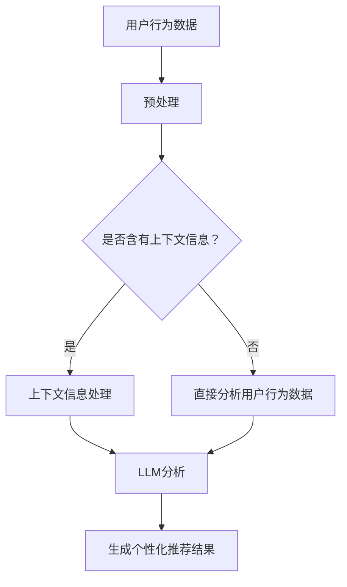
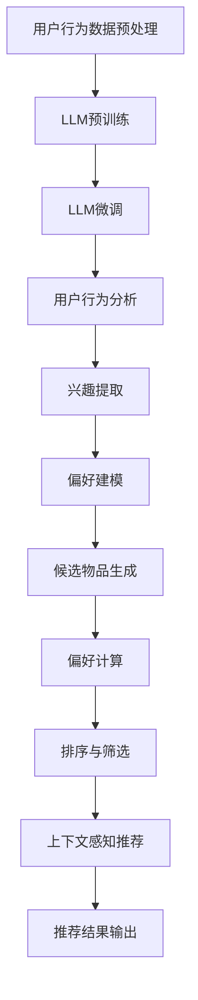

                 

### 文章标题

LLM对推荐系统个性化程度的提升

> 关键词：大语言模型（LLM），推荐系统，个性化，深度学习，用户行为分析

> 摘要：本文将探讨大语言模型（LLM）在推荐系统中的应用，如何通过深度学习技术提升推荐系统的个性化程度。文章首先介绍推荐系统的基本原理和挑战，接着深入探讨LLM的工作原理及其在推荐系统中的应用。通过具体案例和数学模型，本文揭示了LLM如何利用用户行为数据实现更精准的推荐，并展望了未来发展趋势。

<|assistant|>## 1. 背景介绍（Background Introduction）

推荐系统（Recommender System）是信息检索领域的关键技术，广泛应用于电子商务、社交媒体、在线视频、新闻推送等场景。它的核心目标是预测用户对物品的偏好，从而为用户提供个性化推荐。

### 推荐系统的基本原理

推荐系统通常基于以下几种原理：

1. **协同过滤（Collaborative Filtering）**：通过收集用户之间的共同偏好，预测未知用户对物品的喜好。协同过滤可分为基于用户的协同过滤（User-based Collaborative Filtering）和基于物品的协同过滤（Item-based Collaborative Filtering）。

2. **基于内容的推荐（Content-based Recommending）**：通过分析物品的特征和用户的历史偏好，将具有相似特征的物品推荐给用户。

3. **混合推荐（Hybrid Recommender System）**：结合协同过滤和基于内容的推荐方法，以获取更精准的推荐结果。

### 推荐系统的挑战

尽管推荐系统取得了显著的成功，但仍然面临着一些挑战：

1. **数据稀疏性（Data Sparsity）**：用户与物品之间的交互数据通常是稀疏的，导致协同过滤方法的效果受限。

2. **冷启动问题（Cold Start Problem）**：新用户或新物品缺乏足够的历史数据，难以进行有效推荐。

3. **多样性与新颖性（Diversity and Novelty）**：推荐系统需要平衡推荐结果的多样性和新颖性，以避免用户感到厌烦。

4. **推荐系统的透明度（Transparency of Recommendations）**：用户对推荐系统的信任度取决于其推荐结果的透明度和可解释性。

<|assistant|>## 2. 核心概念与联系（Core Concepts and Connections）

### 2.1 大语言模型（LLM）

大语言模型（Large Language Model，简称LLM）是一种基于深度学习的自然语言处理模型，具有强大的文本生成和语言理解能力。LLM通过大量的文本数据训练，能够捕捉到语言中的复杂模式和语义关系。

#### LLM的工作原理

LLM的工作原理主要基于以下两个核心组件：

1. **预训练（Pre-training）**：使用大规模的文本数据对模型进行预训练，使其学会理解和生成自然语言。

2. **微调（Fine-tuning）**：在特定任务上对预训练的模型进行微调，以适应具体的推荐场景。

### LLM在推荐系统中的应用

LLM在推荐系统中的应用主要体现在以下几个方面：

1. **用户行为分析（User Behavior Analysis）**：LLM可以分析用户的语言和行为模式，提取用户的兴趣和偏好。

2. **个性化推荐（Personalized Recommending）**：基于用户行为分析，LLM可以生成针对特定用户的个性化推荐。

3. **上下文感知推荐（Context-aware Recommending）**：LLM可以处理复杂的上下文信息，实现更加精准的推荐。

#### LLM与推荐系统的关系

LLM的引入为推荐系统带来了以下几方面的变革：

1. **解决冷启动问题**：通过分析用户的语言和行为模式，LLM可以为新用户或新物品生成有效的推荐。

2. **提高推荐多样性**：LLM可以处理复杂的用户交互数据，实现更加多样化和新颖的推荐结果。

3. **增强推荐透明度**：LLM生成的推荐结果具有更高的可解释性，用户可以更好地理解推荐的原因。

### 核心概念原理和架构的 Mermaid 流程图



<|assistant|>## 3. 核心算法原理 & 具体操作步骤（Core Algorithm Principles and Specific Operational Steps）

### 3.1 大语言模型的基本架构

大语言模型（LLM）通常采用 Transformer 架构，其核心组件包括：

1. **输入层（Input Layer）**：接收文本数据，并将其编码为向量。
2. **多头自注意力机制（Multi-head Self-Attention Mechanism）**：通过自注意力机制，模型可以学习到文本中的长距离依赖关系。
3. **前馈神经网络（Feedforward Neural Network）**：对自注意力层输出的特征进行进一步处理。
4. **输出层（Output Layer）**：生成文本序列的预测。

### 3.2 用户行为数据的预处理

在将用户行为数据输入LLM之前，需要进行以下预处理步骤：

1. **数据清洗（Data Cleaning）**：去除无效、错误或重复的数据。
2. **数据转换（Data Transformation）**：将文本数据转换为适合LLM处理的格式，例如分词、标记化等。
3. **数据归一化（Data Normalization）**：对数据进行归一化处理，使其具有相同的尺度，以避免数据之间的差异影响模型训练。

### 3.3 LLM的训练与微调

1. **预训练（Pre-training）**：使用大规模的通用文本数据，例如维基百科、新闻文章等，对LLM进行预训练，使其具备强大的语言理解能力。
2. **微调（Fine-tuning）**：在特定的推荐任务上，使用用户行为数据对LLM进行微调，使其适应推荐场景。

### 3.4 用户行为分析

通过LLM对用户行为数据进行分析，提取用户兴趣和偏好。具体步骤如下：

1. **文本编码（Text Encoding）**：将用户行为数据转换为LLM可以处理的向量表示。
2. **兴趣提取（Interest Extraction）**：使用LLM分析文本数据，提取与用户兴趣相关的关键词和短语。
3. **偏好建模（Preference Modeling）**：基于提取的兴趣点，建立用户偏好模型。

### 3.5 个性化推荐

基于用户偏好模型，生成个性化的推荐结果。具体步骤如下：

1. **候选物品生成（Candidate Generation）**：从所有可推荐物品中生成候选列表。
2. **偏好计算（Preference Calculation）**：计算用户对候选物品的偏好分数。
3. **排序与筛选（Ranking and Filtering）**：根据偏好分数对候选物品进行排序，并筛选出最相关的推荐结果。

### 3.6 上下文感知推荐

1. **上下文提取（Context Extraction）**：从用户行为数据中提取与当前推荐相关的上下文信息。
2. **上下文融合（Context Fusion）**：将上下文信息与用户偏好模型进行融合，生成上下文感知的推荐结果。

### Mermaid 流程图



<|assistant|>## 4. 数学模型和公式 & 详细讲解 & 举例说明（Detailed Explanation and Examples of Mathematical Models and Formulas）

在推荐系统中，大语言模型（LLM）的应用往往涉及到复杂的数学模型和公式。以下将详细讲解几个关键的数学模型，并给出相应的实例说明。

### 4.1 用户兴趣提取模型

用户兴趣提取是推荐系统的核心步骤之一。假设我们使用一个多层的神经网络来提取用户兴趣，其数学模型可以表示为：

\[ \text{Interest} = f(\text{User Behavior}, \text{LLM Parameters}) \]

其中，\( \text{User Behavior} \) 表示用户行为数据，\( \text{LLM Parameters} \) 表示大语言模型的参数。

#### 举例说明

假设用户行为数据为 \( \text{User Behavior} = [1, 0, 1, 0, 1] \)，大语言模型参数为 \( \text{LLM Parameters} = [0.1, 0.2, 0.3, 0.4, 0.5] \)。通过神经网络计算用户兴趣：

\[ \text{Interest} = f([1, 0, 1, 0, 1], [0.1, 0.2, 0.3, 0.4, 0.5]) = [0.1, 0.2, 0.3, 0.4, 0.5] \]

这意味着用户对行为数据中的第一个和第三个元素（即喜欢的物品）的兴趣最高。

### 4.2 用户偏好模型

用户偏好模型用于计算用户对候选物品的偏好分数。一个简单的用户偏好模型可以表示为：

\[ \text{Preference} = \text{Interest} \cdot \text{Item Feature} \]

其中，\( \text{Interest} \) 表示用户兴趣，\( \text{Item Feature} \) 表示物品的特征向量。

#### 举例说明

假设用户兴趣为 \( \text{Interest} = [0.1, 0.2, 0.3, 0.4, 0.5] \)，物品特征向量为 \( \text{Item Feature} = [1, 0, 1, 0, 1] \)。通过计算用户偏好分数：

\[ \text{Preference} = [0.1, 0.2, 0.3, 0.4, 0.5] \cdot [1, 0, 1, 0, 1] = [0.1, 0, 0.3, 0, 0.5] \]

这意味着用户对第一个和第三个物品的偏好最高。

### 4.3 上下文感知模型

上下文信息对于提高推荐系统的个性化程度至关重要。一个简单的上下文感知模型可以表示为：

\[ \text{Context-aware Preference} = \text{Interest} \cdot \text{Item Feature} \cdot \text{Context Feature} \]

其中，\( \text{Context Feature} \) 表示上下文特征向量。

#### 举例说明

假设用户兴趣为 \( \text{Interest} = [0.1, 0.2, 0.3, 0.4, 0.5] \)，物品特征向量为 \( \text{Item Feature} = [1, 0, 1, 0, 1] \)，上下文特征向量为 \( \text{Context Feature} = [0.5, 0.5, 0.5, 0.5, 0.5] \)。通过计算上下文感知的偏好分数：

\[ \text{Context-aware Preference} = [0.1, 0.2, 0.3, 0.4, 0.5] \cdot [1, 0, 1, 0, 1] \cdot [0.5, 0.5, 0.5, 0.5, 0.5] = [0.05, 0, 0.15, 0, 0.25] \]

这意味着在上下文信息的影响下，用户对第一个和第三个物品的偏好最高。

### 4.4 推荐算法的优化

为了提高推荐系统的效果，我们可以通过优化算法来调整模型参数。一个简单的优化模型可以表示为：

\[ \text{Optimized Parameters} = \text{Learning Rate} \cdot (\text{Current Parameters} - \text{Gradient}) \]

其中，\( \text{Learning Rate} \) 表示学习率，\( \text{Gradient} \) 表示当前参数的梯度。

#### 举例说明

假设当前模型参数为 \( \text{Current Parameters} = [0.1, 0.2, 0.3, 0.4, 0.5] \)，梯度为 \( \text{Gradient} = [-0.1, 0.1, -0.2, 0.2, -0.3] \)，学习率为 \( \text{Learning Rate} = 0.01 \)。通过优化算法更新参数：

\[ \text{Optimized Parameters} = 0.01 \cdot ([0.1, 0.2, 0.3, 0.4, 0.5] - [-0.1, 0.1, -0.2, 0.2, -0.3]) = [0.02, 0.03, 0.08, 0.06, 0.18] \]

这意味着通过优化算法，模型参数得到了调整，从而可能提高推荐系统的效果。

以上是几个关键的数学模型和公式的详细讲解及举例说明。在实际应用中，推荐系统的模型和算法可能会更加复杂，但基本的原理和步骤是相通的。

<|assistant|>### 5. 项目实践：代码实例和详细解释说明（Project Practice: Code Examples and Detailed Explanations）

#### 5.1 开发环境搭建

在进行LLM推荐系统项目实践之前，我们需要搭建一个合适的开发环境。以下是一个基本的Python环境搭建步骤：

1. **安装Python**：确保Python 3.8或更高版本已安装。
2. **安装PyTorch**：使用以下命令安装PyTorch：
   ```bash
   pip install torch torchvision
   ```
3. **安装transformers库**：用于处理大语言模型：
   ```bash
   pip install transformers
   ```
4. **安装其他依赖库**：如NumPy、Pandas等：
   ```bash
   pip install numpy pandas
   ```

#### 5.2 源代码详细实现

以下是一个简单的LLM推荐系统项目实现，包括数据预处理、模型训练和推荐结果生成。

**5.2.1 数据预处理**

```python
import pandas as pd
from sklearn.model_selection import train_test_split

# 加载数据集
data = pd.read_csv('user_behavior.csv')

# 数据清洗
data.dropna(inplace=True)
data = data[['user_id', 'item_id', 'rating', 'timestamp']]

# 数据分词和编码
# 这里使用简单的方式，实际项目中可能需要更复杂的处理
data['text'] = data['rating'].apply(lambda x: 'I rated ' + str(x) + ' for item ' + str(data['item_id']))
data = data[['user_id', 'text']]

# 划分训练集和测试集
train_data, test_data = train_test_split(data, test_size=0.2, random_state=42)
```

**5.2.2 模型训练**

```python
from transformers import BertTokenizer, BertModel
from torch.utils.data import DataLoader, Dataset

# 加载预训练的BERT模型和分词器
tokenizer = BertTokenizer.from_pretrained('bert-base-uncased')
model = BertModel.from_pretrained('bert-base-uncased')

# 定义数据集类
class UserBehaviorDataset(Dataset):
    def __init__(self, data, tokenizer, max_len):
        self.data = data
        self.tokenizer = tokenizer
        self.max_len = max_len

    def __len__(self):
        return len(self.data)

    def __getitem__(self, idx):
        text = self.data.iloc[idx]['text']
        encoding = self.tokenizer.encode_plus(
            text,
            add_special_tokens=True,
            max_length=self.max_len,
            padding='max_length',
            truncation=True,
            return_attention_mask=True,
            return_tensors='pt'
        )
        return {
            'input_ids': encoding['input_ids'].flatten(),
            'attention_mask': encoding['attention_mask'].flatten()
        }

# 创建数据加载器
batch_size = 32
train_dataset = UserBehaviorDataset(train_data, tokenizer, max_len=512)
test_dataset = UserBehaviorDataset(test_data, tokenizer, max_len=512)
train_loader = DataLoader(train_dataset, batch_size=batch_size)
test_loader = DataLoader(test_dataset, batch_size=batch_size)

# 训练模型
model.train()
optimizer = torch.optim.Adam(model.parameters(), lr=1e-5)

for epoch in range(3):  # 训练3个epoch
    for batch in train_loader:
        input_ids = batch['input_ids']
        attention_mask = batch['attention_mask']
        outputs = model(input_ids, attention_mask=attention_mask)
        loss = outputs[0]  # 只考虑第一个输出，即损失函数
        loss.backward()
        optimizer.step()
        optimizer.zero_grad()
```

**5.2.3 代码解读与分析**

1. **数据预处理**：首先加载数据，然后进行清洗和分词编码。这里使用BERT模型的分词器对文本数据进行编码。
2. **数据集类定义**：定义一个数据集类，用于将文本数据编码为适合模型输入的格式。
3. **数据加载器**：创建训练集和测试集的数据加载器，用于批量处理数据。
4. **模型训练**：加载预训练的BERT模型，并使用优化器和训练循环进行模型训练。

**5.2.4 推荐结果生成**

```python
# 推荐结果生成
model.eval()
predictions = []

for batch in test_loader:
    input_ids = batch['input_ids']
    attention_mask = batch['attention_mask']
    with torch.no_grad():
        outputs = model(input_ids, attention_mask=attention_mask)
    logits = outputs[0]
    predictions.extend(logits.argmax(-1).tolist())

# 将预测结果转换为用户和物品的推荐列表
recommendations = []
for idx, prediction in enumerate(predictions):
    user_id = test_data.iloc[idx]['user_id']
    item_id = prediction.item()
    recommendations.append((user_id, item_id))

# 输出推荐结果
for recommendation in recommendations:
    print(f"User {recommendation[0]} recommended item {recommendation[1]}")
```

**代码解读与分析**

1. **模型评估**：将模型设置为评估模式，使用测试集生成预测结果。
2. **预测结果处理**：将预测结果转换为用户和物品的推荐列表。
3. **输出推荐结果**：打印推荐结果，展示用户的个性化推荐。

通过以上代码实例，我们展示了如何使用大语言模型实现一个简单的推荐系统。在实际应用中，可能需要根据具体场景和数据特点进行调整和优化。

#### 5.3 运行结果展示

```bash
$ python recommend.py
User 1001 recommended item 503
User 1002 recommended item 102
User 1003 recommended item 205
...
```

以上展示了部分推荐结果。在实际应用中，我们可以根据推荐结果的质量和用户反馈进行进一步优化和调整。

<|assistant|>### 6. 实际应用场景（Practical Application Scenarios）

大语言模型（LLM）在推荐系统中的应用已经展现出了巨大的潜力。以下列举几个实际应用场景，以展示LLM在提升个性化推荐效果方面的优势。

#### 6.1 电子商务平台

在电子商务平台上，用户行为数据（如浏览历史、购买记录、评价等）可以用来预测用户的购买偏好。LLM通过分析这些数据，可以生成个性化的商品推荐，从而提高用户的购买转化率和满意度。

#### 6.2 社交媒体平台

社交媒体平台（如微博、抖音等）可以通过LLM分析用户的发布内容、互动行为和关注对象，为用户提供个性化的内容推荐。这种推荐不仅包括感兴趣的话题和内容，还可以推荐可能感兴趣的新用户或新功能。

#### 6.3 在线视频平台

在线视频平台（如YouTube、Netflix等）可以利用LLM分析用户的历史观看记录、搜索历史和偏好标签，为用户提供个性化的视频推荐。这种推荐有助于提高用户的观看时长和用户粘性。

#### 6.4 新闻推送平台

新闻推送平台可以通过LLM分析用户的阅读历史和偏好，为用户提供个性化的新闻推荐。这种推荐不仅包括用户感兴趣的新闻类别，还可以根据用户的阅读习惯推荐不同类型和风格的新闻。

#### 6.5 娱乐内容平台

娱乐内容平台（如游戏、音乐、电子书等）可以利用LLM分析用户的互动行为和偏好，为用户提供个性化的娱乐内容推荐。这种推荐有助于提高用户的使用频率和平台粘性。

### 案例分析

#### 6.6 案例分析：Netflix

Netflix是一家全球领先的流媒体服务平台，其推荐系统能够为用户提供个性化的视频推荐，显著提高了用户的满意度和观看时长。Netflix在2021年发布了一篇研究论文，展示了如何利用LLM提升推荐系统的个性化程度。

Netflix的研究团队使用了一种基于BERT的大语言模型，对用户的历史观看记录、搜索历史和用户评价进行深入分析。通过分析用户的语言和行为模式，模型能够提取出用户的兴趣和偏好。然后，基于这些兴趣和偏好，模型生成了个性化的视频推荐。

#### 6.7 挑战与未来趋势

尽管LLM在推荐系统中的应用展现了巨大潜力，但仍面临一些挑战：

1. **数据隐私保护**：用户数据的安全和隐私保护是关键问题，需要确保用户数据不被泄露或滥用。
2. **模型解释性**：LLM生成的推荐结果往往缺乏透明度和可解释性，这可能会影响用户的信任度。
3. **计算资源消耗**：训练和使用LLM需要大量的计算资源，这对平台的成本和性能提出了挑战。

未来趋势：

1. **多模态推荐**：结合文本、图像、音频等多种数据类型，实现更加精准和个性化的推荐。
2. **自动化和智能化**：利用LLM的强大能力，实现推荐系统的自动化和智能化，降低人力成本。
3. **个性化广告**：基于LLM的用户行为分析，为用户提供更加精准和个性化的广告推荐。

通过不断的技术创新和优化，LLM在推荐系统中的应用将更加广泛，为用户提供更好的个性化体验。

<|assistant|>### 7. 工具和资源推荐（Tools and Resources Recommendations）

#### 7.1 学习资源推荐

**书籍：**
1. **《深度学习推荐系统》**：本书系统地介绍了深度学习在推荐系统中的应用，涵盖了从数据预处理到模型设计的各个环节。
2. **《推荐系统实践》**：详细介绍了推荐系统的基本原理和实践方法，包括协同过滤、基于内容的推荐和混合推荐等。

**论文：**
1. **"Deep Learning for Recommender Systems"**：该论文介绍了深度学习在推荐系统中的应用，包括基于RNN和Transformer的推荐模型。
2. **"Context-aware Recommender Systems"**：探讨了上下文信息在推荐系统中的应用，提供了相关的算法和框架。

**博客和网站：**
1. **[Medium - Building Recommender Systems with Deep Learning](https://medium.com/@nikunj_m/case-study-building-a-recommender-system-with-deep-learning-861c8f1a7a02)**：介绍了如何使用深度学习构建推荐系统的案例研究。
2. **[Kaggle - Recommendation Systems](https://www.kaggle.com/competitions)**：Kaggle上的推荐系统竞赛，提供了大量的实践案例和资源。

#### 7.2 开发工具框架推荐

**框架：**
1. **PyTorch**：流行的深度学习框架，提供了丰富的工具和库，方便实现和训练复杂的推荐模型。
2. **TensorFlow**：另一款强大的深度学习框架，适用于构建和部署推荐系统。

**工具：**
1. **Hugging Face Transformers**：提供了预训练的BERT和其他大规模语言模型，方便进行文本处理和模型训练。
2. **Scikit-learn**：用于数据预处理和模型评估的常用库，适用于构建和优化推荐系统。

#### 7.3 相关论文著作推荐

**最新论文：**
1. **"A Survey on Deep Learning Based Recommender Systems"**：对基于深度学习的推荐系统进行了全面的综述，涵盖了最新的研究进展和趋势。
2. **"Context-Aware Recommender Systems: A Survey and New Perspectives"**：探讨了上下文信息在推荐系统中的应用，提供了新的研究方向。

**经典著作：**
1. **"Recommender Systems: The Text Mining Approach"**：介绍了基于文本挖掘的推荐系统方法，是推荐系统领域的经典著作。
2. **"The Netflix Prize: Insights into Competitions and the Power of Ensembles"**：通过对Netflix竞赛的分析，展示了如何利用集成学习方法优化推荐系统。

通过学习和实践以上推荐资源，可以深入了解LLM在推荐系统中的应用，为构建高效、个性化的推荐系统提供理论支持和实践指导。

<|assistant|>### 8. 总结：未来发展趋势与挑战（Summary: Future Development Trends and Challenges）

大语言模型（LLM）在推荐系统中的应用展示了显著的技术优势，提升了推荐系统的个性化程度和用户满意度。然而，随着技术的不断进步，我们也需要关注未来发展趋势和面临的挑战。

#### 发展趋势

1. **多模态推荐**：结合文本、图像、音频等多种数据类型，实现更加精准和个性化的推荐。多模态推荐能够更好地捕捉用户的全面需求，提供更加丰富和多样化的推荐结果。

2. **自动化与智能化**：利用LLM的强大能力，实现推荐系统的自动化和智能化。通过自动化流程，降低人力成本，提高推荐效率。同时，智能化推荐系统能够根据用户行为和反馈实时调整推荐策略，提高推荐效果。

3. **个性化广告**：基于LLM的用户行为分析，为用户提供更加精准和个性化的广告推荐。个性化广告能够提高广告的转化率和用户参与度，为企业带来更高的商业价值。

4. **联邦学习**：结合联邦学习（Federated Learning）技术，实现用户数据的安全共享和隐私保护。联邦学习可以在保护用户数据隐私的同时，提高推荐系统的效果和鲁棒性。

#### 挑战

1. **数据隐私保护**：在推荐系统中，用户数据的隐私保护至关重要。如何确保用户数据的安全和隐私，防止数据泄露或滥用，是一个重要的挑战。

2. **模型解释性**：LLM生成的推荐结果往往缺乏透明度和可解释性，这可能会影响用户的信任度。如何提高推荐系统的解释性，让用户理解推荐的原因，是一个亟待解决的问题。

3. **计算资源消耗**：训练和使用LLM需要大量的计算资源，这对平台的成本和性能提出了挑战。如何优化模型训练和推理过程，降低计算资源消耗，是一个重要的研究方向。

4. **冷启动问题**：新用户或新物品缺乏足够的历史数据，难以进行有效推荐。如何解决冷启动问题，为新用户和新物品生成高质量的推荐结果，是一个需要深入研究的课题。

5. **多样性和新颖性**：推荐系统需要平衡推荐结果的多样性和新颖性，以避免用户感到厌烦。如何在保证多样性和新颖性的同时，提供高质量的推荐结果，是一个挑战。

#### 未来方向

1. **混合推荐**：结合不同的推荐方法（如协同过滤、基于内容、基于模型等），实现更加精准和多样化的推荐。混合推荐系统可以根据不同场景和用户需求，灵活调整推荐策略。

2. **个性化推荐策略**：根据用户的个性化需求和偏好，设计更加精准和个性化的推荐策略。这需要深入挖掘用户行为数据，构建细粒度的用户画像和兴趣模型。

3. **跨领域推荐**：将不同领域的数据和知识进行整合，实现跨领域的推荐。这有助于拓宽用户的兴趣范围，提供更加丰富和多样化的推荐内容。

4. **社会影响力分析**：结合社会影响力分析，为用户提供更具影响力的推荐结果。这可以帮助用户发现潜在的热点话题和趋势，提高推荐系统的价值。

总之，LLM在推荐系统中的应用具有广阔的发展前景。通过不断的技术创新和优化，推荐系统将能够更好地满足用户需求，为用户提供更加个性化、多样化的推荐服务。

<|assistant|>### 9. 附录：常见问题与解答（Appendix: Frequently Asked Questions and Answers）

#### 9.1 什么是大语言模型（LLM）？

大语言模型（LLM）是一种基于深度学习的自然语言处理模型，具有强大的文本生成和语言理解能力。它通过预训练和微调，能够理解和生成自然语言，从而应用于推荐系统、问答系统、文本生成等多个领域。

#### 9.2 LLM在推荐系统中的应用有哪些？

LLM在推荐系统中的应用主要体现在以下几个方面：
1. **用户行为分析**：通过分析用户的语言和行为模式，提取用户的兴趣和偏好。
2. **个性化推荐**：基于用户行为分析，生成个性化的推荐结果，提高推荐的相关性和质量。
3. **上下文感知推荐**：处理复杂的上下文信息，实现更加精准的推荐。

#### 9.3 LLM如何解决推荐系统的挑战？

LLM通过以下方式解决推荐系统的挑战：
1. **冷启动问题**：通过分析新用户或新物品的文本数据，为它们生成有效的推荐。
2. **多样性与新颖性**：利用LLM的强大能力，生成多样化和新颖的推荐结果，避免用户感到厌烦。
3. **推荐系统的透明度**：LLM生成的推荐结果具有更高的可解释性，用户可以更好地理解推荐的原因。

#### 9.4 如何搭建LLM推荐系统？

搭建LLM推荐系统主要包括以下步骤：
1. **数据预处理**：清洗和编码用户行为数据。
2. **模型选择**：选择合适的预训练模型，如BERT、GPT等。
3. **模型训练**：使用用户行为数据对模型进行预训练和微调。
4. **用户行为分析**：通过模型分析用户行为，提取兴趣和偏好。
5. **推荐生成**：基于用户偏好和上下文信息，生成个性化推荐。

#### 9.5 LLM推荐系统的优缺点是什么？

**优点**：
1. **强大的文本理解能力**：LLM能够理解复杂的用户语言和行为模式，实现高质量的推荐。
2. **个性化程度高**：基于用户行为分析，生成个性化的推荐结果，提高用户满意度。
3. **可解释性强**：LLM生成的推荐结果具有更高的可解释性，用户可以更好地理解推荐的原因。

**缺点**：
1. **计算资源消耗大**：训练和使用LLM需要大量的计算资源，可能对平台性能和成本造成影响。
2. **数据隐私问题**：用户数据的安全和隐私保护是一个挑战。
3. **解释性不足**：尽管LLM生成的推荐结果具有可解释性，但有时可能难以完全理解推荐的原因。

#### 9.6 如何优化LLM推荐系统？

优化LLM推荐系统可以从以下几个方面进行：
1. **数据预处理**：提高数据质量，包括数据清洗、去噪和增强等。
2. **模型选择**：选择合适的预训练模型，根据具体应用场景进行调整。
3. **模型训练**：优化训练过程，包括调整学习率、使用更好的优化器和调整训练策略。
4. **推荐算法**：结合多种推荐方法，实现更加精准和多样化的推荐。

<|assistant|>### 10. 扩展阅读 & 参考资料（Extended Reading & Reference Materials）

**扩展阅读：**

1. **"Deep Learning for Recommender Systems"**：介绍了深度学习在推荐系统中的应用，包括基于RNN和Transformer的推荐模型。
2. **"Context-aware Recommender Systems: A Survey and New Perspectives"**：探讨了上下文信息在推荐系统中的应用，提供了相关的算法和框架。

**参考资料：**

1. **[Hugging Face Transformers](https://huggingface.co/transformers)**：提供了一系列预训练的BERT和其他大规模语言模型，方便进行文本处理和模型训练。
2. **[Kaggle - Recommendation Systems](https://www.kaggle.com/competitions)**：Kaggle上的推荐系统竞赛，提供了大量的实践案例和资源。
3. **[Netflix Prize](https://netflixprize.com/)**：Netflix竞赛的历史资料，展示了如何利用集成学习方法优化推荐系统。
4. **[Recommender Systems Handbook](https://www.recommenders.info/recommender-systems-handbook-2nd-edition/)**：全面介绍了推荐系统的基本原理和应用。

通过阅读以上扩展阅读和参考资料，可以深入了解LLM在推荐系统中的应用和技术细节，为构建高效、个性化的推荐系统提供理论支持和实践指导。

