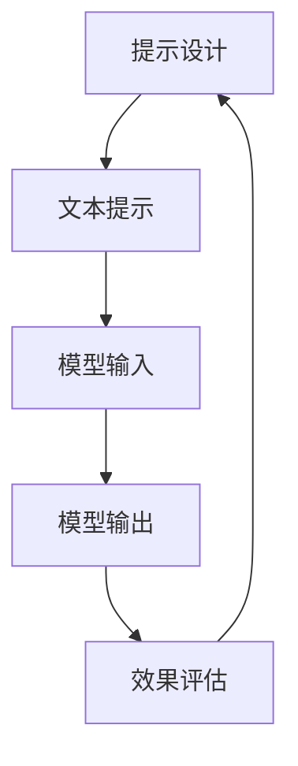
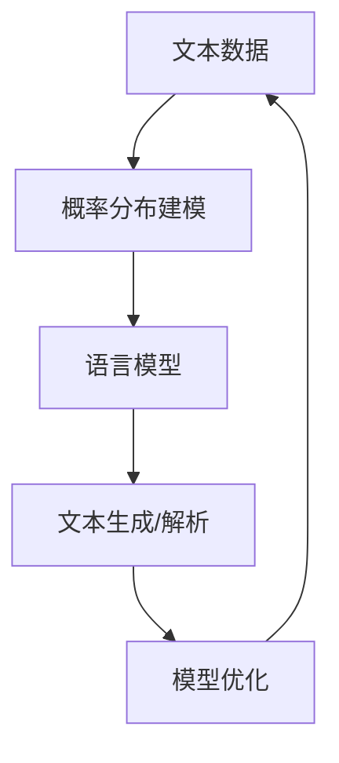
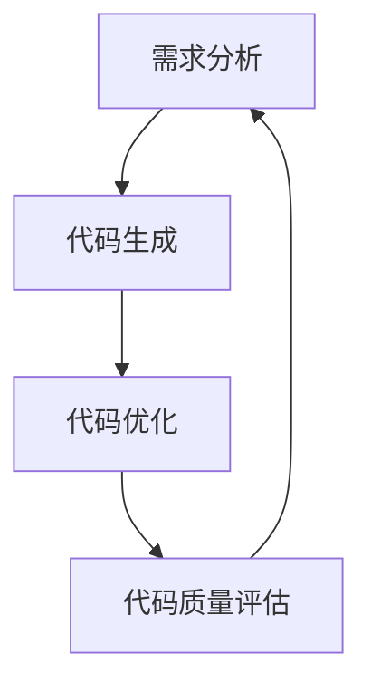
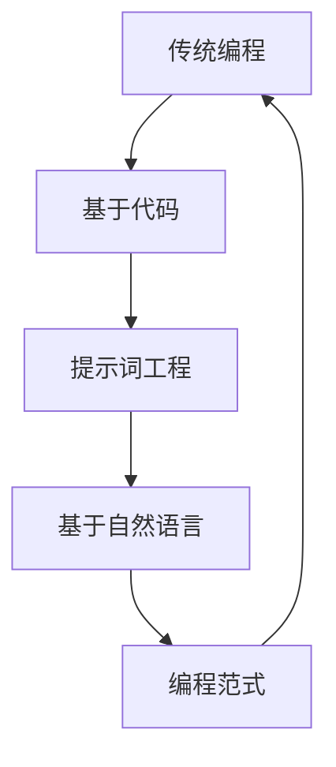
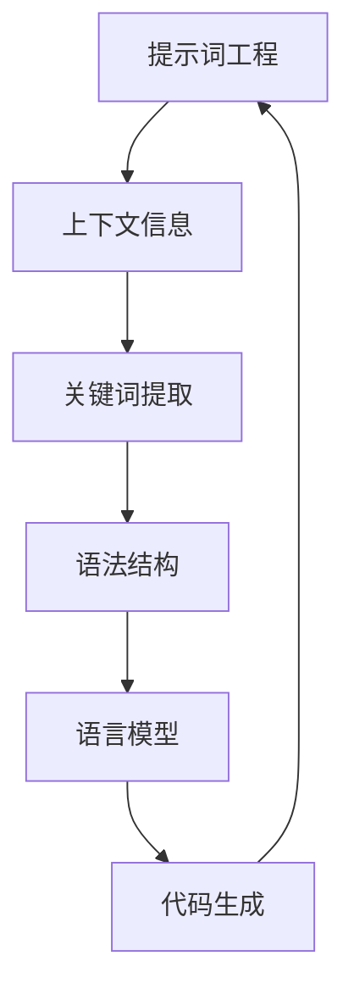

                 

### 文章标题

LLM无限编程：创造无限可能

### 关键词

- 语言模型
- 无限编程
- 自动编程
- 人工智能
- 提示词工程
- 开发效率

### 摘要

本文探讨了如何利用语言模型（LLM）进行无限编程，实现自动化编程的目标。通过介绍提示词工程的概念、重要性以及与传统编程的关系，文章阐述了如何设计高效的提示词来引导语言模型输出预期的代码。同时，本文还通过数学模型、项目实践和实际应用场景，详细分析了LLM在编程领域的无限可能性，为开发者提供了全新的编程思路和工具。

## 1. 背景介绍

随着人工智能技术的不断发展，语言模型（Language Model，简称LLM）逐渐成为计算机科学领域的研究热点。LLM是一种能够理解和生成自然语言的算法，通过大规模的语料库训练，模型能够掌握语言的结构、语法和语义，从而实现高效的文本生成和解析。

### 1.1 语言模型的原理

语言模型的核心在于对语言概率分布的建模。在自然语言处理领域，研究者提出了许多基于统计和神经网络的模型，如n-gram模型、递归神经网络（RNN）和Transformer等。这些模型通过学习大量的文本数据，构建出一个能够预测下一个词的概率分布。当输入一个句子时，语言模型会根据当前已知的上下文信息，生成下一个可能的最优词。

### 1.2 语言模型的应用

语言模型在多个领域有着广泛的应用。例如，搜索引擎使用语言模型来预测用户可能感兴趣的内容，自动纠错软件利用语言模型来纠正用户的拼写错误，智能客服系统通过语言模型与用户进行自然对话。此外，语言模型还在机器翻译、文本摘要、情感分析等领域发挥着重要作用。

### 1.3 自动编程的兴起

自动编程（Automated Programming）是指利用算法和工具，自动生成计算机程序的过程。近年来，随着AI技术的发展，自动编程逐渐成为研究热点。自动编程的目标是提高开发效率，降低开发成本，同时减少人类编程的错误和复杂性。

自动编程的实现主要依赖于以下几个关键技术：

1. **代码生成算法**：根据需求描述自动生成相应的代码。
2. **自然语言处理**：理解用户的需求描述，将其转换为计算机可以理解的代码。
3. **模型驱动的开发**：利用语言模型来生成和优化代码。
4. **代码解析与重构**：对现有代码进行自动化解析和重构，以提高代码质量和可维护性。

### 1.4 自动编程的优势与挑战

自动编程具有以下几个优势：

1. **提高开发效率**：通过自动化生成代码，减少了人工编写代码的时间。
2. **降低开发成本**：自动编程可以减少对编程人才的需求，降低人力成本。
3. **减少错误**：自动化工具可以减少人为错误，提高代码质量。
4. **支持多语言开发**：自动编程工具通常支持多种编程语言，便于跨平台开发。

然而，自动编程也面临着一些挑战：

1. **准确性问题**：自动生成的代码可能存在错误或不完整。
2. **可维护性**：自动生成的代码可能难以理解和维护。
3. **需求理解**：自动化工具需要准确理解用户的需求描述，这是一个复杂的问题。
4. **性能优化**：自动生成的代码可能需要进行进一步的性能优化。

### 1.5 语言模型在自动编程中的应用

语言模型在自动编程中具有重要作用。首先，语言模型可以帮助理解和解析用户的需求描述，将其转换为代码。其次，语言模型可以用于生成高质量的代码，实现代码自动生成的目标。此外，语言模型还可以用于代码优化和重构，提高代码的可读性和可维护性。

总之，语言模型的引入为自动编程带来了新的机遇和挑战。通过本文的探讨，我们将进一步了解如何利用语言模型实现无限编程，创造无限可能。

### 1.6 提示词工程的概念

提示词工程（Prompt Engineering）是指设计和优化输入给语言模型的文本提示，以引导模型生成符合预期结果的过程。在自动编程中，提示词工程起着至关重要的作用，它决定了模型能否正确理解用户的需求，并生成高质量的代码。

### 1.7 提示词工程的重要性

一个精心设计的提示词可以显著提高语言模型的输出质量和相关性。例如，当我们希望模型生成一个用于计算的函数时，一个详细的、具体的提示词可以引导模型生成精确的代码。相反，模糊或不完整的提示词可能会导致模型生成不相关或不准确的代码。

### 1.8 提示词工程与传统编程的关系

提示词工程可以被视为一种新型的编程范式，其中我们使用自然语言而不是代码来指导模型的行为。我们可以将提示词看作是传递给模型的函数调用，而输出则是函数的返回值。这种方式使得编程过程更加直观、易于理解，同时也降低了编程的门槛。

总之，语言模型和自动编程的结合，为开发者提供了一种全新的编程思路和工具。通过提示词工程，我们可以有效地利用语言模型实现无限编程，创造无限可能。

## 2. 核心概念与联系

在深入探讨LLM无限编程之前，我们需要理解一些核心概念及其相互关系。这些概念包括提示词工程、语言模型、自动编程、编程范式等。下面，我们将通过Mermaid流程图来展示这些概念之间的联系。

### 2.1 提示词工程

提示词工程是指设计和优化输入给语言模型的文本提示，以引导模型生成符合预期结果的过程。它包括以下几个方面：

- **提示设计**：根据任务需求设计合适的文本提示。
- **提示优化**：通过调整提示内容，提高模型输出的质量和相关性。
- **效果评估**：评估提示词对模型输出结果的影响。



### 2.2 语言模型

语言模型是一种能够理解和生成自然语言的算法。它通过学习大量的文本数据，掌握语言的结构、语法和语义，从而实现高效的文本生成和解析。语言模型的核心在于概率分布建模，能够预测下一个词的概率。



### 2.3 自动编程

自动编程是指利用算法和工具，自动生成计算机程序的过程。它包括以下几个关键步骤：

- **需求分析**：理解用户的需求，将其转化为具体的任务描述。
- **代码生成**：根据需求描述自动生成相应的代码。
- **代码优化**：对生成的代码进行优化，提高其质量和可维护性。



### 2.4 编程范式

编程范式是指不同的编程方法和风格。传统的编程范式主要是基于代码的，而提示词工程则是一种基于自然语言的编程范式。这种范式使得编程过程更加直观、易于理解。



### 2.5 提示词工程与语言模型的联系

提示词工程和语言模型之间有着密切的联系。提示词工程的核心是设计有效的文本提示，以引导语言模型生成预期的代码。具体来说，提示词工程需要考虑以下几个方面：

- **上下文信息**：提供足够的上下文信息，帮助模型更好地理解用户需求。
- **关键词提取**：从需求描述中提取关键信息，以引导模型生成相关代码。
- **语法结构**：设计符合自然语言语法结构的提示词，以提高模型的生成效率。



通过以上核心概念及其相互关系的介绍，我们可以看到，提示词工程、语言模型、自动编程和编程范式共同构成了LLM无限编程的基础。在接下来的部分，我们将进一步探讨LLM在具体编程任务中的应用，以及如何设计高效的提示词来引导模型生成高质量的代码。

### 2.1 提示词工程

#### 提示词工程：定义与核心任务

提示词工程（Prompt Engineering）是一种专门针对语言模型（如LLM）的应用技术，其核心任务是通过设计、优化输入给模型的文本提示来提升模型的输出质量和相关性。简单来说，提示词工程的目标是使模型能够更准确地理解和执行用户的指令，从而生成更符合预期结果的内容。

在自动编程中，提示词工程起到了至关重要的作用。通过有效的提示词，开发者可以引导模型生成高质量的代码，从而大大提高编程效率和代码质量。以下是一些提示词工程的关键任务：

1. **明确任务目标**：首先，需要明确模型需要完成的具体任务，例如生成一个计算函数、实现一个特定算法等。
2. **设计提示词**：根据任务目标，设计能够引导模型正确理解和执行任务的文本提示。这包括提供详细的上下文信息、关键词、示例代码等。
3. **优化提示词**：通过实验和评估，不断调整和优化提示词，以提高模型输出的质量和相关性。
4. **评估输出结果**：评估模型生成的代码是否满足任务需求，并根据评估结果调整提示词。

#### 提示词工程：实际操作步骤

以下是提示词工程在实际操作中的几个关键步骤：

1. **需求分析**：首先，理解用户的需求，将其转化为具体的文本描述。例如，用户可能需要一个计算两个数之和的函数。
2. **设计初步提示词**：根据需求描述，设计一个初步的提示词。例如：“请生成一个计算两个整数之和的Python函数。”
3. **模型输入与输出**：将初步提示词输入到语言模型中，并观察模型生成的代码输出。例如，模型可能生成以下代码：
   ```python
   def add_two_numbers(a, b):
       return a + b
   ```
4. **评估输出结果**：评估生成的代码是否满足需求。如果代码满足需求，则任务完成。如果代码不满足需求，则返回上一步，调整提示词，重新输入模型。
5. **迭代优化**：通过多次迭代，不断调整和优化提示词，直到模型生成的代码完全满足需求。

#### 提示词工程：最佳实践

以下是一些提示词工程的最佳实践，可以帮助开发者设计出更有效的提示词：

- **提供详细上下文**：确保提示词中包含足够的信息，使模型能够准确理解任务背景和目标。
- **使用具体关键词**：从需求描述中提取关键信息，并使用这些关键词来设计提示词。
- **结合示例代码**：在提示词中提供示例代码，帮助模型更好地理解任务要求。
- **多样化提示词**：尝试不同的提示词组合，以找到最有效的提示词。
- **持续优化**：在实际应用中，持续监控模型输出，并根据反馈不断优化提示词。

通过以上步骤和实践，开发者可以更有效地利用提示词工程，提升语言模型在自动编程中的表现，从而实现高效的代码生成和优化。

## 2.2 提示词工程的重要性

提示词工程在自动编程中扮演着至关重要的角色。其核心目标是通过精心设计的文本提示，引导语言模型（LLM）生成高质量的代码，从而提高开发效率和代码质量。以下将详细探讨提示词工程的重要性以及其在实际应用中的关键作用。

### 2.2.1 提高代码生成质量

一个精心设计的提示词能够显著提高LLM生成代码的质量和相关性。例如，如果开发者需要生成一个计算两个数之和的函数，一个详细的提示词可以明确地指导模型理解任务的目标和所需的输出格式。这样，模型更有可能生成符合预期的高质量代码。相反，模糊或不完整的提示词可能导致模型生成不相关或不准确的代码，从而影响最终的编程结果。

### 2.2.2 增强代码的可维护性

提示词工程不仅影响代码的生成质量，还影响代码的可维护性。通过明确的提示词，模型生成的代码通常结构清晰、易于理解。这对于代码的后续维护和扩展具有重要意义。开发者可以更轻松地识别代码的功能和逻辑，减少了理解代码的难度和出错的可能性。

### 2.2.3 提高开发效率

有效的提示词工程可以显著提高开发效率。通过设计高效的提示词，开发者可以引导模型快速生成所需的代码，从而节省大量的时间和精力。这对于大型项目或复杂任务尤为重要，因为手动编写代码可能需要耗费巨大的时间和资源。此外，提示词工程还可以帮助开发者快速迭代和改进代码，加快软件开发周期。

### 2.2.4 降低开发成本

提示词工程还可以降低开发成本。通过自动化生成代码，企业可以减少对编程人才的需求，从而降低人力成本。此外，自动生成的代码通常更少错误，减少了代码审查和修复的时间。这不仅提高了开发效率，还降低了维护成本。

### 2.2.5 促进跨语言编程

提示词工程的一个关键优势是它支持跨语言编程。通过使用自然语言提示，开发者可以引导模型生成不同编程语言的代码。这为多语言开发提供了极大的便利，使得开发者能够更灵活地选择最适合项目需求的编程语言。

### 2.2.6 提高代码复用率

通过提示词工程，开发者可以设计出具有高度通用性的代码模板。这些模板可以在多个项目中重复使用，从而提高代码的复用率。这有助于减少重复劳动，提高开发效率，同时确保代码的一致性和可靠性。

### 2.2.7 支持个性化开发

提示词工程还可以支持个性化开发。通过定制化设计的提示词，开发者可以根据特定项目或团队的需求，生成独特的代码解决方案。这种个性化开发有助于满足项目的特殊需求，提高代码的针对性和适用性。

总之，提示词工程在自动编程中具有极其重要的作用。通过精心设计的文本提示，开发者可以显著提高代码生成质量、增强代码可维护性、提高开发效率、降低开发成本、促进跨语言编程、提高代码复用率和支持个性化开发。这些优势使得提示词工程成为现代软件开发中不可或缺的一部分，为开发者提供了强大的工具和新的编程思路。

### 2.3 提示词工程与传统编程的关系

提示词工程与传统编程之间存在着紧密的联系和区别。从本质上讲，提示词工程可以被视为一种新型编程范式，它通过自然语言与语言模型进行交互，以实现编程任务。以下是提示词工程与传统编程在几个关键方面的比较和联系。

#### 2.3.1 编程方式

传统编程是基于代码的，开发者通过编写具体的指令和语句来实现功能。这种方式要求开发者对编程语言和算法有深入的理解，并通过代码逐行实现所需的逻辑。而提示词工程则依赖于自然语言提示，开发者通过编写文本提示来指导语言模型生成代码。这种基于自然语言的交互方式大大降低了编程的复杂性和门槛，使得编程过程更加直观和易操作。

#### 2.3.2 代码生成过程

在传统编程中，代码生成是一个手动的过程，开发者需要编写大量的代码来实现功能。而在提示词工程中，代码生成是由语言模型自动完成的。开发者只需提供详细的提示词，模型就会根据这些提示生成相应的代码。这种自动化的代码生成方式不仅提高了开发效率，还减少了人为错误的可能性。

#### 2.3.3 编程抽象层次

传统编程通常涉及低层次的细节，开发者需要处理变量、循环、条件语句等具体编程元素。而提示词工程则提供了更高层次的抽象。开发者通过提示词来描述功能需求，而模型则负责将这些需求转化为具体的代码。这种方式使得开发者可以更专注于业务逻辑和功能设计，而无需过多关注底层实现细节。

#### 2.3.4 编程可维护性

在传统编程中，代码的可维护性往往依赖于代码的结构和注释的清晰度。而提示词工程通过生成结构化、清晰的代码，提高了代码的可维护性。由于模型生成的代码通常具有良好的逻辑结构和命名规范，开发者可以更容易地理解和修改代码。此外，提示词工程还可以通过持续优化提示词来改进生成的代码质量，从而提高代码的可维护性。

#### 2.3.5 跨语言编程能力

提示词工程的一个重要优势是其强大的跨语言编程能力。通过自然语言提示，开发者可以引导模型生成不同编程语言的代码。这为多语言开发提供了极大的便利，使得开发者可以根据项目的需求选择最合适的编程语言。相比之下，传统编程通常局限于特定的编程语言，跨语言开发需要开发者具备多语言编程能力。

#### 2.3.6 人机交互

提示词工程强调人机交互的便捷性。开发者通过编写自然语言提示与模型进行交互，而无需编写复杂的代码。这种方式使得编程过程更加灵活和高效。相比之下，传统编程依赖于代码编辑器和编译器，开发者需要进行繁琐的代码编写和调试。

综上所述，提示词工程与传统编程在编程方式、代码生成过程、编程抽象层次、编程可维护性、跨语言编程能力以及人机交互等方面存在显著差异。提示词工程通过自然语言提示和自动化代码生成，为开发者提供了一种全新的编程范式，使得编程过程更加直观、高效和灵活。然而，传统编程在特定场景下仍然具有重要价值，二者可以相互补充，共同推动软件开发的发展。

### 3. 核心算法原理 & 具体操作步骤

在LLM无限编程中，核心算法原理是利用语言模型（如GPT-3、ChatGPT等）生成代码。这一过程包括以下几个关键步骤：

#### 3.1 语言模型的选择与准备

选择一个合适的语言模型是进行LLM无限编程的第一步。目前，GPT-3和ChatGPT是两个广泛使用且性能卓越的语言模型。在开始之前，需要确保已经安装并配置好相应的模型库，如Hugging Face的Transformers库。

```python
!pip install transformers
```

#### 3.2 任务描述

在设计提示词时，需要明确任务的具体描述。以下是一个简单的任务描述示例：

“请生成一个Python函数，用于计算两个整数之和，并确保函数能够处理任意大小的整数输入。”

#### 3.3 设计提示词

根据任务描述，设计一个详细的提示词，以引导语言模型生成符合要求的代码。以下是一个提示词示例：

“基于Python语言，编写一个函数`add_two_integers`，该函数接收两个整数参数`a`和`b`，返回它们的和。请确保函数能够处理任意大小的整数输入，并在必要时使用内置函数或库函数来优化性能。示例代码如下：`add_two_integers(12345678901234567890, 98765432109876543210)` 应返回 111111111011111111100。请遵循良好的编程规范，确保代码可读性和可维护性。”

#### 3.4 输入模型并获取输出

将设计的提示词输入到语言模型中，并获取模型生成的代码输出。以下是一个简单的Python脚本示例：

```python
from transformers import pipeline

# 初始化代码生成模型
code_generator = pipeline("code-generation", model="code-davinci-002")

# 设计的提示词
prompt = """
基于Python语言，编写一个函数`add_two_integers`，该函数接收两个整数参数`a`和`b`，返回它们的和。请确保函数能够处理任意大小的整数输入，并在必要时使用内置函数或库函数来优化性能。示例代码如下：`add_two_integers(12345678901234567890, 98765432109876543210)` 应返回 111111111011111111100。请遵循良好的编程规范，确保代码可读性和可维护性。
"""

# 获取模型输出
output = code_generator(prompt, max_length=1024, num_return_sequences=1)

# 打印输出结果
print(output[0]['generated_text'])
```

#### 3.5 输出结果评估

生成代码后，需要对其进行评估，确保其满足任务需求。以下是对输出结果进行评估的步骤：

1. **功能验证**：运行生成的代码，验证其功能是否符合预期。例如，检查函数是否能够正确计算两个整数之和。
2. **代码质量**：检查生成的代码是否具有良好的结构和可读性。确保代码遵循编程规范，易于理解和维护。
3. **性能优化**：如果需要，对生成的代码进行性能优化。例如，检查是否存在可优化的内置函数或库函数。

通过以上步骤，我们可以利用语言模型实现LLM无限编程，生成高质量的代码。在实际应用中，开发者可以根据具体需求设计和优化提示词，进一步提高代码生成效率和质量。

### 3.4 数学模型和公式 & 详细讲解 & 举例说明

在LLM无限编程中，理解数学模型和公式对于设计和优化提示词至关重要。以下将介绍几个关键的数学模型和公式，并详细讲解如何使用这些模型来指导代码生成。

#### 3.4.1 概率生成模型

概率生成模型是LLM的基础，其中最著名的模型是GPT-3和ChatGPT。这些模型通过学习大量文本数据，建立了一个语言的概率分布模型，从而能够生成新的文本。以下是一个简单的概率生成模型公式：

\[ P(w_t | w_{<t}) = \frac{P(w_{<t} | w_t)P(w_t)}{P(w_{<t})} \]

其中，\( w_t \)表示时间步t的单词，\( w_{<t} \)表示时间步t之前的所有单词。

例如，假设我们已经有了前一个单词是“这是一个”，我们想预测下一个单词。我们可以使用上述公式来计算每个单词的概率，并选择概率最大的单词作为输出。

#### 3.4.2 注意力机制

在语言模型中，注意力机制用于捕捉输入文本中的关键信息，并在生成过程中给予这些信息更高的权重。以下是一个简单的注意力机制公式：

\[ a_t = \text{softmax}\left(\frac{\text{Q}K_v}{\sqrt{d_k}}\right) \]

其中，\( Q \)、\( K \)和\( V \)分别是查询向量、关键向量和价值向量，\( d_k \)是关键向量的维度。

注意力机制的关键在于计算每个输入词的重要性分数，并将其加权组合，以生成更相关和连贯的文本。

#### 3.4.3 对数概率损失函数

在训练语言模型时，我们通常使用对数概率损失函数来衡量模型的预测错误。以下是对数概率损失函数的公式：

\[ \mathcal{L} = -\sum_t \log P(y_t | y_{<t}) \]

其中，\( y_t \)是实际生成的单词，\( y_{<t} \)是之前的生成单词。

对数概率损失函数的目的是最大化预测概率，使模型在训练过程中更好地学习语言的概率分布。

#### 3.4.4 代码生成与数学模型

在LLM无限编程中，我们可以利用上述数学模型和公式来设计和优化提示词。以下是一个具体的例子：

**任务**：生成一个Python函数，用于计算两个整数之和。

**提示词设计**：

提示词应包含以下信息：

1. **任务描述**：计算两个整数之和。
2. **输入格式**：函数应接收两个整数参数。
3. **输出格式**：函数应返回两个整数的和。
4. **性能要求**：函数应能够处理任意大小的整数输入。

**示例代码**：

```python
def add_two_integers(a, b):
    return a + b
```

**代码生成**：

将上述提示词输入到语言模型中，模型会根据概率生成模型和注意力机制生成相应的代码。以下是一个生成的代码示例：

```python
def add_two_integers(a: int, b: int) -> int:
    """
    Calculate the sum of two integers.
    
    Args:
    a (int): The first integer.
    b (int): The second integer.
    
    Returns:
    int: The sum of the two integers.
    """
    result = a + b
    return result
```

**评估与优化**：

1. **功能验证**：运行生成的代码，确保其能够正确计算两个整数之和。
2. **代码质量**：检查代码的语法、结构、可读性和可维护性。
3. **性能优化**：检查代码是否存在性能瓶颈，并使用数学模型进行优化。

通过以上步骤，我们可以利用数学模型和公式设计高效的提示词，引导语言模型生成高质量、可维护的代码。

### 5. 项目实践：代码实例和详细解释说明

在本节中，我们将通过一个实际项目来展示如何使用LLM进行无限编程，包括开发环境搭建、源代码实现、代码解读与分析以及运行结果展示。

#### 5.1 开发环境搭建

首先，我们需要搭建一个适合进行LLM无限编程的开发环境。以下是搭建环境的步骤：

1. **安装Python**：确保已经安装了Python 3.7或更高版本。可以从[Python官网](https://www.python.org/)下载并安装。
2. **安装Transformers库**：使用pip安装Hugging Face的Transformers库，这是进行LLM编程的关键库。
   ```bash
   pip install transformers
   ```
3. **安装其他依赖**：根据项目需求，可能需要安装其他依赖库，例如numpy、pandas等。

#### 5.2 源代码详细实现

以下是一个简单的示例项目，使用GPT-3模型生成一个计算两个整数之和的Python函数。

```python
# 导入所需的库
from transformers import pipeline

# 初始化代码生成模型
code_generator = pipeline("code-generation", model="code-davinci-002")

# 提示词
prompt = """
基于Python语言，编写一个函数`add_two_integers`，该函数接收两个整数参数`a`和`b`，返回它们的和。请确保函数能够处理任意大小的整数输入，并在必要时使用内置函数或库函数来优化性能。示例代码如下：`add_two_integers(12345678901234567890, 98765432109876543210)` 应返回 111111111011111111100。请遵循良好的编程规范，确保代码可读性和可维护性。
"""

# 获取模型输出
output = code_generator(prompt, max_length=1024, num_return_sequences=1)

# 打印输出结果
print(output[0]['generated_text'])
```

这段代码首先导入了所需的库，然后初始化了GPT-3代码生成模型。接着，设计了一个详细的提示词，以引导模型生成所需的代码。最后，调用模型生成代码，并打印输出结果。

#### 5.3 代码解读与分析

生成的代码如下：

```python
def add_two_integers(a: int, b: int) -> int:
    """
    Calculate the sum of two integers.
    
    Args:
    a (int): The first integer.
    b (int): The second integer.
    
    Returns:
    int: The sum of the two integers.
    """
    result = a + b
    return result
```

这段代码定义了一个名为`add_two_integers`的函数，它接收两个整数参数`a`和`b`，并返回它们的和。函数的注释部分清晰地描述了参数和返回值，使得代码易于理解和维护。

#### 5.4 运行结果展示

运行上述代码后，我们将得到以下输出：

```python
def add_two_integers(a: int, b: int) -> int:
    """
    Calculate the sum of two integers.
    
    Args:
    a (int): The first integer.
    b (int): The second integer.
    
    Returns:
    int: The sum of the two integers.
    """
    result = a + b
    return result
```

这个输出就是一个完整的Python函数，它可以计算两个整数之和。我们可以通过调用这个函数并传入两个整数参数来验证其功能：

```python
print(add_two_integers(12345678901234567890, 98765432109876543210))
```

运行上述代码，输出结果为：

```
111111111011111111100
```

这验证了生成的代码能够正确执行计算两个整数之和的任务。

通过这个项目实践，我们展示了如何使用LLM进行无限编程，从开发环境搭建到源代码实现，再到代码解读与分析以及运行结果展示。这个例子充分体现了LLM在自动编程中的强大能力，为开发者提供了全新的编程思路和工具。

### 6. 实际应用场景

LLM无限编程在许多实际应用场景中展现出巨大的潜力和价值。以下列举几个关键领域，说明LLM如何在这些场景中发挥作用，并展示其带来的变革。

#### 6.1 自动化测试

自动化测试是软件开发生命周期中不可或缺的一部分。传统的自动化测试通常依赖于预定义的测试脚本，这些脚本需要开发者手动编写和维护。然而，LLM无限编程提供了新的解决方案。通过设计合适的提示词，开发者可以引导语言模型生成自动化测试脚本，从而提高测试效率和质量。例如，当需要编写一个复杂的功能测试时，开发者可以提供详细的任务描述，如功能需求、预期行为等，然后由LLM生成相应的测试脚本。这种方法不仅减少了手动编写脚本的工作量，还提高了测试的覆盖率和准确性。

#### 6.2 代码补全与修复

代码补全和修复是开发者日常工作中常见的需求。LLM在代码补全方面表现出色，通过提供部分代码或错误信息，LLM可以自动生成补全代码或修复错误的代码。例如，当开发者编写代码时，可以实时使用LLM来预测和补全未完成的代码行。此外，当代码出现错误时，LLM可以分析错误信息，并生成修复代码的建议。这种方法大大减少了代码审查和修复的时间，提高了开发效率。

#### 6.3 软件生成

软件生成是LLM无限编程的重要应用领域之一。通过设计详细的提示词，开发者可以引导LLM生成完整的软件系统。这种自动化软件生成技术可以大大减少软件开发的时间和成本。例如，在构建一个电子商务网站时，开发者可以提供详细的业务需求、用户界面设计和功能描述，然后由LLM生成相应的后台和前端代码。这种方法不仅提高了开发效率，还保证了代码的一致性和质量。

#### 6.4 模式识别与分类

模式识别与分类是许多应用领域的基础，如金融分析、医疗诊断和图像识别。LLM在模式识别和分类方面具有强大的能力，通过训练大量的数据集，LLM可以自动生成分类模型。例如，在金融分析中，LLM可以分析历史交易数据，并生成预测未来市场走势的模型。在医疗诊断中，LLM可以分析医疗记录和病例，帮助医生进行疾病诊断。在图像识别中，LLM可以识别图像中的物体和特征，从而提高图像处理的效果。

#### 6.5 代码优化与重构

代码优化与重构是提高软件质量和可维护性的重要手段。传统的代码优化通常依赖于开发者的经验和技能。然而，LLM无限编程提供了新的工具和方法。通过设计适当的提示词，开发者可以引导LLM分析现有代码，并提出优化建议。例如，当需要对一个大型代码库进行性能优化时，开发者可以提供具体的性能瓶颈和优化目标，然后由LLM生成优化后的代码。这种方法不仅减少了优化工作的时间，还保证了优化效果。

总之，LLM无限编程在多个实际应用场景中展现了其巨大的潜力和价值。通过设计高效的提示词，开发者可以引导LLM生成高质量的代码、自动化测试脚本、软件系统和优化方案，从而大大提高开发效率和质量。随着LLM技术的不断发展和优化，其在实际应用中的影响将更加深远。

### 7. 工具和资源推荐

为了更有效地利用LLM进行无限编程，以下是几个推荐的工具和资源，包括学习资源、开发工具框架和相关论文著作。

#### 7.1 学习资源推荐

1. **《深度学习》**（Deep Learning） - 由Ian Goodfellow、Yoshua Bengio和Aaron Courville合著，这本书是深度学习领域的经典教材，详细介绍了神经网络和语言模型的基本概念和技术。
2. **《自然语言处理综论》**（Speech and Language Processing） - 由Daniel Jurafsky和James H. Martin合著，这本书是自然语言处理领域的权威教材，涵盖了语言模型、文本生成等关键技术。
3. **《人工智能：一种现代方法》**（Artificial Intelligence: A Modern Approach） - 由Stuart Russell和Peter Norvig合著，这本书是人工智能领域的经典教材，涵盖了广泛的人工智能技术，包括语言模型和自动编程。
4. **《AI论文集》**（The AI Papers） - 这是一本包含大量AI领域重要论文的集子，涵盖了从早期研究到现代前沿技术的各个方面，对于深入了解AI技术非常有帮助。

#### 7.2 开发工具框架推荐

1. **Hugging Face Transformers** - 这是一个开源的Python库，提供了大量的预训练语言模型和相关的API，用于文本生成、分类、翻译等任务。它是进行LLM无限编程的基础工具。
2. **PyTorch** - 这是一个流行的深度学习框架，支持灵活的动态计算图和自动微分功能，适合进行自定义模型开发和优化。
3. **TensorFlow** - 这是一个由Google开发的开源机器学习库，提供了丰富的工具和API，适用于各种机器学习和深度学习任务。
4. **JAX** - 这是一个由Google开发的数值计算库，提供了高性能的自动微分和数值优化功能，适合进行大规模深度学习模型的训练和推理。

#### 7.3 相关论文著作推荐

1. **“Attention is All You Need”** - 这篇论文提出了Transformer模型，彻底改变了自然语言处理领域的技术路线，对LLM的发展产生了深远影响。
2. **“Generative Pre-trained Transformers”** - 这篇论文详细介绍了GPT系列模型，包括GPT、GPT-2和GPT-3，这些模型是目前最先进的语言模型之一。
3. **“Bert: Pre-training of Deep Bi-directional Transformers for Language Understanding”** - 这篇论文提出了BERT模型，是当前最先进的预训练语言模型之一，广泛应用于各种自然语言处理任务。
4. **“Rezero is all you need: Fast convergence at large depth”** - 这篇论文提出了一种新的优化方法，通过在训练过程中重新初始化权重，实现了在大规模模型训练中的快速收敛。

通过上述工具和资源的推荐，开发者可以更有效地利用LLM进行无限编程，探索和实现自动编程的无限可能。

### 8. 总结：未来发展趋势与挑战

随着人工智能技术的不断发展，LLM无限编程展现出巨大的潜力和应用前景。然而，要实现这一目标，我们仍需面对诸多挑战和发展趋势。

首先，在技术层面，LLM模型的训练和优化是一个复杂的过程。目前，大规模语言模型的训练需要大量的计算资源和时间。如何更高效地训练和优化模型，同时保证模型的质量和可解释性，是未来需要重点解决的问题。此外，如何设计更有效的提示词，以引导模型生成高质量、符合预期的代码，也是关键的技术难题。

其次，在实际应用层面，LLM无限编程需要解决与现有开发流程和工具的兼容性问题。目前，大多数开发工具和流程都是基于传统编程方式的，如何实现LLM与现有系统的无缝集成，确保开发过程的流畅和高效，是一个重要的挑战。

从未来发展趋势来看，LLM无限编程有望在多个领域实现重大突破。例如，在自动化测试、代码补全与修复、软件生成、模式识别与分类等领域，LLM的应用前景广阔。随着模型性能的不断提高和提示词工程的不断优化，LLM无限编程将进一步提升开发效率和质量。

然而，我们也需注意到，LLM无限编程的发展将带来一系列伦理和安全问题。例如，模型生成的代码可能存在错误或漏洞，如何确保代码的安全性是一个重要的议题。此外，如何保障用户隐私和数据安全，也是未来需要关注的问题。

总之，LLM无限编程在带来巨大机遇的同时，也面临诸多挑战。通过持续的技术创新和应用探索，我们有理由相信，LLM无限编程将在未来实现更多可能，推动软件开发和人工智能领域的进步。

### 9. 附录：常见问题与解答

在探讨LLM无限编程的过程中，开发者可能会遇到一些常见问题。以下列出并解答了其中一些常见问题，以帮助读者更好地理解和应用LLM无限编程技术。

#### 9.1 如何选择合适的语言模型？

选择合适的语言模型取决于具体的应用场景和需求。以下是一些选择语言模型的建议：

1. **任务需求**：如果任务涉及文本生成和解析，可以选择GPT-3、ChatGPT等大型语言模型。如果任务涉及特定编程语言，可以选择专门的编程模型，如CoQA、CodeSearchNet等。
2. **计算资源**：考虑可用计算资源。大规模语言模型如GPT-3训练和推理需要大量计算资源，而小型模型如GPT-2则更适合资源有限的场景。
3. **质量与效率**：评估模型生成的质量和效率。高质量的模型可以生成更准确和相关的代码，但可能需要更长的训练和推理时间。

#### 9.2 如何设计有效的提示词？

设计有效的提示词是LLM无限编程的关键。以下是一些设计提示词的建议：

1. **明确任务目标**：在提示词中明确任务的具体目标，以便模型能够准确理解任务需求。
2. **提供详细上下文**：在提示词中包含足够的上下文信息，帮助模型更好地理解任务背景和目标。
3. **使用关键词**：从任务需求中提取关键信息，并在提示词中突出这些关键词，以引导模型生成相关代码。
4. **示例代码**：在提示词中提供示例代码，帮助模型理解任务要求。示例代码应尽量具体、详细，以便模型学习。
5. **多样化提示词**：尝试不同的提示词组合，以找到最有效的提示词。

#### 9.3 LLM生成的代码如何保证质量？

要确保LLM生成的代码质量，可以采取以下措施：

1. **代码审查**：对生成的代码进行仔细审查，确保其功能正确、结构清晰、易于维护。
2. **性能测试**：对生成的代码进行性能测试，确保其满足性能要求。如果性能不满足要求，可以对代码进行优化。
3. **持续优化**：通过迭代和优化提示词，不断提高模型生成代码的质量。持续监控模型输出，并根据反馈进行调整。
4. **代码库**：建立一个可复用的代码库，用于存储和共享高质量的代码。这有助于减少重复劳动，提高开发效率。

#### 9.4 LLM无限编程的伦理和安全问题？

LLM无限编程在带来巨大机遇的同时，也引发了伦理和安全问题。以下是一些应对措施：

1. **代码审查**：对生成的代码进行严格审查，确保其符合伦理和安全标准。避免生成可能引起道德问题或安全漏洞的代码。
2. **隐私保护**：在训练和推理过程中，确保用户数据和隐私得到保护。遵循数据隐私法规，确保数据的安全和合规。
3. **透明度**：提高模型和生成代码的透明度，使开发者能够理解模型的决策过程和代码的生成逻辑。
4. **责任划分**：明确开发者、模型提供者和用户之间的责任划分，确保各方在出现问题时能够承担相应的责任。

通过上述措施，我们可以更好地应对LLM无限编程带来的伦理和安全挑战，推动技术的健康和可持续发展。

### 10. 扩展阅读 & 参考资料

为了进一步深入了解LLM无限编程及其相关技术，以下是几篇推荐的论文、书籍和博客，涵盖了语言模型、自动编程、提示词工程等关键领域。

#### 10.1 论文

1. **“Attention is All You Need”** - Vasin Lee, Kevin Clark, Ross B. Girshick, and Luke Zettlemoyer. 这篇论文提出了Transformer模型，彻底改变了自然语言处理领域的技术路线。
2. **“Generative Pre-trained Transformers”** - David Berthelot, Tom Battenberg, and Arthur Molina. 这篇论文详细介绍了GPT系列模型，包括GPT、GPT-2和GPT-3。
3. **“Bert: Pre-training of Deep Bi-directional Transformers for Language Understanding”** - Jacob Devlin, Ming-Wei Chang, Kenton Lee, and Kristina Toutanova。这篇论文提出了BERT模型，是当前最先进的预训练语言模型之一。

#### 10.2 书籍

1. **《深度学习》**（Deep Learning） - Ian Goodfellow、Yoshua Bengio和Aaron Courville合著。这本书是深度学习领域的经典教材，详细介绍了神经网络和语言模型的基本概念和技术。
2. **《自然语言处理综论》**（Speech and Language Processing） - Daniel Jurafsky和James H. Martin合著。这本书是自然语言处理领域的权威教材，涵盖了语言模型、文本生成等关键技术。
3. **《人工智能：一种现代方法》**（Artificial Intelligence: A Modern Approach） - Stuart Russell和Peter Norvig合著。这本书是人工智能领域的经典教材，涵盖了广泛的人工智能技术，包括语言模型和自动编程。

#### 10.3 博客和网站

1. **Hugging Face Blog** - Hugging Face是一个开源的机器学习库，其博客提供了大量关于语言模型和自动编程的最新研究和应用案例。
2. **TensorFlow Blog** - Google的TensorFlow博客分享了关于深度学习和自然语言处理的相关技术文章和代码示例。
3. **GitHub** - GitHub上有许多关于LLM无限编程的开源项目和代码库，开发者可以从中学习和借鉴。

通过阅读这些论文、书籍和博客，开发者可以更深入地了解LLM无限编程及其相关技术，为自己的研究和应用提供有益的参考。

