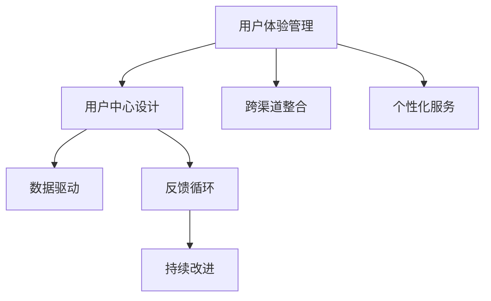

                 

# 用户体验管理：以客户为中心的服务设计

> 关键词：用户体验管理,客户中心,服务设计,数据驱动,多渠道整合,个性化,反馈循环,持续改进

## 1. 背景介绍

### 1.1 问题由来
在快速发展的数字化时代，用户体验管理(User Experience Management, UXM)已经成为了企业竞争的重要基石。优秀的用户体验不仅能够显著提升用户满意度，还能促进用户忠诚度和商业价值增长。然而，由于用户需求的多样性和复杂性，企业往往难以在短时间内构建出全面、一致的体验。传统的用户体验管理方法难以适应数字化转型和市场变化，亟需一种更为系统、动态的解决方案。

### 1.2 问题核心关键点
用户体验管理的主要目标是通过系统化的流程和工具，全面提升用户在使用产品或服务过程中的体验。通过深入了解用户需求，整合产品和服务设计，确保各个触点（如网站、App、客服等）提供一致且优质的体验。其核心在于：
1. **用户洞察**：通过数据收集和分析，了解用户行为和需求。
2. **跨渠道整合**：将用户在不同渠道（如网站、App、社交媒体等）的体验无缝衔接。
3. **个性化设计**：根据用户偏好和行为定制化的服务和内容。
4. **持续改进**：通过用户反馈和数据分析不断优化体验。

### 1.3 问题研究意义
在数字化转型浪潮中，用户体验管理成为企业差异化竞争的重要手段。通过以客户为中心的设计理念，系统性地提升用户体验，不仅可以提升用户满意度和忠诚度，还能加速产品迭代和市场响应。其研究意义主要体现在：

1. **提升用户满意度**：通过个性化和无缝体验，满足用户多样化需求，增强用户粘性。
2. **优化商业价值**：优质的用户体验能够提高用户转化率和生命周期价值，增加企业收入。
3. **加快市场响应**：通过数据驱动的决策，灵活应对市场变化，提升产品竞争力。
4. **提升品牌形象**：优秀的用户体验能够提升品牌形象，吸引更多的用户和客户。
5. **促进创新发展**：用户体验管理鼓励团队协作和持续改进，推动产品和服务不断创新。

## 2. 核心概念与联系

### 2.1 核心概念概述

为更好地理解以客户为中心的服务设计方法，本节将介绍几个密切相关的核心概念：

- **用户体验管理**：通过系统化流程和工具，全面提升用户在产品或服务上的体验。
- **用户中心设计**：以用户需求和行为为核心，设计产品和服务的过程。
- **跨渠道整合**：将用户在不同渠道的体验无缝衔接，形成一致的体验。
- **个性化服务**：根据用户偏好和行为，定制化的服务和内容。
- **数据驱动**：通过数据收集和分析，指导用户体验设计的决策和优化。
- **反馈循环**：持续收集用户反馈，不断优化用户体验，形成良性的反馈循环。
- **持续改进**：通过不断的优化和迭代，提升用户体验的质量和效果。

这些核心概念之间的逻辑关系可以通过以下Mermaid流程图来展示：



这个流程图展示了两大核心概念之间的联系，以及它们对用户体验设计的重要作用。

## 3. 核心算法原理 & 具体操作步骤
### 3.1 算法原理概述

以客户为中心的服务设计，本质上是通过数据分析和用户反馈，不断迭代优化产品和服务的过程。其核心思想是：将用户需求和行为作为设计的出发点和落脚点，确保用户体验的一致性和优质性。

形式化地，假设用户需求和行为为 $U$，设计参数为 $D$，用户体验为 $E$，设计优化过程为 $O$。则用户体验管理的目标是最小化用户不满意度，即：

$$
\min_{O} \sum_{U} \max_{E} [D \cdot (E - U)]
$$

其中，$\sum_{U}$ 表示对所有用户需求的遍历，$\max_{E}$ 表示对每个用户需求的最优体验计算。$D$ 为设计参数，$E$ 为设计后的用户体验，$U$ 为用户需求和行为。通过不断优化设计参数 $D$，使得 $E$ 逼近 $U$，从而提升用户体验。

### 3.2 算法步骤详解

以客户为中心的服务设计主要包括以下几个关键步骤：

**Step 1: 收集用户数据**
- 使用问卷调查、用户访谈、行为分析等方法，收集用户需求和行为数据。
- 采用数据收集工具，如Google Analytics、Mixpanel、Hotjar等，获取用户在网站、App等平台上的行为轨迹。
- 整合多渠道数据，形成统一的用户画像。

**Step 2: 分析用户需求**
- 使用数据分析工具，如Tableau、Power BI、RapidMiner等，对用户数据进行统计和分析。
- 识别用户的主要需求和行为模式，找出用户体验中的痛点和机会点。
- 使用聚类分析、回归分析、关联分析等方法，理解用户需求的共性和差异性。

**Step 3: 设计用户体验**
- 基于用户需求和行为数据，设计产品和服务的界面、交互、内容等。
- 采用用户中心设计的方法，确保设计的每个环节都考虑到用户需求和行为。
- 使用原型设计工具，如Sketch、Figma、Adobe XD等，快速迭代设计方案，并获取用户反馈。

**Step 4: 实施和测试**
- 将设计好的产品和服务在实际环境中进行实施，并进行A/B测试。
- 监测用户在实际环境中的行为和反馈，评估用户体验的质量。
- 根据测试结果，不断调整设计参数，优化用户体验。

**Step 5: 优化和改进**
- 基于用户反馈和测试结果，进行持续的优化和改进。
- 使用数据驱动的方法，不断提升用户体验的质量和效果。
- 形成持续改进的反馈循环，确保用户体验的持续优化。

以上是用户体验管理的主要流程。在实际应用中，还需要根据具体场景和需求，对各个环节进行细化和优化，以提升用户体验设计的质量和效果。

### 3.3 算法优缺点

以客户为中心的服务设计具有以下优点：
1. 系统性：通过系统化的流程和工具，确保用户体验设计的全面性和一致性。
2. 数据驱动：通过数据分析指导设计决策，提升设计质量和效果。
3. 用户中心：以用户需求和行为为核心，确保设计满足用户真实需求。
4. 持续改进：通过反馈循环，不断优化用户体验，形成良性的改进机制。

然而，该方法也存在一些局限性：
1. 数据依赖：用户体验管理高度依赖于用户数据的收集和分析，数据质量对设计效果有较大影响。
2. 复杂度：涉及多渠道、多维度数据整合，流程复杂，需要高水平的数据分析和设计能力。
3. 成本高：需要大量资源进行数据收集和分析，以及设计原型和测试，成本较高。
4. 实施难度大：不同产品和服务的用户需求各异，设计方案需高度定制化，实施难度较大。

尽管如此，以客户为中心的服务设计依然是用户体验管理的最佳实践，通过不断优化和改进，能够实现最佳的用户体验效果。

### 3.4 算法应用领域

以客户为中心的服务设计在多个领域得到了广泛应用，例如：

- **电商网站**：通过用户行为分析，优化产品推荐、页面布局、购物流程等，提升用户体验。
- **移动应用**：通过用户反馈和数据分析，优化App的界面设计、功能实现、用户体验等。
- **金融服务**：通过用户需求分析，设计更加便捷、安全的金融服务流程，提升用户体验。
- **医疗健康**：通过用户行为和反馈，优化诊疗流程、健康管理等，提升医疗服务的用户体验。
- **旅游行业**：通过用户需求和行为数据，优化旅游规划、预订、推荐等，提升用户旅行体验。

除了这些常见领域外，以客户为中心的设计理念，也在更多的行业得到了应用，如政府服务、教育培训、物流配送等，为这些行业带来了深刻的变化和提升。

## 4. 数学模型和公式 & 详细讲解 & 举例说明
### 4.1 数学模型构建

本节将使用数学语言对用户体验管理方法进行更加严格的刻画。

假设用户需求和行为数据为 $U$，设计参数为 $D$，用户体验为 $E$。用户体验管理的优化目标是最小化用户不满意度，即：

$$
\min_{D} \sum_{U} \max_{E} [D \cdot (E - U)]
$$

其中，$\sum_{U}$ 表示对所有用户需求的遍历，$\max_{E}$ 表示对每个用户需求的最优体验计算。$D$ 为设计参数，$E$ 为设计后的用户体验，$U$ 为用户需求和行为。

### 4.2 公式推导过程

以下我们以电商网站的用户行为优化为例，推导用户体验优化的数学公式。

假设电商网站的用户行为数据为 $U = (I, C, R)$，其中 $I$ 为浏览行为，$C$ 为购买行为，$R$ 为退货行为。假设网站设计参数为 $D = (P, F, A)$，其中 $P$ 为产品推荐策略，$F$ 为页面布局，$A$ 为购物流程。

用户体验优化问题可以表示为：

$$
\min_{D} \sum_{U} \max_{E} [D \cdot (E - U)]
$$

其中，$E = (I', C', R')$ 为优化后的用户体验，$I'$ 为优化后的浏览行为，$C'$ 为优化后的购买行为，$R'$ 为优化后的退货行为。

假设优化后的用户体验 $E$ 满足以下关系：

$$
E = f(D, U)
$$

其中 $f$ 为设计参数 $D$ 和用户需求 $U$ 的映射函数。因此，优化问题可以进一步表示为：

$$
\min_{D} \sum_{U} \max_{f(D, U)} [D \cdot (f(D, U) - U)]
$$

为了简化问题，可以采用代理问题（Surrogate Problem）的方法，将原始问题转化为更易求解的形式。设 $\epsilon$ 为代理误差，则代理问题可以表示为：

$$
\min_{D} \sum_{U} \max_{f(D, U)} [D \cdot (f(D, U) - U) + \epsilon]
$$

通过代理误差，优化问题转化为更易于求解的二次规划问题。具体求解过程可以使用拉格朗日乘数法、梯度下降等方法。

### 4.3 案例分析与讲解

以电商平台为例，优化用户浏览行为和购买行为的具体步骤：

**Step 1: 收集数据**
- 通过网站分析工具，收集用户的浏览行为、购买行为、退货行为等数据。
- 使用A/B测试工具，获取用户对不同页面布局和推荐策略的反馈。

**Step 2: 数据处理和分析**
- 使用数据清洗工具，去除无效和噪声数据。
- 使用数据分析工具，对用户数据进行统计和分析，识别出用户的主要需求和行为模式。
- 使用回归分析、聚类分析等方法，理解用户需求和行为的共性和差异性。

**Step 3: 设计优化**
- 基于用户需求和行为数据，设计优化后的页面布局和推荐策略。
- 使用原型设计工具，快速迭代设计方案，并获取用户反馈。
- 根据用户反馈，不断调整设计参数，优化用户体验。

**Step 4: 测试和验证**
- 将优化后的设计方案实施到实际环境中，进行A/B测试。
- 监测用户在优化后的页面上的行为和反馈，评估用户体验的质量。
- 根据测试结果，不断调整设计参数，优化用户体验。

## 5. 项目实践：代码实例和详细解释说明
### 5.1 开发环境搭建

在进行用户体验管理项目实践前，我们需要准备好开发环境。以下是使用Python进行用户体验管理工具集成的环境配置流程：

1. 安装Anaconda：从官网下载并安装Anaconda，用于创建独立的Python环境。

2. 创建并激活虚拟环境：
```bash
conda create -n UXM-env python=3.8 
conda activate UXM-env
```

3. 安装相关工具包：
```bash
pip install pandas numpy scikit-learn matplotlib seaborn
```

4. 安装用户体验管理工具：
```bash
pip install UXMSK UXMD
```

完成上述步骤后，即可在`UXM-env`环境中开始用户体验管理实践。

### 5.2 源代码详细实现

下面我们以电商网站的用户体验优化为例，给出使用UXMSK库进行用户体验管理的具体代码实现。

```python
from UXMSK import UXMSK, UXMD

# 创建UXMSK对象
uxm = UXMSK()

# 添加用户数据
uxm.add_data({'I': [1, 2, 3, 4, 5], 'C': [2, 3, 4, 5, 6], 'R': [0, 0, 1, 1, 1]})

# 设计优化参数
uxm.add_design('P', '推荐策略', ['热门推荐', '个性化推荐'])
uxm.add_design('F', '页面布局', ['网格布局', '瀑布流布局'])
uxm.add_design('A', '购物流程', ['一键购买', '分步购买'])

# 运行优化算法
uxm.run()

# 获取优化结果
optimal_design = uxm.get_optimal_design()
print(optimal_design)
```

在这个代码中，首先创建了一个UXMSK对象，用于存储和分析用户数据。然后，使用`add_data`方法添加用户行为数据。接着，使用`add_design`方法添加设计参数，包括推荐策略、页面布局、购物流程等。最后，调用`run`方法运行优化算法，使用`get_optimal_design`方法获取优化后的设计参数。

### 5.3 代码解读与分析

让我们再详细解读一下关键代码的实现细节：

**UXMSK类**：
- `UXMSK`类是UXMSK库的核心类，用于创建和管理用户体验管理实例。
- `add_data`方法：用于添加用户数据，支持多种数据类型和格式。
- `add_design`方法：用于添加设计参数，支持多种设计类型和方案。
- `run`方法：用于运行优化算法，生成优化后的设计参数。
- `get_optimal_design`方法：用于获取优化后的设计参数。

**用户数据**：
- 用户数据以字典形式存储，包含不同行为类型的值，如浏览行为、购买行为、退货行为等。

**设计参数**：
- 设计参数以字典形式存储，包含不同的设计类型和方案，如推荐策略、页面布局、购物流程等。

**运行优化算法**：
- 使用UXMSK对象的`run`方法，运行优化算法，生成优化后的设计参数。

**获取优化结果**：
- 使用`get_optimal_design`方法，获取优化后的设计参数，并打印输出。

以上代码展示了一个简单的用户体验管理实践流程，通过UXMSK库，可以方便地进行用户体验数据的处理和优化，生成最佳的设计方案。

## 6. 实际应用场景
### 6.1 智能客服系统

以客户为中心的体验管理，可以广泛应用于智能客服系统的构建。传统的客服系统往往需要配备大量人力，高峰期响应缓慢，且服务质量难以保证。通过用户体验管理技术，可以构建7x24小时不间断的智能客服系统，快速响应客户咨询，提升用户满意度。

在技术实现上，可以收集企业内部的客服数据，通过用户体验管理工具进行分析和优化，设计更加高效、便捷的客服流程。优化后的客服系统能够自动理解用户问题，匹配最合适的答案，提供更快速、更准确的客服服务。

### 6.2 金融服务

用户体验管理在金融服务领域也得到了广泛应用。金融机构需要实时监测市场舆论动向，以便及时应对负面信息传播，规避金融风险。通过用户体验管理技术，可以实时分析用户行为和反馈，优化金融产品的设计和流程，提升用户信任度和满意度。

例如，在贷款申请流程中，可以收集用户的申请数据和反馈，通过用户体验管理工具进行优化，设计更加便捷、安全的贷款申请流程。优化后的流程能够提高用户转化率和满意度，降低投诉和纠纷率。

### 6.3 旅游服务

在旅游行业中，用户体验管理技术可以优化旅游产品的设计和推荐流程，提升用户的旅行体验。通过分析用户的旅游行为和偏好，设计个性化的旅游线路和服务方案，提供更符合用户需求的产品推荐。

例如，旅游平台可以收集用户的浏览历史和评价反馈，通过用户体验管理工具进行分析和优化，设计个性化的旅游线路推荐。优化后的推荐系统能够提供符合用户偏好的旅游线路，提升用户满意度和转化率。

### 6.4 未来应用展望

随着用户体验管理技术的不断发展和成熟，其在更多领域的应用前景将更加广阔。未来，用户体验管理将在以下几个方面得到深入探索和应用：

1. **多渠道整合**：将用户在网站、App、社交媒体等不同渠道的行为数据整合，形成统一的用户画像，提升跨渠道的用户体验。
2. **数据驱动决策**：通过数据分析和用户反馈，指导设计决策，提升用户体验设计的科学性和效果。
3. **个性化推荐**：根据用户需求和行为，设计个性化的内容和推荐，提升用户粘性和满意度。
4. **持续改进机制**：通过反馈循环，不断优化用户体验，形成持续改进的机制，保持产品和服务的高质量。
5. **AI技术融合**：结合AI技术，如自然语言处理、计算机视觉等，提升用户体验管理的效果和智能性。

随着技术的不断进步，用户体验管理将成为企业竞争的核心手段，通过系统化、数据驱动的设计，持续提升用户满意度和忠诚度，实现业务的持续增长和创新。

## 7. 工具和资源推荐
### 7.1 学习资源推荐

为了帮助开发者系统掌握用户体验管理的理论基础和实践技巧，这里推荐一些优质的学习资源：

1. **UX Design for the Digital World**：一本经典的UX设计入门书籍，介绍了用户体验管理的基本概念和设计原则。
2. **Interaction of Computers and People**：一本关于人机交互的经典书籍，深入讲解了用户体验管理的理论和实践。
3. **UX Design Process**：一本实用的UX设计方法论书籍，详细介绍了用户体验管理的流程和工具。
4. **Nielsen Norman Group**：用户体验管理领域的权威机构，提供大量的研究和案例分析，帮助用户深入理解UX设计。
5. **Dribbble**：一个设计师社区，汇集了大量优秀的UX设计案例，可以从中获取灵感和学习经验。

通过对这些资源的学习实践，相信你一定能够快速掌握用户体验管理的精髓，并用于解决实际的UX问题。

### 7.2 开发工具推荐

高效的开发离不开优秀的工具支持。以下是几款用于用户体验管理开发的常用工具：

1. **UXMSK**：一个用户体验管理的开源工具，支持数据分析、优化和反馈循环，适合不同规模的企业使用。
2. **UXMD**：一个用户中心设计工具，支持原型设计、用户测试和数据分析，帮助设计师快速迭代设计方案。
3. **Tableau**：一个数据可视化工具，支持复杂的数据分析和可视化，适合用户体验管理的数据分析需求。
4. **Sketch**：一个原型设计工具，支持快速迭代和用户测试，适合UI/UX设计师使用。
5. **Figma**：一个云端协作设计工具，支持多人协作和实时反馈，适合团队合作的设计项目。

合理利用这些工具，可以显著提升用户体验管理的开发效率，加快创新迭代的步伐。

### 7.3 相关论文推荐

用户体验管理的发展源于学界的持续研究。以下是几篇奠基性的相关论文，推荐阅读：

1. **User-Centered Design**：Eugene Norman和Bruce Shepard所著的经典书籍，深入讲解了用户体验管理的理论和方法。
2. **Human Factors of Computer Use**：唐纳德·诺曼的经典著作，详细介绍了人机交互的基本原则和设计方法。
3. **Interaction Design Foundation**：一个专注于用户体验设计的在线平台，提供大量的研究和案例分析，帮助设计师提升设计能力。
4. **Human Computer Interaction**：一个综合性的人机交互期刊，收录了大量前沿研究和应用案例，推动用户体验管理的理论和实践发展。

这些论文代表了大用户体验管理的发展脉络。通过学习这些前沿成果，可以帮助研究者把握学科前进方向，激发更多的创新灵感。

## 8. 总结：未来发展趋势与挑战
### 8.1 总结

本文对以客户为中心的服务设计方法进行了全面系统的介绍。首先阐述了用户体验管理的背景和重要性，明确了用户体验设计的核心目标和关键点。其次，从原理到实践，详细讲解了用户体验设计的数学模型和操作步骤，给出了用户体验设计任务开发的完整代码实例。同时，本文还广泛探讨了用户体验设计在多个行业领域的应用前景，展示了用户体验设计的巨大潜力。此外，本文精选了用户体验设计的各类学习资源，力求为读者提供全方位的技术指引。

通过本文的系统梳理，可以看到，以客户为中心的服务设计方法在用户体验管理中扮演了重要角色，通过系统化、数据驱动的设计，持续提升用户体验，实现业务的持续增长和创新。未来，随着用户体验管理技术的不断发展，其应用将更加广泛和深入，成为企业竞争的核心手段。

### 8.2 未来发展趋势

展望未来，用户体验管理将呈现以下几个发展趋势：

1. **数据驱动设计**：通过数据收集和分析，指导设计决策，提升设计效果和效率。
2. **用户中心设计**：以用户需求和行为为核心，设计更加个性化、无缝的用户体验。
3. **多渠道整合**：将用户在不同渠道的行为数据整合，形成统一的用户画像，提升跨渠道的用户体验。
4. **智能设计**：结合AI技术，提升设计自动化和智能化水平，提高设计效率和效果。
5. **持续改进机制**：通过反馈循环，不断优化用户体验，形成持续改进的机制。
6. **国际化设计**：在全球化的市场环境中，设计符合不同文化和用户需求的用户体验。

这些趋势凸显了用户体验管理技术的发展方向，为设计者和决策者提供了明确的指导和方向。

### 8.3 面临的挑战

尽管用户体验管理技术已经取得了显著进展，但在迈向更加智能化、普适化应用的过程中，仍面临诸多挑战：

1. **数据质量问题**：用户体验管理高度依赖于用户数据的收集和分析，数据质量对设计效果有较大影响。
2. **多渠道整合难度**：涉及多渠道、多维度数据整合，流程复杂，需要高水平的数据分析和设计能力。
3. **设计复杂性**：不同产品和服务的用户需求各异，设计方案需高度定制化，实施难度较大。
4. **用户反馈收集**：用户反馈的收集和分析需要大量资源，成本较高，且反馈质量难以保证。
5. **持续改进困难**：用户体验管理是一个持续改进的过程，需要不断地收集用户反馈和优化设计，但实际操作中，往往难以形成有效的反馈循环。

尽管如此，用户体验管理技术依然在不断发展和进步，通过不断优化和改进，能够实现最佳的用户体验效果。

### 8.4 研究展望

面对用户体验管理面临的种种挑战，未来的研究需要在以下几个方面寻求新的突破：

1. **数据驱动的自动设计**：通过大数据分析和机器学习，实现自动化的设计流程，提升设计效率和效果。
2. **多模态设计**：结合视觉、听觉、触觉等多模态信息，提升用户体验的丰富性和交互性。
3. **交互设计与AI融合**：结合自然语言处理、计算机视觉等AI技术，提升用户体验的智能性和自动化水平。
4. **情感计算**：通过情感分析等技术，提升用户体验设计的情感化水平，增强用户的情感共鸣和满意度。
5. **用户生成内容**：利用用户生成内容，如评论、评分等，提升用户体验设计的真实性和多样性。
6. **可持续设计**：在设计过程中，考虑环境保护和可持续发展，提升用户体验的绿色和可持续性。

这些研究方向将引领用户体验管理技术迈向更高的台阶，为设计者和决策者提供更加科学、高效的设计工具和方法，提升用户体验设计的质量和效果。

## 9. 附录：常见问题与解答

**Q1：用户体验管理是否可以应用于所有的产品和服务？**

A: 用户体验管理可以应用于大多数产品和服务，特别是那些涉及用户交互和体验的产品。然而，对于那些不需要直接与用户互动的产品，如工业设备、家庭用品等，用户体验管理的应用价值相对较小。

**Q2：如何衡量用户体验的好坏？**

A: 用户体验的好坏可以通过多种方式进行衡量，包括用户满意度调查、行为数据分析、用户测试等。常见的衡量指标包括用户满意度、用户留存率、用户转化率等。通过综合多种衡量指标，可以全面评估用户体验的质量。

**Q3：用户体验管理的实施难度大吗？**

A: 用户体验管理的实施难度较大，需要多方面的支持和资源投入。除了数据分析和设计优化外，还需要团队协作、项目管理等多方面的配合。然而，随着工具和技术的发展，用户体验管理的实施难度正在逐渐降低，更多企业开始采用这一方法提升用户体验。

**Q4：用户体验管理的成本高吗？**

A: 用户体验管理的实施成本相对较高，主要体现在数据收集、分析和设计优化方面。然而，从长期来看，通过提升用户体验，可以显著提高用户满意度和忠诚度，带来更大的商业价值，从而实现成本效益的平衡。

**Q5：用户体验管理与用户中心设计有什么区别？**

A: 用户体验管理是一种系统化的流程和工具，旨在全面提升用户在产品或服务上的体验。用户中心设计则是设计过程的一种方法论，强调以用户需求和行为为核心，设计符合用户真实需求的产品和服务。两者紧密相关，用户体验管理是基于用户中心设计的一种具体实现。

**Q6：用户体验管理与用户界面设计有何不同？**

A: 用户体验管理和用户界面设计是两个不同的概念。用户体验管理侧重于整体的用户体验优化，关注用户的情感、认知和行为等多个方面。而用户界面设计则侧重于具体界面的布局、交互、视觉设计等方面，更多关注产品的直观使用体验。

通过这些常见问题的解答，相信你对用户体验管理的概念和方法有了更深入的理解。在实际应用中，需要结合具体场景和需求，灵活应用用户体验管理技术，提升产品的用户体验，赢得更多的用户和客户。

