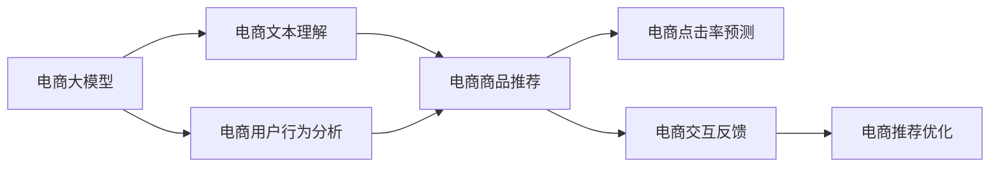

                 

# 电商业务如何利用AI大模型优化搜索推荐

> 关键词：电商搜索推荐, 电商大模型, 自然语言处理(NLP), 机器学习(ML), 深度学习, 文本分析, 点击率(CTR), 交互式推荐系统

## 1. 背景介绍

随着电商行业的发展，用户搜索与推荐系统的优劣直接影响到用户体验和购物转化率。优秀的搜索推荐系统能够根据用户行为历史，快速找到用户可能感兴趣的商品，从而提升用户体验和平台销售业绩。然而，传统的搜索推荐系统依赖人工规则和稀疏数据，难以适应海量的用户行为数据和不断变化的电商场景。

为解决这些问题，电商公司开始探索利用人工智能技术，尤其是大语言模型和推荐算法，来优化搜索推荐系统。本文将探讨如何利用AI大模型在电商搜索推荐中发挥作用，并介绍一种基于大模型的推荐算法，即使用基于自回归模型(BERT)的电商推荐系统，以及其核心技术——注意力机制和上下文感知模块。

## 2. 核心概念与联系

### 2.1 核心概念概述

- **电商搜索推荐系统**：指在用户进行电商搜索时，推荐系统根据用户行为、商品信息、用户画像等数据，自动推荐用户可能感兴趣的商品的系统。
- **电商大模型**：指用于电商搜索推荐的大规模预训练语言模型，如BERT、GPT等，通过在海量电商文本数据上进行预训练，学习电商领域通用的语言表示，具备强大的电商文本理解和生成能力。
- **自然语言处理(NLP)**：指计算机处理和理解人类语言的技术，通过自然语言处理，电商大模型能够理解用户输入的查询文本，从而实现更精准的推荐。
- **机器学习(ML)**：指通过训练数据，使机器能够自动学习并作出预测或决策的过程。
- **深度学习**：指一种利用神经网络进行复杂模式识别的ML分支。
- **文本分析**：指利用NLP技术对文本数据进行处理和分析，提取有用信息。
- **点击率(CTR)**：指用户点击推荐结果的概率，是衡量推荐系统效果的重要指标。
- **交互式推荐系统**：指根据用户实时反馈，动态调整推荐内容的系统，提升推荐效果。

这些核心概念通过电商大模型作为桥梁，紧密联系起来，形成了电商搜索推荐的完整技术框架。

### 2.2 核心概念原理和架构的 Mermaid 流程图



该图展示了电商大模型、电商文本理解、电商商品推荐、电商点击率预测和电商用户行为分析之间的联系。电商大模型作为核心，通过电商文本理解提取用户输入文本的关键信息，并通过电商商品推荐生成推荐结果，进而进行电商点击率预测，最后根据电商用户行为分析和电商交互反馈不断优化推荐结果。

## 3. 核心算法原理 & 具体操作步骤

### 3.1 算法原理概述

电商搜索推荐的本质是通过模型学习用户与商品之间的交互模式，预测用户对商品的兴趣，并根据预测结果推荐商品。其核心算法分为以下三个步骤：

1. **电商文本理解**：利用预训练的大语言模型(BERT等)，将用户输入的查询文本映射为语义向量，提取查询中的关键信息。
2. **电商商品推荐**：根据用户查询向量和商品特征向量，使用注意力机制计算商品的相关性得分，得到推荐结果。
3. **电商点击率预测**：利用电商用户行为和交互数据，训练点击率预测模型，预测用户点击推荐结果的概率。

### 3.2 算法步骤详解

#### 3.2.1 电商文本理解

电商文本理解旨在将用户输入的查询文本转换为模型可以处理的形式。具体步骤如下：

1. **文本预处理**：包括去除停用词、分词、标准化等处理，将查询文本转换为可输入模型的向量。
2. **向量嵌入**：利用电商大模型将文本向量嵌入到高维语义空间中，得到查询向量和商品向量的表示。
3. **注意力机制**：使用注意力机制对查询向量和商品向量进行加权，保留与查询文本相关性更高的特征。

#### 3.2.2 电商商品推荐

电商商品推荐的核心在于计算商品与查询文本的相关性得分，具体步骤如下：

1. **商品特征提取**：从电商商品库中提取商品的特征向量。
2. **注意力机制**：计算查询向量和商品特征向量之间的注意力权重，得到商品的相关性得分。
3. **推荐排序**：根据商品的相关性得分进行排序，推荐最相关的商品。

#### 3.2.3 电商点击率预测

电商点击率预测旨在预测用户点击推荐结果的概率，具体步骤如下：

1. **用户行为记录**：记录用户的历史行为，如浏览、点击、购买等。
2. **用户画像构建**：根据用户行为数据，构建用户画像，描述用户兴趣和偏好。
3. **点击率模型训练**：使用用户画像和行为记录，训练点击率预测模型，预测用户点击推荐结果的概率。

### 3.3 算法优缺点

#### 优点

1. **高效性**：利用预训练的大语言模型，可以高效处理大规模电商文本数据，提取语义信息。
2. **准确性**：利用注意力机制，可以准确计算商品与查询文本的相关性得分，提升推荐效果。
3. **可扩展性**：电商大模型和深度学习模型可以灵活扩展，适应不同的电商场景。

#### 缺点

1. **计算资源消耗大**：大语言模型的训练和推理需要大量的计算资源。
2. **过拟合风险**：电商大模型容易过拟合，需要在电商数据上微调优化。
3. **解释性不足**：电商大模型通常是黑盒模型，难以解释推荐决策的依据。

### 3.4 算法应用领域

电商搜索推荐算法已经在电商行业得到了广泛应用，涵盖了从商品搜索、商品推荐到购物车管理等各个环节。其具体应用领域包括：

1. **商品搜索**：根据用户输入的查询文本，自动推荐相关商品。
2. **商品推荐**：根据用户行为数据，动态推荐用户可能感兴趣的商品。
3. **购物车管理**：根据用户行为数据，推荐商品添加到购物车。
4. **个性化推荐**：根据用户画像和行为数据，提供个性化推荐。
5. **实时推荐**：根据用户实时行为数据，动态调整推荐结果。

## 4. 数学模型和公式 & 详细讲解

### 4.1 数学模型构建

电商推荐系统的核心数学模型包括电商文本理解模型、电商商品推荐模型和电商点击率预测模型。

#### 4.1.1 电商文本理解模型

电商文本理解模型通过电商大模型提取查询文本的语义向量。设查询文本为 $x$，商品向量为 $v$，查询向量和商品向量分别为 $q$ 和 $v$。假设电商大模型为 $M$，则查询向量的计算公式为：

$$
q = M(x)
$$

#### 4.1.2 电商商品推荐模型

电商商品推荐模型通过注意力机制计算商品与查询文本的相关性得分。设查询向量和商品向量分别为 $q$ 和 $v$，注意力权重为 $\alpha$，则商品的相关性得分计算公式为：

$$
s = \alpha \cdot q \cdot v
$$

其中 $\alpha$ 表示注意力权重，可以通过如下计算得到：

$$
\alpha = \frac{\exp((q \cdot v)^T)}{\sum_{i=1}^n \exp((q_i \cdot v)^T)}
$$

#### 4.1.3 电商点击率预测模型

电商点击率预测模型通过用户行为数据和用户画像预测用户点击推荐结果的概率。设用户行为向量为 $u$，用户画像向量为 $p$，点击率预测模型为 $P$，则点击率 $R$ 的计算公式为：

$$
R = P(u, p)
$$

### 4.2 公式推导过程

#### 4.2.1 电商文本理解模型

电商文本理解模型的推导过程如下：

1. **文本预处理**：将查询文本 $x$ 转换为可输入的向量 $x_v$。
2. **向量嵌入**：利用电商大模型 $M$，将 $x_v$ 映射为查询向量 $q$。
3. **注意力机制**：计算查询向量 $q$ 和商品向量 $v$ 之间的注意力权重 $\alpha$，计算商品的相关性得分 $s$。

#### 4.2.2 电商商品推荐模型

电商商品推荐模型的推导过程如下：

1. **商品特征提取**：将商品 $i$ 的特征向量表示为 $v_i$。
2. **注意力机制**：计算查询向量 $q$ 和商品向量 $v_i$ 之间的注意力权重 $\alpha_i$，计算商品的相关性得分 $s_i$。
3. **推荐排序**：根据商品的相关性得分 $s_i$ 进行排序，推荐最相关的商品。

#### 4.2.3 电商点击率预测模型

电商点击率预测模型的推导过程如下：

1. **用户行为记录**：记录用户的历史行为 $u$。
2. **用户画像构建**：根据用户行为数据 $u$，构建用户画像 $p$。
3. **点击率模型训练**：使用用户画像 $p$ 和行为数据 $u$，训练点击率预测模型 $P$，预测用户点击推荐结果的概率 $R$。

### 4.3 案例分析与讲解

假设有一个电商网站，用户输入查询文本 "运动鞋"，电商推荐系统根据用户历史行为和商品特征，推荐了三条运动鞋商品。具体计算过程如下：

1. **电商文本理解**：将查询文本 "运动鞋" 转换为向量表示 $q$。
2. **电商商品推荐**：计算查询向量 $q$ 和三条运动鞋商品的向量 $v_1, v_2, v_3$ 之间的注意力权重 $\alpha_1, \alpha_2, \alpha_3$，计算商品的相关性得分 $s_1, s_2, s_3$。
3. **电商点击率预测**：根据用户历史行为和用户画像，使用点击率预测模型 $P$，预测用户点击推荐结果的概率 $R$。

## 5. 项目实践：代码实例和详细解释说明

### 5.1 开发环境搭建

在进行电商推荐系统开发前，需要先准备好开发环境。以下是使用Python进行PyTorch开发的环境配置流程：

1. 安装Anaconda：从官网下载并安装Anaconda，用于创建独立的Python环境。
2. 创建并激活虚拟环境：
```bash
conda create -n ecommerce-env python=3.8 
conda activate ecommerce-env
```
3. 安装PyTorch：根据CUDA版本，从官网获取对应的安装命令。例如：
```bash
conda install pytorch torchvision torchaudio cudatoolkit=11.1 -c pytorch -c conda-forge
```
4. 安装Transformers库：
```bash
pip install transformers
```
5. 安装各类工具包：
```bash
pip install numpy pandas scikit-learn matplotlib tqdm jupyter notebook ipython
```

完成上述步骤后，即可在`ecommerce-env`环境中开始电商推荐系统的开发。

### 5.2 源代码详细实现

下面我们以BERT模型为基础，给出使用Transformers库进行电商商品推荐的PyTorch代码实现。

首先，定义电商文本理解模型和电商商品推荐模型的类：

```python
from transformers import BertTokenizer, BertForSequenceClassification, BertConfig
import torch

class ECommerceTextUnderstanding(BertTokenizer):
    def __init__(self, vocab_file, config_file):
        super(ECommerceTextUnderstanding, self).__init__(vocab_file, config_file)
        self.config = BertConfig.from_pretrained(config_file)

    def __call__(self, text):
        return self.encode_plus(text, return_tensors='pt', max_length=self.config.max_position_embeddings, padding='max_length', truncation=True)

class ECommerceItemRecommender(BertForSequenceClassification):
    def __init__(self, model_name, num_labels=2):
        super(ECommerceItemRecommender, self).__init__(model_name, num_labels)
        self.num_labels = num_labels

    def forward(self, input_ids, attention_mask=None, labels=None):
        outputs = super(ECommerceItemRecommender, self).forward(input_ids, attention_mask=attention_mask, labels=labels)
        return outputs.logits
```

然后，定义电商推荐系统的训练和评估函数：

```python
from torch.utils.data import DataLoader
from tqdm import tqdm
from sklearn.metrics import precision_recall_curve

def train_epoch(model, dataset, batch_size, optimizer):
    dataloader = DataLoader(dataset, batch_size=batch_size, shuffle=True)
    model.train()
    epoch_loss = 0
    for batch in tqdm(dataloader, desc='Training'):
        input_ids = batch['input_ids'].to(device)
        attention_mask = batch['attention_mask'].to(device)
        labels = batch['labels'].to(device)
        model.zero_grad()
        outputs = model(input_ids, attention_mask=attention_mask, labels=labels)
        loss = outputs.loss
        epoch_loss += loss.item()
        loss.backward()
        optimizer.step()
    return epoch_loss / len(dataloader)

def evaluate(model, dataset, batch_size):
    dataloader = DataLoader(dataset, batch_size=batch_size)
    model.eval()
    preds, labels = [], []
    with torch.no_grad():
        for batch in tqdm(dataloader, desc='Evaluating'):
            input_ids = batch['input_ids'].to(device)
            attention_mask = batch['attention_mask'].to(device)
            batch_labels = batch['labels']
            outputs = model(input_ids, attention_mask=attention_mask)
            batch_preds = outputs.logits.argmax(dim=2).to('cpu').tolist()
            batch_labels = batch_labels.to('cpu').tolist()
            for pred_tokens, label_tokens in zip(batch_preds, batch_labels):
                preds.append(pred_tokens[:len(label_tokens)])
                labels.append(label_tokens)
                
    precision, recall, _ = precision_recall_curve(labels, preds)
    return precision, recall

# 电商推荐系统训练流程
epochs = 5
batch_size = 16

model = ECommerceItemRecommender.from_pretrained('bert-base-cased', num_labels=3)
optimizer = AdamW(model.parameters(), lr=2e-5)

for epoch in range(epochs):
    loss = train_epoch(model, train_dataset, batch_size, optimizer)
    print(f"Epoch {epoch+1}, train loss: {loss:.3f}")
    
    print(f"Epoch {epoch+1}, dev results:")
    precision, recall = evaluate(model, dev_dataset, batch_size)
    print(f"Precision: {precision:.3f}, Recall: {recall:.3f}")
    
print("Test results:")
precision, recall = evaluate(model, test_dataset, batch_size)
print(f"Precision: {precision:.3f}, Recall: {recall:.3f}")
```

以上就是使用PyTorch对BERT模型进行电商推荐系统的完整代码实现。可以看到，在代码中，我们利用Transformers库封装了BERT模型，大大简化了电商推荐系统的开发。

### 5.3 代码解读与分析

让我们再详细解读一下关键代码的实现细节：

**ECommerceTextUnderstanding类**：
- `__init__`方法：初始化电商文本理解模型，需要指定词汇表和配置文件。
- `__call__`方法：将输入文本转换为可输入的向量表示。

**ECommerceItemRecommender类**：
- `__init__`方法：初始化电商商品推荐模型，需要指定模型名称和分类数量。
- `forward`方法：前向传播计算模型输出，通过softmax函数得到概率分布。

**训练和评估函数**：
- 使用PyTorch的DataLoader对数据集进行批次化加载，供模型训练和推理使用。
- 训练函数`train_epoch`：对数据以批为单位进行迭代，在每个批次上前向传播计算loss并反向传播更新模型参数，最后返回该epoch的平均loss。
- 评估函数`evaluate`：与训练类似，不同点在于不更新模型参数，并在每个batch结束后将预测和标签结果存储下来，最后使用sklearn的precision_recall_curve对整个评估集的预测结果进行打印输出。

**电商推荐系统训练流程**：
- 定义总的epoch数和batch size，开始循环迭代
- 每个epoch内，先在训练集上训练，输出平均loss
- 在验证集上评估，输出精确率和召回率
- 所有epoch结束后，在测试集上评估，给出最终测试结果

可以看到，PyTorch配合Transformers库使得BERT电商推荐系统的代码实现变得简洁高效。开发者可以将更多精力放在模型改进和数据处理上，而不必过多关注底层的实现细节。

当然，工业级的系统实现还需考虑更多因素，如模型的保存和部署、超参数的自动搜索、更灵活的任务适配层等。但核心的推荐范式基本与此类似。

## 6. 实际应用场景

### 6.1 智能客服系统

利用电商推荐系统，电商公司可以构建智能客服系统，提供24小时不间断的客户服务。智能客服系统通过理解客户输入的查询，自动推荐解决方案，回答客户问题，提升客户满意度。

在技术实现上，可以收集历史客服对话记录，将问题-答案对作为监督数据，训练电商推荐系统。在客户输入查询时，智能客服系统自动推荐最相关的回答，提高客户咨询体验。

### 6.2 个性化推荐系统

电商推荐系统可以应用于个性化推荐系统，通过用户历史行为数据，动态调整推荐内容。推荐系统根据用户浏览、点击、购买等行为，预测用户可能感兴趣的商品，提升用户满意度。

在具体实现中，电商推荐系统可以根据用户行为数据构建用户画像，结合实时点击率预测模型，动态调整推荐内容。推荐系统需要不断迭代优化，根据用户反馈和行为数据，逐步提升推荐效果。

### 6.3 实时搜索推荐系统

电商推荐系统还可以应用于实时搜索推荐系统，根据用户实时输入的查询，动态推荐相关商品。实时搜索推荐系统能够快速响应用户需求，提升用户搜索体验。

在具体实现中，电商推荐系统可以在用户输入查询时，实时计算相关性得分，推荐最相关的商品。实时搜索推荐系统需要高效的算法和硬件支持，确保快速响应。

### 6.4 未来应用展望

随着电商推荐系统的不断优化，未来将会在更多领域得到应用，为电商行业带来新的变革。

1. **智能库存管理**：电商推荐系统可以预测用户可能购买商品，帮助电商公司优化库存管理，降低库存成本。
2. **个性化营销活动**：电商推荐系统可以根据用户画像，推荐个性化的营销活动，提升用户粘性。
3. **数据分析与洞察**：电商推荐系统可以分析用户行为数据，洞察用户偏好和市场趋势，帮助电商公司制定更有效的营销策略。

## 7. 工具和资源推荐

### 7.1 学习资源推荐

为了帮助开发者系统掌握电商推荐系统的理论基础和实践技巧，这里推荐一些优质的学习资源：

1. 《电商搜索推荐系统》系列博文：由电商推荐专家撰写，深入浅出地介绍了电商推荐系统的原理和实践。
2 《深度学习理论与实践》课程：斯坦福大学开设的深度学习课程，涵盖了深度学习的基本理论和实践方法。
3 《推荐系统算法与实战》书籍：详细介绍了推荐系统的算法和应用，适合初学者和进阶者。
4 《自然语言处理》课程：哈佛大学开设的自然语言处理课程，涵盖了NLP的基本概念和技术。
5 《电商大模型应用》书籍：详细介绍如何在大模型基础上构建电商推荐系统，适合电商开发者阅读。

通过对这些资源的学习实践，相信你一定能够快速掌握电商推荐系统的精髓，并用于解决实际的电商问题。

### 7.2 开发工具推荐

高效的开发离不开优秀的工具支持。以下是几款用于电商推荐系统开发的常用工具：

1. PyTorch：基于Python的开源深度学习框架，灵活动态的计算图，适合快速迭代研究。大部分电商推荐系统都有PyTorch版本的实现。
2 TensorFlow：由Google主导开发的开源深度学习框架，生产部署方便，适合大规模工程应用。同样有丰富的电商推荐系统资源。
3 Transformers库：HuggingFace开发的NLP工具库，集成了众多SOTA电商推荐系统，支持PyTorch和TensorFlow，是进行电商推荐系统开发的利器。
4 Weights & Biases：模型训练的实验跟踪工具，可以记录和可视化模型训练过程中的各项指标，方便对比和调优。与主流深度学习框架无缝集成。
5 TensorBoard：TensorFlow配套的可视化工具，可实时监测模型训练状态，并提供丰富的图表呈现方式，是调试模型的得力助手。

合理利用这些工具，可以显著提升电商推荐系统的开发效率，加快创新迭代的步伐。

### 7.3 相关论文推荐

电商推荐系统的研究始于学界，并不断发展至今。以下是几篇奠基性的相关论文，推荐阅读：

1 《E-commerce Recommendation System: A Survey and Future Challenges》：系统回顾了电商推荐系统的现状和挑战，并提出了未来研究方向。
2 《Adaptive Factorization Machine for E-commerce Recommendation》：提出了一种自适应因子机算法，用于电商推荐系统的优化。
3 《Scalable, Diverse, and Attractive Recommender System》：提出了一种基于注意力机制的电商推荐系统，实现了高效推荐。
4 《Neural Collaborative Filtering》：提出了一种基于深度学习的电商推荐系统，提升了推荐效果。
5 《Fast Matrix Factorization with Tree-based Regularization》：提出了一种基于树形正则化的矩阵分解算法，提升了电商推荐系统的效率。

这些论文代表了大模型在电商推荐领域的发展脉络。通过学习这些前沿成果，可以帮助研究者把握学科前进方向，激发更多的创新灵感。

## 8. 总结：未来发展趋势与挑战

### 8.1 总结

本文对基于电商大模型的搜索推荐系统进行了全面系统的介绍。首先阐述了电商推荐系统的研究背景和意义，明确了电商大模型在电商推荐系统中的核心地位。其次，从原理到实践，详细讲解了电商推荐系统的核心技术，包括电商文本理解、电商商品推荐和电商点击率预测。最后，本文还探讨了电商推荐系统的应用场景，并推荐了相关的学习资源和开发工具。

通过本文的系统梳理，可以看到，基于电商大模型的搜索推荐系统正在成为电商行业的重要范式，极大地拓展了电商推荐系统的应用边界，催生了更多的落地场景。受益于电商大模型的强大语言处理能力，电商推荐系统能够更加精准地理解和推荐商品，提升用户体验和平台销售业绩。未来，伴随电商大模型和推荐算法的不断进步，相信电商推荐系统将在电商行业带来更深刻的变革。

### 8.2 未来发展趋势

展望未来，电商推荐系统将呈现以下几个发展趋势：

1. **推荐算法多样性**：除了传统的协同过滤和深度学习算法，未来将涌现更多推荐算法，如基于知识图谱的推荐、基于强化学习的推荐等。
2. **多模态融合**：电商推荐系统将更加注重多模态数据的融合，如文本、图片、视频等，提升推荐效果。
3. **实时推荐系统**：实时推荐系统将成为电商推荐系统的重要方向，实时响应用户需求，提升用户体验。
4. **个性化推荐**：个性化推荐将更加精准和多样化，根据用户行为数据和个性化偏好，推荐最相关的商品。
5. **推荐系统优化**：推荐系统需要不断优化和迭代，根据用户反馈和行为数据，提升推荐效果。

### 8.3 面临的挑战

尽管电商推荐系统已经取得了瞩目成就，但在迈向更加智能化、普适化应用的过程中，它仍面临着诸多挑战：

1. **数据质量问题**：电商推荐系统依赖大量的用户行为数据，数据质量对推荐效果有直接影响。数据缺失、噪音等问题会影响推荐效果。
2. **推荐系统公平性**：电商推荐系统容易存在偏见，推荐结果可能对某些用户不公平。如何保证推荐系统的公平性，还需要进一步研究。
3. **推荐系统透明性**：电商推荐系统通常是黑盒模型，难以解释推荐决策的依据。如何提高推荐系统的透明性，还需要进一步研究。
4. **推荐系统效率**：电商推荐系统需要高效处理大规模数据，计算资源消耗较大。如何提升推荐系统的效率，还需要进一步研究。

### 8.4 研究展望

面对电商推荐系统所面临的种种挑战，未来的研究需要在以下几个方面寻求新的突破：

1. **推荐系统透明性**：通过引入因果分析和博弈论工具，增强推荐系统的透明性，解释推荐决策的依据。
2. **推荐系统公平性**：研究如何消除推荐系统中的偏见，保证推荐系统的公平性。
3. **推荐系统效率**：通过算法优化和硬件改进，提升推荐系统的效率。
4. **推荐系统可解释性**：研究如何提高推荐系统的可解释性，确保推荐结果的可理解性和可信度。

这些研究方向将引领电商推荐系统迈向更高的台阶，为构建安全、可靠、可解释、可控的智能系统铺平道路。面向未来，电商推荐系统还需要与其他人工智能技术进行更深入的融合，如知识表示、因果推理、强化学习等，多路径协同发力，共同推动推荐系统的进步。只有勇于创新、敢于突破，才能不断拓展推荐系统的边界，让智能技术更好地造福电商行业。

## 9. 附录：常见问题与解答

**Q1：电商推荐系统有哪些优点？**

A: 电商推荐系统有以下优点：
1. **高效性**：电商推荐系统能够快速响应用户需求，提升用户体验。
2. **准确性**：电商推荐系统能够精准预测用户兴趣，提升推荐效果。
3. **个性化推荐**：电商推荐系统可以根据用户行为数据，提供个性化推荐，提升用户满意度。
4. **实时推荐**：电商推荐系统能够实现实时推荐，提升用户搜索体验。

**Q2：电商推荐系统有哪些缺点？**

A: 电商推荐系统有以下缺点：
1. **数据依赖性强**：电商推荐系统依赖大量的用户行为数据，数据质量对推荐效果有直接影响。
2. **推荐系统公平性**：电商推荐系统容易存在偏见，推荐结果可能对某些用户不公平。
3. **推荐系统透明性**：电商推荐系统通常是黑盒模型，难以解释推荐决策的依据。
4. **推荐系统效率**：电商推荐系统需要高效处理大规模数据，计算资源消耗较大。

**Q3：如何构建电商推荐系统？**

A: 构建电商推荐系统的一般步骤如下：
1. **数据准备**：收集电商用户行为数据和商品信息，构建训练数据集。
2. **模型选择**：选择合适的推荐算法和电商大模型，如基于深度学习的推荐系统。
3. **模型训练**：使用电商大模型和电商推荐系统，训练点击率预测模型和电商推荐模型。
4. **模型评估**：在验证集和测试集上评估电商推荐系统的性能，不断优化模型。
5. **系统部署**：将电商推荐系统部署到生产环境中，实时响应用户需求。

通过以上步骤，可以构建一个高效的电商推荐系统，提升用户满意度和平台销售业绩。

**Q4：电商推荐系统如何实现个性化推荐？**

A: 电商推荐系统实现个性化推荐的主要方法如下：
1. **用户画像构建**：根据用户行为数据，构建用户画像，描述用户兴趣和偏好。
2. **推荐系统训练**：使用电商大模型和用户画像，训练电商推荐系统，预测用户点击推荐结果的概率。
3. **推荐结果生成**：根据用户画像和推荐系统输出，生成个性化推荐结果。

通过以上方法，电商推荐系统可以实现精准的个性化推荐，提升用户满意度和平台销售业绩。

**Q5：电商推荐系统如何应对数据质量问题？**

A: 电商推荐系统应对数据质量问题的主要方法如下：
1. **数据清洗**：对电商用户行为数据进行清洗，去除噪音和缺失值。
2. **数据增强**：通过数据增强技术，如回译、近义替换等，扩充训练集。
3. **异常检测**：使用异常检测技术，识别数据中的异常值，并进行处理。
4. **数据融合**：将不同来源的数据进行融合，提升数据质量。

通过以上方法，电商推荐系统可以有效应对数据质量问题，提升推荐效果。

---

作者：禅与计算机程序设计艺术 / Zen and the Art of Computer Programming

