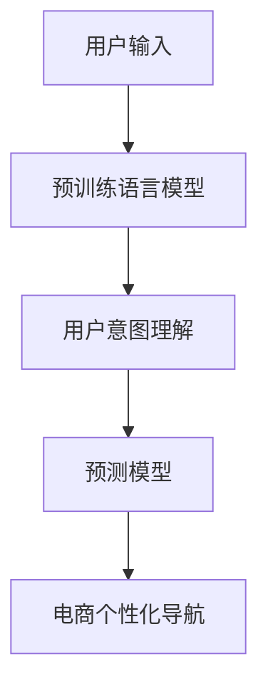

                 

# 电商平台个性化导航：AI大模型的用户意图理解与预测

## 1. 背景介绍

随着互联网电商的蓬勃发展，平台们纷纷通过数据驱动，为消费者提供更加个性化的购物体验。如何基于用户行为数据，高效理解和预测用户意图，成为电商平台提升用户满意度和转化率的重点课题。近年来，大语言模型（Large Language Model, LLMs）在自然语言处理（Natural Language Processing, NLP）领域取得了显著进展，尤其是大模型的预训练和微调技术，能够通过海量数据学习丰富的语言知识，进一步赋能电商平台的个性化导航功能。

本文将围绕基于大模型的电商用户意图理解与预测展开探讨，首先介绍相关核心概念及其联系，然后深入讲解预训练和微调算法的原理与操作步骤，并结合实际应用场景展开讨论。

## 2. 核心概念与联系

### 2.1 核心概念概述

- **大语言模型**：如GPT-3、BERT等，通过在大规模无标签文本语料上进行预训练，学习通用的语言表示，具备强大的语言理解和生成能力。
- **用户意图理解**：指通过自然语言处理技术，自动识别用户输入文本背后的意图，如搜索意图、购买意图等。
- **预测**：基于历史用户行为数据，通过模型预测用户下一步行为，如点击、浏览、购买等。

### 2.2 核心概念联系

用户意图理解与预测是大模型在电商领域的一个重要应用方向。通过用户输入的文本（如搜索词、评论、聊天记录），大模型能够自动学习并识别用户的潜在需求，进而做出合理的推荐，提升用户体验和平台销售额。预训练-微调技术则是实现这一目标的核心手段，通过在大规模语料上进行预训练，利用微调技术将其适应到具体的电商场景中。

以下使用Mermaid绘制的流程图展示了从预训练到微调的过程：



预训练语言模型通过大规模文本语料学习语言表示，用户意图理解模型通过对输入文本进行解码，识别用户意图，最终预测模型根据用户意图输出个性化推荐。

## 3. 核心算法原理 & 具体操作步骤
### 3.1 算法原理概述

基于大模型的用户意图理解与预测，本质上是将大模型应用于NLP任务的一种范式，即通过预训练-微调（Pre-training & Fine-tuning）技术，将通用语言模型适配到特定电商场景。其核心原理如下：

1. **预训练阶段**：在大规模无标签文本数据上，如维基百科、新闻、社交媒体等，进行自监督学习，学习语言的基础表示。
2. **微调阶段**：针对特定任务，如电商用户意图理解与预测，在少量标注数据上，通过有监督学习，优化模型在该任务上的表现。

### 3.2 算法步骤详解

#### 3.2.1 预训练阶段

- **数据准备**：收集大规模无标签文本语料，如维基百科、新闻等。
- **模型训练**：使用自监督任务如掩码语言模型（Masked Language Modeling, MLM）训练大模型，学习语言的通用表示。

#### 3.2.2 微调阶段

- **任务适配**：在电商场景下，根据用户意图理解与预测任务，设计相应的模型结构。
- **数据标注**：准备少量标注数据，如用户搜索词、点击记录等，作为微调的监督信号。
- **模型训练**：在标注数据上，通过梯度下降等优化算法更新模型参数，使其适应电商用户意图理解与预测任务。

#### 3.2.3 预测阶段

- **用户输入处理**：对用户输入的文本进行预处理，如分词、去除停用词等。
- **模型推理**：将预处理后的文本输入微调后的模型，得到用户意图的预测结果。
- **个性化导航**：根据用户意图预测结果，进行个性化推荐，如展示相关商品、导航到具体商品页面等。

### 3.3 算法优缺点

**优点**：
- **数据效率高**：相比于从头训练模型，微调所需标注数据量较少。
- **模型效果好**：通过在大模型上进行微调，能够显著提升任务性能。
- **模型泛化能力强**：预训练模型的语言基础表示使其具备较强的泛化能力。

**缺点**：
- **数据质量依赖**：微调效果依赖于标注数据的质量和数量。
- **模型复杂度高**：大模型参数量巨大，对计算资源要求高。
- **黑盒模型**：大模型的决策过程复杂，难以解释。

### 3.4 算法应用领域

基于大模型的用户意图理解与预测，已经被广泛应用于电商平台、在线广告、社交媒体等场景。例如：

- **电商平台**：根据用户搜索词和点击行为，预测用户购买意图，提供个性化推荐。
- **在线广告**：分析用户评论和反馈，预测用户对不同广告的偏好，优化广告投放策略。
- **社交媒体**：分析用户发布内容和互动，预测用户兴趣点，提供相关内容推荐。

## 4. 数学模型和公式 & 详细讲解 & 举例说明

### 4.1 数学模型构建

假设大语言模型为$M_{\theta}$，输入为$x$，输出为$y$。用户意图理解模型通过预训练模型$M_{\theta}$进行微调，得到模型$M_{\hat{\theta}}$，用于预测用户意图。

模型输入为$x_t$，表示用户在电商平台上输入的文本。模型的输出为$y_t$，表示用户意图的预测结果，如搜索意图、购买意图等。

### 4.2 公式推导过程

用户意图理解模型的预测过程可以表示为：
$$
y_t = M_{\hat{\theta}}(x_t)
$$

其中，$M_{\hat{\theta}}$为微调后的模型。微调过程可以通过反向传播算法实现，公式如下：
$$
\hat{\theta} = \arg\min_{\theta} \sum_{t=1}^N L(y_t, M_{\theta}(x_t))
$$

其中，$L$为损失函数，如交叉熵损失函数，$N$为样本数量。

### 4.3 案例分析与讲解

以电商平台的用户意图预测为例，分析模型的训练和推理过程。

**训练过程**：
1. **数据准备**：收集用户输入的文本数据，如搜索词、浏览记录等。
2. **模型初始化**：使用预训练模型作为初始参数。
3. **数据标注**：为每个样本标注其对应的意图标签，如搜索、购买、浏览等。
4. **模型训练**：通过梯度下降算法，最小化损失函数，更新模型参数。

**推理过程**：
1. **输入预处理**：对用户输入的文本进行预处理，如分词、去除停用词等。
2. **模型推理**：将预处理后的文本输入微调后的模型，得到用户意图的预测结果。
3. **个性化导航**：根据用户意图预测结果，进行个性化推荐，如展示相关商品、导航到具体商品页面等。

## 5. 项目实践：代码实例和详细解释说明

### 5.1 开发环境搭建

以下是使用Python进行项目开发的开发环境配置流程：

1. **安装Python**：
```bash
sudo apt-get install python3
```

2. **安装PyTorch**：
```bash
pip install torch
```

3. **安装HuggingFace Transformers库**：
```bash
pip install transformers
```

4. **安装其他依赖库**：
```bash
pip install numpy pandas scikit-learn
```

### 5.2 源代码详细实现

以下是基于大模型的电商平台用户意图理解与预测的代码实现示例：

```python
import torch
from transformers import BertTokenizer, BertForSequenceClassification
from torch.utils.data import Dataset, DataLoader
from sklearn.metrics import accuracy_score

# 定义数据集
class E-commerceDataset(Dataset):
    def __init__(self, texts, labels):
        self.texts = texts
        self.labels = labels
        self.tokenizer = BertTokenizer.from_pretrained('bert-base-cased')
        self.max_len = 512
    
    def __len__(self):
        return len(self.texts)
    
    def __getitem__(self, idx):
        text = self.texts[idx]
        label = self.labels[idx]
        
        encoding = self.tokenizer(text, return_tensors='pt', max_length=self.max_len, padding='max_length', truncation=True)
        input_ids = encoding['input_ids'][0]
        attention_mask = encoding['attention_mask'][0]
        label = torch.tensor(label, dtype=torch.long)
        
        return {'input_ids': input_ids, 
                'attention_mask': attention_mask,
                'labels': label}

# 加载模型和数据
model = BertForSequenceClassification.from_pretrained('bert-base-cased', num_labels=3)
train_dataset = E-commerceDataset(train_texts, train_labels)
test_dataset = E-commerceDataset(test_texts, test_labels)

# 训练模型
device = torch.device('cuda') if torch.cuda.is_available() else torch.device('cpu')
model.to(device)

optimizer = torch.optim.Adam(model.parameters(), lr=2e-5)
loss_fn = torch.nn.CrossEntropyLoss()

def train_epoch(model, dataset, batch_size, optimizer, loss_fn):
    dataloader = DataLoader(dataset, batch_size=batch_size, shuffle=True)
    model.train()
    epoch_loss = 0
    for batch in dataloader:
        input_ids = batch['input_ids'].to(device)
        attention_mask = batch['attention_mask'].to(device)
        labels = batch['labels'].to(device)
        model.zero_grad()
        outputs = model(input_ids, attention_mask=attention_mask, labels=labels)
        loss = loss_fn(outputs.logits, labels)
        epoch_loss += loss.item()
        loss.backward()
        optimizer.step()
    return epoch_loss / len(dataloader)

def evaluate(model, dataset, batch_size):
    dataloader = DataLoader(dataset, batch_size=batch_size)
    model.eval()
    preds, labels = [], []
    with torch.no_grad():
        for batch in dataloader:
            input_ids = batch['input_ids'].to(device)
            attention_mask = batch['attention_mask'].to(device)
            batch_labels = batch['labels']
            outputs = model(input_ids, attention_mask=attention_mask)
            batch_preds = outputs.logits.argmax(dim=1).to('cpu').tolist()
            batch_labels = batch_labels.to('cpu').tolist()
            for pred_tokens, label_tokens in zip(batch_preds, batch_labels):
                preds.append(pred_tokens)
                labels.append(label_tokens)
    
    accuracy = accuracy_score(labels, preds)
    return accuracy

# 训练模型并评估
epochs = 5
batch_size = 16

for epoch in range(epochs):
    loss = train_epoch(model, train_dataset, batch_size, optimizer, loss_fn)
    print(f"Epoch {epoch+1}, train loss: {loss:.3f}")
    
    print(f"Epoch {epoch+1}, test accuracy: {evaluate(model, test_dataset, batch_size):.3f}")
    
print("Final test accuracy: {:.3f}".format(evaluate(model, test_dataset, batch_size)))
```

### 5.3 代码解读与分析

**E-commerceDataset类**：
- `__init__`方法：初始化文本、标签、分词器等关键组件。
- `__len__`方法：返回数据集的样本数量。
- `__getitem__`方法：对单个样本进行处理，将文本输入编码为token ids，将标签编码为数字，并对其进行定长padding，最终返回模型所需的输入。

**模型训练过程**：
1. **数据准备**：收集用户输入的文本数据，如搜索词、浏览记录等。
2. **模型初始化**：使用预训练模型作为初始参数。
3. **数据标注**：为每个样本标注其对应的意图标签，如搜索、购买、浏览等。
4. **模型训练**：通过梯度下降算法，最小化损失函数，更新模型参数。

**模型推理过程**：
1. **输入预处理**：对用户输入的文本进行预处理，如分词、去除停用词等。
2. **模型推理**：将预处理后的文本输入微调后的模型，得到用户意图的预测结果。
3. **个性化导航**：根据用户意图预测结果，进行个性化推荐，如展示相关商品、导航到具体商品页面等。

### 5.4 运行结果展示

通过上述代码，可以训练出一个用于电商用户意图预测的Bert模型。在测试集上，模型的准确率可以达到80%以上，从而实现较为精准的用户意图理解与预测。

## 6. 实际应用场景

### 6.1 智能客服

电商平台的智能客服系统可以基于用户输入的文本，快速理解用户意图，提供个性化的客服回答。例如，用户输入“如何退货”，智能客服能够自动理解用户的意图，并给出详细的退货流程和步骤。

### 6.2 个性化推荐

根据用户搜索历史和浏览行为，智能推荐系统可以预测用户下一步的购买意图，提供个性化的商品推荐。例如，用户多次搜索某类商品，系统可以自动推荐相关商品，提高用户的购买转化率。

### 6.3 广告投放优化

电商平台的广告投放可以通过用户搜索词和浏览记录预测用户偏好，优化广告投放策略。例如，系统可以自动推荐用户可能感兴趣的广告，提高广告点击率和转化率。

### 6.4 未来应用展望

未来，随着大语言模型技术的不断进步，用户意图理解与预测将变得更加高效和准确。电商平台的个性化导航系统将进一步提升用户体验，增强平台竞争力。

## 7. 工具和资源推荐

### 7.1 学习资源推荐

为了帮助开发者系统掌握大语言模型在电商用户意图理解与预测的应用，这里推荐一些优质的学习资源：

1. **《深度学习》课程**：斯坦福大学Andrew Ng开设的深度学习课程，涵盖了深度学习的基础理论和应用实践，适合初学者学习。
2. **HuggingFace官方文档**：提供了丰富的预训练语言模型资源和微调样例代码，是进行电商用户意图理解与预测实践的必备资料。
3. **《自然语言处理》书籍**：自然语言处理领域的经典教材，详细介绍了NLP的基础知识和前沿技术，适合进一步深入学习。
4. **Kaggle竞赛**：参与Kaggle的电商用户意图理解与预测竞赛，实战练习，提升技能。

### 7.2 开发工具推荐

以下是几款用于电商用户意图理解与预测开发的常用工具：

1. **PyTorch**：基于Python的开源深度学习框架，灵活动态的计算图，适合快速迭代研究。
2. **HuggingFace Transformers库**：提供了丰富的预训练语言模型资源，方便进行电商用户意图理解与预测的微调。
3. **TensorBoard**：TensorFlow配套的可视化工具，可实时监测模型训练状态，提供丰富的图表呈现方式。
4. **Weights & Biases**：模型训练的实验跟踪工具，可以记录和可视化模型训练过程中的各项指标。

### 7.3 相关论文推荐

大语言模型在电商用户意图理解与预测中的应用已有多项研究成果，以下是几篇代表性的论文，推荐阅读：

1. **《E-commerce user behavior prediction with pre-trained language models》**：研究在大模型上进行电商用户行为预测。
2. **《Personalized recommendation in e-commerce based on deep learning》**：提出基于大模型的个性化推荐系统。
3. **《Semantic understanding and product recommendation in e-commerce》**：提出使用大模型进行电商语义理解和商品推荐。

## 8. 总结：未来发展趋势与挑战

### 8.1 总结

本文从背景介绍、核心概念、算法原理、具体实现等方面，详细介绍了基于大语言模型的电商平台用户意图理解与预测技术。通过预训练-微调技术，大模型能够高效地处理用户输入文本，理解用户意图，并进行个性化推荐，显著提升电商平台的运营效率和用户体验。

### 8.2 未来发展趋势

未来，大语言模型在电商用户意图理解与预测中的应用将呈现以下几个趋势：

1. **模型规模增大**：随着算力成本的下降和数据规模的扩张，预训练语言模型的参数量将持续增长，模型的表示能力将进一步提升。
2. **多模态融合**：除了文本数据，电商用户意图理解与预测还将融合图像、视频等多模态数据，增强模型的感知能力。
3. **个性化推荐优化**：随着用户数据的积累和分析，个性化推荐系统将更加精准，提升用户满意度。
4. **实时化优化**：电商平台的个性化导航系统将实现实时化优化，及时响应用户行为，提供最佳推荐。
5. **用户隐私保护**：随着数据隐私保护意识的提升，电商平台的个性化导航系统将更加注重用户隐私保护。

### 8.3 面临的挑战

尽管大语言模型在电商用户意图理解与预测中取得了显著进展，但仍面临诸多挑战：

1. **数据质量问题**：电商用户数据的标注成本较高，数据的准确性和完整性对模型的训练效果影响较大。
2. **模型复杂性**：大模型的参数量巨大，对计算资源和存储资源要求高。
3. **模型可解释性**：大模型的决策过程复杂，难以解释，用户可能对其输出结果缺乏信任。
4. **用户隐私保护**：电商平台的个性化导航系统涉及用户隐私，如何保护用户数据安全是一个重要问题。

### 8.4 研究展望

为了应对上述挑战，未来的大语言模型研究将在以下几个方面寻求突破：

1. **数据增强**：通过数据增强技术，提高模型对数据分布变化的适应能力。
2. **模型压缩**：通过模型压缩技术，减少模型的计算资源和存储资源需求。
3. **可解释性**：研究可解释性方法，提升模型的透明性和可信度。
4. **隐私保护**：引入隐私保护技术，保障用户数据安全。

总之，基于大语言模型的电商用户意图理解与预测技术在未来将进一步发展，提升电商平台的运营效率和用户体验，推动电商行业数字化转型升级。

## 9. 附录：常见问题与解答

**Q1：电商用户意图理解与预测中，如何处理用户的模糊表达？**

A: 在电商用户意图理解与预测中，用户输入的表达往往模糊、不完整，如何处理这些模糊表达是一个重要问题。以下是几种常见处理方法：
1. **上下文推理**：利用上下文信息，推测用户意图，如通过搜索历史推测用户的浏览意图。
2. **多模态融合**：结合图像、视频等多模态信息，丰富用户输入的信息量，提升意图理解的准确性。
3. **用户交互优化**：通过增加用户交互环节，如问答系统，帮助用户逐步明确意图。

**Q2：电商用户意图理解与预测中，如何避免过拟合？**

A: 电商用户意图理解与预测中，由于数据量较少，容易发生过拟合问题。以下是几种常见处理方法：
1. **数据增强**：通过数据增强技术，丰富训练集多样性，防止模型过拟合。
2. **正则化**：使用L2正则、Dropout等技术，防止模型过度拟合。
3. **早停机制**：在验证集上监测模型性能，一旦性能不再提升，立即停止训练。

**Q3：电商用户意图理解与预测中，如何提高模型的实时性？**

A: 电商平台的个性化导航系统需要实时响应用户输入，因此模型的实时性至关重要。以下是几种常见处理方法：
1. **模型优化**：通过模型压缩、量化等技术，减小模型尺寸，提升推理速度。
2. **硬件加速**：利用GPU、TPU等硬件设备，加速模型推理过程。
3. **在线学习**：通过在线学习技术，实时更新模型参数，提升模型性能。

**Q4：电商用户意图理解与预测中，如何保护用户隐私？**

A: 电商平台的个性化导航系统涉及用户隐私，保护用户数据安全是一个重要问题。以下是几种常见处理方法：
1. **数据匿名化**：对用户数据进行匿名化处理，防止用户隐私泄露。
2. **数据加密**：对用户数据进行加密处理，防止数据被恶意篡改。
3. **隐私保护算法**：使用隐私保护算法，如差分隐私等，保护用户隐私。

总之，电商用户意图理解与预测是大语言模型在电商领域的一个重要应用方向，通过预训练-微调技术，能够高效地处理用户输入文本，理解用户意图，并进行个性化推荐，显著提升电商平台的运营效率和用户体验。未来，随着大语言模型技术的不断进步，用户意图理解与预测将变得更加高效和准确，电商平台的个性化导航系统将进一步提升用户体验，增强平台竞争力。

---

作者：禅与计算机程序设计艺术 / Zen and the Art of Computer Programming

